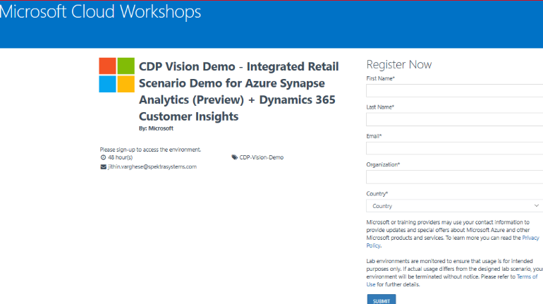
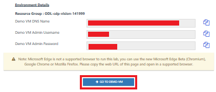
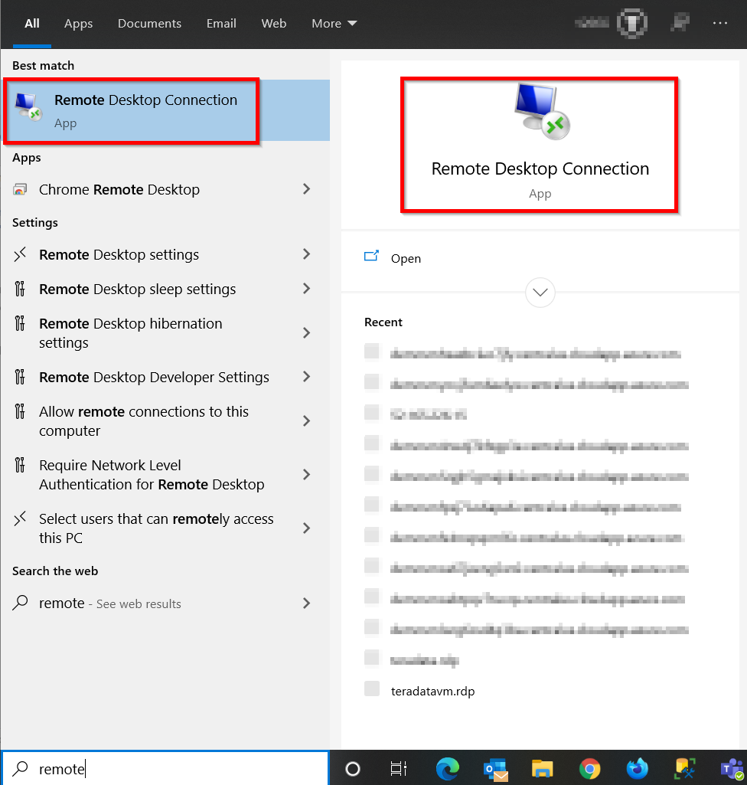
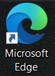
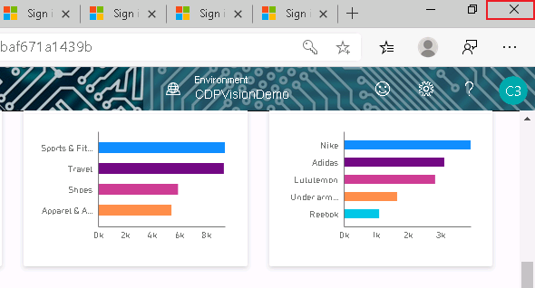
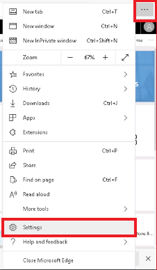
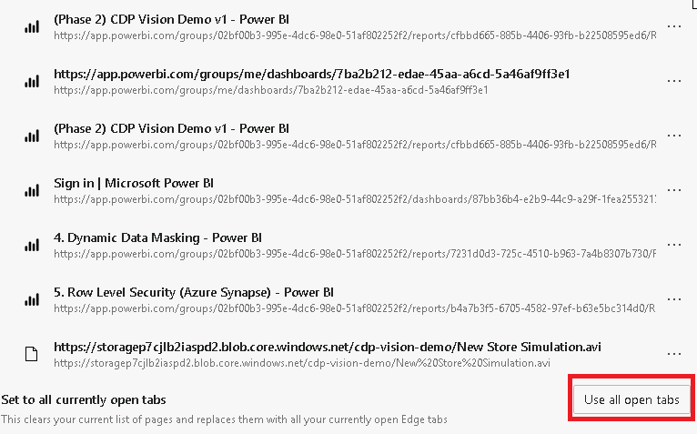

# CDP Vision Demo using Azure Synapse Analytics (Preview) Setup Instructions

1. **Click** on the link below to get to the login page: [http://bit.ly/2uB8p64](http://bit.ly/2uB8p64)

2. **Enter** the requested details and **click** Submit.
3. On the labs page, **click** on the Launch Lab button. Wait while your environment is being prepared. It might take 5 minutes to 15 minutes to provision environment.

4. You will receive an email within 15 minutes which will contain the credentials and another link to access the demo. If you don’t receive the email, please __look in your junk folder__.

5. **Click** Launch Lab

6. Upon clicking the Launch Lab button, you will be redirected to a browser page with the lab details.

7. On the lab details page, **scroll down** to the bottom and **click** on the ‘GO TO DEMO-VM’ button. This will open the Demo VM.

**Important Note:** Alternatively, you can use the Remote Desktop tool to connect to the demo VM. **The viewing experience for Power BI dashboards will be improved if the demo is accessed via the Remote Desktop tool instead of the browser experience that is initiated when you click on the ‘GO TO DEMO-VM’ button.**  
  
**If you would like to open the VM in Remote Desktop for improved resolution, follow these steps:**

8. **In the Windows search field, type “Remote Desktop”. Alternatively, type Windows + R then type mstsc + enter** 

9. Use the VM DNS and VM credentials from the labs page to connect to the VM.

10. On the Demo VM desktop **double click** on the Microsoft Edge Beta icon. 
This will open many tabs. Each tab represents a different step in the demo. 

11. **Sign in** with the **Azure Credentials** from the lab details page that is now open back in your own browser - see screenshot on right. Cut and paste these credentials into the Demo VM. 

12. **Choose YES** when prompted to “Stay Signed In”.

13.	**Open** the second tab in the browser of the VM 

14.	**Choose** “Use another account”

15.	Sign in by cutting and pasting the **Customer Insights Credentials** from **Resource URLs & Credentials** section. Refer back to your own browser to cut and paste these credentials into the Demo VM.

16.	**Close the browser on the VM.**

17.	**Double click** on the Microsoft Edge Beta icon.  Several tabs will automatically open and be available for you to proceed through over the course of the demo.

**Note:** When you go to the Synapse environment, the Power BI tab may not appear. If this happens, refresh the Synapse environment.

18.	To access the Store Simulator video, click on the file on the bottom left corner of the screen.

**Note:** If video is not available, do (CTRL + J) and open “New Store Simulation.avi”.

**Note:**  Browser tabs will automatically load for you, including Power BI. If they do not load for you, please do the following:

### Either

1. Open the “ReadMe.html” file on the VM desktop. 
2. Click and open each link provided in the file. 
3. For the Power BI and Azure Synapse tabs use Azure credentials (in Step 6 above).
4. For the Customer Insights tab use the Customer Insights credentials (in Step 6 above).

### OR

1. In the VM browser, copy each of the links below (in the order below) into 14 separate browser tabs.
    A. [https://home.ci.ai.dynamics.com/app/home?instanceId=6f561683-36db-463f-a56c-ad5edf7c1dcb](https://home.ci.ai.dynamics.com/app/home?instanceId=6f561683-36db-463f-a56c-ad5edf7c1dcb)
    B. [https://web.azuresynapse.net/authoring/analyze/powerbi/%28Phase%202%29%20CDP%20Vision%20Demo%20v1?workspace=%2Fsubscriptions%2F4e09b5ee-747c-4bc6-b0d6-37550536c1a6%2FresourceGroups%2FCDP-VISION-DEMO-RG%2Fproviders%2FMicrosoft.Synapse%2Fworkspaces%2Fdreamdemosynapseworkspace](https://web.azuresynapse.net/authoring/analyze/powerbi/%28Phase%202%29%20CDP%20Vision%20Demo%20v1?workspace=%2Fsubscriptions%2F4e09b5ee-747c-4bc6-b0d6-37550536c1a6%2FresourceGroups%2FCDP-VISION-DEMO-RG%2Fproviders%2FMicrosoft.Synapse%2Fworkspaces%2Fdreamdemosynapseworkspace)
    C. [https://app.powerbi.com/groups/me/dashboards/7ba2b212-edae-45aa-a6cd-5a46af9ff3e1](https://app.powerbi.com/groups/me/dashboards/7ba2b212-edae-45aa-a6cd-5a46af9ff3e1)
    D. [https://app.powerbi.com/groups/02bf00b3-995e-4dc6-98e0-51af802252f2/reports/cfbbd665-885b-4406-93fb-b22508595ed6/ReportSection92fdb1cb740d8014a463](https://app.powerbi.com/groups/02bf00b3-995e-4dc6-98e0-51af802252f2/reports/cfbbd665-885b-4406-93fb-b22508595ed6/ReportSection92fdb1cb740d8014a463)
    E. [https://app.powerbi.com/groups/me/dashboards/7ba2b212-edae-45aa-a6cd-5a46af9ff3e1](https://app.powerbi.com/groups/me/dashboards/7ba2b212-edae-45aa-a6cd-5a46af9ff3e1)
    F. [https://app.powerbi.com/groups/me/reports/faac68b1-bb11-4196-b6ae-baa93dbc8f7e/ReportSection](https://app.powerbi.com/groups/me/reports/faac68b1-bb11-4196-b6ae-baa93dbc8f7e/ReportSection)
    G. [https://app.powerbi.com/groups/me/dashboards/7ba2b212-edae-45aa-a6cd-5a46af9ff3e1](https://app.powerbi.com/groups/me/dashboards/7ba2b212-edae-45aa-a6cd-5a46af9ff3e1)
    H. [https://app.powerbi.com/groups/02bf00b3-995e-4dc6-98e0-51af802252f2/reports/cfbbd665-885b-4406-93fb-b22508595ed6/ReportSection2](https://app.powerbi.com/groups/02bf00b3-995e-4dc6-98e0-51af802252f2/reports/cfbbd665-885b-4406-93fb-b22508595ed6/ReportSection2)
    I. [https://app.powerbi.com/groups/me/dashboards/7ba2b212-edae-45aa-a6cd-5a46af9ff3e1](https://app.powerbi.com/groups/me/dashboards/7ba2b212-edae-45aa-a6cd-5a46af9ff3e1)
    J. [https://app.powerbi.com/groups/02bf00b3-995e-4dc6-98e0-51af802252f2/reports/cfbbd665-885b-4406-93fb-b22508595ed6/ReportSectionc2559dbe636903d1e66d](https://app.powerbi.com/groups/02bf00b3-995e-4dc6-98e0-51af802252f2/reports/cfbbd665-885b-4406-93fb-b22508595ed6/ReportSectionc2559dbe636903d1e66d)
    K. [https://app.powerbi.com/groups/02bf00b3-995e-4dc6-98e0-51af802252f2/dashboards/87bb36b4-e2b9-44c9-a29f-1fea2553213d](https://app.powerbi.com/groups/02bf00b3-995e-4dc6-98e0-51af802252f2/dashboards/87bb36b4-e2b9-44c9-a29f-1fea2553213d)
    L. [https://app.powerbi.com/groups/02bf00b3-995e-4dc6-98e0-51af802252f2/reports/7231d0d3-725c-4510-b963-7a4b8307b730/ReportSection8662d8f05204ad0a906d?bookmarkGuid=Bookmark19c2452641c19098cd22](https://app.powerbi.com/groups/02bf00b3-995e-4dc6-98e0-51af802252f2/reports/7231d0d3-725c-4510-b963-7a4b8307b730/ReportSection8662d8f05204ad0a906d?bookmarkGuid=Bookmark19c2452641c19098cd22)
    M. [https://app.powerbi.com/groups/02bf00b3-995e-4dc6-98e0-51af802252f2/reports/b4a7b3f5-6705-4582-97ef-b63e5bc314d0/ReportSectionb5c31ba8cb51c62a7156?bookmarkGuid=Bookmark0d6e60e0874d462062bc](https://app.powerbi.com/groups/02bf00b3-995e-4dc6-98e0-51af802252f2/reports/b4a7b3f5-6705-4582-97ef-b63e5bc314d0/ReportSectionb5c31ba8cb51c62a7156?bookmarkGuid=Bookmark0d6e60e0874d462062bc)
    
19.	Once the browser tabs have all opened, **select** the “…” in the top right corner of the screen, and **click** on “Settings”.

20.	**Select** “On Startup”
21.	**Select** the option “open a specific page or pages”

22.	**Scroll** all the way down to the end of the page and **click** on “Use all open tabs”

