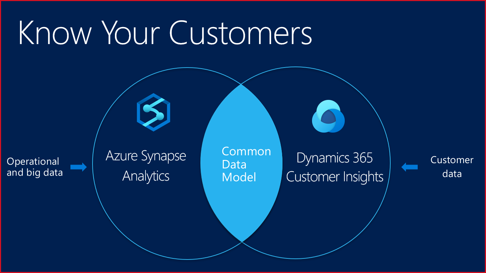
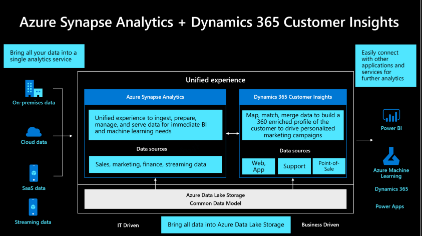

# Setting the Scene 

Data is the oxygen of retail.  Retail has never been short of data, but retailers have not been able to maximize the value of this data. Fragmented data and a lack of understanding of customer behavior and expectations are common roadblocks for delivering exceptional customer experience. A successful customer experience strategy is founded upon the effective use of data. Using analytics on top of retail data has the potential to unlock how retailers can improve personalized, omni-channel campaigns that engage potential and existing customers across their buying journey. Combining the amass retail lifecycle data including customer data, operations data, sourcing and supplier data as well as transaction data with analytics reduces churn, enhances loyalty, advances customer journeys, enables the ability to conduct contextual marketing, measure attribution and provide insights across the enterprise to holistically drive growth across the organization. 

__Demo Overview__

By combining the power of Azure Synapse Analytics with Dynamics 365 Customer Insights, our fictional retailer, Wide World Importers, brings customer data from LOB applications like Adobe, Dynamics, and Salesforce and operational data from SAP Hana, Oracle, and Teradata together in one place, enriches it and unifies it to gain a 360-degree view of the customer and intelligent insights around an untapped market segment (millennials). These insights are then visualized in Power BI and activated across the organization to enable business stakeholders to accelerate time to value.

__Business Impact__

* Bring all disparate data sources together
* Enrich and unify the data estate
* Provide a single source of truth that can be shared across the enterprise
* Better collaboration amongst data users
* Gain a 360-degree customer view 
* Action intelligent insights and insight-driven decisions
* Increase in marketing conversion rate and optimization of media spend
* Increase in millennial customer acquisition
* Empower the organization to serve the business better and drive revenue

__Technical Impact__

The combined power of Azure Synapse and Dynamics 365 Customer Insights provides enterprises with a means to manage, analyze, and share data in a single repository and common data model. Customer Insights empowers data analysts to unify, enrich and intelligently segment the data to better know their customers, which allows contextual customer insights to be embedded into existing business processes and applications, all while reducing the strain of data requests on IT.  
Azure Synapse empowers end to end analytics by combining SQL data warehousing, big data analytics, and data integration into a single integrated environment. Data engineers and data scientists can use Synapse to provide a single view for all analytics tasks. Together they harmonize enterprise data and customer data in a single repository to drive customer engagement/experiences, revenue and enable IT to serve the business holistically. 

## Demo Scenario

This demo is based on two real-world customer stories plus stories inspired by real-world partner implementations and demonstrations. 
The first real-world customer is the Swedish publisher Bonnier Books.  Bonnier Books launched an online book subscription service powered by Microsoft Azure Synapse GA version because they wanted to offer their customers access to e-books and audiobooks. Not only did the move to this new platform give their subscribers a better reading experience, it resulted in 100% YOY growth.    

This demo is alsThis demo is also incorporating learnings from a retail customer who migrated and innovated using Azure Data Services. The customer had unstructured data sources (Kinect IoT sensors) in their retail stores. The Kinect sensors activated a nearby kiosk that played marketing videos when a particular product, for example, a bottle of wine, was touched, telling a story connected to that particular brand/type of wine. The retailer migrated to Azure so that they could perform analytics. The result was insight-driven decision making and improved sales performance.    

The combined stories and learnings are the foundation for the Wide World Importers demonstration utilizing Azure Synapse Analytics and Dynamics Customer Insights.  Wide World Importers is a fictitious brick and mortar retailer that has hundreds of stores all over the world, as well as an online store. They sell a wide variety of consumer merchandise, including sunglasses, sports shoes, watches, wallets, books, and various products for the home. The demo shows how they modernize their data estate by combining data from disparate data sources using Azure Synapse Analytics and Dynamics 365 Customer Insights, and their new-found ability to innovate.

In brief, Wide World Importers wants to:
* Gain business insights using historical, real-time, and predictive analytics using structured and unstructured data sources
* Enable their business analysts to connect to LOB applications and unify all of their disparate customer data into a unified customer profile and a common data model
* Monitor social media as well as foot traffic in their stores to implement a real-time customer feedback loop and make insight-driven decisions
* Enable their IT Team of data engineers and data scientists to bring in and run complex queries over billions of rows of structured and unstructured enterprise operational data
* Enable business analysts and the IT team to share a single source of truth and have a single workspace to collaborate and work with enterprise data and enriched customer data
* Unify data from across the organization
* Match online/offline identities to create a customer 360
* Cross-pollinate external, behavioral, enterprise and operational data to expedite time to value and better serve both the business and customers
* Intelligently segment customer profiles
* Optimize campaigns and deliver omni-channel next best actions/offers in real-time
* Reduce business user reliance on IT, IT can better serve the business, eliminate data scientist mundane tasks and empower them to focus on modeling, training, testing, publishing

**Solution**

High-level steps showcased in the demo to modernize the data estate:
1. Ingest data from Adobe, Salesforce, and other LOB applications into Customer Insights
2. Data analyst or business analyst uses Customer Insights to map, match, and merge customer data to create unified customer profiles and generate segments
3. Data engineer uses Synapse to ingest, transform and load the data from the shared data lake which includes Customer Insights data along with operational data and unstructured / semi-structured data 
4. Data scientists use the AI functionality of Synapse to create product recommendations and to predict the number of store visitors
5. The enterprise uses an integrated Power BI dashboard to make better decisions using historical, real-time, and predictive data

**Results:**
* Marketing, Sales, and Service professionals have a unified 360-degree view of their customers
* Improved customer experience in retail stores due to effective merchandising for enhanced customer experiences - delivering the right product at the right time to the right customer via intelligent segmentation
* Personalized experiences that drive acquisition and high-value purchases for online customers due to product recommendations 
* Successful sales and marketing campaigns 
* Lift in sales conversion rates and enhanced ROMI (return on marketing investment)
* Targeted product design
* Improved inventory management (staying ahead of consumer trends)
* Reduction in the strain of data requests on IT
* Silos removed, bringing data closer together for quick access to critical data to make nimble financial and market adjustment decisions
* As a result of the use of on-demand query in addition to provisioned data pools, data storage costs are reduced significantly 
* Reduced costs by leveraging investments (CI + Azure Synapse) empowering business users/analysts, reducing IT data demands, eliminating mundane data scientist tasks

## Demo Architecture

## Products and Technology Showcased

1. Azure Synapse Analytics
* Azure Synapse is an end to end analytics platform which combines SQL data warehousing, big data analytics, and data integration into a single integrated environment. Data engineers and data scientists can use Synapse to provide a single view for all analytics tasks. 
* Azure Synapse Analytics is a key component of an end-to-end big data solution in the cloud. Azure Synapse Analytics includes a cloud-based data warehouse that uses Massively Parallel Processing (MPP) to quickly run complex queries across petabytes of data.  It is powered by Apache Spark, which is not only secure and reliable but integrates deeply and is optimized for Azure databases and stores. It is managed and supported by Spark experts.
* Significantly reduces the data storage costs and improves query performance.
* Unified experience to ingest, prepare, manage, and serve data for immediate BI and machine learning needs 

2. Dynamics 365 Customer Insights
* CI utilizes the CDM (common data model) to map data into a single simplified schema used across the Microsoft Cloud stack.  It performs data map, match, and merge to expedite time to value via a 360 view of the customer.
* Unifies customer data into a 360 view with an easy-to-use, preassembled SaaS application
* Empowers users (sales, service, and marketing) to create a personalized experience across all customer touchpoints, deliver personalized experiences, calculate customer lifetime value, and intelligently segment users to optimize the customer journey.

3. Azure Data Lake Storage Gen2
* Azure Data Lake Storage Gen2 is a set of capabilities dedicated to big data analytics, built on Azure Blob storage
* Allows you to manage massive amounts of data easily
* Makes Azure Storage the foundation for building enterprise data lakes on Azure

4.	Power BI
* Dig deeper into data and find patterns that lead to actionable insights.
* Create stunning reports with interactive data visualizations.
* Create mobile-optimized reports, publish to the cloud or on-premises, or embed reports into existing apps or websites.

**Note:**  We are currently working on adding the following Synapse differentiators into the demo:
* Workload Importance 	
* Workload Isolation 
* Dynamic Data Masking
* Result-set caching

