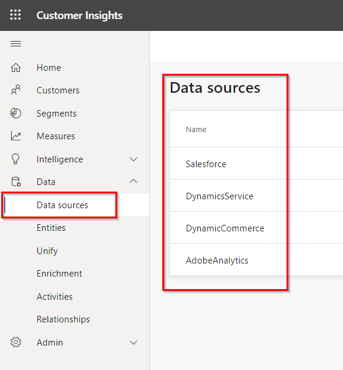

# Customer Insights

1. **Navigate** to Customer Insights tab in the browser [https://home.ci.ai.dynamics.com/
](https://home.ci.ai.dynamics.com/)
2. Login with CI credentials provided in the setup document.
3. **Point out** various KPIs and customer segments available.

4. **Click** on Data and 
5. **Click** on Data Sources. 
6. **Hover over Data Sources** on the right and show different data sources.

7. **Click** on Unify to navigate to Unify page.

8. **Click** on map.
9. **Select** SalesForceContacts and point out various fields and showcase that they can be mapped to common data model fields.
10. **Show** that ID Column is selected as Primary Key for mapping.

11. **Select** DynamicsCRMServiceContactsand point out various fields and show that they can be mapped to common data model fields.
12. Show that ID Column was selected as Primary Key for mapping

13. **Click** on Match.

14. **Select** the drop-down arrow.

15. **Show** that Email column is used for fuzzy matching from Entity Dynamics Commerce as an example.

16. **Click** on “Merge”

17. **Click on** Enrichment from the left navigation.
18. **Click on** Edit Brands and Interests.

19. Now Point out various Enrichment options available.

20. **Click** on Segments on the left navigation. 
21. **Point out** the different customer segments

22. **Click** on Customers on the left side bar to see the Customers Page.

23. **Type** “Margot Wolff” into the search field on the far left on the page to get Margot Wolff’s Customer Profile.
24. Now **click** on Margot Wolff’s Customer Profile.

25. **Show** Margot Wolff’s profile. 

26. **Click** on “Home” on the left side bar to go back to the Home page of Customer Insights.

