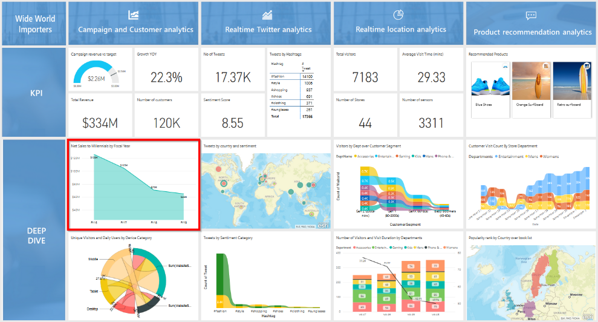
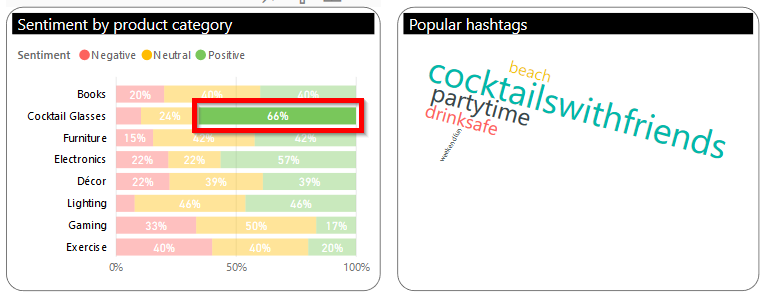
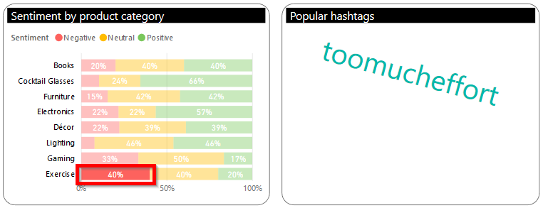
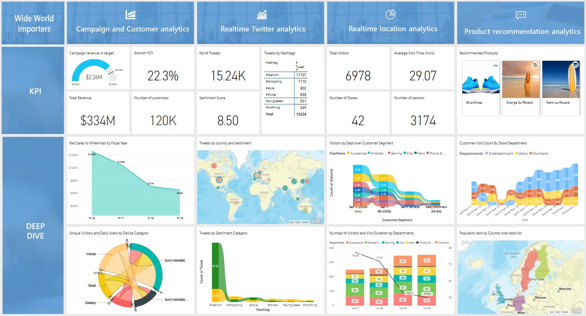
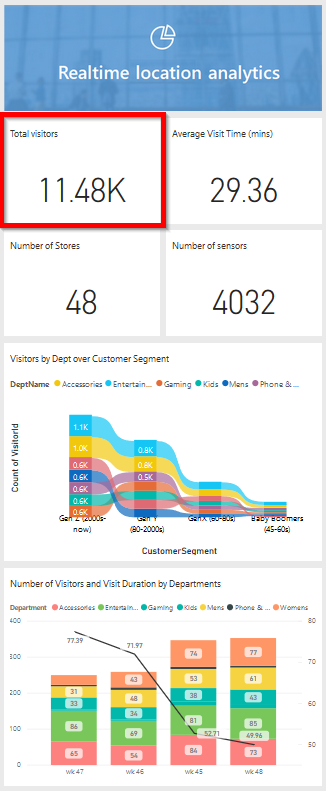
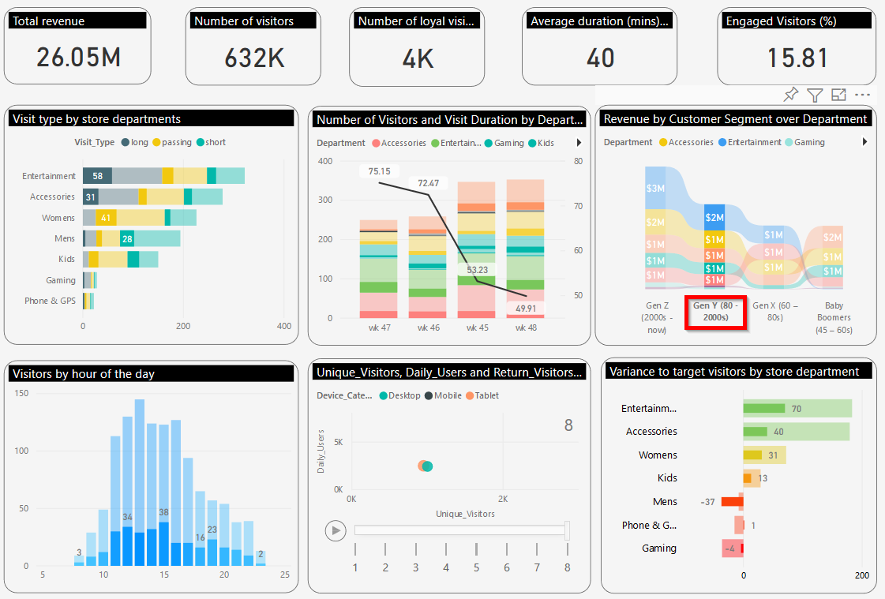
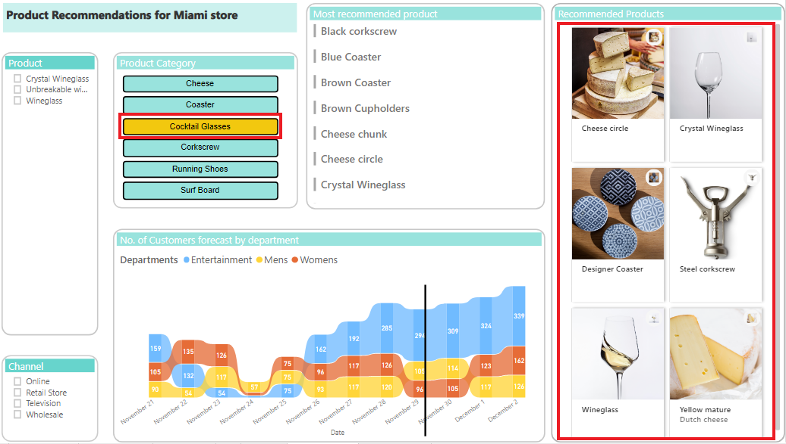
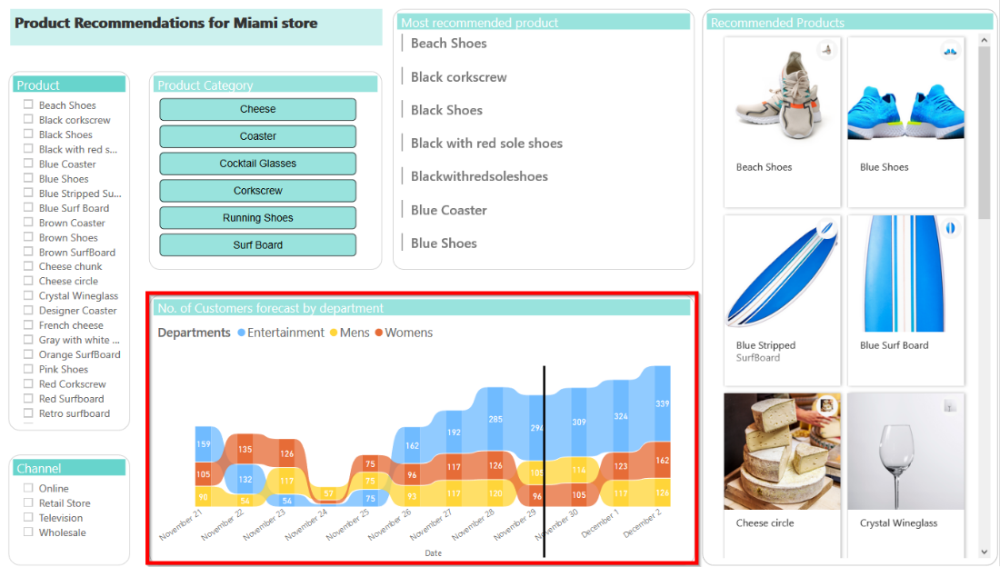
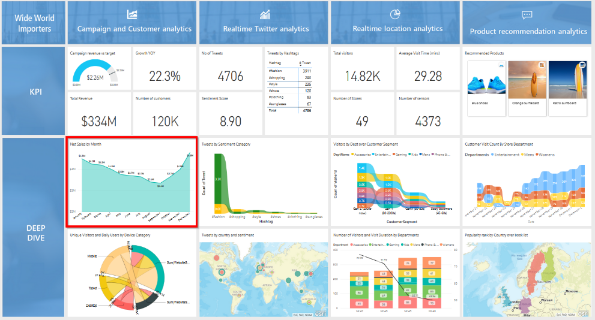
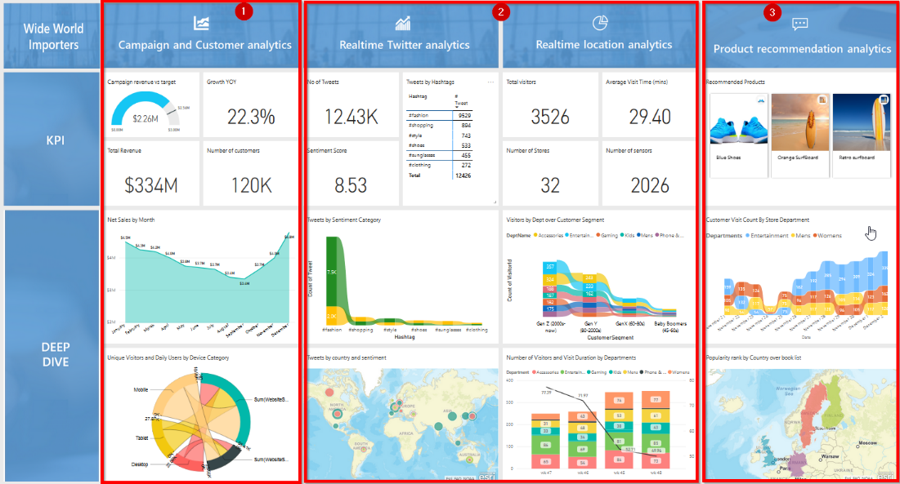

# Visualizing the data using the Power BI dashboard

Note: Each of the below dashboard views is a separate tab in the VM window browser.  Just proceed through the browser tabs from left to right.

Note: Make sure you refresh your tabs before showing the demo and set zoom level so that you can see the full dashboard. 

Don’t click – just **hover** over the campaign and customer analytics pillar, and then go to the next edge browser tab in the VM where the Campaign Analytics report is pre-loaded.

Note: The Campaign Analytics report can also be accessed by clicking as shown on right on the ‘Campaign revenue vs target’ frame.

1. **Select** Enjoy the Moment campaign from the top filter.

2. In the Sentiment by product category, **Click** on Positive sentiment for the Cocktail Glasses product category.

3. Then **Click** on Negative sentiment for the Exercise product category.

4. Proceed to the next tab in the browser, which shows the main Power BI dashboard.

5. From the main dashboard, point to the “Realtime Twitter analytics” pillar.
6.	Proceed to next tab, which will show you the “Real time Twitter analysis” report.

Note: Should you not have the next browser tab opened, you can click on ‘No. of tweets’ visual and you will go to this same report.

**Click** on the heat map video which is accessible on the bottom left corner of your VM window.
The store simulator video will launch.

7.	Proceed to next tab, which will take you to the main Power BI dashboard. Point out the ‘Realtime location analytics’ pillar.  
8.	Proceed to the next tab, which will show you the Location Analytics report.  Note: Should you not have the next browser tab opened, you can click on the ‘Total visitors’ frame to show this report.

9.	**Show or Point** to ‘Visit to by store department’. 

10.	**Click** on long visit_type in the Entertainment department.

11.	**Click** on short visit_type in the Mens department.

12.	**Click** Gen Y in ‘Revenue by customer segment over department visual’. 
13.	**Hover** over Visitors by hour of day visual
14.	**Click** on play on Scatter plot to what devices used by visitors.

15.	**Proceed**to the next browser tab, which shows the main dashboard.
16.	**Point to** the ‘Product recommendation analytics’ pillar.
17.	**Proceed** to the next tab, which will show you ‘Product recommendations for Miami Store’
18.	Note: Should you not have the next browser tab opened, from the dashboard, **Click** ‘Recommendation Products’ which will take you to the report.

19.	**Click** Cocktail Glasses in ‘Product Category’ filter.

20.	**Click** running shoes in ‘Product Category’.

Proceed to the next browser tab in the VM, which shows the main dashboard but now showing new results. 

**Note:** The instructions in this cell are included in case the main dashboard does not open in the next browser tab. 

Follow these instructions to open the main Power BI dashboard.

1. **Click** on ‘Data & AI Demo’ workspace, 
2. From the Dashboards list, **Select** ”Phase 2 –‘Data & AI Demo Dashboard (copy)”. This will launch the main dashboard.

1. **Point to** Campaign and Customer analytics
2. **Point to** Realtime Twitter and Location analytics 
3. **Point to** Product recommendation analytics

**Hover over** ‘Net sales by month’ visual on the dashboard.

