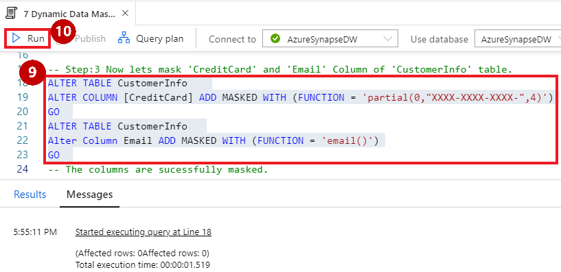
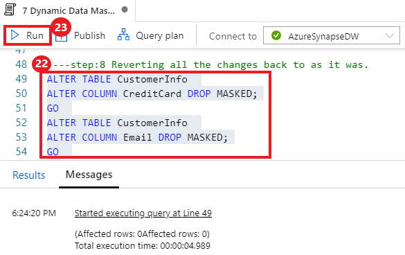
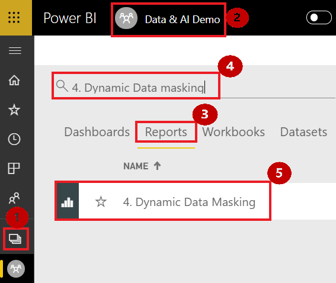
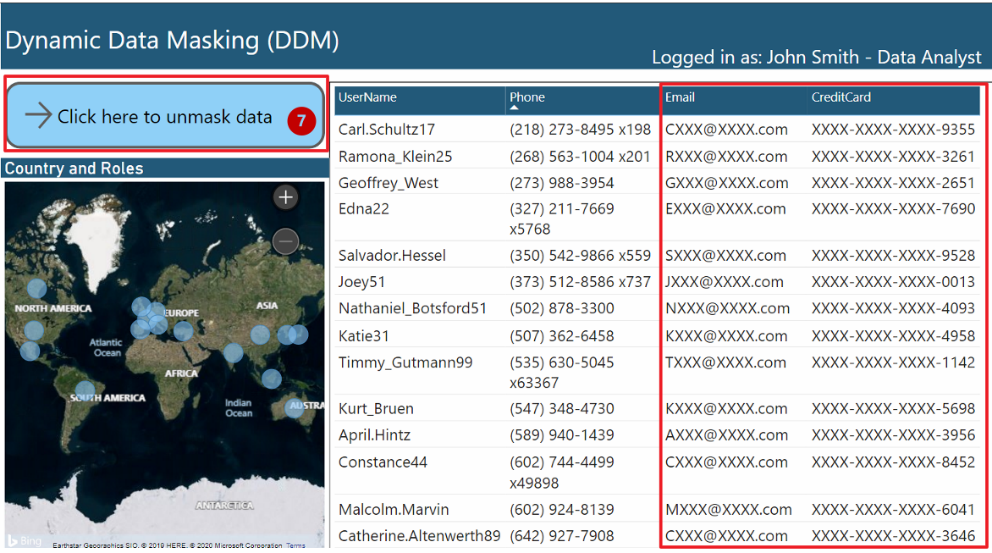
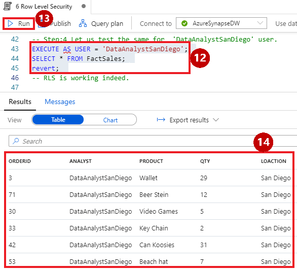
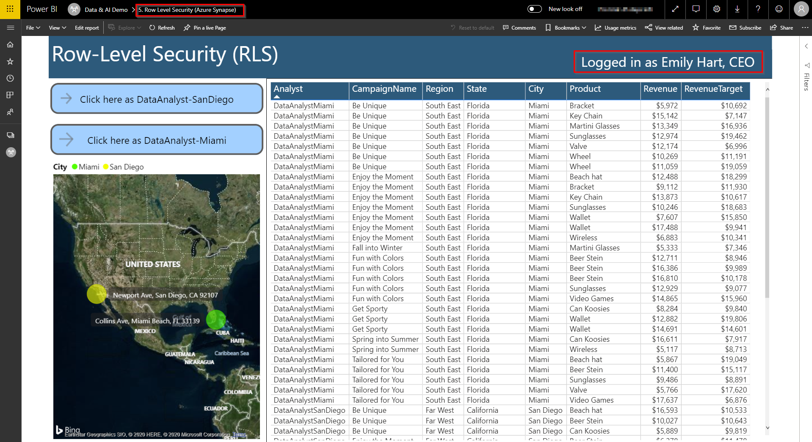
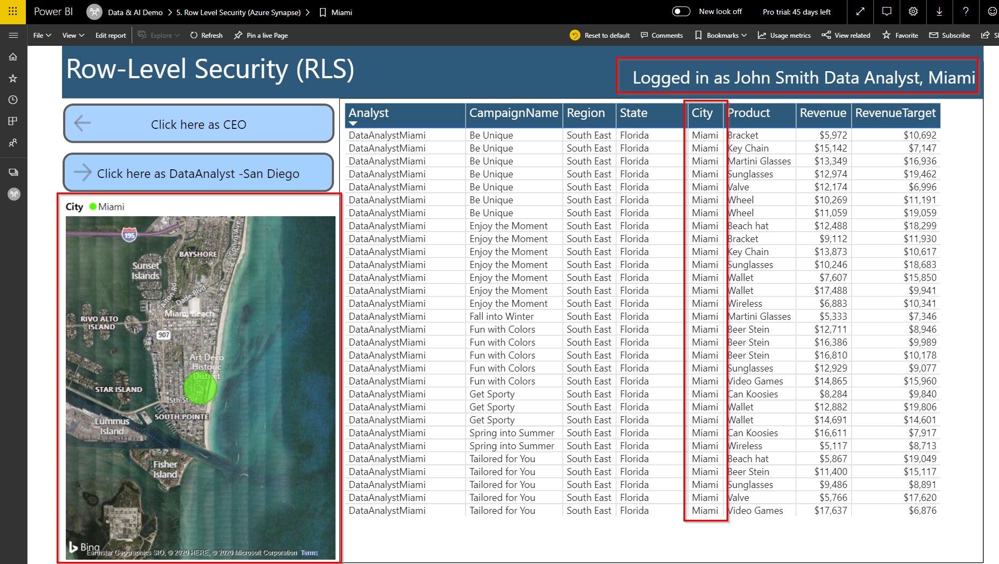
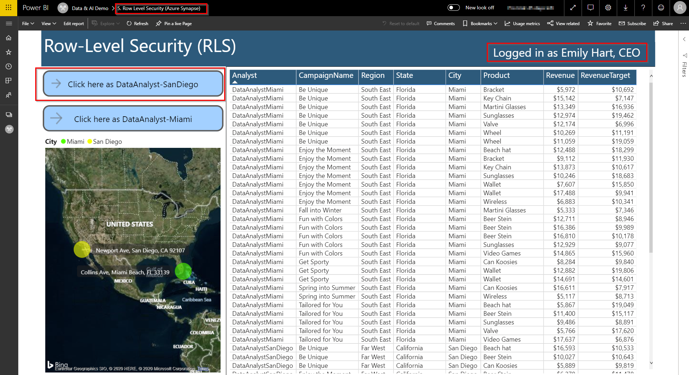

# Appendix: Azure Synapse differentiator “snackable” pocket demos   

## Dynamic Data Masking (DDM) – Azure Synapse Differentiator Snackable Pocket Demo

1. **Click** on the Develop tab
2. **Click** the SQL script “7 Dynamic Data Masking”
3. **Select** “AzureSynapseDW” to connect to the “AzureSynapseDW” SQL Pool
4. In the SQL script, **select** the query below “Step:1” (see image at right)
5. **Click** on Run
6. **Show** the result of query

7. In the SQL script, **select** the query below “Step:2” (see image at right)
8. **Click** ‘Run’

9. In the SQL script, **select** the query below “Step:3” (see image at right)
10. **Click** ‘Run’

11. In the SQL script, **select** the query below “Step:4” (see image at right)
12. **Click** on Run
13. **Show** the result of the query and **point out** that the email and credit card are masked.

14. In the SQL script, **select** the query below “Step:5” (see image at right)
15. **Click** ‘Run’

16. In the SQL script, **select** the query below “Step:6” (see image at right)
17. **Click** ‘Run’
18. **Show** the result of the query

19. In the SQL script, **select** the query below “Step:7” (see image at right)
20. **Click** on Run
21. **Show** the result of the query.

22. In the SQL script, **select** the query below “Step:8” (see image at right)
23. **Click** on Run.

**Important Note** to Presenter:
You __must__ run this final step of the demo or the demo will not function for the next user.

24. Proceed to the browser tab in the VM, which shows this view at right.

Note: The steps in this row are included in case the DDM view does not open.
Follow these instructions to open the DDM view.
1. **Click on** Workspace
2. **Select** “Data & AI Demo” from available workspace
3. **Click on** Reports 
4. **Search** for “4. Dynamic Data Masking” 
5. **Click** “4. Dynamic Data Masking” 

6. **Click** on button "Click here to mask data" to implement dynamic data masking

7. **Click** on button "Click here to unmask data".

**Important Note** to Presenter:
You __must__ run this final step of the demo or the demo will not function for the next user.

## Row-Level Security (RLS) Demo  

1. **Click** on the Develop hub
2. **Select** “6 Row Level Security” from the list of SQL scripts
3. **Select** “AzureSynapseDW” to connect to the “AzureSynapseDW” SQL Pool
4. In the SQL script, **select the query** below “Step:1” (see image at right)
5. **Click** on Run
6. **Show** the result of the query

7. In the SQL script, **select the query** below “Step:2” (see image at right) 
8. **Click** on Run

9. In the SQL sript, **select the query** below "Step:3" from the script (see image at right)
10. **Click** on Run
11. **Show** the result of the query

12.	In the SQL script, **select the query** below "Step:4" (see image at right)
13.	**Click** on Run
14.	**Show** the result of the query

15.	In the SQL script, **select** the query below "Step:5" 
16.	**Click** on Run
17.	**Show** the result of the query

18.	In the SQL script, **select the query** below "Step:6" (see image at right).
19.	**Click** on Run

## Important Note to Presenter:
You __must__ run this final query of the demo or the demo will not function for the next user.

20.	**Select** the “Row Level Security (Azure Synapse)” tab on the top of the screen. 

21.	**Now Click on** “Click here as Data Analyst-Miami”.

22.	**Point out** the “City” column, which only contains Miami data
23.	**Point out** that you are logged in as John Smith – a data analyst from Miami.
24.	**Point out** the Miami Store location on the map.

25.	**Select** “Click here as DataAnalyst-SanDiego” 

26.	**Point Out** the “City” column, which only contains San Diego data
27.	**Point Out** Miguel Reyes is a data analyst from San Diego.
28.	**Point Out** the map Showing the Location of San Diego Store.

