# Azure Synapse Analytics WWI Setup Guide

**Contents**

<!-- TOC -->

- [Azure Synapse Analytics WWI setup guide](#azure-synapse-analytics-wwi-setup-guide)
  - [Requirements](#requirements)
  - [Before Starting](#before-starting)
    - [Task 1: Create a Power BI Streaming Dataset](#task-1-create-a-power-bi-streaming-dataset)
    - [Task 2: Create a resource group in Azure](#task-2-create-a-resource-group-in-azure)
    - [Task 3: Create Azure Synapse Analytics workspace](#task-3-create-azure-synapse-analytics-workspace)
    - [Task 4: Download artifacts](#task-4-download-artifacts)
    - [Task 5: Establish a user context](#task-5-establish-a-user-context)
    - [Task 6: Run environment setup PowerShell script](#task-6-run-environment-setup-powershell-script)
    - [Task 7: Location Analytics Streaming Dataset Setup](#task-7-location-analytics-streaming-dataset-setup)

<!-- /TOC -->

## Requirements

1. An Azure Account with the ability to create an Azure Synapse Workspace
2. Make sure the following resource providers are registered for your Azure Subscription.  
* Microsoft.Sql
* Microsoft.Synapse
* Microsoft.StreamAnalytics
* Microsoft.EventHub  

See [further documentation](https://docs.microsoft.com/en-us/azure/azure-resource-manager/management/resource-providers-and-types#azure-portal) for more information on registerting resource providers on the Azure Portal.

3. A Power BI Pro or Premium account to host Power BI reports, dashboards, and configuration of streaming datasets.
4. A Twitter developer account (Optional for Twitter Real-Time Power BI Report)

## Before starting

### Task 1: Create a Power BI Streaming Dataset

1. Sign in into the [Power BI Portal](https://powerbi.microsoft.com/en-us/) using your Azure credentials.

2. Go to your workspace and select **Create** 

 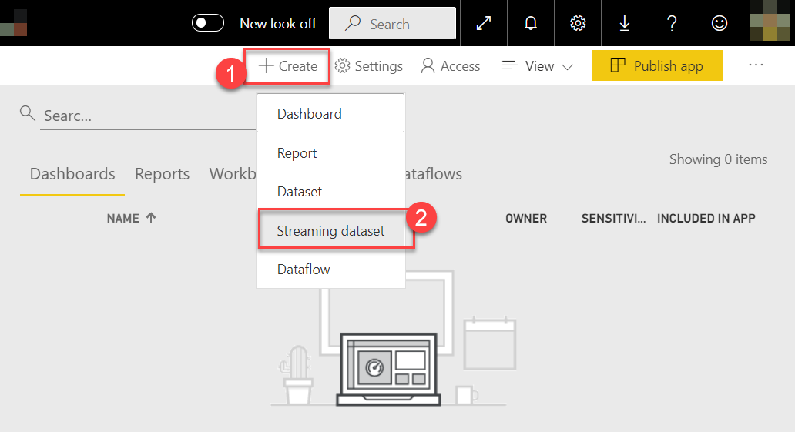

3. Select **API** and select **Next** to continue. 

 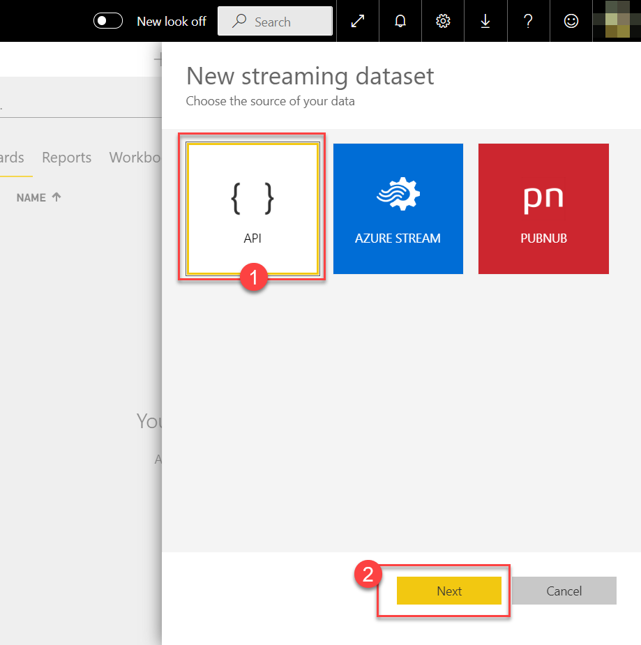
 
4. Enter a **dataset name** for your dataset and enter the field names and types listed below:

| Field Name       | Type     |
|------------------|----------|
| Category         | Text     |
| CustomerSegment  | Text     |
| DeptID           | Number   |
| DeptName         | Text     |
| EntryTime        | DateTime |
| ItemName         | Text     |
| Price            | Number   |
| Qty              | Number   |
| Sentiment        | Text     |
| StoreID          | Number   |
| StoreName        | Text     |
| TransactionID    | Number   |
| VisitorId        | Number   |
| VisitTime        | Number   |
| VisitType        | Text     |

 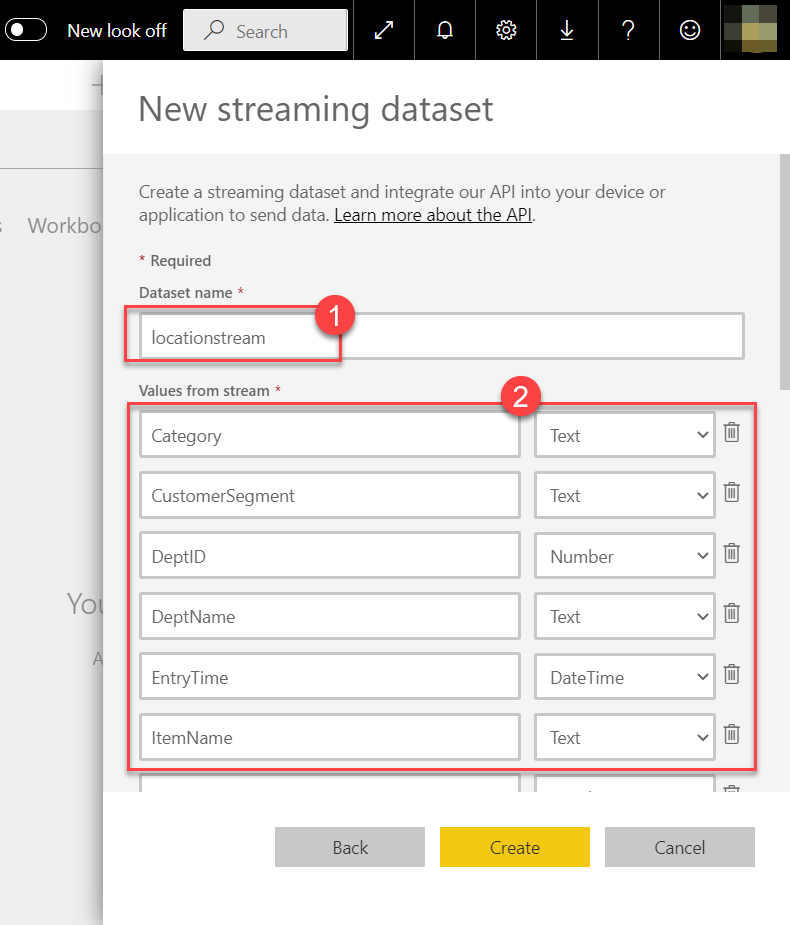
 
5. Make sure **Historic data analysis** is enabled. Select **Create** to proceed.

 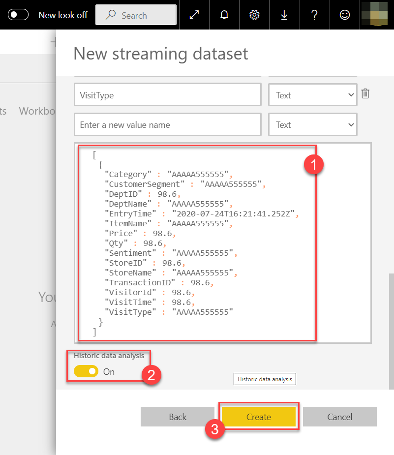
 
6. Take note of the given **Push URL** to be used during the following setup tasks. Select **Done** to close the window.

 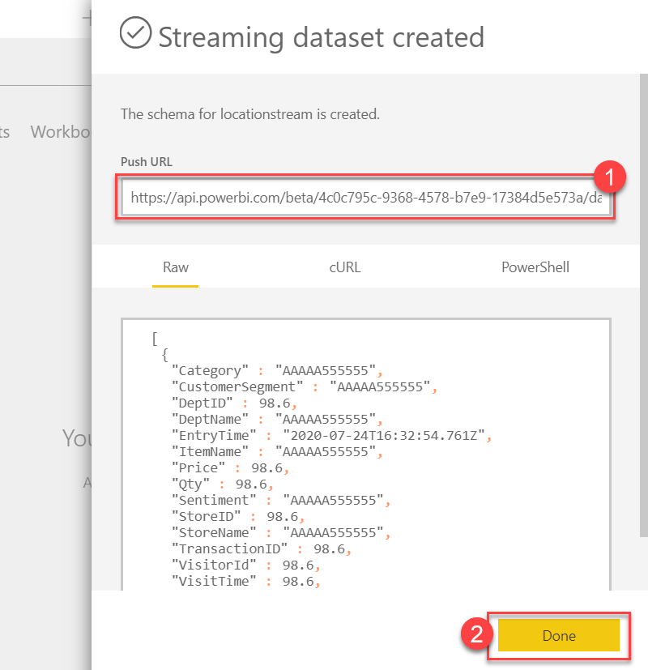

### Task 2: Create a resource group in Azure

1. Log into the [Azure Portal](https://portal.azure.com) using your Azure credentials.

2. On the Azure Portal home screen, select the **+ Create a resource** tile.

    

3. In the **Search the Marketplace** text box, type **Resource group** and press the **Enter** key.

    

4. Select the **Create** button on the **Resource group** overview page.

5. On the **Create a resource group** screen, select your desired Subscription and Region. For Resource group, enter **Synapse-WWI-Lab**, then select the **Review + Create** button.

    

6. Select the **Create** button once validation has passed.

### Task 3: Create Azure Synapse Analytics workspace

1. Deploy the workspace through the following Azure ARM template (press the button below):

    <a href="https://portal.azure.com/#create/Microsoft.Template/uri/https%3A%2F%2Fraw.githubusercontent.com%2Fmicrosoft%2FAzure-Analytics-and-AI-Engagement%2Fmain%2FCDP-Retail%2Fartifacts%2Fenvironment-setup%2Fautomation%2F00-asa-workspace-core.json" target="_blank"></a>

2. On the **Custom deployment** form fill in the fields described below.

* **Subscription**: Select your desired subscription for the deployment.
* **Resouce group**: Select the **Synapse-WWI-Lab** resource group you previously created.
* **Unique Suffix**: This unique suffix will be used naming resources that will created as part of your deployment.
* **SQL Administrator Login Password**: Provide a strong password for the SQLPool that will created as part of your deployment.
* **Location**: The datacenter where your Azure Synapse environment will be created.
* **Twitter Access Token**: The access token from Twitter.
* **Twitter Access Token Secret**: The access token secret from Twitter.
* **Twitter Consumer Key**: The consumer key from Twitter.
* **Twitter Consumer Key Secret**: The consumer key secret from Twitter.
* **Twitter Keywords**: Twitter keywords that will be used to fetch twitter real-time data as part of the Power BI Real-Time Report for Twitter.
* **Streaming Dataset**: The name of your Twitter PowerBI Dataset that will be automatically created by Azure Stream Analytics. Feel free to leave the default value.
* **Pbi Worksapce Id**: The Power BI workspace ID for your default workspace on the Power BI Portal. 
* **Streaming Url**: The **Push Url** you received at the end of Task 1 in the Setup Guide.
* **Event Hub Name**: The name of the event hub that will be used to dump tweets recevied from Twitter through an Azure Function. Feel free to leave the default value.
* **Asa name**: The name of the Azure Stream Analytics Job that will be created to read data from Event Hubs and send to a Power BI streaming dataset.

    
  
    > **Important**: The `location` field under 'Settings' will list the Azure regions where Azure Synapse Analytics (Preview) is available as of June 2020. This will help you find a region where the service is available without being limited to where the resource group is defined.

3. Check the **I agree to the terms and conditions stated above**, then select the **Purchase** button. The provisioning of your deployment resources will take approximately 13 minutes.

    > **Note**: You may experience a deployment step failing in regards to Role Assignment. This error may safely be ignored.

### Task 4: Download artifacts

1. In the Azure Portal, open the Azure Cloud Shell by selecting its icon from the right side of the top toolbar.

    

    > **Note**: If you are prompted to choose a shell, select **Powershell**, and if asked to create a storage account for the Cloud Shell, agree to have it created.

2. In the Cloud Shell window, enter the following command to clone the repository files.

    ```PowerShell
    git clone https://github.com/microsoft/Azure-Analytics-and-AI-Engagement.git synapse-wwi
    ```
    
    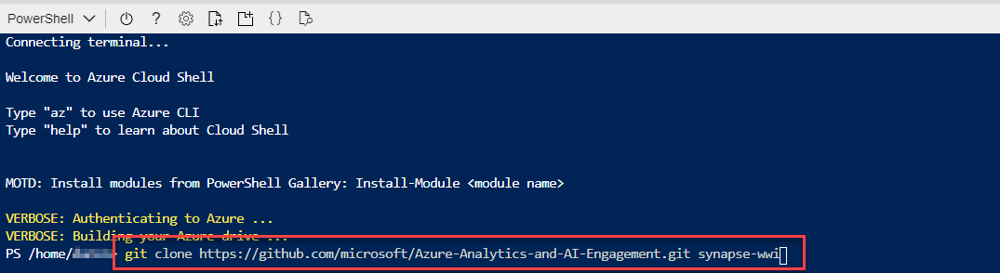

3. Keep the Cloud Shell open.

### Task 5: Establish a user context

1. In the Cloud Shell, execute the following command:

    ```cli
    az login
    ```

2. A message will be displayed asking you to open a new tab in your web browser, navigate to [https://microsoft.com/devicelogin](https://microsoft.com/devicelogin) and enter the code you have been given for authentication.

   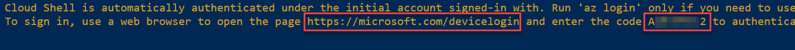

   

3. Once complete, you may close the tab from the previous step and return to the Cloud Shell.

   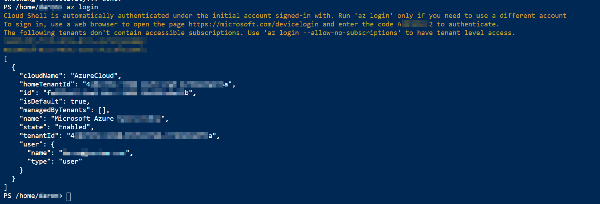

### Task 6: Run environment setup PowerShell script

When executing the script below, it is important to let the scripts run to completion. Some tasks may take longer than others to run. When a script completes execution, you will be returned to a command prompt. The total runtime of all steps in this task will take approximately 15 minutes.

1. In the Cloud Shell, change the current directory to the **automation** folder of the cloned repository by executing the following:

    ```PowerShell
    cd './synapse-wwi/CDP-Retail/artifacts/environment-setup/automation'
    ```

2. Execute the **01-environment-setup.ps1** script by executing the following command:

    ```PowerShell
    ./01-environment-setup.ps1
    ```

    You will be prompted to specify the size of the data you want to populate into the Sales table. You can either chose the small data size with 3 million records, or the large data size with 30 billion records. Choosing 30 billion records will have the script scale your SQL Pool to DW3000c during data transfer, which might take up to 4 hours. 
    
    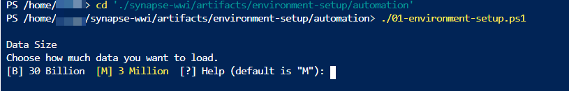
    
    You may be prompted to enter the name of your desired Azure Subscription. You can copy and paste the value from the list to select one.   

    You will also be prompted for the following information for this script:

    | Prompt |
    |--------|
    | Enter the SQL Administrator password you used in the deployment |

    

    You will be asked to go through another round of device login for the Power BI workspace access. Repeat the steps in Task 4.2 and 4.3 to complete the process.
    
    Finally, you will be prompted for the default Power BI workspace Id for your account.
    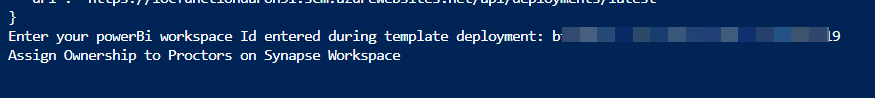

    During the execution of the automation script you may be prompted to approve installations from PS-Gallery. Please approve to proceed with the automation.   

    
    
3. Sign in into the [Power BI Portal](https://powerbi.microsoft.com/en-us/) using your Azure credentials.

4. From the hamburger menu select **Workspaces** to access the list of workspaces available to you. Select the workspace named `asa-exp{suffix}`.


5. Select the **Settings** icon from the top right bar, and select **Settings** again to navigate to the settings page.

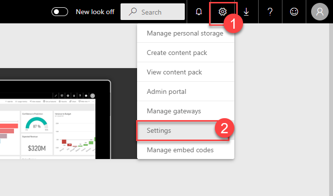

6. Select **datasets** tab to access the list of datasets available. Then select `2-Billion Rows Demo` dataset to access its settings. From the settings page open **Data source credentials** and select **Edit credentials**.

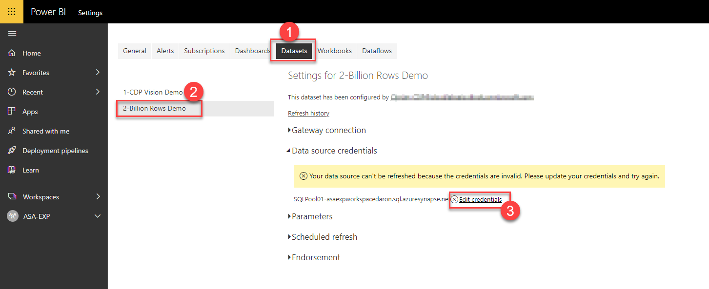

7. Select **OAuth2** for the **Authentication method** and select **Sign In** to complete the process.

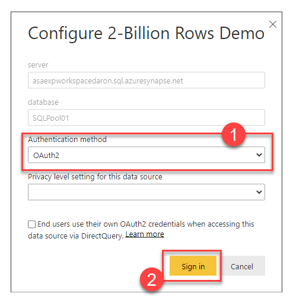

### Task 7: Location Analytics Streaming Dataset Setup

1. Log into the [Azure Portal](https://portal.azure.com) using your Azure credentials.

2. On the Azure Portal home screen, go to **Search** and search for **locfunction**. Once the azure function is found select it to proceed.

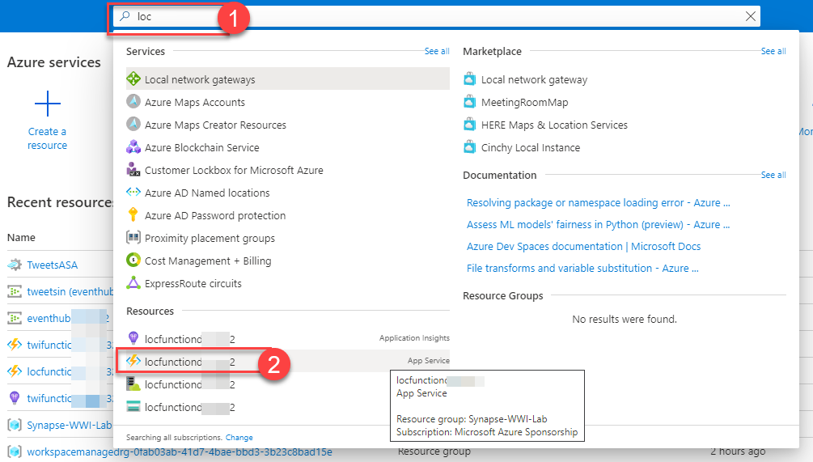

3. Select **Functions** from the left menu to list the functions available in the function app. Next, select the function named **Start**.

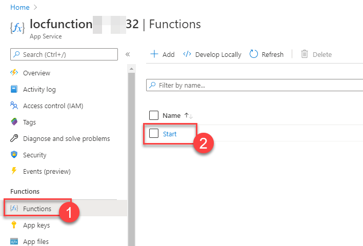

4. In the **Overview** tab select **Get Function Url** and select **Copy to clipboard** to copy the Url for the function into your clipboard.

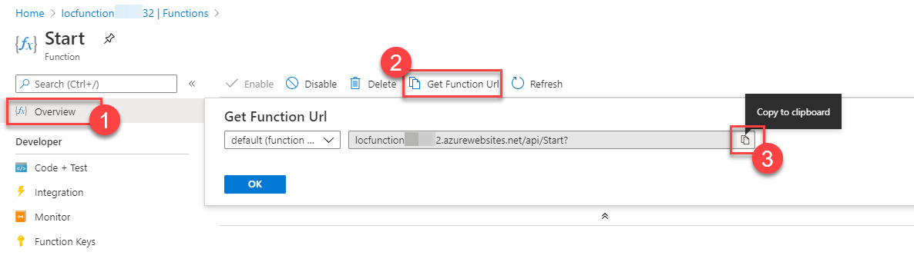

5. Open a new browser tab, past the url and navigate to function endpoint to start location analytics data generator.

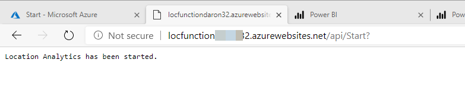

6. Once the Azure Function starts you can start building Power BI real-time reports for your new Power BI dataset. The name of the dataset is the value you provided during Task 1.4 of this setup guide.

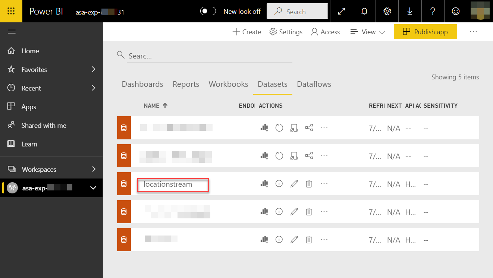

### Task 8: twitter Analytics Streaming Dataset Setup

1. Log into the [Azure Portal](https://portal.azure.com) using your Azure credentials.

2. On the Azure Portal home screen, go to **Search** and search for **tweets**. If you provided a different name for you Azure Stream Analytics Job use the same name for your search term.

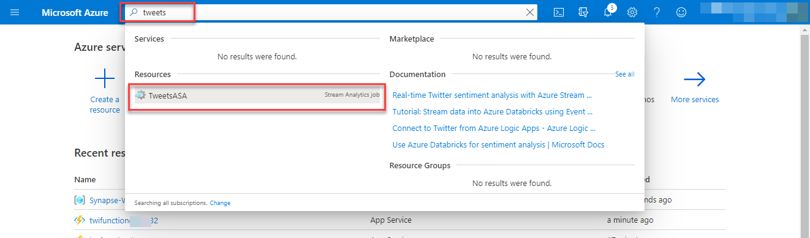

3. Select **Start** to start the Azure Stream Analytics Job.

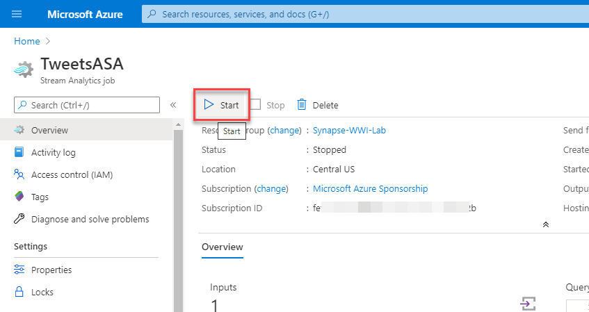

4. Once the job starts gathering data you can start building Power BI real-time reports for your new Power BI dataset that will be create by the Azure Stream Analytics job. The name of the dataset is based on the value you provided for the configuration parameter named **Streaming dataset** during template deployment.

You should follow all steps provided *before* proceeding to other activities in the environment.


