# WWI DREAM Demo in a Box Setup Guide

**Before You Begin**

## IMPORTANT NOTES:

  1.  DREAM Demo in a Box (DDiB) can be deployed by partners in their own Azure Subscriptions. **Partners can deploy DDiB in customer's subscription ONLY through the CAPE process. CAPE** tool is accessible by Microsoft employees. For more information about **CAPE** process, please connect with your Local Data & AI Specialist or CSA/GBB.

  2.  **Please go through the [license agreement](https://github.com/microsoft/Azure-Analytics-and-AI-Engagement/blob/healthcare/HealthCare/License.md) and [disclaimer](https://github.com/microsoft/Azure-Analytics-and-AI-Engagement/blob/main/CDP-Retail/disclaimer.md) before proceeding.**

  3.  Since this is a DDiB, there are certain resources open to the public. **Please ensure proper security practices are followed before you add any sensitive data into the environment.** To strengthen the security posture of the environment, **leverage Azure Security Centre.**
 
  4.  For any questions or comments please email **[dreamdemos@microsoft.com](mailto:dreamdemos@microsoft.com).**
  
	> **Note**: Set up your demo environment at least two hours before your scheduled demo to make sure everything is working.

## Contents

<!-- TOC -->

- [Azure Synapse Analytics WWI setup guide](#azure-synapse-analytics-wwi-setup-guide)
  - [Requirements](#requirements)
  - [Before Starting](#before-starting)
    - [Task 1: Create a Power BI Workspace](#task-1-create-a-power-bi-workspace)
    - [Task 2: Create a Power BI Streaming Dataset](#task-2-create-a-power-bi-streaming-dataset)
    - [Task 3: Create a resource group in Azure](#task-3-create-a-resource-group-in-azure)
    - [Task 4: Create Azure Synapse Analytics workspace](#task-4-create-azure-synapse-analytics-workspace)
    - [Task 5: Download artifacts](#task-5-download-artifacts)
    - [Task 6: Establish a user context](#task-6-establish-a-user-context)
    - [Task 7: Run environment setup PowerShell script](#task-7-run-environment-setup-powershell-script)
    - [Task 8: Location Analytics Streaming Dataset Setup](#task-8-location-analytics-streaming-dataset-setup)
    - [Task 9: Twitter Analytics Streaming Dataset Setup](#task-9-twitter-analytics-streaming-dataset-setup)
    - [Task 10: Twitter Analytics Report](#task-10-twitter-analytics-report)
    - [Task 11: Location Analytics Real-Time Report](#task-11-location-analytics-real-time-report)
  - [Optional Features](#optional-features)
    - [30 Billion Rows Dataset](#30-billion-rows-dataset)
<!-- /TOC -->

## Requirements

1. An Azure Account with the ability to create an Azure Synapse Workspace
2. Make sure the following resource providers are registered for your Azure Subscription.  

* Microsoft.Sql
* Microsoft.Synapse
* Microsoft.StreamAnalytics
* Microsoft.EventHub  

See [further documentation](https://docs.microsoft.com/en-us/azure/azure-resource-manager/management/resource-providers-and-types#azure-portal) for more information on registerting resource providers on the Azure Portal.

3. A Power BI Pro or Premium account to host Power BI reports, dashboards, and configuration of streaming datasets.

## Before starting

### Task 1: Create a Power BI Workspace

1. Sign in into the [Power BI Portal](https://powerbi.microsoft.com/en-us/) using your Azure credentials.

2. Select **Workspaces** from the left menu and select **Create a workspace** to create a new Power BI Workspace for your new environment.

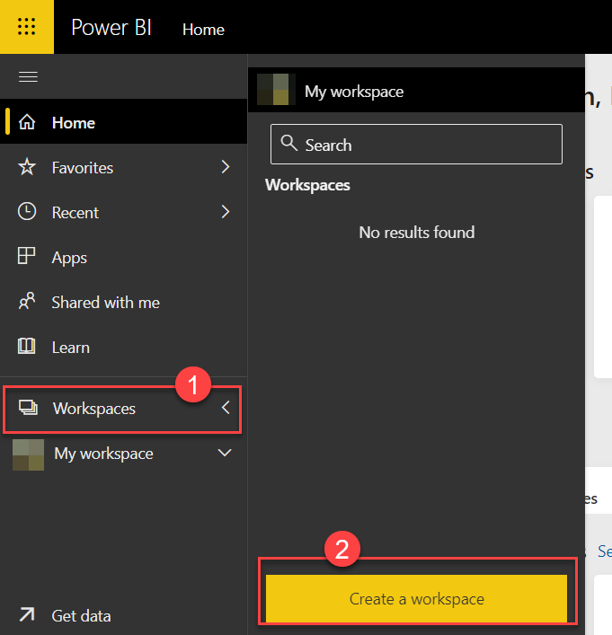

3. Name your workspace **CDP** and select **Save** to finish creating the workspace.

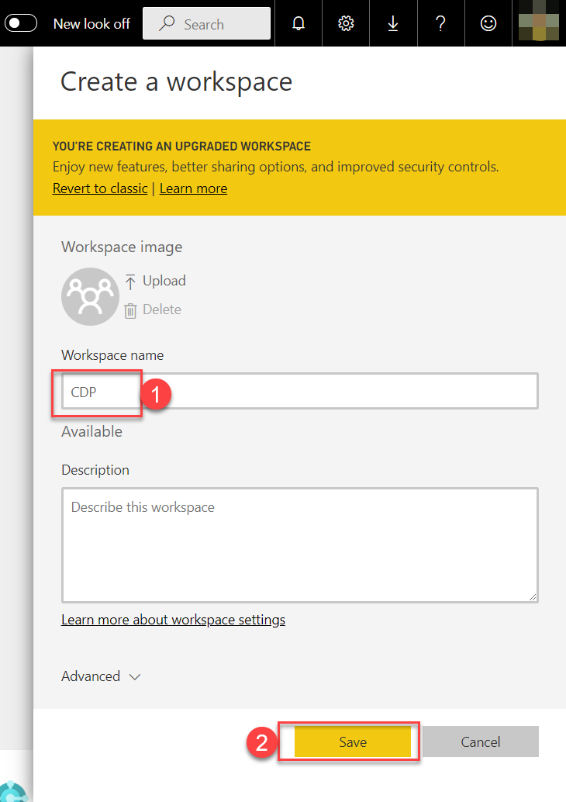

3. Once your workspace is created you will need to take note of the **workspace Id**. You can find the workspace Id for your workspace in the URL bar in your browser as shown in the screenshot below. Finally, select **skip** to close the Welcome wizard on the page.

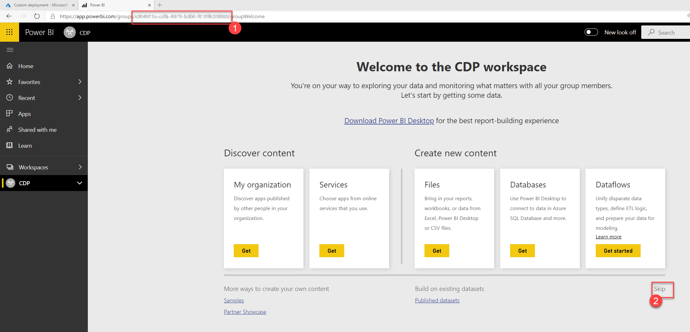

### Task 2: Create a Power BI Streaming Dataset

1. Sign in into the [Power BI Portal](https://powerbi.microsoft.com/en-us/) using your Azure credentials.

2. Go to your workspace and select **Create** 

 

3. Select **API** and select **Next** to continue. 

 
 
4. Enter **locationstream** as your **dataset name** and enter the field names and types listed below:

| Field Name       | Type     |
|------------------|----------|
| Category         | Text     |
| CustomerSegment  | Text     |
| DeptID           | Number   |
| DeptName         | Text     |
| EntryTime        | DateTime |
| ItemName         | Text     |
| Price            | Number   |
| Qty              | Number   |
| Sentiment        | Text     |
| StoreID          | Number   |
| StoreName        | Text     |
| TransactionID    | Number   |
| VisitorId        | Number   |
| VisitTime        | Number   |
| VisitType        | Text     |

 
 
Make sure **Historic data analysis** is enabled. Select **Create** to proceed.

 
 
5. Take note of the given **Push URL** to be used during the following setup tasks. Select **Done** to close the window.

 

### Task 3: Create a resource group in Azure

> If you have a CloudLabs environment, please skip this step and use the resource group you are provided.

1. Log into the [Azure Portal](https://portal.azure.com) using your Azure credentials.

2. On the Azure Portal home screen, select the **+ Create a resource** tile.

    

3. In the **Search the Marketplace** text box, type **Resource group** and press the **Enter** key.

    

4. Select the **Create** button on the **Resource group** overview page.

5. On the **Create a resource group** screen, select your desired Subscription and Region. For Resource group, enter **Synapse-WWI-Lab**, then select the **Review + Create** button.

    

6. Select the **Create** button once validation has passed.

### Task 4: Create Azure Synapse Analytics workspace

1. Deploy the workspace through the following Azure ARM template (press the button below):

    <a href="https://portal.azure.com/#create/Microsoft.Template/uri/https%3A%2F%2Fraw.githubusercontent.com%2Fmicrosoft%2FAzure-Analytics-and-AI-Engagement%2Fmain%2FCDP-Retail%2Fartifacts%2Fenvironment-setup%2Fautomation%2F00-asa-workspace-core.json" target="_blank"></a>

2. On the **Custom deployment** form fill in the fields described below.

* **Subscription**: Select your desired subscription for the deployment.
* **Resouce group**: Select the **Synapse-WWI-Lab** resource group you previously created.
* **Unique Suffix**: This unique suffix will be used naming resources that will created as part of your deployment. Make sure you follow correct Azure [Resource naming](https://docs.microsoft.com/en-us/azure/cloud-adoption-framework/ready/azure-best-practices/naming-and-tagging#resource-naming) conventions.
* **SQL Administrator Login Password**: Provide a strong password for the SQLPool that will be created as part of your deployment. [Visit here](https://docs.microsoft.com/en-us/sql/relational-databases/security/password-policy?view=sql-server-ver15#password-complexity) to read about password rules in place. Your password will be needed during the next steps. Make sure you have your password noted and secured.
* **Location**: The datacenter where your Azure Synapse environment will be created.
* **Streaming Dataset**: The name of your Twitter PowerBI Dataset that will be automatically created by Azure Stream Analytics. Feel free to leave the default value.
* **Pbi Worksapce Id**: The Power BI workspace ID for your default workspace on the Power BI Portal. 
* **Streaming Url**: The **Push Url** you received at the end of Task 1 in the Setup Guide.
* **Event Hub Name**: The name of the event hub that will be used to dump tweets recevied from Twitter through an Azure Function. Feel free to leave the default value.
* **Asa name**: The name of the Azure Stream Analytics Job that will be created to read data from Event Hubs and send to a Power BI streaming dataset.

    
  
    > **Important**: The `location` field under 'Settings' will list the Azure regions where Azure Synapse Analytics (Preview) is available as of July 2020. This will help you find a region where the service is available without being limited to where the resource group is defined.

3. Check the **I agree to the terms and conditions stated above**, then select the **Purchase** button. The provisioning of your deployment resources will take approximately 13 minutes. **Wait** until provisioning successfully completes before continuing. You will need the resources in place before running the scripts below.

    > **Note**: You may experience a deployment step failing in regards to Role Assignment. This error may safely be ignored.

### Task 5: Download artifacts

> The WWI environment can be populated either with a large dataset with 30 billion records, or a smaller dataset with 3 million records. The loading time for the large dataset is 4-5 hours. If you are willing to load 30 billion records, follow the steps described in [Optional Features / 30 Billion Rows Dataset](#30-billion-rows-dataset).

1. In the Azure Portal, open the Azure Cloud Shell by selecting its icon from the right side of the top toolbar.

    

    > **Note**: If you are prompted to choose a shell, select **Powershell**, and if asked to create a storage account for the Cloud Shell, agree to have it created.
    
    

2. In the Cloud Shell window, enter the following command to clone the repository files.

    ```PowerShell
    git clone https://github.com/microsoft/Azure-Analytics-and-AI-Engagement.git synapse-wwi
    ```
    
    

3. Keep the Cloud Shell open.

### Task 6: Establish a user context

1. In the Cloud Shell, execute the following command:

    ```cli
    az login
    ```

2. A message will be displayed asking you to open a new tab in your web browser, navigate to [https://microsoft.com/devicelogin](https://microsoft.com/devicelogin) and enter the code you have been given for authentication.

   

   

3. Once complete, you may close the tab from the previous step and return to the Cloud Shell.

   

### Task 7: Run environment setup PowerShell script

When executing the script below, it is important to let the scripts run to completion. Some tasks may take longer than others to run. When a script completes execution, you will be returned to a command prompt. The total runtime of all steps in this task will take approximately 15 minutes.

1. In the Cloud Shell, change the current directory to the **automation** folder of the cloned repository by executing the following:

    ```PowerShell
    cd './synapse-wwi/CDP-Retail/artifacts/environment-setup/automation'
    ```

2. Execute the **01-environment-setup.ps1** script by executing the following command:

    ```PowerShell
    ./01-environment-setup.ps1
    ```
    
    If you are running your automation on a local environment to populate 30 billion rows data, you will be prompted to specify the size of the data you want to populate into the Sales table. You can either chose the small data size with 3 million records, or the large data size with 30 billion records. Choosing 30 billion records will have the script scale your SQL Pool to DW3000c during data transfer, which might take up to 4 hours.
    
    
    
    You may be prompted to enter the name of your desired Azure Subscription. You can copy and paste the value from the list to select one.   

    You will also be prompted for the following information for this script:

    | Prompt |
    |--------|
    | Enter the SQL Administrator password you used in the deployment |

    
    
    Select the resource group you selected during Task 3.2. This will make sure automation runs against the correct environment you provisioned in Azure.
    
    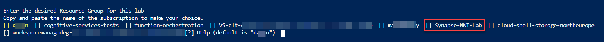

    You will be asked to go through another round of device login for the Power BI Gateway access. Repeat the steps in Task 4.2 and 4.3 to complete the process.
    
    Finally, you will be prompted for the default Power BI workspace Id for your account.
    

    During the execution of the automation script you may be prompted to approve installations from PS-Gallery. Please approve to proceed with the automation.   

    
    
3. Sign in into the [Power BI Portal](https://powerbi.microsoft.com/en-us/) using your Azure credentials.

4. From the hamburger menu select **Workspaces** to access the list of workspaces available to you. Select your workspace.


5. Select the **Settings** icon from the top right bar, and select **Settings** again to navigate to the settings page.


6. Select **datasets** tab to access the list of datasets available. Then select `2-Billion Rows Demo` dataset to access its settings. From the settings page open **Data source credentials** and select **Edit credentials**.


7. Select **Microsoft Account** for the **Authentication method** and select **Sign In** to complete the process.


### Task 8: Location Analytics Streaming Dataset Setup

1. Log into the [Azure Portal](https://portal.azure.com) using your Azure credentials.

2. On the Azure Portal home screen, go to **Search** and search for **locfunction**. Once the azure function is found select it to proceed.


3. Select **Functions** from the left menu to list the functions available in the function app. Next, select the function named **Start**.


4. In the **Overview** tab select **Get Function Url** and select **Copy to clipboard** to copy the Url for the function into your clipboard.


5. Open a new browser tab, paste the url and navigate to function endpoint to start location analytics data generator.


6. Once the Azure Function starts you can start building Power BI real-time reports for your new Power BI dataset. The name of the dataset is the value you provided during Task 2.4 of this setup guide.


### Task 9: Twitter Analytics Streaming Dataset Setup

1. Log into the [Azure Portal](https://portal.azure.com) using your Azure credentials.

2. On the Azure Portal home screen, go to **Search** and search for **tweets**. If you provided a different name for you Azure Stream Analytics Job use the same name for your search term.


3. Select **Start** to start the Azure Stream Analytics Job.


4. Once the job starts gathering data you can start building Power BI real-time reports for your new Power BI dataset that will be create by the Azure Stream Analytics job. The name of the dataset is based on the value you provided for the configuration parameter named **Streaming dataset** during template deployment.

### Task 10: Twitter Analytics Report

1. Launch [Power BI Desktop](https://powerbi.microsoft.com/en-us/desktop/) on your machine.

2. **Sign in** using your Power BI account credentials.

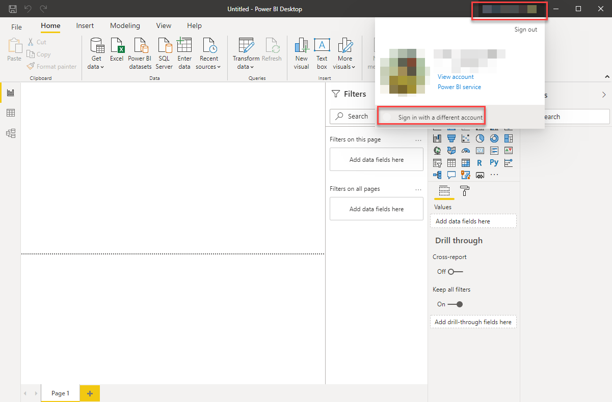

3. Select **Get Data** from the **Home** toolbar. Select **Power BI datasets** to proceed.

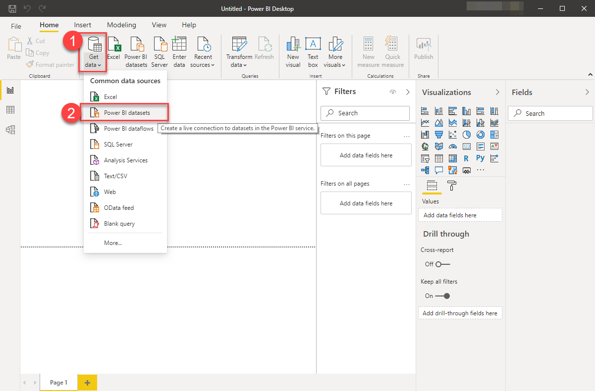

4. Select **Tweetsout** from the list of datasets. The name of the dataset is based on the value you provided for the configuration parameter named **Streaming dataset** during template deployment. It might be different in your case if you have changed the default value during deployment.

> Please note, it make take several minutes for this dataset to show up on the list. The Stream Analytics job you started in the previous task sends data to Power BI. There is an initial delay before the dataset initially appears after receiving the initial load of streaming data. If you do not see it listed, select Cancel to close this dialog, then re-open it.

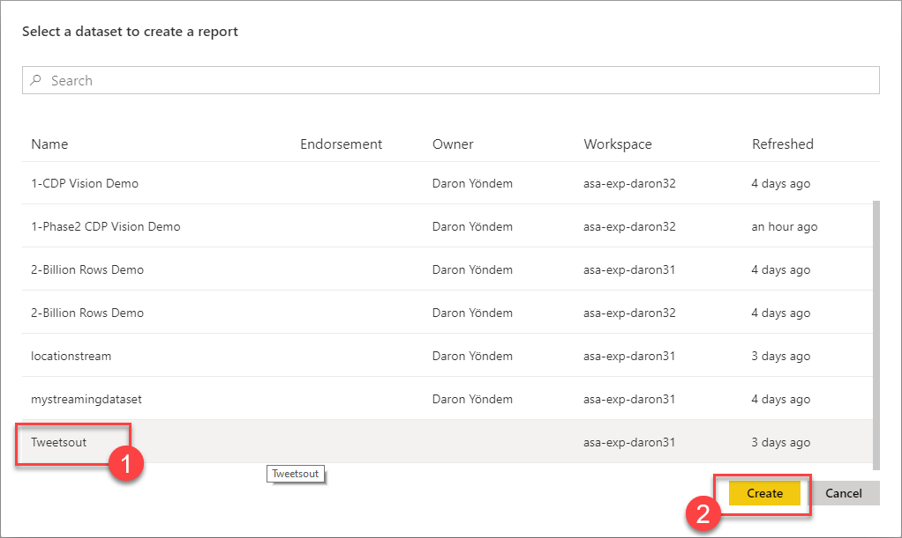

5. To create **Tweets by City Visualization**, which is the count of neutral sentiment tweets over a geographical region, select the map icon from the Visualization tray.

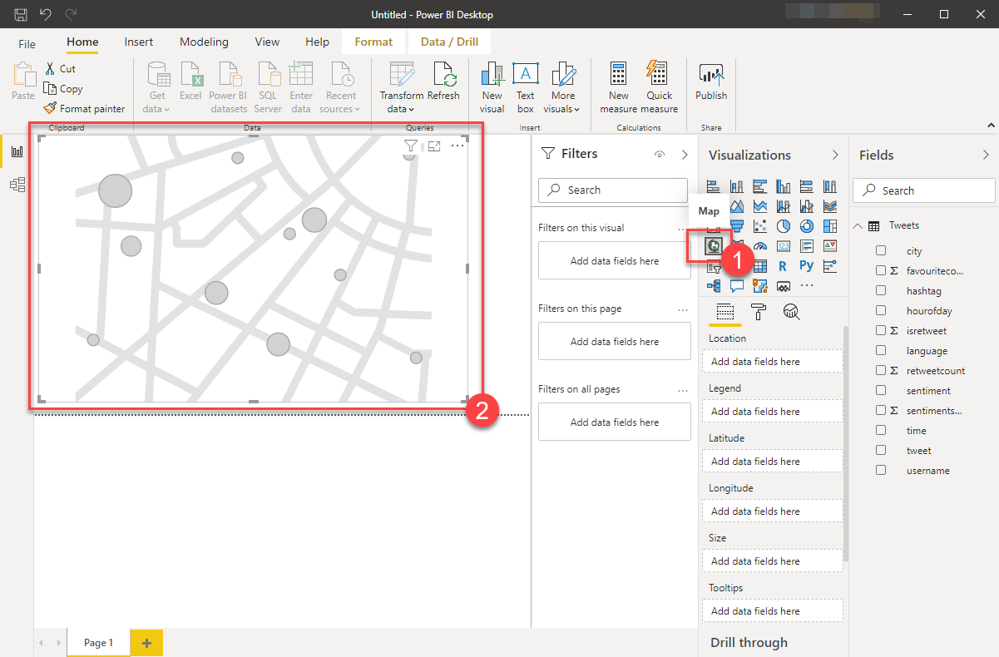

6. Select **city**, **sentiment** and **tweet** fields to be included into the report. Move the **Tweet** field into the **Size** section.

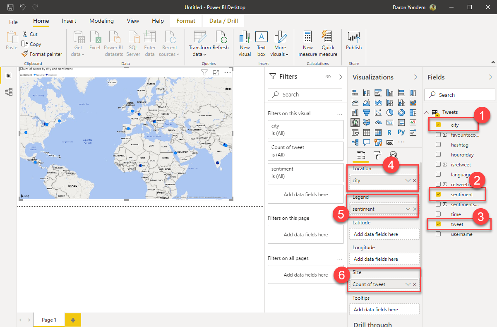

7. Save your report locally, and then publish it to your workspace to be used during your demo. _This is the workspace you created in Task 1_.

### Task 11: Location Analytics Real-Time Report

1. Launch [Power BI Desktop](https://powerbi.microsoft.com/en-us/desktop/) on your machine.

2. **Sign in** using your Power BI account credentials.


3. Select **Get Data** from the **Home** toolbar. Select **Power BI datasets** to proceed.


4. Select **locationstream** from the list of datasets. The name of the dataset is the value you provided during Task 2.4 of this setup guide. It might be different in your case if you picked a different name.

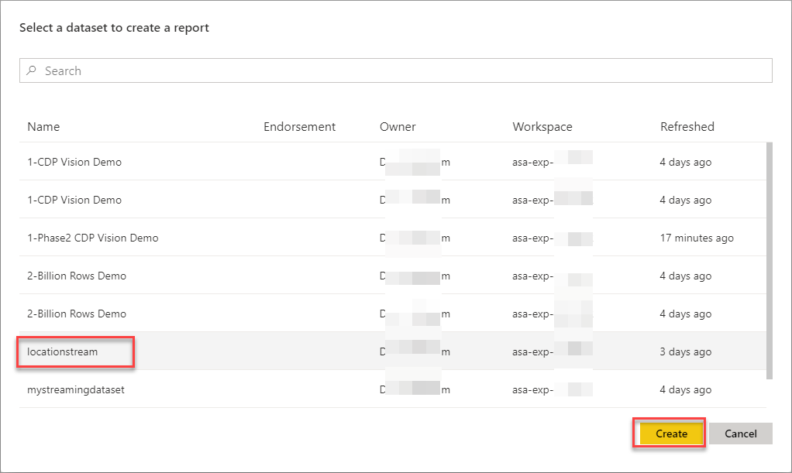

5. To create a **Lined and stacked column Chart** for Avg Visit Time and Visitors by customer segment and department with the help of real-time data, select the map icon from the Visualization tray.

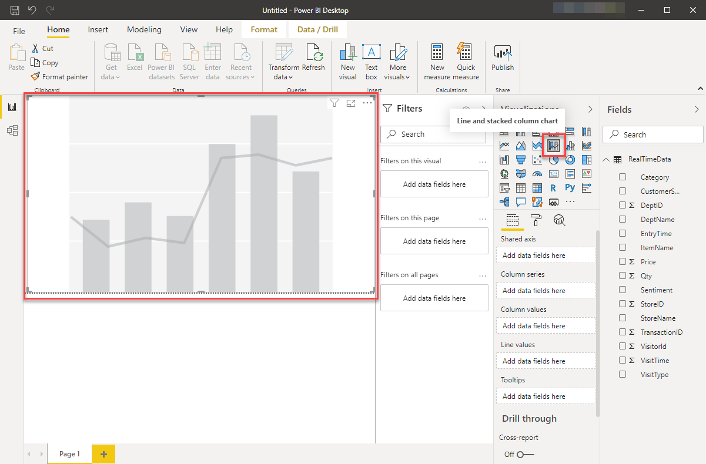

6. Select **CustomerSegment**, **DeptName**, **VisitorId** and **VisitTime** fields to be included into the report. 

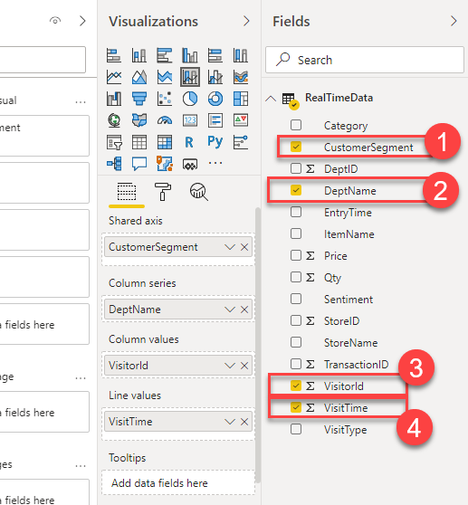

7. Move **VisitTime** to Column Values and select to use its **average** value. Move **VisitorId** to Line values and select its **count** value to be used in the report.

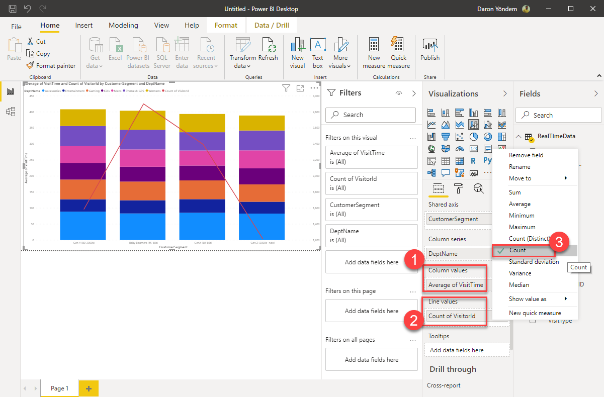

8. Save and publish your report to your workspace to be used during your demo.

### Task 12: Power BI Dashboard 

1. Sign in into the [Power BI Portal](https://powerbi.microsoft.com/en-us/) using your Azure credentials.

2. Select **Workspaces** from the left menu and select the **CDP** workspace you previously created.

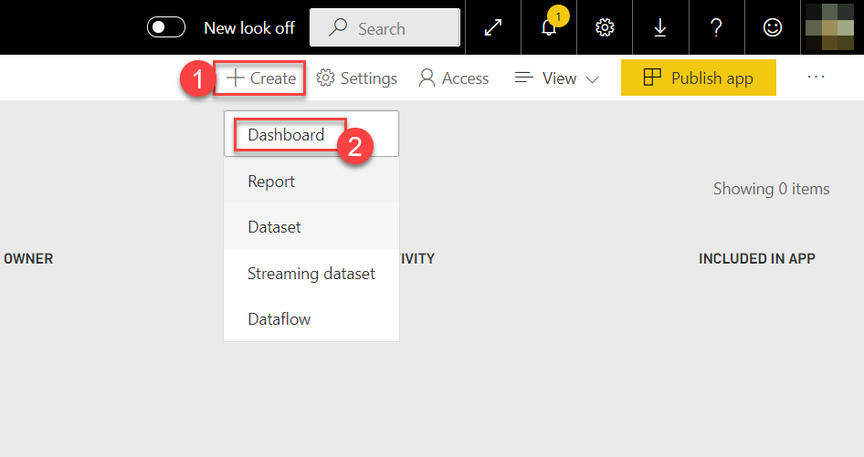

3. Name your dashboard **CDP**.

4. Select **Workspaces** from the left menu and select the **CDP** workspace you previously created.

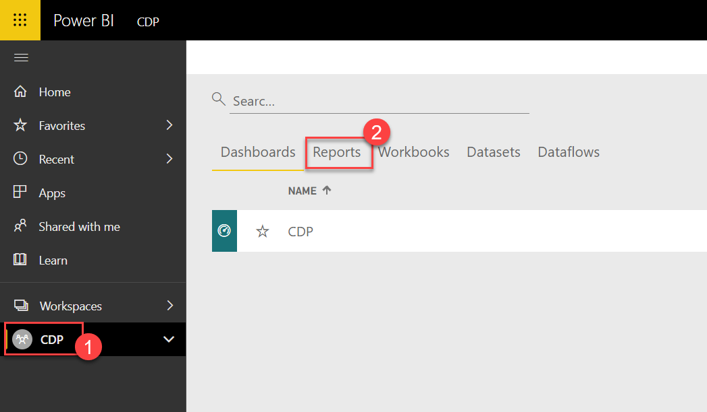

5. Select **Phase2 CDP Vision Demo** report.

6. Select **Pin Visual** from any of the tiles available in the report to pin it into your dashboard.

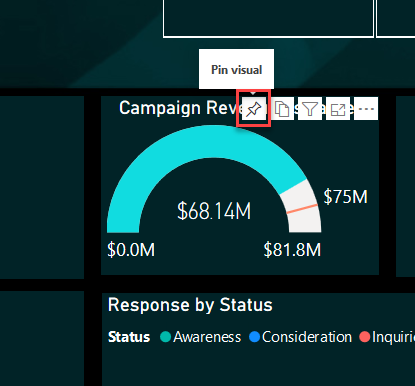

7. Select the **CDP** dashboard and select **Pin**.

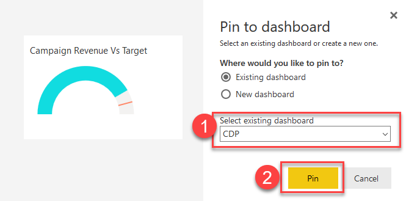

So far, you have pinned one tile from a single report to your dashboard. Feel free to navigate to different reports and pin the tiles you find appropriate to create your dashboard to achieve the look presented below.

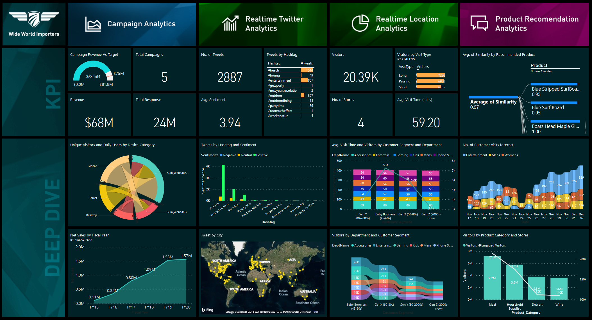

The dashboard shown above has images used on the top row and the first column to the left. These images are available in a report called **Dashboard-images**. You can access all images from **Dashboard-images** to pin it into your design.

## Optional Features

### 30 Billion Rows Dataset

The WWI environment can be populated with 30 billion records to demonstrated large data scenarios. Due to the limits of Azure Cloud Shell's 20-minute runtime, the automation has to run on a stand-alone machine against your subscription to be able to go through the 4-5 hours long data loading process. If you decide to go with the 30 billion records option, use a local Powershell instance with admin privileges instead of Azure Cloud Shell.

1. [Install Azure CLI](https://docs.microsoft.com/en-us/cli/azure/install-azure-cli?view=azure-cli-latest) and [Git](https://git-scm.com/downloads) to your computer.

2. Navigate to a folder location you prefer on your computer and execute the command below to download automation scripts and artifacts.


    ```PowerShell
    git clone https://github.com/microsoft/Azure-Analytics-and-AI-Engagement.git synapse-wwi
    ```
    
    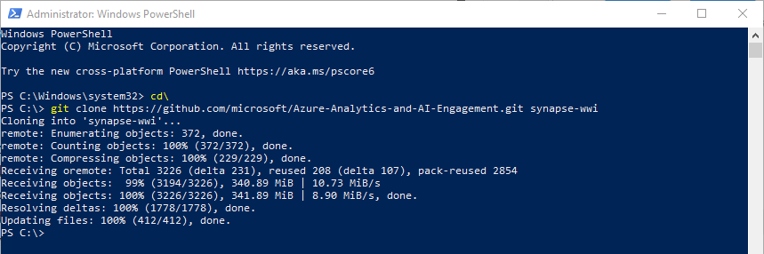

3. Execute the following command to authenticate your powershell session with your Azure Subscription:

    ```cli
    az login
    ```
    
4. Execute the following command to authenticate the script session with your Azure Subscription:

    ```cli
    Connect-AzAccount
    ```
    
5. Continue your environment setup from [Task 7 in the Before Starting guide](#task-7-run-environment-setup-powershell-script)).

### Twitter Developer Account Application

The Twitter Real-Time Analytics report in you created during task 10 can be connected to the real world, and fetch real-time tweets from twitter instead of the simulator deployed as part of your environment. In order to connect your report to Twitter you will need a Twitter Developer Account. Below are the steps to apply for one.

1. Visit [Twitter Developer Portal](https://developer.twitter.com/en/apply-for-access) to start your application for a Twitter Developer Account.

2. Select **Apply for a developer account** to start your application.

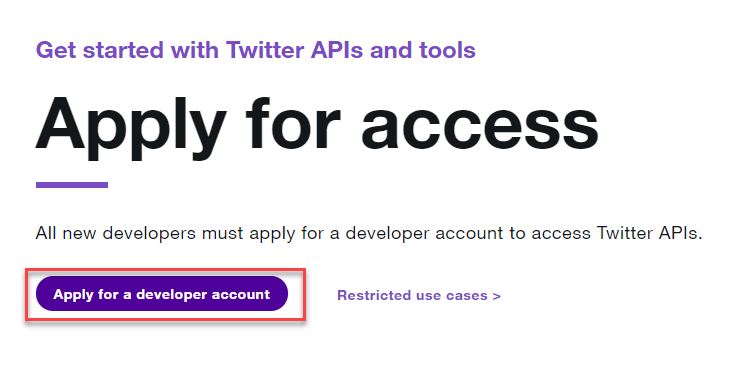

3. Select **Building B2B products** for your reason to build your application.

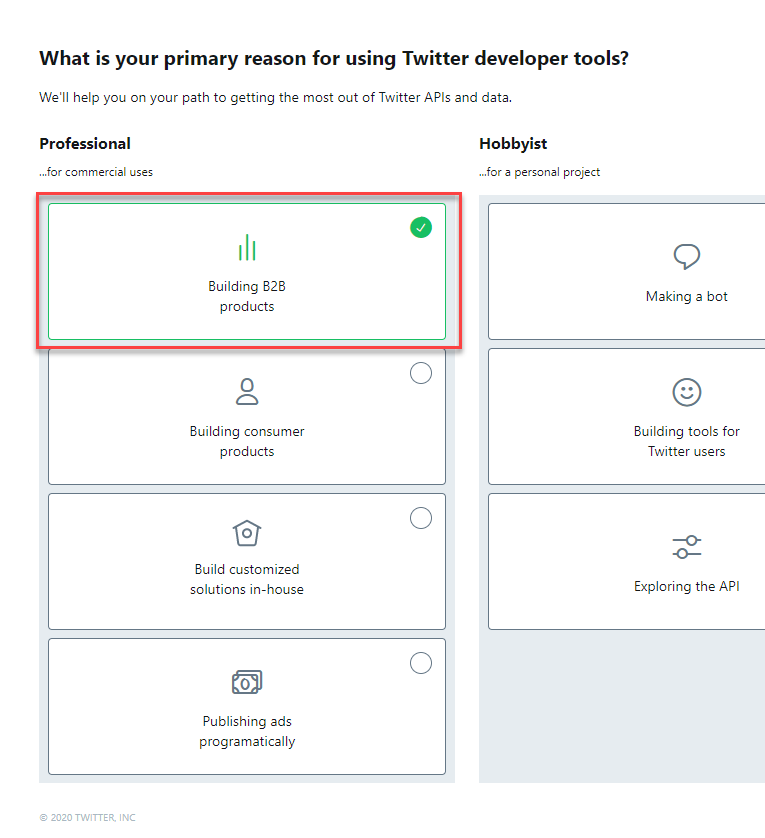

4. Make sure all information is correct and **Team developer account** is selected for your application.

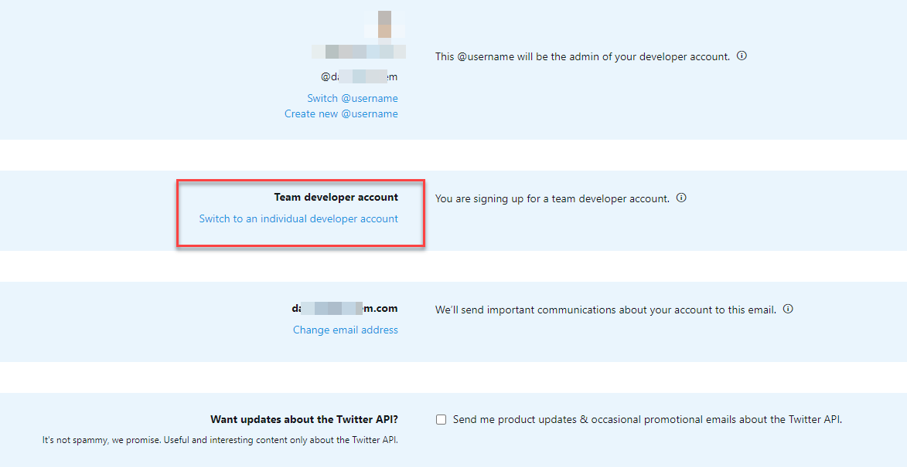

5. In this step you will have to explain how you plan to use your developer account. Fill in your reasoning with your own words. Make sure you toggle the **Are you planning to analyze Twitter data** question **ON**.

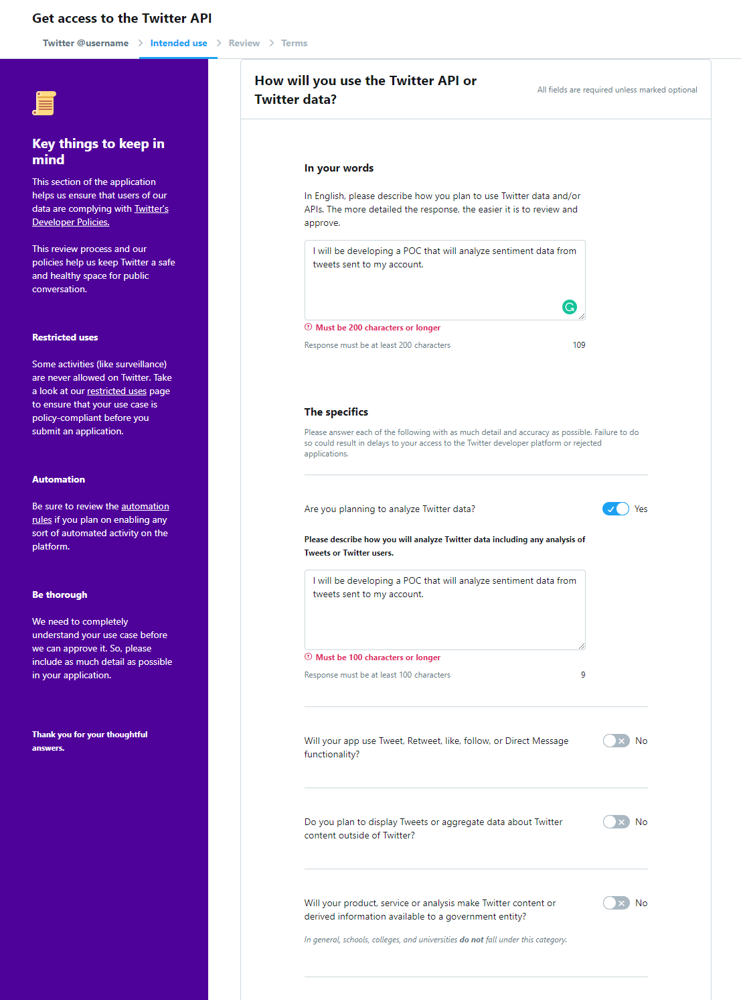

6. During the next step you will be asked to confirm your e-mail by clicking a link in an e-mail sent to your e-mail address attached to your Twitter account. Select the link in your e-mail and verify your e-mail address.

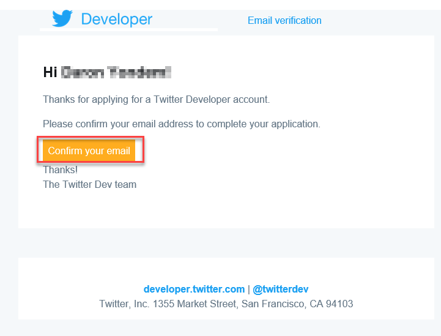

7. Now your application is complete. It will be reviewed by Twitter, and you will receive a confirmation e-mail soon.

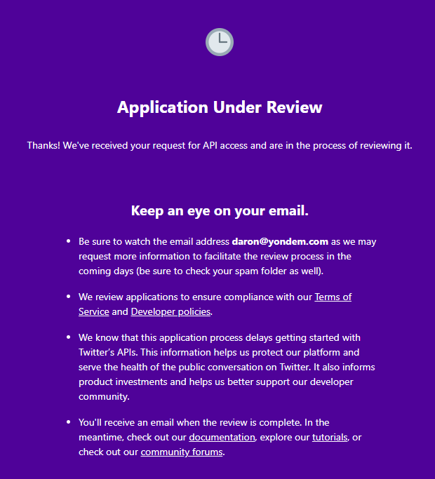


