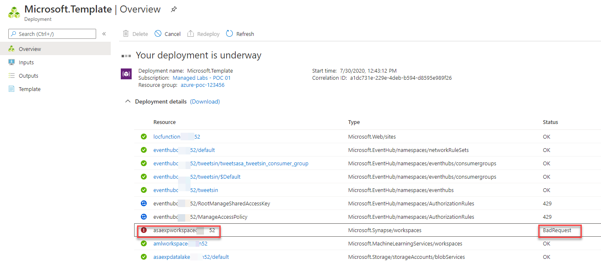
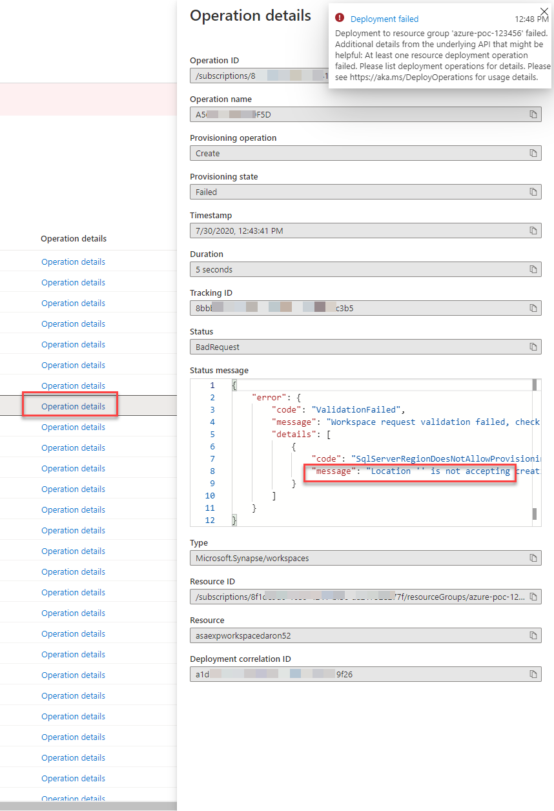
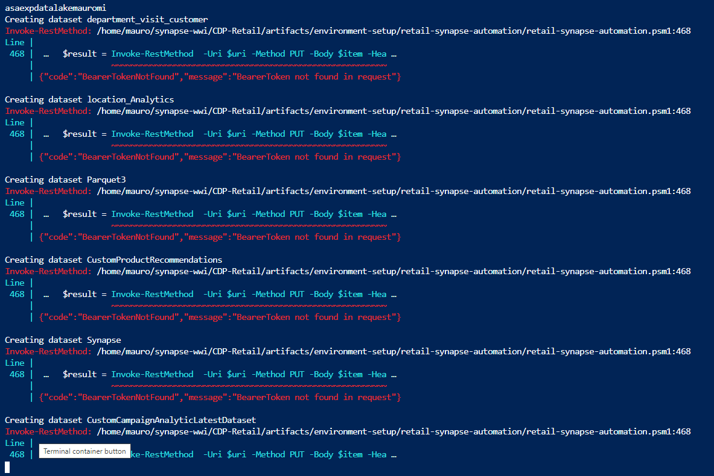

# Questions and Answers

**Q:** My deployment is failing with **BadRequest** status during ARM deployment. 

**A:** Navigate to the operation details for the failing operation and see the status message. If the message mentions "`Location '' is not accepting creation of new Windows Azure SQL Database servers at this time.`" try another data center for your deployment.

**Q:** Script execution gives me following error.

**A:** Ensure you executed "az login" command before running the powershell script. Also there should not be a long delay between execution of both commands. You can also check the response of 'az account get-access-token --resource https://dev.azuresynapse.net' command to make sure you have enough previleges to generate authentication tokens.

