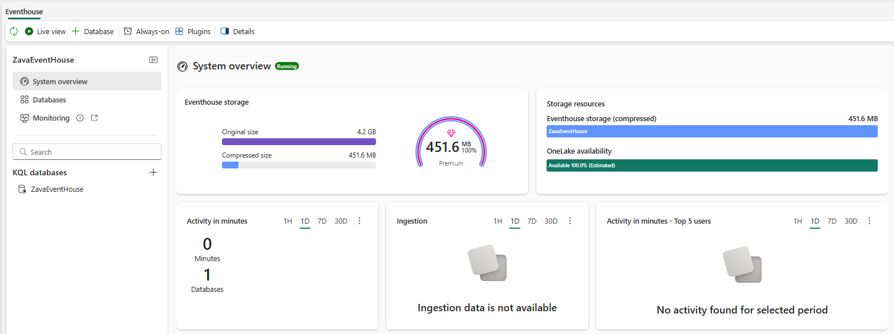
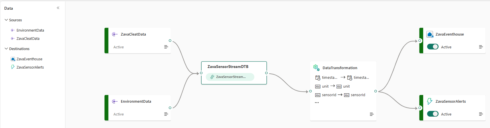
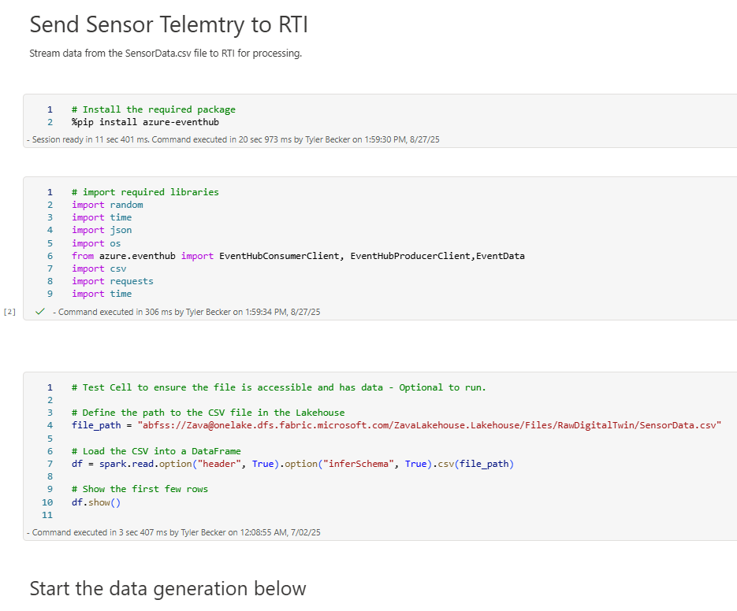

# Microsoft Fabric Digital Twin Builder Demo Deployment Guide

This deployment guide provides step-by-step instructions to deploy the Microsoft Fabric Digital Twin Builder demo into your Fabric tenant.

## Prerequisites
- An active Microsoft Fabric tenant
- Required permissions to create resources and deploy solutions
- Azure CLI (optional) or other deployment tooling as documented below

## Quick start
1. Review the prerequisites and ensure you have access to the target tenant.
2. Follow the deployment steps in this repository (see infra, scripts, and notebooks).
3. Configure any required secrets and tenant-specific settings prior to running deployments.

## Download the Demo Datafiles 
The data files for this demo represent sensor readings from the shoes.  There are two data files which can be downloaded from a public shared Azure storage account.  To download the files you can use wget, curl or azcopy.  

From a command prompt, run the following command to download the files:

<i>
azcopy copy --recursive "https://zavapublicdemodata.blob.core.windows.net/digitaltwin/RawData/" ./ 
</i>

## Create a Lakehouse and load demo datafiles
Log into Fabric and create a Lakehouse.  Upload the previously download files to the newly created Lakehouse.  These files will be used by the data generation notebooks at the end.

## Create Eventhouse
Create an eventhouse that will be used to store the RTI events.  In the eventhouse create a database called <b>ZavaEventHouse</b>.

## Create the Eventstream
Create an event stream:

## Deploy Data Generation Notebooks
Import the notebooks from the Github repo to your Fabric workspace.  Update the key location information in the notebook to point to your Lakehouse files.

<!-- Screenshot: ../img/Fabric-Notebook.png -->

## Running the demo
> Note: A more detailed Demo Guide is included to help walk through the end to end demo.

## Where to get help
If you need assistance deploying this demo, contact your team lead or open an issue in the repository.
