**Contents**

<!-- TOC -->

- [Azure Synapse hands-on lab step-by-step](#)
  - [Accessing Synapse Workspace](#Accessing-Synapse-Workspace)
  - [Exercise 1: Data Orchestration and Ingestion](#Exercise-1-Data-Orchestration-and-Ingestion)
    - [Task 1: Data Ingestion](#Task-1-Data-Ingestion)
    - [Task 2: Migrate SAP Hana to Azure Synapse Analytics](#Task-2-Migrate-SAP-Hana-to-Azure-Synapse-Analytics)
    - [Task 3: Code First Experience: Migrate Teradata to Azure Synapse Analytics](#Task-3-Code-First-Experience-Migrate-Teradata-to-Azure-Synapse-Analytics)
    - [Task 4: Migrate last five years of sales transactional data from Oracle to Azure Synapse Analytics](#Task-4-Migrate-last-five-years-of-sales-transactional-data-from-Oracle-to-Azure-Synapse-Analytics)
    - [Task 5: Moving semi-structured data to Azure Synapse Analytics](#Task-5-Moving-semi-structured-data-to-Azure-Synapse-Analytics)
    - [Task 6: On Demand Query: Azure Data Lake Gen2](#Task-6-On-Demand-Query-Azure-Data-Lake-Gen2)
    - [Task 7: COPY INTO Command](#Task-7-COPY-INTO-Command)
  - [Exercise 2: Develop Hub](#Exercise-2-Develop-Hub)
    - [Task 1: Running Queries against 30 Billion records](#Task-1-Running-Queries-against-30-Billion-records)
    - [Task 2: JSON Extractor Differentiator and other optional differentiator](#Task-2-JSON-Extractor-Differentiator-and-other-optional-differentiator)
    - [Task 3: Using Notebooks to Run Machine Learning Experiments](#Task-3-Using-Notebooks-to-Run-Machine-Learning-Experiments)
    - [Task 4: AutoML in Azure Synapse Analytics](#Task-4-AutoML-in-Azure-Synapse-Analytics)
  - [Exercise 3: Power BI reporting within the Synapse Analytics workspace](#Exercise-3-Power-BI-reporting-within-the-Synapse-Analytics-workspace)
    - [Task 1: Accessing PowerBI reports in Synapse Analytics workspace](#Task-1-Accessing-PowerBI-reports-in-Synapse-Analytics-workspace)
    - [Task 2: Ad Hoc Reporting in Azure Synapse Analytics](#Task-2-Ad-Hoc-Reporting-in-Azure-Synapse-Analytics)

<!-- /TOC -->

Azure Synapse is a limitless analytics service that brings together enterprise data warehousing and Big Data analytics. It gives you the freedom to query data on your terms, using either serverless on-demand or provisioned resources—at scale. Azure Synapse brings these two worlds together with a unified experience to ingest, prepare, manage, and serve data for immediate BI and machine learning needs.

During the next exercises you will discover end-to-end analytics solutions with a unified experience within Azure Synapse Studio. You will have the chance to take a peek at data ingestion from SAP HANA, Oracle, Teradata and Twitter, running queries against 30 Billion records, use notebooks to run machine learning experiments, try AutoML, and finally use PowerBI within Azure Synapse to built reports.

# Accessing Synapse Workspace

First of all, let's see how you can access your Azure Synapse Workspace.

Select the Synapse Workspace web URL to access your Synapse Workspace.

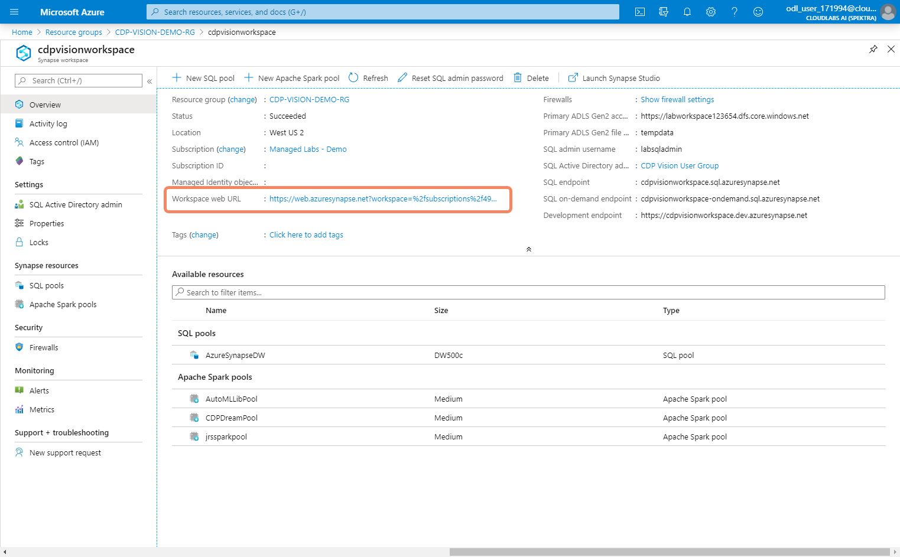 

Once you access your workspace select the arrow on the top of the left menu to open the slider and access various sections of the workspace.

## Exercise 1: Data Orchestration and Ingestion

With Azure Synapse's code-free data orchestration environment you can build ETL/ELT processes in a code-free visual environment to easily ingest data from more than 85 native connectors. Moreover, you can perform real-time analytics on streaming data directly in your data warehouse.

### Task 1: Data Ingestion

Let's take a look at how we can connect to external data sources in Azure Synapse and discover the rich list of connector available for use.

1. On the Synapse Home page select **Ingest**.

2. In the Copy data dialog select **Next**.

3. Select **Create new connection**

4. See all available data providers.

### Task 2: Migrate SAP Hana to Azure Synapse Analytics

SAP is one of the most widely-used enterprise software in the world. Azure Synapse empowers customers to integrate their existing SAP system with Azure to unblock business insights. In this exercise we will observe an Azure Synapse Pipeline that moves data from SAP Hana to an ADLS Gen2 storage, followed by a Data Flow that transform the data during the pipeline execution. 

1. Select **Orchestrate**

2. Select/Expand **Pipelines** and then select **SAP HANA TO ADLS** pipeline.

3. From the editor window select **Copy data** activity. Then select **Source** property of the **Copy data** activity to see the **Source Dataset** and observe that the query is pulling data from SAP Hana

4. With copy data selected, select the **Sink** property of the **Copy data** activity. Look at the **Sink** dataset, in this case; you are saving to ADLS Gen2 storage container.

5. Select **Mapping Data Flow** activity and then select **Settings**. Next select **Open** to go to **Data Flow** editor.

6. In Data Flow editor observe the flow. Look in detail into each activity using the following steps.

7.	In the **first activity**, we are selecting data from the Data Lake staging area.
8.	In the **second activity**, we are filtering data for the last 5 years.

9.	In the **third activity**, we are deriving columns from a **Column Order Date**.

10.	In the **fourth activity**, we are only selecting the required columns from the table.

11. In the **fifth activity**, we are creating an aggregated **Total Sales** grouped by **Year** and **Month**.

12. In the **sixth activity**, we load the aggregated table to Azure Synapse.

20. In the **seventh activity**, we are taking a parallel route by selecting all the remaining rows and writing the full table to Azure Synapse.

21. To view all the available transformations in the data flow editor, select the **+ (add action)**, which is to the right of the first activity.

22.	Scroll down to see the full list of transformations at different levels.

### Task 3: Code First Experience: Migrate Teradata to Azure Synapse Analytics

Azure Synapse not only has the code-free path, but can give you the ability to prepare data in an Azure Synapse Notebook. In this task we will use Python and observe the code first experience in Azure Synapse Analytics. We will move data from Teradata from to ADLS Gen 2 and preparing it with Python.

1. In the Orchestrate hub, select **MarketingDBMigration** from the list of pipelines.

> **Note:** This pipeline is for demonstration purposes only. __Do NOT execute__ the pipeline.

2. Select **Lookup** activity, then select **Settings** to observe the **Source dataset** property (Teradata).

3. Select **Copy data** activity and observe **Source** and **Sink** properties.

4. Select **Prep data in Azure Synapse** Notebook, then select **Settings**. Once you are in the settings tab, select **Open** to open the notebook

5.	Show the Python code. This is the code first experience in Synapse analytics.

### Task 4: Migrate last five years of sales transactional data from Oracle to Azure Synapse Analytics

Azure Synapse helps us copy data from an Oracle database to any supported sink data store. In this task we will check for the existance of the Oracle database and load data from Oracle into Azure Synapse with the Copy Data activity.

1. Select **SalesDBMigration** from the **Orchestrate** hub.

2. Select **Lookup** activity and then **Settings** to see **OracleSalesDB** field in **Source Dataset** field

3. Select **Copy data** and see Synapse as the **sink**.

### Task 5: Moving semi-structured data to Azure Synapse Analytics

Azure Synapse Analytics enables direct streaming ingestion support and ability to execute analytical queries over streaming data. Capabilities such as: joins across multiple streaming inputs, aggregations within one or more streaming inputs, transform semi-structured data and multiple temporal windows are all supported. For streaming ingestion, you can integrate with Event Hubs (including Event Hubs for Kafka) and IoT Hubs.

In this task, we will load tweets from an ADSL Gen2 and clean up the dataset.

1. Select **TwitterDataMigration** from the list of pipelines.

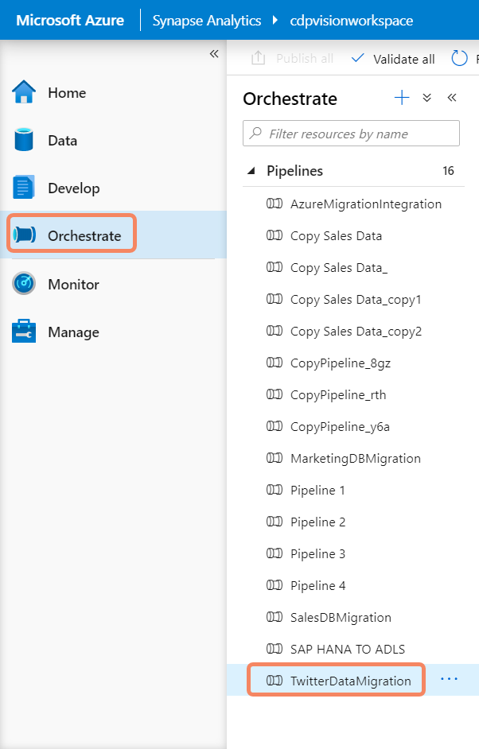

2. Look at the **Copy data**, **Archive Tweets data in ADLS Gen2** and **Clean up the archived Twitter Data** activities. 

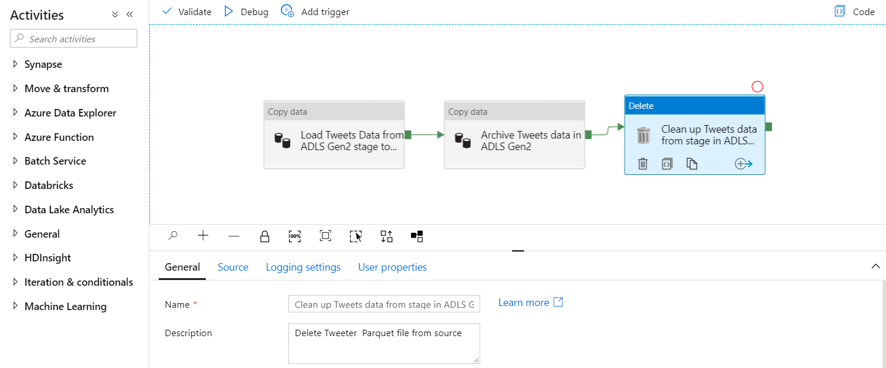

### Task 6: On Demand Query: Azure Data Lake Gen2

Every Azure Synapse Analytics workspace comes with SQL on-demand endpoints that you can use to query data in the lake. SQL on-demand is a query service over the data in your data lake. It is a distributed data processing system, built for large scale of data and compute. SQL on-demand enables you to analyze your Big Data in seconds to minutes, depending on the workload. Thanks to built-in query execution fault-tolerance, the system provides high reliability and success rates even for long-running queries involving large data sets.

SQL on-demand is serverless, hence there is no infrastructure to setup or clusters to maintain. A default endpoint for this service is provided within every Azure Synapse workspace, so you can start querying data as soon as the workspace is created. There is no charge for resources reserved, you are only being charged for the data scanned by queries you run, hence this model is a true pay-per-use model.

In this task, we will query twitter data stored as Parquet files in Azure Data Lake Gen 2 using SQL On-Demand, and visualize the result.

1. Select **Data** Hub from the left navigation in the Synapse Analytics workspace. From the **Data** blade, under **Storage accounts**, Select/expand **daidemosynapsestorageforgen2**. Observe various data sources (including CI) that are now in ADL Gen2 and then select **twitterdata** storage container.

2. See all the parquet files and other folders in the **twitterdata** container. Select the first two parquet files and right click, from the context menu, Select **New SQL Script**

3. Select **Run**.

**TODO 2** Currently not working.

4. Select **Chart**

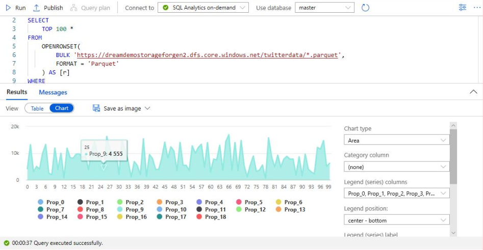

5. Minimize the **storage accounts** on the left side, then expand the **Databases** tree, expand **AzureSynapseDW (SQL pool)**, and finally expand **Tables** folder.

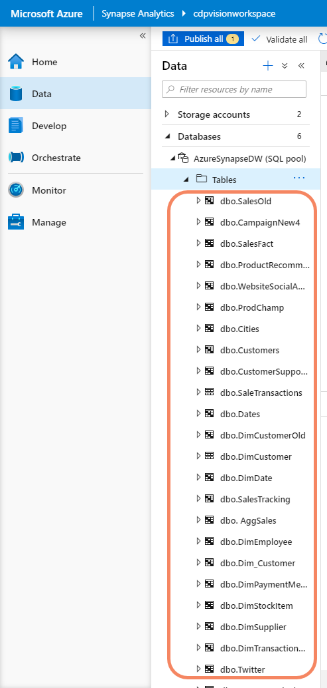

### Task 7: COPY INTO Command

One of the option to load data into Azure Synapse to be used in SQL queries is the COPY statement that helps loading data from external storage accounts. The COPY statement provides the most flexibility for high-throughput data ingestion into Azure Synapse. In this task, we will load twitter data storage in Azure Storage and run a query against it with the COPY INTO command.

1. Select **Develop**, then expand **SQL Scripts** to list all available scripts. Select **8 External Data to Synapse Via Copy Into** and highlight the query presented below titled **Step:1**.

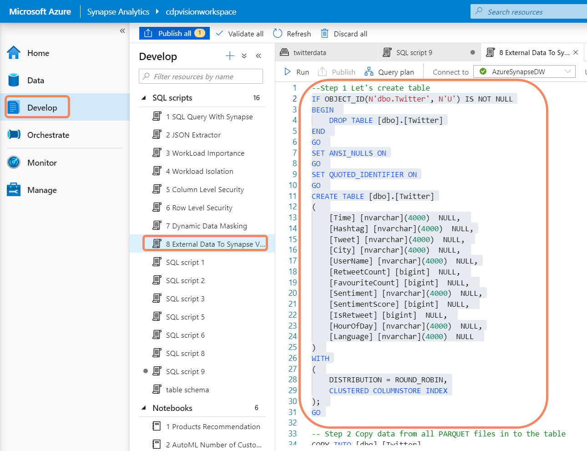

2. Select **Run** and observe the **No results found** message.

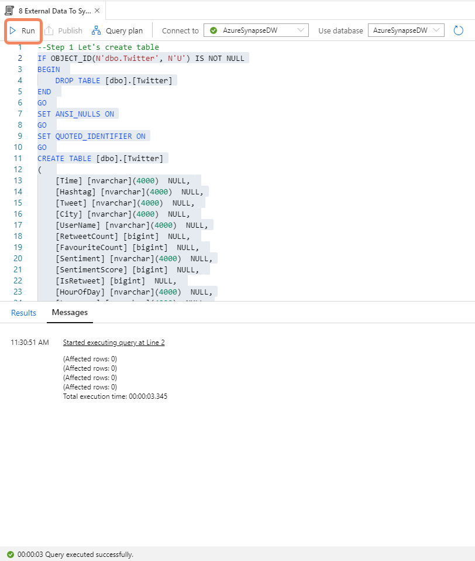

3.	Scroll to the bottom and select **COPY INTO** query below **Step:2** as shown in the screenshot. Finally, select **Run**

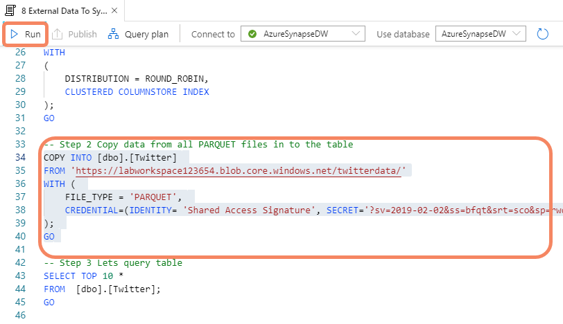

## Exercise 2: Develop Hub

The Develop Hub in Azure Synapse helps you work on SQL scripts, notebooks, data flows and PowerBI reports. It is part of Azure Synapse's unified experience for developing end-to-end analytics solutions. It significantly reduces project development time for BI and machine learning projects with a limitless analytics service that enables you to seamlessly apply intelligence over all your most important data and easily share data with just a few clicks.

During the next couple of tasks you will have a chance to look at how to develop queries in Azure Synapse, using notebooks to run machine learning experiments and an AutoMl customer forecasting scenario.

### Task 1: Running Queries against 30 Billion records

In this task we will run queries against 30 Billion records and create some early charts to get a feeling of how the data looks.

1. Select **Develop** in the various tabs available in the **Develop** hub workspace and discover the environment. 

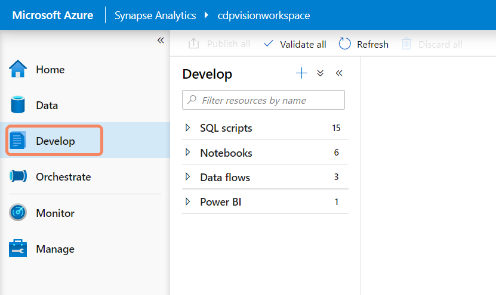

2. Select **SQL Scripts** and then select **1 SQL Query with Synapse**

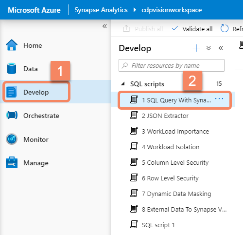

3. Select **AzureSynapseDW** SQL Pool from the **Connect to** drop down menu. Once the **Use database** drop dows is populated select **AzureSynapseDW** database from the **Use Database** drop down. Finally, select the below query (#3 in the screenshot)

`SELECT COUNT_BIG(1) as TotalCount  FROM wwi.Sales(nolock)`

4. Select **Run** and observe the results (30 Billion).

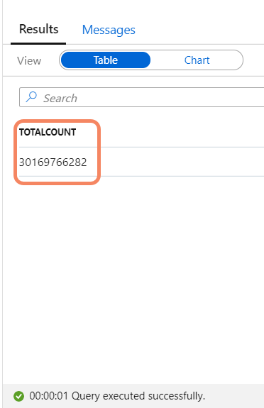

5. Scroll down a few lines to the second query, select the query as shown in the screenshot, and then select **Run**. Observe time the query takes – query time is listed at the bottom of the screenshot.

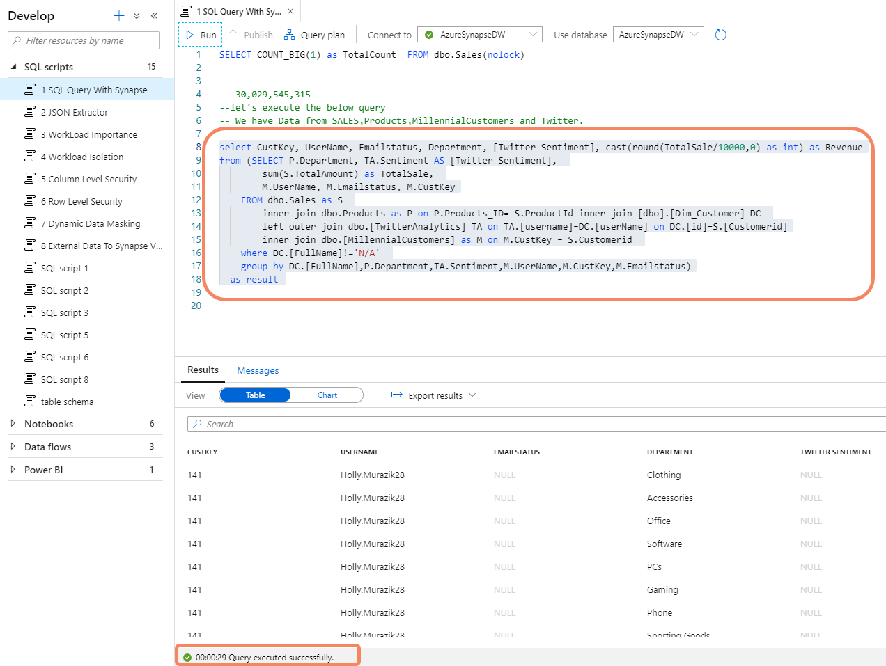

5. Select the **chart** button, and then select **chart type** dropdown to see various chart types 

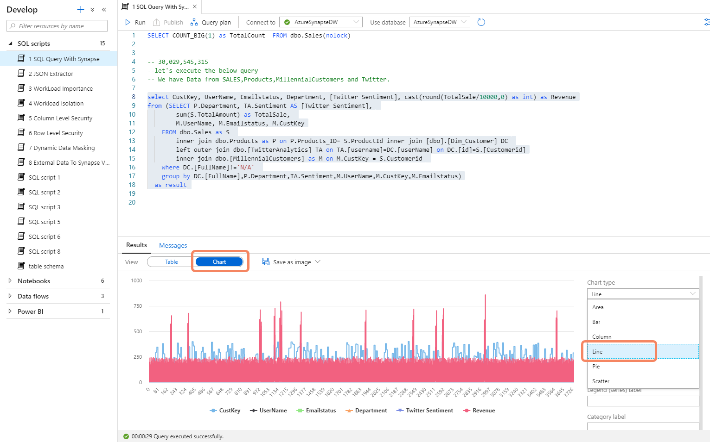

### Task 2: JSON Extractor Differentiator and other optional differentiator

To speed up time to insight and minimize unnecessary data transformation processes, Azure Synapse enables support for querying JSON data. Business analysts can now use the familiar T-SQL language to query and manipulate documents that are formatted as JSON data. JSON functions, such as `JSON_VALUE, JSON_QUERY`, `JSON_MODIFY`, and `OPENJSON` are available in Azure Synapse. In this task, we will take JSON data and extract specific structured columns using T-SQL.

1. Select **Develop**, and then select **2 JSON Extractor**. 
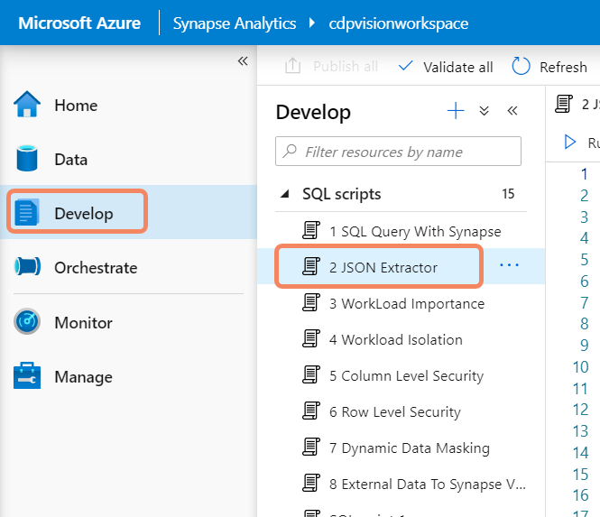

2. From the **Connect to** dropdown connect to **AzureSynapseDW** SQL Pool. Select the query as shown in the screenshot and select **Run**.

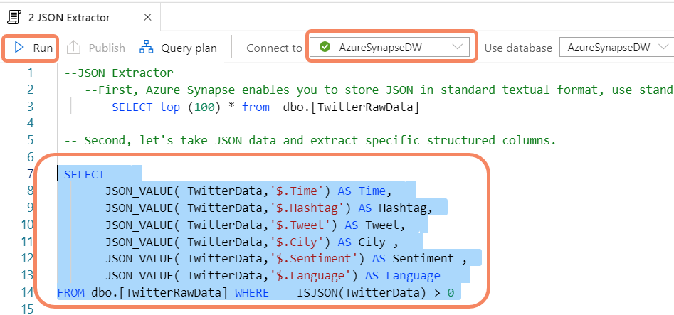

3. Observe the results of query 

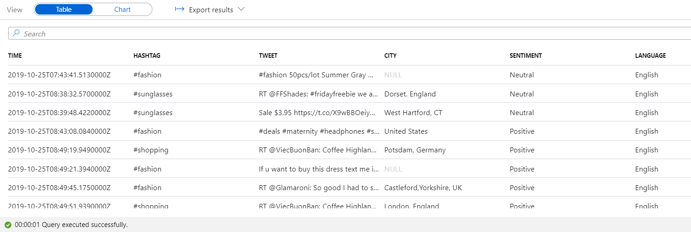

### Task 3: Using Notebooks to Run Machine Learning Experiments

An Azure Synapse Studio notebook is a web interface for you to create files that contain live code, visualizations, and narrative text. Notebooks are a good place to validate ideas and use quick experiments to get insights from your data. Notebooks are also widely used in data preparation, data visualization, machine learning, and other Big Data scenarios.

In this task, we will use PySpark to run a notebook on a Spark Pool.

1. Select the **Develop** hub from the Synapse workspace. Next, select and expand the **Notebooks** option.

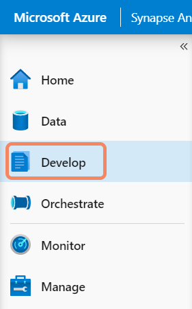

2. Select the **1. Product Recommendations** notebook, which will open the notebook.

3. Once the notebook is open, select **CDP DreamPool** from the **Attach to** dropdown. CDP DreamPool is a Spark Pool. Select **PySpark** from the **Language** dropdown list.

4. Expand **Language** and see supported languages.

5. Observe the import statements in the Notebook 

**TODO 4** Not available in the environment

6. Observe the results in the notebook under **Map Products**.

See code in **cell 26**, but **DO NOT** execute any code.

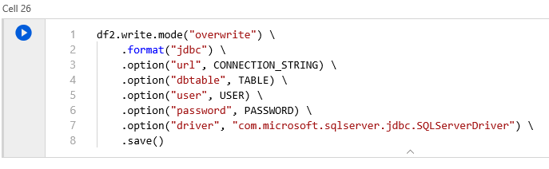

### Task 4: AutoML in Azure Synapse Analytics 

Automated machine learning, also referred to as automated ML or AutoML, is the process of automating the time consuming, iterative tasks of machine learning model development. It allows data scientists, analysts, and developers to build ML models with high scale, efficiency, and productivity all while sustaining model quality. In this task we will look at a notebook to learn how AutoML in Azure Synapse Analytics works.

1. Select **Develop** from the Synapse workspace

2. Expand **Notebooks** section and select **2 AutoML Customer Forecasting** Notebook.

3. Scroll down to see the content in the screenshot in Cell 22.

4. Scroll down to observe the content in the screenshot in Cell 26.

5. Scroll down to see the code in **cell 38**.

6. Scroll down to see **cell 41**.

## Exercise 3: Power BI reporting within the Synapse Analytics workspace 

In Azure Synapse, business analysts can securely access datasets and use Power BI to build dashboards in minutes, all while using the same analytics service. DirectQuery allows you to create dynamic reports based on data and metrics you already have in Azure Synapse.

In this exercise we will see how PowerBI integrates into Azure Synapse Analytics workspace and run ad-hoc reports against our data set.

### Task 1: Accessing PowerBI reports in Synapse Analytics workspace

Let's explore how we can access PowerBI reports in the Synapse Analytics workspace.

1. Select **Develop** from the Synapse workspace and expand the **Power BI** section. Next, expand **Data & AI Demo** (which is a Power BI workspace) and expand **Power BI** reports. Finally, select **1. CDP Vision Demo** Power BI report. This will open the decomposition tree.

2. Once the report is open, in the **Decomposition Tree Analysis** tab see **Store Visits by Campaign** then by **Region**. Select **+** next to **North & Central America** 

3. Select **QnA** tab 

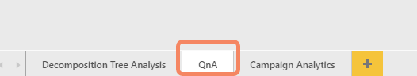

4. In the **Q&A** box, type **profit by country by product category as treemap**

### Task 2: Ad Hoc Reporting in Azure Synapse Analytics

With Azure Synapse, data professionals can query both relational and non-relational data using the familiar SQL language. This can be done using either serverless on-demand queries for data exploration and ad hoc analysis or provisioned resources for your most demanding data warehousing needs.

In this task we will modify a report using Ad-Hoc queries as its underlying data access choice.

1. From the **Develop** hub, **Power BI** section select **2. Billion Rows Demo** Power BI report.

2. Select the empty area in the report canvas. Next, from the **Fields** list select or drag and drop **CustomerId** from **wwi AllSales** table to the report canvas.

3. From the Visualizations pane select the **card visual**. Resize and move the **card visual** to see what is shown in screenshot.

4. Select the empty area in the report canvas. From the **Fields** list select or drag and Drop **CustomerId** from **wwi AllSales** table to the report canvas. [Pointer 1 from the screenshot]. Then select **Name** field from the **Products** table [Pointer 2 from the screenshot]. Then select **Campaign** field from the **ProdChamp** table [Pointer 3 from the screenshot]. From the **Visualizations** pane select the **Treemap** icon [Pointer 4 from the screenshot].

5.	Resize and move the **card visual** as shown in the screenshot.

6. Select an empty area in the report canvas.Then select the **Campaign** field from the **ProdChamp** table [Pointer 1 from the screenshot]. Then select **Profit** field from the **wwi AllSales** table [Pointer 2 from the screenshot]. Finally, from the **Visualizations** pane select the **Bar Chart** icon [Pointer 3 from the screenshot].

7. Resize and move the **card visual** as shown in the screenshot. 

8. Hover over **Save** button, but **do NOT** save.
