**Contents**

<!-- TOC -->

- [Azure Synapse hands-on lab step-by-step](#)
  - [Overview](#Overview)
  - [Requirements](#Requirements)
  - [Environment Setup](#Environment-Setup)
  - [Accessing Synapse Workspace](#Accessing-Synapse-Workspace)6
  - [Exercise 1: Data Orchestration and Ingestion](#Exercise-1-Data-Orchestration-and-Ingestion)
    - [Task 1: Your First Pipeline](#Task-1-Your-First-Pipeline)
    - [Task 2: Moving semi-structured data to Azure Synapse Analytics](#Task-2-Moving-semi-structured-data-to-Azure-Synapse-Analytics)
    - [Task 3: On-Demand Query: Azure Data Lake Gen2](#Task-3-On-Demand-Query-Azure-Data-Lake-Gen2)
    - [Task 4: COPY INTO Command](#Task-4-COPY-INTO-Command)
  - [Exercise 2: Using Native Connectors](#Exercise-2-Using-Native-Connectors)
    - [Task 1: Migrate SAP Hana to Azure Synapse Analytics](#Task-1-Migrate-SAP-Hana-to-Azure-Synapse-Analytics)
    - [Task 2: Code First Experience: Migrate Teradata to Azure Synapse Analytics](#Task-2-Code-First-Experience-Migrate-Teradata-to-Azure-Synapse-Analytics)
    - [Task 3: Migrate last five years of sales transactional data from Oracle to Azure Synapse Analytics](#Task-3-Migrate-last-five-years-of-sales-transactional-data-from-Oracle-to-Azure-Synapse-Analytics)
  - [Exercise 3: Develop Hub](#Exercise-3-Develop-Hub)
    - [Task 1: Running Queries against 30 Billion records](#Task-1-Running-Queries-against-30-Billion-records)
    - [Task 2: JSON Extractor Differentiator and other optional differentiators](#Task-2-JSON-Extractor-Differentiator-and-other-optional-differentiators)
    - [Task 3: Using Notebooks to Run Machine Learning Experiments](#Task-3-Using-Notebooks-to-Run-Machine-Learning-Experiments)
    - [Task 4: AutoML in Azure Synapse Analytics](#Task-4-AutoML-in-Azure-Synapse-Analytics)
  - [Exercise 4: Power BI reporting within the Synapse Analytics workspace](#Exercise-4-Power-BI-reporting-within-the-Synapse-Analytics-workspace)
    - [Task 1: Accessing PowerBI reports in Synapse Analytics workspace](#Task-1-Accessing-PowerBI-reports-in-Synapse-Analytics-workspace)
    - [Task 2: Ad Hoc Reporting in Azure Synapse Analytics](#Task-2-Ad-Hoc-Reporting-in-Azure-Synapse-Analytics)

<!-- /TOC -->

## Overview

Azure Synapse is a limitless analytics service that brings together enterprise data warehousing and Big Data analytics. It gives you the freedom to query data on your terms, using either serverless on-demand or provisioned resources—at scale. Azure Synapse brings these two worlds together with a unified experience to ingest, prepare, manage, and serve data for immediate BI and machine learning needs.

During the next exercises, you will discover end-to-end analytics solutions with a unified experience within Azure Synapse Studio. You will have the chance to take a peek at data ingestion from SAP HANA, Oracle, Teradata, and Twitter running queries against 30 Billion records, use notebooks to run machine learning experiments, try AutoML, and finally use PowerBI within Azure Synapse to built reports.

## Requirements

1. Microsoft Azure subscription
2. Azure Synapse Workspace / Studio
3. PowerBI Pro Account

## Environment Setup

Refer to the [Before Starting](https://github.com/solliancenet/azure-synapse-wwi-lab/blob/master/Before-Starting.md) guide before continuing to the lab exercises.

## Accessing Synapse Workspace

First of all, let's see how you can access your Azure Synapse Workspace.

Select the Synapse Workspace web URL to access your Synapse Workspace.

 

Once you access your workspace select the arrow on the top of the left menu to open the slider and access various sections of the workspace.

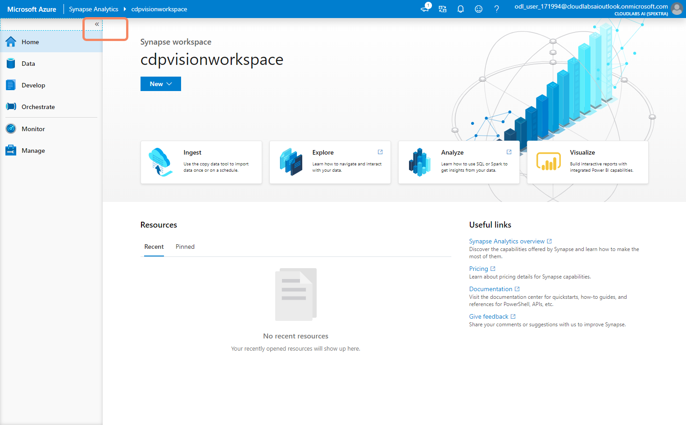

## Exercise 1: Data Orchestration and Ingestion

Duration: 60 minutes.

With Azure Synapse's code-free data orchestration environment, you can build ETL/ELT processes in a code-free visual environment to easily connect to data sources and ingest, transform, and place data in the data lake. In this exercise, you will create your first pipeline ingesting data into Azure Synapse, move semi-structured data from various sources, bring together relational and non-relational data in a serverless environment, and ingest data directly with SQL commands.

### Task 1: Your First Pipeline

Let's create our first pipeline to ingest data from external data sources in Azure Synapse.

1. On the Synapse Home page, select **Ingest**.

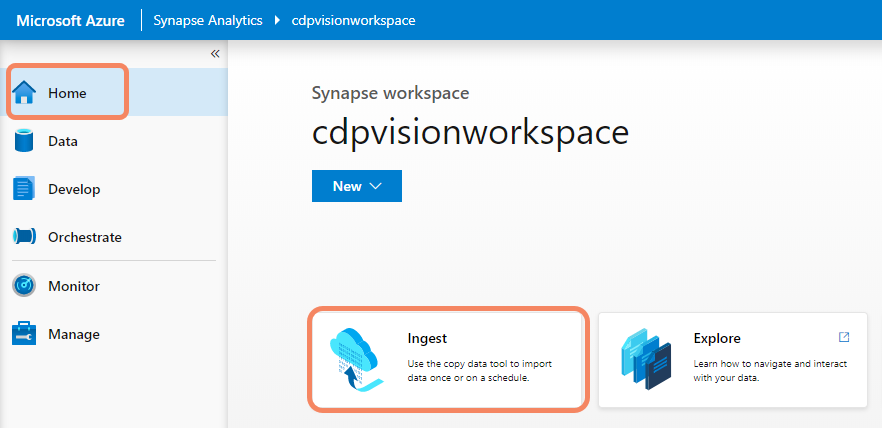

2. In the Copy data dialog, select **Next**.

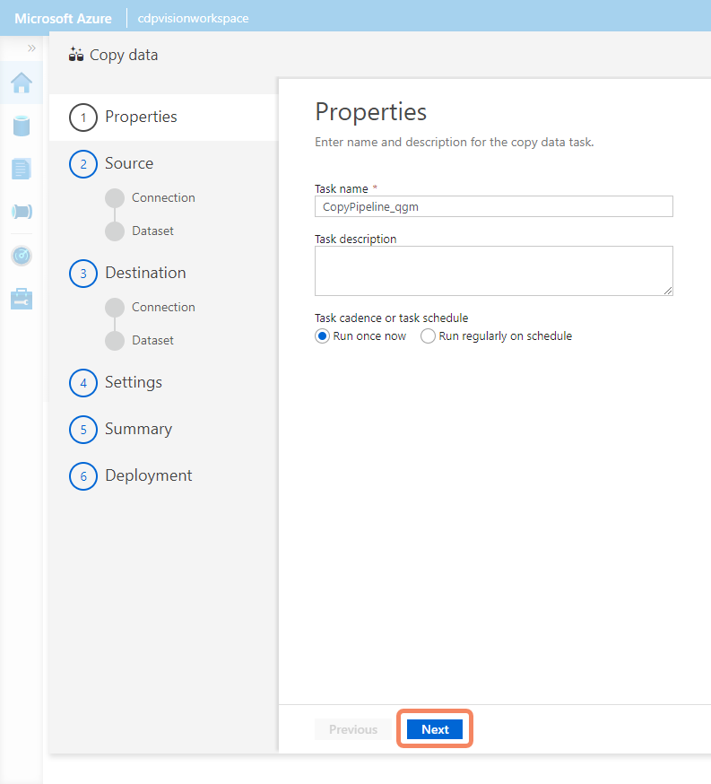

3. Select **Create new connection**

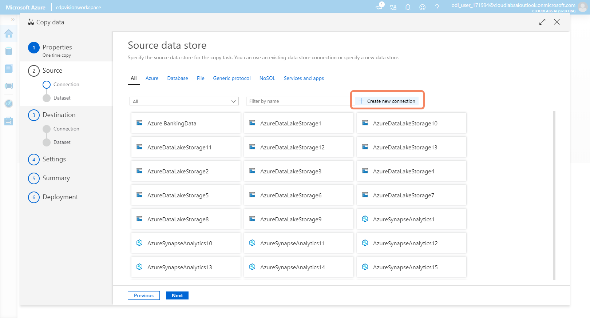

4. See all available data providers.


5. Switch to **File** tab and select **HTTP** as the source of the ingestion. 


6. Type in `https://solliancepublicdata.blob.core.windows.net/cdp/lab-artifacts/CampaignAnalytics.csv` for the **Base URL**. Then select **Anonymous** from the **Authentication Type** list. Finally, select **Apply** to create your first linked service in Azure Synapse.   


7. Select your newly created linked service named `HttpServer1` as the source for your first data ingestion pipeline in Azure Synapse. Select **Next** to continue.


8. Select **Next** and continue.


9. Observe the schema for the CSV file discovered by Azure Synapse. Select **Next** and continue.

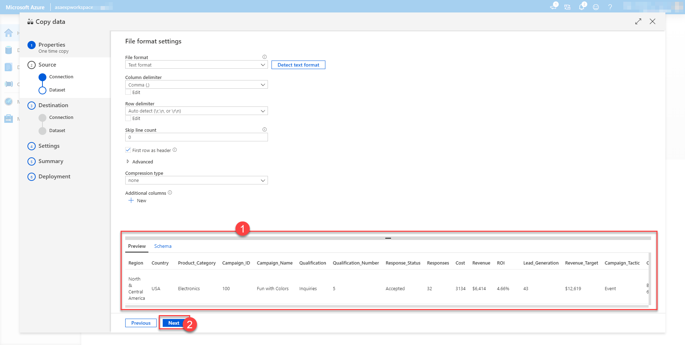

10. Select `sqlpool01` as the destination store for your pipeline. Select **Next** and continue. 


11. Select `dbo.CampaignAnalytics` as the destination for table mapping. This will make sure our CSV file is transferred into the `CampaignAnalytics` table. Select **Next** and continue. 

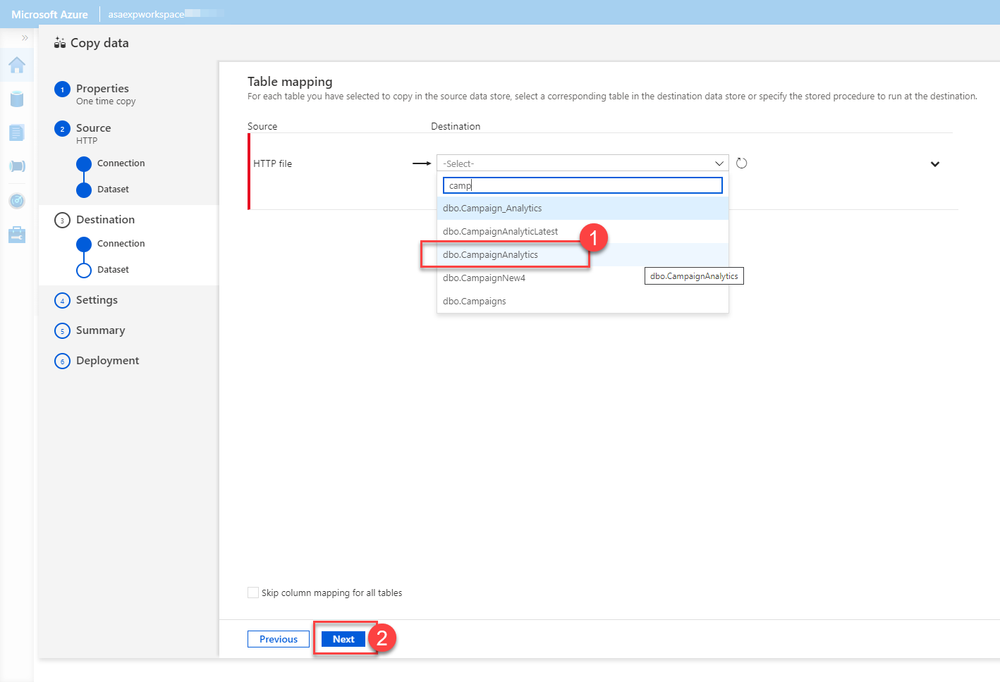

12. Look at **Column Mappings** and observe that every field in the CSV file maps to a cell in our table. Select **Next** and continue. 


13. Uncheck **Enable Staging** to ingest data directly to the destination. Select **Bulk insert** as the copy method. Select **Next** and continue. 


> ***Supplementary Info:** In Azure Synapse, you can load data using PolyBase, COPY statement (preview), or bulk insert. We recommend PolyBase or COPY statement (preview) for better copy performance. See [official documentation here](https://docs.microsoft.com/en-us/azure/data-factory/connector-azure-sql-data-warehouse) for more information.* 

14. Observe the summary of your pipeline and select **Next** to execute it.

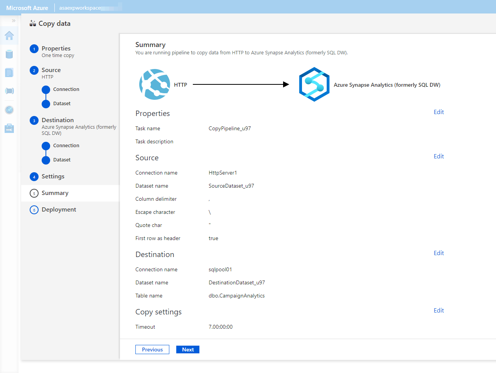

15. When the deployment of your newly created pipeline is completed, select **Monitor** to switch to the monitoring tab of Synapse. 

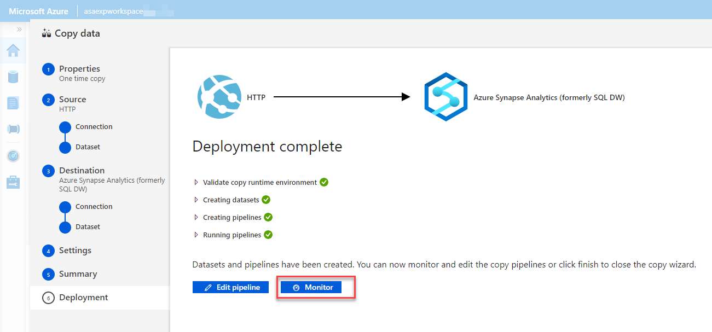

16. Your ingesting pipeline is deployed and is currently running.


17. Once the execution of the pipeline is complete, go to the **Data** hub. Navigate to **Workspace > Databases > SqlPool01 > Tables** as seen in the screenshot below. Right select **CampaignAnaltics > New SQL Script > Select Top 100 rows** to query the table.

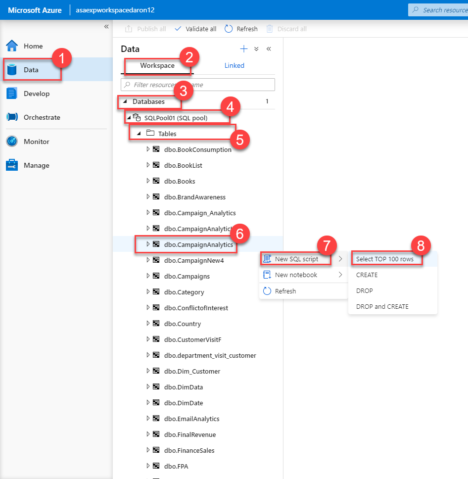

18. Observe the output of your select statement that shows the data Azure Synapse Pipeline ingested from the CSV file.

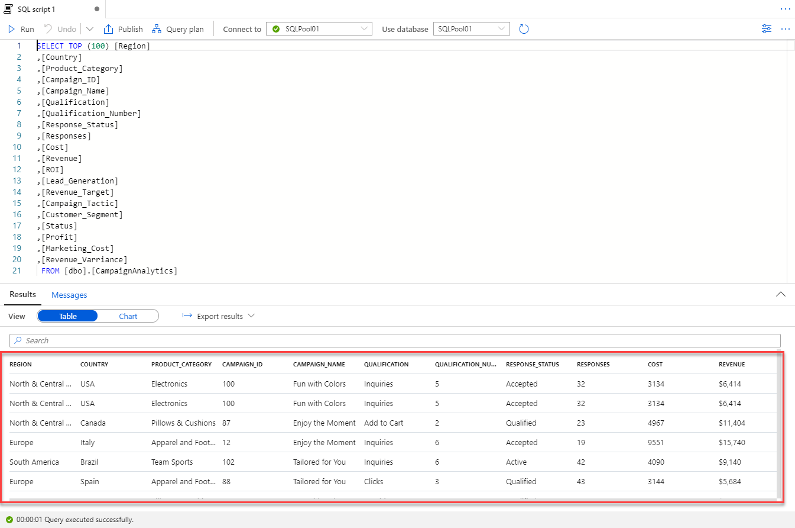

### Task 2: Moving semi-structured data to Azure Synapse Analytics

Azure Synapse Analytics enables direct streaming ingestion support and the ability to execute analytical queries over streaming data. Capabilities such as: joins across multiple streaming inputs, aggregations within one or more streaming inputs, transform semi-structured data, and multiple temporal windows are all supported. For streaming ingestion, you can integrate with Event Hubs (including Event Hubs for Kafka) and IoT Hubs.

In this task, we will load tweets from an ADSL Gen2, archive the original files, and clean up the source dataset.

1. Go to the **Orchestrate Hub** and select the plus button, then select **Pipeline** to create a new pipeline.


2. On the **Properties** panel, name your pipeline `TwitterDataPipeline`.

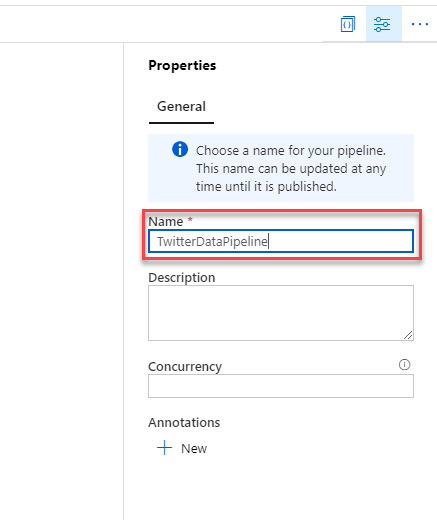

3. From the **Activities** list search for `copy`. Move the **Copy data** activity to the design area, as shown in the following screenshot.


4. Select the **copy data** activity. Switch to the **Source** tab and click **+New** to create a new **Source dataset**.


5. Switch to the **Azure** tab and select **Azure Data Lake Storage Gen2** as the source. Select **Continue** to proceed.


6. Select **Parquet** as the source. Select **Continue** to proceed.


7. Select **asaexpdatalake{suffix}** as the linked service to be used to access the data lake. Select **Continue** to proceed.


8. Select the folder, as shown in the following screenshot, to open the list of file systems.

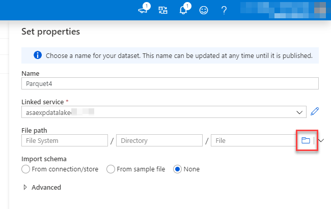

9. Select `twitterdata` as the source file system. Then select **ok** to proceed.

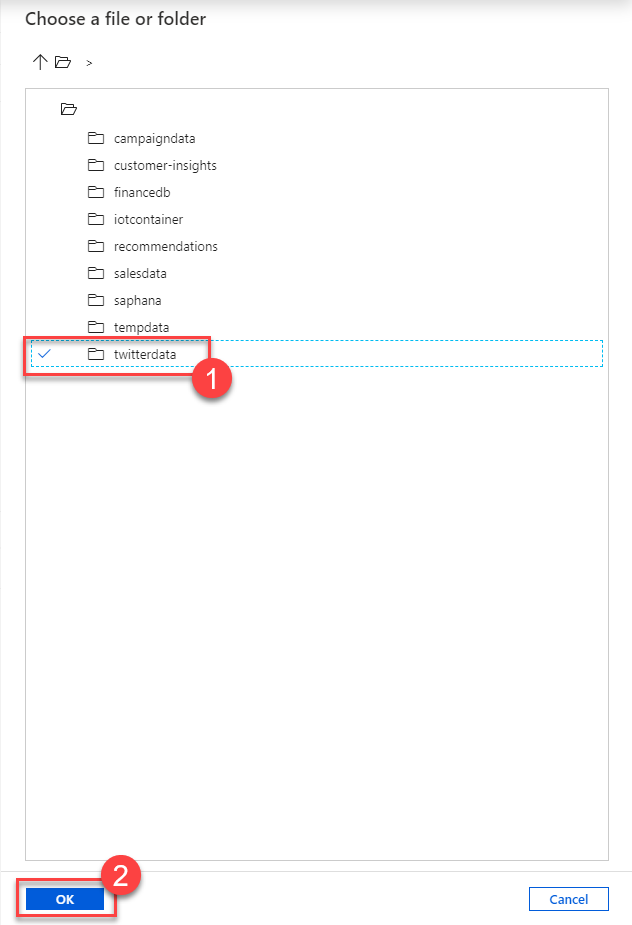

10. **File path** will show the `twitterdata` file system that you selected. For **File Name** type in `dbo.TwitterAnalytics.parquet`. This file is already placed in your data lake as part of the lab setup. Select **ok** to move to the next step.


11. Switch to the **Sink** tab and click **+New** to create a new **Sink dataset**.


12. Switch to the **Azure** tab and select **Azure Synapse Analytics** as the source. Select **Continue** to proceed.


13. Select **sqlpool01** as the linked service to access your Azure Synapse Analytics SQL Pool. 


14. Select **dbo.TwitterAnalytics** as the table name to be used to ingest data into. Select **ok** to move to the next step.


15. Switch to the **General** tab and name your **copy data** activity to `Load tweets from ADLS Gen 2`.

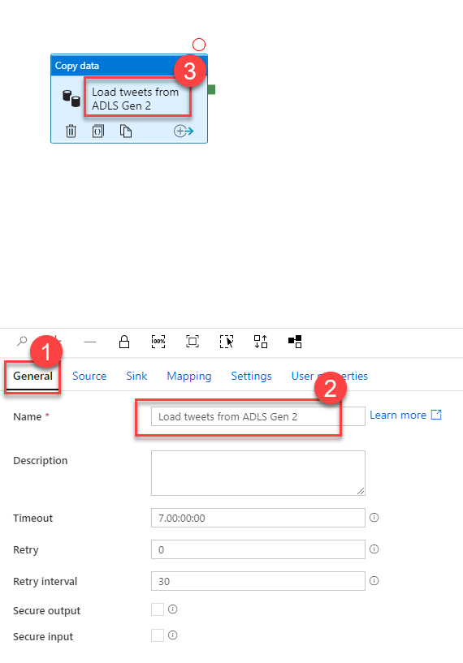

16. Select **Publish all** to publish your work to the workplace. This will save all the changes and the work you did so far.


17. Select **Add trigger**, then select **Trigger now** to run your pipeline.


18. Go to **Monitor Hub** and select **Pipeline runs**, as shown in the following screenshot.


19. Once your pipeline run is completed, go to **Data hub**, switch to **Workspace**, open **Databases > SQL Pool01** and select **...** to open the menu. From the menu select **New SQL Script > Empty Script**. 

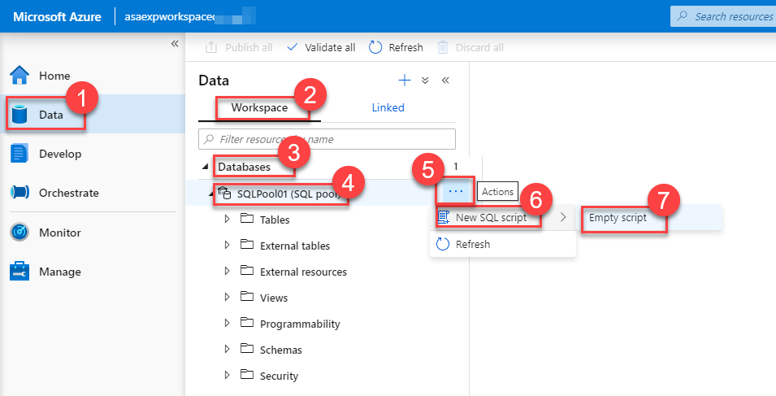

20. Write down the query below and run it to observe the count of rows in the table. 

```sql
select count(*) from TwitterAnalytics
```


You can run the pipeline multiple times and observe the number of rows in the table increase by every round of data ingestion.

21. Now, we will go back to the list of pipeline in our workspace. In the **Orchestrate Hub** select **TwitterDataMigration** pipeline to see a fully implemented version of the twitter data pipeline.


22. Select the second **Copy data** activity and switch to the **Source** tab to investigate its **source dataset**. Select **open** to open the details screen for the dataset.


23. Once you are in the dataset, take a look at the **Linked Service** and the **File path**. The **linked service** is an Azure Data Lake ADLS Gen 2, and the **File path** is pointing out a particular file to be copied. So far, the implementation of the second **copy data** activity is the same as the first one we have completed.


24. Close the window and go back to the pipeline page. Make sure the second **copy data** activity is selected. Now, switch to the **Sink** tab and select **Open** to see the details of the **sink dataset** for this activity.


25. Once you are in the dataset, take a look at the **Linked Service** and the **File path**. The **linked service** is our Azure Data Lake ADLS Gen 2, and the **File path** is pointing out a different file system and folder where archived parquet files will be saved. 


Close the window and go back to the pipeline page.

26. Select the third activity in the pipeline. The third activity is a **Delete** activity. Now, switch to the **Source** tab and select **Open** to see the details of the **dataset** that will be used to delete parquet files.

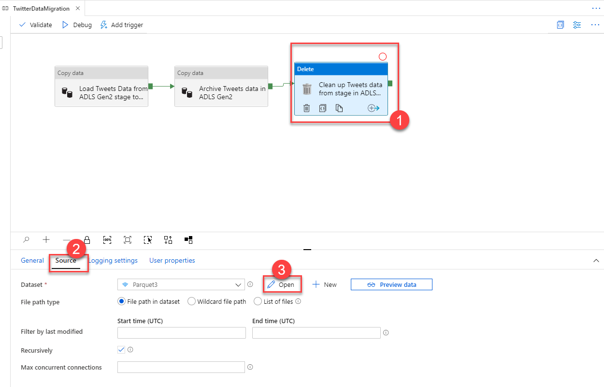

27. Once you are in the dataset, take a look at the **Linked Service** and the **File path**. The **linked service** is our Azure Data Lake ADLS Gen 2, and the **File path** is pointing out the files that we imported into our database, archived in a different location, and now are good to be deleted. 

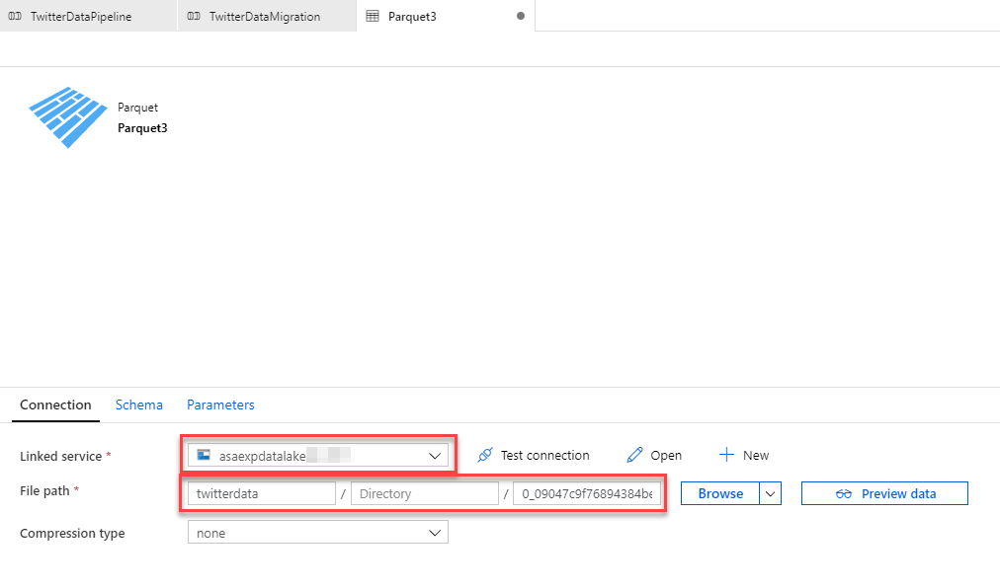

Close the window and go back to the pipeline page.

> ***Warning:** Do not run this pipeline; otherwise you will lose parquet files that you will use during the next exercises. As an additional challenge feel free to go back to your **TwitterDataPipeline** and complete the other activity steps based on your observations from the **TwitterDataMigration** pipeline.* 

### Task 3: On-Demand Query: Azure Data Lake Gen2

Every Azure Synapse Analytics workspace comes with SQL on-demand endpoints that you can use to query data in the lake. SQL on-demand is a query service over the data in your data lake. It is a distributed data processing system, built for large scale of data and compute. SQL on-demand enables you to analyze your Big Data in seconds to minutes, depending on the workload. Thanks to built-in query execution fault-tolerance, the system provides high reliability and success rates even for long-running queries involving large data sets.

SQL on-demand is serverless; hence there is no infrastructure to setup or clusters to maintain. A default endpoint for this service is provided within every Azure Synapse workspace, so you can start querying data as soon as the workspace is created. There is no charge for resources reserved. You are only being charged for the data scanned by queries you run; hence this model is a true pay-per-use model.

In this task, we will query twitter data stored as Parquet files in Azure Data Lake Gen 2 using SQL On-Demand, and visualize the result.

1. Select **Data** Hub from the left navigation in the Synapse Analytics workspace. From the **Data** blade, select **Linked** tab and under **Storage accounts**, Select/expand the storage account named **asaexpworkspace{suffix}**. Observe data sources that are now in ADL Gen2 and then select **twitterdata** storage container.

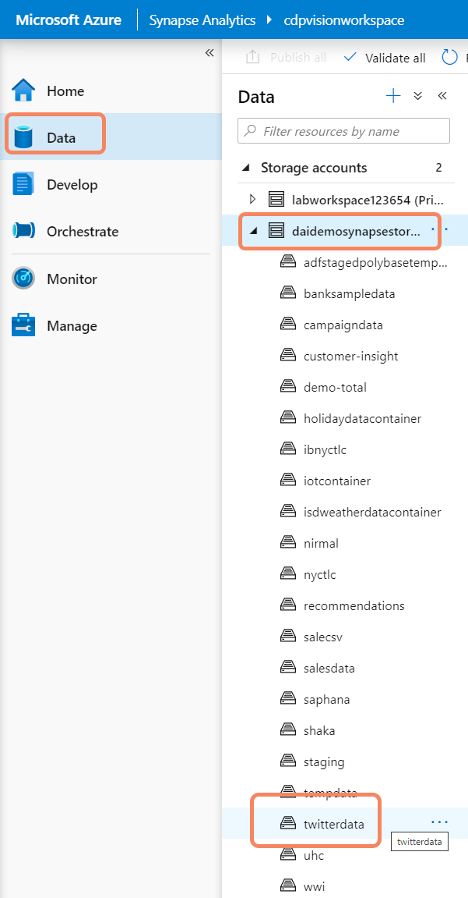

2. See all the parquet files and other folders in the **twitterdata** container. Select the first two parquet files and right-click, from the context menu, Select **New SQL Script** and then select **Select TOP 100 rows**.

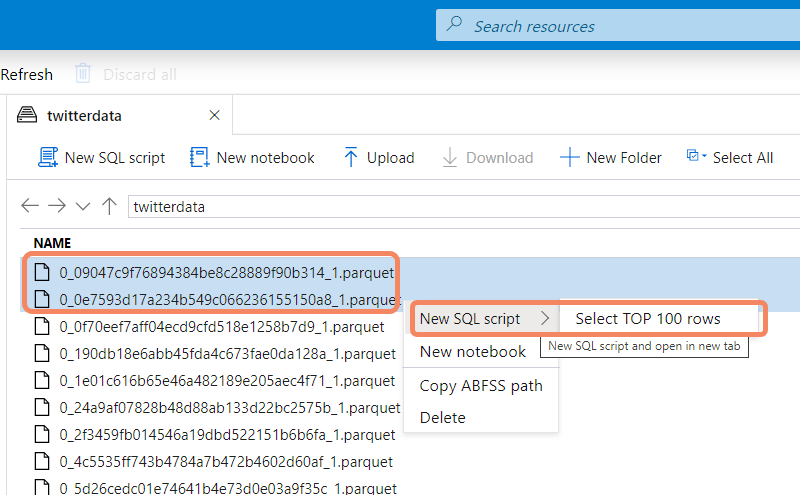

3. Select **Run**. Right now, you are using a Serverless approach to query parquet files with the SQL On-Demand query service.

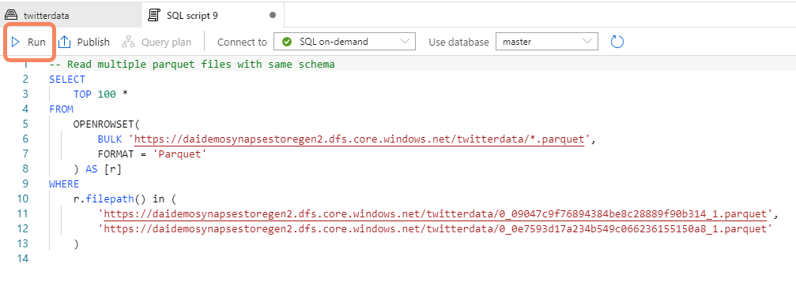

4. Select **Chart**. Modify **Legend (Series) columns**, and pick `SentimentScore` and `IsRetweet`.

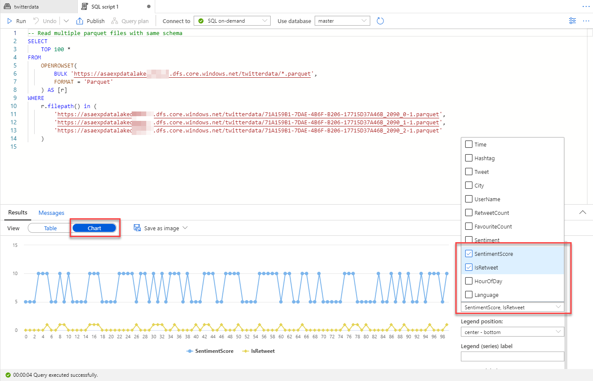

5. Once you are done crafting your chart, select **Save as image** and export an image of your chart that you can share.

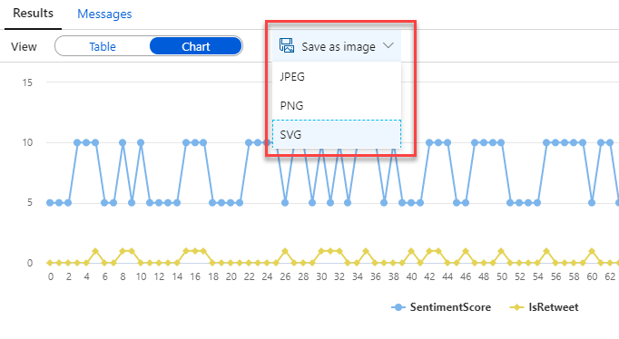

### Task 4: COPY INTO Command

One of the options to load data into Azure Synapse to be used in SQL queries is the COPY statement that helps to load data from external storage accounts. The COPY statement provides the most flexibility for high-throughput data ingestion into Azure Synapse. In this task, we will load twitter data storage in Azure Storage and run a query against it with the COPY INTO command.

1. Select **Develop**, then expand **SQL Scripts** to list all available scripts. Select the **...** button, then select **New SQL Script** to create a new sql script file. 

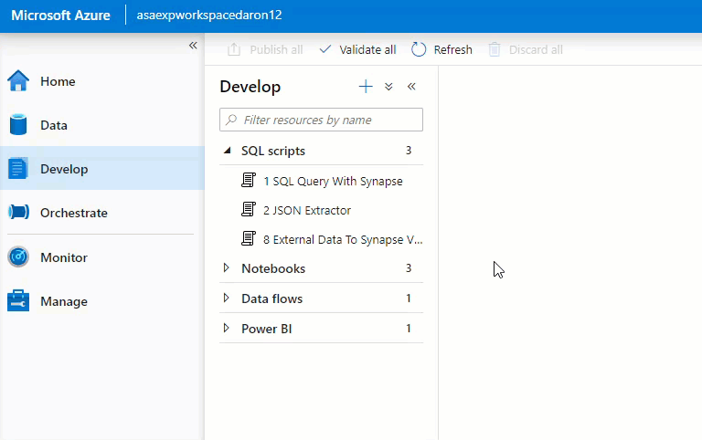

2. Select `SQLPool01` in the **Connect to** list, and `SQLPool01` in the **Use database** list. Type in the SQL Command below into the newly created script, and run the script by selecting the **Run** button to delete the **Twitter** table if it exists. This will help us to be sure the data we will import during the next steps was not available in the environment before we imported it.

```sql
IF OBJECT_ID(N'dbo.Twitter', N'U') IS NOT NULL
BEGIN
	DROP TABLE [dbo].[Twitter]
END
GO
```


3. Replace all the code in the file with the SQL Command below. Select **Run** to execute the script and create a fresh, empty `Twitter` table.

```sql
CREATE TABLE [dbo].[Twitter]
( 
	[Time] [nvarchar](4000)  NULL,
	[Hashtag] [nvarchar](4000)  NULL,
	[Tweet] [nvarchar](4000)  NULL,
	[City] [nvarchar](4000)  NULL,
	[UserName] [nvarchar](4000)  NULL,
	[RetweetCount] [int]  NULL,
	[FavouriteCount] [int]  NULL,
	[Sentiment] [nvarchar](4000)  NULL,
	[SentimentScore] [int]  NULL,
	[IsRetweet] [int]  NULL,
	[HourOfDay] [nvarchar](4000)  NULL,
	[Language] [nvarchar](4000)  NULL
)
WITH
(
	DISTRIBUTION = ROUND_ROBIN,
	CLUSTERED COLUMNSTORE INDEX
);
GO
```


4. Replace all the code in the file with the SQL Command below. Select **Run** to execute the script and import our data from the parquet file into the table.

```sql
COPY INTO [dbo].[Twitter]
FROM 'https://asaexpdatalake{suffix}.blob.core.windows.net/twitterdata/dbo.TwitterAnalytics.parquet'
WITH (
    FILE_TYPE = 'PARQUET'
        );
GO
```


5. Replace all the code in the file with the SQL Command below. Select **Run** to execute the script and see the data we have just imported.

```sql
SELECT TOP 10 * 
FROM  [dbo].[Twitter];
GO
```


6. Select **Develop**, then expand **SQL Scripts** to list all available scripts. Select **8 External Data to Synapse Via Copy Into**. Look into the code with the section commented as **Step 2**. In this case, the script is using a [Shared Access Signature](https://docs.microsoft.com/en-us/azure/storage/common/storage-sas-overview) to access to the parquet file in storage.


## Exercise 2: Using Native Connectors

Duration: 45 minutes.

With Azure Synapse's code-free data orchestration environment, you can build ETL/ELT processes in a code-free visual environment to quickly ingest data from more than 85 native connectors. In this exercise, we will look at how to use various connectors available in Azure Synapse to ingest data into the data warehouse.

### Task 1: Migrate SAP Hana to Azure Synapse Analytics

SAP is one of the most widely-used enterprise software in the world. Azure Synapse empowers customers to integrate their existing SAP system with Azure to unblock business insights. In this exercise, we will observe an Azure Synapse Pipeline that moves data from SAP Hana to an ADLS Gen2 storage, followed by a Data Flow that transforms the data during the pipeline execution. 

1. Select **Orchestrate**

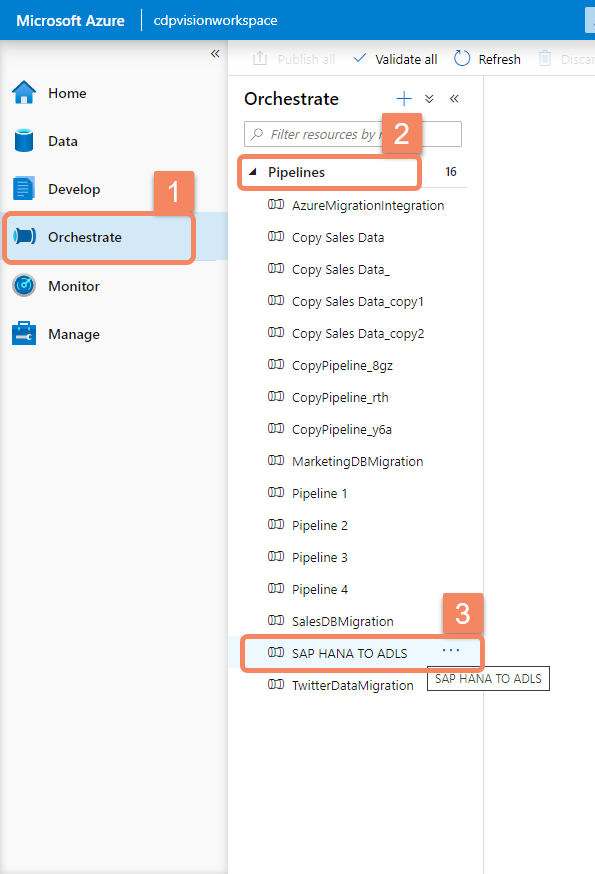

2. Select/Expand **Pipelines** and then select **SAP HANA TO ADLS** pipeline.

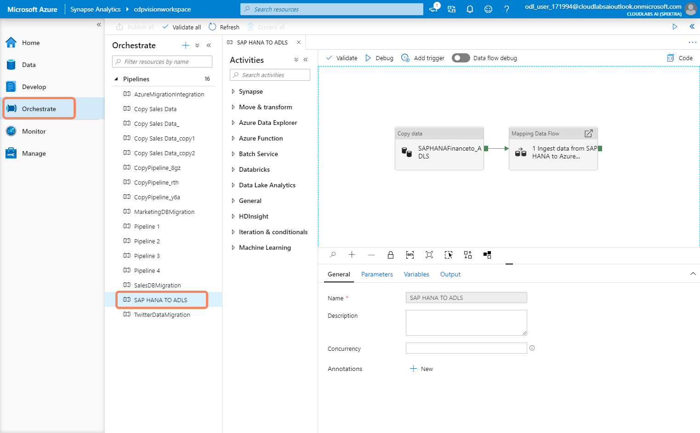

3. From the editor window, select **Copy data** activity. Then select **Source** property of the **Copy data** activity to see the **Source Dataset** and observe that the query is pulling data from SAP Hana

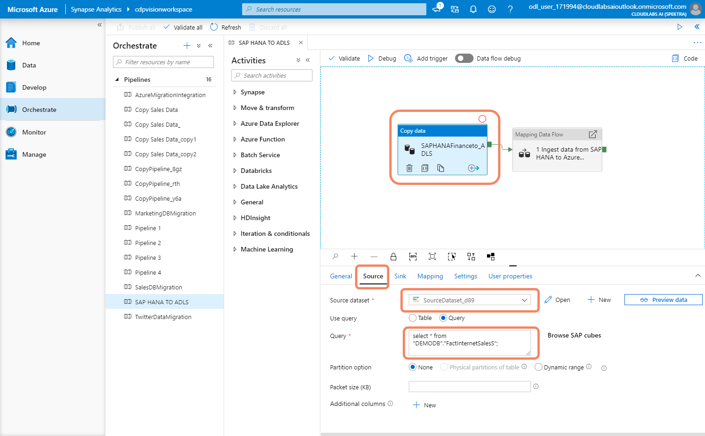

4. With copy data selected, select the **Sink** property of the **Copy data** activity. Look at the **Sink** dataset, in this case; you are saving to ADLS Gen2 storage container.

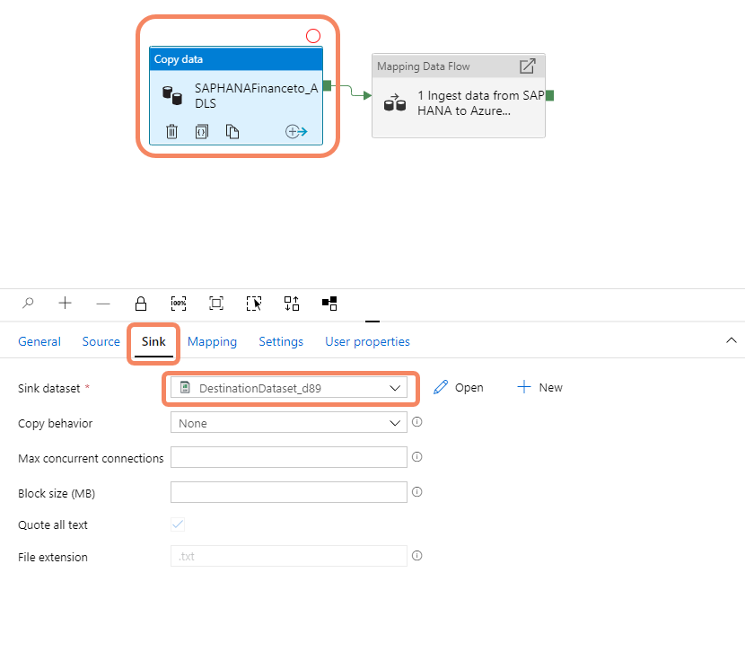

5. Select **Mapping Data Flow** activity and then select **Settings**. Next, select **Open** to go to **Data Flow** editor.

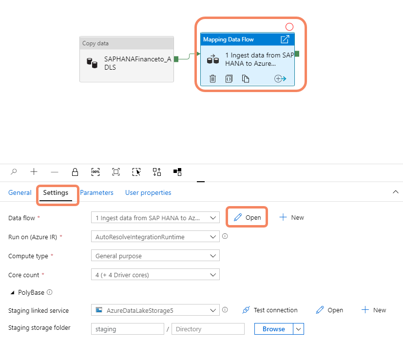

6. In the Data Flow editor, observe the flow. Look in detail into each activity using the following steps.

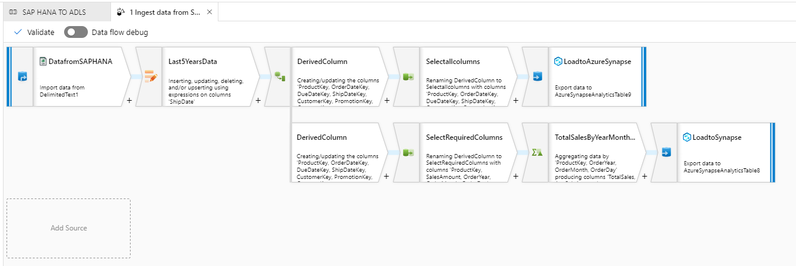

7.	In the **first activity**, we are selecting data from the Data Lake staging area.
8.	In the **second activity**, we are filtering data for the last 5 years.


9.	In the **third activity**, we are deriving columns from a **Column Order Date**.

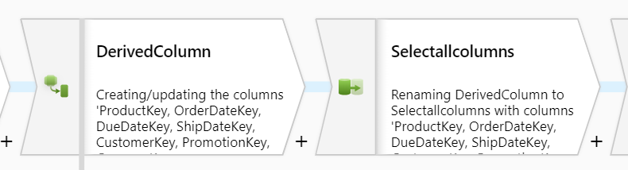

10.	In the **fourth activity**, we are only selecting the required columns from the table.

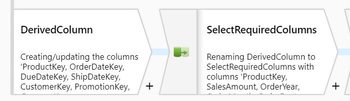

11. In the **fifth activity**, we are creating an aggregated **Total Sales** grouped by **Year** and **Month**.


12. In the **sixth activity**, we load the aggregated table to Azure Synapse.

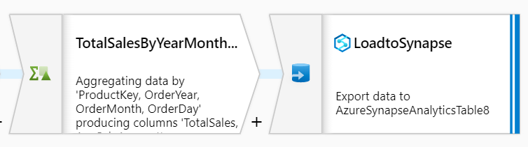

20. In the **seventh activity**, we are taking a parallel route by selecting all the remaining rows and writing the full table to Azure Synapse.


21. To view all the available transformations in the data flow editor, select the **+ (add action)**, to the right of the first activity.


22.	Scroll down to see the full list of transformations at different levels.


### Task 2: Code First Experience: Migrate Teradata to Azure Synapse Analytics

Azure Synapse not only has the code-free path but can give you the ability to prepare data in an Azure Synapse Notebook. In this task, we will use Python and observe the code first experience in Azure Synapse Analytics. We will move data from Teradata from to ADLS Gen 2 and preparing it with Python.

1. In the Orchestrate hub, select **MarketingDBMigration** from the list of pipelines.

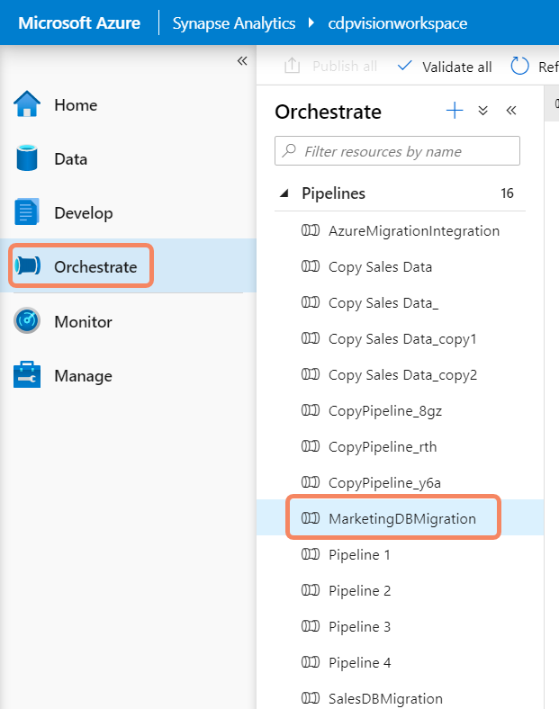

> **Note:** This pipeline is for demonstration purposes only. __Do NOT execute__ the pipeline.

2. Select **Lookup** activity, and select **Settings** to observe the **Source dataset** property (Teradata).

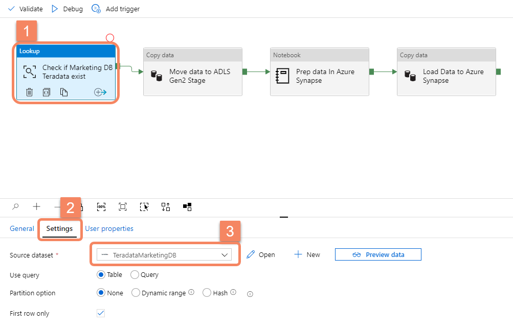

3. Select **Copy data** activity and observe **Source** and **Sink** properties.

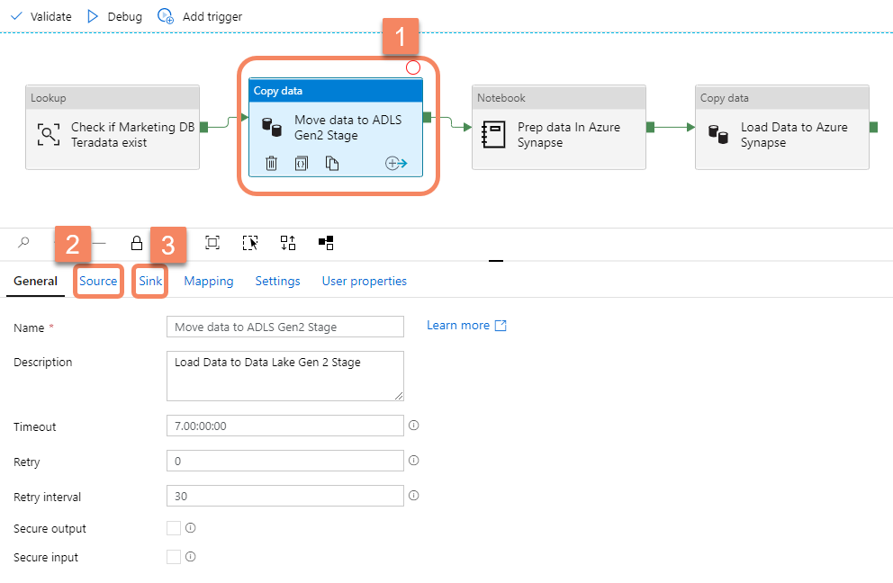

4. Select **Prep data in Azure Synapse** Notebook, then select **Settings**. Once you are in the settings tab, select **Open** to open the notebook

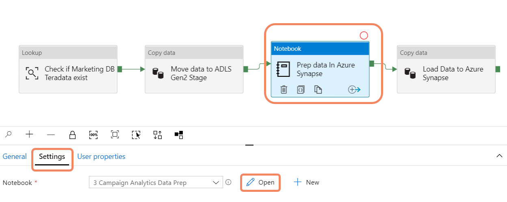

5.	Observe the Python code. This is the code first experience in Synapse analytics.

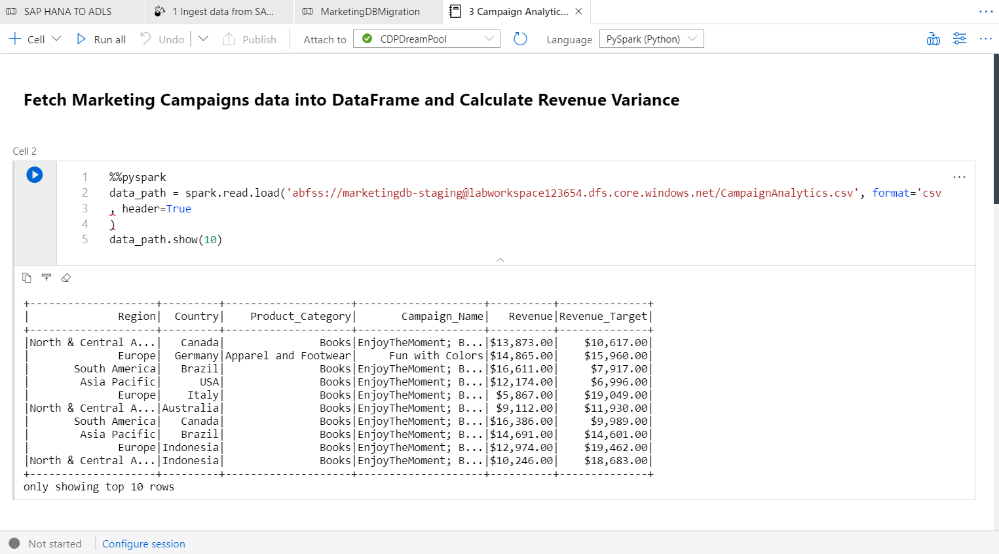

### Task 3: Migrate last five years of sales transactional data from Oracle to Azure Synapse Analytics

Azure Synapse helps us copy data from an Oracle database to any supported sink data store. In this task, we will check for the existence of the Oracle database and load data from Oracle into Azure Synapse with the Copy Data activity.

1. Select **SalesDBMigration** from the **Orchestrate** hub.

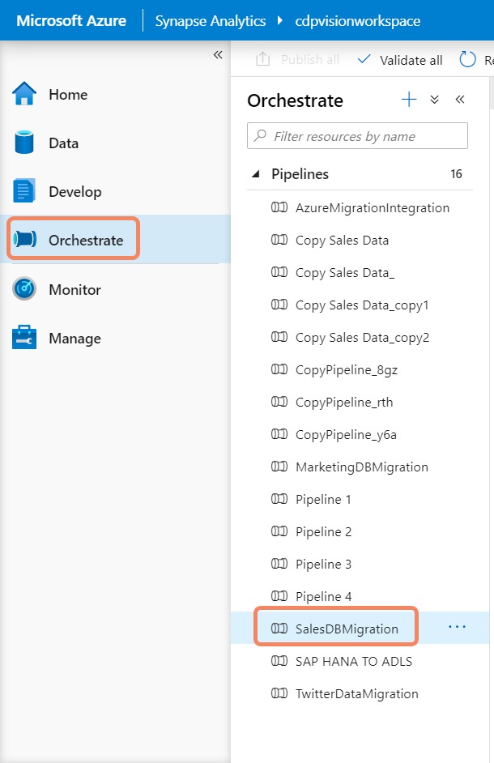

2. Select **Lookup** activity and then **Settings** to see **OracleSalesDB** field in **Source Dataset** field

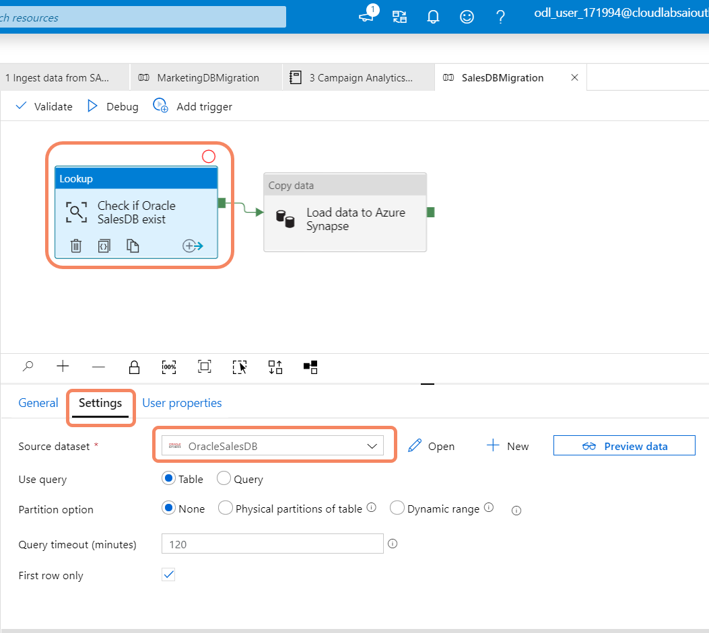

3. Select **Copy data** and see Synapse as the **sink**.

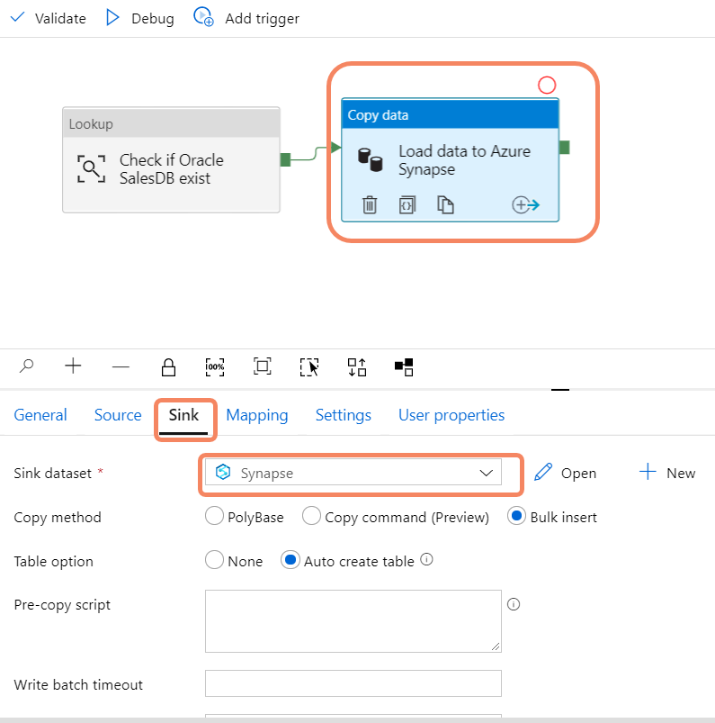

## Exercise 3: Develop Hub

Duration: 45 minutes.

The Develop Hub in Azure Synapse helps you work on SQL scripts, notebooks, data flows, and PowerBI reports. It is part of Azure Synapse's unified experience for developing end-to-end analytics solutions. It significantly reduces project development time for BI and machine learning projects with a limitless analytics service that enables you to apply intelligence over all your most important data seamlessly and easily share data with just a few clicks.

During the next couple of tasks, you will have a chance to look at how to develop queries in Azure Synapse, using notebooks to run machine learning experiments and an AutoMl customer forecasting scenario.

### Task 1: Running Queries against 30 Billion records

In this task, we will run queries against 30 Billion records and create some early charts to get a feeling of how the data looks.

> ***Note:** If you did not opt-in to load 30 billion records into the database during environment preparation steps described in the hands-on lab preparation guide your queries will result in 3.4 million records.*

1. Select **Develop**, then expand **SQL Scripts** to list all available scripts. Select the **...** button, then select **New SQL Script** to create a new sql script file. 


2. Select `SQLPool01` in the **Connect to** list, and `SQLPool01` in the **Use database** list. Type in the SQL Command below into the newly created script, and run the script by selecting the **Run** button. The query will get us the total number of rows in the `Sales` table.

```sql
SELECT COUNT_BIG(1) as TotalCount  FROM dbo.Sales(nolock)
```

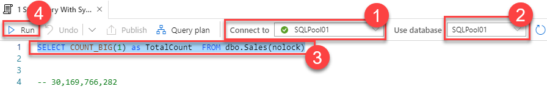

3. Replace all the code in the file with the SQL Command below. Select **Run** to execute the script and see the resulting data set out of the 30 billion records. Observe the time the query takes – query time is listed at the bottom of the screen.

```sql
select CustKey, UserName, Emailstatus, Department, [Twitter Sentiment], cast(round(TotalSale/10000,0) as int) as Revenue
from (SELECT P.Department, TA.Sentiment AS [Twitter Sentiment],
        sum(S.TotalAmount) as TotalSale,
        M.UserName, M.Emailstatus, M.CustKey
    FROM dbo.Sales as S
        inner join dbo.Products as P on P.Products_ID= S.ProductId inner join [dbo].[Dim_Customer] DC
        left outer join dbo.[TwitterAnalytics] TA on TA.[username]=DC.[userName] on DC.[id]=S.[Customerid]
        inner join dbo.[MillennialCustomers] as M on M.CustKey = S.Customerid
    where DC.[FullName]!='N/A'
    group by DC.[FullName],P.Department,TA.Sentiment,M.UserName,M.CustKey,M.Emailstatus)
  as result
```


4. Select the **Chart** button, and then select **Chart Type** dropdown to see various chart types you can use to visualize your data.

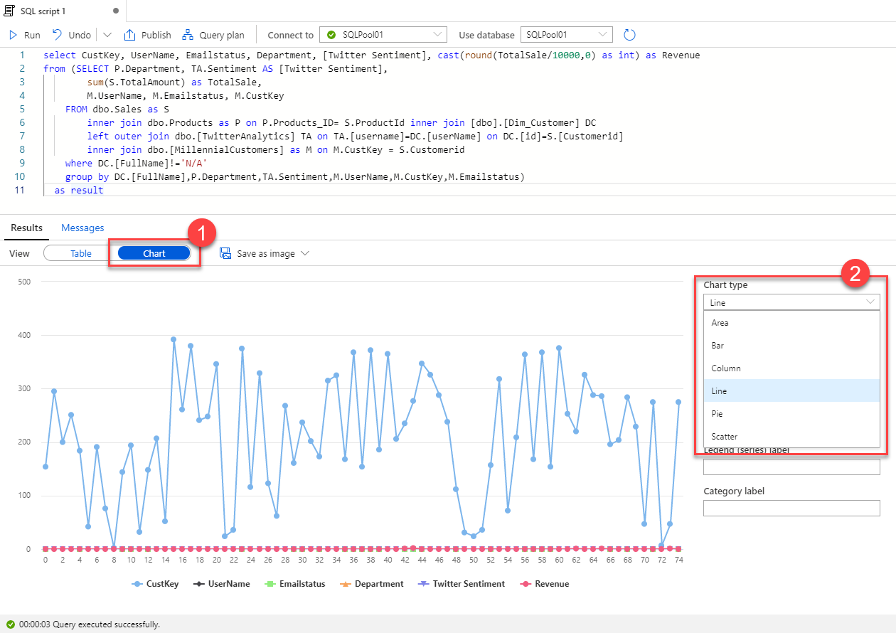

### Task 2: JSON Extractor Differentiator and other optional differentiators

To speed up time to insight and minimize unnecessary data transformation processes, Azure Synapse enables support for querying JSON data. Business analysts can now use the familiar T-SQL language to query and manipulate documents that are formatted as JSON data. JSON functions, such as `JSON_VALUE, JSON_QUERY`, `JSON_MODIFY`, and `OPENJSON` are available in Azure Synapse. In this task, we will take JSON data and extract specific structured columns using T-SQL.

1. Select **Develop**, then expand **SQL Scripts** to list all available scripts. Select the **...** button, then select **New SQL Script** to create a new sql script file. 


2. Select `SQLPool01` in the **Connect to** list, and `SQLPool01` in the **Use database** list. Type in the SQL Command below into the newly created script, and run the script by selecting the **Run** button. The query will get us the first 100 records in the `TwitterRawData` table. The result set will show JSON Payloads stored in a single field in the table called `TwitterData`.

```sql
SELECT top (100) * from  dbo.[TwitterRawData] 
```

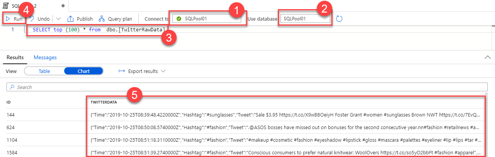

3. Replace all the code in the file with the SQL Command below. Select **Run** to execute the script and see the result set where every JSON Value stored in the JSON Payload field `TwitterData` in the `TwitterRawData` table is now extracted into separate columns. 

```sql
SELECT   
       JSON_VALUE( TwitterData,'$.Time') AS Time, 
       JSON_VALUE( TwitterData,'$.Hashtag') AS Hashtag, 
       JSON_VALUE( TwitterData,'$.Tweet') AS Tweet, 
       JSON_VALUE( TwitterData,'$.City') AS City , 
       JSON_VALUE( TwitterData,'$.Sentiment') AS Sentiment , 
       JSON_VALUE( TwitterData,'$.Language') AS Language  
FROM dbo.[TwitterRawData] WHERE    ISJSON(TwitterData) > 0
```


4. Select **Develop**, then expand **SQL Scripts** to list all available scripts. Select **2 JSON Extractor**. Look into the code to learn about different uses of the [JSON Functions](https://docs.microsoft.com/en-us/sql/t-sql/functions/json-functions-transact-sql?view=azure-sqldw-latest) in Azure Synapse Analytics. 

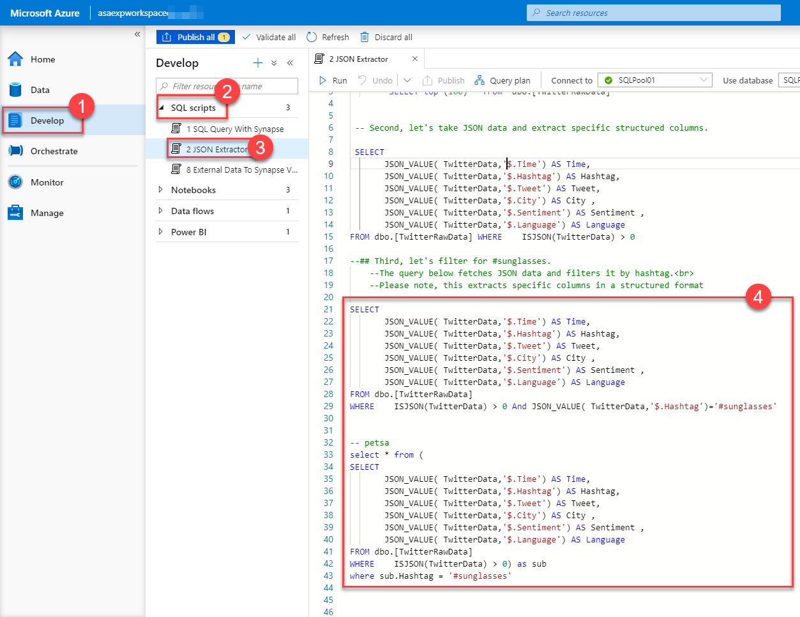

### Task 3: Using Notebooks to Run Machine Learning Experiments

An Azure Synapse Studio notebook is a web interface for you to create files that contain live code, visualizations, and narrative text. Notebooks are an excellent place to validate ideas and use quick experiments to get insights from your data. Notebooks are also widely used in data preparation, data visualization, machine learning, and other Big Data scenarios.

In this task, we will use PySpark to run a notebook on a Spark Pool.

1. Select the **Develop** hub from the Synapse workspace. Next, select and expand the **Notebooks** option.

2. Select the **1. Product Recommendations** notebook, which will open the notebook.

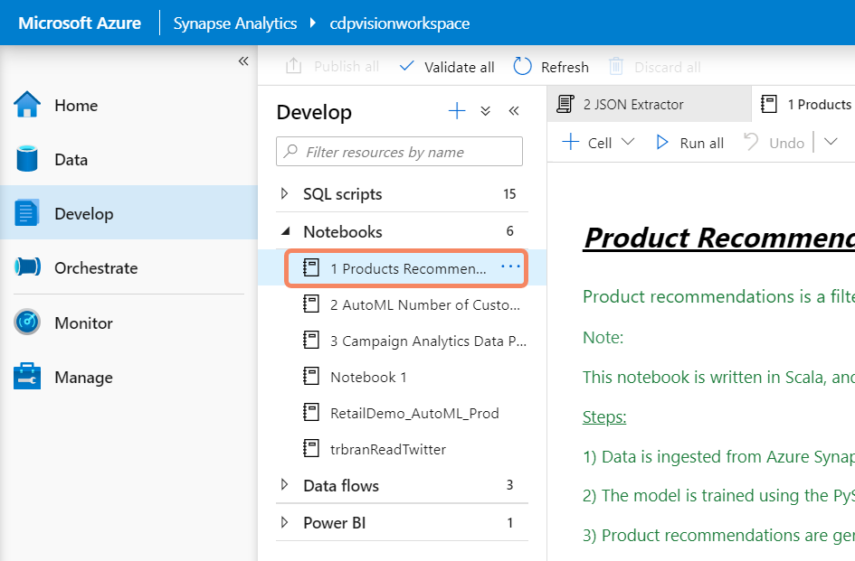

3. Once the notebook is open, select **SparkPool01** from the **Attach to** dropdown. Select **PySpark** from the **Language** dropdown list.

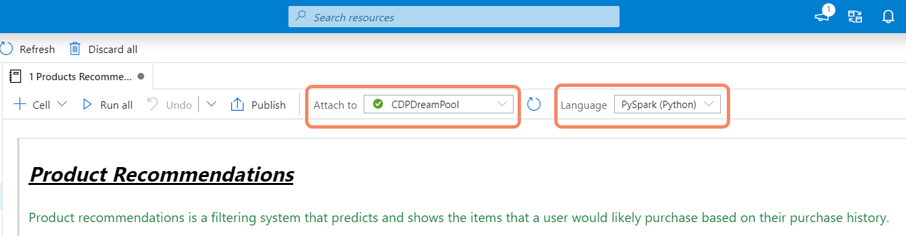

4. Expand **Language** and see supported languages.


5. Observe the import statements in the Notebook 

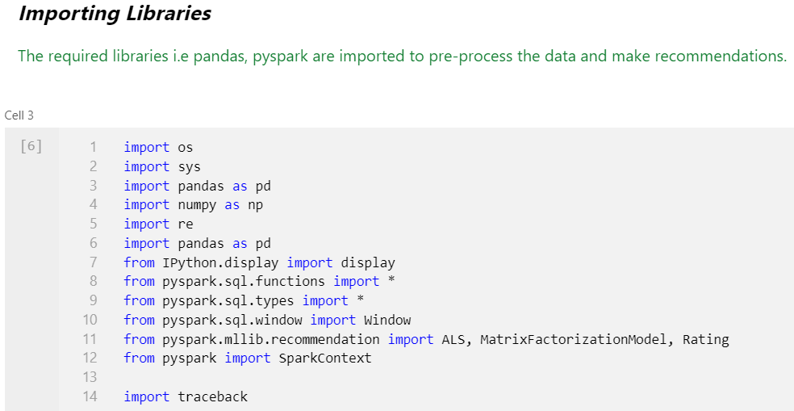

6. Select **Run all** to run all the steps in the notebook. When the execution starts, feel free to scroll down and follow the execution step by step.

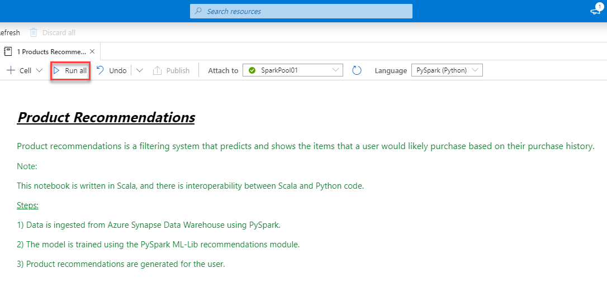

7. Observe the results in the notebook in Cell 25.

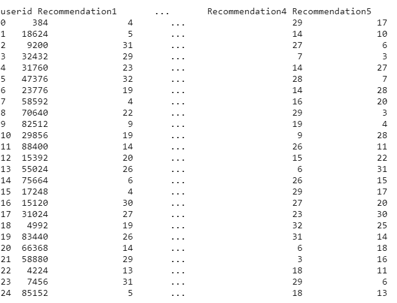

### Task 4: AutoML in Azure Synapse Analytics 

Automated machine learning, also referred to as automated ML or AutoML, is the process of automating the time consuming, iterative tasks of machine learning model development. It allows data scientists, analysts, and developers to build ML models with high scale, efficiency, and productivity, all while sustaining model quality. In this task, we will look at a notebook to learn how AutoML in Azure Synapse Analytics works.

1. Select **Develop** from the Synapse workspace

2. Expand **Notebooks** section and select **2 AutoML Customer Forecasting** Notebook.

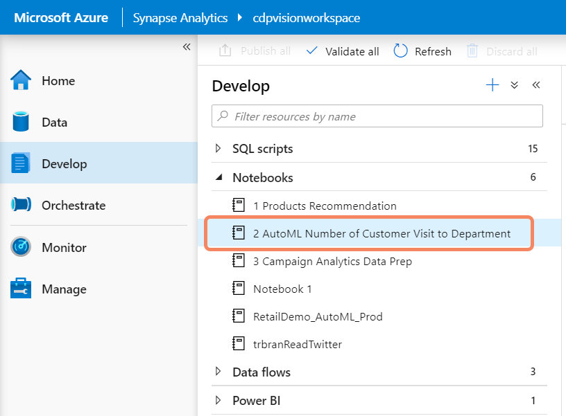

3. Scroll down to see the content in the screenshot in Cell 22.

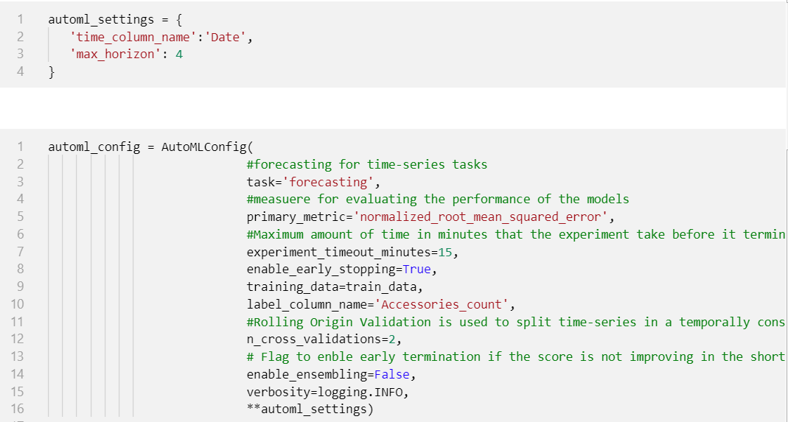

4. Scroll down to observe the content in the screenshot in Cell 26.

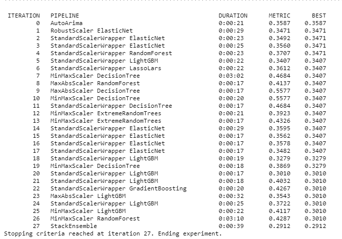

5. Scroll down to see the code in **cell 39**.

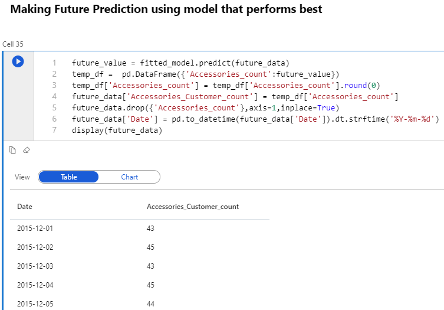

6. Scroll down to see **cell 42**.

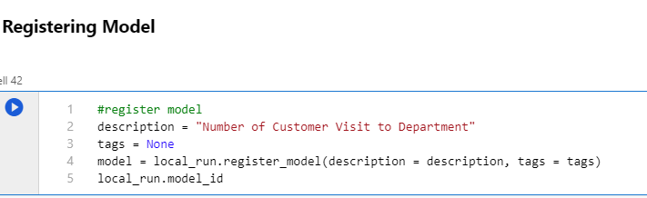

## Exercise 4: Power BI reporting within the Synapse Analytics workspace 

Duration: 20 minutes.

In Azure Synapse, business analysts can securely access datasets and use Power BI to build dashboards in minutes, all while using the same analytics service. DirectQuery allows you to create dynamic reports based on data and metrics you already have in Azure Synapse.

In this exercise, we will see how PowerBI integrates into Azure Synapse Analytics workspace and run ad-hoc reports against our data set.

### Task 1: Accessing PowerBI reports in Synapse Analytics workspace

Let's explore how we can access PowerBI reports in the Synapse Analytics workspace.

1. Select **Develop** from the Synapse workspace and expand the **Power BI** section. Next, expand **Data & AI Demo** (which is a Power BI workspace) and expand **Power BI** reports. Finally, select **1. CDP Vision Demo** Power BI report. This will open the decomposition tree.

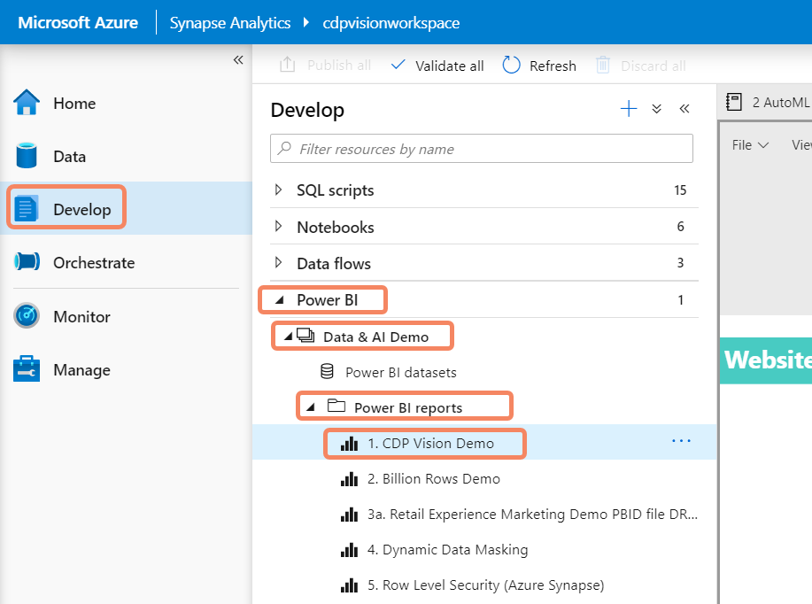

2. Once the report is open, in the **Decomposition Tree Analysis** tab see **Store Visits by Campaign** then by **Region**. Select **+** next to **North & Central America** 

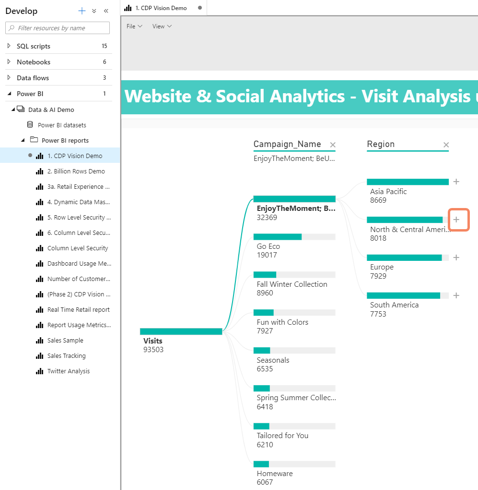

3. Select **QnA** tab 

4. In the **Q&A** box, type **profit by country by product category as treemap**

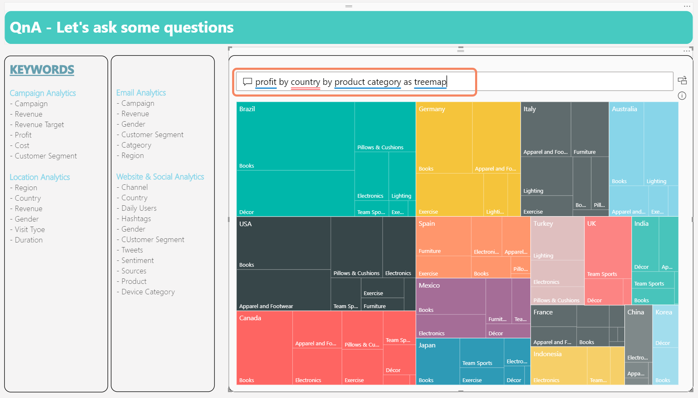

### Task 2: Ad Hoc Reporting in Azure Synapse Analytics

With Azure Synapse, data professionals can query both relational and non-relational data using the familiar SQL language. This can be done using either serverless on-demand queries for data exploration and ad hoc analysis or provisioned resources for your most demanding data warehousing needs.

In this task, we will modify a report using Ad-Hoc queries as to its underlying data access choice.

1. From the **Develop** hub, **Power BI** section select **2. Billion Rows Demo** Power BI report.

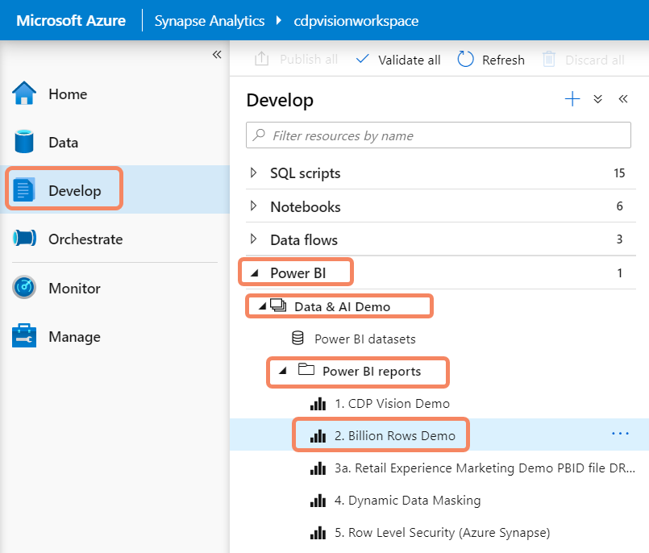

2. Select **Page 1** from the bottom tabs, then select the empty area in the report canvas. Next, from the **Fields** list, select or drag and drop **CustomerId** from **wwi Sales** table to the report canvas.

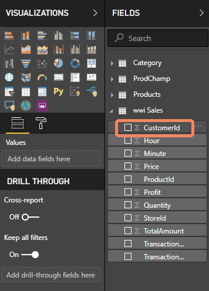

3. From the Visualizations pane, select the **card visual**. Resize and move the **card visual** to see what is shown in the screenshot.

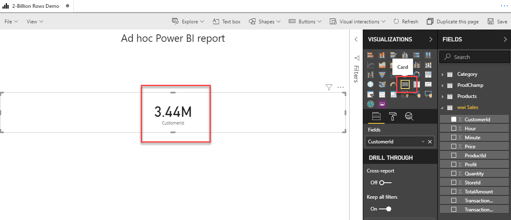

4. Select the empty area in the report canvas. From the **Fields** list select or drag and Drop **CustomerId** from **wwi AllSales** table to the report canvas. [Pointer 1 from the screenshot]. Then select **Name** field from the **Products** table [Pointer 2 from the screenshot]. Then select **Campaign** field from the **ProdChamp** table [Pointer 3 from the screenshot]. From the **Visualizations** pane select the **Treemap** icon [Pointer 4 from the screenshot].

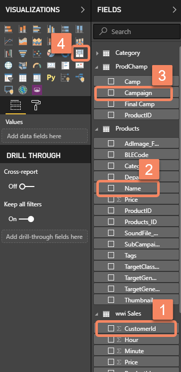

5.	Resize and move the **card visual**, as shown in the screenshot.

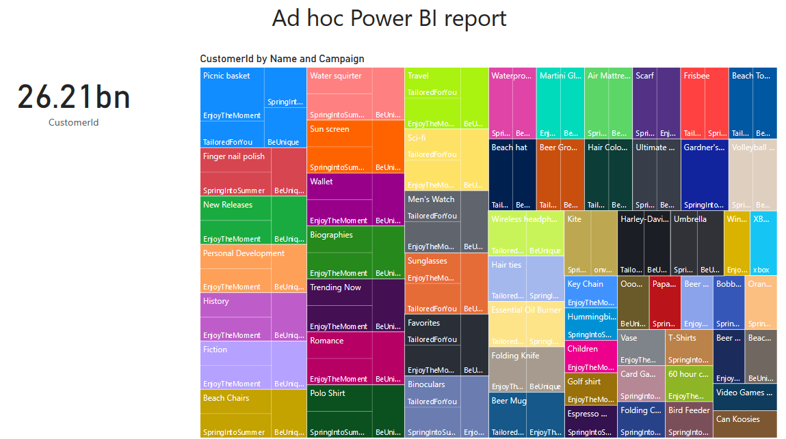

6. Select an empty area in the report canvas. Then select the **Campaign** field from the **ProdChamp** table [Pointer 1 from the screenshot]. Then select **Profit** field from the **wwi AllSales** table [Pointer 2 from the screenshot]. Finally, from the **Visualizations** pane, select the **Bar Chart** icon [Pointer 3 from the screenshot].

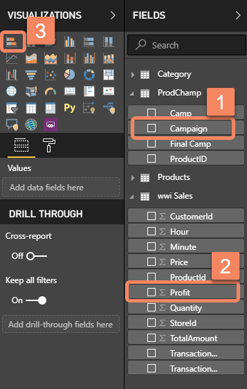

7. Resize and move the **card visual**, as shown in the screenshot. 

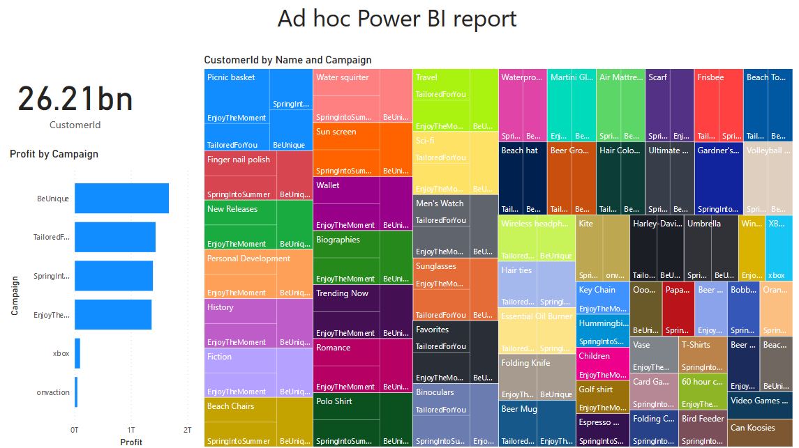

8. Hover over **Save** button, but **do NOT** save.
