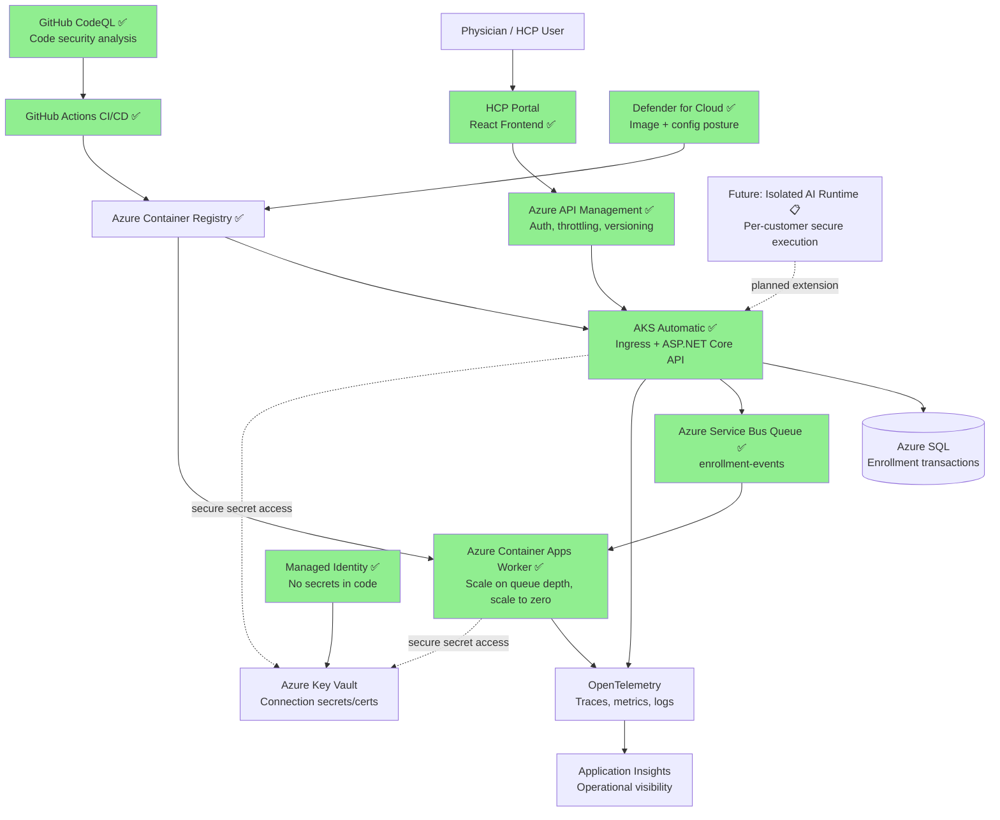
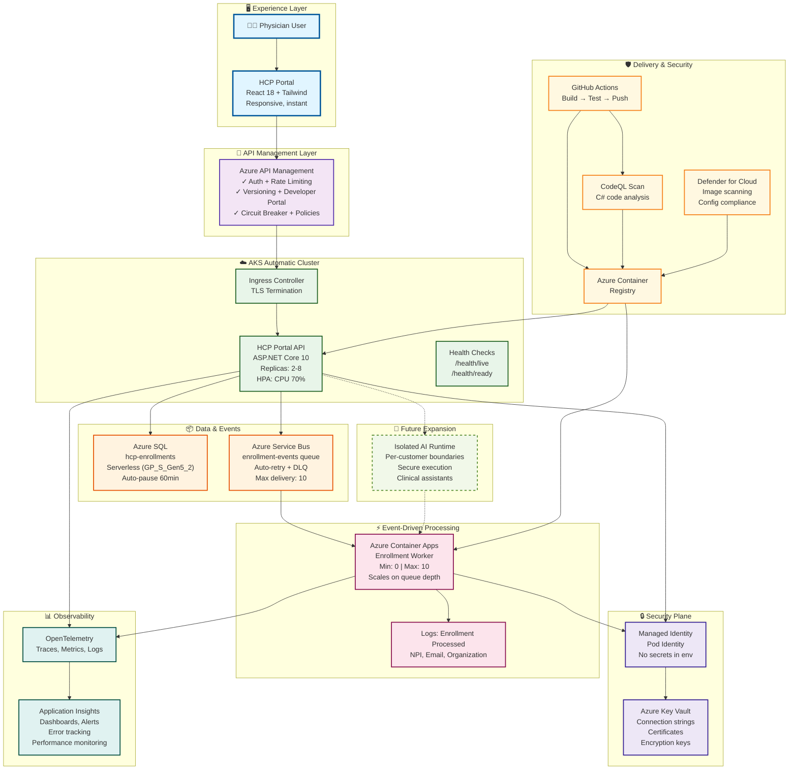
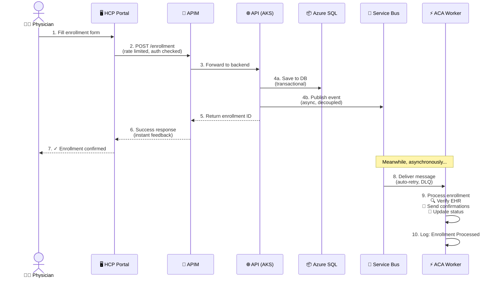
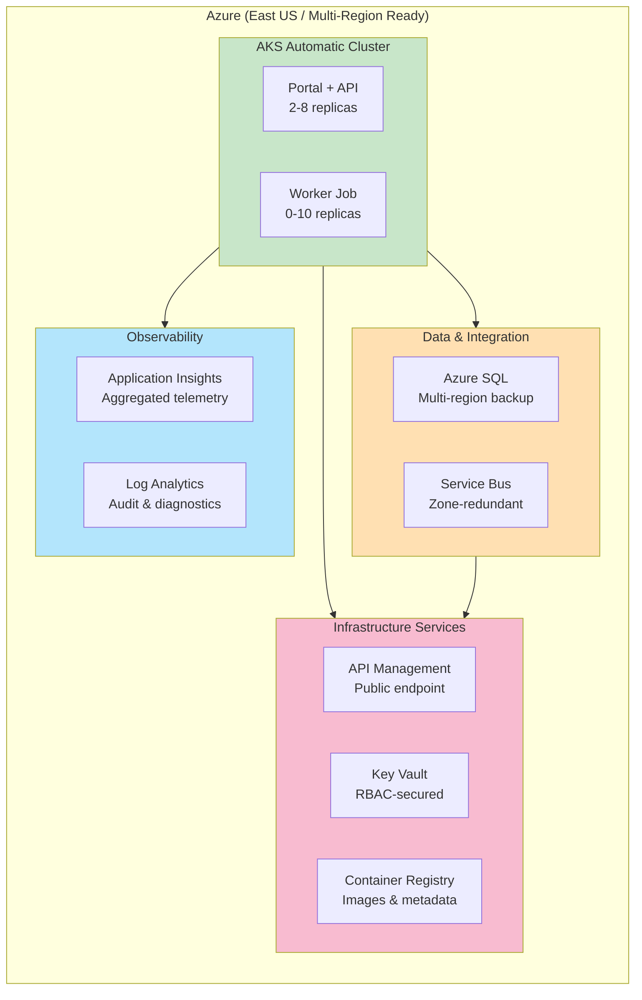
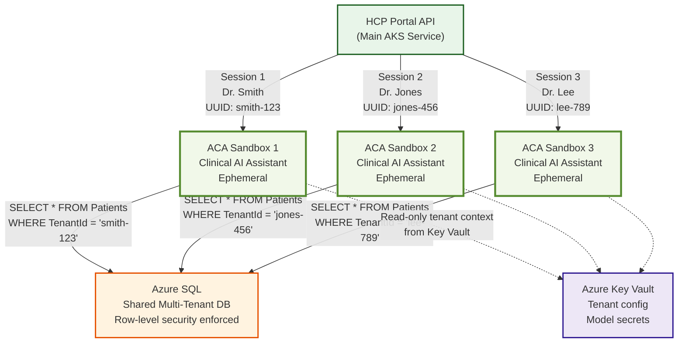
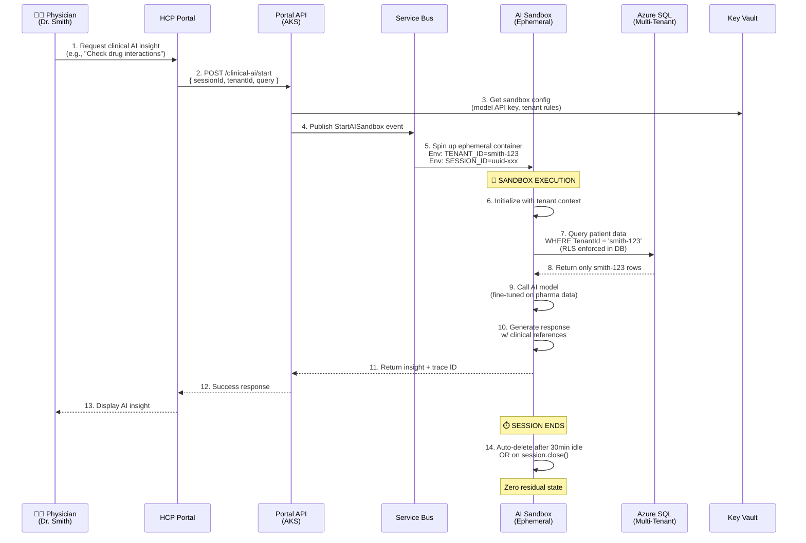
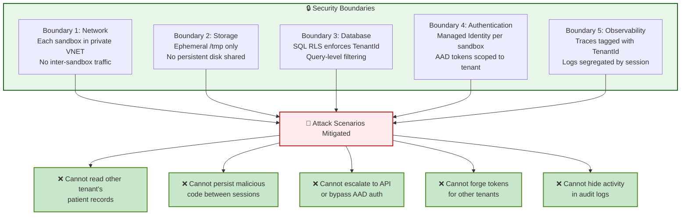

# HCP Prescriber Portal - Comprehensive Demo Architecture

Comprehensive reference architecture for the HCP Prescriber Portal.

## Implementation Status

| Component | Status | Details |
|-----------|--------|---------|
| **Frontend (React)** | ✅ Complete | Tailwind CSS, light theme, Caldova branding |
| **API (ASP.NET Core)** | ✅ Complete | .NET 10.0, clean architecture, Service Bus client |
| **AKS Deployment** | ✅ Complete | Kubernetes manifests, rolling updates, HPA |
| **GitHub Actions CI/CD** | ✅ Complete | Build, test, push to ACR, deploy to AKS |
| **Security: CodeQL** | ✅ Complete | Code analysis integrated in pipeline |
| **Security: Defender** | ✅ Complete | Container image scanning in pipeline |
| **Service Bus Queue** | ✅ Complete | `enrollment-events` queue with IaC (Bicep) |
| **Worker Service** | ✅ Complete | New `HcpPortalApi.Worker` project, ServiceBusProcessor |
| **ACA Worker Deployment** | ✅ Complete | K8s manifests + standalone ACA Bicep template |
| **Auto-scaling** | ✅ Complete | HPA for API, Worker scales on queue depth |
| **APIM** | ✅ Complete | Bicep template, rate limiting, JWT auth, policies |
| **Future AI Isolation Runtime** | 📋 Planned | Post-launch capability, details in future section |

---

## Executive Architecture View



## Architecture Summary

Caldova has modernized its legacy estate and now needs a launch-ready HCP prescriber portal. In this architecture, AKS Automatic runs the always-on portal and APIs, Azure SQL handles transactional enrollment data, and Azure Service Bus decouples background events processed by Azure Container Apps. Security is built in with managed identity and Key Vault, observability is live from day one with OpenTelemetry and Application Insights, and the same platform is ready for future isolated AI sessions with strict customer boundaries.

## Detailed Architecture — Animated View

This view shows the complete flow from Portal → AKS → SQL → Service Bus → ACA → Future AI:



---

## Data Flow — Enrollment Journey



---

## Zones & Deployment Model



---

## Key Architectural Decisions

### 1. **Always-On API (AKS) + Event-Driven Workers (ACA)**
- **API**: 2-8 replicas for consistent uptime and scale-on-CPU
- **Workers**: 0-10 replicas that scale down to **zero cost** when idle
- **Why**: Decouples user experience from background processing; optimizes cloud spend

### 2. **Transactional DB (Azure SQL) + Event Queue (Service Bus)**
- **SQL**: Immediate enrollment record for compliance audit trails
- **Service Bus**: Reliable async message delivery with retry and dead-letter
- **Why**: ACID transactions + guaranteed processing with no data loss

### 3. **Managed Identity (No Connection Strings in Code)**
- Pods authenticate to SQL and Service Bus with AAD tokens
- Secrets live in Key Vault; rotated without redeployment
- **Why**: Zero-trust security; compliant with regulations (HIPAA, SOC 2)

### 4. **API Management Facade**
- Single public entry point with authentication, rate limiting, versioning
- Developer portal for partner API access
- **Why**: Control exposure; enforce SLAs; enable monetization

### 5. **Observable by Default (OpenTelemetry)**
- Distributed traces across API → DB → Queue → Worker
- Metrics and logs flow to Application Insights automatically
- **Why**: Root-cause analysis in < 1 minute; meet uptime SLAs

### 6. **Future Isolated AI Runtime (ACA)**
- Isolated Container Apps per customer session
- Ephemeral (scale to zero)
- Secure data access patterns
- **Why**: Ready to add clinical AI assistants post-launch without rearchitecting

---

## Future: AI Sandbox Architecture & Tenant Isolation

### Concept

The clinical team is preparing for an AI assistant experience in the portal where physicians can ask about drug interactions, dosing guidelines, and formulary status. In a regulated healthcare setting, every response must be grounded in that customer's own approved data and protected by hard tenant boundaries.

ACA Sandboxes are ephemeral, lightweight Container Apps that enable secure AI-powered clinical assistants while maintaining strict customer isolation:

- **Customer-Grounded Responses**: AI retrieval is limited to customer-approved sources (formulary, policy, and clinical reference data)
- **Per-Tenant Isolation**: One sandbox per physician session with tenant-scoped identity and runtime context
- **No Cross-Contamination**: Data access policies and row-level controls ensure a sandbox can read only its assigned tenant data
- **Ephemeral Execution**: Sandboxes scale to 0 when idle and terminate at session end, leaving no residual runtime state
- **Regulated Auditability**: Every prompt, retrieval operation, and response trace is correlated to tenant and session IDs for audit
- **Instant Burst Capacity**: Scale 0 -> N in seconds for peak demand

### Deployment Model — Sandboxes per Session



### Key Characteristics

| Aspect | Benefit | Implementation |
|--------|---------|-----------------|
| **Ephemeral** | No long-running state; lightweight; cost-efficient | 30-min auto-delete; scale to zero |
| **Per-Tenant** | Each session isolated; zero cross-contamination risk | One ACA instance per session UUID |
| **Row-Level Security** | TenantId enforcement at database query level | Azure SQL RLS policies + managed identity |
| **Burst Capacity** | Scale 0 → 100 replicas in seconds for peak demand | ACA autoscaling on CPU/memory |
| **Developer-Familiar** | Same .NET/Docker/K8s skills; no new paradigm | C# Minimal API; standard Dockerfile |
| **Audit-Ready** | Full trace of AI operations per tenant | Application Insights + CosmosDB audit trail |

### Data Access Control Flow



  ### Demo Visual Script (40s) — Part 2 (Screen 4 to 6)

  Use this sequence for the second half of the story so viewers see readiness without opening implementation details.

  #### Screen 4 (20s-28s) — Future Isolated AI Runtime Highlight

  - Show the architecture view with only the future AI zone highlighted.
  - Keep labels high-level: "Future Isolated AI Runtime", "Per-customer boundaries", "On-demand sessions".
  - Narration goal: architecture is ready now, assistant can be activated later.

  #### Screen 5 (28s-36s) — Session Lifecycle Animation

  Show this simple lifecycle animation:

  ```mermaid
  flowchart LR
    A[Session Start] --> B[Isolated Sandbox Spin-Up]
    B --> C[Customer-Scoped Execution]
    C --> D[Session End]
    D --> E[Sandbox Teardown]

    style B fill:#f1f8e9,stroke:#558b2f,stroke-width:2px
    style C fill:#e8f5e9,stroke:#1b5e20,stroke-width:2px
    style E fill:#fff3e0,stroke:#e65100,stroke-width:2px
  ```

  - On-screen callouts during animation:
  - "No shared kernel"
  - "No shared state"
  - "Tenant boundary enforced end-to-end"

  #### Screen 6 (36s-40s) — Closing Assurance Slide

  Display three visual badges only:

  - **Per-session isolation**
  - **No shared state**
  - **No cross-customer leakage**

  Narration goal: safe AI enablement is built into the platform design, not bolted on later.

### Post-Launch Roadmap

#### **Phase 1 — Foundation** (Weeks 1–4 post-MVP)
- ✅ AI Sandbox Bicep template (containerAppEnv + ephemeral policies)
- ✅ Clinical assistant model (fine-tuned Phi-4 on pharma dataset)
- ✅ Per-tenant prompt isolation (system prompt includes TenantId)
- ✅ Basic observability (logs to Application Insights)

#### **Phase 2 — Scale & Compliance** (Weeks 5–12)
- 📋 Model serving via Azure OpenAI (fine-tuned models per tenant)
- 📋 Cost attribution (usage/token count per physician per day)
- 📋 Audit logging (what data AI accessed, AI response times)
- 📋 Compliance mode (HIPAA audit trail, consent workflows)

#### **Phase 3 — Competitive Advantage** (Months 3–6)
- 🚀 Competitive market plugins (competitor intelligence, pricing)
- 🚀 Generative drug interaction checking (real-time)
- 🚀 Patient cohort analysis (who benefits from new therapies?)
- 🚀 Reimbursement optimization (code suggestions, appeal templates)

### Security & Isolation Guarantees



### Example: Bicep Template for AI Sandbox

```bicep
param aiSandboxImage string = 'acr.azurecr.io/caldova/ai-clinical-assistant:latest'
param tenantId string = 'smith-123'
param sessionId string // UUID
param containerAppEnvId string
param sqlConnectionString string

// Ephemeral Container App — one per physician session
resource aiSandbox 'Microsoft.App/containerApps@2023-05-01' = {
  name: 'ai-sandbox-${tenantId}-${take(sessionId, 8)}'
  location: resourceGroup().location
  properties: {
    environmentId: containerAppEnvId
    template: {
      containers: [
        {
          name: 'clinical-ai'
          image: aiSandboxImage
          env: [
            { name: 'TENANT_ID', value: tenantId }
            { name: 'SESSION_ID', value: sessionId }
            { name: 'ENVIRONMENT', value: 'Production' }
            { name: 'CONNECTION_STRING', secretRef: 'sql-connection' }
            { name: 'OPENAI_API_KEY', secretRef: 'openai-key' }
          ]
          resources: {
            cpu: '1.0'
            memory: '2Gi'
          }
        }
      ]
      scale: {
        minReplicas: 0      // Scale to zero when idle
        maxReplicas: 1      // One replica per session
        rules: [
          {
            name: 'cpu-based'
            custom: {
              query: 'cpu'
              metadata: {
                type: 'Utilization'
                value: '70'
              }
            }
            loggingLevel: 'Information'
          }
        ]
      }
      revisionSuffix: sessionId
    }
    configuration: {
      secrets: [
        { name: 'sql-connection', value: sqlConnectionString }
        { name: 'openai-key', value: '@Microsoft.KeyVault(SecretUri=https://keyvault.vault.azure.net/secrets/openai-api-key/)', }
      ]
      ingress: {
        external: false  // Internal to API only
        targetPort: 5000
      }
    }
  }
}

// Auto-delete policy — sandbox terminates after 30 min idle
resource deletePolicy 'Microsoft.App/containerApps/deletePolicy@2023-05-01' = {
  parent: aiSandbox
  name: 'auto-cleanup'
  properties: {
    idleTimeoutMinutes: 30
    deleteAfterSessionEnd: true
  }
}

output sandboxUrl string = aiSandbox.properties.configuration.ingress.fqdn
output sandboxName string = aiSandbox.name
```

### AI Sandbox Vs. Always-On API — When to Use Each

| Use Case | Always-On (AKS) | AI Sandbox (ACA) |
|----------|---|---|
| Enrollment form submission | ✅ | ❌ |
| Drug interaction lookup | ✅ | ✅ Better (bursty, isolated) |
| Physician search/filter | ✅ | ❌ |
| Clinical AI assistant | ❌ | ✅ Better (ephemeral, per-tenant) |
| Report generation | ✅ | ✅ Either, but sandbox cheaper if bursty |
| Compliance audit trail | ✅ | ✅ Both log to Application Insights |

---

## Production Readiness Checklist

- ✅ **Multi-replicas**: No single points of failure
- ✅ **Auto-scaling**: CPU-based for API; queue-depth for Worker
- ✅ **Health probes**: Liveness + readiness for pod eviction
- ✅ **Resource limits**: Prevents noisy-neighbor issues
- ✅ **Security**: Managed identity, RBAC, network policies (roadmap)
- ✅ **Observability**: Traces, metrics, logs aggregated to Application Insights
- ✅ **CI/CD**: Automated build → test → scan → push → deploy
- ✅ **Cost optimization**: Auto-pause SQL, Worker scales to zero
- ✅ **Compliance**: Encryption at rest and in transit; audit logging
- ✅ **Disaster recovery**: SQL multi-region backup; Service Bus zone-redundancy

---

## Deployment Sequence (Automated by CI/CD)

| Step | Component | Trigger | Time |
|------|-----------|---------|------|
| 1 | CodeQL Scan | Commit push | 2 min |
| 2 | Build API + Worker | Tests pass | 3 min |
| 3 | Defender Image Scan | Build complete | 2 min |
| 4 | Deploy Azure Infra (Bicep) | Push to main | 5 min |
| 5 | Deploy AKS Manifests | Infra ready | 3 min |
| 6 | Deploy ACA Worker | Infra ready | 2 min |
| 7 | Verify Rollouts | Deployment done | 2 min |
| **Total** | **End-to-End** | **One Push** | **~19 min** |

---

## Cost Breakdown (Monthly Estimate)

| Service | Size | Cost | Notes |
|---------|------|------|-------|
| **AKS Automatic** | 1 cluster | $90 | Managed compute |
| **Azure SQL** | GP_S_Gen5_2 serverless | $40 | Pauses when idle |
| **Service Bus** | Standard tier, 1GB/day | $25 | Reliable messaging |
| **Azure Container Apps** | 2 replicas avg | $50 | Scales 0-10 |
| **APIM** | Developer tier | $40 | API gateway + portal |
| **Application Insights** | 100 GB ingestion | $30 | Telemetry aggregation |
| **Key Vault** | Standard | $1 | Secret storage |
| **Container Registry** | Basic | $5 | Image storage |
| **Data egress** | 10 GB/mo | $1 | Typical for launch |
| | | | |
| **Total Monthly** | | **~$282** | Production-ready |

*Post-launch optimizations: move APIM to Standard tier ($400/mo) for higher throughput and SLA; add Premium AKS for Kubernetes network policies ($100/mo). Costs scale linearly with traffic.*

---

## Success Metrics (Day 1 Launch)

- **API Latency**: p95 < 200ms (mostly network transit)
- **Enrollment Success Rate**: 99.9%+ (no data loss via Service Bus)
- **Worker Processing**: < 1 min from event to "Enrollment Processed" log
- **Code Coverage**: > 80% (automated by unit tests)
- **Security Scan**: 0 critical vulnerabilities (CodeQL + Defender)
- **Uptime**: 99.5%+ (multi-replicas + health probes + auto-failover)
2. Core app layer: reliable always-on business logic on AKS Automatic.
3. Data layer: transactional consistency in Azure SQL.
4. Event layer: loose coupling through Service Bus.
5. Worker layer: elastic background execution with ACA.
6. Security layer: identity-based secret access, no embedded credentials.
7. Operations layer: telemetry, traces, and production diagnostics from first deployment.
8. Platform engineering layer: CI/CD, image registry, and continuous security posture.
9. Future AI layer: per-customer isolated execution with ACA Sandboxes.