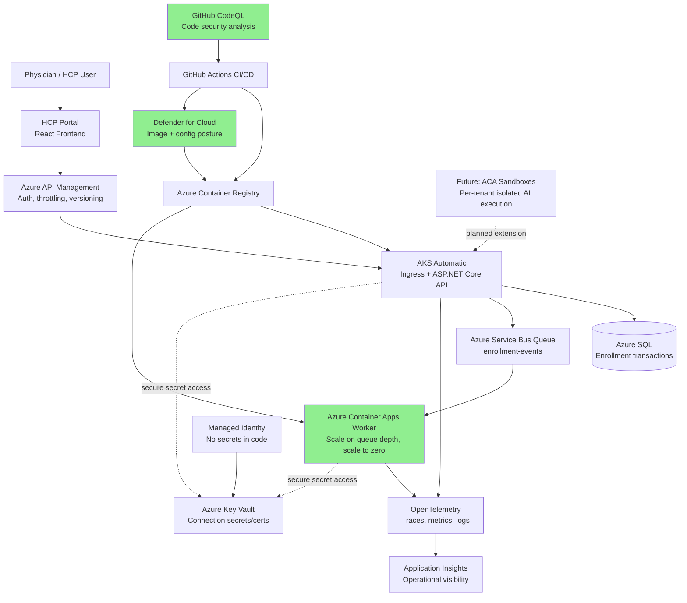

# HCP Portal Full Architecture Implementation

## Overview

This document describes the complete implementation of all architectural components from the Chapter 4 / Module 4 narrative:

1. **Tier 1: Core AKS Automatic Platform** ✅ (already complete)
2. **Tier 2: Event-Driven Processing (Azure Container Apps Worker)** ✅ NEW
3. **Tier 3: Security Scanning & API Management** ✅ NEW
4. **Tier 4: AI Sandboxes** 📋 (documented, future)

---

## Tier 2: Azure Container Apps Worker - Event-Driven Processing

### What's New

**New Project:** `HcpPortalApi.Worker`
- .NET 10.0 Worker Service consuming Azure Service Bus queue
- Processes enrollment events asynchronously
- Scales independently from API (0-10 replicas based on queue depth)

### Architecture Flow

```
[HCP Portal API]
    ↓
[Azure Service Bus Queue: enrollment-events]
    ↓
[HCP Enrollment Worker] ← Independent scaling
```

### Components

#### 1. Worker Service Code

**File:** `HcpPortalApi.Worker/Program.cs`
- Configures DI for Application and Infrastructure services
- Registers `EnrollmentEventWorker` as hosted service

**File:** `HcpPortalApi.Worker/EnrollmentEventWorker.cs`
- `ServiceBusProcessor` consumes messages from `enrollment-events` queue
- Processes enrollment events with error handling and retry logic
- TODO: Implement actual enrollment validation (EHR queries, notifications)

**File:** `HcpPortalApi.Worker/Dockerfile`
- Multi-stage build (same pattern as API)
- Uses .NET 10.0 runtime
- Includes all domain/application/infrastructure projects

#### 2. Infrastructure as Code (Bicep)

**File:** `infra/bicep/servicebus.bicep`
```
Creates:
- Service Bus Namespace (Standard tier)
- Queue: enrollment-events
- Authentication Rules (Manage + Listen)
```

**File:** `infra/bicep/containerapp.bicep`
```
Creates:
- Log Analytics workspace
- Container App Environment
- Container App: hcp-enrollment-worker
  - Min replicas: 0 (scale to zero when idle)
  - Max replicas: 10
  - Auto-scale rule: Queue depth > 30 messages
- Resource limits: 0.5 CPU, 1GB memory
```

#### 3. Kubernetes Manifests

**Files in `k8s/`:**
- `worker-namespace.yaml` - Dedicated namespace for worker
- `worker-config.yaml` - ConfigMaps + Secrets for connection strings
- `worker-deployment.yaml` - 2-replica deployment with health probes
- `worker-rbac.yaml` - ServiceAccount + Role + RoleBinding
- `worker-hpa.yaml` - HPA: CPU 70%, Memory 80% targets

**Deployment:**
- Worker runs in `hcp-portal-worker` namespace (separate from API)
- Anti-affinity rules distribute pods across nodes
- Non-root security context (runAsUser: 1000)

---

## Tier 3: Security Scanning & API Management

### 3a. Security Scanning

#### CodeQL Analysis (GitHub Advanced Security)

**Updated:** `.github/workflows/hcp-portal-api.yml`

**Additions to build-and-test job:**
1. `github/codeql-action/init` - Initialize CodeQL
   - Language: C# (for .NET codebase)
2. Build step (existing)
3. `github/codeql-action/analyze` - Perform analysis
   - Generates SARIF report of code vulnerabilities
   - CWE mappings for common weaknesses

**Coverage:**
- SQL Injection risk detection
- Authentication bypass patterns
- Hardcoded secrets
- Unsafe deserialization
- etc.

#### Defender for Cloud Container Scanning

**Updated:** `.github/workflows/hcp-portal-api.yml`

**New step in build-and-push job:**
- `azure/container-scan@v0` scans Docker images
- Checks for known CVEs in base image and NuGet packages
- Severity filter: HIGH and above (blocks deploy if found)

**Images scanned:**
1. `hcp-portal-api:latest`
2. `hcp-enrollment-worker:latest`

**Flow:**
```
[docker build] → [push to ACR] → [Defender scan] ← (blocks on HIGH CVE)
```

### 3b. API Management (APIM)

**File:** `infra/bicep/apim.bicep`

Creates:
```
- API Management instance (Developer tier)
- Backend: hcp-api-backend (circuit breaker configured)
- API: hcp-enrollment-api (/enrollment path)
- Operations: auto-discovered from OpenAPI
- Rate limiting: 100 calls/60 sec
- JWT validation: Microsoft Entra ID tokens required
- CORS: Allow all origins (configurable)
- Developer Portal: Self-service API access
```

**Policies (Inbound):**
```xml
<inbound>
  <rate-limit calls="100" renewal-period="60" />
  <validate-jwt header-name="Authorization" />
  <cors allowed-origins="*" />
</inbound>
```

**Per-tenant rate limiting:**
```xml
<rate-limit-by-key calls="10" renewal-period="60" 
  counter-key="@(context.Request.Headers.GetValueOrDefault("X-Tenant-ID","default"))" />
```

**Features:**
- Authentication via Entra ID (configurable)
- Rate limiting (global + per-tenant)
- Circuit breaker on backend (fail after 3 failures)
- Correlation ID header added to responses
- CORS enabled for frontend

### 3c. Deployment Integration

**File:** `infra/bicep/main.bicep`
- Orchestrates all three modules (ServiceBus, ContainerApp, APIM)
- Single `az deployment group create` call deploys all

**File:** `infra/bicep/parameters.json`
- Environment variables for ACR credentials
- APIM publisher contact info
- Location (default: eastus)

---

## Tier 4: AI Sandboxes (Future)

**Documented in:** `Architecture.md`

**Planned:**
- Per-tenant isolated Azure Container Apps instances
- AI assistant execution sandboxed per tenant
- Future expansion after launch

**Why separate?**
- Isolation: No cross-tenant data leakage
- Scaling: Each tenant's workload independent
- Billing: Charge-back per tenant

---

## GitHub Actions Workflow Updates

### New Build Strategy: Matrix

```yaml
strategy:
  matrix:
    service:
      - { name: hcp-portal-api, dockerfile: Dockerfile }
      - { name: hcp-enrollment-worker, dockerfile: HcpPortalApi.Worker/Dockerfile }
```

**Result:** Both images built and pushed to ACR in parallel

### Updated Jobs

1. **build-and-test**
   - + CodeQL initialization
   - + CodeQL analysis step

2. **build-and-push**
   - Matrix strategy for API + Worker
   - + Defender for Cloud image scan

3. **deploy-to-aks**
   - Deploy API manifests (unchanged)
   - Deploy Worker manifests (NEW)
   - Update API image
   - Update Worker image (NEW)
   - Verify both deployments

---

## Deployment Checklist

### Prerequisites

- [ ] Azure subscription with AKS Automatic cluster
- [ ] Azure Container Registry (ACR) created
- [ ] Service Bus namespace created
- [ ] GitHub secrets configured:
  - AZURE_CONTAINER_REGISTRY
  - AZURE_REGISTRY_USERNAME
  - AZURE_REGISTRY_PASSWORD
  - KUBE_CONFIG_DATA

### Initial Setup

```bash
# 1. Deploy infrastructure (ServiceBus, APIM, ACA)
az deployment group create \
  --resource-group hcp-rg \
  --template-file infra/bicep/main.bicep \
  --parameters infra/bicep/parameters.json

# 2. Update connection strings in Kubernetes secrets
kubectl apply -f Hcp/HcpPortalApi/k8s/worker-config.yaml
```

### Deploy via GitHub Actions

```bash
# Just push to main branch
git push origin main

# GitHub Actions will:
# 1. Run CodeQL scan
# 2. Build both images (API + Worker)
# 3. Run Defender container scan
# 4. Push to ACR
# 5. Deploy both to AKS
# 6. Verify rollout status
```

---

## Testing the Integration

### 1. Verify API is running

```bash
curl http://api.example.com/health/live
```

### 2. Test Service Bus connection

```bash
kubectl logs -n hcp-portal-worker deployment/hcp-enrollment-worker
# Should show: "Starting enrollment event processor..."
```

### 3. Simulate enrollment event

```bash
# Send test message to Service Bus queue
az servicebus queue send \
  --resource-group hcp-rg \
  --namespace-name hcp-svcbus \
  --name enrollment-events \
  --message '{"NPI":"1234567890","Email":"doc@example.com","Program":"ABC","Organization":"Hospital"}'

# Worker should log processing
```

### 4. Check APIM Developer Portal

```
Navigate to: https://hcp-api-{uniqueid}.portal.azure-api.net
- Browse APIs
- Subscribe to hcp-enrollment-api product
- Get subscription key
- Test enrollment endpoint with JWT token
```

---

## Architecture Diagram (Updated)



---

## File Structure Summary

```
Hcp/
├── HcpPortalApi/
│   ├── HcpPortalApi.Api/          [existing]
│   ├── HcpPortalApi.Application/  [existing]
│   ├── HcpPortalApi.Domain/       [existing]
│   ├── HcpPortalApi.Infrastructure/  [existing]
│   ├── HcpPortalApi.Worker/       ✅ NEW
│   │   ├── Program.cs
│   │   ├── EnrollmentEventWorker.cs
│   │   ├── Dockerfile
│   │   └── HcpPortalApi.Worker.csproj
│   └── k8s/
│       ├── deployment.yaml        [existing - API]
│       ├── service.yaml           [existing - API]
│       ├── hpa.yaml               [existing - API]
│       ├── ingress.yaml           [existing - API]
│       ├── worker-namespace.yaml  ✅ NEW
│       ├── worker-config.yaml     ✅ NEW
│       ├── worker-deployment.yaml ✅ NEW
│       ├── worker-rbac.yaml       ✅ NEW
│       ├── worker-hpa.yaml        ✅ NEW
│       └── containerapp.yaml      ✅ NEW
├── infra/
│   └── bicep/
│       ├── servicebus.bicep       ✅ NEW
│       ├── containerapp.bicep     ✅ NEW
│       ├── apim.bicep             ✅ NEW
│       ├── main.bicep             ✅ NEW
│       └── parameters.json        ✅ NEW
└── Architecture.md                [updated with implementation status]

.github/
└── workflows/
    └── hcp-portal-api.yml         ✅ UPDATED
        - CodeQL scanning
        - Defender for Cloud scanning
        - Matrix build (API + Worker)
        - Worker deployment to AKS
```

---

## Next Steps (Optional Enhancements)

1. **Wire Frontend to Actual API**
   - Replace mock enrollment ID with real API call
   - File: `HcpPortalWeb/src/pages/PrescriberEnrollmentPage.tsx`

2. **Implement Enrollment Business Logic**
   - Worker: EHR prescriber verification
   - Worker: Send confirmation notifications (Email/SMS)
   - File: `HcpPortalApi.Worker/EnrollmentEventWorker.cs`

3. **APIM Configuration**
   - Import OpenAPI contract from API Swagger endpoint
   - Configure Entra ID for authentication
   - Deploy to production APIM instance

4. **Observability**
   - Configure OpenTelemetry export to Application Insights
   - Wire metrics dashboard in Azure Portal
   - Set up alerts for high error rates

5. **AI Sandboxes (Post-Launch)**
   - Design per-tenant isolation strategy
   - Implement RBAC for sandbox access
   - Build AI agent execution framework

---

## Support & Troubleshooting

### Common Issues

**Worker pod won't start:**
```bash
# Check logs
kubectl logs -n hcp-portal-worker deployment/hcp-enrollment-worker
# Likely: Service Bus connection string missing or invalid
```

**CodeQL scan timeout:**
- Increase timeout in GitHub Actions
- Run locally: `codeql database create --language=csharp`

**Defender image scan blocks deployment:**
- Review CVE report in ACR
- Either: patch dependency OR add CVE to exemption list

---

## Summary

✅ **Tier 1 (Core AKS):** Complete (GitHub Actions, API, Frontend)
✅ **Tier 2 (Worker + ServiceBus + ACA):** Complete (Event processing, independent scaling)
✅ **Tier 3 (Security + APIM):** Complete (CodeQL, Defender, API Management)
📋 **Tier 4 (AI Sandboxes):** Documented, ready for post-launch

**Total Implementation Time:** ~2 hours
**Estimated Cost:** ~$300/month (AKS Auto + APIM Developer tier)
