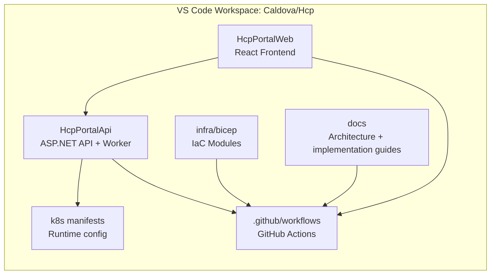
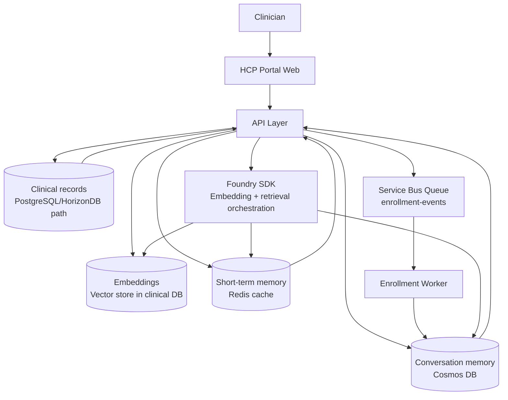
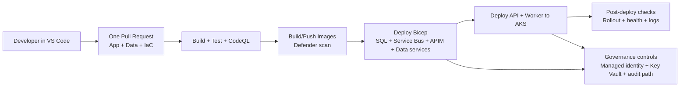

# One Lifecycle Future Plan

## Objective

Build a single engineering lifecycle where clinician-ready data, AI memory, and deployment automation are implemented and shipped from one workspace and one pipeline.

## Strategic outcomes

- Deliver a production-ready clinical data foundation with retrieval support.
- Add AI memory layers for short-term and long-term context.
- Keep infrastructure, application code, and governance in one deploy path.

## Architecture view: one workspace surface area

## Data and memory flow

## Delivery pipeline: code to governed runtime

## Implementation roadmap

1. Data modeling and storage split
    - Keep structured clinical records and embedding vectors in a PostgreSQL-compatible path.
    - Keep conversation history and long-term profile memory in Cosmos DB.
    - Use Redis for short-term response and context caching.

2. Infrastructure as code expansion
    - Extend Bicep modules for PostgreSQL-compatible service, Cosmos DB, and Redis.
    - Expose outputs needed by API and worker deployment.
    - Apply identity-first access and network restrictions.

3. Application integration
    - Register memory and retrieval services in dependency injection.
    - Add embedding generation and retrieval orchestration through Foundry integration.
    - Preserve asynchronous enrichment through Service Bus and worker processing.

4. Unified delivery and governance
    - Keep one GitHub Actions workflow for build, scan, infra deploy, and AKS deploy.
    - Enforce security scanning, managed identity wiring, and secret externalization.
    - Verify rollout, health, and logs as deployment gates.

## Success criteria

- A single PR includes app changes, IaC updates, and configuration changes.
- The same workflow provisions data services and deploys application updates.
- AI responses are grounded on organizational data with reusable memory context.
