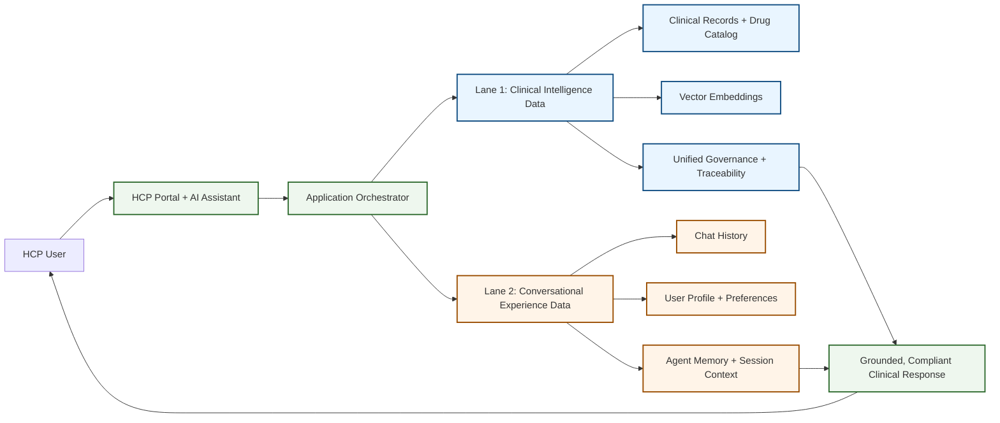

# Data Architecture

## One-Line Story
We run two data lanes in parallel: a trusted clinical intelligence lane for high-integrity decisions, and a real-time experience lane for fast, conversational user interactions.

## Architecture Snapshot

## Why This Split Works

### Lane 1: Clinical Intelligence (Structured, Trusted)
- Keeps clinical data, medication knowledge, and embeddings together.
- Preserves context integrity for retrieval and decision support.
- Optimized for consistency, governance, and auditability.

### Lane 2: Conversational Experience (Unstructured, Fast)
- Handles chat turns, profile context, and short/long-term agent memory.
- Optimized for low latency and high update frequency.
- Delivers real-time user experience without slowing clinical workflows.

## Business Outcome
- Faster user interactions without compromising clinical reliability.
- Better grounding quality because trusted medical context stays coherent.
- Cleaner compliance posture through clear separation of responsibilities.

## 20-Second Voiceover Script
We separate data into two purpose-built lanes. Lane one keeps clinical records, drug knowledge, and AI embeddings together, so responses are trustworthy and traceable. Lane two handles chat history, user preferences, and agent memory for real-time speed. The orchestrator combines both at response time, giving clinicians fast interactions and high-confidence clinical answers.
