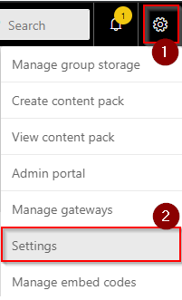
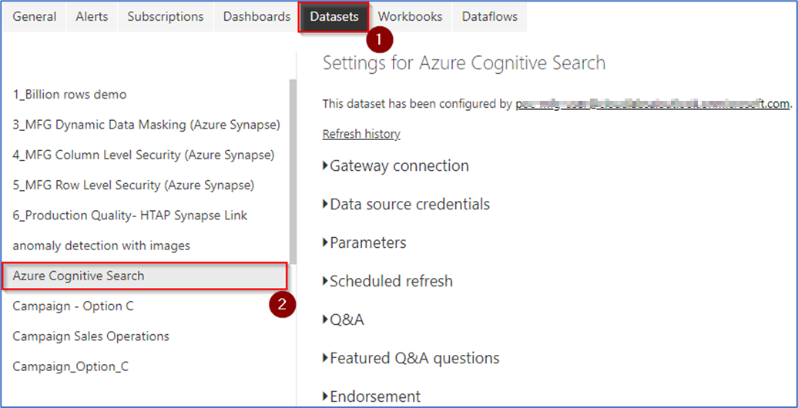
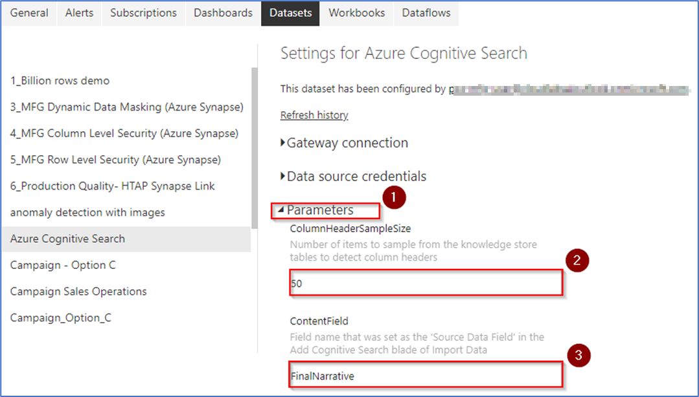

# Frequently Asked Questions

- [What if any resource shows failure during ARM deployment?](#what-if-any-resource-shows-failure-during-arm-deployment)
- [What if my cloud-shell session times out?](#what-if-my-cloud-shell-session-times-out)
- [Cloning repository gives error on cloudshell](#cloning-repository-gives-error)
- [Unable to authenticate a Power BI report](#unable-to-authenticate-a-power-bi-report)
- [What if pipeline execution fails in synapse](#what-if-pipeline-execution-fails-in-synapse)
- [What if embedded reports dont show up in web app](#what-if-embedded-reports-dont-show-up-in-web-app)
- [What if script throws BadRequestMultiClassClassificationTrainingValidationFailed error](#what-if-script-throws-badrequestmulticlassclassificationtrainingvalidationfailed-error)


## What if any resource shows failure during ARM deployment?

Sometimes resources may fail to deploy when there is too much traffic on azure servers ,the azure service is down for maintenance or the particular service is not available in your region.

- Check the azure services status here: https://status.azure.com/en-us/status and check the availability of the service that is failing for you.
- Retry the deployment in another region/location.
- Make sure the following resource providers are registered for your Azure Subscription.  
  - Microsoft.Sql 
  - Microsoft.Synapse 
  - Microsoft.StreamAnalytics  
  - Microsoft.EventHub  

## What if my cloud-shell session times out?

It is important to keep the cloud shell session live during execution else the script will fail to complete. In this case you may try to re-run the script but it may throw errors for the conflicting tasks. As a last resort you will have t delete the resources and re-deploy the templates.

## Cloning repository gives error
- Check if you already have a folder named HeathCare in your cloudshell using PowerShell ```ls```
- If so, delete the folder by running the following command ```rm HeathCare -r -f```
- If you are getting insufficient space error, delete any other folders that are present on the cloud shell.
- You can choose to recreate the storage mount for your cloudshell by deleting the existin storage account that you configured for it or executing the command ```clouddrive unmount```

## Unable to authenticate a Power BI report

- Check the datasource server of the report if it got updated with server name of your SQL pool.

Follow the steps below to update the datasource:

### Updating Power BI report parameters through Power BI Service

1.	In the Power BI service, **click** on 'Settings' icon on top-right corner. **Click** on 'Settings' from the expanded list.



2.	**Select** the tab for 'Datasets' and **highlight** a dataset in the list.



3.	**Expand** 'Parameters'.

4.	If the selected dataset has no parameters, you see a message with a link to 'Learn more about query parameters', in which case you should follow the steps mentioned in the next section. If the dataset has parameters, expand the 'Parameters' heading to reveal those parameters.

5.	**Review** the parameter settings and make changes if needed. 

> **Note:** Grayed-out parameter fields are not editable.



6. **Click** on 'Apply'.


## What if pipeline execution fails in synapse
1. **Open** Monitor Hub in synapse.
2. **Click** the pipeline run that failed.
3. **Check** the error message from the table listed.
4. If the error message shows "spark pool core limit reached", wait for sometime and then re-run the pipeline.

## What if embedded reports dont show up in web app
1. Ensure that admin consent is granted for your app service principal.
2. Ensure the client secret and client id are replaced in the appsettings.json of the web app starting with "manufacturing-poc".

## What if script throws BadRequestMultiClassClassificationTrainingValidationFailed error
1. Ensure your resources are located in one of the regions from region list(westus2, eastus2 , northeurope, northcentralus, southeastasia, uksouth, australliaeast, centralindia, japaneast).
2. Check if all images got uploaded inside customvision projects (no tag should have count as 0).
