# Manufacturing DREAM Demo in a Box Setup Guide

## What is it?
DREAM Demos in a Box (DDiB) are packaged Industry Scenario DREAM Demos with ARM templates (with a demo web app, Power BI reports, Synapse resources, AML Notebooks etc.) that can be deployed in a customer’s subscription using the CAPE tool in a few hours.  Partners can also deploy DREAM Demos in their own subscriptions using DDiB.

 ## Objective & Intent
Partners can deploy DREAM Demos in their own Azure subscriptions and show live demos to customers. 
In partnership with Microsoft sellers, partners can deploy the Industry scenario DREAM demos into customer subscriptions. 
Customers can play,  get hands-on experience navigating through the demo environment in their own subscription and show to their own stakeholders
**Before You Begin**

## :exclamation:IMPORTANT NOTES:  

  1. **Please read the [license agreement](https://github.com/microsoft/Azure-Analytics-and-AI-Engagement/blob/main/CDP-Retail/license.md) and [disclaimer](https://github.com/microsoft/Azure-Analytics-and-AI-Engagement/blob/main/CDP-Retail/disclaimer.md) before proceeding, as your access to and use of the code made available hereunder is subject to the terms and conditions made available therein.**
  2. Without limiting the terms of the [license](https://github.com/microsoft/Azure-Analytics-and-AI-Engagement/blob/main/CDP-Retail/license.md) , any Partner distribution of the Software (whether directly or indirectly) may only be made through Microsoft’s Customer Acceleration Portal for Engagements (“CAPE”). CAPE is accessible by Microsoft employees. For more information about the CAPE process, please connect with your local Data & AI specialist or CSA/GBB.
  3. Please note that **Azure hosting costs** are involved when DREAM Demos in a Box are implemented in customer or partner Azure subscriptions. **Microsoft will not cover** DDiB hosting costs for partners or customers.
  4. Since this is a DDiB, there are certain resources open to the public. **Please ensure proper security practices are followed before you add any sensitive data into the environment.** To strengthen the security posture of the environment, **leverage Azure Security Centre.** 
  5.  For any questions or comments please email **[dreamdemos@microsoft.com](mailto:dreamdemos@microsoft.com).**
  
   > **Note**: Set up your demo environment at least two hours before your scheduled demo to make sure everything is working.
   
# Copyright

© 2021 Microsoft Corporation. All rights reserved.   

By using this demo/lab, you agree to the following terms: 

The technology/functionality described in this demo/lab is provided by Microsoft Corporation for purposes of obtaining your feedback and to provide you with a learning experience. You may only use the demo/lab to evaluate such technology features and functionality and provide feedback to Microsoft.  You may not use it for any other purpose. You may not modify, copy, distribute, transmit, display, perform, reproduce, publish, license, create derivative works from, transfer, or sell this demo/lab or any portion thereof. 

COPYING OR REPRODUCTION OF THE DEMO/LAB (OR ANY PORTION OF IT) TO ANY OTHER SERVER OR LOCATION FOR FURTHER REPRODUCTION OR REDISTRIBUTION IS EXPRESSLY PROHIBITED. 

THIS DEMO/LAB PROVIDES CERTAIN SOFTWARE TECHNOLOGY/PRODUCT FEATURES AND FUNCTIONALITY, INCLUDING POTENTIAL NEW FEATURES AND CONCEPTS, IN A SIMULATED ENVIRONMENT WITHOUT COMPLEX SET-UP OR INSTALLATION FOR THE PURPOSE DESCRIBED ABOVE. THE TECHNOLOGY/CONCEPTS REPRESENTED IN THIS DEMO/LAB MAY NOT REPRESENT FULL FEATURE FUNCTIONALITY AND MAY NOT WORK THE WAY A FINAL VERSION MAY WORK. WE ALSO MAY NOT RELEASE A FINAL VERSION OF SUCH FEATURES OR CONCEPTS.  YOUR EXPERIENCE WITH USING SUCH FEATURES AND FUNCITONALITY IN A PHYSICAL ENVIRONMENT MAY ALSO BE DIFFERENT. 

## Contents

<!-- TOC -->

- [Azure Synapse Analytics Wide World Importers setup guide](#azure-synapse-analytics-setup-guide)
  - [Requirements](#requirements)
  - [Before Starting](#before-starting)
    - [Task 1: Create a resource group in Azure](#task-1-create-a-resource-group-in-azure)
    - [Task 2: Create Power BI workspace](#task-2-create-power-bi-workspace)
    - [Task 3: Deploy the ARM Template](#task-3-deploy-the-arm-template)
    - [Task 4: Run the Cloud Shell](#task-4-run-the-cloud-shell)
    - [Task 5: Create Power BI reports and Dashboard](#task-5-create-power-bi-reports-and-dashboard)
    - [Task 6: Working with Power BI to create real-time reports](#task-6-working-with-power-bi-to-create-real-time-reports)
    - [Task 7: Modify the CSV to change campaign names, product categories, and hashtags](#task-7-modify-the-csv-to-change-campaign-names-product-categories-and-hashtags)
    - [Task 8: Publishing the Custom Vision model](#task-8-publishing-the-custom-vision-model)
    - [Task 9: Uploading new incident reports](#task-9-uploading-new-incident-reports)
    - [Task 10: Pause-Resume resources](#task-10-pause-resume-resources)
    - [Task 11: Clean up resources](#task-11-clean-up-resources)
    
<!-- /TOC -->

## Requirements

* An Azure Account with the ability to create an Azure Synapse Workspace.
* A Power BI Pro or Premium account to host Power BI reports.
* Make sure the following resource providers are registered with your Azure Subscription.
   
   - Microsoft.Sql 
   - Microsoft.Synapse 
   - Microsoft.StreamAnalytics 
   - Microsoft.EventHub 
* Please note that you can run only one deployment at a given point of time and need to wait for the completion. You should not run multiple deployments in parallel as that will cause deployment failures.
* Please ensure selection of correct region where desired Azure Services are available. In case certain services are not available, deployment may fail. [Azure Services Global Availability](https://azure.microsoft.com/en-us/global-infrastructure/services/?products=all) for understanding target services availablity.
* Do not use any special characters or uppercase letters in the environment code.
* Please ensure that you select the correct resource group name. We have given a sample name which  may need to be changed should any resource group with the same name already exist in your subscription.
* Once the resources have been setup, please ensure that your AD user and synapse workspace have “Storage Blob Data Owner” role assigned on storage account name starting with “dreamdemostrggen2”. You need to contact AD admin to get this done.

> **Note:** Please log in to Azure and Power BI using the same credentials.

## Before starting

### Task 1: Create a resource group in Azure

1. **Log into** the [Azure Portal](https://portal.azure.com) using your Azure credentials.

2. On the Azure Portal home screen, **select** the '+ Create a resource' tile.

    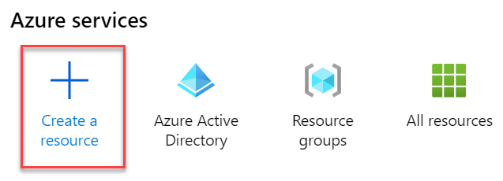

3. In the **Search the Marketplace** text box, type 'Resource Group' and **press** the Enter key.

    

4. **Select** the 'create' button on the 'Resource Group' overview page.

	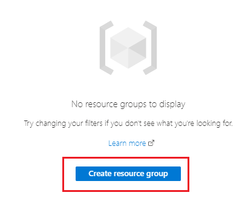
	
5. On the 'Create a resource group' screen, **select** your desired Subscription. For Resource group, **type** 'Synapse-WWI-Lab'. 

6. **Select** your desired Region. 

7. **Click** the 'Review + Create' button.

    

8. **Click** the 'Create' button once all entries have been validated.

    

### Task 2: Create Power BI workspace

1. **Open** Power BI Services in a new tab using the following link:  https://app.powerbi.com/

2. **Sign in**, to your Power BI account using Power BI Pro account.

> **Note:** Please use the same credentials for Power BI which you will be using for Azure Account.


3. In Power BI service **click** on 'Workspaces'.

4. Then **click** on the 'Create a workspace' tab.


5. **Enter** the 'Workspace name' and 'Description' and **click** 'Save'.

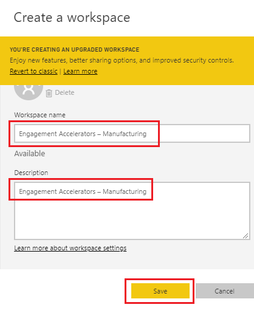

> **Note:** Please create a Workspace by the name 'Engagement Accelerators – Manufacturing'.

6. **Copy** the Workspace GUID or ID. You can get this by browsing to https://app.powerbi.com/, selecting the workspace, and then copying the GUID from the address URL and paste it in a notepad for future reference.
> **Note:** This workspace ID will be used during ARM template deployment.


### Task 3: Deploy the ARM Template

1. **Right-click** on the 'Deploy to Azure' button given below and open the link in a new tab to **deploy** the Azure resources that you created in [Task 1](#task-1-create-a-resource-group-in-azure) with an Azure ARM Template.

    <a href='https://portal.azure.com/#create/Microsoft.Template/uri/https%3A%2F%2Fraw.githubusercontent.com%2Fmicrosoft%2FAzure-Analytics-and-AI-Engagement%2Fmain%2FManufacturing%2Fautomation%2FmainTemplate-shell.json' target='_blank'></a>

2. On the Custom deployment form, **select** your desired Subscription.
3. **Type** the resource group name 'Synapse-WWI-Lab' created in [Task 1](#task-1-create-a-resource-group-in-azure).
4. **Select** Region where you want to deploy.
> **Note:** Ensure the resource availability for synapse, cognitive services and aml in the region you select.
5. **Provide** environment code which is a unique suffix to your environment without any special characters. e.g. 'demo'.
> **Note:** Please enter the values in compliance with tooltip instructions
6. **Provide** a strong SQL Administrator Login Password and set this aside for later use.
7. **Enter** the Power BI Workspace ID, created in [Task 2](#task-2-power-bi-workspace-creation), in the 'Pbi_workspace_id' field.
8. **Select** Location from the dropdown. Please ensure that this is the same location you selected in Step #4 above.
9. **Click** 'Review + Create' button.

   

10. **Click** the 'Create' button once the template has been validated.

   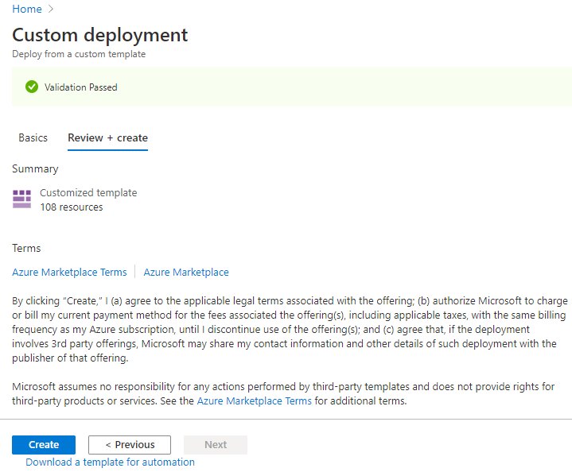

> **NOTE:** The provisioning of your deployment resources will take approximately 20 minutes.

11. **Stay** on the same page and wait for the deployment to complete.
    
    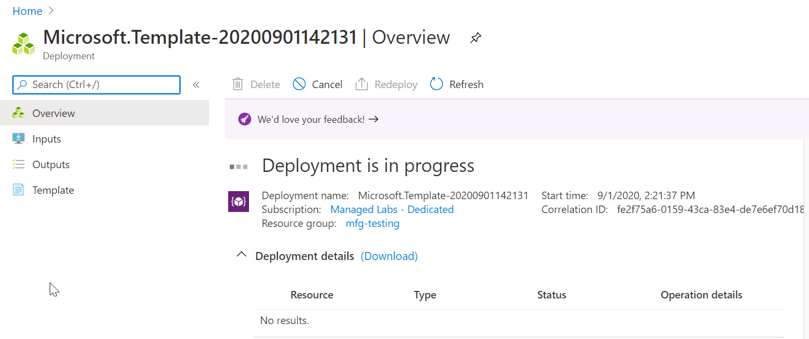
    
12. **Click** 'Go to resource group' button once your deployment is complete.

    
    
### Task 4: Run the Cloud Shell 

**Open** the Azure Portal.

1. In the 'Resource group' section, **open** the 'Azure Cloud Shell' by selecting its icon from the top toolbar.

    

2. **Click** on 'Show advanced settings'. 

	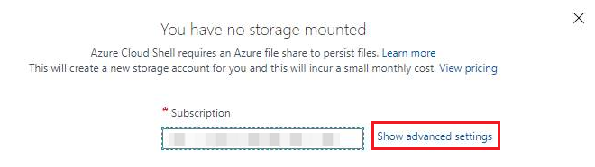
	
> **Note:** If you already have a storage mounted for Cloud Shell, you will not get this prompt. In that case, skip step 2 and 3.

3. **Select** your 'Resource Group' and **enter** the 'Storage account' and 'File share' name.

	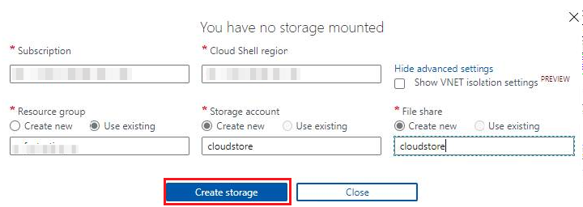

> **Note:** If you are creating a new storage account, give it a unique name with no special characters or uppercase letters and it should not be more 10 characters.
> **Note:** If you face permission issues while executing the scripts in cloudshell, you also have the option to execute them through your local PowerShell. Before executing the following steps on your local PowerShell, execute the script located [here] ( https://github.com/microsoft/Azure-Analytics-and-AI-Engagement/blob/main/Manufacturing/automation/installer.ps1 ) for the prerequisite installations on your local PowerShell in administrator mode. You may have to execute the the following command to remove execution restrictions on your local PowerShell. 
```PowerShell
Set-Executionpolicy unrestricted
```
4. In the Azure Cloud Shell window, **enter** the following command to clone the repository files.

    ```PowerShell
    git clone https://github.com/microsoft/Azure-Analytics-and-AI-Engagement.git MfgAI
    ```
    
    
    
    > **Note:** If you get File “MfgAI” already exist error, please execute following command: rm MfgAI -r -f to delete existing clone.
    
    > **Note**: When executing the script below, it is important to let the scripts run to completion. Some tasks may take longer than others to run. When a script completes execution, you will be returned to PowerShell prompt. The total runtime of all steps in this task will take approximately 1 hour.

5. Execute the `manufacturingSetup-shell.ps1` script by executing the following commands:

    ```PowerShell
    cd 'MfgAI/Manufacturing/automation'
    ```

6. Then **run** the PowerShell: 

    ```PowerShell
    ./manufacturingSetup-shell.ps1
    ```

   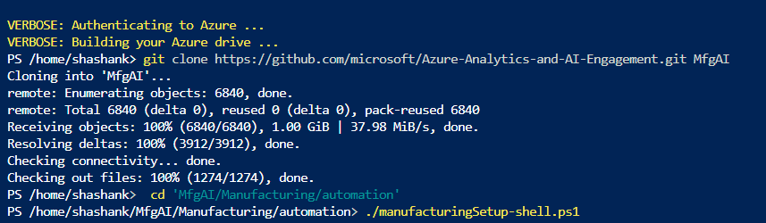
   
      > **Note** You will be prompted to confirm that you have read the license agreement and disclaimers. Click on the links to read it if not already done. Type 'Y'         if you agree with the terms and conditions in it. Else type 'N' to stop the execution. Also ensure you delete the resources in your resource group if you do not         wish to continue further.

   
      
7. From the Azure Cloud Shell window, **copy** the Authentication Code.

8. Click on the link https://microsoft.com/devicelogin) and a new browser window will launch.

     
     
9. **Paste** the authentication code.

     

10. **Select** the same user that you used for signing in to the Azure Portal in [Task 1](#task-1-create-a-resource-group-in-azure).

     

11. **Close** the browser tab once you see the below message window and **go back** to your 'Azure Cloud Shell' execution window.

     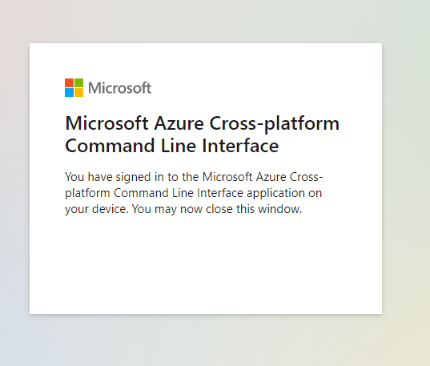

	 **Note:** If you face permission issues while executing the scripts in cloudshell, you also have the option to execute them through your local PowerShell. Before executing the following steps on your local PowerShell, execute the script located [here] ( https://github.com/microsoft/Azure-Analytics-and-AI-Engagement/blob/main/Manufacturing/automation/installer.ps1 ) for the prerequisite installations on your local PowerShell in administrator mode. You may have to execute the the following command to remove execution restrictions on your local PowerShell. 
	 
```PowerShell
Set-Executionpolicy unrestricted
```
	 
12. **Navigate** back to the resource group tab.
13. You will get another code to authenticate Azure PowerShell script for creating reports in Power BI. **Copy** the code.

14. **Click** the link (https://microsoft.com/devicelogin).

     


15. Follow the same steps as in [Task 4](#task-4-run-the-cloud-shell) steps 7 to 11.
 
     

> **Note:** While you are waiting for processes to get completed in the Azure Cloud Shell window, you'll be asked to enter the code three times. This is necessary for performing installation of various Azure Services and preloading content in the Azure Synapse Analytics SQL Pool tables.

16. You will now be prompted to enter the resource group name in the Azure Cloud Shell window. Enter the name of the resource group that you created in [Task 1](#task-1-create-a-resource-group-in-azure) - 'Synapse-WWI-Lab'.

     

17. You will get another code to authenticate Power BI gateway. **Copy** the code.
18. **Click** the link (https://microsoft.com/devicelogin).


19. A new browser window will launch. **Follow** the same steps as in [Task 4](#task-4-run-the-cloud-shell) steps 9, 10 and 11.

**Open** the Azure Portal.

20. **Go** to the resource group you have created in [Task 1](#task-1-create-a-resource-group-in-azure).
21. **Search** the storage account name starts with 'dreamdemo'.
22. **Go** to the storage account by clicking on its link.

      
      
23. **Click** on 'Access Keys' from the left navigation pane for storage account.
24. **Copy** the 'key1' to the clipboard and **paste** the key in a notepad for future reference.

      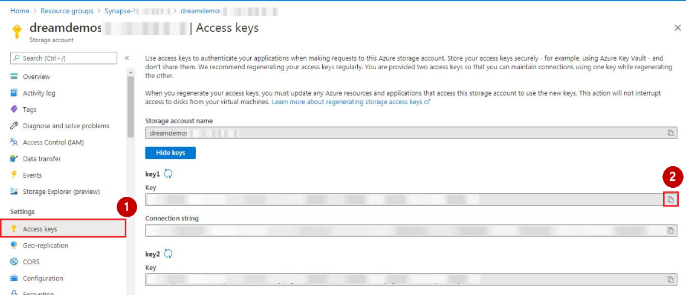
      
      
**Open** the Azure Portal.

25. **Go** to the resource group you have created in [Task 1](#task-1-create-a-resource-group-in-azure).
26. **Search** the Cosmos DB account name starts with 'cosmosdb'.
27. **Go** to the Cosmos DB account by clicking on its link.

      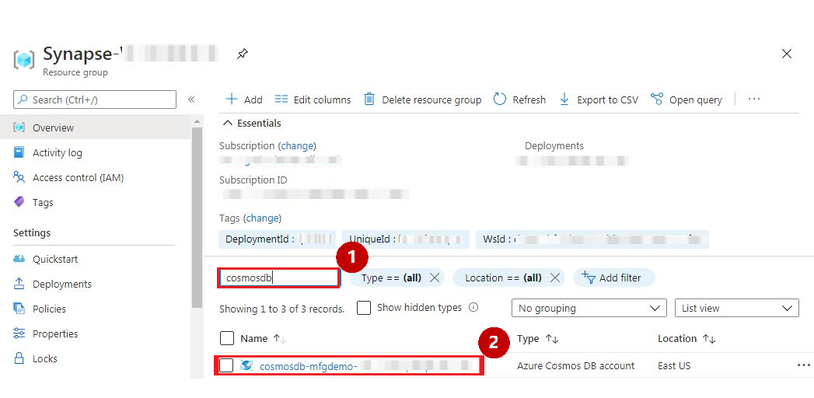
      
      
28. **Click** on 'Keys' from the left navigation pane for Cosmos DB account.
29. **Copy** the 'Primary key' to the clipboard and **paste** the key in a notepad for future reference.

      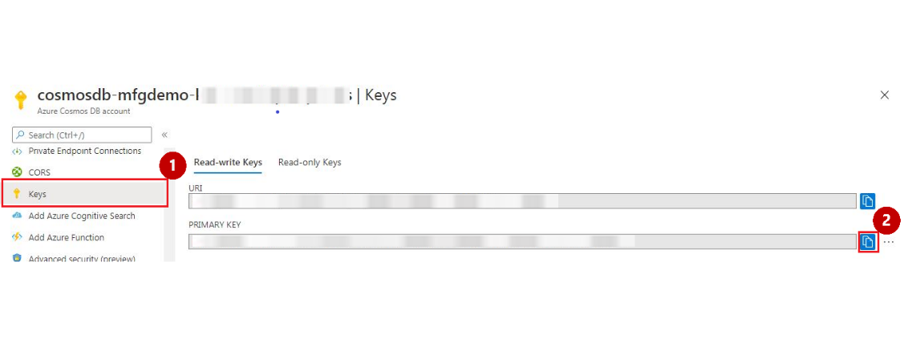
      
      
### Task 5: Create Power BI reports and Dashboard

1. **Open** Power BI Services in a new tab using following link https://app.powerbi.com/

2. **Sign in** to Power BI account using 'Power BI Pro account'.

> **Note**: Please use the same credentials for Power BI that you used for '[Deploy the ARM Template](#task-3-deploy-the-arm-template)' deployment.


3. **Select** the Workspace 'Engagement Accelerators – Manufacturing'.

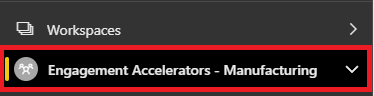

Assuming [Task 4](#task-4-run-the-cloud-shell-to-provision-the-demo-resources) got completed successfully and the template has been deployed, you will be able to see a set of reports in the reports tab of Power BI, real-time datasets in dataset tab.
The image below shows the 'Reports' tab in Power BI. We can then create a Power BI dashboard by pinning visuals from these reports.

> **Note:** A Dashboard is a collection of tiles/visualization which are pinned from different reports to a single page.


**To give permissions for the Power BI reports to access the datasources:**

4. **Click** the 'Settings' icon on top right-side corner.

5. **Click** 'Settings' from the expanded list.


6. **Click** 'Datasets' tab.


7. **Click** 'Campaign – Option C' Report.

8. **Expand** Data source credentials.

9. **Click** Edit credentials and a 'Configure Campaign - Option C' dialogue box will pop up.

> **Note:** If the data-source of the report dataset does not match the SQL pool name, then you may have to update the report dataset using Power BI desktop. For further details refer [FAQ](https://github.com/microsoft/Azure-Analytics-and-AI-Engagement/blob/main/Manufacturing/F.A.Q.md).


10. **Enter** Username as 'ManufacturingUser'.

11. **Enter** the same SQL Administrator login password that was created for [Task 3](#task-3-deploy-the-arm-template) Step #6.

12. **Click** Sign in.


13. **Click** ‘Azure Cognitive Search’ dataset.
14. **Expand** 'Data source credentials'. **Click** 'Edit credentials' and a dialogue box will pop up.

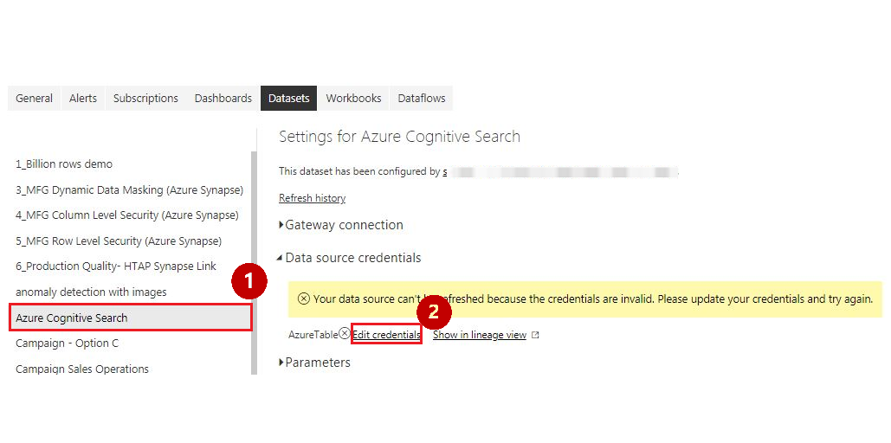

15. **Enter** the same storage key that was noted down in Step 28 of [Task 4](#task-4-run-the-cloud-shell-to-provision-the-demo-resources).
16. **Click** 'Sign in'.

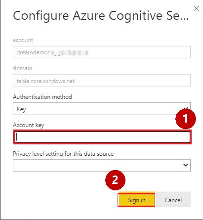


17. **Click** ‘anomaly detection with images’ dataset.
18. **Expand** 'Data source credentials' and **click** 'Edit credentials' and a dialogue box will pop up.

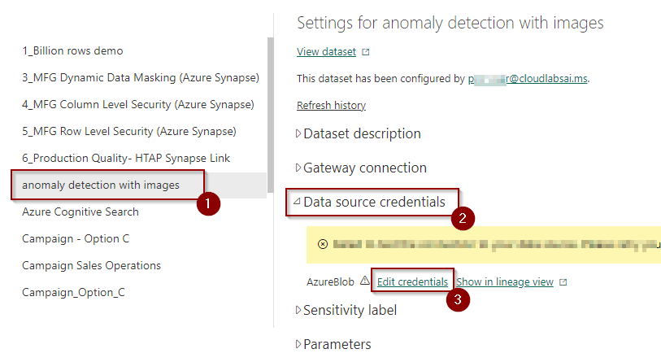

19. **Select** 'Key' from 'Authentication method' dropdown.

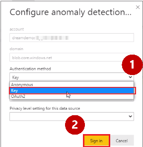

20. **Enter** the same storage key that was noted down in Step 28 of [Task 4](#task-4-run-the-cloud-shell-to-provision-the-demo-resources).
21. **Click** 'Sign in'.

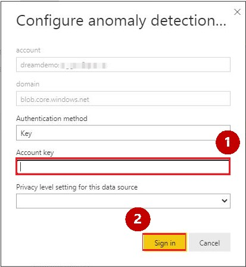

22. **Click** '6_Production Quality- HTAP Synapse Link' dataset.
23. **Expand** 'Data source credentials'.
24. **Click** 'Edit credentials' and a dialogue box will pop up.

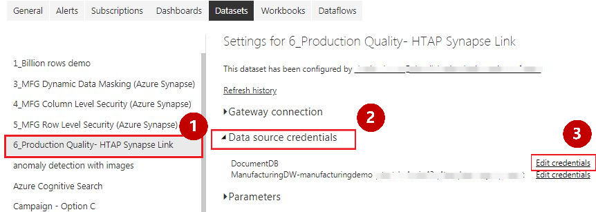

25. **Enter** the same cosmos key that was noted down in Step 33 of [Task 4](#task-4-run-the-cloud-shell-to-provision-the-demo-resources).
26. **Click** 'Sign in'.

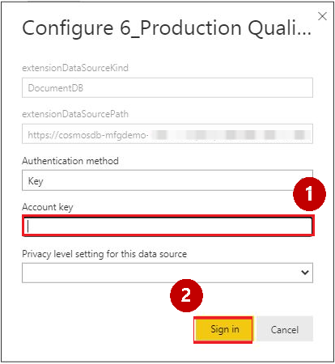

**Follow these steps to create the Power BI dashboard:**

27. **Select** the workspace 'Engagement Accelerators - Manufacturing'.


28. **Click** on '+Create' button on the top navigation bar.

29. **Click** the 'Dashboard' option from the drop-down menu.


30. **Name** the dashboard 'Engagement Accelerators Dashboard' and **click** 'create'.

31. This new dashboard will appear in the 'Dashboard' section of the Power BI workspace.


**Follow the below steps to change the dashboard theme:**

32. **Open** the URL in new browser tab to get JSON code for a custom theme: https://raw.githubusercontent.com/microsoft/Azure-Analytics-and-AI-Engagement/real-time/Manufacturing/automation/artifacts/theme/CustomTheme.json

33. **Right click** anywhere in browser and **click** 'Save as...'.

34. **Save** the file to your desired location on your computer, leaving the name unchanged.

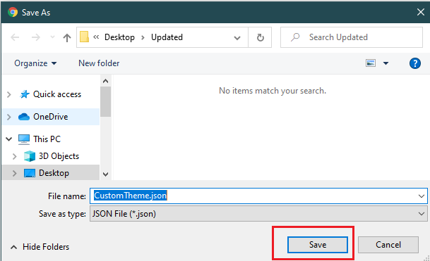

35. **Go back** to the Power BI Dashboard you just created.

36. **Click** on ellipses at the top right-side corner.

37. **Click** on Dashboard theme.

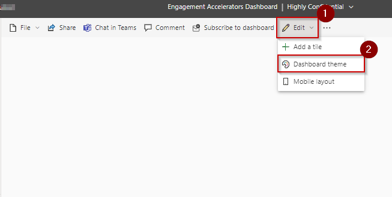

38. **Click** Upload the JSON theme.

39. **Navigate** to the location where you have saved the JSON theme file in Step #21 above and **Select** open.

40. Click **Save**.

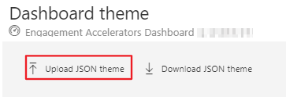

**Do the following to pin visuals to the dashboard you just created:**

41. **Select** the workspace 'Engagement Accelerators - Manufacturing'.


42. **Click** on the 'Reports' section/tab.


43. In the 'Reports' section, there will be a list of all the published reports.

44. **Click** on 'Campaign - Option C' report.


45. On the 'Campaign – Option C' report page, **click** the 'Revenue Vs Target' visual and **click** the pin icon.


46. **Select** 'Existing dashboard' radio button.

47. **From** 'Select existing dashboard' dropdown, **select** 'Engagement Accelerators Dashboard'.

48. **Click** 'Pin'.


49. Similarly, **pin** 'Profit card' and 'Investment, Incremental Revenue and ROI Campaign Scatter Chart' from the report.


**Some of the visuals are pinned from hidden pages. To pin such visuals, follow the below steps.**

50. **Click** on Edit report.

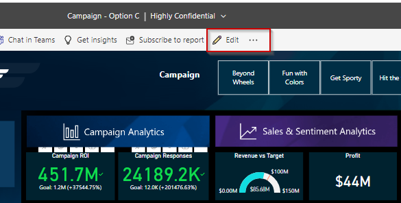

51. **Click** 'Sales and Campaign' report page.


52. **Pin** 'Total Campaign', 'Cost of Goods Sold' card visuals to 'Engagement Accelerators Dashboard'.

53. **Pin** 'Revenue by country' map visual.

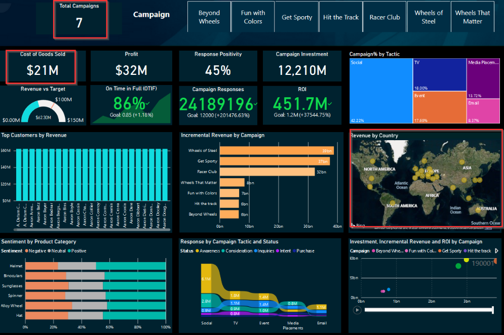

> **Note:** Please refer to steps 45-48 of [Task 5](#task-5-create-power-bi-reports-and-dashboard) for the complete procedure of pinning a desired visual to a dashboard.

54. **Select** the workspace 'Engagement Accelerators - Manufacturing'.


55. **Open** 'Dashboard Images' report.

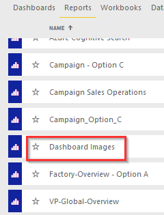	

56. **Pin** all images from above report to the 'Engagement Accelerators Dashboard'.

> **Note:** Please refer to steps 45-48 of [Task 5](#task-5-create-power-bi-reports-and-dashboard) for the complete procedure of pinning a desired visual to a dashboard.

57. **Go back** to the 'Engagement Accelerators Dashboard'.

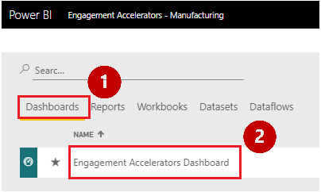

**To hide title and subtitle for all the images that you have pined above. Please do the following:**

58. **Click** on ellipsis 'More Options' of the image you selected.

59. **Click** 'Edit details'.

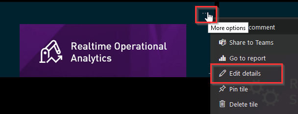

60. **Uncheck** 'Display title and subtitle'.

61. **Click** 'Apply'.

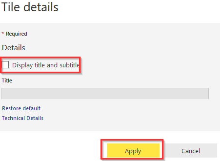

62. **Repeat** Step 58-61 of [Task 5](#task-5-create-power-bi-reports-and-dashboard) to disable  title and subtitle for each image tiles.

63. After disabling 'Display title and subtitle' for all images, **resize** and **re-arrange** top images tiles or chicklets as shown in the screenshot. **Resize** the 'Wide World Importers' logo to 1x1 size. **Resize** other vertical tiles to 2x1 size.  


64. **Resize** and **rearrange** left images tiles or chicklets as shown in the screenshot. **Resize** 'KPI' tile to 1x2 size. **Resize** 'Deep Dive' tile to 1x4 size.


65. **Refer** the screenshot of the sample dashboard below and pin the visuals to replicate the following look and feel.


66. **Pin** the 'Predictive maintenance and Safety Analytics' pillar tiles to the dashboard using the 'anomaly detection with images' report. To do this, **follow** the same procedure as above.


### Task 6: Working with Power BI to create real-time reports

'Racing Cars' and 'Milling canning' datasets will be automatically created when Azure Stream Analytics jobs start sending data into Power BI services.
 Once the Dataset has been created in the Power BI workspace, (by Azure Cloud Shell commands executed in [Task 3](#task-3-deploy-the-arm-template) above) follow the next steps to create the real-time pillars.

> **Note:** For your convenience we have included a few real-time visuals and a few static visuals so that you can complete the dashboard.

**Creating the Realtime Operational Analytics pillar:**

In this section of the document we will create the 'Realtime Operational Analytics' pillar (screenshot below) of the dashboard. Please note we’ll pin visuals from the static Power BI report. And we will create Power BI visuals using a real-time dataset.


**Pin visuals from the static report:**

1. **Click** Workspace 'Engagement Accelerators - Manufacturing’.
2. **Click** on Reports tab.
3. **Search** 'Real Time Analytics Static Report’.
4. **Click** 'Real Time Analytics Static Report’.

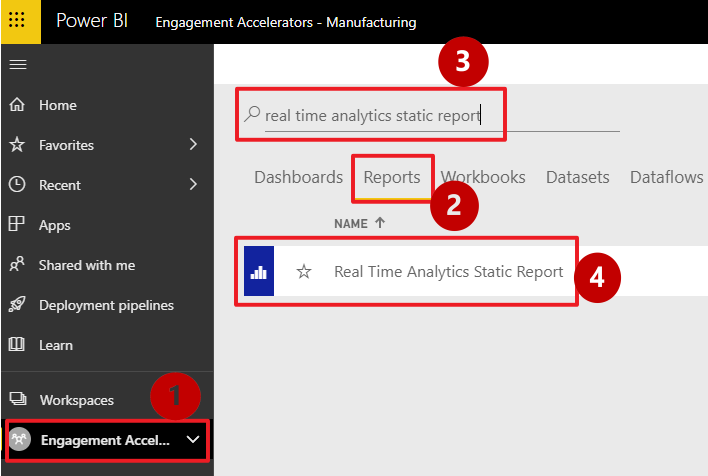

5. **Click** on 'Real time Operational Analytics’ page.

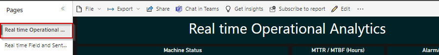

**Hover on the highlighted visuals to pin them to 'Engagement Accelerators Dashboard’.**

6. **Pin** 'Machine Status’ card visual.
7. **Pin** 'MTTR/MTBF (Hours)’ card visual.
8. **Pin** 'Alarms/Incidents’ card visual.
9. **Pin** 'OEE and Elements’ visual.
10. **Pin** 'Machine Vibration (mm) Milling-Canning’ visual.

> **Note:** Please refer to steps 45-48 of [Task 5](#task-5-power-bi-dashboard-creation) for the complete procedure of pinning a desired visual to a dashboard.

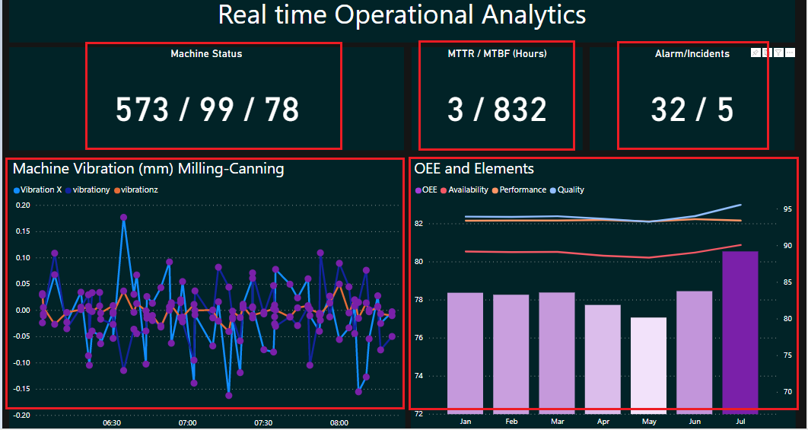

**Creating a visual from a real time dataset**

11. **Select** the workspace 'Engagement Accelerators - Manufacturing'.


12. **Click** on '+Create' button present on the top navigation bar.
13. **Select** 'Report' option from the drop-down menu.


14. **Enter** 'Racing' in the search bar.
15. **Select** the 'Racing Cars' dataset.
16. **Click** 'Create'.

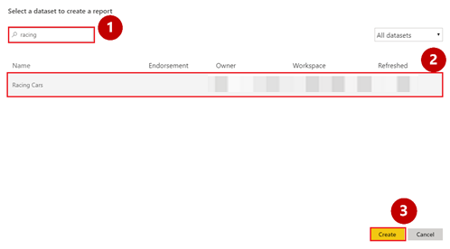

17. **Select** the 'ActiveSensors' field from 'race-cars' Dataset.
18. **Select** 'Card’ from Visualization pane.
19. **Select** drop-down next to 'ActiveSensors'.
20. **Select** 'Average' from the drop-down to get the average of 'ActiveSensors'.


21. **Change** the 'Display units' to 'None'.

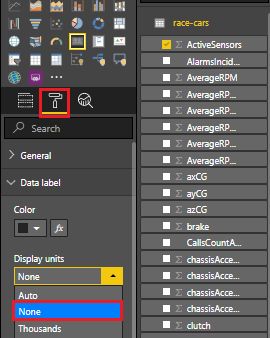

22. With Card visual selected, **select** the format tab.
23. **Turn on** the 'Title'.
24. **Enter** 'Active Sensors' as the title for the card.


25. **Change** the 'Data label' color to 'White’.

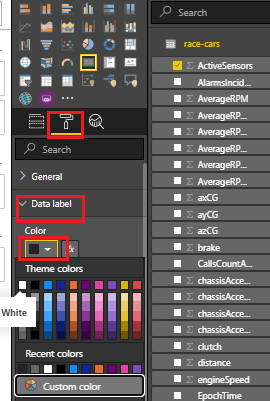

26. **Turn on** Background and change the background color of the card.

27. Similarly, the color of the KPI value and title value can be changed from the Data label and Title sections respectively. You can use the Hex code #00222F to achieve the background color of the visual.


> Note: All other visuals of the report can be created by following a similar process.

28. **Click** on the 'Save this report' icon.

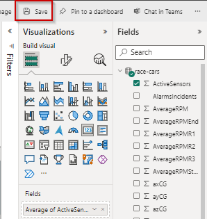

29. **Enter** the name of the report 'Racing Cars- A' and **click** on 'Save'.

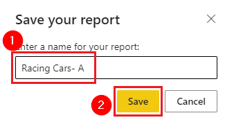

**Creating the Realtime Field and Sentiment Analytics pillar**

In this section of the document we will create the 'Realtime Field and Sentiment Analytics’ pillar (screenshot on the right) of the dashboard. Please note we’ll pin visuals from the static Power BI report. And we will create Power BI visuals using a real-time dataset.


**Pin visuals from the static report:**

30. **Click** Workspace 'Engagement Accelerators - Manufacturing’.
31. **Click** on Reports tab.
32. **Search** 'Real Time Analytics Static Report’.
33. **Click** 'Real Time Analytics Static Report’.


34. **Click** on the 'Real time Field and Sentiment Analytics report’ page in the previously opened 'Real Time Analytics Static Report’.


**Hover on the highlighted visuals to pin them to 'Engagement Accelerators Dashboard’.**

35. **Pin** 'Fields Calls-Avg Response Time (in minutes)’ visual.
36. **Pin** 'Alarms and Safety Incidents’ visual.
37. **Pin** 'Real time Anomaly’ visual.

> **Note:** Please refer to steps 45-48 of [Task 5](#task-5-power-bi-dashboard-creation) for the complete procedure of pinning a desired visual to a dashboard.


**Creating a visual from a real time dataset**

38. **Select** the workspace 'Engagement Accelerators - Manufacturing'.


39. **Click** on '+Create' button present on the top navigation bar.
40. **Select** 'Report' option from the drop-down menu.


41. **Enter** 'Racing' in the search bar.
42. **Select** the 'Racing Cars' dataset.
43. **Click** 'Create'.


44. **Select** 'Tachometer’ visual from visualizations pane.
45. **Drag** and **Drop** 'AverageRPM’ under value from race-cars dataset.
46. **Select** 'Average' from the context menu to get the average of 'AverageRPM’.

> **Note:** If you don’t have custom visual tachometer downloaded or don’t know how to use it please refer to the Microsoft tutorial: https://powerbi.microsoft.com/en-us/blog/visual-awesomeness-unlocked-tachometer-gauge-custom-visual/

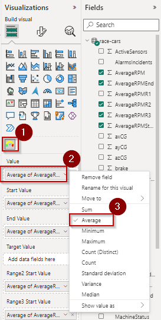

47. **Drag** and **Drop** 'AverageRPMStart’ under 'Start Value’ from race-cars dataset.
48. **Select** 'Average' from the context menu to get the sum of 'AverageRPMStart’.
49. **Drag** and **Drop** 'AverageRPMEnd’ under 'End Value’ from race-cars dataset and **follow** step #46 to get the Average of 'AverageRPMEnd’.
50. **Drag** and **Drop** 'AverageRPMR2’ under 'Range2 Start Value’ from race-cars dataset and **follow** step #46 to get Average of 'AverageRPMR2’.
51. **Drag** and **Drop** 'AverageRPMR3’ under 'Range3 Start Value’ from race-cars dataset and **follow** step #46 to get the Average of 'AverageRPMR3’.

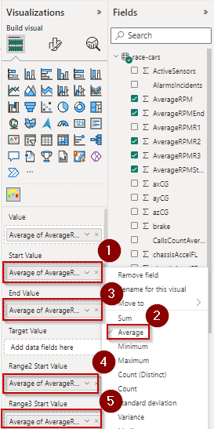

52. With the tachometer visual selected, **click** on the format tab.
53. **Turn on** 'Title'.
54. **Change** 'Title text’ to 'Average Engine Speed’.

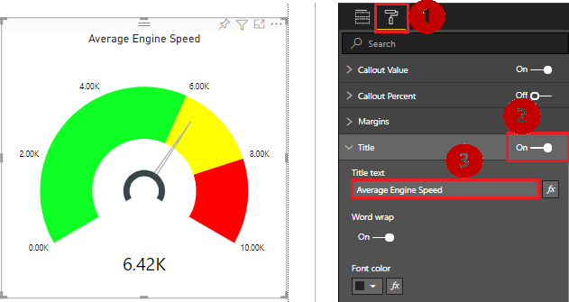

55. **Expand** 'Range 1'.
56. **Change** color for range one to hex code #E3B80F.
57. Similarly, the color of the 'Range 2' and 'Range 3' can be changed from the 'Range 2' and 'Range 3' respectively.

> **Note:** For 'Range 2' color you can use hex code #1AAB40 and for 'Range 3' color you can use hex code #EB895F.

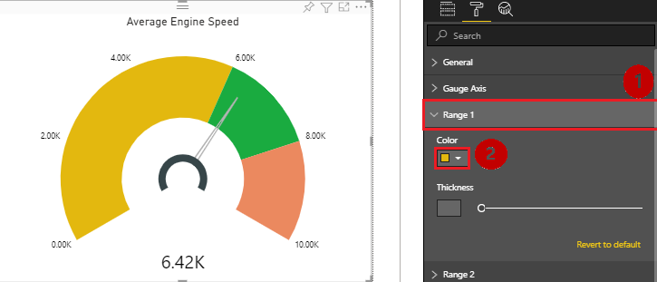

58. **Click** 'File’ and **select** 'Save' from the drop down.


59. **Type** 'Tachometer’ in the text box.
60. **Click** 'Save'.


 > **Note:** Once this visual is ready you can pin it to the dashboard using the steps 45-48 of [Task 5](#task-5-power-bi-dashboard-creation).
 
 **Follow the below step to create Wheel Acceleration tile**
 
61. **Select** the workspace 'Engagement Accelerators - Manufacturing'.


62. **Click** on '+Create' button present on the top navigation bar.
63. **Select** 'Report' option from the drop-down menu.


64. **Enter** 'Racing' in the search bar.
65. **Select** the 'Racing Cars' dataset.
66. **Click** 'Create'.


67. **Click** white space on the report. 
68. **Select** 'Line Chart' from visualization tray.
69. **Drag** and **Drop** 'EventProcessedUtcTime' from the race-cars dataset.
70. **Click** on 'Rename' and **change** 'EventProcessedUtcTime' to 'Recorded On'.

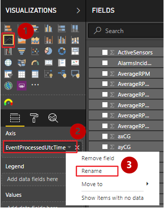

71. **Drag** and **Drop** below columns from 'race-cars' dataset to values:
	* wheelAccelFL
	* wheelAccelRL
	* wheelAccelFR
	* wheelAccelRR

72. Using Step 70, **rename** above selected columns- 'wheelAccelFL’, 'wheelAccelRL’, 'wheelAccelFR’ and 'wheelAccelRR’ to 'Front Left’, 'Rear Left’, 'Front Right’ and 'Rear Right’ respectively.

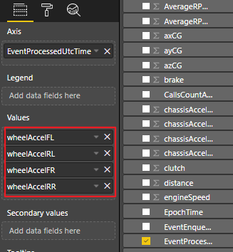

73. **Expand** the 'Filters' pane by clicking on the arrow icon.
74. **Navigate** to the 'Filters on this page' section.
75. **Select** 'Relative Time' from the 'Filter Type' dropdown menu.
76. In the 'Show items when the value' section, **select** 'is in the Last' in the top dropdown menu, **enter** '5' in the text input box and **select** 'minutes' from the bottom dropdown menu.
77. **Click** on 'Apply Filter'.


78. With 'Line chart' visual selected, **select** format tab.
79. **Turn on** 'Title'.
80. **Change** 'Title text' to 'Wheel Acceleration’.
81. **Pin** the visual to the dashboard.

> **Note:** Please refer to steps 45-48 of [Task 5](#task-5-power-bi-dashboard-creation) for the complete procedure of pinning a desired visual to a dashboard.


82. After pinning the visual to the dashboard, **click** on 'Save’ icon located on the navigation bar at the top, to save the changes made to the report.

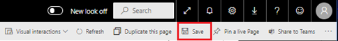


83. **Type** 'Wheel Acceleration' in the text box.
84. **Click** 'Save'.


85. Upon successful save, **click** on the workspace name 'Engagement - Accelerators Manufacturing’.


86. In the window that opens, **click** on 'Dashboards’ tab.
87. From the list of dashboards that appears, **click** on the dashboard 'Engagement Accelerators Dashboard’ located under Dashboards tab.


 
88. **Resize** and **rearrange** the visuals on the dashboard as per the screenshot below.


### Task 7: Modify the CSV to change campaign names, product categories, and hashtags

1. **Open** Azure Synapse in a new tab using the following link: <https://web.azuresynapse.net/>
2. Log in with your Azure credentials.
3. **Select** the 'Subscription’ and Synapse 'Workspace name’ that got created in [Task 3](#task-3-deploy-the-arm-template). The Synapse 'Workspace name’ will start with 'manufacturingdemo’.
4. **Click** 'Continue'.

> **Note:** Do not use any confidential customer data. Only use the data which is public available or with prior permission from the customer.
 	
   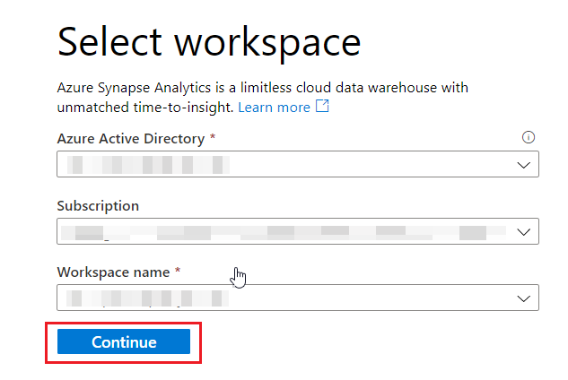

5.  **Click** the 'Data' hub from the left navigation in the 'Synapse Analytics' workspace.
6.  **Click** 'Linked' tab.
7.  **Expand** 'Storage Account/Azure Data Lake Storage Gen2'.
8.  **Expand** the node that starts with 'manufacturingdemo'. 
9.  **Click** 'customcsv' container.
10.  **Double Click** 'Manufacturing B2C Scenario Dataset'.

       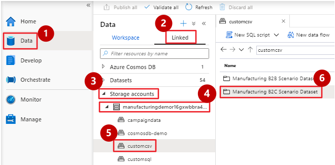

11.  **Select** 'CampaignData.csv'.
12.  **Click** 'Download' button on the top toolbar in Azure Synapse Analytics Studio. The file will download locally.

        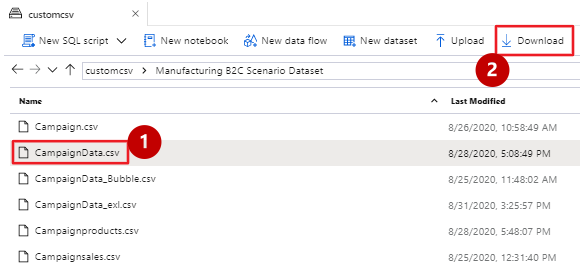

13.  **Open** the downloaded file in Excel. In case file does not get opened in Microsoft Excel, kindly **navigate** to the folder where file got downloaded and **right click** on the file name. **Click** 'Open With...' and then **click** 'Excel'.

        

14. **Select** 'CampaignName' column (Column B of Excel) and press 'CTRL + H' to replace exisitng campaign name with new campaign name.
15. **Replace** 'Spring into Summer' (old campaign name) with 'Summer Fashion' (new campaign name).
16. **Click** 'Replace All'.
17. **Pop up** will be displayed with 'All done...' replacement message.
18. **Click** OK.

> **Note:** In this demo, we change one campaign. In real-life you would have multiple campaigns, and you would be inserting campaigns aligned to your customer.

   

19. **Save** the file by pressing the highlighted button. **Close** the file.

 	

20. **Go back** to your browser window where 'Azure Synapse Analytics' is already open. In case it's not open, kindly follow steps 1 to 8 mentioned above. Once you have followed the steps, **click** 'Upload' button in 'Azure Synapse Analytics Studio' to upload the file from your local system.

 	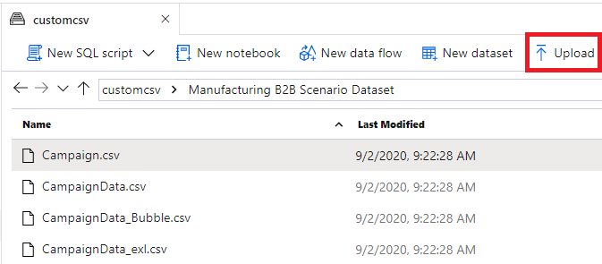

21. **Select** 'CampaignData.csv' file that you updated above.
22. **Click** the checkbox for overwriting existing files.
23. **Click** 'Upload'.

	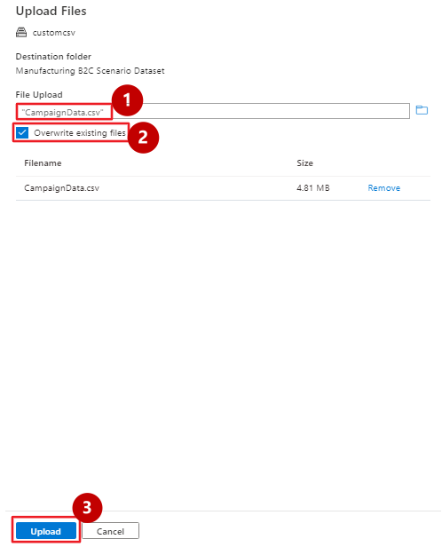

**Change the 'Category' in Product.csv file:**

24. **Go back** to your browser window where 'Azure Synapse Analytics' is already open. In case it's not open, kindly follow steps 1 to 8 mentioned above.
25.  **Select** 'Product.csv'.
26.  **Click** 'Download' button on the top toolbar in Azure Synapse Analytics Studio. File will get downloaded in your system locally.

> **Note:** In this demo, we change one category. In real-life you would have multiple categories, and you would be inserting categories aligned to your customer.

   

27.  **Open** the downloaded file. In case file does not open in Microsoft Excel, kindly **navigate** to the folder where file got downloaded and **right click** on the file name. **Click** 'Open With...' and then **click** 'Excel'.

        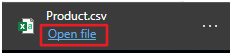

28. **Select** 'Category' column (Column G of Excel). 
29. **Press** 'CTRL + H' to replace exisitng campaign name with new campaign name.
30. **Replace** 'Hats' (old category name) with 'Gift Cards' (new category name).
31. **Click** 'Replace All'.
32. **Pop up** will be displayed with 'All done...' replacement message.
33. **Click** OK.

	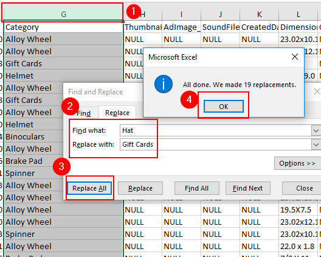

34. **Save** the file by pressing the highlighted button. **Close** the file.
 
	
 
35. **Go back** to your browser window where 'Azure Synapse Analytics' is already open. In case it's not open, kindly follow steps 1 to 8 mentioned above. Once you have followed the steps, **click** 'Upload' button in 'Azure Synapse Analytics Studio' to upload the file from your local system.

		

36. **Select** 'Product.csv' file that you just updated.
37. **Click** the checkbox for overwriting existing files.
38. **Click** 'Upload'.

	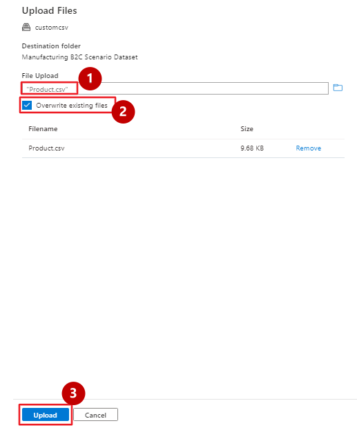

**To change 'Hashtags':**

39. **Go back** to your browser window where 'Azure Synapse Analytics' is already open. In case it's not open, kindly follow steps 1 to 8 mentioned above.
40.  **Select** 'Campaignproducts.csv'.
41.  **Click** 'Download' button on the top toolbar in Azure Synapse Analytics Studio. File will get downloaded in your system locally.

> **Note:** In this demo, we change one hashtag. In real-life you would have multiple hashtags, and you would be inserting hashtags aligned to your customer.

   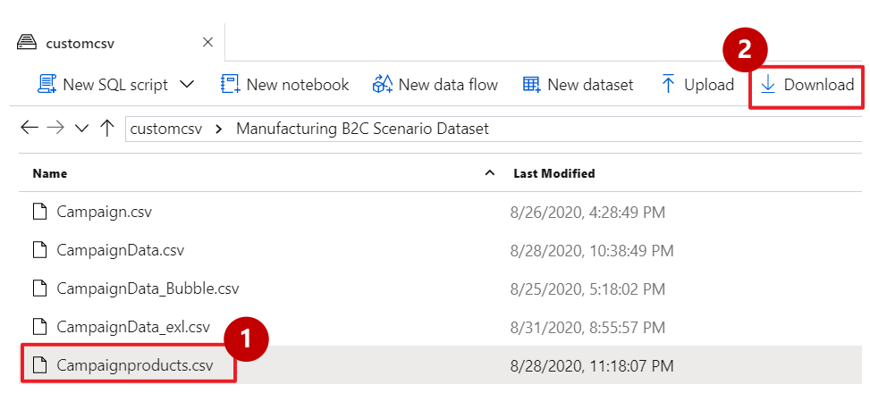

42.  **Open** the downloaded file. In case file does not get opened in Microsoft Excel, kindly **navigate** to the folder where file got downloaded and **right click** on the file name. **Click** 'Open With...' and then **click** 'Excel'.

        
 
43. **Select** 'Hashtag' column (Column C of Excel) and press 'CTRL + H' to replace exisitng campaign name with new campaign name.
44. **Replace** '\#welcomespring' (old Hashtag) with '\#welcomesummer' (new Hashtag).
45. **Click** 'Replace All'.
46. **Pop up** will be displayed with 'All done...' replacement message.
47. **Click** OK.

 	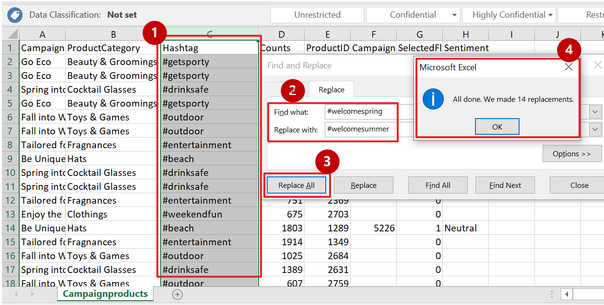

48. **Save** the file by pressing the highlighted button. **Close** the file.

 	

49. **Go back** to your browser window where 'Azure Synapse Analytics' is already open. In case it's not open, kindly follow steps 1 to 8 mentioned above. Once you have followed the steps, **click** 'Upload' button in 'Azure Synapse Analytics Studio' to upload the file from your local system.
50. **Select** 'Campaignproducts.csv' file that you updated above.
51. **Click** the checkbox for overwriting existing files.
52. **Click** 'Upload'.

 	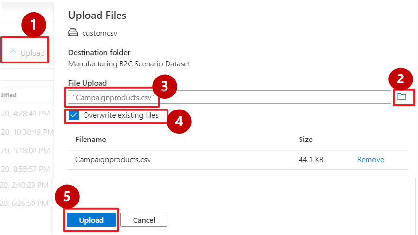  

**Update the dataset with this new data:**
 
53. **Navigate** to 'Orchestrate' hub from the left navigation in the 'Synapse Analytics' workspace.
54. **Expand** 'Pipelines' node.
55. **Click** on '1 Master Pipeline'.
56. **Click** 'Add trigger'.
57. **Click** 'Trigger now'.

 	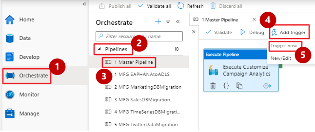

58. **Click** 'OK'

       

59. **Navigate** to 'Monitor' hub from the left navigation.
60. **Click** 'Pipeline runs'.

 	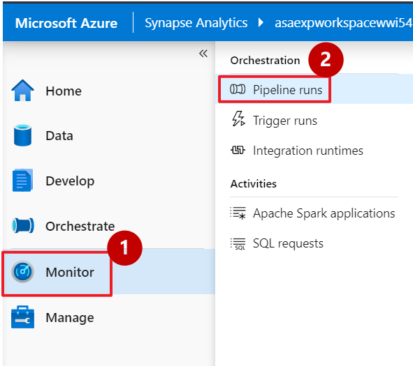

61. **Observe** '1 Master Pipeline'.

 	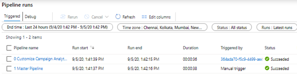

**View changes to Power BI:**
 
62. **Navigate** to 'Develop' hub from the left navigation.
63. **Expand** 'Power BI'.
64. **Expand** Power BI Workspace starting with name 'Engagement Accelerators...'.
65. **Expand** 'Power BI reports'.
66. **Click** on 'Campaign - Option C' Power BI report.

 	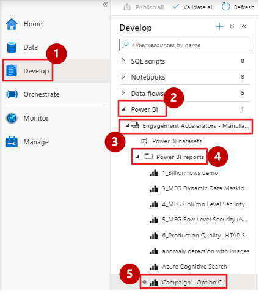	

67. 'Campaign Name' should have one of the updated campaign name as **'Summer Fashion'**.
68. 'Product Category' should have one of the updated category as **'Gift Cards'**.
69. 'Hashtag' should have one of the updated Hashtag as **'\#welcomesummer'**.

 	

Your Accelerator environment is now set up.


### Task 8: Publishing the Custom Vision model

1. **Go** to  https://customvision.ai/ and **click** on 'Sign In'.
2. **Select** 'I agree' checkbox and **click** on 'I Agree’ button.
>**Note:**  If you get any sensitive information related warning then click on 'OK'.


3. **Select** your cognitive service resource from the 'Resource' dropdown starting with name 'dreamcognitiveservices'.


4. **Select** project '1_Defective_Product_Classification'.


5. **Select** 'iteration 1' from the iteration dropdown.


6. **Click** on the 'Performance' tab.

>**Note:** Wait for training to complete if it shows the model is in training.

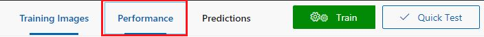

7. **Click** on 'Publish' button.


8. **Select** 'Model name' and 'Prediction resource' on 'Publish Model' popup and **click** on 'Publish' button.

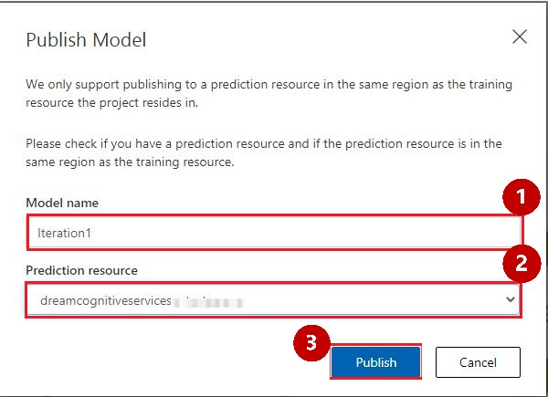

9. **Click** on the 'Eye' button.


10. **Repeat** steps 4 to 8 for all the projects.

### Task 9: Uploading new incident reports

1. **Open** Azure Synapse in a new tab using the following link: https://web.azuresynapse.net/.
2. **Log in** with your Azure credentials.
3. **Select** the 'Subscription' and Synapse 'Workspace name' that got created in [Task 3](#task-3-deploy-the-arm-template). The Synapse 'Workspace name' will start with 'manufacturingdemo'.
4. **Click** 'Continue'.

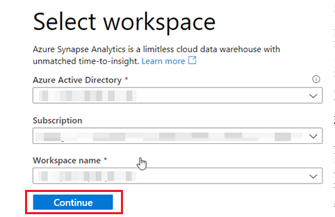


5. **Click** the 'Data' hub from the left navigation in the Synapse Analytics workspace.
6. **Click** 'Linked' tab.
7. **Expand** the storage account / Azure Data Lake Storage Gen2.
8. **Expand** the node that starts with 'manufacturingdemo'.
9. **Click** 'incidentreport' container.


10. **Click** the 'Upload' button in Azure Synapse Analytics Studio to upload the file from your local system.


11. **Download** incident report by clicking following url: https://dreamdemostrggen2r16gxwb.blob.core.windows.net/publicassets/212045001.pdf 
12. **Select** the '212045001.pdf' file or any incident report of same format from your local system.

> **Note:** Filename and incident id should be same.

13. **Check** the checkbox for overwriting existing files.
14. **Click** on 'Upload' button.

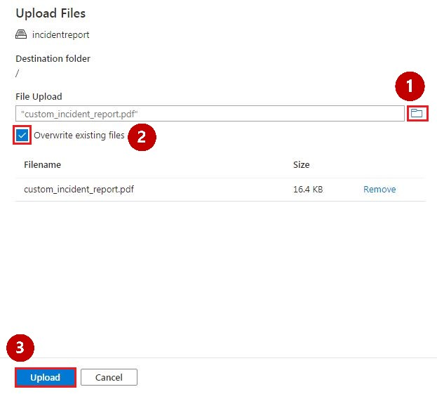

15. **Click** on the document that got uploaded.
16. **Click** on More.
17. **Click** on Properties.


18. **Confirm** that the Content type of document is application/pdf. If not paste 'application/pdf' in the 'Content Type' of document.
19. **Click** on 'Apply'.

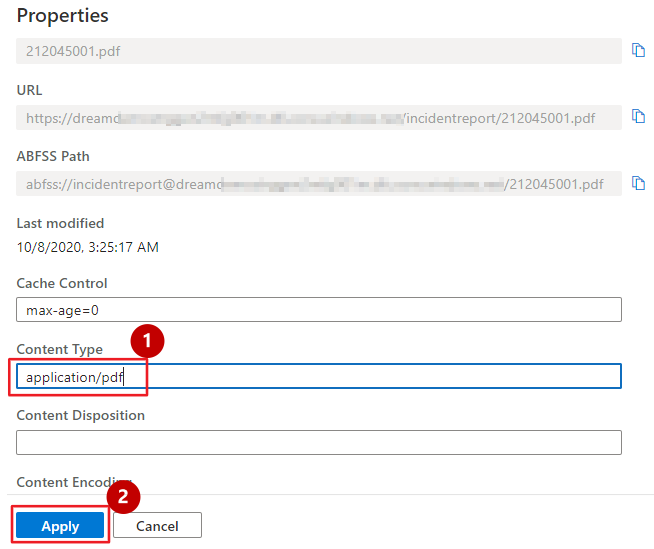

### Task 10: Pause-Resume resources

> **Note:** Please perform these steps after your demo is done and you do not need the environment anymore. Also ensure you Resume the environment before demo if you paused it once. 

1. **Open** the Azure Portal. 

2. **Click** on the Azure Cloud Shell icon from the top toolbar.


Execute the ```Pause_Resume_script.ps1``` script by executing the following command:

1. **Run** Command: ```cd 'MfgAI/Manufacturing/automation'```

2. Then **run** the PowerShell script: ```./Pause_Resume_script.ps1```

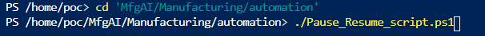

3. From the Azure Cloud Shell, **copy** the authentication code. 

4. **Click** on the link https://microsoft.com/devicelogin and a new browser window will launch.

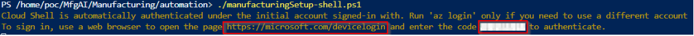

5. **Paste** the authentication code.  


6. **Select** the same user that you used for signing into the Azure Portal in [Task 1](#task-1-create-a-resource-group-in-azure).

7. **Close** this window after it displays successful authentication message.


8. You will be prompted for one more device authentication.

9. Follow steps 3 to 6 again for the new authentication.


10. When prompted, **enter** the resource group name to be deleted in the Azure Cloud Shell. **Type** the same resource group name that you created.


11. **Enter** your choice when prompted. **Enter** 'P' for pausing the environment or 'R' for resuming a paused environment.

12. Wait for script to finish execution.

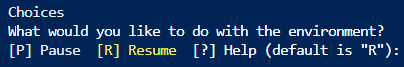

### Task 11: Clean up resources

> **Note:** Perform these steps after your demo is done and you do not need the resources anymore.


**Open** the Azure Portal.

1. **Open** the Azure Cloud Shell by clicking its icon from the top toolbar.


**Execute** the 'resourceCleanup.ps1' script by executing the following commands:

2. **Run** Command:

   ```PowerShell
   cd 'MfgAI/Manufacturing/automation'
   ```
	
3. Then **run** the PowerShell script: 
	
   ```PowerShell
   ./resourceCleanup.ps1
   ```
	
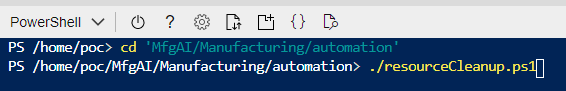

4. You will now be prompted to **enter** the resource group name to be deleted in the Azure Cloud Shell. **Type** the same resource group name that you created in [Task 1](#task-1-create-a-resource-group-in-azure) - 'Synapse-WWI-Lab'.


5. Wait for execution to complete.

6. Navigate to Power BI Workspace.

7. **Click** on Workspaces.

8. **Click** on options of the workspace you created in task #2

9. **Click** on Workspace settings.


10. **Click** on Delete Workspace.

11. **Click** on Delete button in popup.


