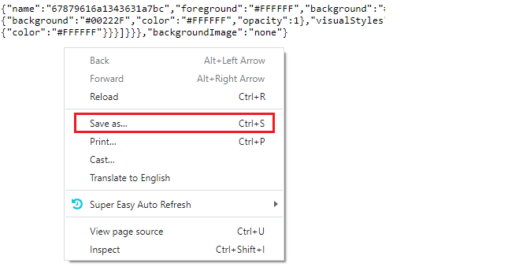
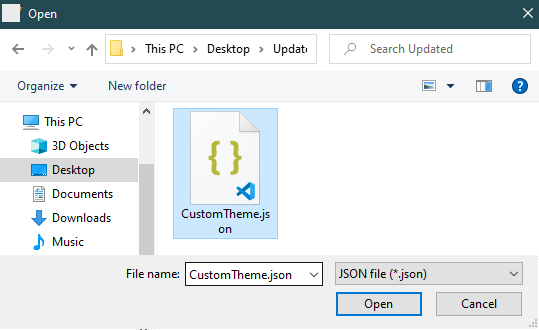
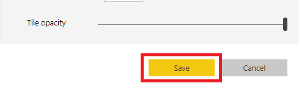
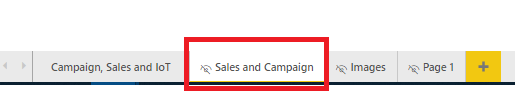
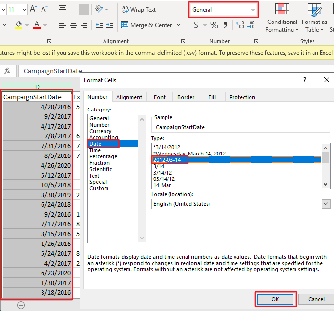
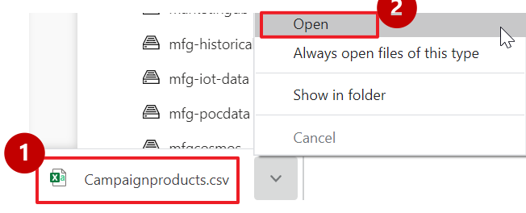
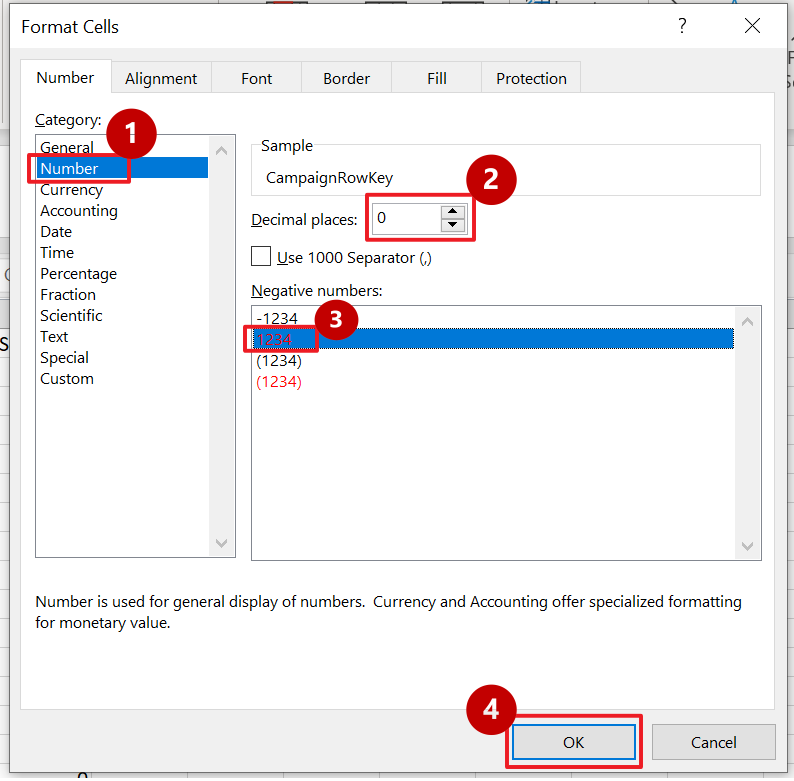

# Azure Synapse Manufacturing Setup Guide


**Contents**

<!-- TOC -->

- [Azure Synapse Analytics WWI setup guide](#azure-synapse-analytics-wwi-setup-guide)
  - [Requirements](#requirements)
  - [Before Starting](#before-starting)
    - [Task 1: Create a resource group in Azure](#task-1-create-a-resource-group-in-azure)
    - [Task 2: Power BI workspace creation](#task-2-power-bi-workspace-creation)
    - [Task 3: Deploy the ARM Template](#task-3-deploy-the-arm-template)
    - [Task 4: Run the Cloud Shell](#task-4-run-the-cloud-shell)
    - [Task 5: Power BI Dashboard creation ](#task-5-power-bi-dashboard-creation)
    - [Task 6: Working with Power BI to create real-time reports](#task-6-working-with-power-bi-to-create-real-time-reports)
    - [Task 7: Steps to update CSVs in order to change Campaign, Hashtags and Product category category](#task-7-steps-to-update-csvs-in-order-to-change-campaign-product-and-hashtags-category)
    
<!-- /TOC -->

## Requirements

1. An Azure Account with the ability to create an Azure Synapse Workspace.
2. A Power BI Pro or Premium account to host Power BI reports.
3. Please note that you can run only one deployment at a given point of time and need to wait for the completion. You should not run multiple deployments in parallel as that will cause deployment failures.
4. Please ensure selection of correct region where desired Azure Services are available. In case certain services are not available, deployment may fail. [Azure Services Global Availability](https://azure.microsoft.com/en-us/global-infrastructure/services/?products=all) for understanding target services availablity.
5. Do not use any special characters or uppercase letters in the environment code.
6. Please ensure that you select the correct resource group name. We have given a sample name which  may need to be changed should any resource group with the same name already exist in your subscription.

> **Note:** Please log in to Azure and Power BI using the same credentials.

## Before starting

### Task 1: Create a resource group in Azure

1. **Log into** the [Azure Portal](https://portal.azure.com) using your Azure credentials.

2. On the Azure Portal home screen, **select** the '+ Create a resource' tile.

    

3. In the **Search the Marketplace** text box, type 'Resource Group' and **press** the Enter key.

    

4. **Select** the 'create' button on the 'Resource Group' overview page.

	
	
5. On the 'Create a resource group' screen, **select** your desired Subscription. For Resource group, **type** 'Synapse-WWI-Lab'. **Select** your desired Region. **Click** the 'Review + Create' button.

    

6. **Click** the 'Create' button once all entries have been validated.

    

### Task 2: Power BI Workspace creation

1. **Open** Power BI Services in a new tab using the following link:  https://app.powerbi.com/

2. **Sign in**, to your Power BI account using Power BI Pro account.

> **Note:** Please use the same credentials for Power BI which you will be using for Azure Account.


3. **Click** on 'Workspaces'.

4. Then **click** on the 'Create a workspace' tab.

> **Note:** Please create a Workspace by the name 'Engagement Accelerators – Manufacturing'.


5. **Copy** the Workspace GUID or ID. You can get this by browsing to https://app.powerbi.com/, selecting the workspace, and then copying the GUID from the address URL and paste it in a notepad for future reference.
> **Note:** This workspace ID will be used during ARM template deployment.


### Task 3: Deploy the ARM Template

1. **Right-click** on the 'Deploy to Azure' button given below and open the link in a new tab to **deploy** the Azure resources that you created in [Task 1](#task-1-create-a-resource-group-in-azure) with an Azure ARM Template.

    <a href='https://portal.azure.com/#create/Microsoft.Template/uri/https%3A%2F%2Fraw.githubusercontent.com%2Fmicrosoft%2FAzure-Analytics-and-AI-Engagement%2Freal-time%2FManufacturing%2Fautomation%2FmainTemplate-shell.json' target='_blank'></a>

2. On the Custom deployment form, **select** your desired Subscription.
3. **Type** the resource group name 'Synapse-WWI-Lab' created in [Task 1](#task-1-create-a-resource-group-in-azure).
4. **Select** Region where you want to deploy.
5. **Provide** environment code which is a unique suffix to your environment without any special characters. e.g. 'demo'.
6. **Provide** a strong SQL Administrator Login Password and set this aside for later use.
7. **Enter** the Power BI Workspace ID created in [Task 2](#task-2-power-bi-workspace-creation) in the 'Pbi_workspace_id' field.
8. **Select** Location from the dropdown. Please ensure that this is the same location you selected in Step #4 above.
9. **Click** 'Review + Create' button.
> **NOTE** The provisioning of your deployment resources will take approximately 10-15 minutes.

   

10. **Click** the 'Create' button once the template has been validated.

   

11. **Stay** on the same page and wait for the deployment to complete.
    
    
    
12. **Click** 'Go to resource group' button once your deployment is complete.

    
    
### Task 4: Run the Cloud Shell 

1. **Stay** in Azure Portal and **open** the Azure Cloud Shell by selecting its icon from the top toolbar.

    

    > **Note**: If you are prompted to choose a shell, **select** PowerShell, and if asked to **create** a 'storage account' for the Azure Cloud Shell, agree to have it created.
    
    

2. In the Azure Cloud Shell window, **enter** the following command to clone the repository files.

    ```PowerShell
    git clone -b real-time https://github.com/microsoft/Azure-Analytics-and-AI-Engagement.git MfgAI
    ```
    
    
    
    > **Note**: When executing the script below, it is important to let the scripts run to completion. Some tasks may take longer than others to run. When a script completes     execution, you will be returned to PowerShell prompt. The total runtime of all steps in this task will take approximately 15 minutes.

3. Execute the `manufacturingSetup-shell.ps1` script by executing the following commands:

    ```PowerShell
    cd 'MfgAI/Manufacturing/automation'
    ./manufacturingSetup-shell.ps1
    ```
  
     
  
4. From the Azure Cloud Shell window, **copy** the Authentication Code and **copy** link shown (https://microsoft.com/devicelogin). Open this link in new tab in your browser. **Paste** the code the you copied earlier on the browser screen and **press** 'Enter'.

     

     

5. **Select** the same user to authenticate which you used for signing in to the Azure Portal in [Task 1](#task-1-create-a-resource-group-in-azure).

     

6. **Close** the browser tab once you see the below message window and **go back** to your 'Azure Cloud Shell' execution window.

     
     
7. You will get another code to authenticate Azure PowerShell script for creating reports in Power BI. **Copy** the code and **copy** the link provided in the shell (https://microsoft.com/devicelogin). Open this link in your browser. **Enter** the code the you copied from the shell and press Enter.

     

     

8. Again **select** the same user to authenticate which you used for signing in to the Azure Portal in [Task 1](#task-1-create-a-resource-group-in-azure).

     

9. **Close** the browser tab once you see the below message window and **go back** to your Azure Cloud Shell execution window.

     
     
10. While you are waiting for processes to get completed in Azure Cloud Shell window, you'll be asked for entering code thrice (Please see Step #4 above). This is necessary for performing installation of various Azure Services and preloading content in Synapse SQL Pool tables.

> **Note**: You may be prompted to choose a subscription after the above mentioned step in case you have multiple subscriptions associated with your account. 

11. You will now be prompted to enter the resource group name in the Azure Cloud Shell window. Enter the name of the resource group that you created in [Task 1](#task-1-create-a-resource-group-in-azure) above (Synapse-WWI-Lab).

     

12. You will be asked for Security code once again, as was in Step #4 above. Please follow the same procedure as done in Step #4.

     

     

13. Once again, **select** the same user to authenticate which you used for signing in to the Azure Portal in [Task 1](#task-1-create-a-resource-group-in-azure).

     

14. **Close** the browser tab once you see the below message window and go back to your Azure Cloud Shell execution window.

     
    
 > **Note**: Make sure to provide the device code before it expires and let the script run till completion.

### Task 5: Power BI Dashboard creation

1. **Open** Power BI Services in a new tab using following link https://app.powerbi.com/

2. **Sign in** to Power BI account using 'Power BI Pro account'.

> **Note**: Please use the same credentials for Power BI that you used for '[Deploy the ARM Template](#task-3-deploy-the-arm-template)' deployment.


3. **Select** the Workspace 'Engagement Accelerators – Manufacturing'.


4. Assuming [Task 4](#task-4-run-the-cloud-shell) got completed successfully and the template has been deployed, you will be able to see a set of reports in the reports tab of Power BI, real-time datasets in dataset tab.
The image below shows the 'Reports' tab in Power BI. We can then create a Power BI dashboard by pinning visuals from these reports.

> **Note:** A Dashboard is a collection of tiles/visualization which are pinned from different reports to a single page.


**To give permissions for the Power BI reports to access the datasources:**

5. **Click** the 'Settings' icon on top right-side corner.

6. **Click** 'Settings'.


7. **Click** 'Datasets' tab.


8. **Click** 'Campaign – Option C' Report.

9. **Expand** Data source credentials.

10. **Click** Edit credentials.


11. **Enter** Username as 'ManufacturingUser'.

12. **Enter** the same password which was used for Azure deployment in Step #6 [Task 3](#task-3-deploy-the-arm-template).

13. **Click** Sign in.


**Follow these steps to create the Power BI dashboard:**

14. **Select** the workspace 'Engagement Accelerators - Manufacturing'.


15. **Click** on '+Create' button on the top navigation bar.

16. **Click** the 'Dashboard' option from the drop-down menu.


17. **Name** the dashboard 'Engagement Accelerators Dashboard' and **click** 'create'.

18. This new dashboard will appear in the 'Dashboard' section (of the Power BI workspace).


**Follow the below steps to change the dashboard theme:**

19. **Open** the URL in new browser tab to get JSON code for a custom theme: https://raw.githubusercontent.com/microsoft/Azure-Analytics-and-AI-Engagement/real-time/Manufacturing/automation/artifacts/theme/CustomTheme.json

20. **Right click** anywhere in browser and **click** 'Save as...'.



21. **Save** the file to your desired location on your computer with name unchanged.


22. **Go back** to the Power BI Dashboard you just created.

23. **Click** on ellipses at the top right-side corner.

24. **Click** on Dashboard theme.


25. **Click** Upload the JSON theme.


26. **Navigate** to the location where you have saved the JSON theme in Step #21 above file and **Select** open.




27. Click **Save**.



**Do the following to pin visuals to the dashboard you just created:**

28. **Click** on the 'Reports' tab.


29. In the 'Reports' tab, there will be a list of all the published reports.

30. **Click** on 'Campaign - Option C' report.


31. On the 'Campaign – Option C' report page, **click** the 'Revenue Vs Target' visual and **click** the pin icon.


32. **Select** 'Existing dashboard' radio button.

33. **From** 'Select existing dashboard' dropdown, **select** 'Engagement Accelerators Dashboard'.

34. **Click** 'Pin'.


35. Similarly, **pin** 'Profit card' and 'Scatter Chart' from the report.

**Some of the visuals are pinned from hidden pages so in order to pin such visuals, follow the below steps.**

36. **Click** on Edit report.


37. **Click** 'Sales and Campaign' report page.



38. **Pin** 'Total Campaign', 'Cost of Goods Sold' card visuals.

39. **Pin** 'Revenue by country' map visual.


40. **Open** 'Dashboard Images' report.

	

41. **Pin** all images from above report to the 'Engagement Accelerators Dashboard' in the same way you pinned the report visuals.

42. **Go back** to the Dashboard.

43. For all images tiles **click** on 'More Options'.

44. **Click** 'Edit details'.


45. **Disable** 'Display title and subtitle'.

46. **Click** 'Apply'.


47. **Repeat** for all images tiles.

48. After disabling 'Display title and subtitle' for all images, resize and re-arrange top images tiles or chicklets as show in the screenshot.

49. **Resize** and **rearrange** left images tiles or chicklets as show in the screenshot. **Resize** KPI Tile to 1x2 size. **Resize** Deep Dive tile to 1x4 size.


50. To **pin** any image on the dashboard, **select** the report 'Dashboard Images' which has images on it from the reports section.


51. In the 'Dashboard Images' report, **select** any image and then **click** on the pin icon.


52. **Select** 'Existing Dashboard' radio button and select the 'Engagement Accelerators' dashboard.

53. **Click** on Pin.


54. The image will be pinned and visible on the dashboard.

55. Similarly, more images can be pinned to this dashboard by repeating this process.

56. To view the pinned visuals, **click** on the 'Dashboards' section.

57. **Select** 'Engagement Accelerators Dashboard'. This will launch the dashboard, and you can view the pinned visuals on it.


58. **Refer** the screenshot of the sample dashboard below and pin the visuals to replicate the following look and feel.


59. Follow the same procedure to pin the 'Predictive maintenance and Safety Analytics' pillar tiles to the dashboard using the 'anomaly detection with images' report. See steps #29 to #35 above.


60. We can achieve the look of the dashboard below by pining visuals and images from different reports to the same dashboard (you can also tweak with different elements such as backgrounds and themes).


> **Note:** Real-time reports will not be deployed as part of the ARM Template deployment. For that we need to create real-time reports [(See Task 6)](#task-6-working-with-power-bi-to-create-real-time-reports).


### Task 6: Working with Power BI to create real-time reports

'Racing Cars' and 'Milling canning' datasets will be automatically created when Azure Stream Analytics jobs start sending data into Power BI services.
 Once the Dataset has been created in the Power BI workspace, (by Azure Cloud Shell commands executed in [Task 3](#task-3-deploy-the-arm-template) above) follow the next steps to create the Power BI report 'Racing Cars- A'.

1. **Click** on '+Create' button present on the top navigation bar.

2. **Select** 'Report' option from the drop-down menu.


3. **Enter** 'Racing' in the search bar.

4. **Select** the 'Racing Cars' dataset.


5. **Select** the Card icon from Visualization tray to **create** the 'Active Sensors' visualization which is the 'Average' of 'Active Sensors'.


6. **Select** the 'ActiveSensors' field from 'race-cars' Dataset.

7. **Select** drop-down next to 'ActiveSensors'.

8. **Select** 'Average' from the drop-down to get the average of 'ActiveSensors'.


9. With Card visual selected, **select** the format tab.

10. **Turn on** the Title.

11. **Enter** 'Active Sensors' as the title for the card.


12. **Turn on** Background and change the background color of the card.

Similarly, the color of the KPI value and title value can be changed from the Data label and Title sections respectively. You can use the Hex code #00222F to achieve the background color of the visual.


All other visuals of the report can be created by following a similar process. By following the same process for the 'milling canning' Dataset we can create the following real-time reports
- Milling Canning report
- Maintenance and Cost Analytics
- Miami Racing Cars
 
Once these real-time reports are ready we can pin them to the dashboard (by following the procedure explained in [Task 5](#task-5-power-bi-dashboard-creation)) to finally achieve the following look and feel.

  

### Task 7: Steps to update CSVs in order to change Campaign, Hashtags and Product category

1. **Open** Azure Synapse in a new tab using the following link: <https://web.azuresynapse.net/>
2. Log in with your Azure credentials.

 	

3.  **Click** the 'Data' hub from the left navigation in the 'Synapse Analytics' workspace.
4.  **Click** 'Linked' tab.
5.  **Expand** 'Azure Data Lake Storage Gen2'.
6.  **Expand** the node that starts with 'manufacturingdemo'. Kindly see image below after Step 8.
7.  **Click** 'customcsv' container.
8.  **Double Click** 'Manufacturing B2C Scenario Dataset'.

 	

9.  **Select** 'CampaignData.csv'.
10.  **Click** 'Download' button on the top toolbar in Azure Synapse Analytics Studio. File will get downloaded in your system locally.

        

11.  **Open** the downloaded file. Assuming Microsoft Excel is installed, the file should get opened in the same. In case file does not get opened in Microsoft Excel, kindly **navigate** to the folder where file got downloaded and **right click** on the file name. **Click** 'Open With...' and then **click** 'Excel'.

        

12. **Select** 'CampaignName' column (Column B of Excel) and press 'CTRL + H' to replace exisitng campaign name with new campaign name.
13. **Replace** 'Spring into Summer' (old campaign name) with 'Summer Fashion' (new campaign name).
14. **Click** 'Replace All'.
15. **Pop up** will be displayed with all done replacement message.
16. **Click** OK.

 	

**As Excel changes data type of columns to string, please be careful with format of any Date column. This may also depend on your Regional Settings Date and Time Format.**
 
17. **Select** 'CampaignStartDate' column.
18. **Click** on 'format cells'.
19. **Select** 'Category' as 'Date'.
20. **Select** the format "yyyy-mm-dd".
21. **Click** 'OK'.

 	

22. **Save** the file by pressing the highlighted button. **Close** the file.

 	

23. **Go back** to your browser window where 'Azure Synapse Analytics' is already open. In case it's not open, kindly follow steps 1 to 8 mentioned above. Once you have followed the steps, **click** 'Upload' button in 'Azure Synapse Analytics Studio' to upload the file from your local system.

 	

24. **Select** 'CampaignData.csv' file that you updated above till Step 22.
25. **Click** the checkbox for overwriting existing files.
26. **Click** 'Upload'.

	

**Now let's change the 'Category' in Product.csv file:**

27. **Go back** to your browser window where 'Azure Synapse Analytics' is already open. In case it's not open, kindly follow steps 1 to 8 mentioned above.
28.  **Select** 'Product.csv'.
29.  **Click** 'Download' button on the top toolbar in Azure Synapse Analytics Studio. File will get downloaded in your system locally.

        

30.  **Open** the downloaded file. Assuming Microsoft Excel is installed, the file should get opened in the same. In case file does not get opened in Microsoft Excel, kindly **navigate** to the folder where file got downloaded and **right click** on the file name. **Click** 'Open With...' and then **click** 'Excel'.

        

31. **Select** 'Category' column (Column G of Excel) and press 'CTRL + H' to replace exisitng campaign name with new campaign name.
32. **Replace** 'Hats' (old category name) with 'Gift Cards' (new category name).
33. **Click** 'Replace All'.
34. **Pop up** will be displayed with all done replacement message.
35. **Click** OK.

	

36. **Save** the file by pressing the highlighted button. **Close** the file.
 
	
 
37. **Go back** to your browser window where 'Azure Synapse Analytics' is already open. In case it's not open, kindly follow steps 1 to 8 mentioned above. Once you have followed the steps, **click** 'Upload' button in 'Azure Synapse Analytics Studio' to upload the file from your local system.

		

38. **Select** 'Product.csv' file that you updated above till Step 37.
39. **Click** the checkbox for overwriting existing files.
40. **Click** 'Upload'.

	

**Now, let's change 'Hashtags':**

41. **Go back** to your browser window where 'Azure Synapse Analytics' is already open. In case it's not open, kindly follow steps 1 to 8 mentioned above.
42.  **Select** 'Campaignproducts.csv'.
43.  **Click** 'Download' button on the top toolbar in Azure Synapse Analytics Studio. File will get downloaded in your system locally.

        

44.  **Open** the downloaded file. Assuming Microsoft Excel is installed, the file should get opened in the same. In case file does not get opened in Microsoft Excel, kindly **navigate** to the folder where file got downloaded and **right click** on the file name. **Click** 'Open With...' and then **click** 'Excel'.

        
 
45. **Select** 'Hashtag' column (Column C of Excel) and press 'CTRL + H' to replace exisitng campaign name with new campaign name.
46. **Replace** '\#welcomespring' (old Hashtag) with '\#welcomesummer' (new Hashtag).
47. **Click** 'Replace All'.
48. **Pop up** will be displayed with all done replacement message.
49. **Click** OK.

 	

**In this file, data type of 'CampaignRowKey' will change to 'string' format. Please change the data type of column 'CampiagnRowkey' from string to number format.**
 
50. **Select** 'CampaignRowKey' column (Column F of Excel).
51. **Click** 'More Number Formats' from the format dropdown.

 	

52. **Click** 'Number' format.
53. **Select** '0' as 'Decimal places'.
54. **Select** '1234' as 'Negative numbers' format.
55. **Click** 'OK'.

 	

56. **Save** the file by pressing the highlighted button. **Close** the file.

 	

57. **Go back** to your browser window where 'Azure Synapse Analytics' is already open. In case it's not open, kindly follow steps 1 to 8 mentioned above. Once you have followed the steps, **click** 'Upload' button in 'Azure Synapse Analytics Studio' to upload the file from your local system.
58. **Select** 'Campaignproducts.csv' file that you updated above till Step 57.
59. **Click** the checkbox for overwriting existing files.
60. **Click** 'Upload'.

 	  

**Now let's update the dataset with this new data:**
 
61. **Navigate** to 'Orchestrate' hub from the left navigation.
62. **Expand** 'Pipelines' node.
63. **Click** on '1 Master Pipeline'.
64. **Click** 'Add trigger'.
65. **Click** 'Trigger now'.

 	

66. **Navigate** to 'Monitor' hub from the left navigation.
67. **Click** 'Pipeline runs'.

 	

68. **Observe** '1 Master Pipeline'.

 	

**Note:** Monitor the 'Master Pipeline' run and see what happens when the execution gets completed.

**Finally, let's see the changes propogated into dataset reflected in Power BI:**
 
69. **Navigate** to 'Develop' hub from the left navigation.
70. **Expand** 'Power BI'.
71. **Expand** Power BI Workspace starting with name 'Engagement Accelerators'.
72. **Expand** 'Power BI reports'.
73. **Click** on 'Campaign - Option C' Power BI report.

 		

74. 'Campaign Name' should have one of the updated campaign name as **'Summer Fashion'**.
75. 'Product Category' should have one of the updated category as **'Gift Cards'**.
76. 'Hashtag' should have one of the updated Hashtag as **'\#welcomesummer'**.

 	
