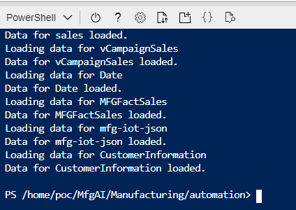
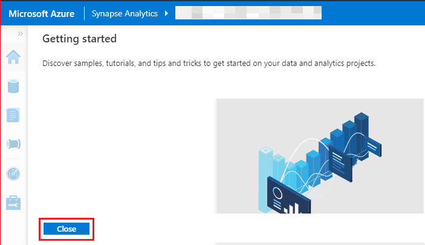

# Azure Synapse Manufacturing Setup Guide


**Contents**

<!-- TOC -->

- [Azure Synapse Analytics Wide World Importers setup guide](#azure-synapse-analytics-wwi-setup-guide)
  - [Requirements](#requirements)
  - [Before Starting](#before-starting)
    - [Task 1: Create a resource group in Azure](#task-1-create-a-resource-group-in-azure)
    - [Task 2: Power BI workspace creation](#task-2-power-bi-workspace-creation)
    - [Task 3: Deploy the ARM Template](#task-3-deploy-the-arm-template)
    - [Task 4: Run the Cloud Shell to provision the demo resources](#task-4-run-the-cloud-shell-to-provision-the-demo-resources)
    - [Task 5: Power BI Dashboard creation ](#task-5-power-bi-dashboard-creation)
    - [Task 6: Working with Power BI to create real-time reports](#task-6-working-with-power-bi-to-create-real-time-reports)
    - [Task 7: Modify the CSV to change campaign names, product categories, and hashtags](#task-7-modify-the-csv-to-change-campaign-names-product-categories-and-hashtags)
    
<!-- /TOC -->

## Requirements

* An Azure Account with the ability to create an Azure Synapse Workspace.
* A Power BI Pro or Premium account to host Power BI reports.
* Please note that you can run only one deployment at a given point of time and need to wait for the completion. You should not run multiple deployments in parallel as that will cause deployment failures.
* Please ensure selection of correct region where desired Azure Services are available. In case certain services are not available, deployment may fail. [Azure Services Global Availability](https://azure.microsoft.com/en-us/global-infrastructure/services/?products=all) for understanding target services availablity.
* Do not use any special characters or uppercase letters in the environment code.
* Please ensure that you select the correct resource group name. We have given a sample name which  may need to be changed should any resource group with the same name already exist in your subscription.

> **Note:** Please log in to Azure and Power BI using the same credentials.

## Before starting

### Task 1: Create a resource group in Azure

1. **Log into** the [Azure Portal](https://portal.azure.com) using your Azure credentials.

2. On the Azure Portal home screen, **select** the '+ Create a resource' tile.

    

3. In the **Search the Marketplace** text box, type 'Resource Group' and **press** the Enter key.

    

4. **Select** the 'create' button on the 'Resource Group' overview page.

	
	
5. On the 'Create a resource group' screen, **select** your desired Subscription. For Resource group, **type** 'Synapse-WWI-Lab'. **Select** your desired Region. **Click** the 'Review + Create' button.

    

6. **Click** the 'Create' button once all entries have been validated.

    

### Task 2: Power BI Workspace creation

1. **Open** Power BI Services in a new tab using the following link:  https://app.powerbi.com/

2. **Sign in**, to your Power BI account using Power BI Pro account.

> **Note:** Please use the same credentials for Power BI which you will be using for Azure Account.


3. **Click** on 'Workspaces'.

4. Then **click** on the 'Create a workspace' tab.


5. **Enter** the 'Workspace name' and 'Description' and **click** 'Save'.


> **Note:** Please create a Workspace by the name 'Engagement Accelerators – Manufacturing'.

6. **Copy** the Workspace GUID or ID. You can get this by browsing to https://app.powerbi.com/, selecting the workspace, and then copying the GUID from the address URL and paste it in a notepad for future reference.
> **Note:** This workspace ID will be used during ARM template deployment.


### Task 3: Deploy the ARM Template

1. **Right-click** on the 'Deploy to Azure' button given below and open the link in a new tab to **deploy** the Azure resources that you created in [Task 1](#task-1-create-a-resource-group-in-azure) with an Azure ARM Template.

    <a href='https://portal.azure.com/#create/Microsoft.Template/uri/https%3A%2F%2Fraw.githubusercontent.com%2Fmicrosoft%2FAzure-Analytics-and-AI-Engagement%2Freal-time%2FManufacturing%2Fautomation%2FmainTemplate-shell.json' target='_blank'></a>

2. On the Custom deployment form, **select** your desired Subscription.
3. **Type** the resource group name 'Synapse-WWI-Lab' created in [Task 1](#task-1-create-a-resource-group-in-azure).
4. **Select** Region where you want to deploy.
5. **Provide** environment code which is a unique suffix to your environment without any special characters. e.g. 'demo'.
6. **Provide** a strong SQL Administrator Login Password and set this aside for later use.
7. **Enter** the Power BI Workspace ID, created in [Task 2](#task-2-power-bi-workspace-creation), in the 'Pbi_workspace_id' field.
8. **Select** Location from the dropdown. Please ensure that this is the same location you selected in Step #4 above.
9. **Click** 'Review + Create' button.

   

10. **Click** the 'Create' button once the template has been validated.

   

> **NOTE:** The provisioning of your deployment resources will take approximately 10-15 minutes.

11. **Stay** on the same page and wait for the deployment to complete.
    
    
    
12. **Click** 'Go to resource group' button once your deployment is complete.

    
    
### Task 4: Run the Cloud Shell to provision the demo resources 

1. **Stay** in Azure Portal and **open** the Azure Cloud Shell by selecting its icon from the top toolbar.

    

2. **Click** on 'Show advanced settings'. 

	
	
> **Note:** If you already have a storage mounted for Cloud Shell, you will not get this prompt. In that case, skip step 2 and 3.

3. **Select** your 'Resource Group' and **enter** the 'Storage account' and 'File share' name.

	

> **Note:** If you are creating a new storage account, give it a unique name with no special characters or uppercase letters.

4. In the Azure Cloud Shell window, **enter** the following command to clone the repository files.

    ```PowerShell
    git clone -b real-time https://github.com/microsoft/Azure-Analytics-and-AI-Engagement.git MfgAI
    ```
    
    
    
    > **Note:** If you get File “MfgAI” already exist error, please execute following command: rm MfgAI -r -f to delete existing clone.
    
    > **Note**: When executing the script below, it is important to let the scripts run to completion. Some tasks may take longer than others to run. When a script completes     execution, you will be returned to PowerShell prompt. The total runtime of all steps in this task will take approximately 15 minutes.

5. Execute the `manufacturingSetup-shell.ps1` script by executing the following commands:

    ```PowerShell
    cd 'MfgAI/Manufacturing/automation'
    ./manufacturingSetup-shell.ps1
    ```
  
     
  
6. From the Azure Cloud Shell window, **copy** the Authentication Code and **copy** link shown (https://microsoft.com/devicelogin). 
7. **Open** this link in a new tab in your browser. 

     
     
8. **Paste** the code the you copied earlier on the browser screen and **press** 'Enter'.

     

9. **Select** the same user to authenticate which you used for signing in to the Azure Portal in [Task 1](#task-1-create-a-resource-group-in-azure).

     

10. **Close** the browser tab once you see the below message window and **go back** to your 'Azure Cloud Shell' execution window.

     
     
11. You will get another code to authenticate Azure PowerShell script for creating reports in Power BI. 
12. **Copy** the code and **copy** the link provided in the shell (https://microsoft.com/devicelogin). **Open** this link in your browser. 

     

13. **Enter** the code the you copied from the shell and press Enter.
 
     

14. Again **select** the same user to authenticate which you used for signing in to the Azure Portal in [Task 1](#task-1-create-a-resource-group-in-azure).

     

15. **Close** the browser tab once you see the below message window and **go back** to your Azure Cloud Shell execution window.

     
   
> **Note:** While you are waiting for processes to get completed in Azure Cloud Shell window, you'll be asked for entering code thrice (Please see Step #6 above). This is necessary for performing installation of various Azure Services and preloading content in Synapse SQL Pool tables.

> **Note**: You may be prompted to choose a subscription after the above mentioned step in case you have multiple subscriptions associated with your account. 

16. You will now be prompted to enter the resource group name in the Azure Cloud Shell window. Enter the name of the resource group that you created in [Task 1](#task-1-create-a-resource-group-in-azure) above (Synapse-WWI-Lab).

     

17. You will be asked for Security code once again, as was in Step #6 to #8 above. Please follow the same procedure as done in Step #6 to #8.

     

     

18. Once again, **select** the same user to authenticate which you used for signing in to the Azure Portal in [Task 1](#task-1-create-a-resource-group-in-azure).

     

19. **Close** the browser tab once you see the below message window and go back to your Azure Cloud Shell execution window.

     
    
 > **Note**: Make sure to provide the device code before it expires and let the script run till completion.
 
20. **Wait** for the script execution to complete. You will see a similar screen as shown below:
 
     
     
     > **Note:** The deployment will take approximately 30-35 minutes to complete

### Task 5: Power BI Dashboard creation

1. **Open** Power BI Services in a new tab using following link https://app.powerbi.com/

2. **Sign in** to Power BI account using 'Power BI Pro account'.

> **Note**: Please use the same credentials for Power BI that you used for '[Deploy the ARM Template](#task-3-deploy-the-arm-template)' deployment.


3. **Select** the Workspace 'Engagement Accelerators – Manufacturing'.


Assuming [Task 4](#task-4-run-the-cloud-shell-to-provision-the-demo-resources) got completed successfully and the template has been deployed, you will be able to see a set of reports in the reports tab of Power BI, real-time datasets in dataset tab.
The image below shows the 'Reports' tab in Power BI. We can then create a Power BI dashboard by pinning visuals from these reports.

> **Note:** A Dashboard is a collection of tiles/visualization which are pinned from different reports to a single page.


**To give permissions for the Power BI reports to access the datasources:**

4. **Click** the 'Settings' icon on top right-side corner.

5. **Click** 'Settings' from the expanded list.


6. **Click** 'Datasets' tab.


7. **Click** 'Campaign – Option C' Report.

8. **Expand** Data source credentials.

9. **Click** Edit credentials and a 'Configure Campaign - Option C' dialogue box will pop up.


10. **Enter** Username as 'ManufacturingUser'.

11. **Enter** the same SQL Administrator login password that was created for [Task 3](#task-3-deploy-the-arm-template) Step #6.

12. **Click** Sign in.


**Follow these steps to create the Power BI dashboard:**

13. **Select** the workspace 'Engagement Accelerators - Manufacturing'.


14. **Click** on '+Create' button on the top navigation bar.

15. **Click** the 'Dashboard' option from the drop-down menu.


16. **Name** the dashboard 'Engagement Accelerators Dashboard' and **click** 'create'.

17. This new dashboard will appear in the 'Dashboard' section of the Power BI workspace.


**Follow the below steps to change the dashboard theme:**

18. **Open** the URL in new browser tab to get JSON code for a custom theme: https://raw.githubusercontent.com/microsoft/Azure-Analytics-and-AI-Engagement/real-time/Manufacturing/automation/artifacts/theme/CustomTheme.json

19. **Right click** anywhere in browser and **click** 'Save as...'.


20. **Save** the file to your desired location on your computer, leaving the name unchanged.


21. **Go back** to the Power BI Dashboard you just created.

22. **Click** on ellipses at the top right-side corner.

23. **Click** on Dashboard theme.


24. **Click** Upload the JSON theme.

25. **Navigate** to the location where you have saved the JSON theme file in Step #21 above and **Select** open.

26. Click **Save**.


**Do the following to pin visuals to the dashboard you just created:**

27. **Select** the workspace 'Engagement Accelerators - Manufacturing'.


28. **Click** on the 'Reports' section/tab.


29. In the 'Reports' section, there will be a list of all the published reports.

30. **Click** on 'Campaign - Option C' report.


31. On the 'Campaign – Option C' report page, **click** the 'Revenue Vs Target' visual and **click** the pin icon.


32. **Select** 'Existing dashboard' radio button.

33. **From** 'Select existing dashboard' dropdown, **select** 'Engagement Accelerators Dashboard'.

34. **Click** 'Pin'.


35. Similarly, **pin** 'Profit card' and 'Investment, Incremental Revenue and ROI Campaign Scatter Chart' from the report.


**Some of the visuals are pinned from hidden pages. To pin such visuals, follow the below steps.**

36. **Click** on Edit report.


37. **Click** 'Sales and Campaign' report page.


38. **Pin** 'Total Campaign', 'Cost of Goods Sold' card visuals to 'Engagement Accelerators Dashboard'.

39. **Pin** 'Revenue by country' map visual.


> **Note:** Please refer to steps 33-35 of Task 5 for the complete procedure of pinning a desired visual to a dashboard.

40. **Select** the workspace 'Engagement Accelerators - Manufacturing'.


41. **Open** 'Dashboard Images' report.

	

42. **Pin** all images from above report to the 'Engagement Accelerators Dashboard'.

> **Note:** Please refer to steps 33-35 of Task 5 for the complete procedure of pinning a desired visual to a dashboard.

43. **Go back** to the 'Engagement Accelerators Dashboard'.


**To hide title and subtitle for all the images that you have pined above. Please do the following:**

44. **Click** on ellipsis 'More Options' of the image you selected.

45. **Click** 'Edit details'.


46. **Uncheck** 'Display title and subtitle'.

47. **Click** 'Apply'.


48. **Repeat** step #45 to #48 for all images tiles.

49. After disabling 'Display title and subtitle' for all images, **resize** and **re-arrange** top images tiles or chicklets as shown in the screenshot. **Resize** the 'Wide World Importers' logo to 1x1 size. **Resize** other vertical tiles to 2x1 size.  


50. **Resize** and **rearrange** left images tiles or chicklets as shown in the screenshot. **Resize** 'KPI' tile to 1x2 size. **Resize** 'Deep Dive' tile to 1x4 size.


51. **Refer** the screenshot of the sample dashboard below and pin the visuals to replicate the following look and feel.


52. **Pin** the 'Predictive maintenance and Safety Analytics' pillar tiles to the dashboard using the 'anomaly detection with images' report. To do this, **follow** the same procedure as above.


### Task 6: Working with Power BI to create real-time reports

'Racing Cars' and 'Milling canning' datasets will be automatically created when Azure Stream Analytics jobs start sending data into Power BI services.
 Once the Dataset has been created in the Power BI workspace, (by Azure Cloud Shell commands executed in [Task 3](#task-3-deploy-the-arm-template) above) follow the next steps to create the real-time pillars.

> **Note:** For your convenience we have included a few real-time visuals and a few static visuals so that you can complete the dashboard.

**Creating the Realtime Operational Analytics pillar:**

In this section of the document we will create the 'Realtime Operational Analytics' pillar (screenshot below) of the dashboard. Please note we’ll pin visuals from the static Power BI report. And we will create Power BI visuals using a real-time dataset.


**Pin visuals from the static report:**

1. **Click** Workspace 'Engagement Accelerators - Manufacturing’.
2. **Click** on Reports tab.
3. **Search** 'Real Time Analytics Static Report’.
4. **Click** 'Real Time Analytics Static Report’.


5. **Click** on 'Real time Operational Analytics’ page.


**Hover on the highlighted visuals to pin them to 'Engagement Accelerators Dashboard’.**

6. **Pin** 'Machine Status’ card visual.
7. **Pin** 'MTTR/MTBF (Hours)’ card visual.
8. **Pin** 'Alarms/Incidents’ card visual.
9. **Pin** 'OEE and Elements’ visual.
10. **Pin** 'Machine Vibration (mm) Milling-Canning’ visual.

> **Note:** Please refer to steps 34-36 of [Task 5](#task-5-power-bi-dashboard-creation) for the complete procedure of pinning a desired visual to a dashboard.


**Creating a visual from a real time dataset**

11. **Select** the workspace 'Engagement Accelerators - Manufacturing'.


12. **Click** on '+Create' button present on the top navigation bar.
13. **Select** 'Report' option from the drop-down menu.


14. **Enter** 'Racing' in the search bar.
15. **Select** the 'Racing Cars' dataset.
16. **Click** 'Create'.


17. **Select** the 'ActiveSensors' field from 'race-cars' Dataset.
18. **Select** 'Card’ from Visualization pane.
19. **Select** drop-down next to 'ActiveSensors'.
20. **Select** 'Average' from the drop-down to get the average of 'ActiveSensors'.


21. **Change** the 'Display units' to 'None'.


22. With Card visual selected, **select** the format tab.
23. **Turn on** the 'Title'.
24. **Enter** 'Active Sensors' as the title for the card.


25. **Change** the 'Data label' color to 'White’.


26. **Turn on** Background and change the background color of the card.

Similarly, the color of the KPI value and title value can be changed from the Data label and Title sections respectively. You can use the Hex code #00222F to achieve the background color of the visual.


> Note: All other visuals of the report can be created by following a similar process.

27. **Click** on the 'Save this report' icon.


28. **Enter** the name of the report 'Racing Cars- A' and **click** on 'Save'.


**Creating the Realtime Field and Sentiment Analytics pillar**

In this section of the document we will create the 'Realtime Field and Sentiment Analytics’ pillar (screenshot on the right) of the dashboard. Please note we’ll pin visuals from the static Power BI report. And we will create Power BI visuals using a real-time dataset.


**Pin visuals from the static report:**

29. **Click** Workspace 'Engagement Accelerators - Manufacturing’.
30. **Click** on Reports tab.
31. **Search** 'Real Time Analytics Static Report’.
32. **Click** 'Real Time Analytics Static Report’.


33. **Click** on the 'Real time Field and Sentiment Analytics report’ page in the previously opened 'Real Time Analytics Static Report’.


**Hover on the highlighted visuals to pin them to 'Engagement Accelerators Dashboard’.**

34. **Pin** 'Fields Calls-Avg Response Time (in minutes)’ visual.
35. **Pin** 'Alarms and Safety Incidents’ visual.
36. **Pin** 'Real time Anomaly’ visual.

> **Note:** Please refer to steps 34-36 of [Task 5](#task-5-power-bi-dashboard-creation) for the complete procedure of pinning a desired visual to a dashboard.


**Creating a visual from a real time dataset**

37. **Select** the workspace 'Engagement Accelerators - Manufacturing'.


38. **Click** on '+Create' button present on the top navigation bar.
39. **Select** 'Report' option from the drop-down menu.


40. **Enter** 'Racing' in the search bar.
41. **Select** the 'Racing Cars' dataset.
42. **Click** 'Create'.


43. **Select** 'Tachometer’ visual from visualizations pane.
44. **Drag** and **Drop** 'AverageRPM’ under value from race-cars dataset.
45. **Select** 'Average' from the context menu to get the average of 'AverageRPM’.

> **Note:** If you don’t have custom visual tachometer downloaded or don’t know how to use it please refer to the Microsoft tutorial: https://powerbi.microsoft.com/en-us/blog/visual-awesomeness-unlocked-tachometer-gauge-custom-visual/


46. **Drag** and **Drop** 'AverageRPMStart’ under 'Start Value’ from race-cars dataset.
47. **Select** 'Average' from the context menu to get the sum of 'AverageRPMStart’.
48. **Drag** and **Drop** 'AverageRPMEnd’ under 'End Value’ from race-cars dataset and **follow** step #45 to get the Average of 'AverageRPMEnd’.
49. **Drag** and **Drop** 'AverageRPMR2’ under 'Range2 Start Value’ from race-cars dataset and **follow** step #45 to get Average of 'AverageRPMR2’.
50. **Drag** and **Drop** 'AverageRPMR3’ under 'Range3 Start Value’ from race-cars dataset and **follow** step #45 to get the Average of 'AverageRPMR3’.


51. With the tachometer visual selected, **click** on the format tab.
52. **Turn on** 'Title'.
53. **Change** 'Title text’ to 'Average Engine Speed’.


54. **Expand** 'Range 1'.
55. **Change** color for range one to hex code #E3B80F.
56. Similarly, the color of the 'Range 2' and 'Range 3' can be changed from the 'Range 2' and 'Range 3' respectively.

> **Note:** For 'Range 2' color you can use hex code #1AAB40 and for 'Range 3' color you can use hex code #EB895F.


57. **Click** 'File’ and **select** 'Save' from the drop down.


58. **Type** 'Tachometer’ in the text box.
59. **Click** 'Save'.


 > **Note:** Once this visual is ready you can pin it to the dashboard using the steps 34-36 of [Task 5](#task-5-power-bi-dashboard-creation).
 
 **Follow the below step to create Wheel Acceleration tile**
 
60. **Select** the workspace 'Engagement Accelerators - Manufacturing'.


61. **Click** on '+Create' button present on the top navigation bar.
62. **Select** 'Report' option from the drop-down menu.


63. **Enter** 'Racing' in the search bar.
64. **Select** the 'Racing Cars' dataset.
65. **Click** 'Create'.


66. **Click** white space on the report. 
67. **Select** 'Line Chart' from visualization tray.
68. **Drag** and **Drop** 'EventProcessedUtcTime' from the race-cars dataset.
69. **Click** on 'Rename' and **change** 'EventProcessedUtcTime' to 'Recorded On'.


70. **Drag** and **Drop** below columns from 'race-cars' dataset to values:
	* wheelAccelFL
	* wheelAccelRL
	* wheelAccelFR
	* wheelAccelRR

71. Using Step #69, **rename** above selected columns- 'wheelAccelFL’, 'wheelAccelRL’, 'wheelAccelFR’ and 'wheelAccelRR’ to 'Front Left’, 'Rear Left’, 'Front Right’ and 'Rear Right’ respectively.


72. With 'Line chart' visual selected, **select** format tab.
73. **Turn on** 'Title'.
74. **Change** 'Title text' to 'Wheel Acceleration’.
75. **Pin** the visual to the dashboard.

> **Note:** Please refer to steps 34-36 of [Task 5](#task-5-power-bi-dashboard-creation) for the complete procedure of pinning a desired visual to a dashboard.


76. After pinning the visual to the dashboard, **click** on 'Save’ icon located on the navigation bar at the top, to save the changes made to the report.


77. Upon successful save, **click** on the workspace name 'Engagement - Accelerators Manufacturing’.


78. In the window that opens, **click** on 'Dashboards’ tab.
79. From the list of dashboards that appears, **click** on the dashboard 'Engagement Accelerators Dashboard’ located under Dashboards tab.


 
80. **Resize** and **rearrange** the visuals on the dashboard as per the screenshot below.


### Task 7: Modify the CSV to change campaign names, product categories, and hashtags

1. **Open** Azure Synapse in a new tab using the following link: <https://web.azuresynapse.net/>
2. Log in with your Azure credentials.
3. **Select** the 'Subscription’ and Synapse 'Workspace name’ that got created in [Task 3](#task-3-deploy-the-arm-template). The Synapse 'Workspace name’ will start with 'manufacturingdemo’.

 	
	
4. **Close** the 'Getting started' screen to **access** the navigation pane on the left. 

      

5.  **Click** the 'Data' hub from the left navigation in the 'Synapse Analytics' workspace.
6.  **Click** 'Linked' tab.
7.  **Expand** 'Storage Account/Azure Data Lake Storage Gen2'.
8.  **Expand** the node that starts with 'manufacturingdemo'. 
9.  **Click** 'customcsv' container.
10.  **Double Click** 'Manufacturing B2C Scenario Dataset'.

       

11.  **Select** 'CampaignData.csv'.
12.  **Click** 'Download' button on the top toolbar in Azure Synapse Analytics Studio. The file will download locally.

        

13.  **Open** the downloaded file in Excel. In case file does not get opened in Microsoft Excel, kindly **navigate** to the folder where file got downloaded and **right click** on the file name. **Click** 'Open With...' and then **click** 'Excel'.

        

14. **Select** 'CampaignName' column (Column B of Excel) and press 'CTRL + H' to replace exisitng campaign name with new campaign name.
15. **Replace** 'Spring into Summer' (old campaign name) with 'Summer Fashion' (new campaign name).
16. **Click** 'Replace All'.
17. **Pop up** will be displayed with 'All done...' replacement message.
18. **Click** OK.

> **Note:** In this demo, we change one campaign. In real-life you would have multiple campaigns, and you would be inserting campaigns aligned to your customer.

   

19. **Save** the file by pressing the highlighted button. **Close** the file.

 	

20. **Go back** to your browser window where 'Azure Synapse Analytics' is already open. In case it's not open, kindly follow steps 1 to 8 mentioned above. Once you have followed the steps, **click** 'Upload' button in 'Azure Synapse Analytics Studio' to upload the file from your local system.

 	

21. **Select** 'CampaignData.csv' file that you updated above.
22. **Click** the checkbox for overwriting existing files.
23. **Click** 'Upload'.

	

**Change the 'Category' in Product.csv file:**

24. **Go back** to your browser window where 'Azure Synapse Analytics' is already open. In case it's not open, kindly follow steps 1 to 8 mentioned above.
25.  **Select** 'Product.csv'.
26.  **Click** 'Download' button on the top toolbar in Azure Synapse Analytics Studio. File will get downloaded in your system locally.

> **Note:** In this demo, we change one category. In real-life you would have multiple categories, and you would be inserting categories aligned to your customer.

   

27.  **Open** the downloaded file. In case file does not open in Microsoft Excel, kindly **navigate** to the folder where file got downloaded and **right click** on the file name. **Click** 'Open With...' and then **click** 'Excel'.

        

28. **Select** 'Category' column (Column G of Excel) and press 'CTRL + H' to replace exisitng campaign name with new campaign name.
29. **Replace** 'Hats' (old category name) with 'Gift Cards' (new category name).
30. **Click** 'Replace All'.
31. **Pop up** will be displayed with 'All done...' replacement message.
32. **Click** OK.

	

33. **Save** the file by pressing the highlighted button. **Close** the file.
 
	
 
34. **Go back** to your browser window where 'Azure Synapse Analytics' is already open. In case it's not open, kindly follow steps 1 to 8 mentioned above. Once you have followed the steps, **click** 'Upload' button in 'Azure Synapse Analytics Studio' to upload the file from your local system.

		

35. **Select** 'Product.csv' file that you just updated.
36. **Click** the checkbox for overwriting existing files.
37. **Click** 'Upload'.

	

**To change 'Hashtags':**

38. **Go back** to your browser window where 'Azure Synapse Analytics' is already open. In case it's not open, kindly follow steps 1 to 8 mentioned above.
39.  **Select** 'Campaignproducts.csv'.
40.  **Click** 'Download' button on the top toolbar in Azure Synapse Analytics Studio. File will get downloaded in your system locally.

> **Note:** In this demo, we change one hashtag. In real-life you would have multiple hashtags, and you would be inserting hashtags aligned to your customer.

   

41.  **Open** the downloaded file. In case file does not get opened in Microsoft Excel, kindly **navigate** to the folder where file got downloaded and **right click** on the file name. **Click** 'Open With...' and then **click** 'Excel'.

        
 
42. **Select** 'Hashtag' column (Column C of Excel) and press 'CTRL + H' to replace exisitng campaign name with new campaign name.
43. **Replace** '\#welcomespring' (old Hashtag) with '\#welcomesummer' (new Hashtag).
44. **Click** 'Replace All'.
45. **Pop up** will be displayed with 'All done...' replacement message.
46. **Click** OK.

 	

47. **Save** the file by pressing the highlighted button. **Close** the file.

 	

48. **Go back** to your browser window where 'Azure Synapse Analytics' is already open. In case it's not open, kindly follow steps 1 to 8 mentioned above. Once you have followed the steps, **click** 'Upload' button in 'Azure Synapse Analytics Studio' to upload the file from your local system.
49. **Select** 'Campaignproducts.csv' file that you updated above.
50. **Click** the checkbox for overwriting existing files.
51. **Click** 'Upload'.

 	  

**Now let's update the dataset with this new data:**
 
52. **Navigate** to 'Orchestrate' hub from the left navigation in the 'Synapse Analytics' workspace.
53. **Expand** 'Pipelines' node.
54. **Click** on '1 Master Pipeline'.
55. **Click** 'Add trigger'.
56. **Click** 'Trigger now'.

 	

57. **Click** 'OK'

       

58. **Navigate** to 'Monitor' hub from the left navigation.
59. **Click** 'Pipeline runs'.

 	

60. **Observe** '1 Master Pipeline'.

 	

**View changes to Power BI:**
 
61. **Navigate** to 'Develop' hub from the left navigation.
62. **Expand** 'Power BI'.
63. **Expand** Power BI Workspace starting with name 'Engagement Accelerators...'.
64. **Expand** 'Power BI reports'.
65. **Click** on 'Campaign - Option C' Power BI report.

 		

66. 'Campaign Name' should have one of the updated campaign name as **'Summer Fashion'**.
67. 'Product Category' should have one of the updated category as **'Gift Cards'**.
68. 'Hashtag' should have one of the updated Hashtag as **'\#welcomesummer'**.

 	

Your Accelerator environment is now set up.
