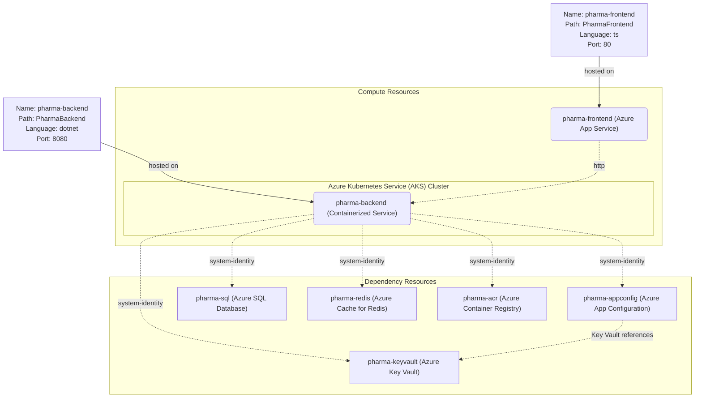

# Architecture Documentation

## Architecture source artifact
- Generated architecture file: `.azure/architecture.copilotmd`

## Overview
This solution is composed of a frontend and a backend service with Azure-managed dependencies:
- Frontend (`PharmaFrontend`): TypeScript web app hosted on Azure App Service.
- Backend (`PharmaBackend`): .NET API container hosted on Azure Kubernetes Service (AKS), listening on port `8080`.

## Compute topology
- `pharma-frontend` -> Azure App Service
- `pharma-backend` -> Azure Kubernetes Service (AKS)

## Backend dependencies
The backend uses system-managed identity to access:
- Azure Key Vault (`pharma-keyvault`)
- Azure App Configuration (`pharma-appconfig`)
- Azure SQL Database (`pharma-sql`)
- Azure Cache for Redis (`pharma-redis`)
- Azure Container Registry (`pharma-acr`)

## Data flow
1. The frontend calls backend APIs over HTTP.
2. The backend reads runtime configuration from Azure App Configuration.
3. App Configuration resolves secret references from Azure Key Vault.
4. The backend persists relational data in Azure SQL Database.
5. The backend uses Azure Cache for Redis for caching.
6. The backend pulls container images from Azure Container Registry.

## Mermaid diagram
The diagram below mirrors the generated architecture topology.

