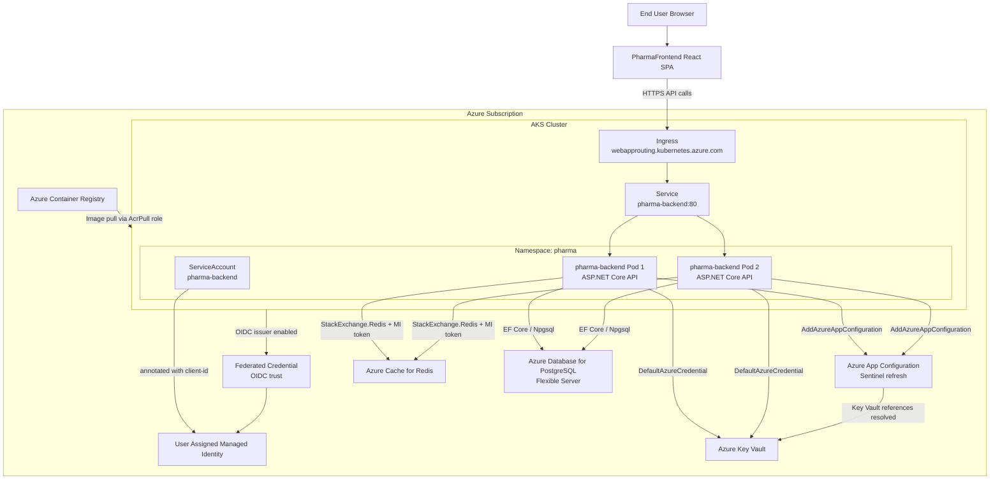
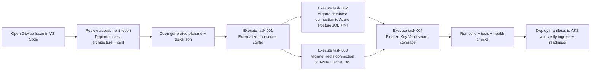

# PharmaBackend Modernized Architecture

This architecture mirrors your current modernization target: AKS-hosted API, workload identity, centralized configuration, and managed data/cache services.

## 1) Runtime Architecture (Target State)

## 2) Modernization Execution in VS Code (Step by Step)

## 3) Mapping to Current Repo Assets

- API app startup and cloud wiring: `Program.cs`
- Kubernetes deployment and probes: `k8s/deployment.yaml`
- Kubernetes ingress: `k8s/ingress.yaml`
- Kubernetes service account for workload identity: `k8s/serviceaccount.yaml`
- Kubernetes service: `k8s/service.yaml`
- AKS module (OIDC + workload identity + web app routing): `infra/modules/aks.bicep`
- UAMI + federated credential module: `infra/modules/uami.bicep`
- ACR module: `infra/modules/acr.bicep`

## 4) Notes

- The backend is configured to pull configuration from App Configuration and secrets from Key Vault, then allow environment variables and user secrets to override when needed.
- Readiness and liveness checks are exposed at `/health/ready` and `/health/live` and already wired in deployment probes.
- This diagram is intended for IDE visualization and modernization walkthroughs; keep it updated as you add new services.
