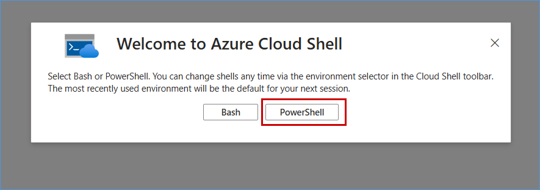
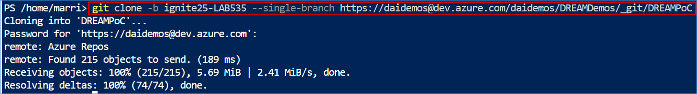
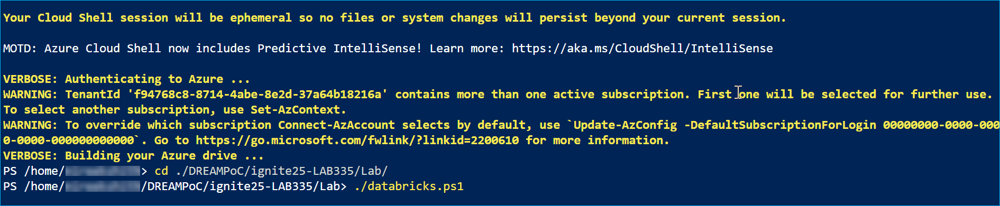
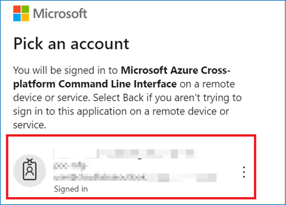
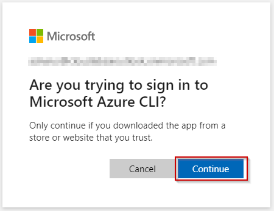
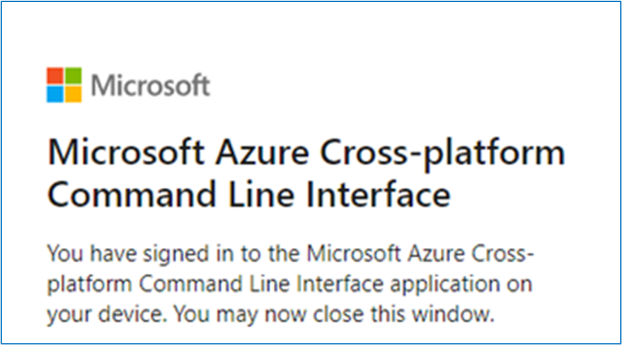

## What is a DPoC?
DREAM PoC Accelerators (DPoC) are packaged DREAM Demos using ARM templates and automation scripts (with a demo web application, Power BI reports, Fabric resources, ML Notebooks, etc.) that can be deployed in a customer’s environment.

## Objective & Intent
Partners can deploy DREAM Demos in their own Azure subscriptions and demonstrate them live to their customers. 
By Partnering with Microsoft sellers, partners can deploy Industry Scenario DREAM Demos into customer subscriptions. 
Customers can play, get hands-on experience navigating through the demo environment in their own subscription, and show it to their own stakeholders.

**Here are some important guidelines before you begin** 

1. **Read the [license agreement](https://github.com/microsoft/Azure-Analytics-and-AI-Engagement/blob/main/CDP-Retail/license.md) and [disclaimer](https://github.com/microsoft/Azure-Analytics-and-AI-Engagement/blob/main/CDP-Retail/disclaimer.md) before proceeding, as your access to and use of the code made available hereunder is subject to the terms and conditions made available therein.**
2. Without limiting the terms of the [license](https://github.com/microsoft/Azure-Analytics-and-AI-Engagement/blob/main/CDP-Retail/license.md) , any Partner distribution of the Software (whether directly or indirectly) must be conducted through Microsoft’s Customer Acceleration Portal for Engagements (“CAPE”). CAPE is accessible to Microsoft employees. For more information regarding the CAPE process, contact your local Data & AI specialist or CSA/GBB.
3. It is important to note that **Azure hosting costs** are involved when a DREAM PoC Accelerator is implemented in customer or partner Azure subscriptions. DPoC hosting costs are not covered by Microsoft for partners or customers.
4. Since this is a DPoC, there are certain resources available to the public. **Please ensure that proper security practices are followed before adding any sensitive data to the environment.** To strengthen the environment's security posture, **leverage Azure Security Center.** 
5.  In case of questions or comments, email **[dreamdemos@microsoft.com](mailto:dreamdemos@microsoft.com).**


## Prerequisite Steps for a DPOC
- Must have Owner or Contributor level permissions on the subscription.
- Must have Account Admin level permissions on Azure Databricks.
- Ensure that the subscription has a minimum of 50 vCPU cores available to support the Databricks cluster deployment.
- Must have access to create agent in copilotstudio.microsoft.com.

    


## Run the Cloud Shell to provision the demo resources

1. **Open** the Azure Portal by clicking on the button below.

<a href='https://portal.azure.com/' target='_blank'></a>

2. In the Azure portal, select the **Terminal icon** to open Azure Cloud Shell.

    

3. **Click** on **PowerShell**.

    

4. Select the **Subscription** and click on **Apply**.

    

    > **Note:** If you already have a storage mounted for Cloud Shell, you will not get this prompt. In that case, skip step 5 and 6.


5. In the Azure Cloud Shell window, ensure that the **PowerShell** environment is selected.

    

    >**Note:** All the cmdlets used in the script work best in PowerShell .	

    >**Note:** Use 'Ctrl+C' to copy and 'Shift+Insert' to paste, as 'Ctrl+V' is NOT supported by Cloud Shell.

6. Enter the following command to clone the repository files in Cloud Shell.

Command:

```
git clone -b ignite-lab-2025 --depth 1 --single-branch https://github.com/microsoft/Azure-Analytics-and-AI-Engagement.git DREAMPoC

```


   
    
   > **Note:** If you get File already exist error, please execute the following command to delete existing clone and then re-clone:

```
 rm DREAMPoC -r -f 
```

   > **Note**: When executing scripts, it is important to let them run to completion. Some tasks may take longer than others to run. When a script completes execution, you will be returned to a command prompt. 

7. **Execute** the PowerShell script with the following command:
```
cd ./DREAMPoC/ignite25-LAB335/Lab/
```

```
./databricks.ps1
```
    
   

<!-- 8. **Press** **Y** and click on the **Enter** button.
      
 -->

8. From the Azure Cloud Shell, **copy** the authentication code. You will need to enter the code in the next step.

9. **Click** the link [https://microsoft.com/devicelogin](https://microsoft.com/devicelogin) and a new browser window will launch.


     
10. **Paste** the authentication code.

     

11. **Select** the user account you used for logging into the Azure Portal in [Task 1](#task-1-create-a-resource-group-in-azure).

 

12. **Click** on the **Continue** button.

 

13. **Close** the browser tab when you see the message box.

       

14. **Navigate back** to your **Azure Cloud Shell** execution window.

15. When prompted, enter the **number** that corresponds to the **subscription** where you want your resources to be deployed.

    
    
    > **Notes:**
    > - Users with a single subscription won't be prompted to select a subscription.
    > - The subscription highlighted in Light blue will be selected by default, if you do not enter a desired subscription. Please select the subscription carefully as it may break the execution further.
    > - While you are waiting for the processes to complete in the Azure Cloud Shell window, you'll be asked to enter the code three times. This is necessary for performing the installation of various Azure Services and preloading the data.

16. **Copy** the code on the screen to authenticate the Azure PowerShell script for creating reports in Power BI. **Click** the link [https://microsoft.com/devicelogin](https://microsoft.com/devicelogin).

    

17. A new browser window will launch. **Paste** the authentication code you copied from the shell above.

     

18. **Select** the user account that is used for logging into the Azure Portal in [Task 1](#task-1-create-a-resource-group-in-azure).

    

19. **Click** on 'Continue'.

     

20. **Close** the browser tab when you see the message box.

     

21. **Go back** to the Azure Cloud Shell execution window.

<!-- 23. **Copy** the code on the screen to authenticate the Azure PowerShell script for creating reports in Power BI. **Click** the link [https://microsoft.com/devicelogin](https://microsoft.com/devicelogin).

    

24. A new browser window will launch. **Paste** the authentication code you copied from the shell above.

     

25. **Select** the user account that is used for logging into the Azure Portal in [Task 1](#task-1-create-a-resource-group-in-azure).

    

26. **Click** on 'Continue'.

     

27. **Close** the browser tab when you see the message box.

     

28. **Go back** to the Azure Cloud Shell execution window. -->

23. **Enter** the Region for deployment with the necessary resources available.
24. **Enter** the region for **OpenAI** resource deployment.
    (Ex.: eastus, eastus2, westus, westus2, etc).

     

25. From here, continue by following the instructions in **ignite25-LAB335/Lab/Labinstructions.md**.
