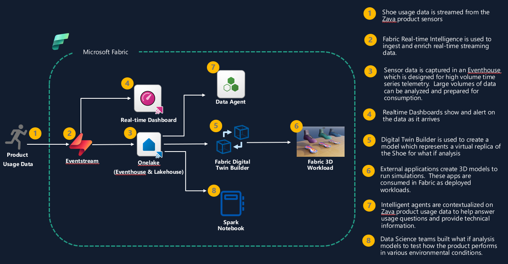

# Zava Microsoft Fabric Digital Twin Builder Demo

## Demo Business Scenario
The Zava R&D Team are looking to optimize the design of new Zava Smart Cleat shoe by collecting critical usage data directly from sensors in the shoe.  The data will be used to feed a digital twin of the shoe and identify how the product design can be optimized for comfort and performance.

Through this process data engineering teams must support the collection of data, R&D design teams will analyze the information and virtually test design decisons to optimize the shoe using real time feedback.

## Solution Architecture
The solution will be based on Microsoft Fabric, using Realtime Intelligence for data ingestion and analysis, Fabric Digital Twin Builder for modelling, and Fabric Data Agents and Fabric Notebooks for analysis.  Applications built with 3rd party 3D visualization capabilities will also be deployed within a Fabric Workload to make the end to end R&D experience available in Microsoft Fabric.

<!-- Diagram: img/Fabric-Solution-Architecture.png -->

## Fabric Solution Components
1. Sensor Data Generator

2. Realtime Intelligence Eventstream

3. Eventhouse & Lakehouse

4. Realtime Dashboard

5. Digital Twin Builder

6. 3D Visualization App

7. Data Agents

8. Spark Notebooks

## Deploying the Solution in your tenant
The Fabric Digital Twin Builder demo can be deployed into any Fabric Tenant.  To deploy in your own environment follow the [Microsoft Fabric Digital Twin Builder Demo Deployment Guide](Deployment_Guide/Microsoft-Fabric-Digital-Twin-Builder-Deployment-Guide.md).
