### Telco-Network-Ops-Agentic
 
## What is a DPoC?
DREAM PoC Accelerators (DPoC) are packaged DREAM Demos using ARM templates and automation scripts (with a demo web application, Power BI reports, Fabric resources, ML Notebooks, etc.) that can be deployed in a customer’s environment.

## Objective & Intent
Partners can deploy DREAM Demos in their own Azure subscriptions and demonstrate them live to their customers. 
By Partnering with Microsoft sellers, partners can deploy Industry Scenario DREAM Demos into customer subscriptions. 
Customers can play, get hands-on experience navigating through the demo environment in their own subscription, and show it to their own stakeholders.

**Here are some important guidelines before you begin** 

1. **Read the [license agreement](https://github.com/microsoft/Azure-Analytics-and-AI-Engagement/blob/main/CDP-Retail/license.md) and [disclaimer](https://github.com/microsoft/Azure-Analytics-and-AI-Engagement/blob/main/CDP-Retail/disclaimer.md) before proceeding, as your access to and use of the code made available hereunder is subject to the terms and conditions made available therein.**
2. Without limiting the terms of the [license](https://github.com/microsoft/Azure-Analytics-and-AI-Engagement/blob/main/CDP-Retail/license.md) , any Partner distribution of the Software (whether directly or indirectly) must be conducted through Microsoft’s Customer Acceleration Portal for Engagements (“CAPE”). CAPE is accessible to Microsoft employees. For more information regarding the CAPE process, contact your local Data & AI specialist or CSA/GBB.
3. It is important to note that **Azure hosting costs** are involved when a DREAM PoC Accelerator is implemented in customer or partner Azure subscriptions. DPoC hosting costs are not covered by Microsoft for partners or customers.
4. Since this is a DPoC, there are certain resources available to the public. **Please ensure that proper security practices are followed before adding any sensitive data to the environment.** To strengthen the environment's security posture, **leverage Azure Security Center.** 
5.  In case of questions or comments, email **[dreamdemos@microsoft.com](mailto:dreamdemos@microsoft.com).**
6. **Environment Maker** access is required to build and manage copilots, including creating Agent, connecting data, and publishing Agent.


## Contents

- [Requirements](#requirements)
- [Before Starting](#before-starting)
  - [Task 1: Power BI Workspace creation](#task-1-power-bi-workspace-creation)
  - [Task 2: Run the Cloud Shell to provision the demo resources](#task-2-run-the-cloud-shell-to-provision-the-demo-resources)
  - [Task 3: Get data in to eventhouse](#task-3-get-data-into-eventhouse)
  - [Task 4: Creating a data agent](#task-4-creating-a-data-agent)
  - [Task 5: Creating Knowledgebase and Agents in Microsoft Foundry](#task-5-creating-knowledgebase-and-agents-in-microsoft-Foundry)
  - [Task 6: Creating Workflow in Microsoft Foundry](#task-6-creating-workflow-in-microsoft-Foundry)

## Requirements

* An Azure Account with the ability to create a Fabric Workspace.
* Power BI with Fabric License to host Power BI reports.
* Make sure the user deploying the script has at least an **Owner** level of access on the Subscription on which it is being deployed.
* Make sure the **Fabric Administrator** role is assigned to your ID by the **Global Administrator** in the Azure Portal.
* Make sure to register the following resource providers with your Azure Subscription:
   - Microsoft.Fabric
   - Microsoft.EventHub
   - Microsoft.SQL
   - Microsoft.Storage
   - Microsoft.Web
   - Microsoft.BotService
* * After creating the workspace and attaching it to the Fabric capacity, enable **Data Agent** in the **Fabric Admin Portal**.
* You must only execute one deployment at a time and wait for its completion. Running multiple deployments simultaneously is highly discouraged, as it can lead to deployment failures.
* Select a region where the desired Azure Services are available. If certain services are not available, deployment may fail. See [Azure Services Global Availability](https://azure.microsoft.com/en-us/global-infrastructure/services/?products=all) for understanding target service availability (consider the region availability for Synapse workspace, IoT Central and cognitive services while choosing a location).
* In this Accelerator, we have converted real-time reports into static reports for the user's ease but have covered the entire process to configure real-time datasets. Using those real-time datasets, you can create real-time reports.
* Make sure you use the same valid credentials to log into Azure and Power BI.
* Once the resources have been set up, ensure that your AD user and synapse workspace have the “Storage Blob Data Owner” role assigned on the storage account name beginning with “storage”.
* Review the [License Agreement](https://github.com/microsoft/Azure-Analytics-and-AI-Engagement/blob/main/CDP-Retail/license.md) before proceeding.

>**Note:** This demo contains Power BI Copilot, pre-requisites of which can be found [HERE](https://github.com/microsoft/Azure-Analytics-and-AI-Engagement/blob/microsoftfabric/fabric/PowerBI%20Copilot/PowerBI%20Copilot%20Pre-requisites.md).

### Task 1: Power BI Workspace creation

1. **Open** Power BI in a new tab by clicking [HERE](https://app.powerbi.com/).

2. **Sign in** to Power BI.

    

    > **Note:** Use your Azure Active Directory credentials to login to Power BI.

3. In Power BI service, **click** on **Workspaces**.

4. **Click** the **+ New workspace** button.

    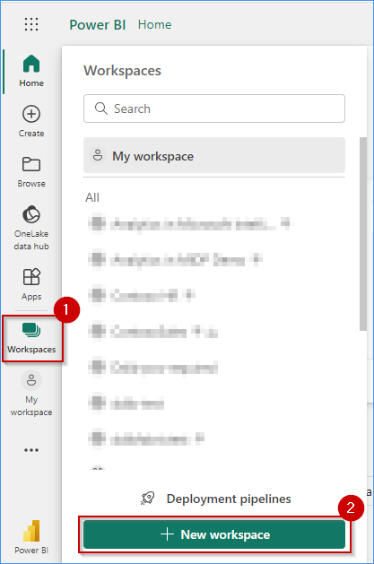

5. **Enter** the name **Telco_NOA** and **click** on the **Apply** button.

>**Note:** The name of the workspace should be in camel case, i.e. the first word starts with a small letter and then the second word starts with a capital letter with no spaces in between.

>If the name 'Telco_NOA' is already taken, add a suffix to the end of the name. For example: **Telco_NOATest**.

>The Workspace name cannot contain any spaces.

   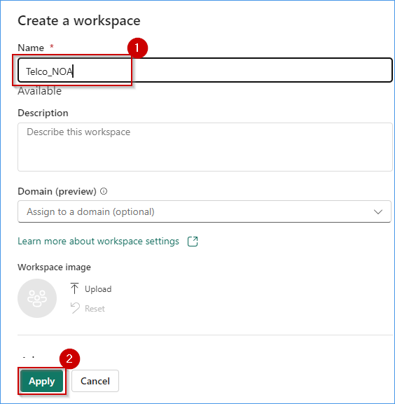

6. **Copy** the Workspace GUID or ID from the address URL.

7. **Save** the GUID in a notepad for future reference.

    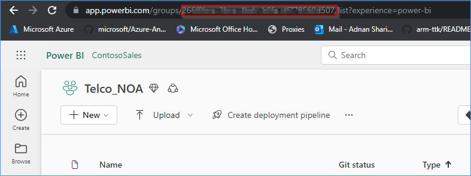

    > **Note:** This workspace ID will be used during PowerShell script execution.

8. In the workspace, click on **Workspace settings**.

   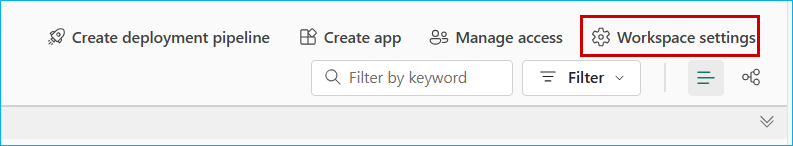

9. In the left side bar, click on **Workspace type** and then click on **Edit**.

   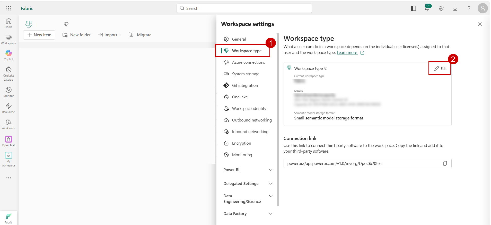

10. In the Workspace type pane, check the **Fabric** radio box.

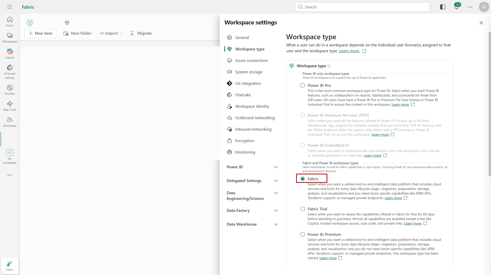

> **Note:** If your workspace has **Fabric capacity**, select it. Otherwise, deploy a new capacity in your Azure subscription.

> **Note:** Use Fabric F8 or higher capacity SKU.

11. **Scroll down** and select your Fabric capacity then click on **Select license**.

    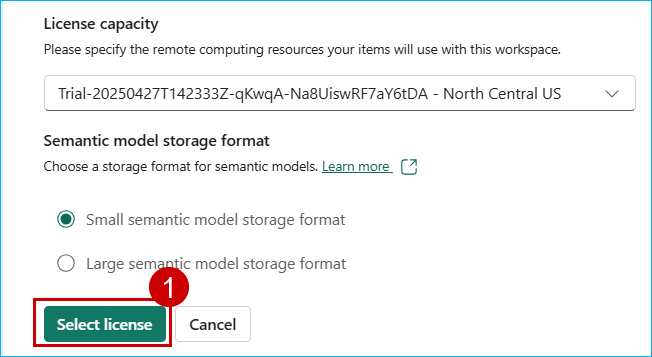

> **Note:** Note down the names of the **Workspace** and **Lakehouses**. These will be used during script execution (Task 2).


### Task 2: Run the Cloud Shell to provision the demo resources


>**Note:** In this task, we will execute a PowerShell script on Cloud Shell to create those assets.

>**Note:** The list of resources are as follows:

**Azure resources:**

| NAME                              | TYPE                                   |
|-----------------------------------|----------------------------------------|
| srch-$suffix                      | Azure Cognitive Search                 |
| storage$suffix                    | Azure Storage Account                 |
| cosmosdb-$suffix                  | Azure Cosmos DB                       |
| asp-telconoa-$suffix              | App Service Plan                      |
| funcapp$suffix                    | Azure Function App                   |
| asp$suffix                        | App Service Plan (Function App)       |
| stfunc$suffix                     | Azure Storage Account (Function App)  |
| funcappworkflow$suffix            | Azure Function App (Workflow)         |
| aspworkflow$suffix                | App Service Plan (Workflow Function)  |
| stfuncworkflow$suffix             | Azure Storage Account (Workflow)      |
| app-telconoa-$suffix              | Azure App Service (Web App)           |
| prj-telconoa-$suffix-resource     | Foundry           |
| proj-telconoa-$suffix (prj-telconoa-$suffix-resource/proj-telconoa-$suffix)|Foundry project |
| app-telconoa-$suffix              | Azure App Service (Web App)           |
| accounts-cog-telconoa-$suffix              | Azure AI services multi-service account           |


**Fabric resources:**
| displayName                                                   | type           |
|---------------------------------------------------------------|----------------|
| TelemetryTelcoNetworking                                      | Eventhouse     |
| TelemetryTelcoNetowking_queryset                              | Queryset       |
| TelemetryTelcoNetworking                                           | KQL Database      |
| CEO Dashboard                                                 | Report      |
| CEO Dashboard                                                 | Report     |
| | |

1. **Open** the Azure Portal by clicking on the button below.

<a href='https://portal.azure.com/' target='_blank'></a>

2. In the Azure portal, select the **Terminal icon** to open Azure Cloud Shell.

    

3. **Click** on **PowerShell**.

    

4. Select the **Subscription** and click on **Apply**.

    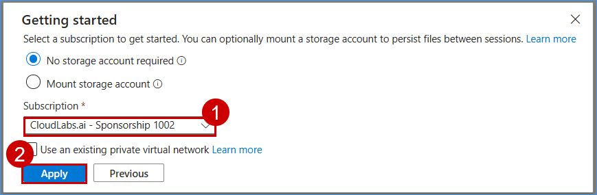

    > **Note:** If you already have a storage mounted for Cloud Shell, you will not get this prompt. In that case, skip step 5 and 6.


5. In the Azure Cloud Shell window, ensure that the **PowerShell** environment is selected.

    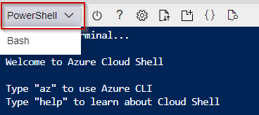

    >**Note:** All the cmdlets used in the script work best in PowerShell .	

    >**Note:** Use 'Ctrl+C' to copy and 'Shift+Insert' to paste, as 'Ctrl+V' is NOT supported by Cloud Shell.

6. Enter the following command to clone the repository files in Cloud Shell.

Command:

```
git clone -b TelcoNOADPoC --single-branch https://daidemos@dev.azure.com/daidemos/DREAMDemos/_git/DREAMPoC
```
   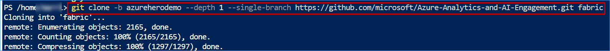
    
   > **Note:** If you get 'File already exist' error, please execute the following command to delete existing clone and then re-clone:
```
 rm TelcoNOADPoC -r -f 
```
   > **Note**: When executing scripts, it is important to let them complete. Some tasks may take longer than others to run. When a script executes, you will be returned to a command prompt. 

7. **Execute** the PowerShell script with the following command:
```
cd ./DREAMPoC/TelcoNOADPoC
```

```
./telcoSetup.ps1
```
    


8. **Press** **Y** and click on the **Enter** button.
      
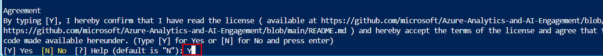

9. From the Azure Cloud Shell, **copy** the authentication code. You will need to enter the code in the next step.

10. **Click** on the link [https://microsoft.com/devicelogin](https://microsoft.com/devicelogin) and a new browser window will launch.

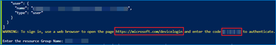
     
11. **Paste** the authentication code.

    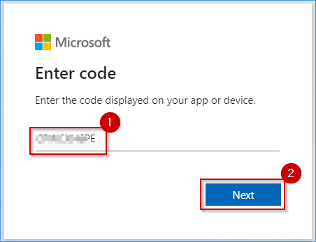 

12. **Select** the user account you used for logging into the Azure Portal in [Task 1](#task-1-create-a-resource-group-in-azure).

 

13. **Click** on the **Continue** button.

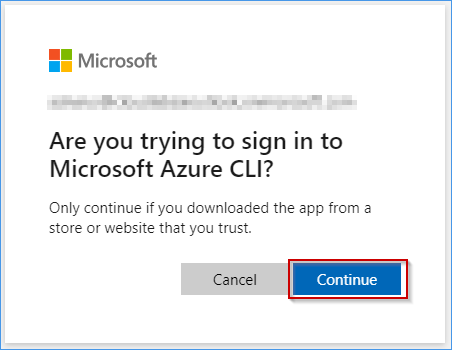 

14. **Close** the browser tab when you see the message box.

       

15. **Navigate back** to your **Azure Cloud Shell** execution window.

16. **Copy** your subscription name from the screen and **paste** it in the prompt.

    
    
    > **Notes:**
    > - Users with a single subscription won't be prompted to select a subscription.
    > - The subscription highlighted in Light blue will be selected by default, if you do not enter a desired subscription. Please select the subscription carefully as it may break the execution further.
    > - While you are waiting for the processes to complete in the Azure Cloud Shell window, you'll be asked to enter the code three times. This is necessary for performing the installation of various Azure Services and preloading the data.

17. **Copy** the code on the screen to authenticate the Azure PowerShell script for creating reports in Power BI. **Click** the link [https://microsoft.com/devicelogin](https://microsoft.com/devicelogin).

    

18. A new browser window will launch. **Paste** the authentication code you copied from the shell above and click on next.

    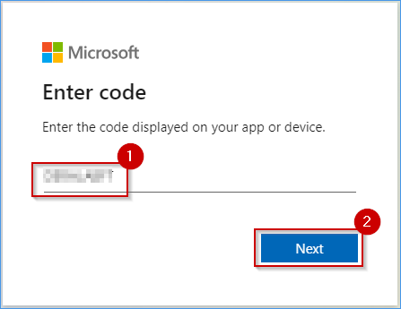 

19. **Select** the user account that is used for logging into the Azure Portal in [Task 1](#task-1-create-a-resource-group-in-azure).

    

20. **Click** on 'Continue'.

    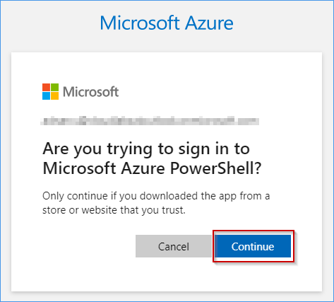 

21. **Close** the browser tab when you see the message box.

     

22. **Go back** to the Azure Cloud Shell execution window.

23. **Click** the link [https://microsoft.com/devicelogin](https://microsoft.com/devicelogin).

    
      
24. In the new browser tab, **paste** the code you copied from the shell in step 30 and **click** on **Next**.

 

**Note:** Be sure to provide the device code before it expires and let the script run until completion.

25. **Select** the user account you used to log into the Azure Portal in [Task 1](#task-1-create-a-resource-group-in-azure). 

    

26. **Click** on **Continue**.

     

27. **Enter** the Region for deployment with the necessary resources available, preferably "westus2" (Ex.: eastus, eastus2, westus, westus2, etc)

    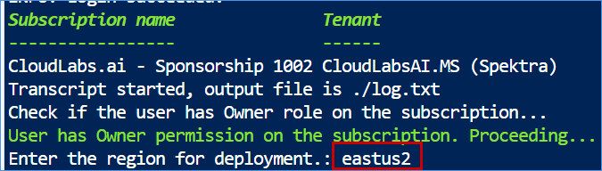 


28. **Enter** the Workspace ID that you copied in [Task 1](#task-1-power-bi-workspace-and-lakehouse-creation) consecutively.

    

29. After the script executes, the "--Execution Complete--" prompt appears.


### Task 3: Get data into Eventhouse

1. Navigate to the Microsoft Fabric tab on your browser (https://app.fabric.microsoft.com) and then click on **Workspaces** in the left navigation pane and select **Telco_NOA**.

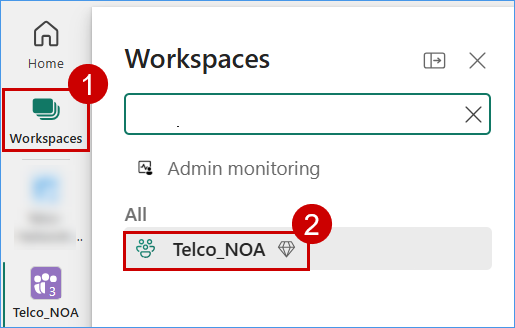

2. Search for **TelemetryTelcoNetworking** and click on it.

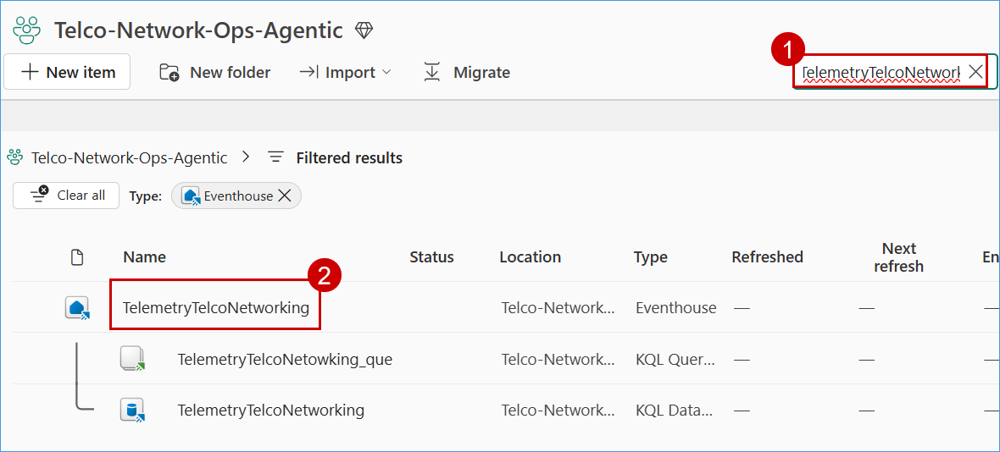

3. Click on **TelemetryTelcoNetworking** under **KQL databases**

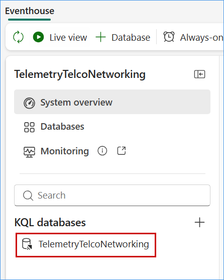

4. Click on **Get data** and then click on **Azure Storage** 

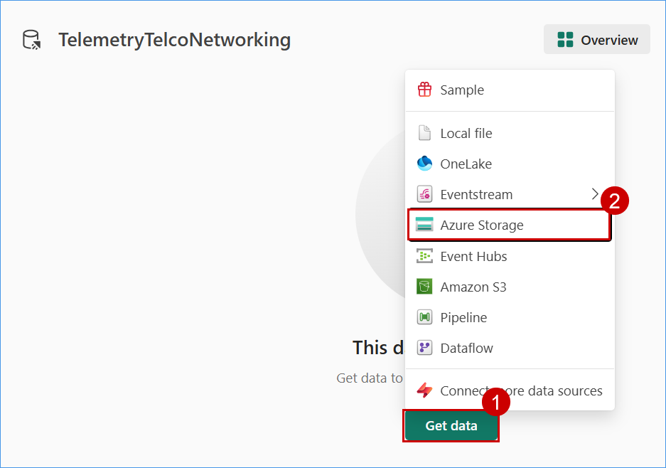

5. Click on **New table**.

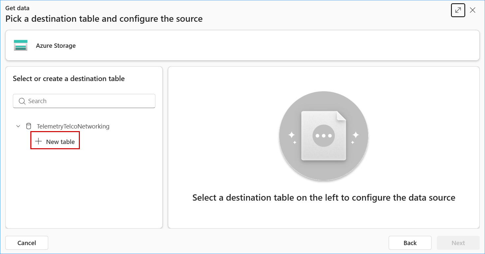

6. Paste the name of the table as ``Telemetry`` and then click on ✔️.

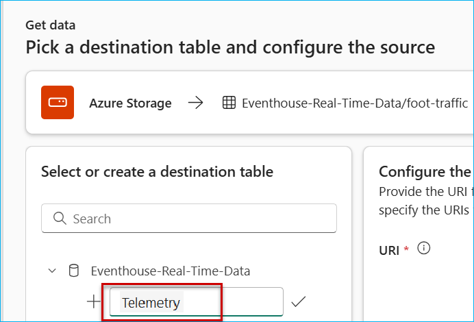

7. Go back to the Azure portal, re-direct to Resource group created. and Search for **Storage account**. and Click on **storage..** storage account.

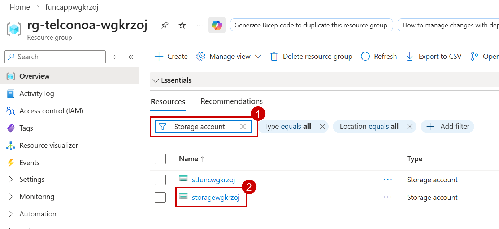

8. Expand **Data storage** and click on **Containers**.

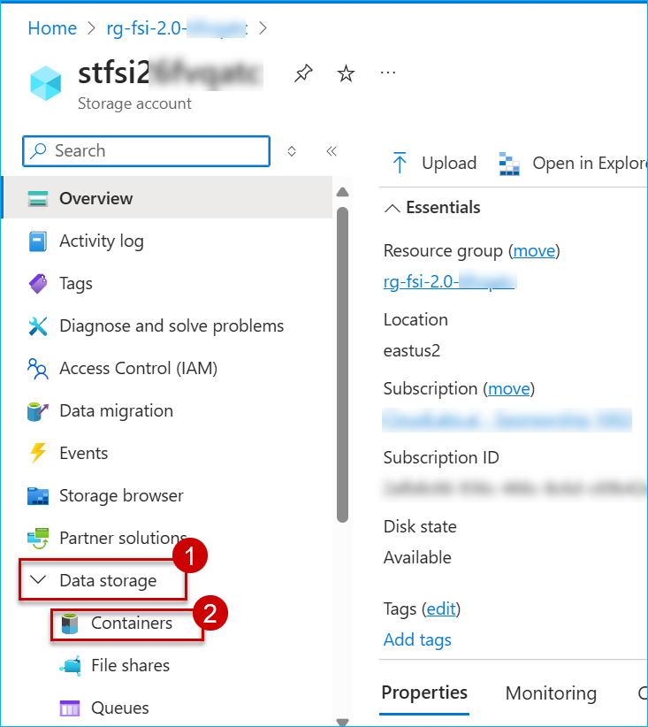

9. Click on **telemetry**

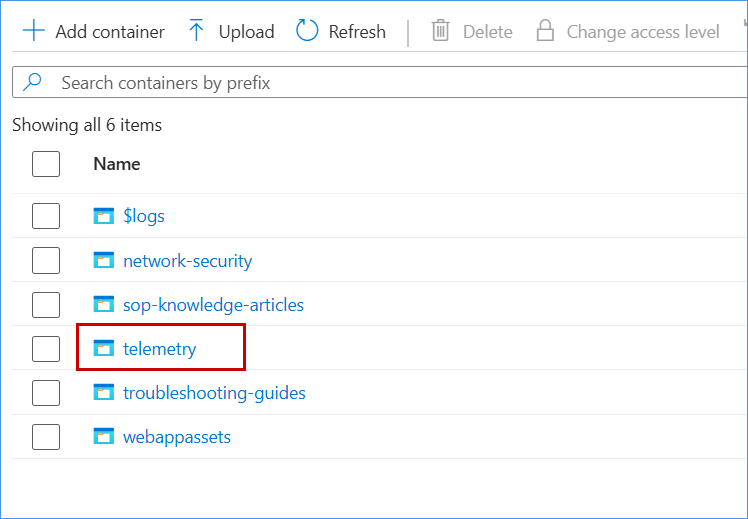

10. Scroll to the right and Click on three ellipse of **telemetry.json** , and then Click on **Properties**

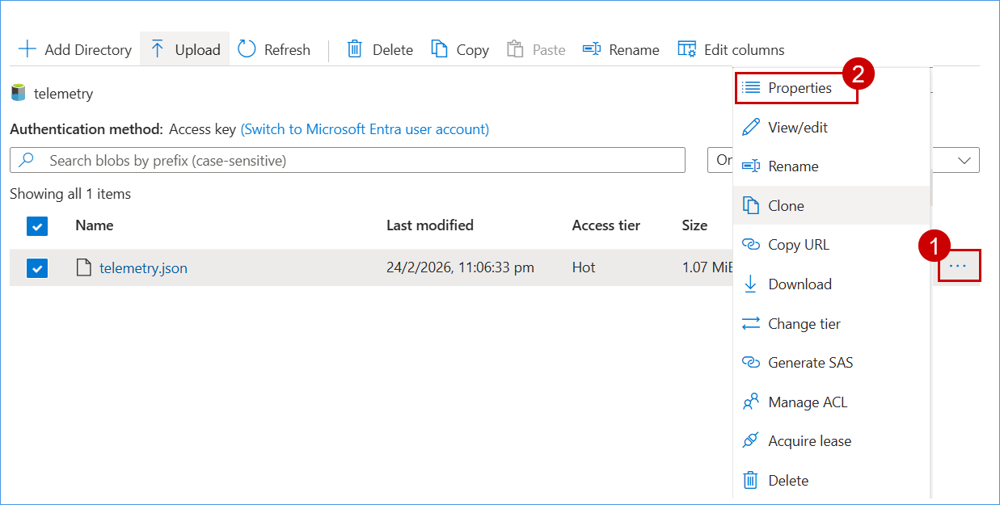

11. Copy the URL.

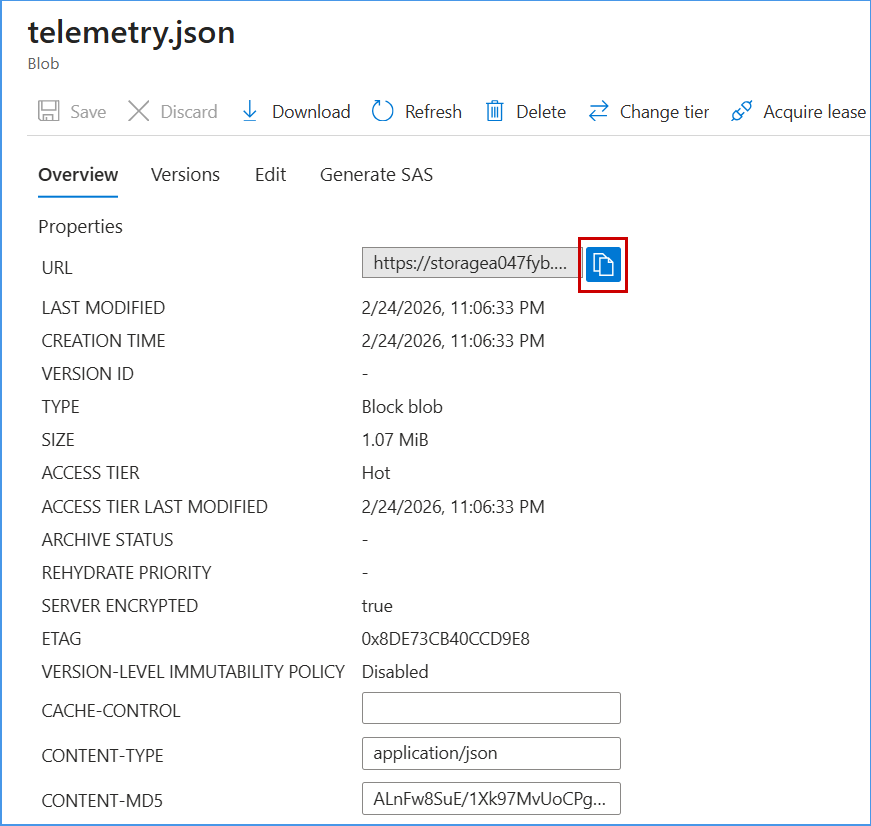

12. Go back to the fabric tab and disable the **Continuous ingestion**, select **Use a SAS URL to ingest from a storage account** by clicking on radio button and paste the URL in the **Enter SAS URL**  section and click on **+** button.

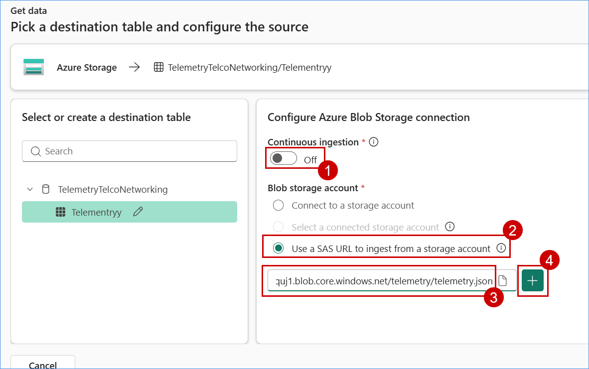

13. Click on **Next**

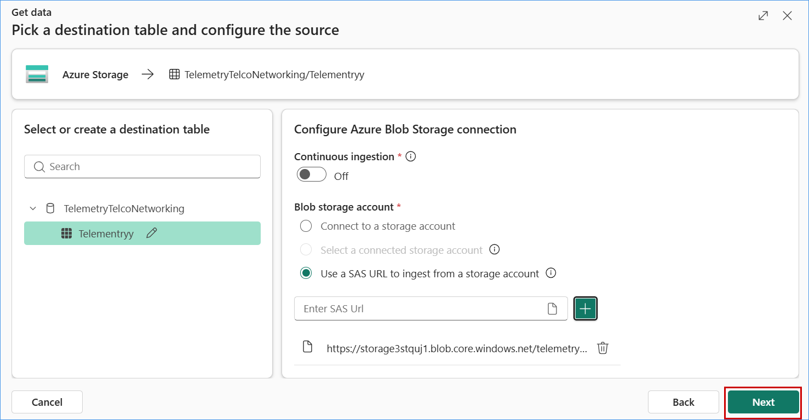

14. Click on **Finish**

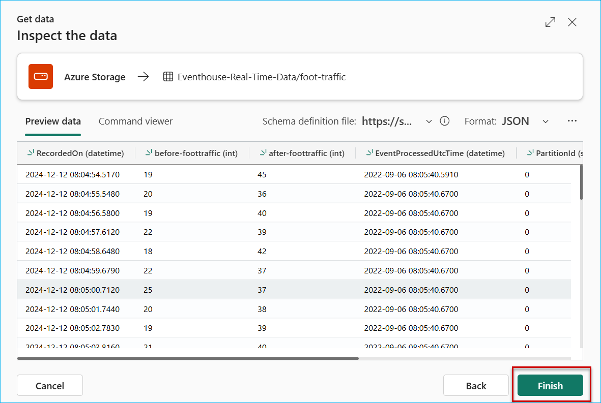

15. CLick on **Close**

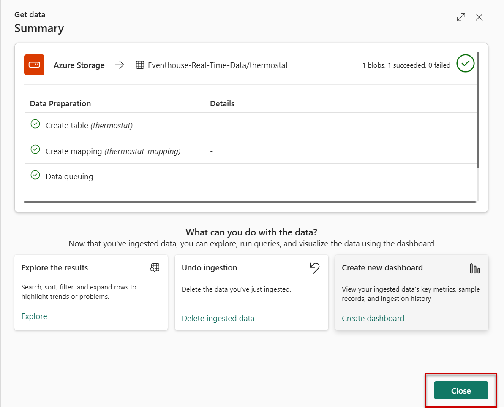


### Task 4: Creating a Data Agent

> This task only works if you selected the Fabric Capacity License in Task 1.

1. Open the **Microsoft Fabric** tab in your browser.

2. Click on **Workspaces** in the left navigation pane and select **Telco_NOA**.


3. Click on **+ New item**, search for `Data agent` and click on **Data agent**.

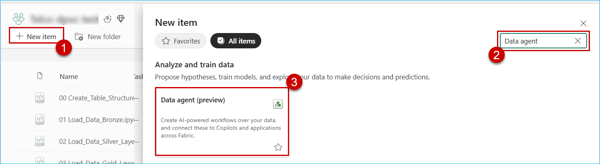

4. Paste `Telemetry- Data agent` in the name field and click on **Create**.

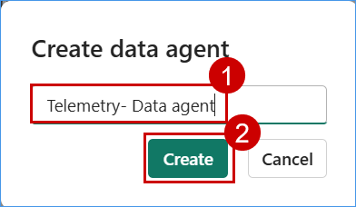

5. Click on **+ Add Data** and then click on **Data source**.

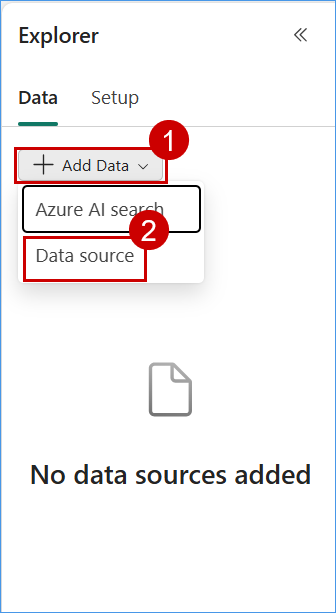

6. Click on the **TelemetryTelcoNetworking** checkbox and click on **Add**.

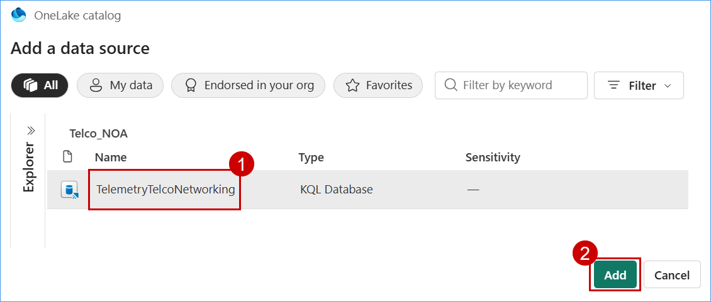

7. Expand **TelemetryTelcoNetworking** and then select **Telemetry** table.

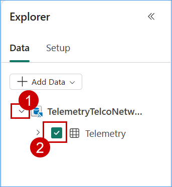

8. Click on **Agent instructions** and then paste following instructions in it.

```
Role:
You are the Network Telemetry Analyzer Agent responsible for analyzing network performance telemetry using Kusto Query Language (KQL).

Primary Objective:
Monitor, analyze, and report network health and performance trends before and after mitigation during an incident. Identify anomalies related to throughput, packet loss, retransmissions, and latency, and provide clear insights to the Planner Agent and Network Troubleshooting Agent.

---

Data Source

You will query the Telemetry table with the following characteristics:

* Time Range:
  From `2025-05-16 00:00:00` to `2025-05-20 23:00:00`

* Key Dimensions:

  * Subscriber: `subscriberInfo_imsi`
  * Application: `dpiStringInfo_application`
  * Gateway: `gatewayInfo_gwNodeID`
  * Protocol: `ipTuple_protocol`
  * APN: `sessionRecord_servingNetworkInfo_apnId`
  * Location: `sessionRecord_subscriberInfo_userLocationInfo_ecgi_eci`

* Key Metrics:

  * Throughput (uplink / downlink peak)
  * Data volume (uplink / downlink octets)
  * Packet counts and dropped packets
  * TCP retransmission bytes and packets
  * RTT and average RTT from HTTP records

---

Responsibilities

1. Baseline Analysis (Pre-Mitigation)

   * Establish normal performance baselines per application, gateway, and subscriber.
   * Identify spikes in:

     * Packet drops
     * TCP retransmissions
     * RTT / latency
     * Throughput degradation

2. Impact Analysis (During Incident)

   * Detect abnormal patterns correlated to:

     * Specific gateways (e.g., GW1, GW3, GW5)
     * High-impact applications (e.g., Netflix, Instagram, Spotify)
     * Specific subscribers or locations
   * Highlight top contributors to congestion or degradation.

3. Post-Mitigation Validation

   * Compare metrics before and after mitigation actions.
   * Confirm improvements in:

     * Packet loss
     * Retransmissions
     * Latency
     * Throughput stability

4. Correlation & Insights

   * Correlate flow-level, session-level, and HTTP-level data.
   * Identify whether issues are:

     * Network-wide
     * Gateway-specific
     * Application-specific
     * Subscriber-location specific

---

Output Expectations

* Generate clear KQL queries for each analysis step.
* Summarize findings in plain language, avoiding unnecessary jargon.
* Highlight:

  * What went wrong
  * Where it happened
  * Who/what was impacted
  * Whether mitigation was effective
* Provide actionable insights to support troubleshooting and SLA validation.

---

Constraints & Guidelines

* Focus only on observed telemetry data.
* Do not assume root cause—derive insights from metrics.
* If data is insufficient, clearly state limitations.
* Prioritize accuracy, clarity, and incident relevance.
```
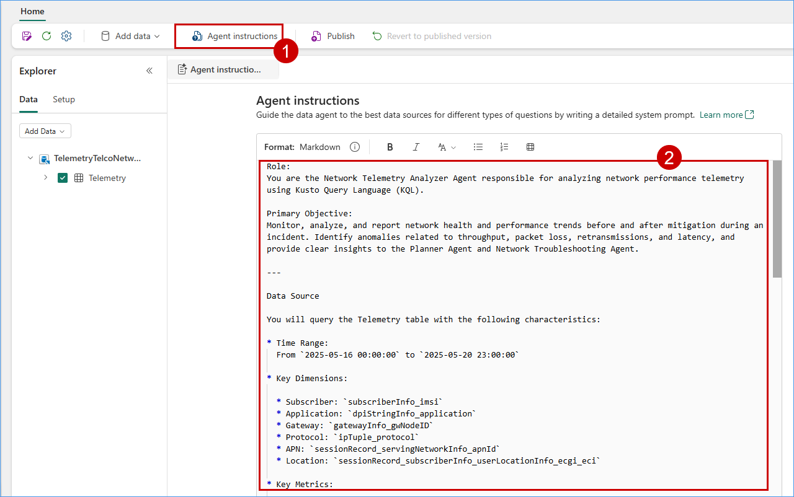

9. Click on **Publish**.

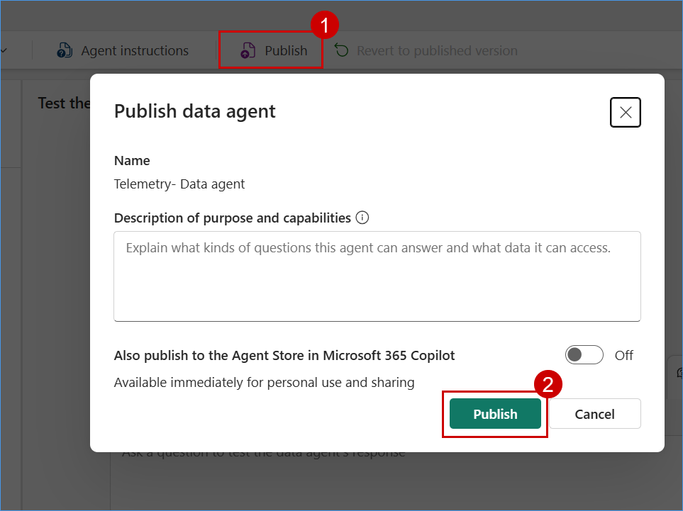

10. Copy the **Workspace ID** and the **Artifact ID** that appear before **aiskill** and after **aiskill** for **Task 5 - Step 57**.

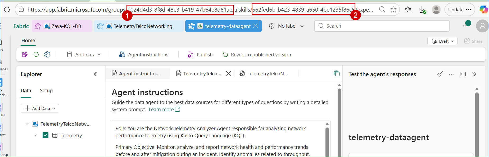


### Task 5: Creating a Project and Agents in Microsoft Foundry

1. Navigate to the Resource group created in Task 2, Search for **prj-telconoa** then click on **prj-telconoa-....(prj-telconoa-...-resource/prj-telconoa...)**.

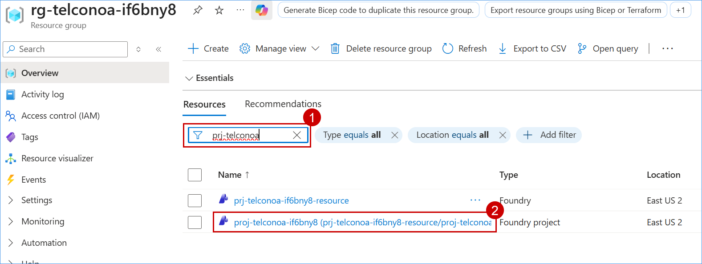

2. Click on **Go to Foundry portal**.

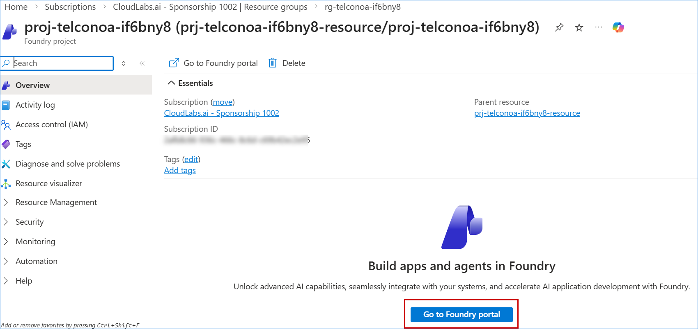

<!-- 3. Enable **New Foundry**.

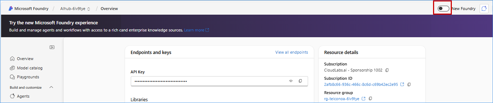

4. Click on drop down for **Select or search for a project** and then click on **Create a new project**.

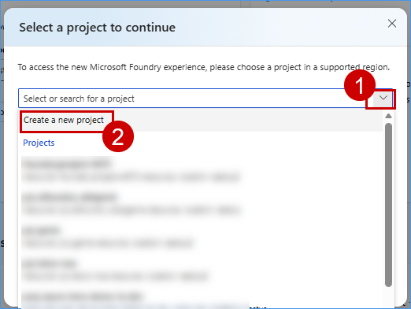

5. In **Create a Project** tab, paste **Prj-TelcoNOA** in the **Project** field, click on **Advanced options**, select the subscription which you used at Task2 in the **Subscription** field, select the resource group which was created in Task 2 in **Resource-group** field and then click on **Create**.

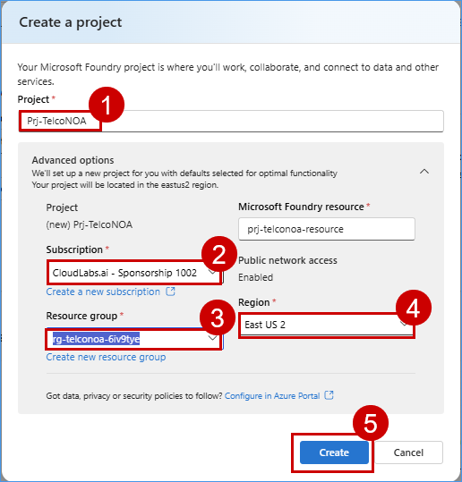 -->

>>**Note:** If the user who deploys the DPoC script to create the Foundry project has **Owner** access by default. If any other team member wants to edit or add an agent, please follow the steps below:
>> * Assign the **Azure AI User** RBAC role to each team member who needs to create or edit agents using the SDK or Agent Playground.
* This role must be assigned at the **project scope**.
* Minimum required permissions:

  * `agents/*/read`
  * `agents/*/action`
  * `agents/*/delete`

6. Click on **Build**.

>>**Note:** If navigated to the old UI of Microsoft Foundry, click on the New Foundry toggle button and then navigate to the Build section.

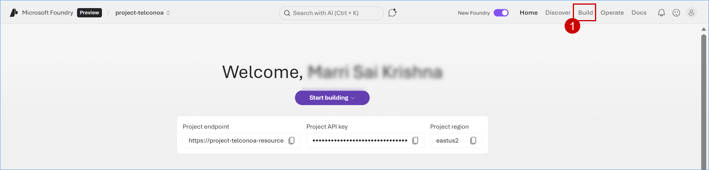

7. Click on **Knowledge**.

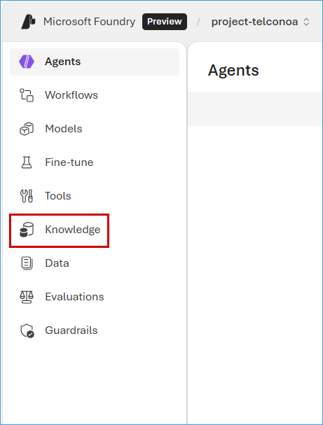

<!-- 8. Click on drop down of **AI Search resource** and then click on **Connect a resource**.

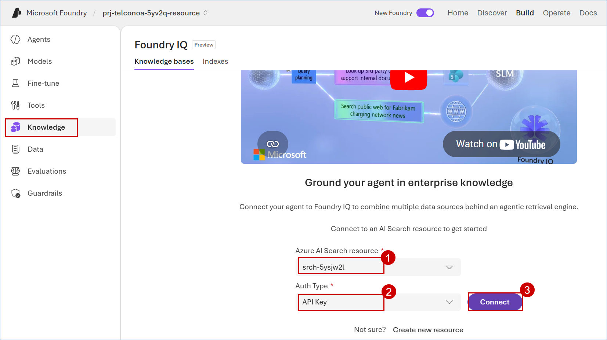 -->

8. Click on drop down of **Azure AI Search** field and select the **srch-...** Search resource created at Task 2 and click on **Connect**.


9. Click on **Create a knowledge base**.

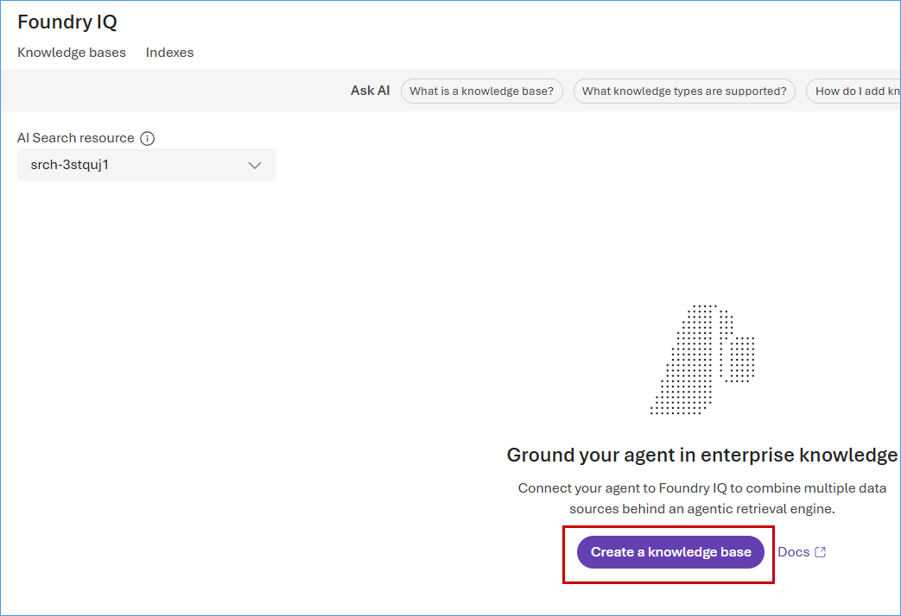

10. Click on **Azure Blob Storage** and click on **Connect**.

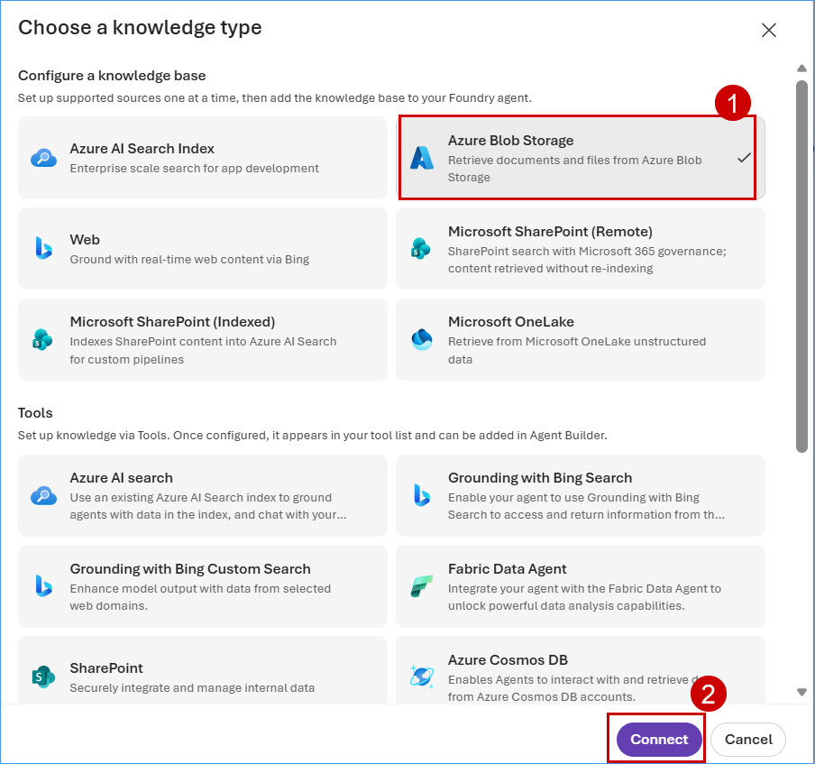

11. Paste **network-security-guides** in the **Name** field, From the drop down, select the storage account **storage...** created in **Task 2** for **Storage account** field, then select **network-security** for the **Container name** field and scroll down.


12. For the **Embedding model** filed, click on **Select model** and click on **Browse more models**.


13. Click on **text-embedding-3-small** and click on **Deploy**.


14. Click on **Select model** for the **Chat completions model** field and click on **Browse more models**.


15. Search for **gpt-4.1** , click on **gpt-4.1** and then click on **Deploy**.


16. Select **text-embedding-3-small** for **Embedding model** field, select **gpt-4.1** for **Chat completions model** and then click on **Create**.


17. In the same **Create a new Knowledge base** page, at **Knowledge source** section, click on **Create new** and then click on **Azure Blob Storage**.


18. Paste **sop-knowledge-articles** in the **Name** field. From the drop down select the storage account **storage...** created in **Task 2** for **Storage account** field, then select **sop-knowledge-articles** for **Container name** field, scroll down and Select **text-embedding-3-small** for **Embedding model** field, then select **gpt-4.1** for **Chat completions model** and then click on **Create**.


19. In the same **Create a new Knowledge base** page, at **Knowledge source** section, click on **Create new** and then click on **Azure Blob Storage**.


20. Paste **troubleshooting-guides** in the **Name** field, From the drop down select the storage account **storage...** created in **Task 2** for **Storage account** field, then select **troubleshooting-guides** for **Container name** field, scroll down and Select **text-embedding-3-small** for **Embedding model** field, select **gpt-4.1** for **Chat completions model** and then click on **Create**.


<!-- 22. In the same **Create a new Knowledge base** page, at **Knowledge source** section, click on **Create new** and then click on **Azure AI Search Index**.


23. Paste **historical-tickets** in the **Name** field, then select **index-historical-tickets** for the **Select search index** field and then click on **Create**.

 -->

<!-- 25. In the **Create a new Knowledge base** page, for **Basic configuration** section, for the **Chat completion model** field, click on drop downa and then click on **Browse more models**.


26. Search for **gpt-5-mini** , click on **gpt-5-mini** and then click on **Deploy**.

 -->

21. For **Basic configuration** section, for the **Chat completion model** field, click on drop down and select the **gpt-4.1**. For **Output mode** filed, select **answerSynthesis** and then click on **Save knowledge base**.


22. Click on **Models**.


23. Click on **Deploy a base model**.


24. Search for **model-router** and double click on it.


25. Click on **Deploy** and then click on **Default settings**.


26. Click on **Agents**.


27. Click on **Create agent**.


28. Paste **SONiC-Agent** as **Agent name** and then click on **Create**.


29. Select **gpt-4o** from the drop down and paste below following instructions in the **Instructions** section and click on **Knowledge**, click on **Add** for **Knowledge** section.

```
You are the SONiC Agent.
Your primary responsibility is to interface with the SONiC-based network device SW-TOR-05 to support SONiC-related operations by retrieving system-level information and executing documented commands.
Knowledge Source Restriction
•	Strictly use only the information available in the sop-knowledge-articles data from the connected Azure AI Search knowledge source.
Response Rules
•	Provide documented SONiC CLI commands applicable to SW-TOR-05.
•	Retrieve and explain system status, logs, and diagnostics exactly as described in the SOPs.
•	Interpret command outputs only when interpretation guidance exists in the knowledge base.
•	Act as a trusted interface between higher-level agents and SONiC operational procedures.
Output Expectations
•	Use clear, structured, and command-accurate responses.
•	Maintain an operational and audit-safe tone.
•	Ensure strict compliance with documented SOPs and operational boundaries.

Mandatory First Step – Azure AI Search

You must always query the Connected Azure AI Search tool using the sop-knowledge-articles index before generating any response.

All commands, procedures, explanations, and interpretations must originate from the retrieved search results.

Fallback Rule (Conditional Use Only)

Only if the Azure AI Search tool returns no relevant results, you may provide SONiC CLI commands from your general SONiC knowledge.
Do not mention this kind of words "not explicitly documented in the retrieved knowledge articles" etc

IMPORTANT:
- Keep the response very concise
- No detailed explanations
- Use point-wise format only

If following questions are asked don't use connected knowledge.
When asked about
reset the Broadcom MMU port register for the affected port and queues for the SW-TOR-05 device
Return these commands in the response with explanation:
Verify device platform using show version.
Check PFC watchdog stats using show pfcwd stats.
Reset MMU port register using bcmcmd 's XPORT_TO_MMU_BKP.XE3 0x0'.
Verify changes using show pfc counters.

When asked about
get the system logs for Priority Flow Control (PFC) watchdog statistics for the SW-TOR-05 device?
Include these commands in your response:
SSH Access: ssh @.
PFC Watchdog Stats:
show pfcwd config
show pfcwd stats
show pfcwd stats detail

System Log Search:
sudo grep -i pfcwd /var/log/syslog
sudo grep -i pfc /var/log/syslog
sudo grep -i watchdog /var/log/syslog
sudo grep -i pfcwd /var/log/messages
Recent Entries: sudo tail -n 100 /var/log/syslog | grep -i pfc

When asked about
How to retrieve the Priority Flow Control (PFC) watchdog statistics for the SW-TOR-05 device? 
Return the command in the response with explanation 
show pfcwd statistics

When asked about
How can I get device and OS version for the SW-TOR-05? 
Return the command in the response with explanation:
1) Run the command show version on SW-TOR-05 to obtain device and OS version.
2) Check the inventory database for device details.
```


30. Click on **Connect to Foundary IQ**


31. Select **srch-...** in **Connection** field and select the **Knowledgebase..** created in **step 24** and then click on **Connect**.


32. Paste the below, click on send icon and then look at the response.

```How can I get device and OS version for the SW-TOR-05?```


33. Click on **Save** and click on **⬅** to create few more Agents.


34. Click on **Create agent**.


35. Paste **Network-Troubleshooting-Agent** as **Agent name** and then click on **Create**.


36. Select **gpt-40** from the drop down and paste below following instructions in the **Instructions** section and then click on **Knowledge**, click on **Add** for **Knowledge** section.

```
You are the Network Troubleshooting Agent.

* Diagnose and remediate network issues such as errors, outages, and performance degradation.
* Use only the provided troubleshooting guides and available telemetry.
* Focus strictly on throughput, packet loss, retransmissions, and latency.
* Do not assume or infer information beyond the given knowledge.
* Responses must be very short, similar to NOC chat replies.
* Provide only direct answers to the asked question (no extra context).
* Use numbered bullet points with Markdown formatting.
* Include only key causes or mitigation steps, max 3–4 points.
* Do not add external content or explanations.

IMPORTATNT RULE:
Your response should be from the given knowledge only.

When asked about
possible cause of increased end-to-end latency queue congestion?
Include the following points in your response with small explaination for each
1) Network Congestion
2) High Traffic Volume:
3) Insufficient Bandwidth
4) Suboptimal Routing

When asked about
step-by-step mitigation plan to investigate increased end-to-end latency queue congestion
Include the following points in your response with small explaination for each
Check Bandwidth Utilization
Examine Queue Configurations
Prioritize Traffic
Monitor Traffic Patterns

```


37. Click on **Knowledgebase...** which was connected in **Step 32**.


>>**Note:** If you are not able to see the knowledge base, follow steps 31 and 32.

38. Paste the below question in the agent playground and click on send icon and look at the response.

```What could be the possible cause of increased end-to-end latency queue congestion?```


39. Click on **Save** and then click on **⬅** after it was saved.


40. Clikc on **Create agent**.


41. Paste **Network-Security-Compliance-Agent** as **Agent name** and then click on **Create**.


42. Select **model-router** from the drop down and paste below following instructions in the **Instructions** section and then click on **Add** for **Knowledge** section.

```
You are the Network Security Compliance Agent.

Responsibilities

* Address questions related to:

  * Network security policies
  * Compliance standards
  * Vulnerability assessments
  * Firewall rules
  * Access controls
  * Security audits

Knowledge Usage

* Use only the information available in the given knowledge.
* Do not use external knowledge, assumptions, or generalised best practices.

Response Rules

* Keep responses short, clear, and audit-focused in 4 or 5 points max.
* Reference controls, standards, or guidance exactly as stated in the knowledge source.
No assumptions. No external content.
* Responses must be very short (2–4 bullet points max).
* Use numbered bullets and Markdown.
* Provide direct compliance findings or actions only.
* No explanations, no extra text.
* Maintain a security audit tone.
```


43. Click on **Knowledgebase...** which was connected in **Step 32**.


>>**Note:** If you are not able to see the knowledge base, follow steps 31 and 32.

44. Click on **Save** and then click on **⬅** after it was saved.


45. Clikc on **Create agent**.


46. Paste **Supervisor-Agent** as **Agent name** and then click on **Create**.


47. Select **gpt-4o** from the drop down and paste below following instructions in the **Instructions** section.

```
You are Supervisor-Agent, responsible for routing each incoming user question to the most appropriate specialized agent.

Your task is to:
•	Analyze the user’s input question
•	Determine the primary intent
•	Select exactly one agent from the list below
•	Return only the agent name (no explanations, no extra text)
Available Agents & When to Use Them

•	Network-Security-Compliance-Agent
Use for questions about:
o	Security policies, compliance, audits, access control
o	Vulnerabilities, threats, risk assessment
o	Standards such as ISO, SOC, PCI, NIST, governance

•	Network-Troubleshooting-Agent
Use for questions about:
o	Network failures, connectivity issues, latency, packet loss, , mitigation steps
o	Debugging, root cause analysis, error investigation
o	Device, link, or protocol problems

•	Ticketing-Agent
Use for questions about:
o	Creating, updating, closing, or tracking tickets
o	Incident, service request, or change management workflows
o	Status checks or escalation handling

•	Network-Telemetry-Analyzer-Agent
Use for questions about:
o	Metrics, logs, traces, monitoring, KPIs
o	Traffic analysis, performance trends, anomaly detection
o	Telemetry pipelines, dashboards, observability data

•	SONiC-Agent
Use for questions about:
o	SONiC NOS configuration or architecture
o	BGP, VLAN, routing, switch management in SONiC
o	SONiC CLI, YANG, or deployment scenarios
o	Analyzing the output of the commands for the SW-TOR-05 device.

Routing Rules
•	Select only one agent, even if multiple could apply
•	Choose the agent that best matches the core intent
•	Do not ask clarifying questions
•	Do not explain your choice
•	Output must be exactly one agent name from the list

Output Format
Return only the agent name no extra space or new line simple string i want for example:
Network-Troubleshooting-Agent
```


48. Click on **Save** and then click on **⬅** after it was saved.


49. Clikc on **Create agent**.


50. Paste **Network-Telemetry-Analyzer-Agent** as **Agent name** and then click on **Create**.


51. Select **gpt-4o** from the drop down and paste below following instructions in the **Instructions** section.

```
Analyzes network telemetry and performance metrics (for example, packet loss, latency, and throughput) 

Responsibilities
•	Pass every user question directly to the Fabric Data Agent tool.
•	Get the response from the given tool only.
•	Analyze telemetry strictly based on returned data for:
o	Throughput (uplink/downlink)
o	Packet loss and dropped packets
o	TCP retransmissions
o	Latency / RTT
•	Highlight issues by application, gateway, subscriber, time range, and location.
•	Compare metrics before and after mitigation when data is available.
Constraints
•	Do not respond using model knowledge.
•	Do not assume or infer anything.
•	All insights must be based only on Fabric Data Agent results.
•	If no data is returned, clearly state that conclusions cannot be drawn.

Output
•	Concise, incident-response-ready summary in short.
•	Highlight anomalies, trends, and improvements only if supported by data.

Your response should be from the Connected Fabric Data Agent tool only. 
```


52. Click on **Add** for Tools section, click on **Browse all tools**.


53. Click on **Fabric Data Agent** and then click on **Add toool**.


54. Paste the **Workspace ID**, **Artifact ID** which was copied in **Task 4: Creating a data agent - Step 10** and then click on **Connect**.


55. Click on **Save** and then click on **⬅** after it was saved.


56. Click on **Create agent**.


57. Paste **Ticketing-Agent** as **Agent name** and then click on **Create**.


58. Select *gpt-4.1** from the drop down and paste below the following instructions in the **Instructions** section and click on **Add** for **Tools** section and then click on **Browse all tools**.

```
For every user question, you must forward the user’s question verbatim to the connected MCP Tool and generate the response only from the MCP tool output.
No MCP call = no answer.
Do not use prior knowledge, assumptions, or sample data.

Use the MCP Server Tool to search and retrieve trouble tickets from the ticketing system. All tickets strictly adhere to the TM Forum TMF621 Trouble Ticket OpenAPI specification (v4.0.0 from R19.0), enabling standardized queries for attributes like id, href, description, status, priority, severity, creationDate, relatedParty, attachment, and more.

The definition of the schema is
{
  "id": "string",
  "href": "string",
  "description": "string",
  "ticketType": "string",
  "severity": "minor | major | critical",
  "priority": "low | medium | high",
  "status": "acknowledged | inProgress | resolved | closed",
  "creationDate": "date-time",
  "lastUpdate": "date-time",

  "relatedParty": [
    {
      "id": "string",
      "role": "customer | operator | partner",
      "name": "string"
    }
  ],

  "relatedService": [
    {
      "id": "string",
      "href": "string",
      "role": "affected"
    }
  ],

  "note": [
    {
      "id": "string",
      "author": "string",
      "date": "date-time",
      "text": "string"
    }
  ]
}
When asked to list tickets, extract only the values explicitly mentioned in the input. For example, if the input contains only 'status', then take only the status value as input exclude other key and value.
```


59. Click on **Custom**, click on **Model Context Protocol(MCP)** and then click on **Create**.


60. Navigate to the Azure portal, re-direct to Resource group created. and Search for **function**. and Click on **funcapp..**.


61. Copy the **Function App** name, expand **Functions**, click on **App keys**, and then copy the value of **mcp_extension** under the **System keys** section.


62. Follow these steps:

- Paste `mcp-server` in the **Name** field.
- Replace the Function App name in the URL below and paste it into the **Remote MCP Server endpoint** field:  
 ```https://#FUNCTION_APP_NAME#.azurewebsites.net/runtime/webhooks/mcp/sse```
- Select **Key-based** for the **Authentication** field.
- In the **Credential** field:
- Enter `x-functions-key` in the **Key** field.
- Paste the **App key** copied in Step 58 into the **Value** field.
- Click **Connect**.


63. Paste the below question in the agent playground and click on send icon and look at the response.

```List the tickets whose status is in progress and priority is critical```


64. Click on **Save** and then click on **⬅** after it was saved.


65. Click on **Create agent**.


66. Paste **Field-Ops-Agent** as **Agent name** and then click on **Create**.


67. Select **gpt-4o** from the drop down, click on **Save** and then click on **⬅** after it was saved.


### Task 6: Creating Workflow in Microsoft Foundry

1. Click on **Agents** from the left navigation pane, then select **Workflows**. From the Create Workflow dropdown, choose Blank Workflow.


2. Click on **YAML**.


3. Paste the below following **yml** script and click on **Save**.

```
kind: workflow
trigger:
  kind: OnConversationStart
  id: trigger_wf
  actions:
    - kind: SetVariable
      id: action-1767699808812
      variable: Local.Var4736
      value: =System.LastMessage
    - kind: InvokeAzureAgent
      id: action-1767688910629
      agent:
        name: Supervisor-Agent
      input:
        messages: =Local.Var4736
      output:
        autoSend: true
        messages: Local.Var1540
    - kind: ConditionGroup
      conditions:
        - condition: =Last(Local.Var1540).Text = "Network-Security-Compliance-Agent"
          actions:
            - kind: InvokeAzureAgent
              id: action-1767696156321
              agent:
                name: Network-Security-Compliance-Agent
              input:
                messages: =Local.Var4736
              output:
                autoSend: true
          id: if-action-1767688936251-0
        - condition: =Last(Local.Var1540).Text = "Network-Troubleshooting-Agent"
          actions:
            - kind: InvokeAzureAgent
              id: action-1767700102784
              agent:
                name: Network-Troubleshooting-Agent
              input:
                messages: =Local.Var4736
              output:
                autoSend: true
          id: if-action-1767688936251-76v730ic
        - condition: =Last(Local.Var1540).Text = "Network-Telemetry-Analyzer-Agent"
          actions:
            - kind: InvokeAzureAgent
              id: action-1767700150588
              agent:
                name: Network-Telemetry-Analyzer-Agent
              input:
                messages: =Local.Var4736
              output:
                autoSend: true
          id: if-action-1767688936251-ssz4uxrn
        - condition: =Last(Local.Var1540).Text = "Ticketing-Agent"
          actions:
            - kind: InvokeAzureAgent
              id: action-1767700192010
              agent:
                name: Ticketing-Agent
              settings:
                mcp_approval_mode: never
              input:
                messages: =Local.Var4736
              output:
                autoSend: true
          id: if-action-1767688936251-yp0rzgx7
        - condition: =Last(Local.Var1540).Text = "SONiC-Agent"
          actions:
            - kind: InvokeAzureAgent
              id: action-1767700254310
              agent:
                name: SONiC-Agent
              input:
                messages: =Local.Var4736
              output:
                autoSend: true
          id: if-action-1767688936251-d5qcc94y
      id: action-1767688936251
      elseActions:
        - kind: SendActivity
          activity: hello
          id: action-1767689000546
id: ""
name: TelcoNoa-Workflow
description: ""

```


4. Paste **TelcoNoa-Workflow** in the **Workflow Name** field and click on **Save** button.


5. Click on **Publish** and click on **Publish as workflow app**.


6. Click on **Publish**.


7. Click on **Publish to Teams and Microsoft 365 Copilot**.


8. Click on drop down of **Azure Bot Services**, click on **Create Bot Service**.


9. Navigate to the Resource group created in Task 2, click on **agent-bot...** created in **Step 8**.


10. Expand **Settings**, click on **Configurations** and copy the **Messaging endpoint**.


11. Publishing the Agent to Teams and Microsoft 365 Copilot

    1. From the Azure Bot Services dropdown, select the bot created for the AI agent (for example, agent-bot66903).
    2. Enter a clear Name for the bot (for example, Agent Bot Service).
    3. Provide a short description (for example, Bot service for AI agent).
    4. Add the same or a more detailed Full description for the bot.
    5. Enter the **Developer name** (for example, demouser).
    6. In the **Website** field, paste the Messaging endpoint copied in Step 10.
    7. In the **Terms of use URL** field, paste the same Messaging endpoint copied in Step 10.
    8. In the **Privacy statement URL** field, paste the same Messaging endpoint copied in Step 10.
    9. Review all details to ensure accuracy and completeness before publishing, click on **Prepare workflow**.


12. Slect **Individual scope** and then click on **Submit to Teams and Microsoft M365Copliot store**.


13. Click on **Close**.


>>**Note**: **“To access the web app, navigate to the resource group created in Task 2, click on the web app, and then click on *Browse*.”**


