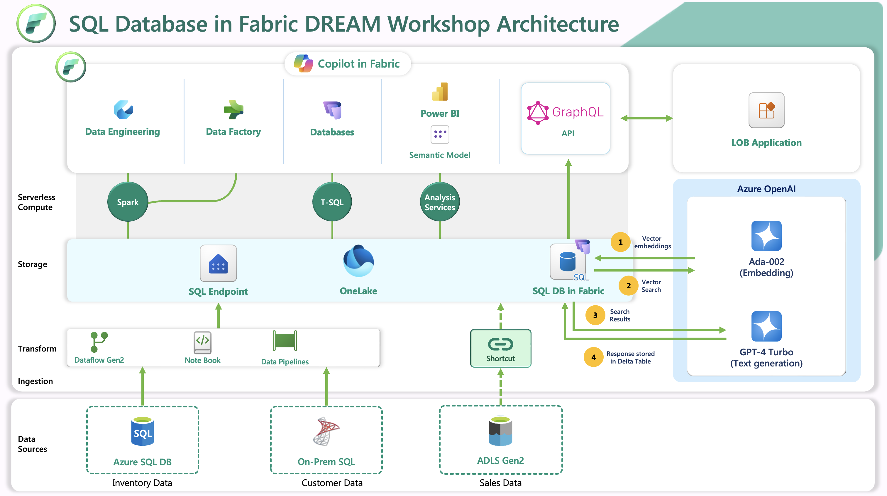

## SQL database in Microsoft Fabric DREAM workshop

Welcome to the *SQL database in Microsoft Fabric* workshop. This workshop is designed to provide you with a comprehensive understanding of SQL database in Microsoft Fabric and its integration with other services. Throughout this workshop, you will learn how to create, manage, and optimize SQL databases, as well as how to leverage artificial intelligence and build applications using GraphQL API builder.

### Contoso - Retail Company
In this workshop, we have Contoso, a large retailer with April as its new CEO. April dreams of an executive dashboard where she can see data from the past - structured, unstructured, and semi-structured - to make decisions for the present. Even more exciting, she sees real-time KPIs to make decisions for the next moment. And even more powerful, she gets predictive and prescriptive analytics to make decisions for the future.

### Challenges at Contoso
As of Jan 2025, Contoso’s KPIs are struggling due to data integration challenges. Operating expenses are very high, and sharing data across departments remains a significant hurdle. Compliance and Security alerts have skyrocketed due to improper data access control. Additionally, IT turnover is at a record high, as database admins are spending excessive time optimizing and fine-tuning the database’s OLTP workloads - emphasizing the need to streamline their efforts.

### Transforming Contoso with SQL Database in Microsoft Fabric

She talks to her VP of Engineering, Rupesh. Now, you, as a team member of Rupesh, will play a key role in transforming Contoso’s struggling KPIs. Let us see how you will use SQL Database in Microsoft Fabric, which is a developer-friendly transactional database based on the Azure SQL Database engine. It is simple, autonomous, secure by default and AI-integrated. Being part of Microsoft Fabric, it benefits from Fabric's promises and offers tight integration with other workloads within Microsoft Fabric.

With your SQL Database in Microsoft Fabric, you can easily build OLTP applications while minimizing the need to stitch together multiple services to create an end-to-end solution.

#### Security Governance
You will enable secure data sharing between departments and drive down compliance alerts. Sharing enables ease of access control and management, while security controls like row-level security (RLS), object-level security (OLS) and more, make sure you can control access to sensitive information. Sharing also enables secure and democratized decision-making across Contoso.

You will observe how, by sharing your SQL Database, you can grant other users or a group of users, access to a database without giving access to the workspace and the rest of its items. When someone shares a database, they also grant access to the SQL analytics endpoint and associated default semantic model. Like other Microsoft Fabric item types, SQL Databases rely on Microsoft Entra authentication. 

#### Data Engineering with your SQL Database in Microsoft Fabric
You will experience how Microsoft Fabric provides various data engineering capabilities, such as pipelines, data flows, to ensure that your data is easily accessible, well-organized, and of high-quality. This will help Contoso reduce data engineering expenses!

#### Data Science with your SQL Database in Microsoft Fabric
As a hands-on team member of the CDO team, you will use Data Science workload in Microsoft Fabric, which empowers users to complete end-to-end data science workflows for the purpose of data enrichment and business insights.   

#### Integration with Microsoft Fabric source control
Help reduce IT turnover, given the benefits of SQL Database being integrated with [Microsoft Fabric continuous integration/continuous development](https://learn.microsoft.com/en-us/fabric/cicd/cicd-overview). You will use the built-in git repository to manage Contoso’s SQL Database. 

#### Easily create GraphQL API for use in frontend apps
Using the Microsoft Fabric portal, you can effortlessly [create a GraphQL API](https://learn.microsoft.com/en-us/fabric/database/sql/graphql-api) for your SQL Database. This process simplifies how other users at Contoso can utilize the GraphQL API to rapidly develop their applications. 

The intuitive interface and streamlined steps make it straightforward to expose your data and build a schema, enabling seamless integration with various applications

#### Performance Dashboard
 [Microsoft Fabric Capacity Metrics app](https://learn.microsoft.com/en-us/fabric/enterprise/metrics-app) is used to monitor the SQL Database usage and consumption in non-trial Fabric capacities.

 Users are provided a one-stop view of the performance status of the database. The [Performance Dashboard](https://learn.microsoft.com/en-us/fabric/database/sql/performance-dashboard) and offers varying levels of metrics visibility and time ranges, including query-level analysis and identification. 

To summarize, here is what you will do in each exercise of this workshop,

[Exercise 1: Loading Data into SQL Database](https://github.com/microsoft/Azure-Analytics-and-AI-Engagement/blob/Fabric-SQL-Workshop/Workshop_Exercises/01%20-%20Loading%20Data%20into%20SQL%20Database.md)

[Exercise 2: Introduction to Copilot for SQL Database](https://github.com/microsoft/Azure-Analytics-and-AI-Engagement/blob/Fabric-SQL-Workshop/Workshop_Exercises/02%20-%20Introduction%20to%20Copilot%20for%20SQL%20Database.md)

[Exercise 3: Data Enrichment and Transformation](https://github.com/microsoft/Azure-Analytics-and-AI-Engagement/blob/Fabric-SQL-Workshop/Workshop_Exercises/03%20-%20Data%20Enrichment.md)

[Exercise 4: Data Serving](https://github.com/microsoft/Azure-Analytics-and-AI-Engagement/blob/Fabric-SQL-Workshop/Workshop_Exercises/04%20-%20Data%20Serving.md)

[Exercise 5: Exploring GraphQL API Endpoints in Microsoft Fabric](https://github.com/microsoft/Azure-Analytics-and-AI-Engagement/blob/Fabric-SQL-Workshop/Workshop_Exercises/05%20-%20Exploring%20GraphQL%20API%20Endpoints%20in%20Microsoft%20Fabric.md)

[Exercise 6: RAG Implementation with Azure OpenAI](https://github.com/microsoft/Azure-Analytics-and-AI-Engagement/blob/Fabric-SQL-Workshop/Workshop_Exercises/06-%20RAG%20Implementation%20with%20Azure%20OpenAI.md)

[Exercise 7: Data Security and Compliance](https://github.com/microsoft/Azure-Analytics-and-AI-Engagement/blob/Fabric-SQL-Workshop/Workshop_Exercises/07%20-%20Data%20Security%20and%20Compliance.md)

[Exercise 8: Managing Production Workloads](https://github.com/microsoft/Azure-Analytics-and-AI-Engagement/blob/Fabric-SQL-Workshop/Workshop_Exercises/08%20-%20Managing%20Production%20Workloads.md)
