### Exercise 2: Introduction to Copilot for SQL Database

In this exercise, you will use **Copilot** to assist with T-SQL queries, including **auto-suggestions**, **fixing error**, and **natural language query**, again contributing to Contoso developer efficiency!

#### Task 2.1: Use Copilot in SQL Database

#### Activity: Write SQL queries in the SQL query editor in Microsoft Fabric

1. Click on **Workspaces** from the left navigation pane and select the **Fabcon** workspace.


2. Search for **database** and select the database created in the previous task.


3. Click on the **Refresh** button then click on the **New Query** icon.


4. Paste the query ```SELECT * FROM dimcustomer```, click on the **Run** icon and then check the output.

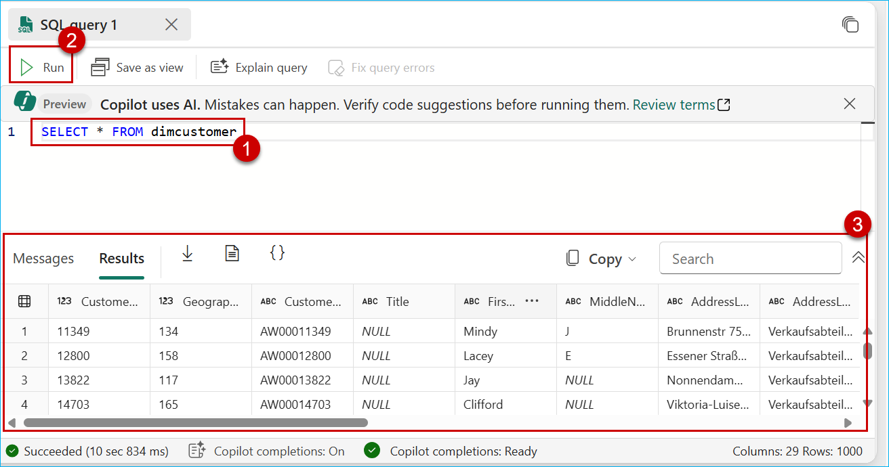

5. In the **Query Editor**, paste the query ```SELECT TOP(10) ``` and observe how Copilot suggests code to complete your query.

>**Note:** Copilot responses may not match what is shown in the screenshot but will provide similar results.

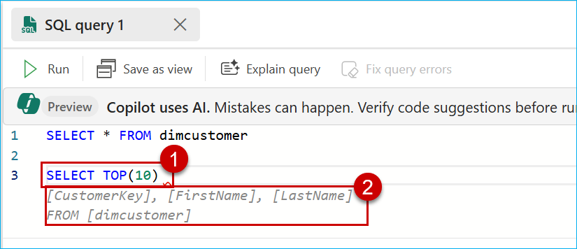

6. Press the **Tab** key on your keyboard to accept the suggestion or continue typing to ignore it.

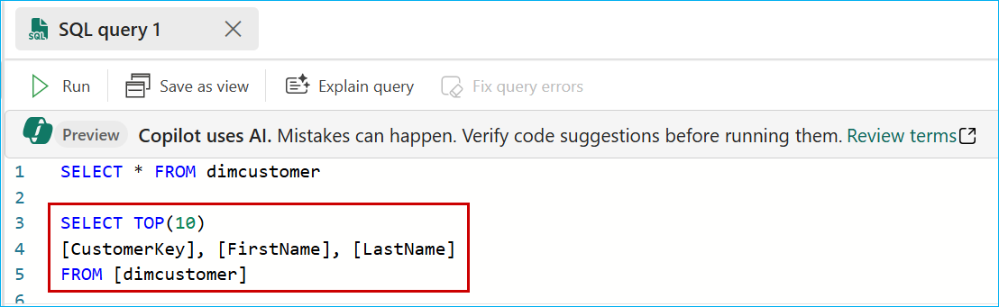

7. Select the query and click on the **Run** icon.

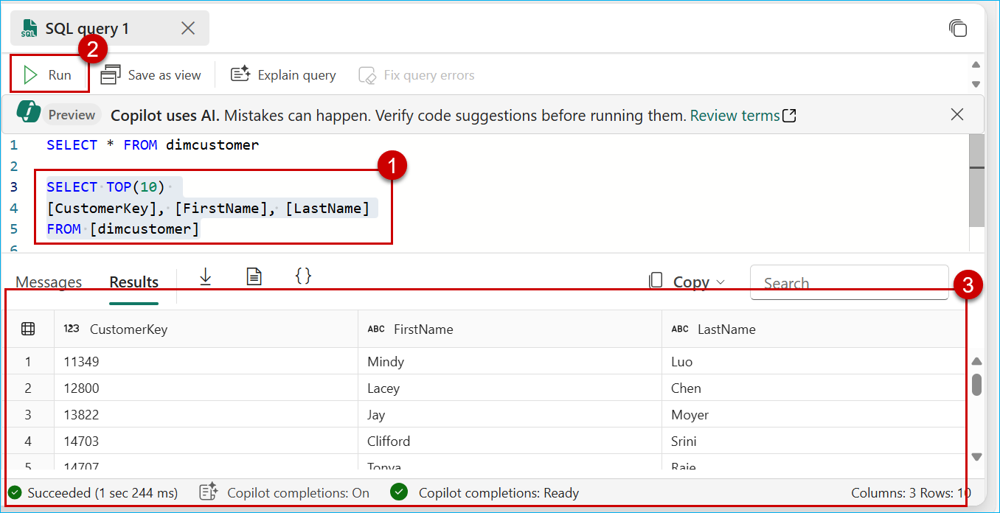


### Task 2.2: Fixing errors with Quick Actions

1. Paste the following query with a syntax error and click on the **Run** icon.

```
SELECT d.CalendarYear, SUM(f.SalesAmount) AS TotalSalesAmount
FROM dbo.factinternetsales f
JOIN dbo.dimdate d ON f.OrderDateKey = d.DateKey
GROUP BY d.CalYear
ORDER BY d.CalendarYear;

```
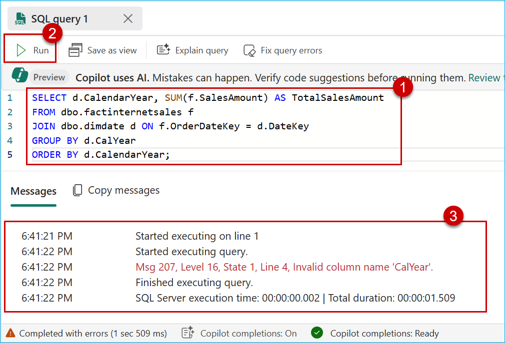

2. Click on **Fix query errors** and observe the updated query along with the comment that clearly states where the issue was in the query. Then, click on **Run** to see the results.

>**Note:** Copilot responses may not match what is shown in the screenshot but will provide similar results.

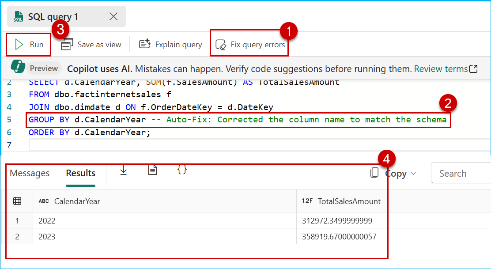

### Task 2.3: Chat Pane : Natural Language to SQL

1. Click on the **Copilot** option.

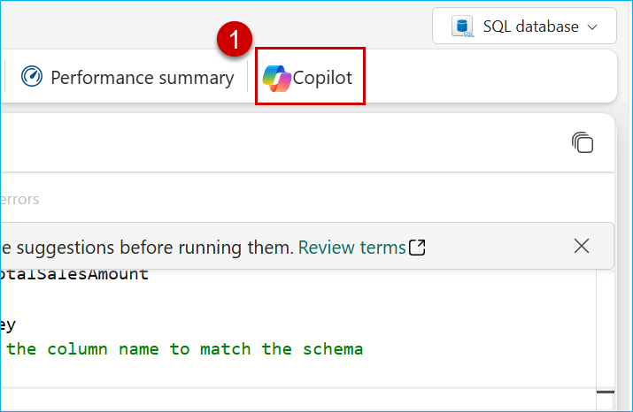

2. Click on the **Get started** button.

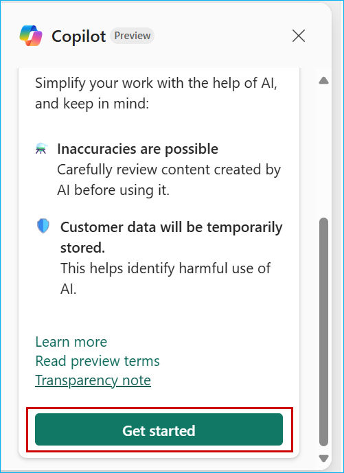

3. Paste the following question in the **Copilot** chat box and click on **Send**.

```
What is the most sold product?

```
>**Note:** Copilot responses may not match what is shown in the screenshot but will provide similar results.

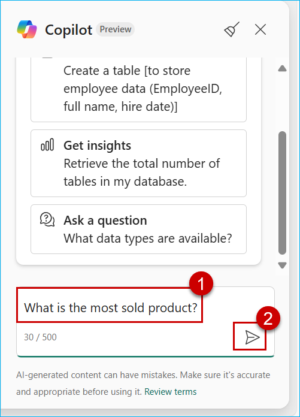

4. Click on the **Insert** button.

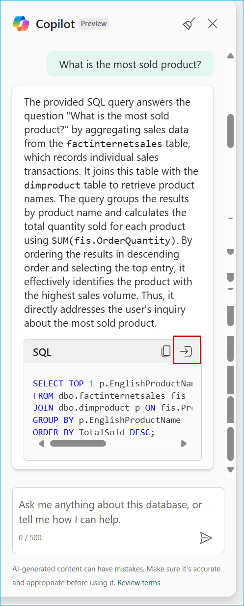

5. Select the query that was inserted by Copilot, click on the **Run** icon and check the **Results**.

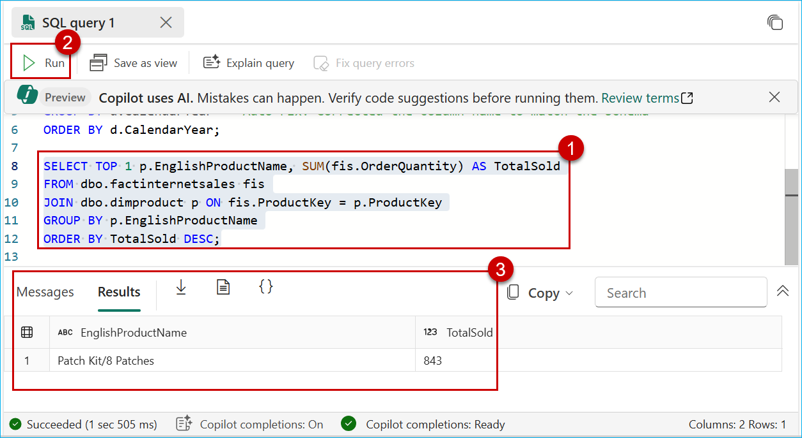

6. Paste the following question in the Copilot chat box and click on **Send**.

>**Note:** Copilot responses may not match what is shown in the screenshot but will provide similar results.

```
Who are the top 5 customers by total sales amount?

```

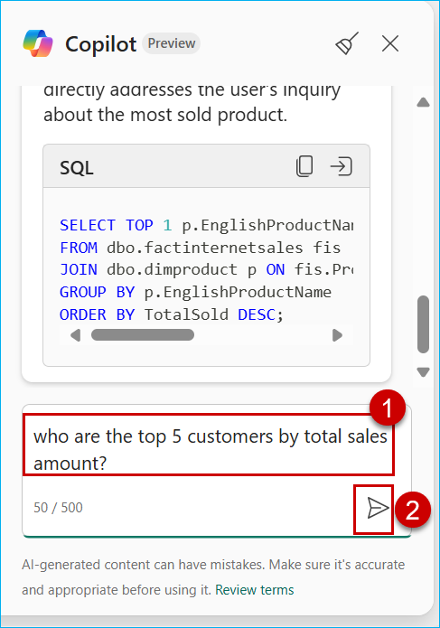

7. Click on the **Insert** button.

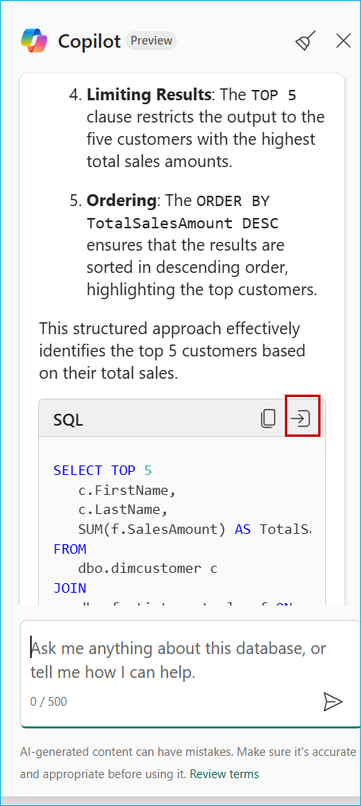

8. Select the query that was inserted by Copilot, click on the **Run** icon and check the **Results**.

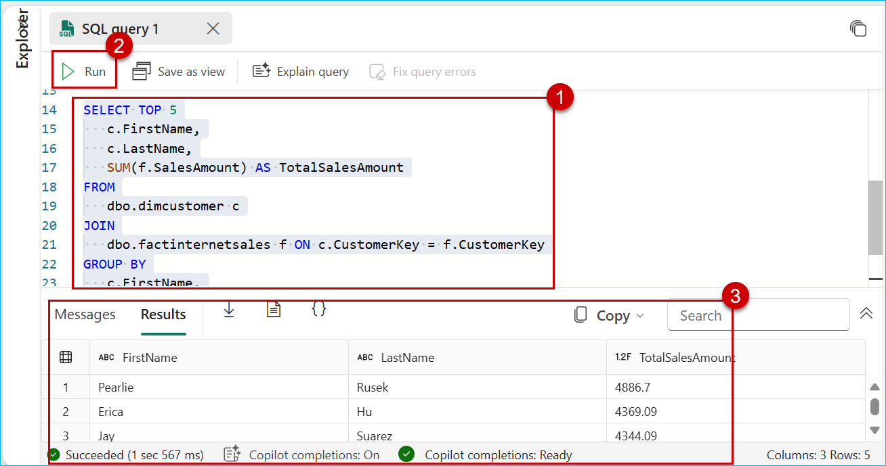

Congratulations! You have learned how to leverage **Copilot** for SQL Database in Microsoft Fabric to enhance your **query-writing** experience. With these skills, you are now better equipped to write SQL queries faster and troubleshoot errors effectively using Copilot. You are ready to move on to the next exercise: [Data Enrichment and Transformation](https://github.com/microsoft/Azure-Analytics-and-AI-Engagement/blob/Fabric-SQL-Workshop/Workshop_Exercises/03%20-%20Data%20Enrichment.md)
