## Exercise 5: Exploring GraphQL API Endpoints in Microsoft Fabric

In this exercise, you will build a **GraphQL API** in Microsoft Fabric and integrate its **endpoint** into an application. The key benefit here is that the creation of GraphQL API itself is super-efficient, given that you do not even need to create a GraphQL server, amazing right? And once GraphQL API is ready, it is available for easy consumption across the entire enterprise for app creation! Data integration challenges will be transformed like never before in Contoso!

---
>**Note:** Follow the steps provided in the task below. The Click-by-Click is available as a backup option in case of any technical issues preventing you from performing the lab in the actual environment.Before starting this exercise, open a backup Click-by-Click using the following hyperlink in a new tab, then return to the browser.
[Click-by-Click](https://regale.cloud/Microsoft/play/4473/05-exploring-graphql-api-endpoints-in-microsoft-fabric#/0/0)
---


### Task 5.1: Create GraphQL API Endpoints

#### Activity: Create an API for GraphQL

We can start building GraphQL APIs directly from within the Microsoft Fabric SQL query editor. Microsoft Fabric builds the GraphQL schema automatically based on data, and applications are ready to connect in minutes.

Let's first create a view using a simple analytical T-SQL query. The new view, ``SupplyChain.vProductsbySuppliers``, will be used for the GraphQL API.

1. Click on **Workspaces** and select the **Fabcon** workspace.


> **Note:** When the Unsaved changes pop-up appears, select Don't Save.

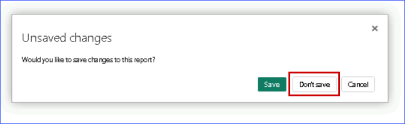

2. Search for **database** and select the **Fabcon_database**.

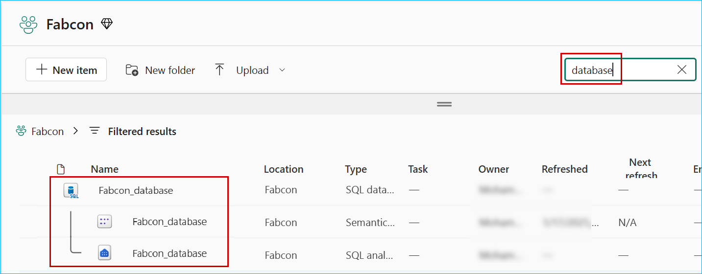

>**Note:** Clear any filters related to Sematic model from the filter section.

3. In the **SQL Database**, click on **New Query** and **Copy** the following T-SQL script and paste it in the query window.

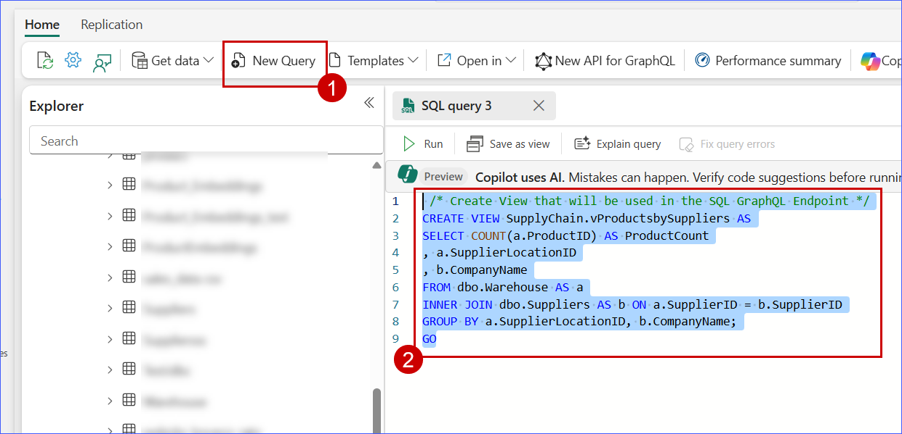

```
 /* Create View that will be used in the SQL GraphQL Endpoint */
CREATE VIEW dbo.vProductsbySuppliers AS
SELECT COUNT(a.ProductID) AS ProductCount
, a.SupplierLocationID
, b.CompanyName
FROM dbo.inventory AS a
INNER JOIN dbo.Suppliers AS b ON a.SupplierID = b.SupplierID
GROUP BY a.SupplierLocationID, b.CompanyName;
GO
```

4. Click on the **Run** button, expand views under Fabcon_database to verify that ``vProductsbySuppliers`` has been created successfully.

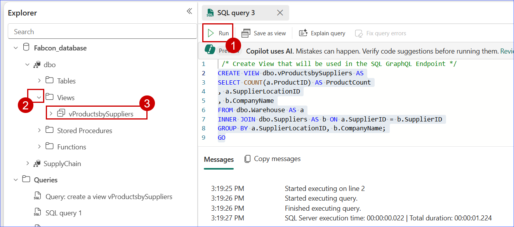

5. Click on the **New API for GraphQL** button in the toolbar.

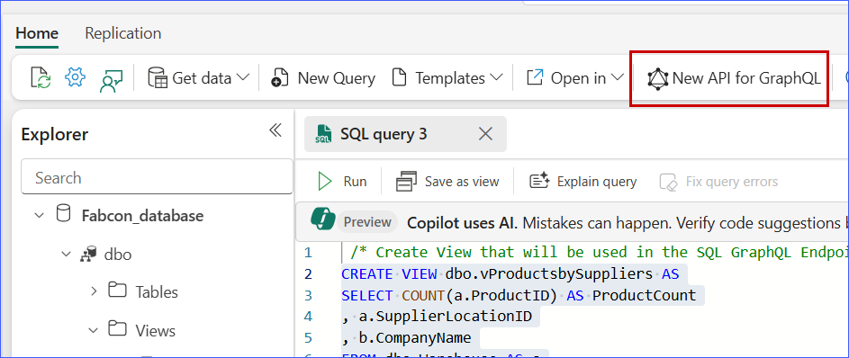


6. Enter ``supplier_impact_gql`` in the **Name** field and click on the **Create** button.

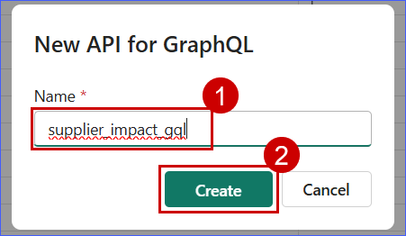


#### Activity: Write and test GraphQL queries to retrieve data

At this point, the API is ready but it's not exposing any data. APIs for GraphQL are defined in a schema organized in terms of types and fields, in a strongly typed system. Microsoft Fabric automatically generates the necessary GraphQL schema based on the data you choose to expose to GraphQL clients.

1. The **Choose data** screen enables you to search for and choose the objects to expose your GraphQL schema. Enter ``vProductsbySuppliers`` in the search bar, select the checkbox next to ``dbo.vProductsbySuppliers``, and click on the **Load** button.

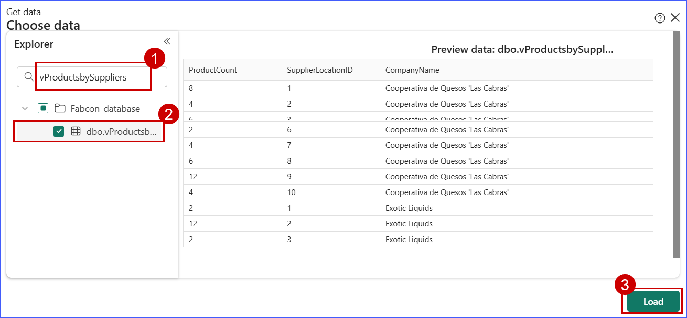

The schema is generated, and you can start prototyping GraphQL queries (read, list) or mutations (create, update, delete) to interact with your data. The following image shows the **Schema explorer** with an API call template.

2. In the ``Query1`` panel, replace the text you see there with the following GraphQL query string:

```
query { vProductsbySuppliers(filter: { SupplierLocationID: { eq: 7 } }) { items { CompanyName SupplierLocationID ProductCount } } }

```

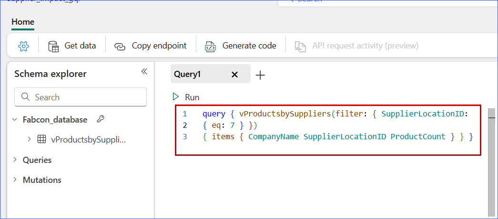

3. Click the **Run** button in the **Query1** window. The **results** of the GraphQL query are returned to the Results window in JSON format.

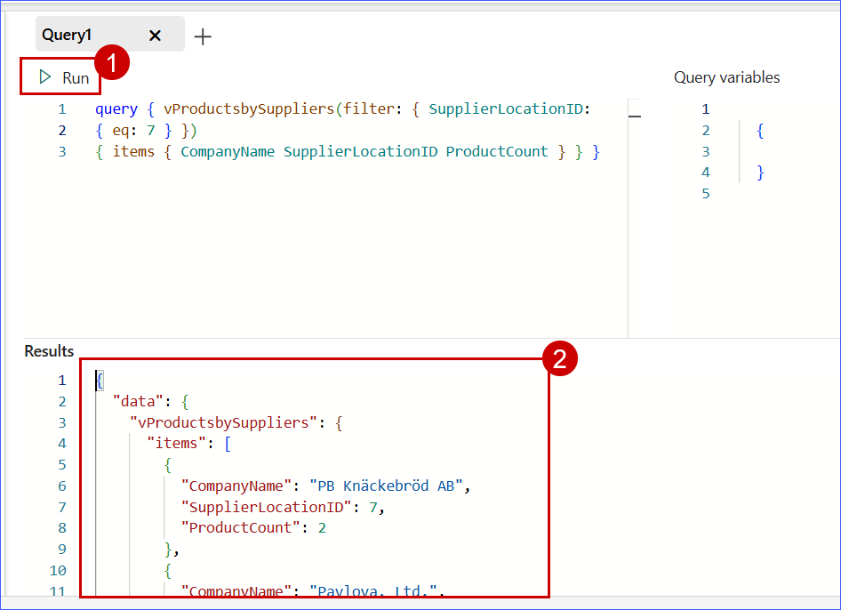


### Task 5.2: Query GraphQL API Endpoints using web application

#### Activity: Generate a GraphQL endpoint from the SQL Database.


1. Click on the **Copy endpoint** button in the ribbon.

2. Click on the **Copy** button when the **Copy link** panel appears. Store this string in a notepad or other location to be used in the sample application for this tutorial. For example, it will look similar to: ``https://api.fabric.microsoft.com/v1/workspaces/<work space id>/graphqlapis/<graph api id>/graphql``

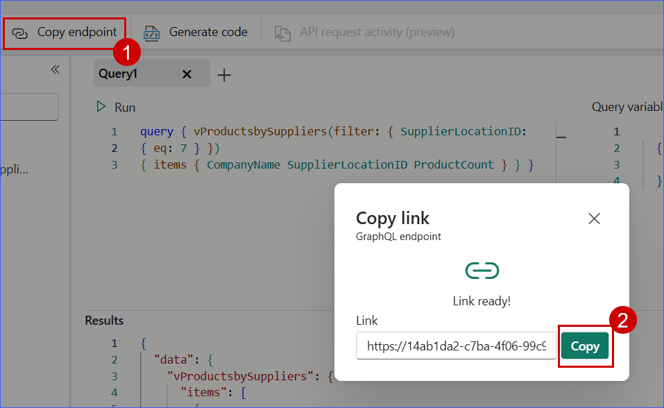

Your API for GraphQL is now ready to accept connections and requests. You can use the API editor to test and prototype GraphQL queries and the Schema explorer to verify the data types and fields exposed in the API.

#### Activity: Use the Endpoint in an existing application for Dynamic Data Access.

You have been asked to create an application that shows all affected Suppliers if a Location has a supply chain break due to natural disasters or other interruptions. This code shows how to create an ASP.NET application that uses a GraphQL Query to access a Query in the SQL in Microsoft Fabric GraphQL endpoint you created in the previous task.

1. Please install the appropriate .NET SDK for your operating system if you haven't already installed it on your machine.

[.NET SDK link](https://dotnet.microsoft.com/download)

2. Please install Azure CLI for your operating system.

[MSI Azure CLI (windows) link](https://learn.microsoft.com/en-us/cli/azure/install-azure-cli-windows?pivots=msi)

[Azure CLI (macOS) link](https://learn.microsoft.com/en-us/cli/azure/install-azure-cli-macos)

> **Note:** Please ensure that the .NET SDK and Azure CLI are installed before proceeding to the next steps.

3. Once you have the .NET SDK and Azure CLI installed, open **PowerShell ISE**.

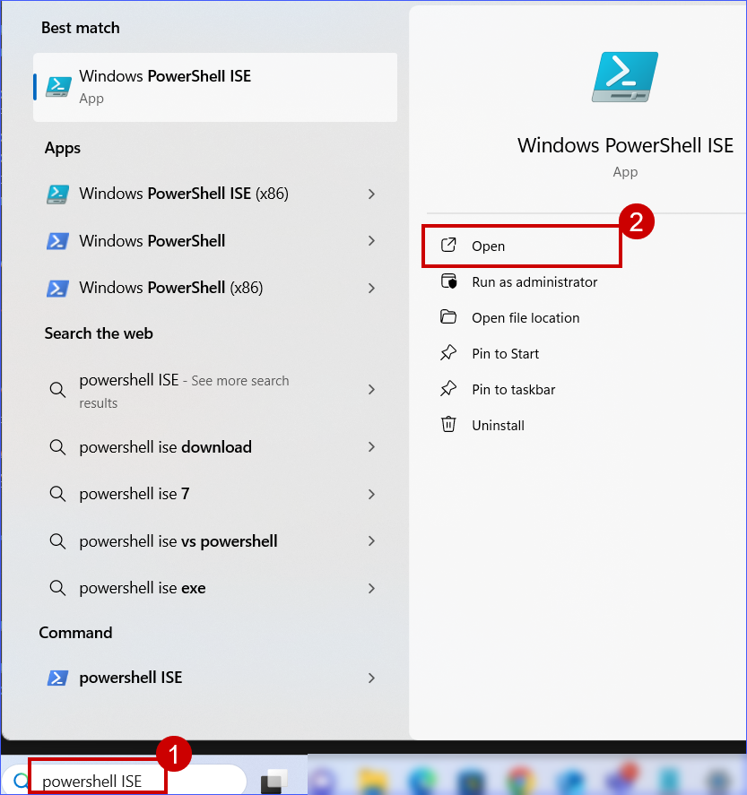

4. Click on **New script** from the ribbon and paste the following **PowerShell** script then click on the **Run** button.

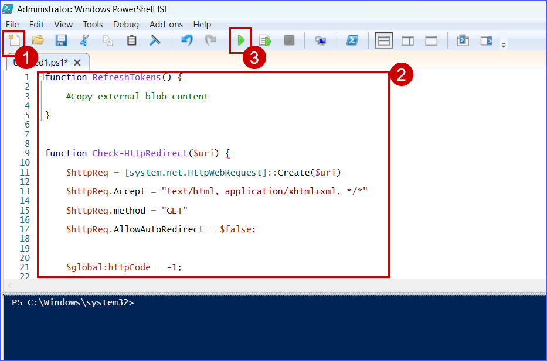

```
function RefreshTokens() {
    #Copy external blob content
}

function Check-HttpRedirect($uri) {
    $httpReq = [system.net.HttpWebRequest]::Create($uri)
    $httpReq.Accept = "text/html, application/xhtml+xml, */*"
    $httpReq.method = "GET"   
    $httpReq.AllowAutoRedirect = $false;

    $global:httpCode = -1;

    $response = "";            

    try {
        $res = $httpReq.GetResponse();

        $statusCode = $res.StatusCode.ToString();
        $global:httpCode = [int]$res.StatusCode;
        $cookieC = $res.Cookies;
        $resHeaders = $res.Headers;  
        $global:rescontentLength = $res.ContentLength;
        $global:location = $null;
                            
        try {
            $global:location = $res.Headers["Location"].ToString();
            return $global:location;
        }
        catch {
        }

        return $null;

    }
    catch {
        $res2 = $_.Exception.InnerException.Response;
        $global:httpCode = $_.Exception.InnerException.HResult;
        $global:httperror = $_.exception.message;

        try {
            $global:location = $res2.Headers["Location"].ToString();
            return $global:location;
        }
        catch {
        }
    } 

    return $null;
    }

#az copy

#download azcopy command
if ([System.Environment]::OSVersion.Platform -eq "Unix") {
    $azCopyLink = Check-HttpRedirect "https://aka.ms/downloadazcopy-v10-linux"

    if (!$azCopyLink) {
        $azCopyLink = "https://azcopyvnext.azureedge.net/release20200709/azcopy_linux_amd64_10.5.0.tar.gz"
    }

    Invoke-WebRequest $azCopyLink -OutFile "azCopy.tar.gz"
    tar -xf "azCopy.tar.gz"
    $azCopyCommand = (Get-ChildItem -Path ".\" -Recurse azcopy).Directory.FullName

    if ($azCopyCommand.count -gt 1) {
        $azCopyCommand = $azCopyCommand[0];
    }

    cd $azCopyCommand
    chmod +x azcopy
    cd ..
    $azCopyCommand += "\azcopy"
} else {
    $azCopyLink = Check-HttpRedirect "https://aka.ms/downloadazcopy-v10-windows"

    if (!$azCopyLink) {
        $azCopyLink = "https://azcopyvnext.azureedge.net/release20200501/azcopy_windows_amd64_10.4.3.zip"
    }

    Invoke-WebRequest $azCopyLink -OutFile "azCopy.zip"
    Expand-Archive "azCopy.zip" -DestinationPath ".\" -Force
    $azCopyCommand = (Get-ChildItem -Path ".\" -Recurse azcopy.exe).Directory.FullName

    if ($azCopyCommand.count -gt 1) {
        $azCopyCommand = $azCopyCommand[0];
    }

    $azCopyCommand += "\azcopy"
}

$endpoint =  Read-Host "Enter your GraphQL endpoint"


& $azCopyCommand copy "https://stfabcon.blob.core.windows.net/dotnet/Program.cs.txt" "./" --recursive
& $azCopyCommand copy "https://stfabcon.blob.core.windows.net/dotnet/contoso.png" "./" --recursive

(Get-Content -path Program.cs.txt -Raw) | Foreach-Object { $_ `
            -replace '#ReplaceWithYourGraphQLEndpointAddress#', $endpoint`
    } | Set-Content -Path Program.cs.txt


dotnet new webapp -n GraphQLWebApp
cd GraphQLWebApp
dotnet add package Azure.Identity
dotnet add package GraphQL
dotnet add package GraphQL.Client
dotnet add package GraphQL.Client.Serializer.Newtonsoft

Get-Content -Path "../Program.cs.txt" -Raw | Set-Content -Path "./Program.cs"

cp "../contoso.png" ".\wwwroot\contoso.png"

az login --use-device-code

dotnet run

```

5. You'll be prompted to enter the endpoint that you copied in earlier step. Paste it into the **PowerShell** and press **Enter**.

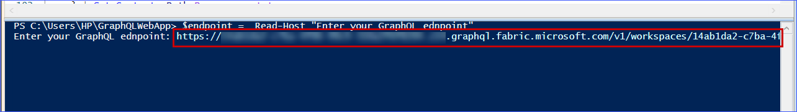

6. Browse the **URL** (https://microsoft.com/devicelogin) in another tab of your browser and copy the **code**.

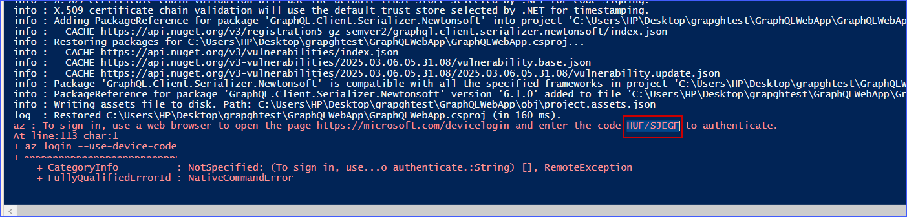

7. Paste the **code** and click on the **Next** button.

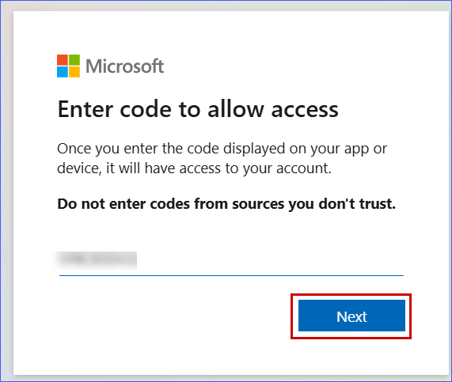

8. Select the **Azure account** to sign in.

>**Note:** Ensure to use only the Azure credentials provided in the workshop to log in.

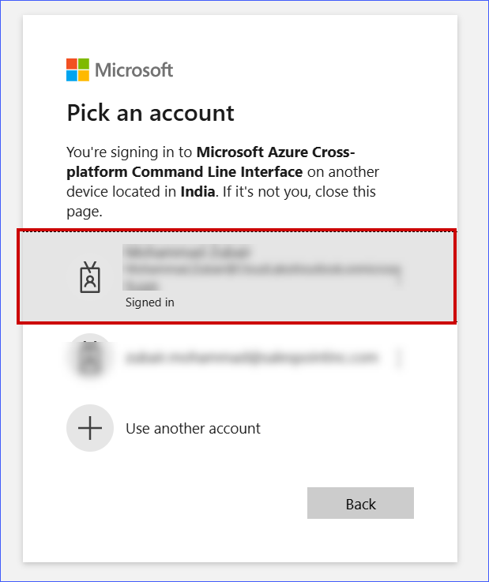

9. Click on the **Continue** button.

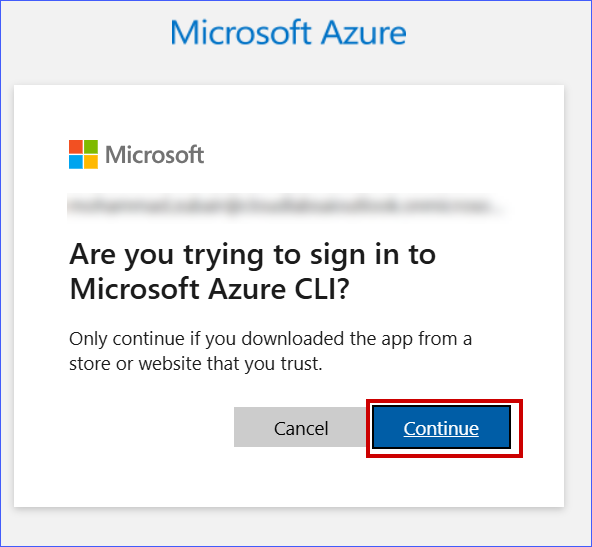

10. When you see the below screenshot, close the tab of your browser and go back to the **Powershell**.

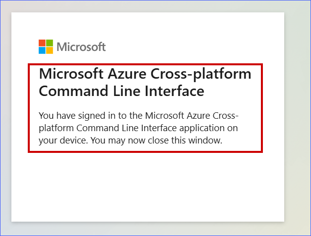

<!--

6. You'll be prompted to log in. Enter the credentials provided with the lab and click on the **Next** button to log in.

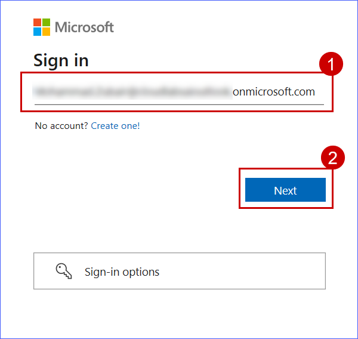

>**Note:** On the next screen, you'll be prompted to enter your password provided with the lab.

-->

11. After successful login, a localhost URL will be generated. Copy that URL.

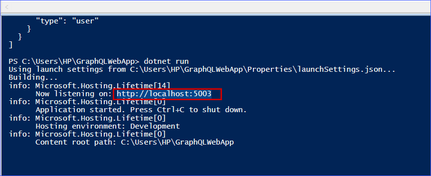

12. Paste the copied link into your web browser, enter the **Location ID** as **7**, and click on the **Search** button.

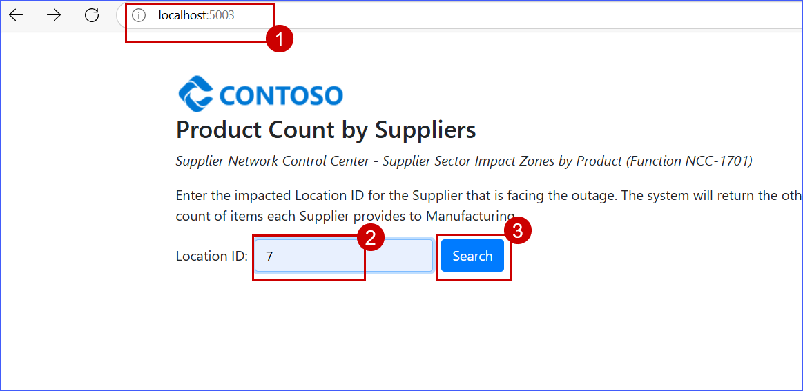

13. Observe the response.

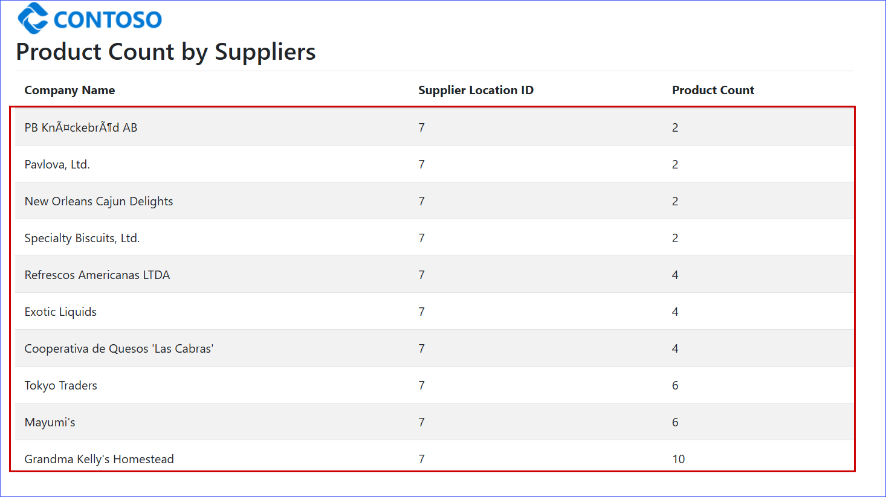


Congratulations! You have successfully worked with GraphQL API endpoints to enhance data access and retrieval.

Through this exercise, you have learned how to:

- Create and expose GraphQL APIs for seamless data interaction.
- Generate GraphQL endpoints from a SQL Database for flexible querying.
- Integrate GraphQL endpoints into a web application for dynamic and efficient data access.

With these skills, you can now build and integrate GraphQL APIs to create more responsive applications! You are ready to move on to the next exercise: [RAG Implementation with Azure OpenAI](https://github.com/microsoft/Azure-Analytics-and-AI-Engagement/blob/Fabric-SQL-Workshop/Workshop_Exercises/06-%20RAG%20Implementation%20with%20Azure%20OpenAI.md)