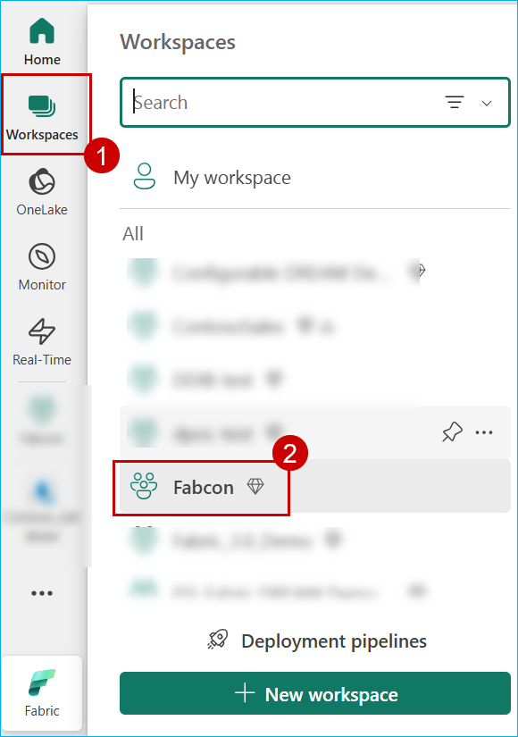
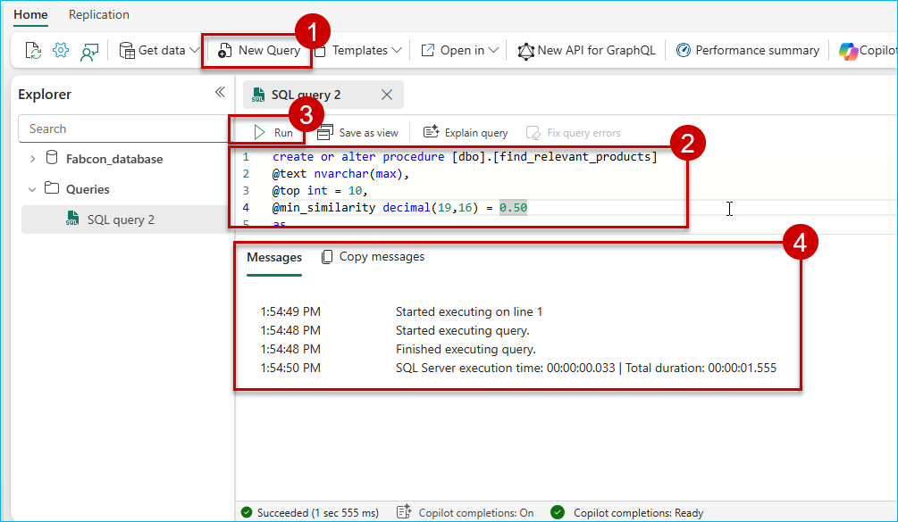

## Exercise 6: RAG Implementation with Azure OpenAI

Contoso developers have been tasked with creating an online shopping copilot for their website in a very short time. So, how can you help achieve that? Well, in this exercise, you will implement a **Retrieval-Augmented Generation (RAG) system** in Microsoft Fabric. You will use a **Microsoft Fabric SQL Database** as the **vector store**, Azure OpenAI ada-002 for **text embeddings**, and the GPT-4 model to enhance **natural language queries and responses**. This way, you will help Contoso implement a personal shopper like experience on their online website!

---
>**Note:** Follow the steps provided in the task below. The Click-by-Click is available as a backup option in case of any technical issues preventing you from performing the lab in the actual environment. Before starting this exercise, open a backup Click-by-Click using the following hyperlink in a new tab, then return to the browser.[Click-by-Click](https://regale.cloud/Microsoft/play/4457/06-rag-implementation-with-azure-openai#/0/0)

---

### Activity: Get model URLS

1. Open a new tab and go to **https://portal.azure.com/**, search for **Azure OpenAI** in the search bar, then select the result.


2. Click on the **OpenAI** resource.

> **Note**: You will have suffix added to the resource name. Example: OpenAI6782.


3. Expand **Resource Management**, go to **Keys and Endpoint**, click on **Copy icon** next to Endpoint. Store the value and replace it wherever {endpointurl} appears in following exercise.

4. Click on **Copy icon** next to 'KEY 1'. Store the value and replace it wherever {endpointkey} appears in following exercise.


### Task 6.1: AI-Powered Recommendations with Vector Search

Let us implement RAG-pattern with Microsoft Fabric SQL Database, which now has the dedicated vector data type. This allows for efficient and optimized storing of vector data, and comes with a set of functions to help developers streamline vector and similarity search implementation. The Azure OpenAI ada-002 model can be easily consumed within Microsoft Fabric SQL Database using the sp_invoke_external_rest_endpoint system stored procedure, to tranform data into embeddings.

1. Click on **Workspaces** and select the **Fabcon** workspace.



2. Click on **Fabcon_database** 


3.  Click on **New Query**, paste the query below, and then click on **Run**.

The code first establishes a master key for encryption purposes, then creates a credential that allows the Microsoft Fabric SQL Database to authenticate with the Azure OpenAI endpoint using an API key. Finally, it queries the system catalog to confirm the creation of the credential.

> **Note:** You can provide your own password instead of Smoothie@123 in the following code.

> **Note:** Replace {endpointurl} and {endpointkey} with the copied values from earlier. Remove the curly brackets {} while replacing values.

```
-- Create a master key for encryption with the specified password
CREATE MASTER KEY ENCRYPTION BY PASSWORD = 'Smoothie@123';

-- Create a database scoped credential for accessing a specific HTTPS endpoint
CREATE DATABASE SCOPED CREDENTIAL [{endpointurl}] 
WITH IDENTITY = 'HTTPEndpointHeaders',
 SECRET = '{"api-key": "{endpointkey}"}';

-- Retrieve information about the database scoped credential with the specified name
SELECT * 
FROM sys.database_scoped_credentials
WHERE name = '{endpointurl}';

```


4. Click on **New Query**, paste the query below, and then click on **Run**.

This SQL stored procedure is designed to interact with Azure OpenAI endpoint to get embeddings for a given search query using the text-embedding-ada-002 model. It utilizes the database scoped credential for authentication, ensuring secure access to the external service.

> **Note:** Replace {endpointurl} and {endpointkey} with the copied values from earlier. Remove the curly brackets {} while replacing values.

```
create or alter procedure [dbo].[get_embedding]
@inputText nvarchar(max),
@embedding vector (1536) output
as
begin try
    declare @retval int;
    -- Create a JSON payload with the search query
    declare @payload nvarchar(max) = json_object('input': @inputText);
    declare @response nvarchar(max)
    -- Define headers for the REST API call
    DECLARE @headers NVARCHAR(MAX) = JSON_OBJECT(
    'Content-Type': 'application/json',
    'api-key': '{endpointkey}' 
);
    -- Call the external REST API to get text embeddings
    exec @retval = sp_invoke_external_rest_endpoint
        @url = '{endpointurl}openai/deployments/text-embedding-ada-002/embeddings?api-version=2023-05-15',
        @method = 'POST',
        @credential = [{endpointurl}],
        @payload = @payload,
        @response = @response output;
end try
begin catch
    -- Handle any errors that occur during the execution
    select 
        'SQL' as error_source,
        error_number() as error_code,
        error_message() as error_message
    return;
end catch

if (@retval != 0) begin
    -- If the API call returns an error, handle it
    select 
        'OPENAI' as error_source,
        json_value(@response, '$.result.error.code') as error_code,
        json_value(@response, '$.result.error.message') as error_message,
        @response as error_response
    return;
end;

-- Extract the embedding data from the API response
declare @re nvarchar(max)= json_query(@response, '$.result.data[0].embedding')
-- Set the output parameter with the extracted embedding data
set @embedding = cast(@re as vector(1536));

```


5. Click on **New Query**, paste the query below, and then click on **Run**.

This code declares a cursor to iterate through products in the dbo.dim_products table. It generates an embedding for each of the products using the stored procedure created in previous step (dbo.get_embedding), and inserts the results into the dbo.Product_Embeddings table.

```
-- Create a table named Product_Embeddings to hold product names, descriptions, and embeddings
CREATE TABLE dbo.Product_Embeddings (
    ProductName NVARCHAR(MAX),
	Description NVARCHAR (MAX),
    EmbeddedName VECTOR(1536)
);

-- Create a table named ChatMessages to store chat message details
CREATE TABLE dbo.ChatMessages (
    MessageID INT IDENTITY(1,1) PRIMARY KEY,
    UserSessionID UNIQUEIDENTIFIER,
    MessageType NVARCHAR(10),  -- 'User' or 'AI'
    MessageText NVARCHAR(MAX),
    CreatedAt DATETIME DEFAULT GETDATE()
);

-- Declare variables to store product name, description, and embedding
DECLARE @ProductName NVARCHAR(MAX);
DECLARE @Description NVARCHAR(MAX);
DECLARE @Embedding VECTOR(1536);

-- Declare a cursor to iterate over product names and descriptions
DECLARE ProductCursor CURSOR FOR
SELECT ProductName, Description
FROM dbo.dim_products;

OPEN ProductCursor;

FETCH NEXT FROM ProductCursor INTO @ProductName, @Description;

WHILE @@FETCH_STATUS = 0
BEGIN
    -- Call the get_embedding procedure to get the embedding for the product name
    EXEC [dbo].[get_embedding]
        @inputText = @ProductName,
        @embedding = @Embedding OUTPUT;

    -- Store the product name, description, and embedding in the Product_Embeddings table
    INSERT INTO dbo.Product_Embeddings (ProductName, Description, EmbeddedName)
    VALUES (@ProductName, @Description, @Embedding);

    -- Fetch the next row
    FETCH NEXT FROM ProductCursor INTO @ProductName, @Description;
END;

CLOSE ProductCursor;
DEALLOCATE ProductCursor;

```


6. Click on **New Query**, paste the following query in the query editor, and then click on **Run**.

The SQL command **SELECT * FROM dbo.Product_Embeddings** will retrieve all the data from the Product_Embeddings table.

```
SELECT * FROM dbo.Product_Embeddings;

```


7. Click on **New Query**, paste the following query in the query editor, and then click on **Run**.

Below query processes the user's text input to extract product keywords and invokes Azure OpenAI endpoint to generate vector embedding for the same. This vector is then compared with the embeddings from the dbo.Product_Embeddings table, to find the top 10 products based on their similarity (vector_distance function).

> **Note:** Replace {endpointurl} with the copied values from earlier. Remove the curly brackets {} while replacing values.

```
CREATE OR ALTER PROCEDURE [dbo].[find_relevant_products]
@text NVARCHAR(MAX),
@top INT = 10,
@min_similarity DECIMAL(19,16) = 0.50,
@JsonResults NVARCHAR(MAX) OUTPUT
AS
BEGIN
    -- Check if the search query is NULL, if so, exit the procedure
    IF (@text IS NULL) RETURN;

    DECLARE @RefinedQuery NVARCHAR(MAX);
    DECLARE @LLMResponse NVARCHAR(MAX);
    DECLARE @LLMRetval INT;
    DECLARE @LLMPayload NVARCHAR(MAX);

    -- Prepare the payload for the Language Model API call
    SET @LLMPayload = 
    N'{
        "model": "gpt-4",
        "messages": [
            {
                "role": "system",
                "content": "You are an assistant that extracts the core product keyword(s) from a user''s query."
            },
            {
                "role": "user",
                "content": "Extract the key product name or keywords from the following query: ' 
                + REPLACE(@text, '"', '\"') + '"
            }
        ],
        "temperature": 0.5,
        "max_tokens": 20
    }';

    -- Call the external REST endpoint to interact with the Language Model
    EXEC @LLMRetval = sp_invoke_external_rest_endpoint
         @url = '{endpointurl}openai/deployments/gpt-4/chat/completions?api-version=2024-08-01-preview',
         @method = 'POST',
         @credential = [{endpointurl}],
         @payload = @LLMPayload,
         @response = @LLMResponse OUTPUT;

    -- Extract the refined query from the LLM response JSON
    SET @RefinedQuery = JSON_VALUE(@LLMResponse, '$.result.choices[0].message.content');

    -- If the refined query is NULL or empty, use the original search query
    IF (@RefinedQuery IS NULL OR LEN(@RefinedQuery) = 0)
        SET @RefinedQuery = @text;


    DECLARE @retval INT, @qv VECTOR(1536);

    -- Call the get_embedding stored procedure to get the embedding for the refined query
    EXEC @retval = dbo.get_embedding @RefinedQuery, @qv OUTPUT;

    -- If an error occurred in get_embedding, exit the procedure
    IF (@retval != 0) RETURN;

    -- Retrieve the top similar product embeddings based on the query embedding
    WITH cteSimilarEmbeddings AS (
        SELECT TOP(@top)
            pe.ProductName AS ProductName,
            pe.Description AS Description,
            vector_distance('euclidean', pe.[EmbeddedName], @qv) AS distance
        FROM dbo.Product_Embeddings pe
        ORDER BY distance
    )

    -- Select the relevant product information in JSON format based on similarity threshold
    SELECT @JsonResults = (
        SELECT 
            p.ProductName AS ProductName
        FROM cteSimilarEmbeddings se
        INNER JOIN dbo.dim_products p ON se.ProductName = p.ProductName
        WHERE 1 - distance >= @min_similarity
        ORDER BY distance
        FOR JSON AUTO, ROOT('search_results')
    );
END;

```



### Task 6.2: AI-Powered Natural Language result processing

Let's use the natural language understanding and reasoning capabilities of the LLM to analyzes the results and generate a response. We will query our Microsoft Fabric SQL Database, then send the result to Azure OpenAI GPT-4 to generate a response in well formatted natural language chat messages.

1. Click on **New Query**, paste the following query in the query editor, and then click on **Run**.

The code is designed to process a natural language response generated by the Azure OpenAI GPT-4 model call. The response is splitted into lines based on a specified delimiter. This approach is useful for handling multi-line responses in applications that involve conversational AI or chat interfaces within the SQL database in Microsoft Fabric.

> **Note:** Replace {endpointurl} with the copied values from earlier. Remove the curly brackets {} while replacing values.

```
CREATE OR ALTER PROCEDURE dbo.get_ai_response
@UserSessionID UNIQUEIDENTIFIER,
@UserQuery NVARCHAR(MAX),
@AIResponse NVARCHAR(MAX) OUTPUT
AS
BEGIN
    DECLARE @SearchResults NVARCHAR(MAX);

    -- Step 1: Fetch relevant products
    EXEC dbo.find_relevant_products @UserQuery, 10, 0.50, @SearchResults OUTPUT;

    -- Step 2: Ensure @SearchResults is not NULL or empty
    IF @SearchResults IS NULL OR LEN(@SearchResults) = 0
        SET @SearchResults = '{"search_results":[]}';  -- Prevent NULL errors

    DECLARE @CleanSearchResults NVARCHAR(MAX);
    SET @CleanSearchResults = REPLACE(@SearchResults, '"', '\"');

    -- Debugging: Display the search results before making API call
    -- SELECT @SearchResults AS DebugSearchResults;

    -- Step 3: Construct JSON payload correctly
    DECLARE @Payload NVARCHAR(MAX);
    SET @Payload = 
    N'{
        "model": "gpt-4",
        "messages": [
            {
                "role": "system",
                "content": "You are a helpful assistant providing structured product summaries in a clean, readable format. Use bullet points, avoid excessive markdown (like ### or ***), and remove redundant blank lines. Make responses interactive by encouraging the user to choose."
            },
            {
                "role": "user",
                "content": "Based on the following product search results, generate a structured yet conversational summary with emojis, bullet points, and minimal empty lines:\n\n' + @CleanSearchResults + '"
            }
        ],
        "temperature": 0.7,
        "max_tokens": 300
    }';

    -- Debugging: Display the payload before calling Azure OpenAI API
    -- SELECT @Payload AS DebugPayload;

    -- Step 4: Call Azure OpenAI API
    DECLARE @retval INT, @response NVARCHAR(MAX);
    
    EXEC @retval = sp_invoke_external_rest_endpoint
        @url = '{endpointurl}openai/deployments/gpt-4/chat/completions?api-version=2024-08-01-preview',
        @method = 'POST',
        @credential = [{endpointurl}],
        @payload = @Payload,
        @response = @AIResponse OUTPUT;

    DECLARE @NaturalLanguageResponse NVARCHAR(MAX);
    SET @NaturalLanguageResponse = JSON_VALUE(@AIResponse, '$.result.choices[0].message.content');

    -- Step 5: Split AI response into separate messages and store in ChatMessages
    DECLARE @Pos INT = 1, @Line NVARCHAR(MAX), @Delimiter NVARCHAR(2) = CHAR(10);
    
    -- Step 6: Store the structured response in the database
    INSERT INTO dbo.ChatMessages (UserSessionID, MessageType, MessageText)
    VALUES (@UserSessionID, 'User', @UserQuery);

    -- Loop through AI response, splitting it into rows
    WHILE CHARINDEX(@Delimiter, @NaturalLanguageResponse, @Pos) > 0
    BEGIN
        SET @Line = LEFT(@NaturalLanguageResponse, CHARINDEX(@Delimiter, @NaturalLanguageResponse, @Pos) - 1);
        SET @NaturalLanguageResponse = STUFF(@NaturalLanguageResponse, 1, CHARINDEX(@Delimiter, @NaturalLanguageResponse, @Pos), '');

        -- Store each line separately
        INSERT INTO dbo.ChatMessages (UserSessionID, MessageType, MessageText)
        VALUES (@UserSessionID, 'AI', @Line);
    END;

    -- Store any remaining text
    IF LEN(@NaturalLanguageResponse) > 0
    BEGIN
        INSERT INTO dbo.ChatMessages (UserSessionID, MessageType, MessageText)
        VALUES (@UserSessionID, 'AI', @NaturalLanguageResponse);
    END;

    -- Step 6: Return AI response as multiple rows
    SELECT 
        CASE 
            WHEN MessageType = 'User' THEN 'User: ' + MessageText
            WHEN MessageType = 'AI' THEN 'AI: ' + MessageText
        END AS ChatMessage
    FROM dbo.ChatMessages
    WHERE UserSessionID = @UserSessionID
    ORDER BY CreatedAt ASC;
END;


```


2. Click on **New Query**, paste the following query in the query editor, and then click on **Run**. 

Below query calls the search procedure to retrieve the closest matching products based on an search query.

```
--- Question 1: find me phones
DECLARE @UserSessionID UNIQUEIDENTIFIER = NEWID();
DECLARE @AIResponse NVARCHAR(MAX);

EXEC dbo.get_ai_response @UserSessionID, 'find me a smartphone with good camera', @AIResponse OUTPUT;
SELECT @AIResponse AS GPT_Response;
```


In this exercise, you have explored Retrieval Augmented Generation (RAG) to enhance natural language queries using Microsoft Fabric SQL Database and Azure OpenAI GPT-4. You have gained practical experience in:
 
- Performing vector operations directly within the Microsoft Fabric SQL Database to enable vector similarity searches.
- Using sp_invoke_external_rest_endpoint to call an Azure OpenAI model for generating embedding vectors.
- Asking questions and retrieving relevant answers from the Microsoft Fabric SQL Database.
- Sending questions and answers to Azure OpenAI GPT-4 to generate responses in natural language.

With these skills, you can now bridge structured data with generative AI to improve query understanding and response generation. You are ready to move on to the next exercise [Data Security and Compliance](https://github.com/microsoft/Azure-Analytics-and-AI-Engagement/blob/Fabric-SQL-Workshop/Workshop_Exercises/07%20-%20Data%20Security%20and%20Compliance.md)
