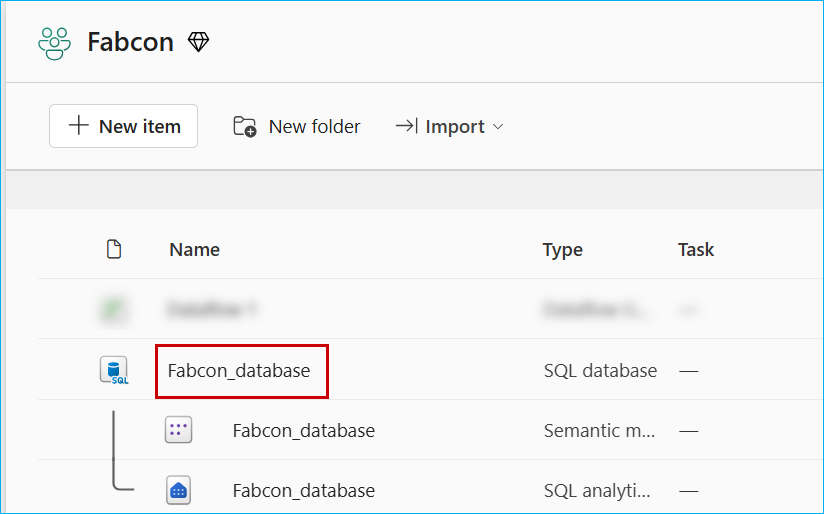
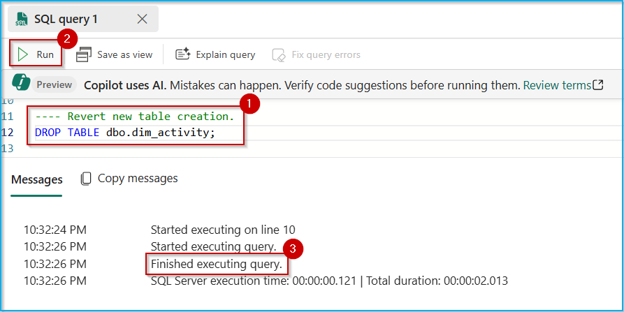
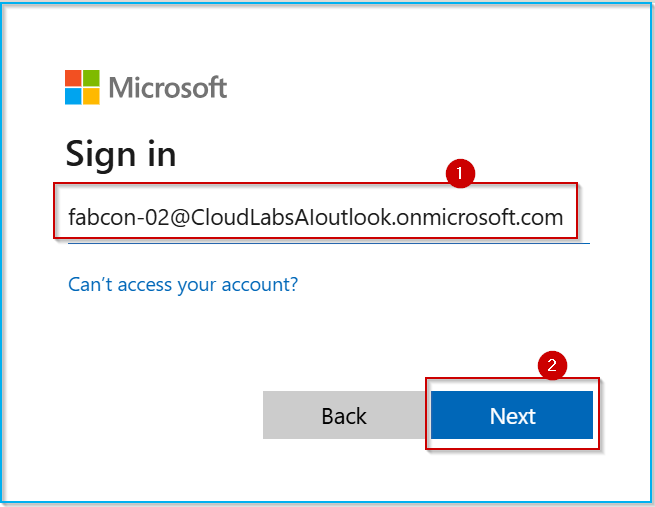
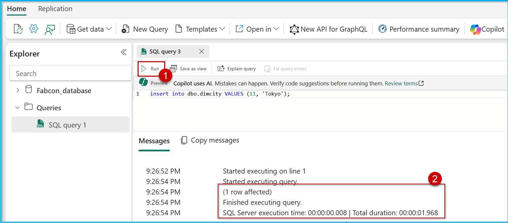

## Exercise 7: Data Security and Compliance (click-by-click)

---
>**Note:** Follow the steps provided in the task below. The Click-by-Click is available as a backup option in case of any technical issues preventing you from performing the lab in the actual environment. Before starting this exercise, open a backup Click-by-Click using the following hyperlink in a new tab, then return to the browser.
[Click-by-Click](https://regale.cloud/Microsoft/play/4474/07-data-security-and-compliance#/0/0)
---


Security and governance are complex for any organization, and Contoso is no different. Having the right user access is key to achieving business outcomes while driving down vulnerabilities. In this exercise, you will explore **Microsoft Fabric workspace roles** and **SQL native access controls** to effectively manage user permissions to drive down compliance alerts.

### Task 7.1: Access control using Microsoft Fabric workspaces roles​
 
 Workspace roles provide an easy way to control access to all items in a workspace, including SQL Databases. The are four workspace roles: Admin, Member, Contributor, and Viewer. Each workspace role maps to a subset of item permissions.
 
 The permissions that determine what a user can do in a SQL Database are:
  1) Read – users with this permission can connect to a database.
  2) ReadData – users with this permission can read all data from a database.
  3) Write – users with this permission have full administrative access.
 
 The Admin, Member, and Contributor roles include all the above permissions. Hence members of these roles are database administrators. The Viewer role includes Read and ReadData permissions, hence the members of that role can only read data.

 >**Note:** To showcase access and permissions in Fabric, we have used the following users: Fabcon-01, Fabcon-02, and Fabcon-03. To replicate the same experience, you can create users with the same names or use existing user accounts from your Entra ID. In the subsequent tasks, we will assign the following permissions to the respective users.

| User      | Workspace Role (Fabcon) | SQL Permissions (Fabcon_database)                          | Notes                                      |
|-----------|------------------------|-----------------------------------------------------------|--------------------------------------------|
| Fabcon-03 | Admin                  | Read, ReadData, Write                                     | Performed all administrative actions.     |
| Fabcon-01 | Contributor            | Read, ReadData, Write                                     | Initially assigned 'Viewer' role.         |
| Fabcon-02 | N/A                    | DB: Read (Connect);<br>Schema dbo: Select, Insert, Update | Permissions granted via SQL native controls (UI & T-SQL). |

 
 #### Activity: Access as Workspace Admin to assign Viewer workspace permission to other user.
 
 Log in as user **'Fabcon-03'** (Admin access) to the Fabcon workspace, assign user **'Fabcon-01'** the Viewer role, validate permissions, and then update the role to Contributor for further validation.
 
 1. Open a new incognito window, and type **app.fabric.microsoft.com** and press **Enter**.
 
 
 
 2. Enter the user name as **fabcon-03@CloudLabsAIoutlook.onmicrosoft.com** and click on **Submit**.
 
 
 
 3. Enter the password **Fabcon03@123** and click on **Sign in**.
 
 
 
 4. Select the **checkbox** to disable the message in future, and click on **Yes** button.
 
 
 
 5. Click on **Workspaces** from  the left menu, and select **Fabcon**.
 
 
 
 6. Click on **Manage_access** from the top right corner.
 
 
 
 7. Click on **Add people or groups** button.
 
 
 
 8. Search for **Fabcon-01** user in the search box, select the user from the dropdown list, make sure that the **Viewer** access is selected, and then click on **Add**.
 
 
 
 9. Wait till you get a success message like below. This might take a minute. Click on the **Close** icon.
 
 
 
 10. Hover to the right of **Fabcon_database** to find the **three dots** and click on it.
 
 11. Scroll down and select **Manage permissions**.
 
 
 
 12. Type **Fabcon-01** in the search box, and notice the permissions assigned to the users.
 
 
 
 Read, ReadData permissions allows user to can connect to Fabcon_database and read all data from it.
 
 <!--
 #### Activity: Access a database as a member of the Viewer role and verify what you can and cannot do.
 
 1. Open a new tab in the incognito window, and type **app.fabric.microsoft.com** and press **Enter**.
 
 
 
 2. Click on the **Profile icon**, then click on **Sign out** button.
 
 
 
 3. You will get the signed out message as shown in the image below.
 
 
 
 4. Again, open a new tab in the incognito window, and type **app.fabric.microsoft.com** and press **Enter**.
 
 
 
 5. Select **Use another account**.
 
 
 
 6. Enter the user name as **fabcon-01@CloudLabsAIoutlook.onmicrosoft.com** and click on **Next**.
 
 
 
 7. Enter the password **Fabcon01@123** and click on **Sign in**.
 
 
 
 8. Click on **Workspaces** from  the left menu, and select **Fabcon**.
 
 
 
 9. Click on **Fabcon_database**.
 
 
 
 10. Click on **New query**, paste the below code in the query editor, click on **Run** icon.
 
 ```
 create table dbo.dim_activity (id int, user_name nvarchar(50), activity nvarchar(20));
 ```
 
 
 
 11. Paste the below code in the query editor, click on **Run** icon.
 
 ```
 insert into dbo.dimcity VALUES (11, 'Tokyo');
 ```
 
 
 
 > **Note**: The statement has failed as the user has viewer access to Fabcon workspace.
 
 12. Paste the below code in the query editor, click on **Run** icon.
 
 ```
 select * from dbo.dimcustomer;
 ```
 
 > **Note**: You can perform selection on any tables as the user has viewer access to Fabcon workspace.
 
 
 
-->

 #### Activity: Access as Workspace Admin to assign Contributor workspace permission to other user.
 
 1. Switch back to the previous tab logged in with admin user **Fabcon-03**.
 
 
 
 2. Click on **Workspaces** from  the left menu, and select **Fabcon**.
 
 
 
 3. Click on **Manage_access** from the top right corner.
 
 
 
 4. Search for **Fabcon-01** user in the search box, select the **dropdown arrow** next to Viewer, click on **Contributor** access, and then click on **Close** icon.
 
 
 
 5. Hover to the right of **Fabcon_database** to find the **three dots** and click on it.
 
 6. Scroll down and select **Manage permissions**.
 
 
 
 7. Type **Fabcon-01** in the search box, and notice the permissions assigned to the users.
 
 
 
 The additional Write permission allows user to have full administrative access to Fabcon_database.
 
 <!--
 
 #### Activity: Access a database as a member of the Contributor role and verify what you can and cannot do.
 
 1. Navigate back to the database tab logged in with the user **Fabcon-01**.
 
 
 
 2. Click on **New query**, paste the below code in the query editor, click on **Run** icon.
 
 ```
 create table dbo.dim_activity (id int, user_name nvarchar(50), activity nvarchar(20));
 ```
 
 > **Note**: The statement has succeeded as the user has contributor access to Fabcon workspace.
 
 
 
 3. Paste the below code in the query editor, click on **Run** icon.
 
 ```
 insert into dbo.dim_activity values (1, current_user, 'insert');
 insert into dbo.dim_activity values (2, current_user, 'insert');
 update dbo.dim_activity set activity = 'update' where id = 2;
 ```
 
 
 
 > **Note**: You can perform insert/update on any tables as the user has contributor access to Fabcon workspace.
 
 4. Paste the below code in the query editor, click on **Run** icon.
 
 ```
 select * from dbo.dim_activity;
 ```
 
 > **Note**: You can perform selection on any tables as the user has contributor access to Fabcon workspace.
 
 
 
 5. Let's revert the new table creation step. Copy the below code, and paste it in the query editor, then select the pasted code and click on **Run** button.
 
 ```
 ---- Revert new table creation step.
 DROP TABLE dbo.dim_activity;
 ```
 
 
 
 7. Close the incognito window by clicking on the **Close icon**.
 
 
 
 -->
 
 
 ### Task 7.2: Manage fine-grain access using SQL native access controls​
 
 Unlike workspace roles you used in the previous task, SQL native access controls allow you to closely align authorization settings with the real needs of your user and adhere to the principle of least privilege. You configure SQL native access controls in two ways: by using the Manage SQL Security UI in Microsoft Fabric portal or with Transact-SQL.
 
 
 #### Activity: Access as Workspace Admin to assign permissions using Open Manage SQL Security.
 
 1. Open a new incognito window, and type **app.fabric.microsoft.com** and press **Enter**.
 
 
 
 2. Enter the user name as **fabcon-03@CloudLabsAIoutlook.onmicrosoft.com** and click on **Submit**.
 
 
 
 3. Enter the password **Fabcon03@123** and click on **Sign in**.
 
 
 
 4. Select the **checkbox** to disable the message in future, and click on **Yes** button.
 
 
 
 5. Click on **Workspaces** from  the left menu, and select **Fabcon**.
 
 
 
 6. Click on **Fabcon_database**.
 
 
 
 7. Click on **Security** from the top menu, select **Manage SQL Security**, and then click on **New Role** button. 
 
 
 
 8. Enter the name as **custom_role** in the **Role name** textbox, then select the **Select** and **Insert** checkbox against the **dbo** schema, and click on **Save** button.
 
 
 
 9. Select the **custom_role** radio button, and click on **Manage access**.
 
 
 
 10. Search for **Fabcon-02** user from the **Add people, groups or apps** text box, then select the result, and click on **Add** button.
 
 
 
 11. Click on **Share database**.
 
 
 
 12. Click on **Grant**.
 
 
 
 13. Click on **Save** button.
 
 
 
 We have successfully granted Read permission (to connect to database), select and insert access on **dbo** schema of **Fabcon_database** to user **Fabcon-02**.
 
<!-- 
 
 #### Activity: Access a database as new user and verify Manage SQL Security permissions.
 
 1. Open a new tab and paste **https://www.microsoft.com/en-us/microsoft-365/outlook/log-in**, press **Enter** and click on **Sign in** button.
 
 
 
 2. Enter the user name as **fabcon-02@CloudLabsAIoutlook.onmicrosoft.com** and click on **Next**.
 
 
 
 3. Enter the password **Fabcon02@123** and click on **Sign in**.
 
 
 
 4. You would have received a mail with message **Fabcon-03 shared this SQL Database with you**.
 
 5. Click on the mail and click on the **Open** button.
 
 
 
 6. Select the user **Fabcon-02**.
 
 
 
 7. You will be navigated to **Fabcon_database** within Microsoft Fabric.
 
 
 
 8. Click on **New query**, paste the below code in the query editor, click on **Run** icon.
 
 ```
 select * FROM dbo.dimcity;
 ```
 
 
 
 9. Paste the below code in the query editor, click on **Run** icon.
 
 ```
 insert into dbo.dimcity VALUES (11, 'Tokyo');
 ```
 
 
 
 10. Paste the below code in the query editor, click on **Run** icon, to show the inserted record.
 
 ```
 select * FROM dbo.dimcity;
 ```
 
 
 
 -->
 
 #### Activity: Access as Workspace Admin to assign permissions using T-SQL.
 
 1. Switch back to the previous tab logged in with admin user **Fabcon-03**.
 
 
 
 2. Click on **Workspaces** from  the left menu, and select **Fabcon**.
 
 
 
 3. Click on **Fabcon_database**.
 
 
 
 4. Now, let us provide update access on **dbo** schema using T-SQL.
 
 5. Click on **New query**, paste the below code in the query editor, click on **Run** icon.
 
 ```
 GRANT UPDATE ON SCHEMA::dbo TO [fabcon-02@CloudLabsAIoutlook.onmicrosoft.com];
 ```
 
 
 
 <!--
 
 #### Activity: Access a database as new user and verify T_SQL permissions.
 
 1. Navigate back to the database tab logged in with the user **Fabcon-02**.
 
 
 
 2. Click on **New query**, paste the below code in the query editor and click on the **Run** button.
 
 ```
 update 
 dbo.dimcity
 SET City = 'New York City'
 WHERE CityId = 11
 ;
 ```
 
 
 
 10. Paste the below code and click on the **Run** button.
 
 ```
 select * from dbo.dimcity;
 ```
 
 

 -->


In this exercise, you have learned how to manage access control in Microsoft Fabric using Workspace roles and SQL native access controls. You have gained practical experience in:
 
- Understanding the four workspace roles (Admin, Member, Contributor, and Viewer) and their corresponding database permissions.
- Configuring SQL native access controls using the Manage SQL Security UI and Transact-SQL commands.

With this knowledge, you can now effectively manage user permissions and secure SQL Databases within Microsoft Fabric. You are ready to move on to the next exercise [Managing Production Workloads](https://github.com/microsoft/Azure-Analytics-and-AI-Engagement/blob/Fabric-SQL-Workshop/Workshop_Exercises/08%20-%20Managing%20Production%20Workloads.md)