# Build Cloud-Native Agentic Apps with Azure Container Apps (ACA) and Microsoft Foundry Deployable PoC Accelerator
 
## What is a DPoC?
Deployable PoC Accelerators (DPoC) are packaged demos, using ARM templates and automation scripts (with a demo web application, Container Apps, Kubernetes Clusters, Container Registries, Function Apps, Power BI reports, Fabric resources etc.) that can be deployed in a customer’s environment.
 
## Objective & Intent
Enable partners to easily deploy demos in their own Azure subscriptions and demonstrate them live to their customers.
By partnering with Microsoft sellers, partners can also deploy Industry Scenario Demos into customer subscriptions.
Customers can then get hands-on experience with the demo environment in their own subscription, explore its capabilities, and showcase to their stakeholders.

## Responsible AI Demo Disclaimer
This demonstration is intended to illustrate example AI capabilities and may use simulated data, curated prompts, or controlled conditions. The system shown is designed for specific use cases and has known limitations. AI‑generated outputs may be inaccurate, incomplete, biased, or misleading and should be reviewed by a human. This demo does not represent a guarantee of future functionality, performance, or availability, and does not replace human judgment or responsibility

## Before you begin
 
1. **Read the [license agreement](https://github.com/microsoft/Azure-Analytics-and-AI-Engagement/blob/main/CDP-Retail/license.md) and [disclaimer](https://github.com/microsoft/Azure-Analytics-and-AI-Engagement/blob/main/CDP-Retail/disclaimer.md) before proceeding, as your access to and use of the code made available hereunder is subject to the terms and conditions made available therein.**
2. Without limiting the terms of the [license](https://github.com/microsoft/Azure-Analytics-and-AI-Engagement/blob/main/CDP-Retail/license.md), any Partner distribution of the Software (whether directly or indirectly) must be conducted through Microsoft’s Customer Acceleration Portal for Engagements (“CAPE”). CAPE is accessible to Microsoft employees. For more information regarding the CAPE process, contact your local Data & AI specialist or CSA/GBB.
3. It is important to note that **Azure hosting costs** are involved when a Deployable PoC Accelerator is implemented in customer or partner Azure subscriptions. DPoC hosting costs are not covered by Microsoft for partners or customers.
4. Since this is a DPoC, there are certain resources available to the public. **Please ensure that proper security practices are followed before adding any sensitive data to the environment.** To strengthen the environment's security posture, **leverage Azure Security Center.** 
5. In case of questions or comments, email **[mdxazuredemos@microsoft.com](mailto:mdxazuredemos@microsoft.com).**
  
## Prerequisites
 
**Access and roles**
 
* **Owner** level access on the Azure subscription.
* Ensure you have permission to create **Microsoft Entra role assignments** in the subscription, as the script assigns roles to your user account and to two managed identities.

**Azure resources**
 
* Register the following resource providers with your Azure subscription:
   - Microsoft.AlertsManagement/prometheusRuleGroups
   - Microsoft.alertsmanagement/smartDetectorAlertRules
   - Microsoft.ApiManagement/service
   - Microsoft.App/containerApps
   - Microsoft.App/managedEnvironments
   - Microsoft.App/sandboxGroups
   - Microsoft.CognitiveServices/accounts
   - Microsoft.ContainerRegistry/registries
   - Microsoft.ContainerService/managedClusters
   - Microsoft.Insights/components
   - Microsoft.Insights/dataCollectionRules
   - microsoft.insights/workbooks
   - Microsoft.ManagedIdentity/userAssignedIdentities
   - Microsoft.Monitor/accounts
   - Microsoft.Network/virtualNetworks
   - Microsoft.OperationalInsights/workspaces
   - Microsoft.Storage/storageAccounts
   - Microsoft.Web/serverFarms
   - Microsoft.Web/sites
* **Microsoft.ContainerService** must be registered before you start. The script registers only **Microsoft.ApiManagement** automatically. If **Microsoft.ContainerService** is unregistered, the AKS cluster is not created and the script continues to the end without reporting the failure.
* Select a region where every required service and SKU is available. The PowerShell script deploys a Function App and AI resources, and the deployment fails if any required SKU is missing in that region. Check availability for App Service, Azure OpenAI models, AI Search, and Cognitive Services. See [Azure Services Global Availability](https://azure.microsoft.com/en-us/global-infrastructure/services/?products=all).
 
## Notes
 
* You must only execute one deployment at a time and wait for its completion. Running multiple deployments simultaneously is highly discouraged, as it can lead to deployment failures.
* Review the [License Agreement](https://github.com/microsoft/Azure-Analytics-and-AI-Engagement/blob/main/CDP-Retail/license.md) before proceeding.
 
## Contents

- [Task 1: Run the Cloud Shell to provision the demo resources](#task-1-run-the-cloud-shell-to-provision-the-demo-resources)
- [Task 2: Fine-Tune the Invoice-Anomaly Model in Microsoft Foundry](#task-2-fine-tune-the-invoice-anomaly-model-in-microsoft-foundry)
- [Post-Deployment Steps](#post-deployment-steps)
 
 
### Task 1: Run the Cloud Shell to provision the demo resources
  
>**Note:** In this task, we will execute a PowerShell script on CloudShell to deploy assets. As this demo is infra heavy, the script execution will approximately take 60-70 minutes.
 
>**Note:** The list of resources is as follows:
 
**Azure resources:**
 
| Name | Type |
| :--- | :--- |
| NodeRecordingRuleGroup-aks-automatic-<$suffix> | Microsoft.AlertsManagement/prometheusRuleGroups |
| Failure Anomalies - appi-<$suffix> | microsoft.alertsmanagement/smartDetectorAlertRules |
| Failure Anomalies - func-mcp-reconcile-<$suffix> | microsoft.alertsmanagement/smartDetectorAlertRules |
| apim-<$suffix> | Microsoft.ApiManagement/service |
| app-agents-launchpad-<$suffix> | Microsoft.App/containerApps |
| app-classifier-<$suffix> | Microsoft.App/containerApps |
| app-express-<$suffix> | Microsoft.App/containerApps |
| app-invoice-agent-<$suffix> | Microsoft.App/containerApps |
| cae-caldova-global-<$suffix> | Microsoft.App/managedEnvironments |
| sandbox-group-<$suffix> | Microsoft.App/sandboxGroups |
| hub-aifoundry-<$suffix> | Microsoft.CognitiveServices/accounts |
| proj-aifoundry-<$suffix> | Microsoft.CognitiveServices/accounts/projects |
| acr-aca-<$suffix> | Microsoft.ContainerRegistry/registries |
| aks-automatic-<$suffix> | Microsoft.ContainerService/managedClusters |
| appi-<$suffix> | Microsoft.Insights/components |
| func-mcp-reconcile-<$suffix> | Microsoft.Insights/components |
| MSCI-westus3-aks-automatic-<$suffix> | Microsoft.Insights/dataCollectionRules |
| <$NEW-GUID> | microsoft.insights/workbooks |
| id-aca-global-demo-<$suffix> | Microsoft.ManagedIdentity/userAssignedIdentities |
| id-aks-openai-<$suffix> | Microsoft.ManagedIdentity/userAssignedIdentities |
| monitor-aca-<$suffix>-westus3 | Microsoft.Monitor/accounts |
| vnet-aca-<$suffix> | Microsoft.Network/virtualNetworks |
| law-aca-<$suffix> | Microsoft.OperationalInsights/workspaces |
| storage<$suffix> | Microsoft.Storage/storageAccounts |
| ASP-rgaca-<$suffix>-... | Microsoft.Web/serverFarms |
| func-mcp-reconcile-<$suffix> | Microsoft.Web/sites |

---
 
 
1. **Click** the following button to open the **Azure Portal**:
 
<a href='https://portal.azure.com/' target='_blank'></a>
 
> **Note:** If prompted, sign in with the Microsoft Entra ID account that has **Owner** access on the target subscription. Use this same account for every sign-in in Task 1 and Task 2.
 
2. In the Azure portal, select the **Terminal icon** to open Azure Cloud Shell.
 
    
 
3. **Click** on **PowerShell**.
 
    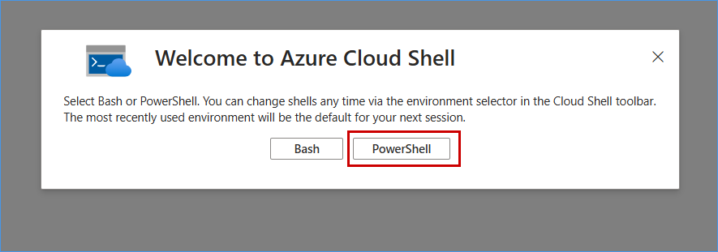
 
> **Note:** It is mandatory to provision a Cloud Shell with underlying Storage Account.
 
4. Select the **Mount storage account** radio button, choose the appropriate **subscription** from the dropdown, and then click **Apply**.
 
    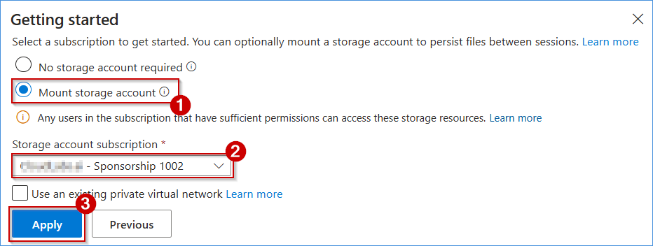
 
    > **Note:** If you already have a storage mounted for Cloud Shell, you will not get this prompt.

5. Select any radio button based on your preference and you will be prompted the steps for assigning storage account accordingly. In the example below we have selected **I want to create a storage account** and clicked on the **Next** button..

  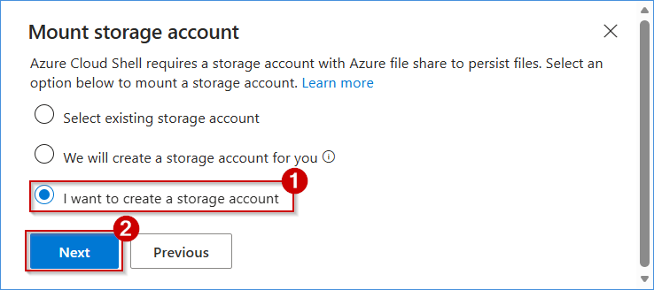

6. Select Subscription, resource group, region, storage account name, file share name and then click on the **Create** button.

  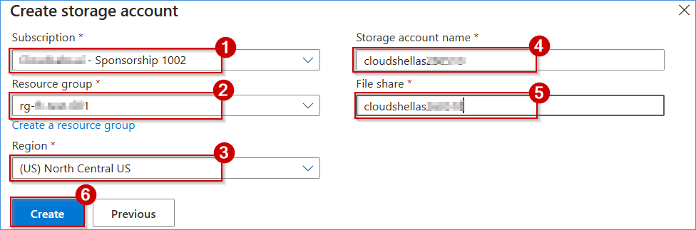

7. **Wait** for the deployment to complete.

  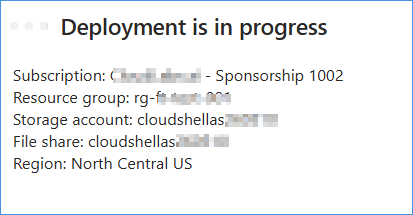

8. In the Azure Cloud Shell window, ensure that the **PowerShell** environment is selected.
 
    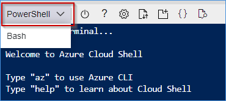
 
9. **Expand** the Cloudshell window.
 
    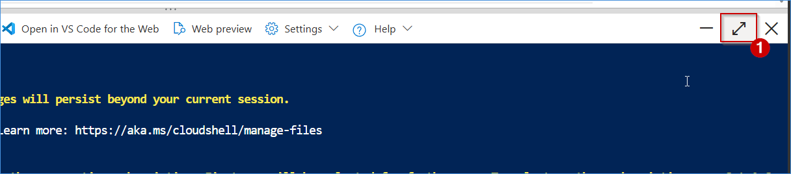
 
>**Note:** All the cmdlets used in the script work best in PowerShell .	
 
>**Note:** Use **Ctrl+C** to copy and **Shift+Insert** to paste, as **Ctrl+V** is NOT supported by Cloud Shell.
 
10. Enter the following **command** to clone the repository files in Cloud Shell.
 
Command:
 
```
git clone -b aca --depth 1 --single-branch https://github.com/microsoft/Azure-Analytics-and-AI-Engagement.git aca
``` 
  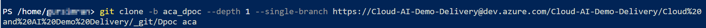
  

> **Note:** If you get **File already exists.** error, please execute the following command to delete existing clone and then re-clone:
```
rm aca -r -f 
```
> **Note**: When executing scripts, it is important to let them run to completion. Some tasks may take longer than others to run. After script execution, you will be returned to a command prompt.
 
12. Execute the **PowerShell** script with the following command:
```
cd ./aca/aca
```
 
```
./acaSetup.ps1
```
   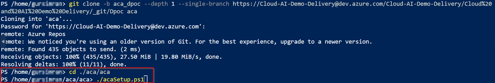
 
13. **Press** **Y** and click on the **Enter** button.

    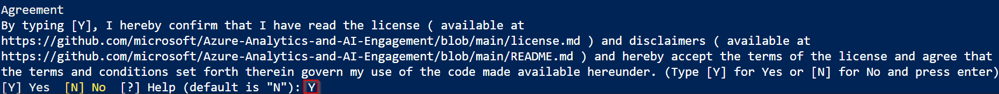
 
14. From the Azure Cloud Shell, **copy** the authentication code. You will use this code in the next step.
 
15. **Click** on the link [https://microsoft.com/devicelogin](https://microsoft.com/devicelogin) and a new browser window will launch.
 
    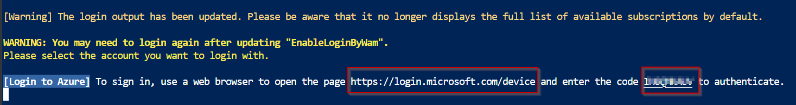

16. **Paste** the authentication code and click on the **Next** button.
 
    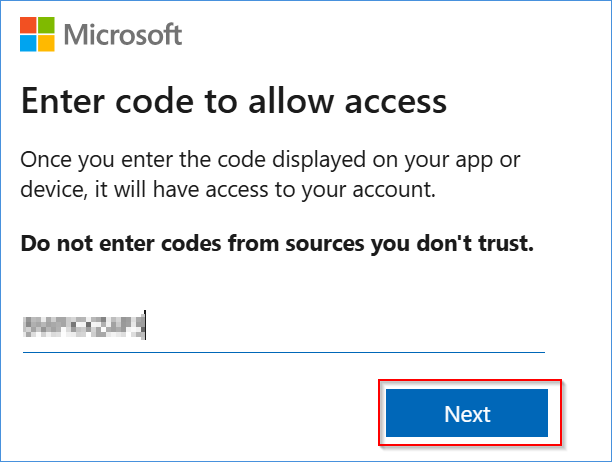
 
17. Select the **user account** you used for logging into the **Azure Portal**.
 
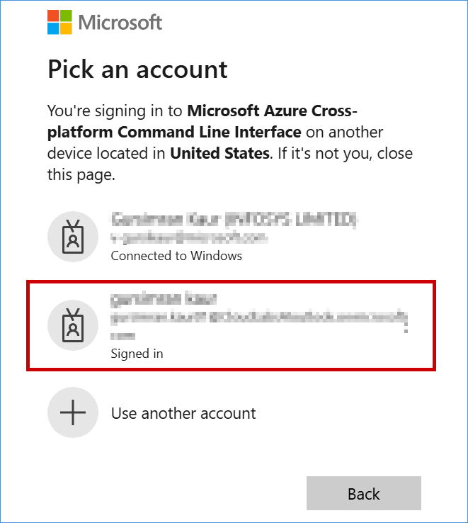
 
18. **Click** on the **Continue** button.
 
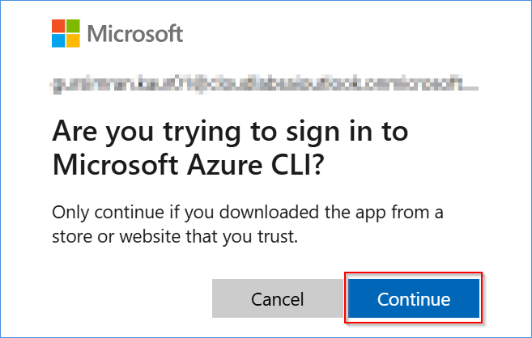
 
19. **Close** the browser tab when you see the message box.
 
    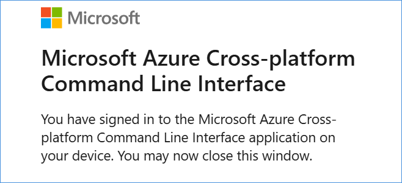   
 
20. Navigate back to your **Azure Cloud Shell** execution window.
 
21. **Enter** the number on the left side of your subscription name from the screen and press **Enter** key.
 
    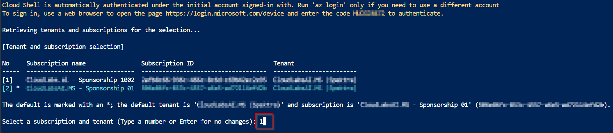

> **Notes:**
> - Users with a single subscription won't be prompted to select a subscription.
> - The subscription highlighted in Light blue will be selected by default, if you do not enter a desired subscription. Please select the subscription carefully as it may break the execution further.
> - While you are waiting for the processes to complete in the Azure Cloud Shell window, you'll be asked to enter the code two times. This is necessary for performing the installation of various Azure Services and preloading the data.
 
22. **Copy** the code on the screen to authenticate the **Azure PowerShell script** for creating the resources. **Click** the link [https://microsoft.com/devicelogin](https://microsoft.com/devicelogin).
 
    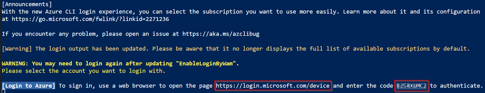
 
23. A new browser window will launch. **Paste** the **authentication code** you copied from the shell above and press **Enter**.
 
    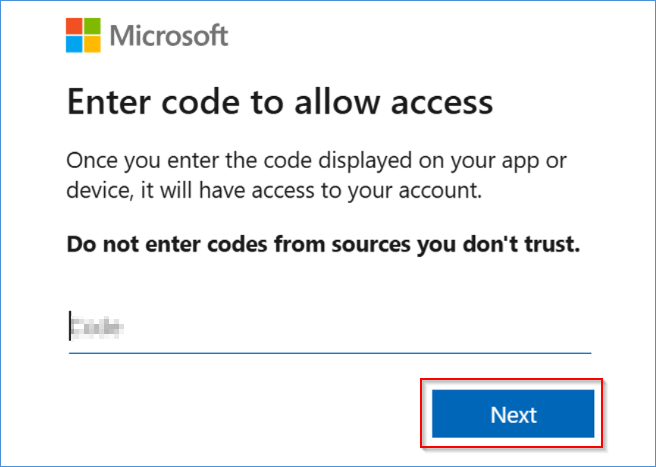
 
24. Select the **user account** that is used for logging into the **Azure Portal**.
 
    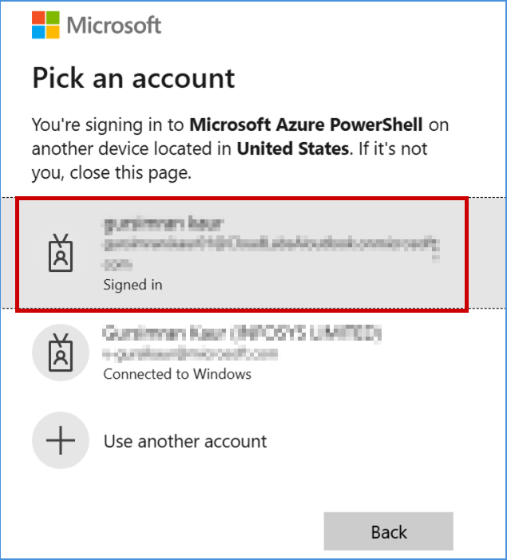
 
25. Click on **Continue**.
 
    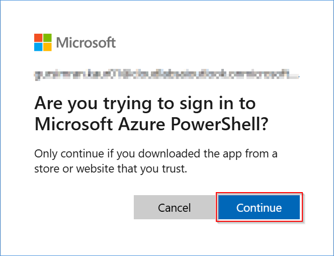
 
26. **Close** the browser tab when you see the message box.
 
    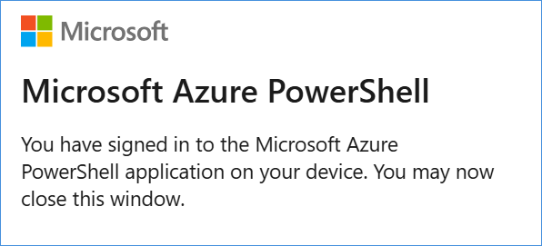
 
27. Go back to the **Azure Cloud Shell** execution window.
  
28. **Enter** the Region for deployment with the necessary resources available, preferably "westus3".

    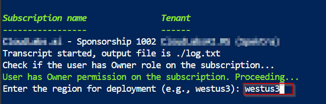
  
> **Note:** Please be patient while the script runs—this is an infrastructure-heavy deployment that requires some time to complete. To keep your CloudShell session from expiring, stay on the screen and give your mouse a gentle hover or click every few minutes.
 
> **Note:** During the execution of the script, you might see outputs and warnings displayed in red color in between while text outputs. 
> Do not treat every red message as an error. Focus on the outputs and only consider them as errors only if it explicilty indicates an error. 
> An example is provided below showing a warning.
 
>Example 1
 
  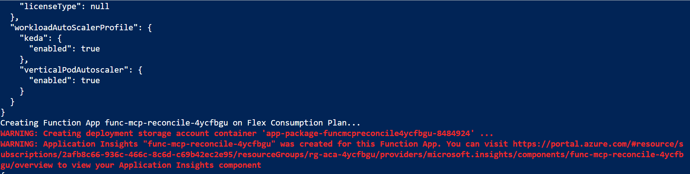

>Example 2

  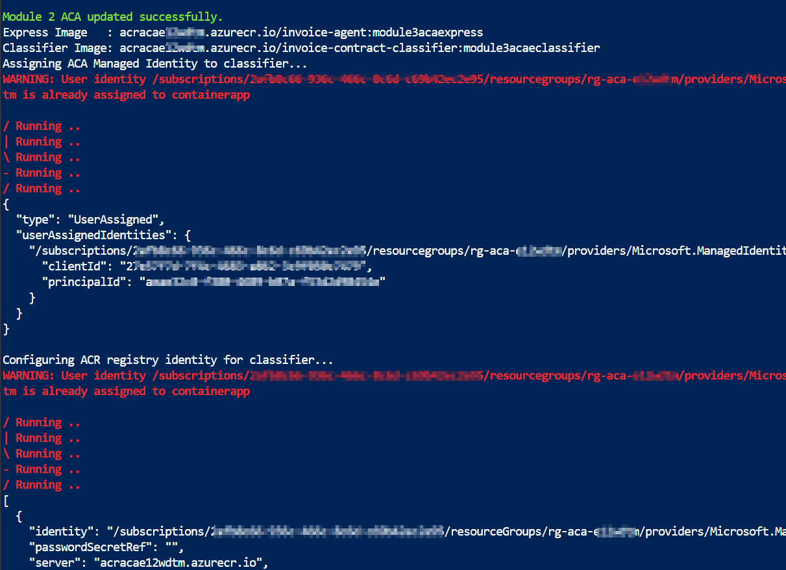
  
>Example 3

  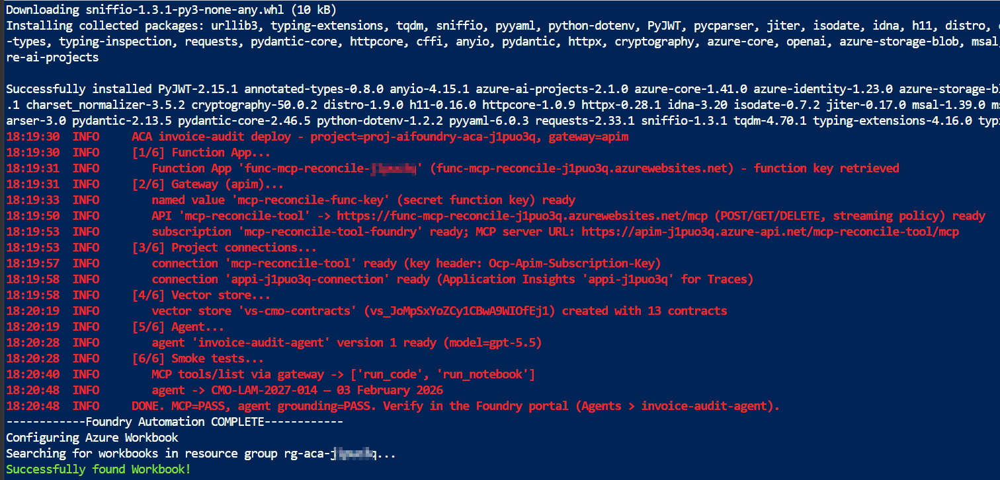
  
29. A screen similar to the screenshot below indicates the end of your script execution.
 
  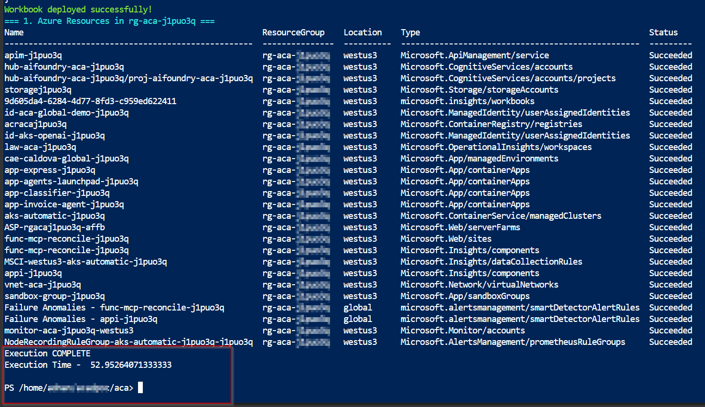

 
### Task 2: Fine-Tune the Invoice-Anomaly Model in Microsoft Foundry

>**Note:** This is a manual step performed in the Microsoft Foundry portal. It uses no VS Code or SDK, and it ends at the completed fine-tuned model. Deployment of the fine-tuned model is a separate step and is not covered here.

**Prerequisites**

* Ensure to have access to the Foundry project **proj-aifoundry-aca-<suffix>** created in [Task 1](#task-1-run-the-cloud-shell-to-provision-the-demo-resources), with a role that can run fine-tuning jobs and view quota. **Foundry User** or higher is sufficient.
* You must download the following two dataset files provided with this accelerator under **artifacts/foundry/datasets/fine-tuning-datasets**, in Azure OpenAI chat JSONL format, UTF-8 with a byte-order mark:
   - **caldova_contract_classifier_training.jsonl** (53 rows)
   - **caldova_contract_classifier_validation.jsonl** (13 rows)
* You make sure that the base model supports supervised fine-tuning in your region. The gpt-4.1 family is eligible. The **gpt-5** family is NOT.

**Choosing the base model**

Decide the base model before you start, rather than accepting the wizard default. Work through these four points in order.

- **Eligibility gate:** Only some models support supervised fine-tuning. The gpt-4.1 family is eligible and the gpt-5 family is not, so gpt-5.5 cannot be the tuned model even though it runs the other modules. This rules options in and out first.
- **Match size to task:** This is a narrow classification task, so a small model is appropriate, which is why nano is the pick. gpt-4.1-mini and gpt-4.1 are available for more capacity at higher training and serving cost. The open-weights options such as Llama-3.3-70B-Instruct and gpt-oss-20b are for self-hosting, not a managed endpoint.
- **Deployment consequence:** A gpt-4.1 family tune deploys as a managed Azure OpenAI endpoint, which is the architecture chosen here. If instead the model must run as your own container on a GPU, that points to an open-weights model and a different path.
- **Default pick:** For a narrow classification task on a managed endpoint with least effort, start at **gpt-4.1-nano**, and step up to gpt-4.1-mini only if accuracy falls short.

1. In the left navigation, under **Optimize**, select **Fine-tune**, then start a new job so the **Fine-tune a model** page opens. It has three sections: Basic details, Datasets, and Optional settings.

    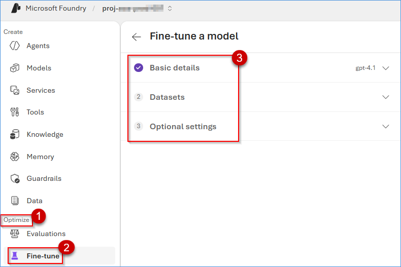

2. In **Basic details**, set the following, then select **Next**:
   * **Customization method:** Supervised.
   * **Model:** open the dropdown and select **gpt-4.1-nano**. The field may default to gpt-4.1, so change it.
   * **Training type:** Data Zone.

    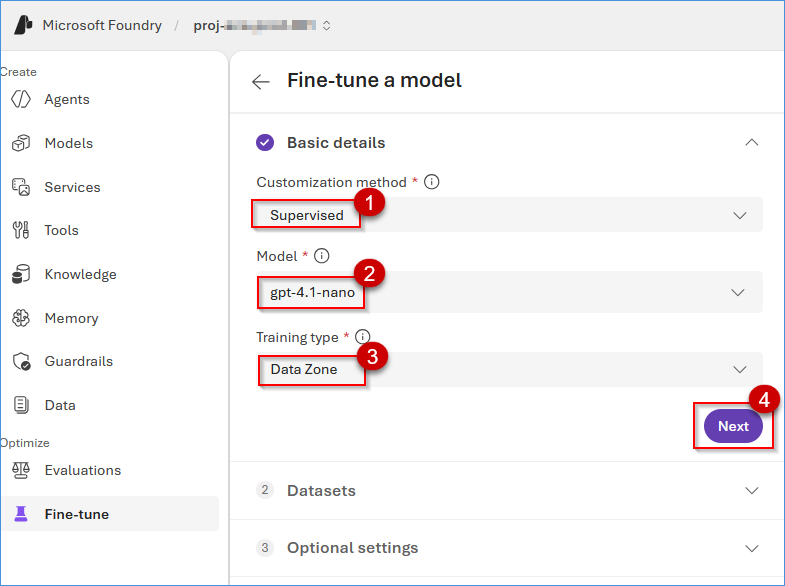

   >**Note:** gpt-4.1-mini or gpt-4.1 are in the same list if you want more capacity at higher cost. Training type can be Global for cheaper training without regional data residency, or Developer for a low-cost experimentation tier. Keep Data Zone unless you need one of those trade-offs.

3. In **Datasets**, upload the two files, then select **Next**:
   * **Training data:** upload **caldova_contract_classifier_training.jsonl**. Confirm the preview reads 53 examples.
   * **Validation data:** upload **caldova_contract_classifier_validation.jsonl**. Confirm 13 examples.

    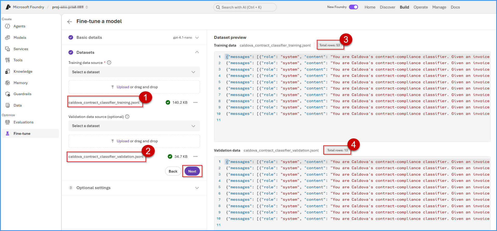

   >**Note:** A validation file is optional, but include it so you get validation loss during training and a cleaner read on generalization.

4. In **Optional settings**, set the following:
   * **Display name:** enter a meaningful name, for example **invoice-anomaly-model-v1**. Replace the random pre-filled value, since this is how you find the model later.
   * **Seed:** set a fixed integer such as 42 for reproducibility, or leave Random.
   * **Automatically deploy model after job completion:** leave this **off**, so the job ends at the fine-tuned model and creates no endpoint.
   * **Batch size**, **Number of epochs**, and **Learning rate multiplier:** leave on **Default**.

    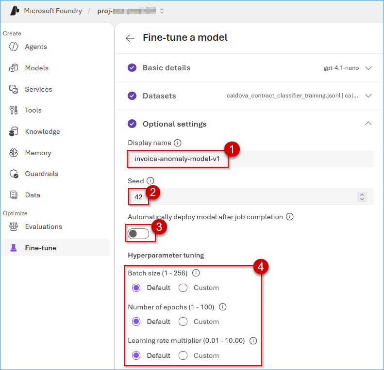

   >**Note:** Any hyperparameter can switch to Custom, but Default is the right first pass on a small dataset. Tune only if the validation loss tells you to.

5. Review the three sections, then create the fine-tuning job. The job appears in the **Fine-tune** list. Creating it is the submit action, so there is nothing else to click to launch it.

    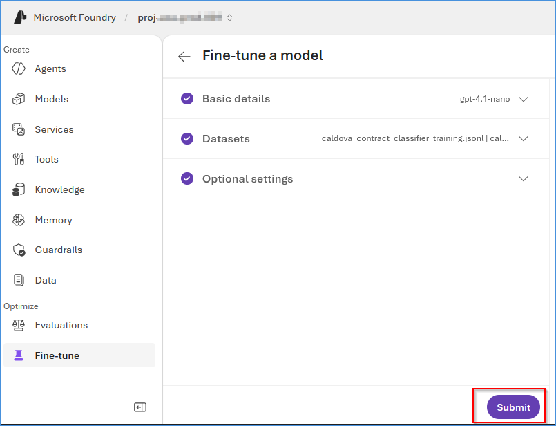

    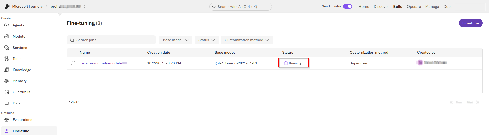

6. Monitor the job to completion. It moves on its own through **Queued**, then **Running**, then **Completed**. Most of the wait is the queue, which depends on regional capacity, not on your data. Training on this small dataset is short once it starts.
   * Open the job and watch the **Monitor** tab for training and validation loss.
   * A healthy run shows training loss falling and settling, with validation loss tracking it down rather than turning back up.
   * If validation loss rises while training loss keeps falling, that is overfitting, and the remedy is fewer epochs on a re-run.

    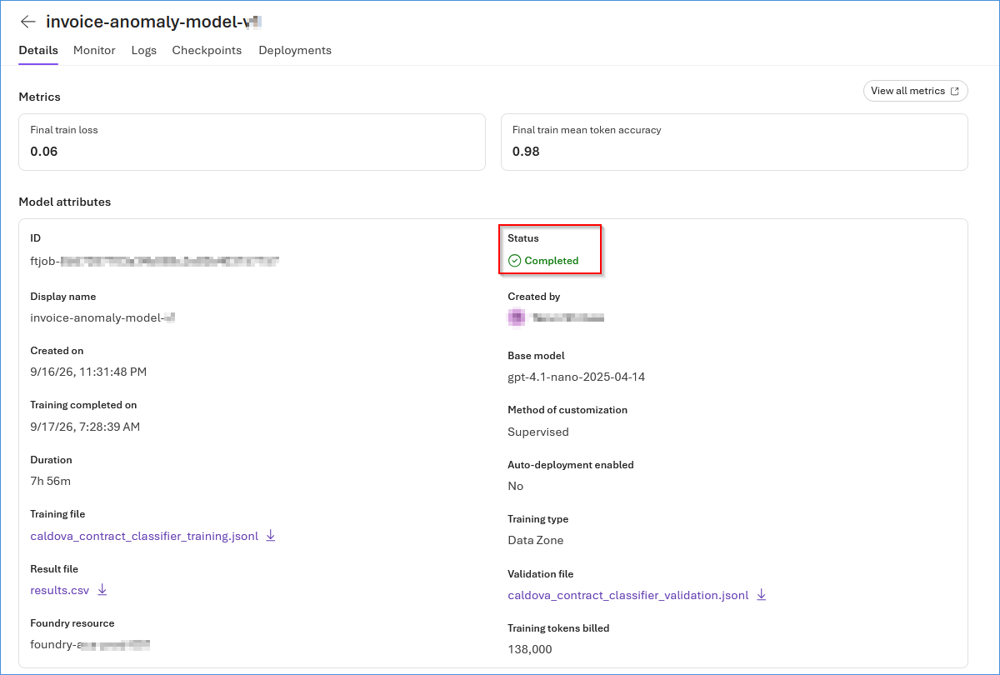

>**Note:** On success, the status reads **Completed** and the fine-tuned model exists under your display name, with a system identifier of the form **gpt-4.1-nano-...-ft-...**. That is the deliverable. For reference, a good run on this dataset reaches a final training loss near 0.06 and a mean token accuracy near 0.98.

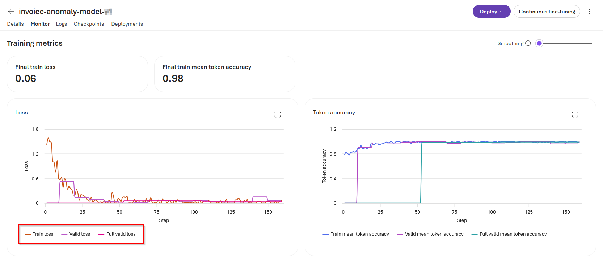


## Post-Deployment Steps
 
Complete this once Task 2 has finished successfully.
 
* Ensure that your Entra ID user has the **Storage Blob Data Owner** role assigned on the storage account whose name starts with **storage**.
* Ensure any user performing the demo, his/her Entra ID has the **Container Apps SandboxGroup Data Owner** role assigned on the sandbox group whose name starts with **sandbox-group**. To re-check, the script assigns this during Task 1. Without it the invoice agent cannot create or use dynamic sessions.

