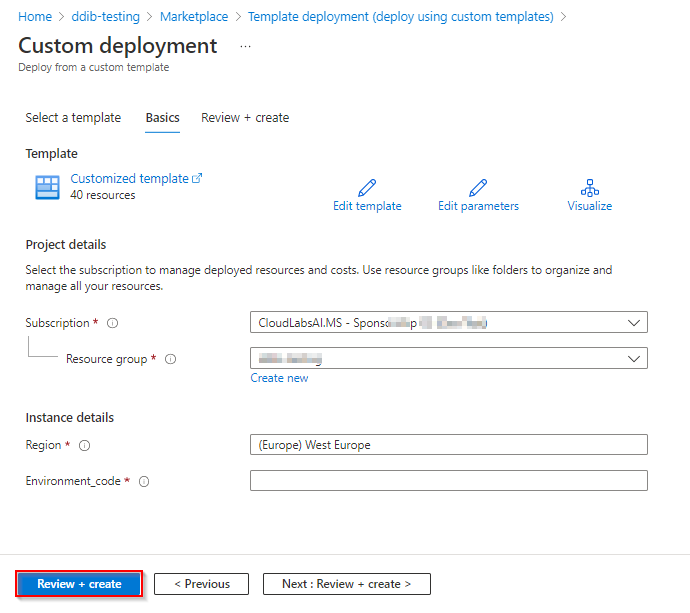
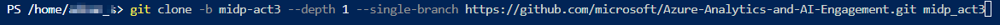
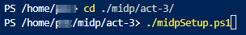
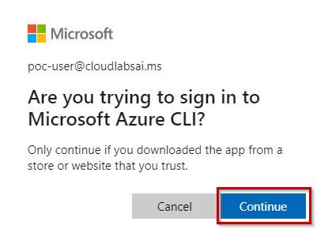

# Analytics in Microsoft Intelligent Data Platform (MIDP) DREAM Demo DREAM Demo in a Box Setup Guide

## What is it?
DREAM Demos in a Box (DDiB) are packaged Industry Scenario DREAM Demos with ARM templates (with a demo web app, Power BI reports, Synapse resources, AML Notebooks etc.) that can be deployed in a customer’s subscription using the CAPE tool in a few hours.  Partners can also deploy DREAM Demos in their own subscriptions using DDiB.

 ## Objective & Intent
Partners can deploy DREAM Demos in their own Azure subscriptions and show live demos to customers. 
In partnership with Microsoft sellers, partners can deploy the Industry scenario DREAM demos into customer subscriptions. 
Customers can play,  get hands-on experience navigating through the demo environment in their own subscription and show to their own stakeholders.

**Before You Begin**

## :exclamation:IMPORTANT NOTES:  

  1. **Please read the [license agreement](https://github.com/microsoft/Azure-Analytics-and-AI-Engagement/blob/main/CDP-Retail/license.md) and [disclaimer](https://github.com/microsoft/Azure-Analytics-and-AI-Engagement/blob/main/CDP-Retail/disclaimer.md) before proceeding, as your access to and use of the code made available hereunder is subject to the terms and conditions made available therein.** Any third party tool used in the demo is not owned by us and you will have to buy the licenses for extended use.
  2. Without limiting the terms of the [license](https://github.com/microsoft/Azure-Analytics-and-AI-Engagement/blob/main/CDP-Retail/license.md) , any Partner distribution of the Software (whether directly or indirectly) may only be made through Microsoft’s Customer Acceleration Portal for Engagements (“CAPE”). CAPE is accessible by Microsoft employees. For more information about the CAPE process, please connect with your local Data & AI specialist or CSA/GBB.
  3. Please note that **Azure hosting costs** are involved when DREAM Demos in a Box are implemented in customer or partner Azure subscriptions. **Microsoft will not cover** DDiB hosting costs for partners or customers.
  4. Since this is a DDiB, there are certain resources open to the public. **Please ensure proper security practices are followed before you add any sensitive data into the environment.** To strengthen the security posture of the environment, **leverage Azure Security Centre.** 
  5.  For any questions or comments please email **[dreamdemos@microsoft.com](mailto:dreamdemos@microsoft.com).**
  
   > **Note**: Set up your demo environment at least two hours before your scheduled demo to make sure everything is working.
   
# Copyright - 2023

© 2021 Microsoft Corporation. All rights reserved.   

By using this demo/lab, you agree to the following terms: 

The technology/functionality described in this demo/lab is provided by Microsoft Corporation for purposes of obtaining your feedback and to provide you with a learning experience. You may only use the demo/lab to evaluate such technology features and functionality and provide feedback to Microsoft.  You may not use it for any other purpose. You may not modify, copy, distribute, transmit, display, perform, reproduce, publish, license, create derivative works from, transfer, or sell this demo/lab or any portion thereof. 

COPYING OR REPRODUCTION OF THE DEMO/LAB (OR ANY PORTION OF IT) TO ANY OTHER SERVER OR LOCATION FOR FURTHER REPRODUCTION OR REDISTRIBUTION IS EXPRESSLY PROHIBITED. 

THIS DEMO/LAB PROVIDES CERTAIN SOFTWARE TECHNOLOGY/PRODUCT FEATURES AND FUNCTIONALITY, INCLUDING POTENTIAL NEW FEATURES AND CONCEPTS, IN A SIMULATED ENVIRONMENT WITHOUT COMPLEX SET-UP OR INSTALLATION FOR THE PURPOSE DESCRIBED ABOVE. THE TECHNOLOGY/CONCEPTS REPRESENTED IN THIS DEMO/LAB MAY NOT REPRESENT FULL FEATURE FUNCTIONALITY AND MAY NOT WORK THE WAY A FINAL VERSION MAY WORK. WE ALSO MAY NOT RELEASE A FINAL VERSION OF SUCH FEATURES OR CONCEPTS.  YOUR EXPERIENCE WITH USING SUCH FEATURES AND FUNCITONALITY IN A PHYSICAL ENVIRONMENT MAY ALSO BE DIFFERENT.

## Contents

<!-- TOC -->

- [Requirements](#requirements)
- [Before Starting](#before-starting)
  - [Task 1: Create a resource group in Azure](#task-1-create-a-resource-group-in-azure)
  - [Task 2: Deploy the ARM Template](#task-2-deploy-the-arm-template)
  - [Task 3: Run the Cloud Shell to provision the demo resources](#task-3-run-the-cloud-shell-to-provision-the-demo-resources)

<!-- /TOC -->

## Requirements

* An Azure Account with the ability to create an Azure Synapse Workspace.
* A Power BI Pro or Premium account to host Power BI reports.
* Make sure you are the Power BI administrator for your account and service principal access is enabled on your Power BI tenant.
* Make sure the following resource providers are registered with your Azure Subscription.
   - Microsoft.Sql 
   - Microsoft.Synapse 
   - Microsoft.StreamAnalytics 
   - Microsoft.EventHub 
   - Microsoft.Media.MediaServices
   - Microsoft.Databricks
   - Microsoft.Kusto
* You can run only one deployment at any point in time and need to wait for its completion. You should not run multiple deployments in parallel as that will cause deployment failures.
* Select a region where the desired Azure Services are available. If certain services are not available, deployment may fail. See [Azure Services Global Availability](https://azure.microsoft.com/en-us/global-infrastructure/services/?products=all) for understanding target service availability. (consider the region availability for Synapse workspace, Iot Central and cognitive services while choosing a location)
* Do not use any special characters or uppercase letters in the environment code. Also, do not re-use your environment code.
* In this Accelerator we have converted Real-time reports into static reports for the ease of users but have covered entire process to configure Realtime dataset. Using those Realtime dataset you can create Realtime reports.
* Please ensure that you select the correct resource group name. We have given a sample name which may need to be changed should any resource group with the same name already exist in your subscription.
* The audience for this document is CSAs and GBBs.
* Please log in to Azure and Power BI using the same credentials.
* Once the resources have been setup, please ensure that your AD user and synapse workspace have “Storage Blob Data Owner” role assigned on storage account name starting with “stretail”. You need to contact AD admin to get this done.
* Please review the [License Agreement](https://github.com/microsoft/Azure-Analytics-and-AI-Engagement/blob/main/CDP-Retail/license.md) before proceeding.

## Before starting

### Task 1: Create a resource group in Azure

1. **Log into** the [Azure Portal](https://portal.azure.com) using your Azure credentials.

2. On the Azure Portal home screen, **select** the '+ Create a resource' tile.

	

3. In the Search the Marketplace text box, **type** "Resource Group" and **press** the Enter key.

	

4. **Select** the 'Create' button on the 'Resource Group' overview page.

	
	
5. On the 'Create a resource group' screen, **select** your desired Subscription. For Resource group, **type** 'DDiB-Lab'. 

6. **Select** your desired region.

	> **Note:** Some services behave differently in different regions and may break some part of the setup. Choosing one of the following regions is preferable: 		westus2, eastus2, northcentralus, northeurope, southeastasia, australliaeast, centralindia, uksouth, japaneast.

7. **Click** the 'Review + Create' button.

	

8. **Click** the 'Create' button once all entries have been validated.

	

### Task 2: Deploy the ARM Template

1. **Open** this link in a new tab of the same browser that you are currently in: 
	
	<a href='https://portal.azure.com/#create/Microsoft.Template/uri/https%3A%2F%2Fraw.githubusercontent.com%2Fmicrosoft%2FAzure-Analytics-and-AI-Engagement%2Fmidp-act3%2Fact-3%2FmainTemplate.json' target='_blank'></a>

2. On the Custom deployment form, **select** your desired Subscription.

3. **Select** the resource group name **DDiB-Lab** which you created in [Task 1](#task-1-create-a-resource-group-in-azure).

4. **Provide/Type** an environment code which is unique to your environment. This code is a suffix to your environment and should not have any special characters or uppercase letters and should not be more than 6 characters. 

5. **Click** ‘Review + Create’ button.

	

6. **Click** the **Create** button once the template has been validated.

	
	
	> **NOTE:** The provisioning of your deployment resources will take approximately 10 minutes.
	
7. **Stay** on the same page and wait for the deployment to complete.
    
	
    
8. **Select** the **Go to resource group** button once your deployment is complete.

	

### Task 3: Run the Cloud Shell to provision the demo resources

1. **Open** the Azure Portal. In the Resource group section, **open** the Azure Cloud Shell by selecting its icon from the top toolbar.

	

2. **Click** on 'Show advanced settings'.

	

	> **Note:** If you already have a storage mounted for Cloud Shell, you will not get this prompt. In that case, skip step 2 and 3.

3. **Select** your 'Resource Group' and **enter** the 'Storage account' and 'File share' name.

	

	> **Note:** If you are creating a new storage account, give it a unique name with no special characters or uppercase letters.

4. In the Azure Cloud Shell window, ensure the PowerShell environment is selected and **enter** the following command to clone the repository files.

```
git clone -b midp-act3 --depth 1 --single-branch https://github.com/microsoft/Azure-Analytics-and-AI-Engagement.git midp_act3
```


	
> **Note:** If you get File already exist error, please execute the following command: rm midpCosmos -r -f to delete existing clone.

> **Note**: When executing scripts, it is important to let them run to completion. Some tasks may take longer than others to run. When a script completes execution, you will be returned to a command prompt. 

5. **Execute** the midpSetup.ps1 script by executing the following command:

```
cd ./midp_act3/act-3/
```

6. Then **run** the PowerShell: 
```
./midpSetup.ps1
```
    


7. You will see the below screen, **enter** 'Y' and **press** the enter key.

	
      
8. From the Azure Cloud Shell, **copy** the authentication code

9. Click on the link [https://microsoft.com/devicelogin](https://microsoft.com/devicelogin) and a new browser window will launch.

	
     
10. **Paste** the authentication code and **click** on Next.

	

11. **Select** the same user that you used for signing in to the Azure Portal in [Task 1](#task-1-create-a-resource-group-in-azure).

	
	
12. In the below screen **click** on continue.

	

13. **Close** the browser tab once you see the message window at right and **go back** to your Azure Cloud Shell execution window.

	
	
14. You will see the below screen and perform step #9 to step #13 again.

	

15. Now you will be prompted to select subscription if you have multiple subscription assigned to the user you used for device login.

    
	
	> **Notes:**
	> - The user with single subscription won't be prompted to select subscription.
	> - The subscription highlighted in yellow will be selected by default if you do not enter any disired subscription. Please select the subscription carefully, as it may break the execution further.
	> - While you are waiting for processes to get completed in the Azure Cloud Shell window, you'll be asked to enter the code three times. This is necessary for performing installation of various Azure Services and preloading content in the Azure Synapse Analytics SQL Pool tables.

16. You will be asked to confirm for the subscription, **enter** 'Y' and **press** the enter key.

	

17. You will now be prompted to **enter** the resource group name in the Azure Cloud Shell. **Type** the same resource group name that you created in [Task 1](#task-1-create-a-resource-group-in-azure). – 'DDiB-Lab'.

	

18. After the complete script has been executed, you get to see the message "--Execution Complete--".