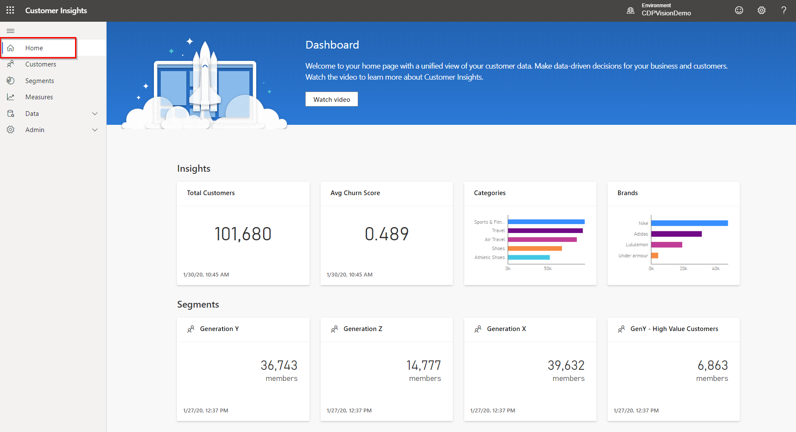
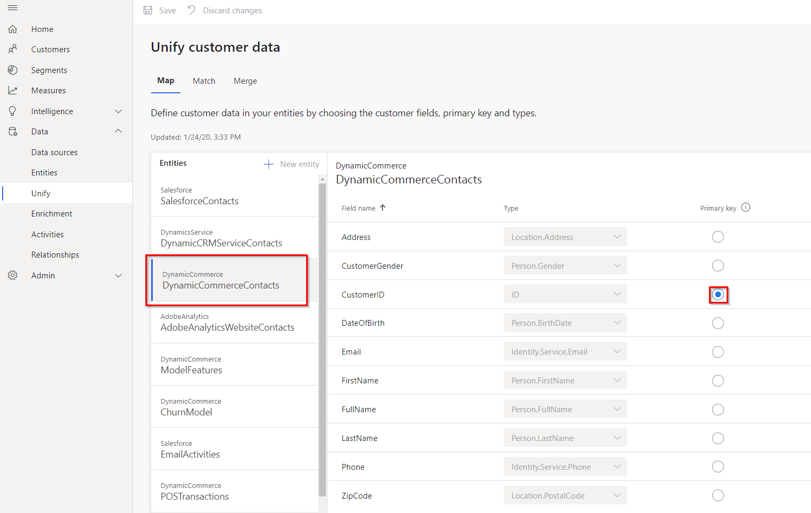
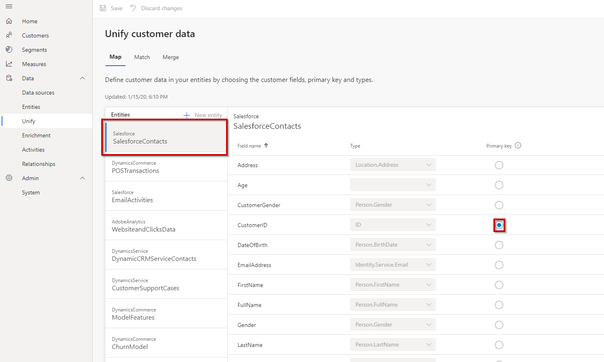
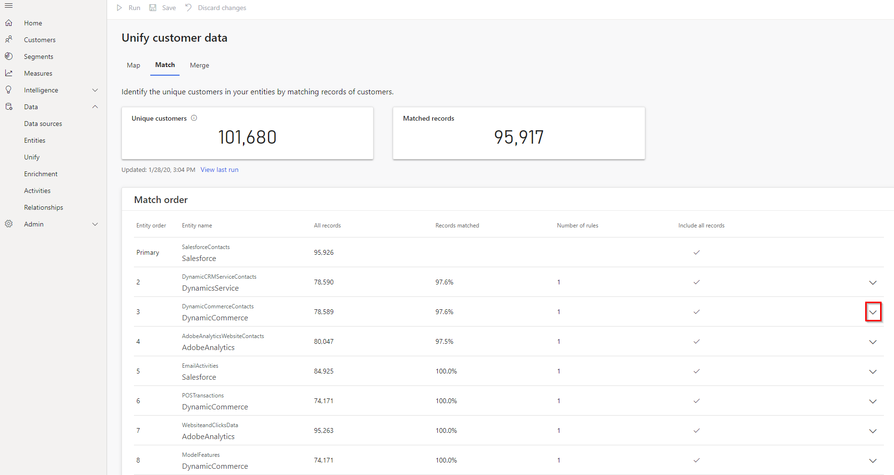
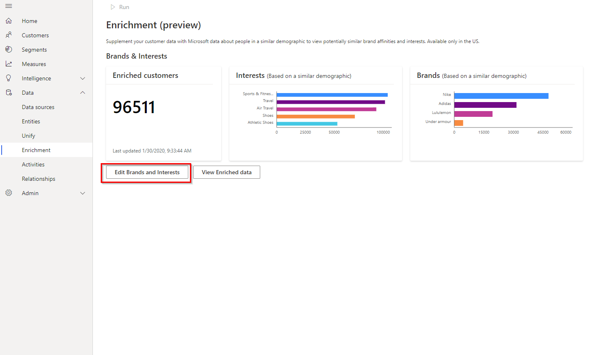
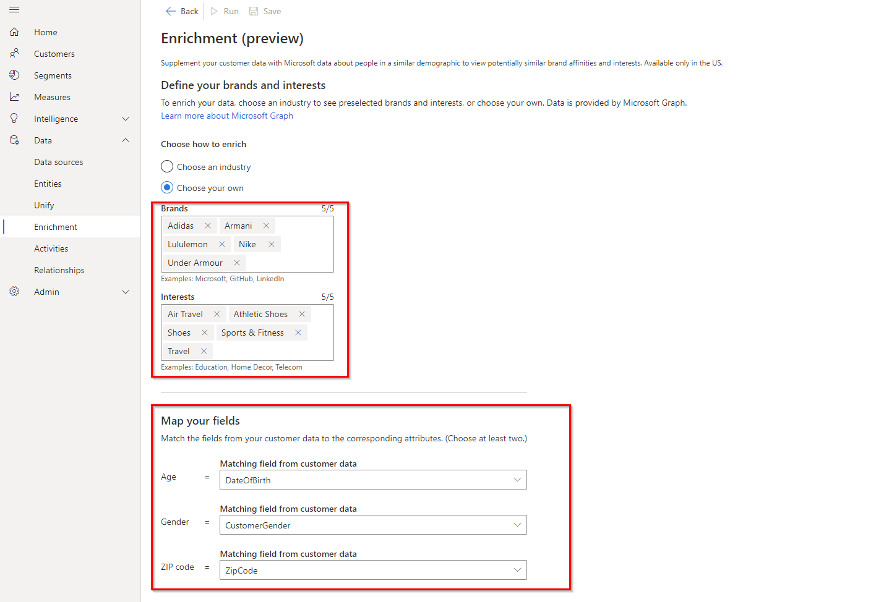
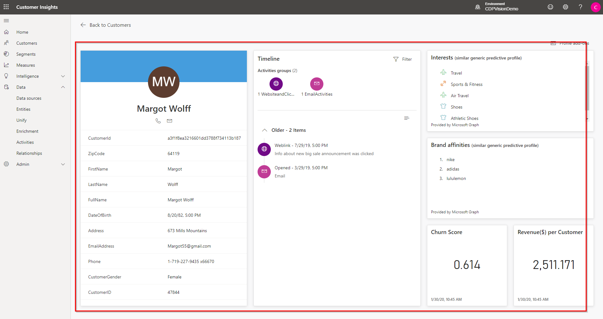
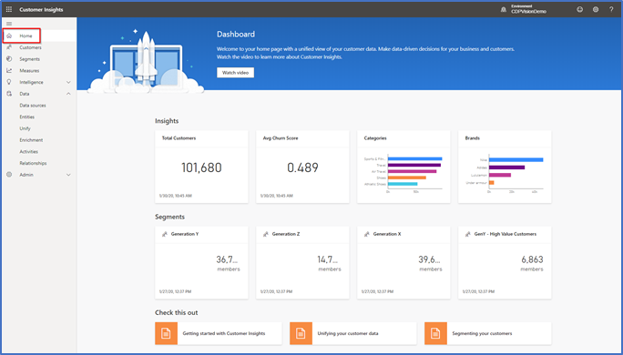

# Customer Insights

1. **Navigate** to "Customer Insights" tab in the browser [https://home.ci.ai.dynamics.com/
](https://home.ci.ai.dynamics.com/)
2. Login with CI credentials provided in the setup document and observe various KPIs and customer segments available.

3. **Select** "Data" and then "Data Sources" and next **hover over Data Sources** on the right to see different data sources.

4. **Select** Unify to navigate to the Unify page.

5. **Select** map and then **select** "SalesForceContacts" to see various fields that can be mapped to common data model fields. Observe that the ID Column is selected as Primary Key for mapping.

6. **Select** "DynamicsCRMServiceContacts" to see various fields that can be mapped to common data model fields. Observe that ID Column was selected as Primary Key for mapping

7. **Select** "Match".

8. **Select** the drop-down arrow.

9. **Show** that the Email column is used for fuzzy matching from Entity Dynamics Commerce as an example.

10. **Select** “Merge”

11. **Select** Enrichment from the left navigation and then **select** Edit Brands and Interests.

12. Now look out various Enrichment options available.

13. **Select** "Segments" on the left navigation and observe the different customer segments

14. **Select** "Customers" on the left side bar to see the Customers Page.

15. **Type** “Margot Wolff” into the search field on the far left on the page to get Margot Wolff’s Customer Profile and then **select** Margot Wolff’s Customer Profile.

16. **Show** Margot Wolff’s profile. 

17. **Select** “Home” on the left sidebar to go back to the Home page of Customer Insights.

