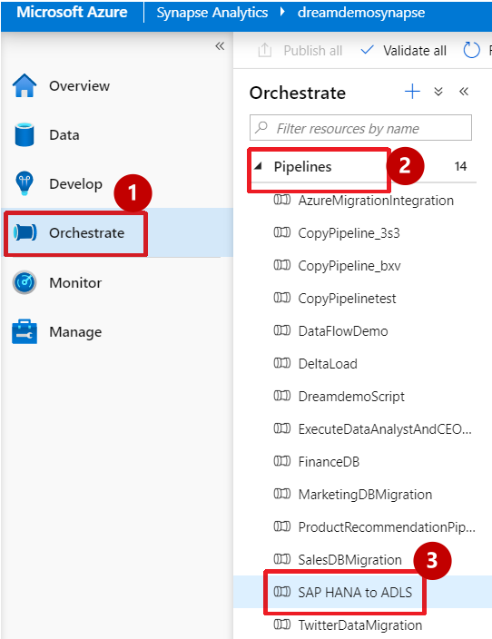

## Data Orchestration and Ingestion

### Orchestrate Hub and Data Pipelines

1. **Select** “Orchestrate”

2. **Select/Expand** “Pipelines” and then **Select** “SAP HANA TO ADLS” pipeline.

#### Migrate SAP Hana to Azure Synapse Analytics

3. From the editor window **Select** copy data activity. Then **select** ‘Source’ property of the copy data activity to see the Source Dataset and observe that the query is pulling data from SAP Hana

4. With copy data selected, **Select** the ‘Sink’ property of the copy data activity. Look at the Sink dataset, in this case; you are saving to ADLS Gen2 storage container.

5. **Select** Mapping Data Flow activity and then **select** Settings. Next **select** "Open" to go to Data Flow editor.

6. In Data Flow editor **observe** the flow. Look in detail into each activity using the following steps.

7.	In the **first activity**, we are selecting data from the Data Lake staging area.
8.	In the **second activity**, we are filtering data for the last 5 years.

9.	In the **third activity**, we are deriving columns from a Column Order Date.

10.	In the **fourth activity**, we are only selecting the required columns from the table.

11. In the **fifth activity**, we are creating an aggregated Total Sales grouped by Year and Month.

12. In the **sixth activity**, we load the aggregated table to Azure Synapse.

20. In the **seventh activity**, we are taking a parallel route by selecting all the remaining rows and writing the full table to Azure Synapse.

21. To view all the available transformations in the data flow editor, **select** the + (add action), which is to the right of the first activity.

22.	**Scroll down** to see the full list of transformations at different levels.

