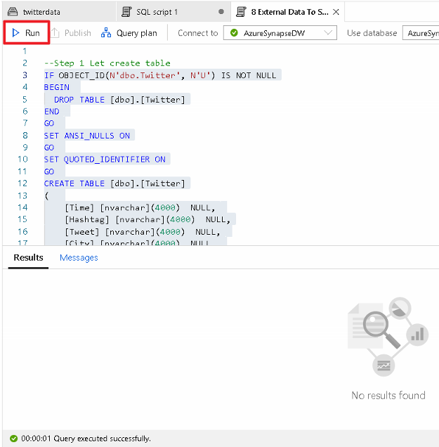
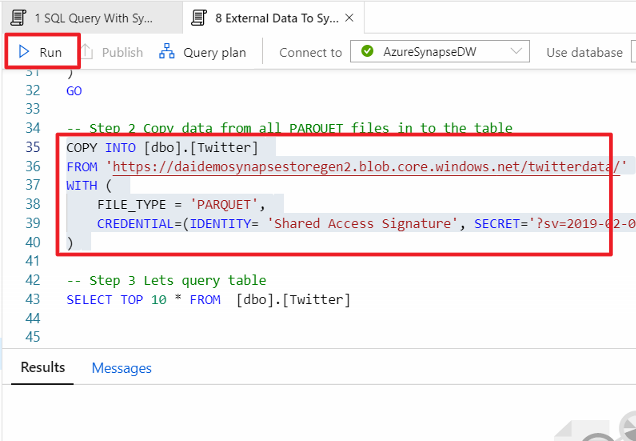

#### COPY INTO Command

1. **Select** Develop, then **expand** SQL Scripts to list all available scripts. **Select** “8 External Data to Synapse Via Copy Into” and **highlight** the query presented below titled "Step:1".

2. **Select** Run and observe the “No results found” message.

3.	**Scroll** to the bottom and **select** "COPY INTO" query below "Step:2" as shown in the screenshot. Finally, **select** "Run"

