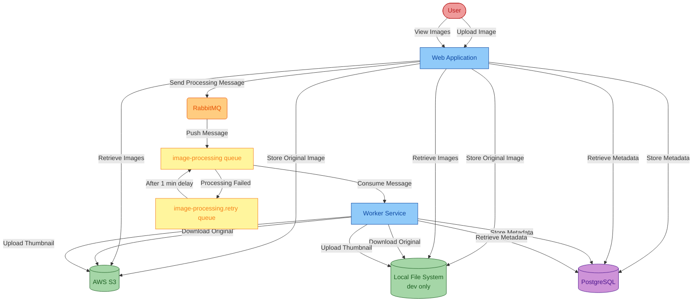
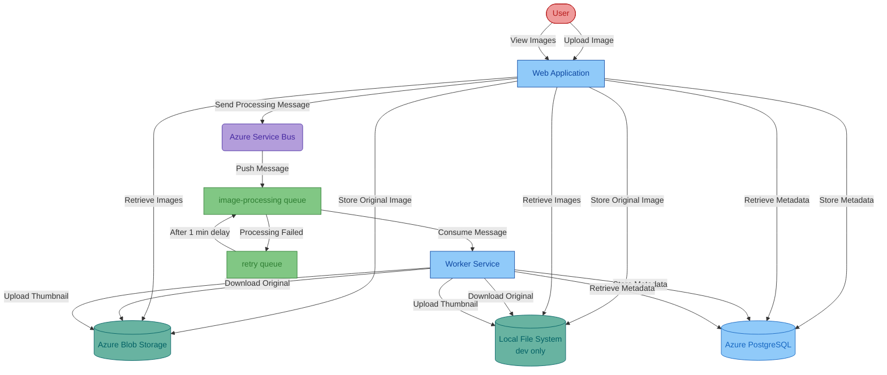

# Asset Manager
Sample project for migration tool code remediation that manages assets in cloud storage.

## Current Infrastructure
The project currently uses the following infrastructure, in [`main`](https://github.com/Azure-Samples/java-migration-copilot-samples/tree/main/asset-manager) branch:
* AWS S3 for image storage, using password-based authentication (access key/secret key)
* RabbitMQ for message queuing, using password-based authentication
* PostgreSQL database for metadata storage, using password-based authentication

## Current Architecture

Password-based authentication

## Migrated Infrastructure
After migration, the project will use the following Azure services, in [`expected`](https://github.com/Azure-Samples/java-migration-copilot-samples/tree/expected/asset-manager) branch:
* Azure Blob Storage for image storage, using managed identity authentication
* Azure Service Bus for message queuing, using managed identity authentication
* Azure Database for PostgreSQL for metadata storage, using managed identity authentication

## Migrated Architecture

Managed identity based authentication

## Run Locally

Check out the [`main`](https://github.com/Azure-Samples/java-migration-copilot-samples/tree/main/asset-manager) branch to run the current infrastructure locally:

```bash
git clone https://github.com/Azure-Samples/java-migration-copilot-samples.git
cd java-migration-copilot-samples/asset-manager
git checkout main
```

**Prerequisites**: JDK, Docker

Run the following commands to start the apps locally. This will:
* Use local file system instead of S3 to store the image
* Launch RabbitMQ and PostgreSQL using Docker

Windows:

```batch
scripts\start.cmd
```

Linux:

```bash
scripts/start.sh
```

To stop, run `stop.cmd` or `stop.sh` in the `scripts` directory.

## Run Migrated Code on Azure

Check out the [`expected`](https://github.com/Azure-Samples/java-migration-copilot-samples/tree/expected/asset-manager) branch to run the migrated infrastructure on Azure:

```bash
git clone https://github.com/Azure-Samples/java-migration-copilot-samples.git
cd java-migration-copilot-samples/asset-manager
git checkout expected
```

**Prerequisites**: Azure CLI and you have signed in using `az login`

Run the following commands to deploy the apps to Azure. This will:
* Use Azure Blob Storage instead of S3 to store the image
* Use Azure Service Bus instead of RabbitMQ for message queuing
* Use Azure Database for PostgreSQL Flexible Server instead of PostgreSQL for metadata storage

Windows:

```batch
scripts\deploy-to-azure.cmd -ResourceGroupName <your resource group name> -Location <your resource group location, e.g., eastus2> -Prefix <your unique resource prefix>
```

Linux:

```bash
scripts/deploy-to-azure.sh -ResourceGroupName <your resource group name> -Location <your resource group location, e.g., eastus2> -Prefix <your unique resource prefix>
```

To clean up, run `scripts\cleanup-azure-resources.cmd -ResourceGroupName <your resource group name>` or `scripts/cleanup-azure-resources.sh -ResourceGroupName <your resource group name>` for Windows and Linux, respectively.

### Use GitHub Codespaces for Deployment

The deployment scripts can also be executed in GitHub Codespaces, which pre-installs the necessary dependencies. Follow the steps below to deploy the apps to Azure using GitHub Codespaces:

1. Open the repository in GitHub Codespaces by selecting on the **Code** button, selecting **Codespaces** tab, openining the existing codespace or selecting **Create codespace** for the target branch.
1. The codespace will automatically open in the browser. Wait until it is ready.
1. Navigate to the terminal in the codespace and run `az login` to sign in to Azure. Follow the instructions to complete the sign-in process.
1. At the last step of the sign-in process, you will be asked to select a subscription and tenant. Select the appropriate subscription and tenant.
1. Run the following commands in the terminal to deploy the apps to Azure:

   ```bash
   cd asset-manager && git pull
   scripts/deploy-to-azure.sh -ResourceGroupName <your resource group name> -Location <your resource group location, e.g., eastus2> -Prefix <your unique resource prefix>
   ```

1. To clean up, run `scripts\cleanup-azure-resources.cmd -ResourceGroupName <your resource group name>` or `scripts/cleanup-azure-resources.sh -ResourceGroupName <your resource group name>` for Windows and Linux, respectively.

## Java Migration Copilot Workshop

Check out the [`workshop`](https://github.com/Azure-Samples/java-migration-copilot-samples/tree/workshop/asset-manager) branch for Java Migration Copilot workshop:

```bash
git clone https://github.com/Azure-Samples/java-migration-copilot-samples.git
cd java-migration-copilot-samples/asset-manager
git checkout workshop
```

Compared to the `main` branch, the `workshop` branch has additional commits that have already migrated the code for **Web Application** with custom code remediation, including:
* Azure Blob Storage for image storage, using managed identity authentication
* Azure Service Bus for message queuing, using managed identity authentication

The remaining targets of the workshop are:
* For both **Web Application** and **Worker Service**, migrate to Azure Database for PostgreSQL Flexible server for metadata storage with managed identity authentication, using predefined prompt.
* For **Worker Service**, migrate to Azure Blob Storage and Azure Service Bus for image storage and message queuing, respectively, with managed identity authentication, using custom propmt created from existing commits that migrated the **Web Application**.

Once the workshop is successfully completed, you should be able to run the migrated code on Azure, similar to [Run Migrated Code on Azure](#run-migrated-code-on-azure) but using the `workshop` branch with the migrated code.

For more details, refer to the [workshop guide](https://github.com/Azure-Samples/java-migration-copilot-samples/blob/workshop/asset-manager/WORKSHOP.md).
