# Modern Analytics with Microsoft Fabric, Copilot and Azure Databricks DREAM Lab (Lab332)
 
**The estimated time to complete this lab is 45-60 minutes.**
 
## Table of Contents
 
## [Exercise 1: Data Engineering experience - Data ingestion from a spectrum of analytical data sources into OneLake](#exercise-1-data-engineering-experience---data-ingestion-from-a-spectrum-of-analytical-data-sources-into-onelake-1)
 
 - [Task 1.1: Use the Data Pipelines/Data Flow for a ‘No Code, Low Code experience’](#task-11-use-the-data-pipelinesdata-flow-for-a-no-code-low-code-experience)

 - [Task 1.2: Transform data using Dataflow Gen2 using a ‘No Code, Low Code experience’ Copilot](#task-12-transform-data-using-dataflow-gen2-using-a-no-code-low-code-experience-copilot)

 - [Task 1.3: Use the ‘New Shortcut’ option from external data sources](#task-13-use-the-new-shortcut-option-from-external-data-sources) 


## [Exercise 2: DLT Pipelines, Unity Catalog (Data governance), Metastore experience, Retrieval Augmented Generation (RAG) and Machine Learning (ML)](#exercise-2-dlt-pipelines-unity-catalog-data-governance-metastore-experience-retrieval-augmented-generation-rag-and-machine-learning-ml-1)
 
 - [Task 2.1: Explore Delta Live Table pipeline (Data Transformation)](#task-21-delta-live-table-pipeline-interactive)
 
 - [Task 2.2: Explore the data in the Azure Databricks environment with Unity Catalog (unified governance solution for data and AI)](#task-22-explore-the-data-in-azure-databricks-environment-with-unity-catalog-unified-governance-solution-for-data-and-ai)
	
 - [Task 2.3 Deploy LLM Chatbots With the Data Intelligence Platform](#task-23-optionaldeploy-llm-chatbots-with-the-data-intelligence-platform) 

 
## [Exercise 3: Power BI Experience](#exercise-3-power-bi-experience-1)
 
- [Task 3.1: Create a Semantic model and generate insights using Copilot for Power BI in Microsoft Fabric](#task-31-create-a-semantic-model-and-generate-insights-using-copilot-for-power-bi-in-microsoft-fabric)


## [Exercise 4: Real-time Intelligence experience - Explore Streaming data using Copilot for KQL DB (optional)](#exercise-4-real-time-intelligence-experience-explore-streaming-data-using-copilot-for-kql-db)
 
- [Task 4.1: Ingest real-time/historical data into KQL DB using Eventstream](#task-41-ingest-real-timehistorical-data-into-kql-db-using-eventstream)
 
- [Task 4.2: Analyze/discover patterns, identify anomalies and outliers using Copilot](#task-42-analyzediscover-patterns-identify-anomalies-and-outliers-using-copilot)


## [Exercise 5: Data Science experience - Explore Machine Learning and Business Intelligence scenarios in ADB (read only)](#exercise-5-data-science-experience---explore-machine-learning-and-business-intelligence-scenarios-in-adb-read-only)
 
- [Task 5.1: Build ML models, experiments, and log ML model in the built-in model registry using MLflow and batch scoring](#exercise-5-data-science-experience-explore-machine-learning-and-business-intelligence-scenarios-in-adb-read-only)


## OVERVIEW

---
 

This lab showcases Modern Analytics with Microsoft Fabric and Azure Databricks, featuring a cost-effective, performance-optimized, and cloud-native Analytics solution pattern. This architecture unifies our customers' data estate to accelerate data value creation.

The visual illustrates the real-world example for Contoso, a fictitious company. Contoso is a retailer with thousands of brick-and-mortar stores across the world and an online store. Contoso is acquiring Litware Inc. which has curated marketing data and sales data processed by Azure Databricks and stored in the gold layer in ADLS Gen2. Contoso also has their customer churn data stored in the gold layer in ADLS Gen2.

In the following exercises, you will see how the Contoso team leveraged the power of Microsoft Fabric to ingest data from a spectrum of sources, combine Litware's data with their existing data from ADLS Gen2, and derive meaningful insights. Witness how they used a shortcut to reference Litware’s existing data from ADLS Gen2. Finally, you will see how Contoso’s data architects utilized Unity Catalog to quickly get up to speed on the acquired company’s data. You will also see the power of creating LLM Chatbots with the Databricks Data Intelligence Platform to achieve an unprecedented market sentiment for Contoso.

The lab scenario starts on January 30th. The company's new CEO, April, noticed negative trends in their KPIs, including:

High customer churn

Declining sales revenue

High bounce rate on their website

High operating expense

Poor customer experience

And most importantly, a low market sentiment

To address the high customer churn, April and the Contoso team decided to acquire Litware Inc., which carries products popular with millennials. April asks Rupesh, the Chief Data Officer, how they could create a data driven organization and reverse these adverse KPI trends. Rupesh talks to his technical team, including Eva, the data engineer, Miguel, the data scientist and Wendy, the business analyst. Rupesh tasks them with designing and implementing a solution pattern to realize this dream of a data driven organization. They recognize that the existence of data silos within Contoso's various departments presents a significant integration challenge. This challenge is worsened by the need to combine its subsidiary data and data from Litware Inc.

During this lab you will execute some of these steps as a part of this team to reverse these adverse KPI trends. First, you will ingest data from a spectrum of data sources into OneLake for Contoso. Let's get started.

### Exercise 1: Data Engineering experience - Data ingestion from a spectrum of analytical data sources into OneLake

*Before we start executing the steps, we will trigger the simulator app to start streaming data to eventhub.*

1. Open a Microsoft Edge browser in **InPrivate** mode. 

2. Navigate to the Azure Portal at [https://portal.azure.com/]

3. Log into the VM with the password provided in the **Resources** tab located on the right side of the screen.

4. Use these credentials to log into the Azure Portal.

>**Note:** Close the Save password pop-up box.

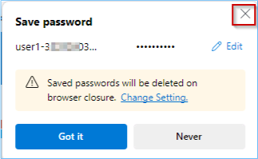

5. If prompted to stay signed in, select **Yes**.

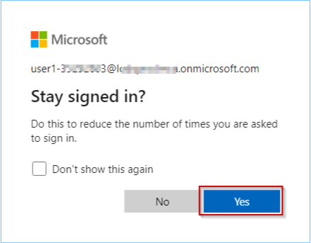

>**Note:** If prompted to take a tour, select **Maybe later**.


6. Search for **resource group** in the search bar at the top of the page and click on the **Resource groups** option.

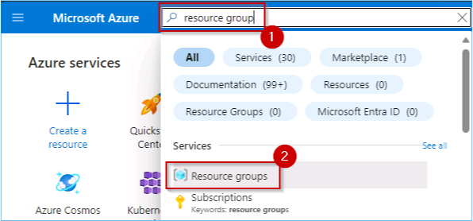

7. Search for **rg-fabric** in the searchbox and click on the **resource group**. 

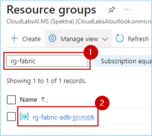

8. Search for **app service** and select the app service labeled **app-realtime-simulator...**

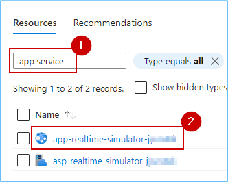

9. Click on the **Browse** button and a new tab will open.


10. **Wait** for the page to load. The following page will appear.


---

### Task 1.1: Use the Data Pipelines/Data Flow for a ‘No Code, Low Code experience’

In this exercise, you will act as the Data Engineer and transfer Contoso's data from from Azure SQL Database into the Lakehouse. 

1. Open a new tab on your browser and navigate to Microsoft Fabric at [https://app.fabric.microsoft.com].

2. On the Microsoft Fabric landing page, click on the **Data Factory** experience.

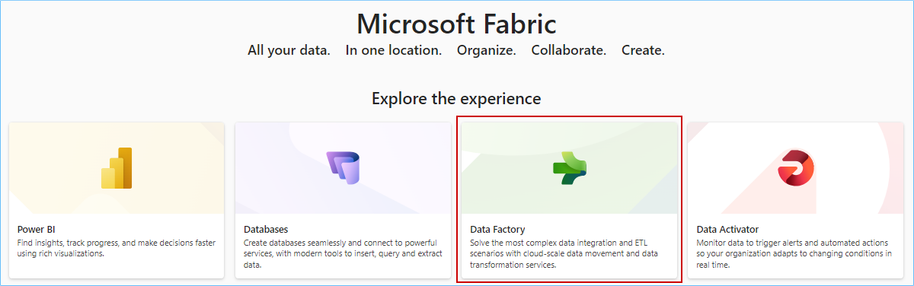

3. Click on **Workspaces** and select the **contosoSales...** workspace.

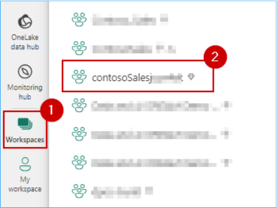

4. Click the **Data Factory** icon in the bottom left corner of the screen to select **Data Factory**.

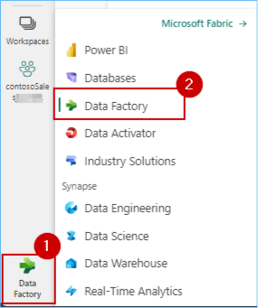

5. Click on **Data pipeline**.

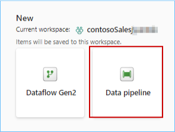

6. In the pop-up, type the pipeline name **Azure SQL DB Pipeline** and click on the **Create** button.


7. In the Data pipeline window, click on **Copy data assistant**.


8. In the pop-up, click on **+New** tab and scroll down through the resources, click on **Azure SQL Database**.

>**Note** You may not see the **Azure SQL Database** in the same location as shown in the screenshot.


9. Select the **Create new connection** radio button.


>**Note:** To fill in the details for required fileds, we need to fetch the data from the SQL Database resource deployed in the Azure Portal.


10. Navigate to the **Azure Portal**, in the resource group **rg-fabric...**, search for **sql server** in the resource group window and click on the **mssql...** resource.

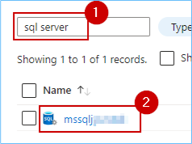

11. Copy the **Server name**.

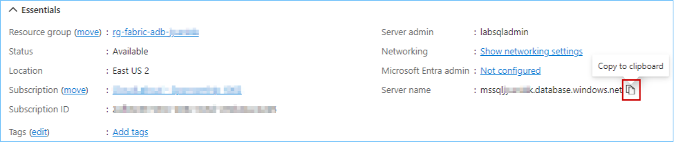

12. Navigate back to the **Fabric** tab on your browser.

<todo  Do we need screenshot here to show Fabric Tab>

13. In the **Server** field, paste the value you copied in step number **11* and type **SalesDb** in the **Database** field.


14. Scroll down and select **Basic** for Authentication kind, enter **labsqladmin** as the Username, **Smoothie@2024** as the Password and click on the **Next** button.


>**Note:** Wait for the connection to be created.

15. Click on the **checkbox** for **Select all** and then click on the **Next** button.

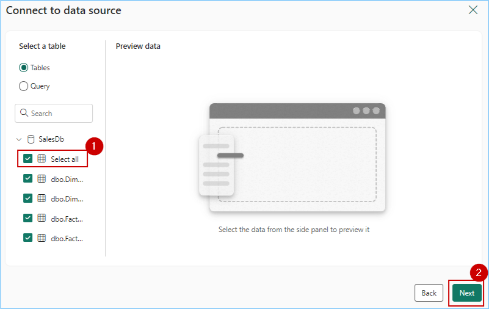

16. Select **OneLake Data Hub**, then select the lakehouse with the concatenated suffix.

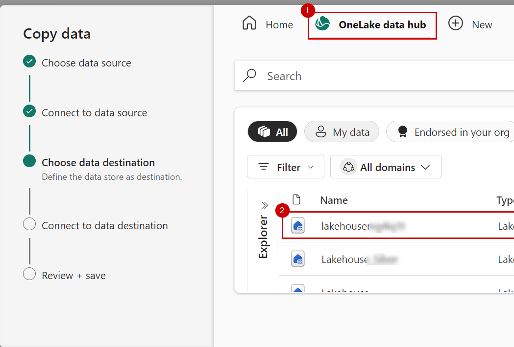

17. Select the **Load to new table** radio button, click on the **checkbox** beside **Source** and then click on **Next**.

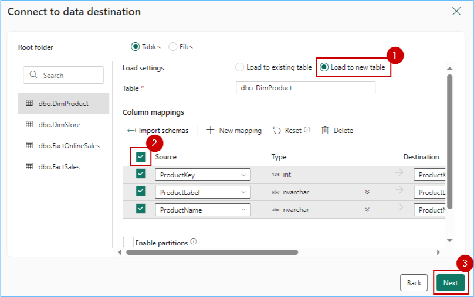

18. Click on **Save + Run**.

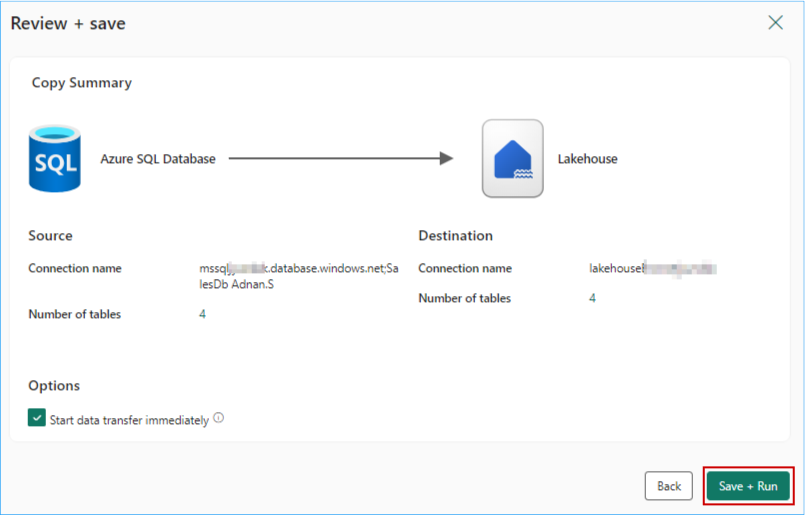

19. Click on the **OK** button in the Pipeline run window.

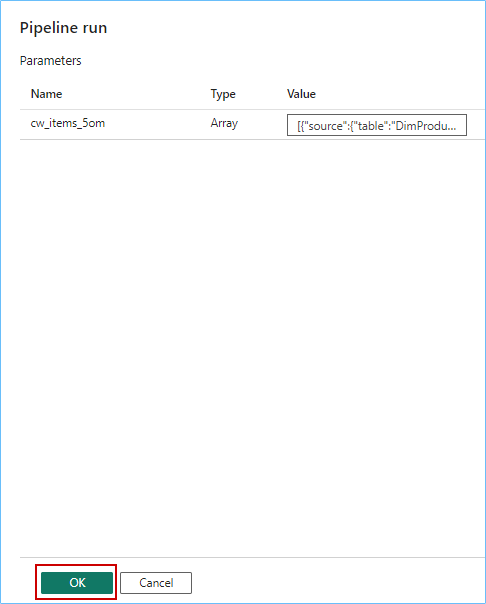

>**Note:** Wait for the pipeline to execute.

20. Click on the bell icon at the top right of the screen to verify the **Running status** of the pipeline.

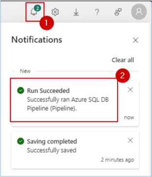

21. Your data has been transfered from Azure SQL Database to Lakehouse.

22. Similarly, you can get data into the Lakehouses using pipelines from various other sources like Snowflake, Dataverse, etc.

---

### Task 1.2: Transform data using Dataflow Gen2 using a ‘No Code, Low Code experience’ Copilot

In this exercise, you will experience how easy it is to use Copilot to transform Litware's sales data into the lakehouse. 

1. Click on the **Data Factory** icon on the bottom left corner of the screen and select **Data Factory**.


2. Click on **Dataflow Gen2**.


3. Click on the top part of the **Get data** icon (**not on the dropdown arrow at the bottom of the icon**).

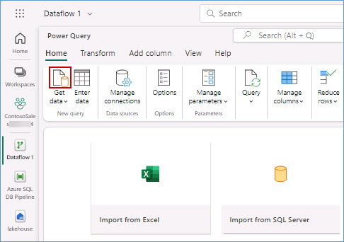

4. In the pop-up window, scroll down in **OneLake data hub** and click on **lakehouse**.

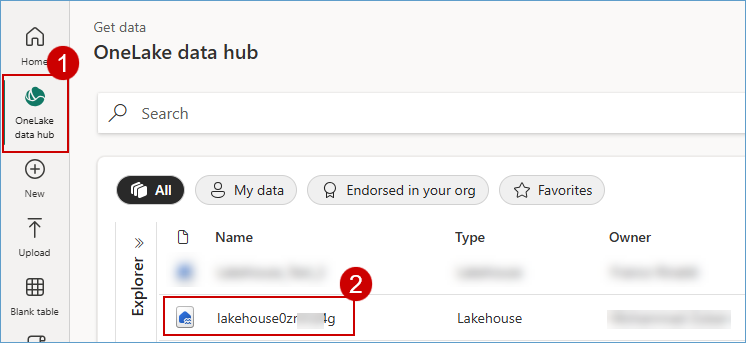

5. If you see a screen similar to the one shown below, click on the **Next** button.

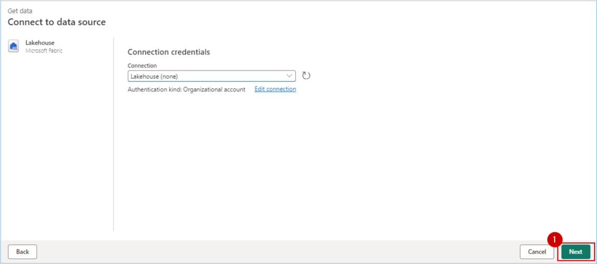

6. Expand **Lakehouse** and select **Files**. 

7. Select the **sales_data.csv** checkbox, then **click** on the **Create** button.

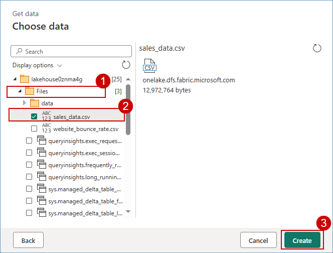

8. Collapse the **Queries** pane and take a look at the sales dataset (**note that the first row of this dataset is not a header**).


>> **Let's use Copilot to perform data cleansing.**

9. Click on the **Copilot** button, paste the **prompt** provided below in the text box and click on the **send** icon.

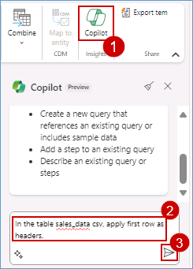

```
In the table sales_data csv, apply first row as headers.
```


>**Note:** If Copilot needs additional context to understand your query, consider rephrasing the prompt to include more details.

10. Scroll to the right hand side and observe the **GrossRevenue** and **NetRevenue** columns (**there are some empty rows with null values**).

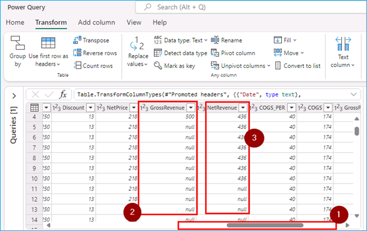

>> **Let's use Copilot to remove empty rows.**

11. Similarly, paste the prompt below in Copilot and click on the **send** icon.

```
Remove empty rows from GrossRevenue and NetRevenue columns.
```

12. Scroll to the right hand side and observe the **GrossRevenue** and **NetRevenue** columns (**there are no empty rows with null values**).


>**Note:** If necessary, scroll up to show the close icon.

12. Click on the **close** icon at top right of the **Dataflow** window.


13. Click on **Yes**.


---

### Task 1.3: Use the ‘New Shortcut’ option from external data sources

Now this is something exciting! This section shows how easy it is to create shortcuts without actually moving data. That is the power of OneLake! In this exercise, you will ingest the curated marketing and product reviews data from ADLS Gen2. 

1. In the contosoSales... workspace, click on **Filter** and select **Lakehouse**.

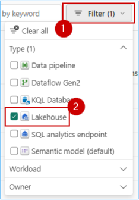	

2. Click on the **lakehouse...**.

>**Note:** There are 3 options for lakehouse{SUFFIX}, namely Lakehouse, Dataset (default) and SQL endpoint. Make sure you select the **Lakehouse** option.

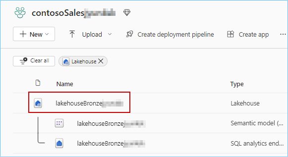

3. Click on the **three dots (Elipse)** on the right side of Files.

4. Click on **New shortcut**.


5. In the pop-up window, under **External sources**, select the **Azure Data Lake Storage Gen2** source.


>**Note:** Wait for the screen to load.

6. In the screen below, we need to enter the connection details for the ADLS Gen2 shortcut. For this, we need to get the details from the Storage Account resource.

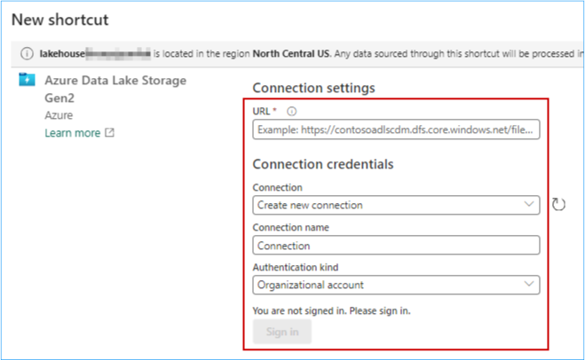

7. Navigate to the **Azure Portal**, in the **rg-fabric...** resource group search for **storage account** and click on the storage account resource.

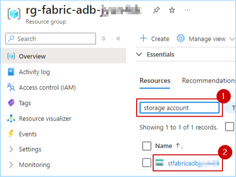

8. Expand the **Security + networking** section and click on **Access keys**.


9. Click on the **Show** button under **key1**.

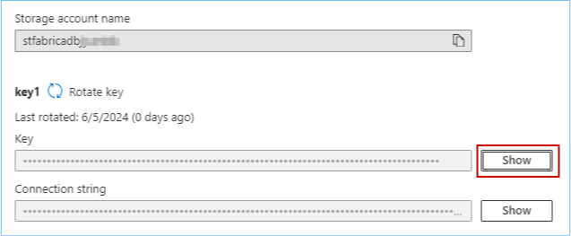

10. Click on the **Copy to clickboard** button.

11. Save this information in a notepad for further use.

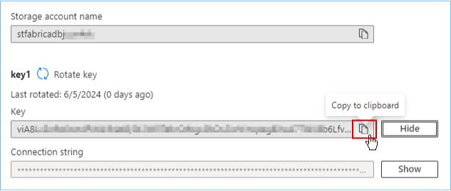

12. In the left pane, expand the **Settings** section and click on **Endpoints**.

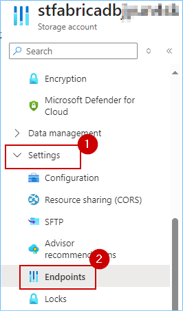

13. Scroll down to copy the **Data Lake Storage** endpoint in the **Data Lake Storage** section.

14. Save the information in a notepad for further use.

>**Note:** You may see different endpoints in addtion to the ones shown in the following screen. Make sure to select **only** the **Data Lake Storage** endpoint.


15. Navigate back to the **Fabric** tab.

16. Paste the endpoint copied in **step 13** under the **URL** field.

17. In the **Authentiation kind** dropdown, select **Account Key**.

18. Paste the **account key** copied in **step number 10**.

19. Click on **Next**.

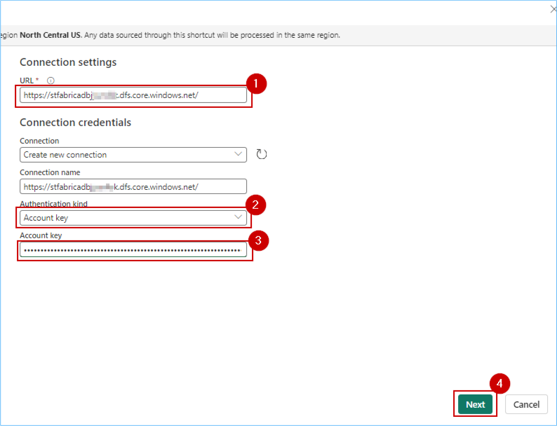

20. Select the **data** checkbox and click on the **Next** button.

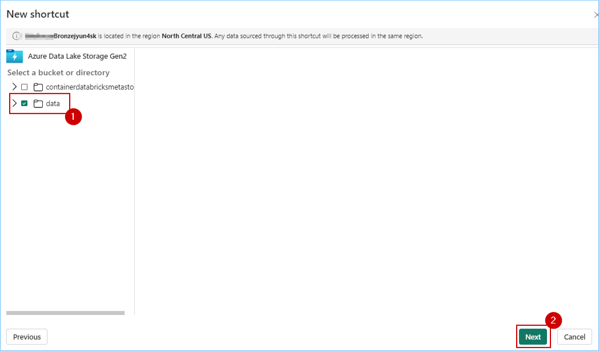

21. Click on the **Create** button.

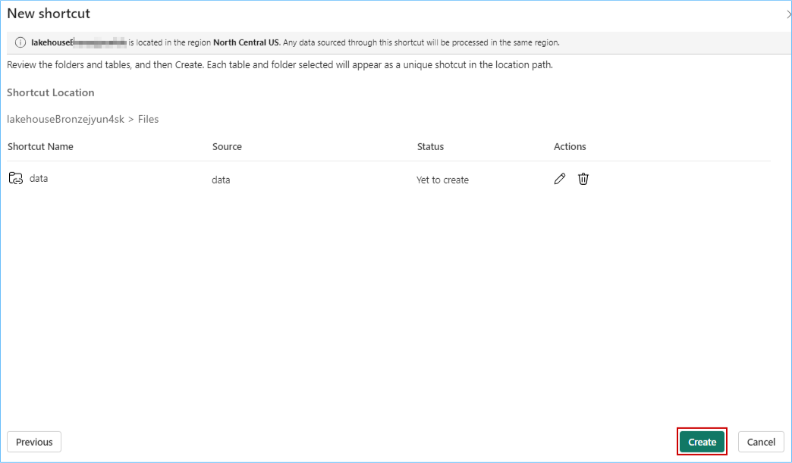

---

## Exercise 2: DLT Pipelines, Unity Catalog (Data governance), Metastore experience, Retrieval Augmented Generation (RAG) and Machine Learning (ML)

### Task 2.1: Delta Live Table pipeline (Interactive)

1. Navigate to the **Azure Portal**, in the **rg-fabric...** resource group, search for **databricks** and click on the databricks resource with the name **adb-fabric...**.

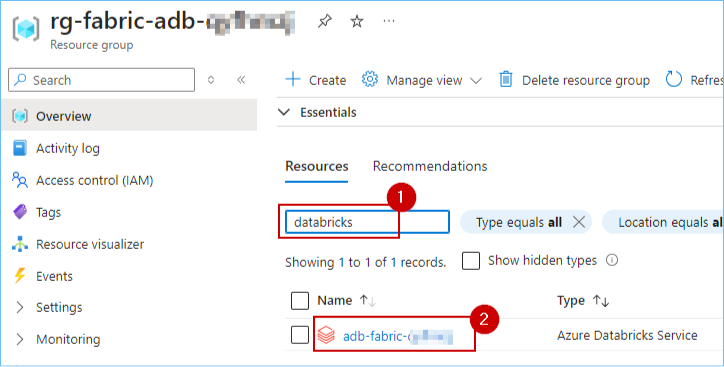

2. Click on the **Launch Workspace** button.

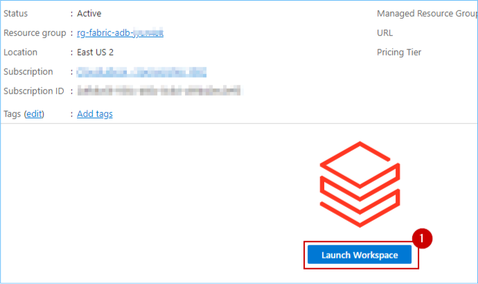

3.	In the left navigation pane click on **Delta Live Table** and click on the **Create pipeline** button.


4. Enter the name of the pipeline as **DLT_Pipeline** and click on the file icon to browse the notebook.

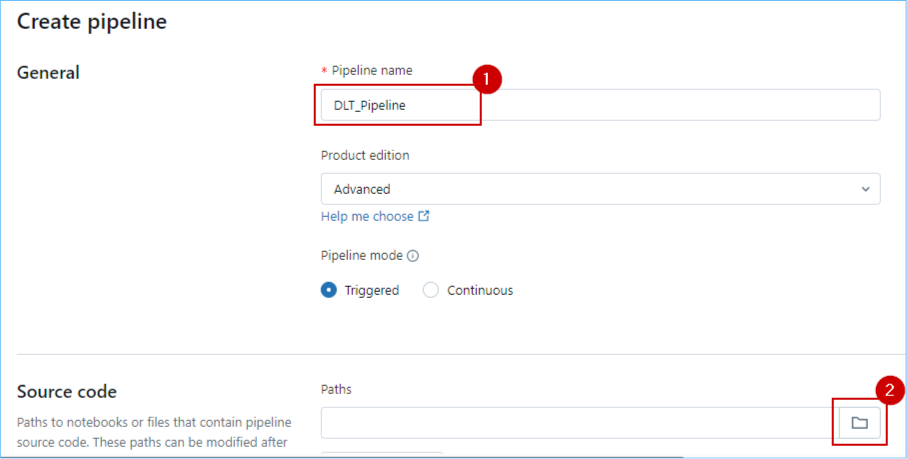

5. Click on **Shared**.

6. Click on **Analytics with ADB**.

7. Click on the **01 DLT Notebook**.

8. Click on the **Select** button.

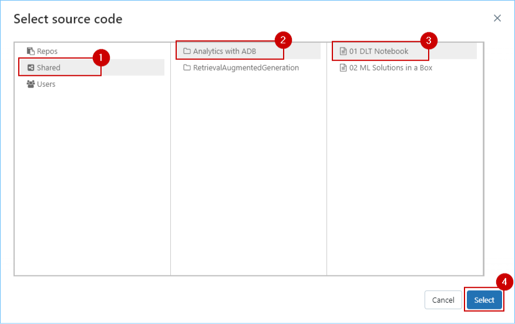

9. In the Destination tab, select the **Unity Catalog** radio button.

10. In the Catalog box select **litware_unity_catalog** from dropdown.

11. In the Target schema, select **rag** from the dropdown.

12. Click on the **Create** button.


13. From the top right hand-side click on **Start**.


14. Wait for the pipeline run to complete, once its completed the result would look similar to the following screen.


---

### Task 2.2: Explore the data in Azure Databricks environment with Unity Catalog (unified governance solution for data and AI).
	
We saw how Contoso was able to utilize DLT pipelines to create a medallion architecture on their data. Now let us take a look at how data governance was managed on this curated data across the organization and how it was made easy with Unity catalog.
 
With the acquisition of Litware Inc., Contoso had a lot of data integration and interoperability challenges. Contoso wanted to make sure that the transition was smooth and data engineers and scientists from Contoso could easily assimilate the data processed by Databricks. Thankfully, they had the help from a wide selection of Gen AI features right within Azure Databricks to understand and derieve insights from this data. Let's see how!

2. Expand **litware_unity_catalog db**.

3.	Expand the **rag** schema and click on **tables**.

4.	Click on **documents_embeddings** table.

>**Note**: If you have used OpenAI for text embeddings during the deployment, then select **documents_embedding_openai** table.

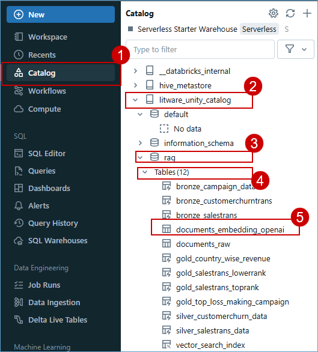

5.	Click on **Accept** in 'AI Suggested Comment' box and Click on **AI Generate**.


	
We can see that AI in Azure Databricks has autogenerated the description for the table and its columns. Users can choose to accept the descriptions or edit them further. This improves the ease of governance on this new data for Contoso. No need to read through tons of documents for the Contoso data engineers to learn about Litware's data. How cool is that? Next, let's see how easy it is to query the data.

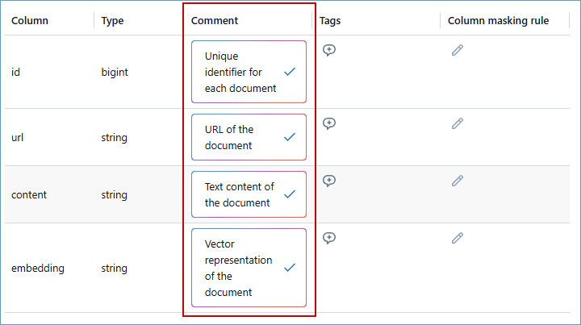

6. From the left hand-side pane, select **silver_customerchurn_data** table.

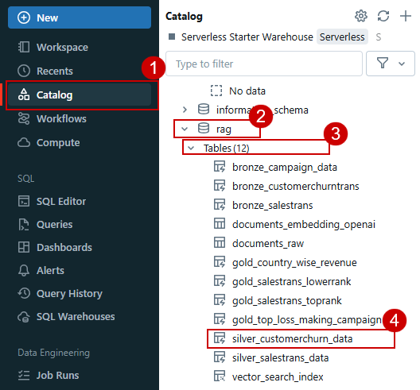
	
7.	Select the dropdown on **Create**.

8.	Click on **Query**.


	
9.	Select the **Assistant** tab.

10.	Click on the query area and type ```Retrive the average total amount of transactions for each store contract. Additionally, calculate the average total amount for customers who have churned and for those who have not churned. Ensure all average values are rounded to the nearest whole number.``` then click on send button.
	

	
By simply using a natural language query, and leveraging the AI generated table and field descriptions mentioned earlier, Azure Databricks generates an equivalet SQL query. No need to be skilled in SQL queries and so business friendly right?
	
11. Click on the **Arrow** to replace the current code.


12.	Click on **Run**.

13.	Check the output.


Users also have the capability to fix errors in queries with the AI assistant. Let us intentionally introduce an error by misspelling a table name and see the AI's response.
	
14. In the query, click on **churnstatus** to misspell it.

15. Click on **Run** to see the error.

16. Click on **Diagnose error** to fix the query issue. And see how easily the error is fixed! It is like have a virtual assistant available 24 hours!

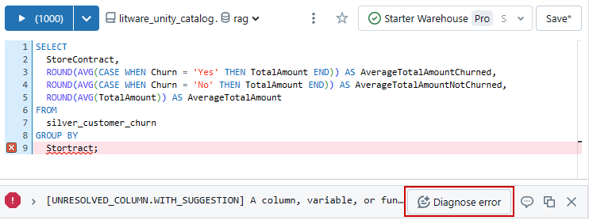

17. Click on the **Arrow** to replace the current code.


	
Data discovery is also made simple within Azure Databricks. Users can simply search for table names or the information they are looking for in the global search and all the relevant items are returned, again leveraging the table and field descriptions created by AI and data intelligence mentioned earlier.
	
18. Click on **Search*.

19. Click on **Open search in a full page**.


20. Click to search for **campaigns** and click on show all results. Now, the next big challenge for Contoso was to get visibility of their Market Sentiment KPI. Remember, the Market Sentiment before the acquisition was at an all time low. News articles and analyst reviews were being continuously published. All this unstructured data had to be efficiently assimilated so that the Market Sentiment could be tracked. That brings us to the next task. Let us see!

---

### Task 2.3 (OPTIONAL)Deploy LLM Chatbots With the Data Intelligence Platform 

Contoso also wanted to improve their efficientcy with analyzing hundreds of documents about their big merger and their company policies. Azure Databricks provides just the solution with its Delta Lake architecture supporting unstructured data, like PDF documents, with Lang chain models leveraging Databricks Foundation Model for creating custom chatbots. Let's see how this was done.

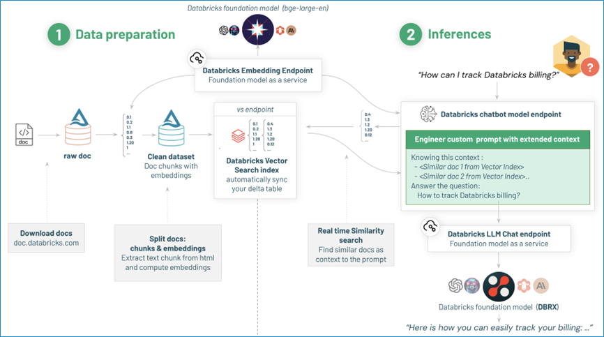

First, let's ingest our PDFs as a Delta Lake table with path URLs and content in binary format.

1.	Go to **Unity Catalog Volumes**.

2.	Click on **documents_store**.

3.	Click on **pdf_documents**.

4.	Review the Knowledge Base (pdfs).


We'll use Databricks Autoloader to incrementally ingeset new files, making it easy to incrementally consume large volume of files from the data lake in various data formats. Autoloader easily ingests our unstructured PDF data in binary format.

5. Click on **Workspaces* and open the notebook from the path shown in the screenshot below.

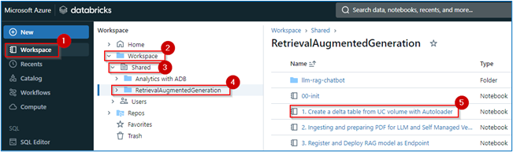

This notebook is used to convert the ingested document into delta tables. Lets look at the output tables.

6. Click on **Catalog** and under **rag** database, click on the **documents_raw** table.

7.	Click on **Sample Data**.

8.	Review the delta table.

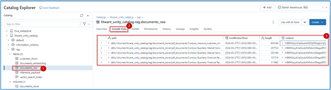

Next we convert the PDF documents bytes to text, extract chunks from their content, and create a vector search index for retreival.

9.	Go to table: **documents_embedding**.

>**Note**: If you have used OpenAI for text embeddings during the deployment, then select **documents_embedding_openai** table.

10.	Click **Sample Data**.

11.	Review the Delta Table.

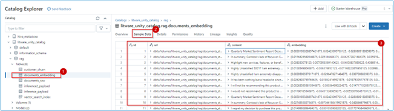

12.	In the upper-right corner, click on the dropdown for **Create**.

13.	Select **Vector search index**. Click on **Cancel** after reviewing the fields.

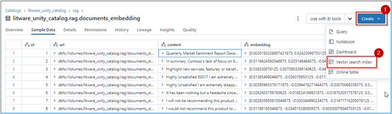

We've just seen how Databricks Lakehouse AI makes it easy to ingest and prepare your documents and deploy a Self-Managed Vector Search index on top of it with just a few lines of code and configuration.

14. Click on **Workspace**.

15. Click on **Shared**.

16. Click on **RetrievalAugmentedGeneration**.

17. Click on notebook **3. Register and Deploy RAG model as Endpoint**.

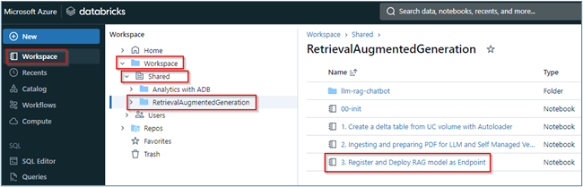

With this model, we will be able to serve and accept questions based on the documents uploaded.
Everytime we send a question to the chatbot, the following steps occur:

•	The model receives the question

•	The retriever automatically fetches related chunks from our documents

•	A prompt is crafted with the chunks and the question

•	The prompt is sent to the Databricks Foundation Model and Llama 2 serves an accurate answer based on the chunk information!

18. From the left hand-side pane, **select** Servings and **click** on 'rag-chatbot-model-endpoint'.  

	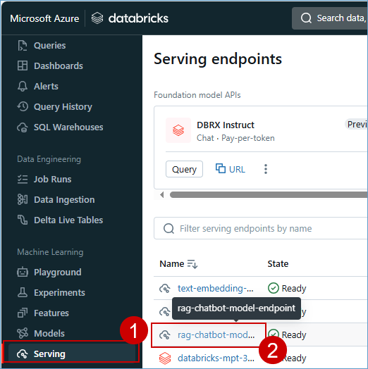


19. Click **Query endpoint**.

	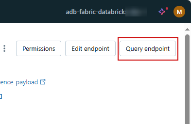

20. A predefined request was automatically entered for us. We simply just need to select Send request to test it. Click **Send request**.

	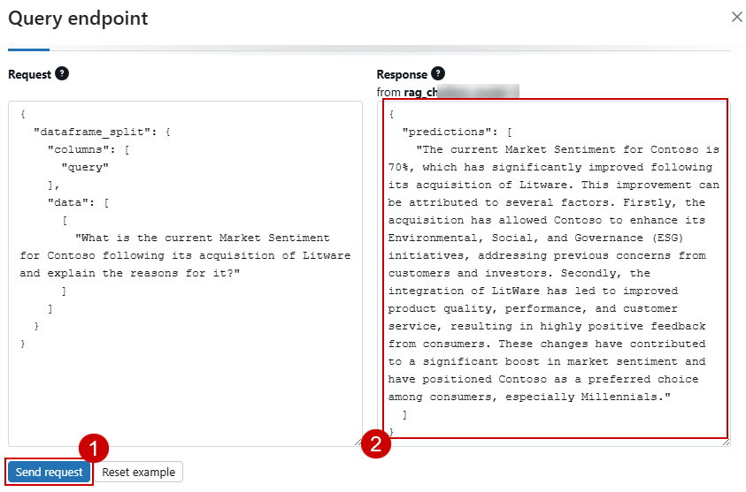

In less than 10 seconds, we're provided with a response from the model we created. We can see the current Market Sentiment for Contoso is at 70%. 

Let's ask another question.

21. Click the question in the request field and **type** What is the meaning of life? then click on **Send request**.

	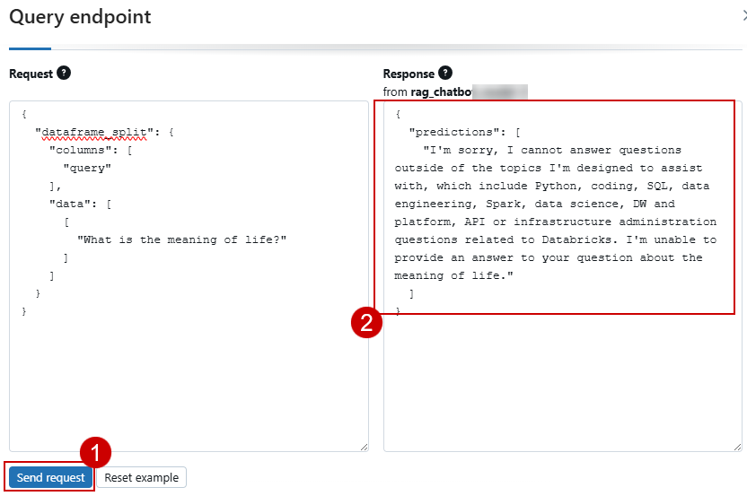

Because the question isn't related to Contoso or Market Sentiment, the model was unable to provide an answer. 

---

### Exercise 3: Power BI Experience
 
### Task 3.1: Create a Semantic model and generate insights using Copilot for Power BI in Microsoft Fabric

Let us dive deep into the experience of the Business analyst, Wendy. Based on all the gathered data Wendy is expected to create Power BI reports for other data citizens and stakeholders. Let us see the power of Power BI copilot in conjuction with the Direct Lake Mode.

1. Navigate to the Fabric Workspace. 

   

2. In the **contosoSales...** workspace, click on **Filter** and select **Lakehouse**.

   	

3. Click on the **lakehouse...**.

>**Note:** There are 3 options for lakehouseBronze, namely Lakehouse, Dataset (default) and SQL endpoint. Make sure you select the **Lakehouse** option.

   

>**Note:** In case you do not see the 'website_bounce_rate' under the Tables section of the lakehouse, follow the below steps.

   -  Click on **data**.

      

   - Click on the **ellipse**(three icons) in front of **website_bounce_rate.csv**, select **Load to Tables** and then select **New Table**.

      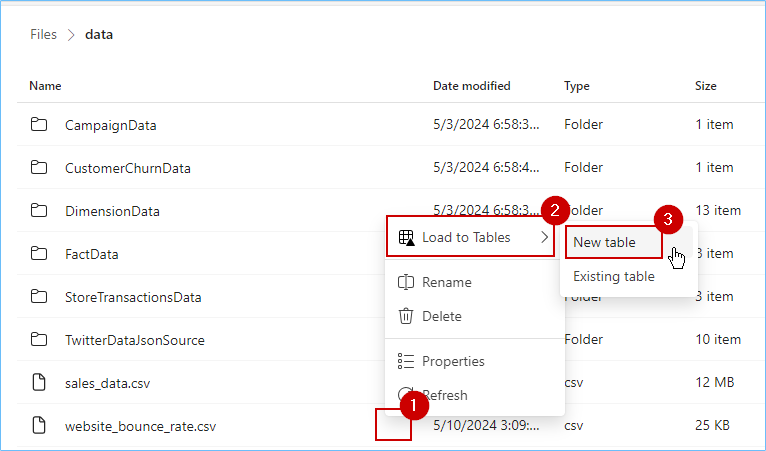

   - In the pop-up verify the **New table name** and then click on the **Load** button.

      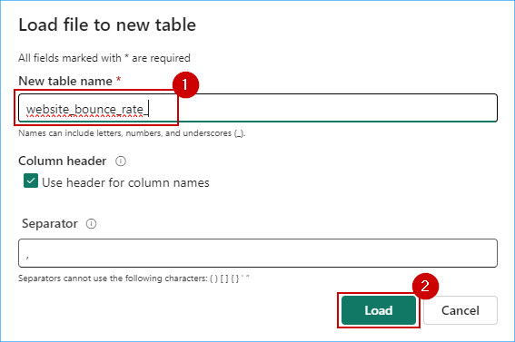


*Once the **website_bounce_rate** delta table is there, we can proceed with the steps ahead*

4. Click on the **New semantic model**. 

5. Enter the name **website_bounce_rate_model**. 

6. Search for 'website_bounce_rate' and select **website_bounce_rate** table. 

7. Click on the **Confirm** button and the new semantic model will be created. 

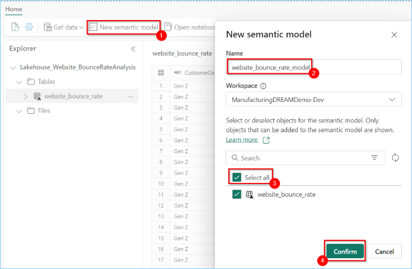

8. To create a new report using this semantic model, click on the **New Report** at the top bar.
 
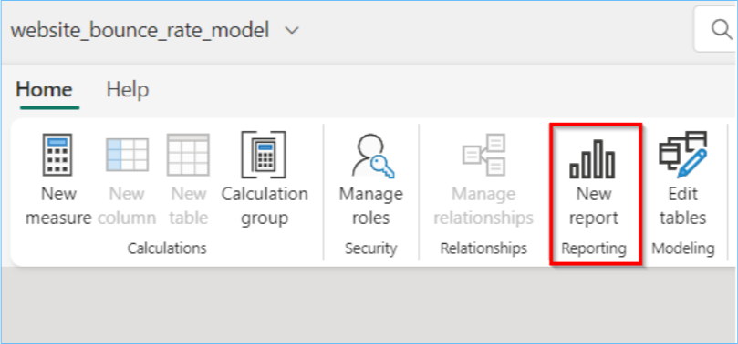

9. Click on the **Get started** button. You will now see how easy it is for the data analyst to create compelling Power BI reports and get deep insights with literally no hands-on coding!

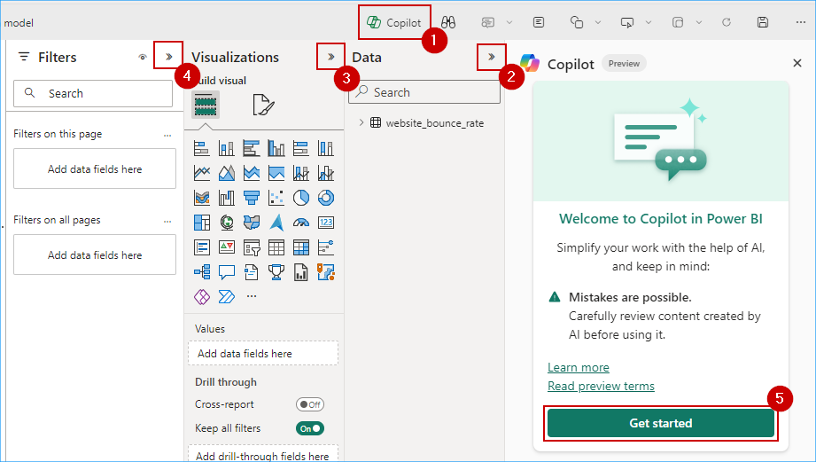
	
10. Click on the **Prompt Guide** button.  

11. Select the option **What's in my data?**
   
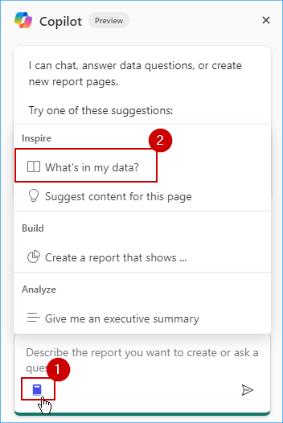

The first option, 'What’s in my data?' provides an overview of the contents of the dataset, identifies and describes what’s in it and what the attributes are about. So, there’s no need to wait for someone to explain the dataset. This improves the efficiency and volume of report creation.

12. Click in the Copilot chat box field and enter the prompt below.

```
Create a report Bounce Rate analysis, to show the correlation between customer sentiment, particularly among millennials and Gen Z, unsuccessful product searches across different devices, and the website's bounce rate by customer generations.
```

>**Note:** Wait for the prompt to populate.

13. Click on the **Send** button and wait for the results to load. 


	
>**Note:** If you see the error message saying, 'Something went wrong.', try refreshing the page and restart the task.
- If Copilot needs additional context to understand your query, consider rephrasing the prompt to include more details

>**Note:** The responses from Copilot may not match the ones in the screenshot but will provide a similar response.


Based on this report, we notice that the website bounce rate for Contoso is especially high amongst the Millennial customer segment. Let’s ask Copilot if it has any recommendations for improving this bounce rate based on the results and data in the report.

We’ll ask Copilot for suggestions based on the results and data in the report. 

14. Enter the following prompt in Copilot and press the **Send** button.

```
Based on the data in the page, what can be done to improve the bounce rate of millennials?
```
 	
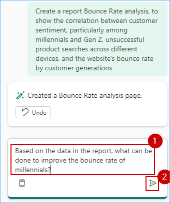
	
15. Look at the suggestions Copilot provided. Copilot creates the desired Power BI report and even goes a step further to give powerful insights. Wendy realizes that for the website bounce rate to improve, Contoso needs to transform their mobile website experience for millennials. This helps them reduce their millennial related customer churn too! Now, what if Contoso’s leadership team needed a quick summary of this entire report? **Smart Narrative** to the rescue! 
	

	
16. Expand the **Visualizations** pane and select the **Narratives** visual. 


17. Click on **Copilot (preview)** within the visual.

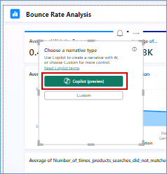
	
18. Select **Give an executive summary**. 

19. Click on **Update** and observe the generated summary. See how easy it was to get an executive summary with absolutely no IT resource dependency!
 


20. Expand the narrative from the corner to get a better readable view of the result.

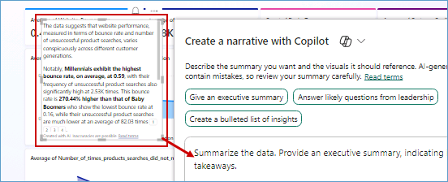

21. Click on the **close** button in the pop-up window.

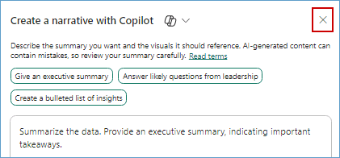
	
The summary could also be generated in another language if specified. Additionally, the summary updates if you filter the report on any visual.

---

### Exercise 4: Real-time Intelligence experience, explore Streaming data using Copilot for KQL DB

Imagine it is 6 am on the day of Contoso's big Thanksgiving sale. Customers are flocking to their stores in large numbers. We are about to witness the very culmination of Contoso's phenomenal transformation with Microsoft Fabric and Azure Databricks. Specifically, we will see how near real-time data is used to make decisions for the next moment in Contoso's stores to ensure optimal temperatures are maintained for their customers while they shop at the big sale!

### Task 4.1: Ingest real-time/historical data into KQL DB using Eventstream

1.	Click on the **experience** button on the **bottom left** corner of the screen and then select **Real-Time Intelligence**.

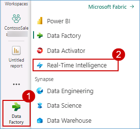

>**Note:** If you see a pop-up like the one below, click on the **Don't save** button.

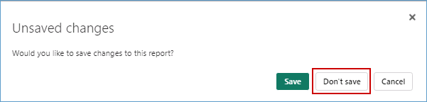 

2. On the Real-Time Intelligence experience screen, click on **Eventhouse**.

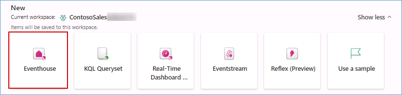

3. Enter the name  as ```Contoso-Eventhouse```

4. Click on the **Create** button and wait for the database to be created.


5. Click on **Real-Time Intelligence** at the bottom left corner of the screen and select **Real-Time Intelligence**.

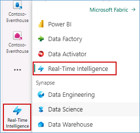

6. Select **Eventstream**.

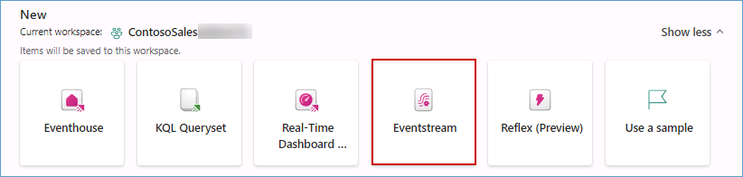

7. Enter the name as ```RealtimeDataTo-KQL-DB``` and tick a checkbox 'Enhanced Capabilities(preview)' then click on **Create** button.


8. Click on the **Add external source** button.

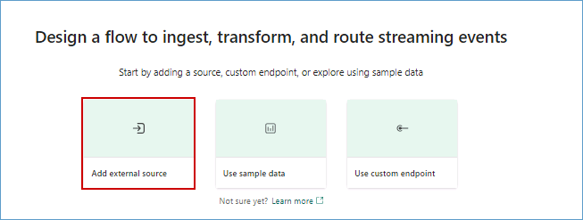

9. Click on the **Azure Event Hub** button.


10. Under the Connection field, click on **New connection**.

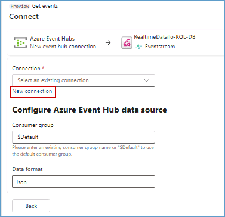

7. To fill in the fields below we need to navigate to Azure Portal.

8. Navigate to the **Azure Portal**. In the **rg-fabric...** resource group, search for the **event hubs namespace** and click on the **Event Hubs Namespace** resource.


9. Copy the name of the **Event Hub namespace** and paste it in a notepad for further use.

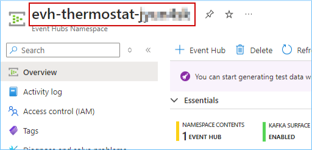

10. In the left navigation pane expand the **Entities** section, click on **Event Hubs**, and then click on the **thermostat** event hub.


11. In the left pane expand **Settings**, click on **Shared access policies** and then click on **thermostat**.

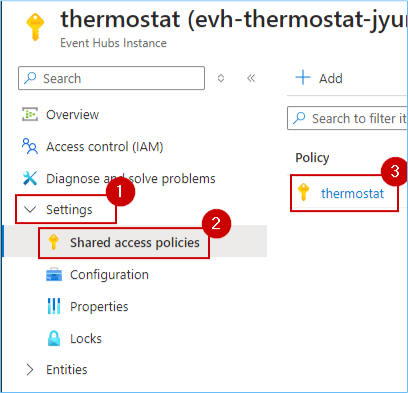

12. Copy the **Primary key** and paste it in a notepad for further use. 


13. Go back to the **Fabric tab** on your browser.

14. Make sure you are in the **Create new connection** section, paste the value for **Event Hub namespace** from **step 9** and enter the **Event Hub** value as **thermostat**.


15. Scroll down and select **Shared Access Key** for Authentication kind, enter **thermostat** as the Shared Access Key Name and then paste the value copied in **step 12** in the **Shared Access Key**.

16. Select Data format as **JSON** and then click on the **Connect** button.

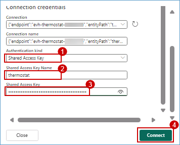

>**Note:** Wait for the connection to be established.

17.  Select Data format as **JSON** and click on **Next**.

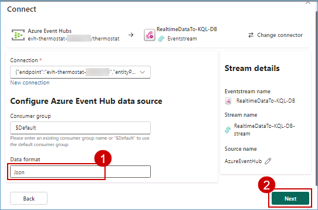

>**Note:** Wait for the connection to be established.

14. Click on the **Add** button.


15. In the Eventstream canvas, click on the **Add destination** dropdown and select **KQL Database**.

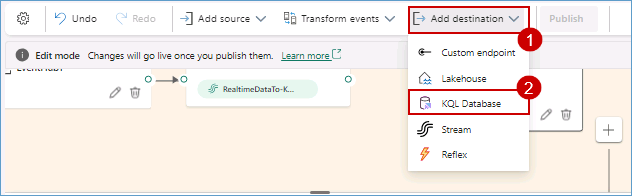
16. Select the **Event processing before ingestion** radio button, enter **RealTimeData** as the Destination name.

17. Select **contosoSales...** and **Contoso-KQL-DB** from the respective 'Workspace' and 'KQL Database' dropdowns.

18. Finally click on the **Create new** button.

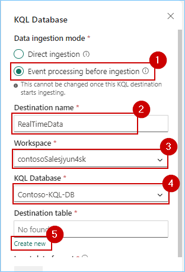


21. Enter the Input data format as **Json**.

>**Note:** Zoom-out on your screen if the Input data format field is not visible.


22. Drag Arrow from 'RealtimeDataTo-KQL' and connect it to 'RealTimeData'.

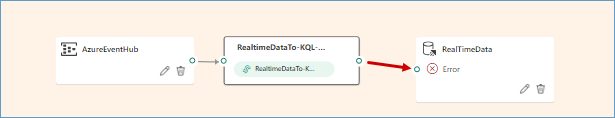

23. Click on the **Publish** button.


>**Note:** Wait for the data ingestion from EventHub to KQL DB.

24. Once you see that the streaming has started, click on **Refresh** and wait for the data to preview.

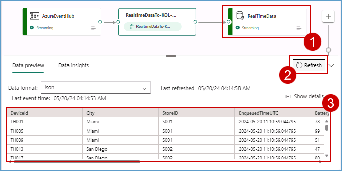

Real-time data from the event hub has been ingested successfully into the KQL Database. Next, as customers walk in aisles and the temperatures fluctuate, let us see how KQL queries proactively identify anomalies and help maintain an optimal shopping experience!

---

### Task 4.2: Analyze/discover patterns, identify anomalies and outliers using Copilot

Kusto Query Language is a powerful tool. In this scenario KQL is used to explore Contoso’s data, discover patterns, identify anomalies and outliers, create statistical modeling, and more.

We use KQL to query the thermostat data that’s streaming in near real-time from the devices installed in Contoso’s stores.

1. Click on the **Workspaces** and select **contosoSales...** workspace from left navigation pane.

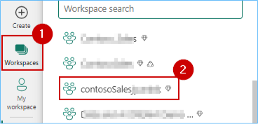

2. Click on the **Real-Time Intelligence** at the bottom left corner of the screen and select **Real-Time Intelligence**.


3. Select **KQL Queryset**.

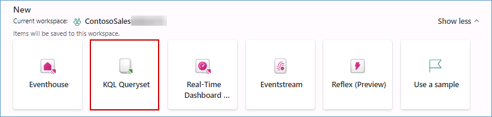

4. In the KQL Queryset name field enter, ```Query Thermostat Data in Near Real-time using KQL Script``` and click on the **Create** button.

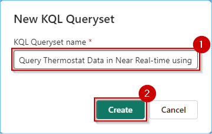

5. **Wait** for the query set creation and a new screen will display. In this screen, click on **Contoso-Eventhouse**, verify the workspace name and then click on the **Connect** button.


6. Place your cursor inside the **query** field, select all using **Ctrl + A** and **delete** the pre-written query.


7. Click on the **Copilot** button.

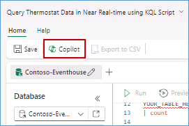

8. **Paste** the query provided below in the Copilot query section.

```Create a query to find average temperature every 1 min```

9. Click on the **send** icon.

>**Note:** The responses from Copilot may not match the ones in the screenshot but will provide a similar response. 

10. Click on the **Insert** button.


11.	Place you cursor in the **script field**, click on the **Run** button and you get the desired result.


So, imagine if one of the aisles had a sudden rise in temperature. Customers start leaving that aisle and the wait times in the checkout lines start to increase. But thanks to the KQL Queries, those anomalies would be tracked, and immediate notifications would be generated to bring the aisle temperature back to optimal levels! Now, after all these amazing data transformations in OneLake in a healthy ecosystem with Azure Databricks, can we actually predict customer churn for the future? Absolutely! In fact, in the next exercise, let’s see the power of Microsoft Fabric and Azure Databricks to do just that!

---


## Exercise 5: Data Science experience, explore Machine Learning and Business Intelligence scenarios in ADB (read only)
 
So, we saw how Contoso combined historical gold layer data from ADLS Gen2 with all OneLake data via shortcuts. Additionally, we saw how all that data could be easily accessed in Azure Databricks (thanks to the standard delta parquet format). Delta live tables were created in Azure Databricks for further curation of data. Contoso can now leverage the power of machine learning models in ADB on that data to gain meaningful insights and predict customer churn. Let's explore the Data Science Experience in Azure Databricks as Data Scientists!

### Task 5.1: Build ML models, experiments, and log ML model in the built-in model registry using MLflow and batch scoring


The architecture diagram shown here illustrates the end-to-end MLOps pipeline using the Azure Databricks managed MLflow.

After multiple iterations with various hyperparameters, the best performing model is registered in the Databricks MLflow model registry. Then it is set up as the model serving in the Azure Databricks Workspace for low latency requests.
	


1. Navigate back to the **Databricks workspace** we started for the previous exercise.

2. In the left navigation pane, select **Workspace** and click **Workspace** again. Select **Shared**, click on **Analytics with ADB** and finally click on the **03 ML Solutions in a Box.ipynb** notebook.

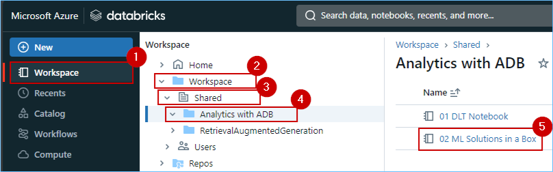

Now that we've ingested and processed our customer data, we want to understand what makes one customer more likely to churn than another, so we want to see if we can produce a machine learning model that can accurately predict if a particular customer will churn.

Ultimately, we would like to understand our customers' sentiment so we can create targeted campaigns to improve our sales.

3. Navigate to **cmd 9**.

With the data prepared, we can begin exploring the patterns it contains. 

Let's start by examining the customer churn outcome based on factors like a customer's tenure in months and their total amount spent at Contoso. As a result, we can see a high churn rate is seen if the customer's tenure is low, and they have a lower spend amount.


4. Navigate to **cmd 19**.

5. Navigate to **cmd 20**. 


By registering this model in Model Registry, we can easily reference the model from anywhere within Databricks.    

6. Review the **cmd 27** cell.

Let’s look at the comparison of multiple runs in the UI.

You can visualize the different runs using a parallel coordinates plot, which shows the impact of different parameter values on a metric.

The best ML model for Customer Churn is selected and registered with Databricks model registry.

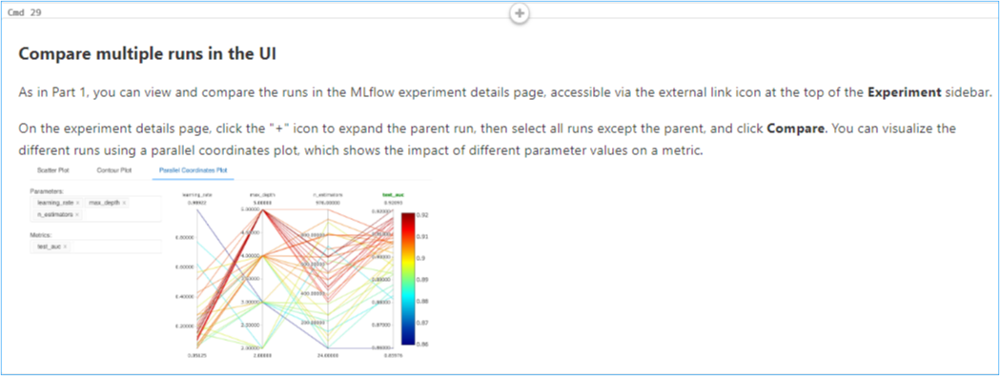

7. Navigate to **cmd 37**.

For low-latency use cases, you can use MLflow to deploy the model for online serving. The serving system loads the Production model version from the Model Registry. 

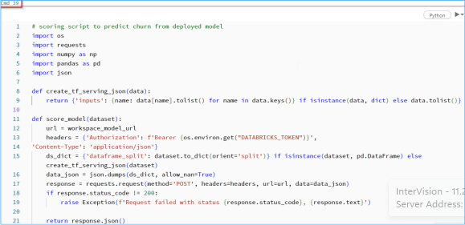

8. Navigate to **cmd 39**.

It is then used to predict the probability of Customer Churn using the deployed model and this model endpoint is ready for production.


9. Navigate to **cmd 40**. 

Once we have the predicted data, it is stored back in delta tables in the gold layer back in OneLake.

	

---

## APPENDIX

### Task 6: Create a Microsoft Fabric enabled workspace

1. Open **PowerBI** in a new tab by going to [https://app.powerbi.com].

*Click on the **Continue** button.*

   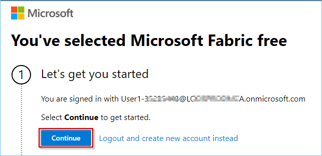

*Type in a 10 digit number in the box.*

   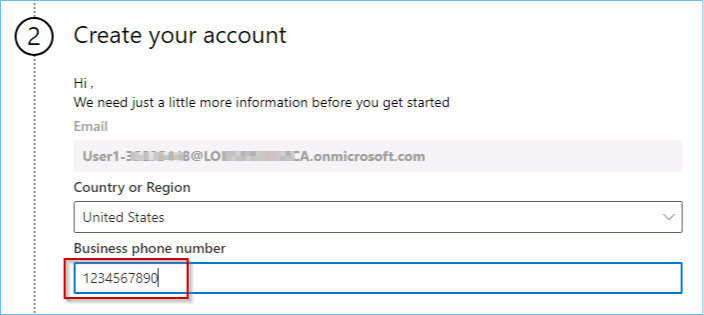

*Click on the **Get Started** button.*

   

*Again click on the **Get Started** button.*

   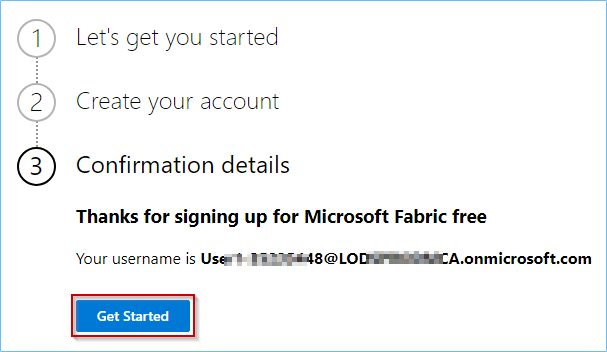

*Wait for the PowerBI Workspace to load*


*Close* the top bar for a better view.

   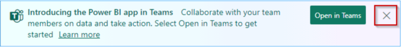

2. In Power BI service, click on **Workspaces**.

3. Click the **+ New workspace** button.

	

4. Type the name **contosoSales**, and append the **6 character suffix** at the end of your resource group and click **Apply**.

>**Note:** Do not include spaces in the workspace name.

   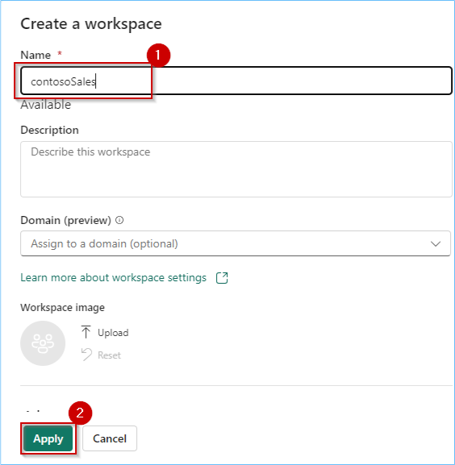

*Click on the **Try free** button.*

   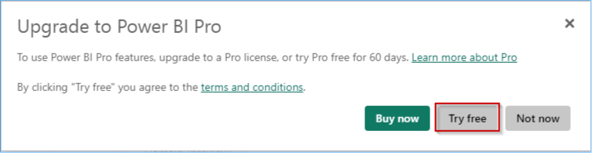

*Click on the **Got it** button to continue.*

   

5. Click on **Workspaces** to verify if the workspace with the given name was created, if not perform the steps above again.

**NOTE:** If the workspace you created is not visible, perform **steps 3 to 5** again.

   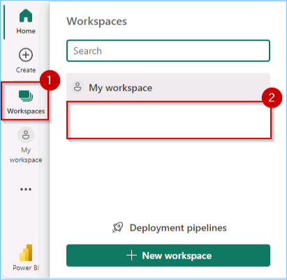

### Task 7: Create/Build a Lakehouse

1. In Power BI service, click **+ New** and then select **More options**.

   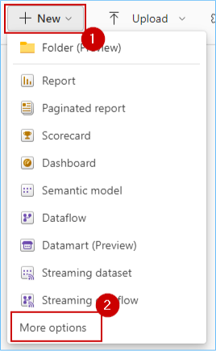

2. In the new window, under the Data Engineering section, click on **Lakehouse**.

    

3. **Wait** for the Microsoft Fabric capacity to upgrade and then click on **OK**.

   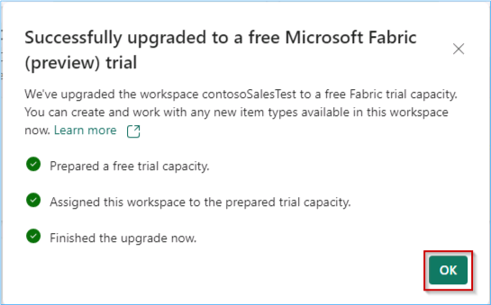

*Wait for the New lakehouse pop-up box to appear*

4. Enter the name **lakehouse**.

5. Click the **Create** button.

    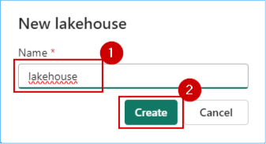

6. Click on **Workspaces** in the left navigation pane and select **contosoSales...**.

	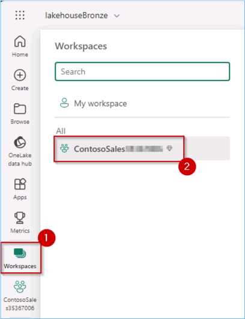

### Task 8: Create a KQL Database

1. While you are in the Fabric workspace homepage, click on **+ New** and then click on **More options**.

	

3. In the new window, scroll down to the **Real-Time Analytics** section and click on **KQL Database**.

	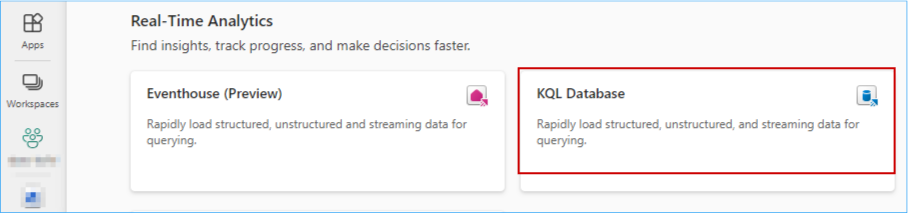

4. Enter the name **Contoso-KQL-DB**, click on the **Create** button and wait for the database to be created.

	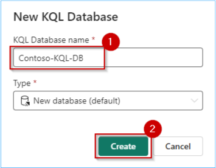


---

Congratulations! You as Data Engineers have helped Contoso gain actionable insights from its disparate data sources, thereby contributing to future growth, customer satisfaction, and a competitive advantage.

In this lab we experienced the creation of a simple integrated, open and governed Data Lakehouse foundation using Modern Analytics with Microsoft Fabric and Azure Databricks.

In this lab we covered the following:

First, we explored the Data Engineering experience and learned how to create a Microsoft Fabric enabled workspace, build a Lakehouse, and ingest data into OneLake along with other data engineering operations with dataflow copilot.

Second, we explored an analytics pipeline using open Delta format and Azure Databricks Delta Live Tables to build a simple Lakehouse and integrate with OneLake with shortcuts.

Third, we explored data governance and generative AI features in Azure Databricks with Unity Catalog. We also explored ML and BI scenarios on the Lakehouse. Here we reviewed MLOps pipeline using the Azure Databricks managed MLflow with Azure ML.

Fourth, we saw the Power BI experience in Fabric with copilot and direct lake mode.

Fifth, we explored Streaming data using KQL DB for a Real-time Analytics experience. Here, we created a KQL Database, ingested real-time and historical data into KQL DB, analyzed patterns to uncover anomalies and outliers with the help of copilot.

Finally, we leveraged Power BI to derive actionable insights from data in the Lakehouse using Direct Lake mode.


