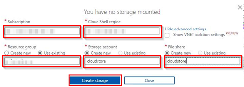
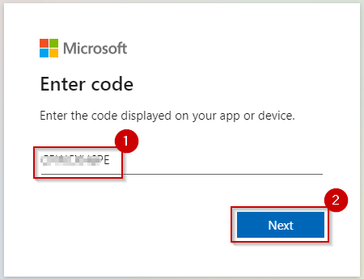
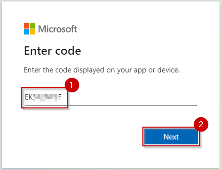
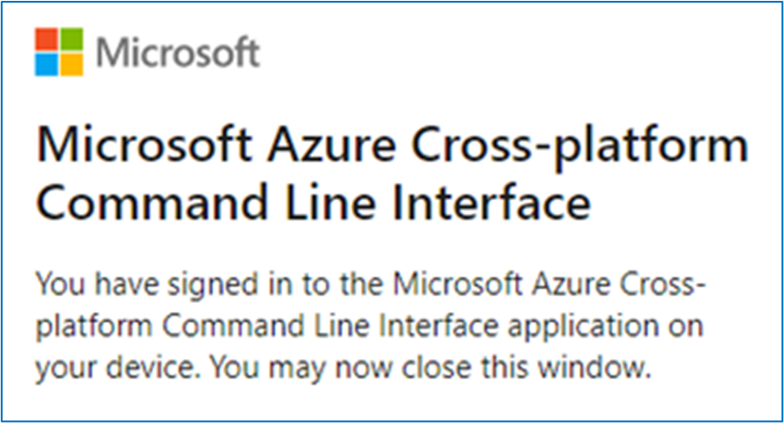
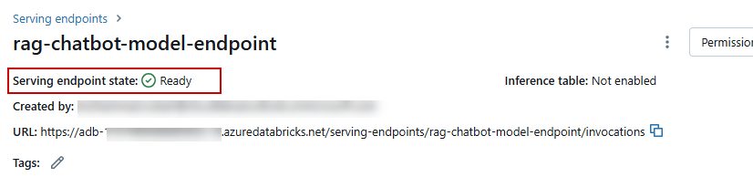

# Modern Analytics with Microsoft Fabric, Copilot and Azure Databricks DREAM PoC Accelerator Setup Guide

## What is DPoC?
DREAM PoC Accelerators (DPoC) are packaged DREAM Demos using ARM templates and automation scripts (with a demo web application, Power BI reports, Fabric resources, ML Notebooks etc.) that can be deployed in a customer’s environment.

## Objective & Intent
Partners can deploy DREAM Demos in their own Azure subscriptions and demonstrate them live to their customers. 
Partnering with Microsoft sellers, partners can deploy the Industry scenario DREAM demos into customer subscriptions. 
Customers can play, get hands-on experience navigating through the demo environment in their own subscription and show it to their own stakeholders.

**Here are some important guidelines before you begin** 

  1. **Read the [license agreement](https://github.com/microsoft/Azure-Analytics-and-AI-Engagement/blob/main/CDP-Retail/license.md) and [disclaimer](https://github.com/microsoft/Azure-Analytics-and-AI-Engagement/blob/main/CDP-Retail/disclaimer.md) before proceeding, as your access to and use of the code made available hereunder is subject to the terms and conditions made available therein.**
  2. Without limiting the terms of the [license](https://github.com/microsoft/Azure-Analytics-and-AI-Engagement/blob/main/CDP-Retail/license.md) , any Partner distribution of the Software (whether directly or indirectly) must be conducted through Microsoft’s Customer Acceleration Portal for Engagements (“CAPE”). CAPE is accessible to Microsoft employees. For more information aregarding the CAPE process, contact your local Data & AI specialist or CSA/GBB.
  3. It is important to note that **Azure hosting costs** are involved when DREAM PoC Accelerator is implemented in customer or partner Azure subscriptions. DPoC hosting costs are not covered by Microsoft for partners or customers.
  4. Since this is a DPoC, there are certain resources available to the public. **Please ensure that proper security practices are followed before adding any sensitive data to the environment.** To strengthen the environment's security posture, **leverage Azure Security Centre.** 
  5.  In case of questions or comments; please email **[dreamdemos@microsoft.com](mailto:dreamdemos@microsoft.com).**
  
 


## Contents

<!-- TOC -->

- [Requirements](#requirements)
- [Before Starting](#before-starting)
  - [Task 1: Power BI Workspace and Lakehouse creation](#task-1-power-bi-workspace-creation)
  - [Task 2: Run the Cloud Shell to provision the demo resources](#task-2-run-the-cloud-shell-to-provision-the-demo-resources)
  - [Task 3: Check Serving endpoint deployment for rag chatbot](#task-3-check-serving-endpoint-deployment-for-rag-chatbot)
 

<!-- /TOC -->

## Requirements

* Owner Permission on subscription for creating resources and role assignments.
* Global Admin permission to assign Azure Databrick Account Admin permission to yourself, optionally you can get the Account admin permission assigned by a global admin once the ARM template is deployed.
* An Azure Account with the ability to create Fabric Workspace.
* A Power BI license to host Power BI reports.
* Microsoft Fabric F64 capacity for exploring Copilot scenarios included in this DPoC. 
* Make sure your Power BI administrator can provide service principal access on your Power BI tenant.
* You must only execute one deployment at a time and wait for its completion.Running multiple deployments simultaneously is highly discouraged, as it can lead to deployment failures.
* Select a region where the desired Azure Services are available. If certain services are not available, deployment may fail. See [Azure Services Global Availability](https://azure.microsoft.com/en-us/global-infrastructure/services/?products=all) for understanding target service availability. (Consider the region availability for App services, Eventhub and Azure Databricks while choosing a location)
* In this Accelerator, we have used the following features of Azure databricks:
     - Serverless SQL warehouses
	 - Serverless DLT pipelines
	 - Model Serving
	 - Vector search

> **Note:** There are some features that are supported only in a subset of regions.
- To check supported regions [click here](https://learn.microsoft.com/en-us/azure/databricks/resources/supported-regions). 
- Choose the subscription where all the features listed above are available. As of 04-06-2024 eastus, eastus2, westus are having all the required features.

* Make sure you use the same valid credentials to log into Azure and Power BI.
* Review the [License Agreement](https://github.com/microsoft/Azure-Analytics-and-AI-Engagement/blob/main/CDP-Retail/license.md) before proceeding.


### Task 1: Power BI Workspace creation

1. **Open** Power BI in a new tab by clicking [HERE](https://app.powerbi.com/)

2. **Sign in** to Power BI.

	

	> **Note:** Use your Azure Active Directory credentials to login to Power BI.

3. In Power BI service **click** 'Workspaces'.

4. **Click** '+ New workspace' button.

	

5. **Enter** the name as 'contosoSales' and **click** 'Apply'.

>**Note:** The name of the workspace should be in camel case, i.e. the first word starting with a small letter and then the second word staring with a capital letter with no spaces in between.

>If name 'contosoSales' is already taken, add some suffix to the end of the name for eg. 'contosoSalesTest'.

>Workspace name should not have any spaces.

   

6. **Copy** the Workspace GUID or ID from the address URL.

7. **Save** the GUID in a notepad for future reference.

	

	> **Note:** This workspace ID will be used during powershell script execution.

8. In the workspace **click** the three dots(Ellipsis) and **select** 'Workspace settings'.

	

9. In the left pane of the side bar **click** 'License info', scroll down and **check** the 'Fabric Capacity' radio box.

	


10. **Scroll down** and select cacpity then **click** on 'Select license'.

	

>**Note:** Make sure that this workspace has fabric F64  License and note the name of the workspace as this will be used during the script execution(Task 2)


### Task 2: Run the Cloud Shell to provision the demo resources

>**Note:** For this Demo we have assets in an Azure resource group as well as Fabric Workspaces

>**Note:** In this task we will execute a powershell script on 'Cloudshell' to create those assets

>**Note:** List of the resources are as follows:

**Azure resources:**
|NAME	|TYPE|
|-----|-----|
rg-managed-adb-{suffix} | Microsoft.Resources/resourceGroups
app-realtime-simulator-{suffix} | Microsoft.Web/sites
asp-realtime-simulator-{suffix} | Microsoft.Web/serverFarms
stfabricadb{suffix} | Microsoft.Storage/storageAccounts
adb-fabric-{suffix} | Microsoft.Databricks/workspaces
ami-databricks-{suffix} | Microsoft.ManagedIdentity/userAssignedIdentities
access-adb-connector-{suffix} | Microsoft.Databricks/connectors
kv-adb-{suffix} | Microsoft.KeyVault/vaults
evh-thermostat-{suffix} | Microsoft.EventHub/namespaces
mssql{suffix} | Microsoft.Sql/servers
SalesDb | Microsoft.Sql/servers/databases
| | |

**Optional Azure resources:**
|NAME	|TYPE|
|-----|-----|
openAIResource{suffix} | Microsoft.CognitiveServices/accounts
text-embedding-ada-002 | OpenAI model

**Fabric resources:**
| DisplayName | Type |
|-----------|------|
| lakehous{suffix} |                                         Lakehouse |
| lakehouse{suffix} |                                           SQLEndpoint |
| lakehouse{suffix} |                                           SemanticModel |
| Contoso-Eventhouse |                                           Eventhouse|
| Contoso-Eventhouse |                                           KQL Database|


1. **Open** Azure Portal by clicking [HERE](https://portal.azure.com/)

2. In the Resource group section, **select** the Terminal icon to open Azure Cloud Shell.

	

3. **Click** on the 'PowerShell'.

4. **Click** 'Show advanced settings'.

	

	> **Note:** If you already have a storage mounted for Cloud Shell, you will not get this prompt. In that case, skip step 5 and 6.

5. **Select** your 'Subscription', 'Cloud Shell region' and 'Resource Group'.

>**Note:** If you do not have an existing resource group please follow the steps mentioned [HERE](https://learn.microsoft.com/en-us/azure/azure-resource-manager/management/manage-resource-groups-portal) to create one. Complete the task and then continue with the below steps.

>Cloud Shell region need not be specific, you may select any region which works best for your experience.

6. **Enter** the 'Storage account', 'File share' name and then **click** on 'Create storage'.

	

	> **Note:** If you are creating a new storage account, give it a unique name with no special characters or uppercase letters. The whole name should be in small case and not more than 24 characters.

	> It is not mandatory for storage account and file share name to be same.

7. In the Azure Cloud Shell window, ensure that the PowerShell environment is selected.

	

	>**Note:** All the cmdlets used in the script works best in Powershell.	

8. **Enter** the following command to clone the repository files in cloudshell.

Command:
```
git clone https://github.com/dreamdemos-ms/dreamdemos-Build2024.git build24
```

   
	
   > **Note:** If you get File already exist error, please execute the following command to delete existing clone and then reclone:
```
 rm build24 -r -f 
```
   > **Note**: When executing scripts, it is important to let them run to completion. Some tasks may take longer than others to run. When a script completes execution, you will be returned to a command prompt. 

9. **Execute** the Powershell script with the following command:
```
cd ./build24/build24/
```

```
./buildSetup.ps1
```
    
   
      
10. From the Azure Cloud Shell, **copy** the authentication code. You will need to enter this code in next step.

11. **Click** the link [https://microsoft.com/devicelogin](https://microsoft.com/devicelogin) and a new browser window will launch.

	
     
12. **Paste** the authentication code.

	

13. **Select** the user account that is used for logging into the Azure Portal in [Task 1](#task-1-create-a-resource-group-in-azure).

	

14. **Click** on 'Continue' button.

	

15. **Close** the browser tab once you see the message box.

	  

16. **Navigate back** to your Azure Cloud Shell execution window.

17. **Enter** the number apearing infort of subscription to select it.

    

> **Notes:**
	> - The subscription marked with an '*' will be selected by default if you do not enter any disired subscription. Please select the subscription carefully, as it may break the execution further.
	> - While you are waiting for processes to get completed in the Azure Cloud Shell window, you'll be asked to enter the code three times. This is necessary for performing installation of various Azure Services and preloading the data.

18. **Copy** the code on screen to authenticate Azure PowerShell.

19. **Click** the link [https://microsoft.com/devicelogin](https://microsoft.com/devicelogin).

	

20. A new browser window will launch.

21. **Paste** the authentication code you copied from the shell above.

	

22. **Select** the user account that is used for logging into the Azure Portal in [Task 1](#task-1-create-a-resource-group-in-azure).

	

23. **Click** on 'Continue'.

	

24. **Close** the browser tab once you see the message box.

	

25. **Go back** to Azure Cloud Shell execution window.

26. You will get another code to authenticate the Azure PowerShell script to copy files and tables to Lakehouse. **Copy** the code.

27. **Click** the link [https://microsoft.com/devicelogin](https://microsoft.com/devicelogin).

    
      
28. In the new browser tab, **paste** the code that you copied from the shell in step 34 and **click** on 'Next'.

	

	> Note: Make sure to provide the device code before it expires and let the script run till completion.
		
32. **Select** the user account that is used for logging into the Azure Portal in [Task 1](#task-1-create-a-resource-group-in-azure). 

	

33. **Click** on 'Continue'.

	

34. **Close** the browser tab once you see the message box.

	

	>**Note:** During script execution you need to note the resource group which gets created, since a resource group with unique suffix is created each time the script is executed.

35. **Navigate back** to your Azure Cloud Shell execution window.

29. **Enter** the Region for deployment with necessary resources available, preferably "eastus". (ex. eastus, eastus2, westus, centralus etc)

	

30. In this accelerator, you have the option to choose a model for creating text embeddings in Azure Databricks. By default, the azure databricks ```databricks-bge-large-en``` model will be used for text embedding, but you can also use the Azure OpenAI ```text-embedding-ada-002``` model. Enter 'Yes' to use the OpenAI model.

	

31. If you have selected the Azure OpenAI model for embeddings, you'll be prompted to enter the region for OpenAI. Please ensure that you enter a region where you have a quota available for the text-embedding-ada-002 model.

	

30. **Enter** the workspace id which you copied in Step 6 of [Task 1](#task-1-power-bi-workspace-and-lakehouse-creation).

	

36. After the Arm Template is deployed you'll be prompted to confirm role assignment as Account Admininstor on Azure Databricks, follow the steps below and then confirm.

    

37. Navigate to https://accounts.azuredatabricks.net/ and click on sign in with Microsoft Entra ID.

    

38. In the Account console click on 'user & groups'

    

> Note : you should have Global admin on azure tenant to assign youself as account admin. if you are not able to access Account console get the permssion assigned by your organization's global admin.

39. Search your username in the seacrh bar and select it.

    

40. Click on **Roles** and toggle on the 'Account Admin' button.

    

41. Go back to the Script execution and enter 'Yes' to confirm.

    

42. After the script execution is complete, the user is prompted "--Execution Complete--"

	> **Note:** The deployment will take approximately 30-40 minutes to complete. Keep checking the progress with messages printed in the console to avoid timeout.


### Task 3: Check Serving endpoint deployment for rag chatbot

1. **Go to** Azure Portal and **search** for 'rg-fabric-adb' and **click** on the resource group name which was created by the script.

	

	>**Note:** The resource group name starts with 'rg-fabric-adb-' with some random unique suffix in the end.

2. In the search pane of the resource group **type** "Databricks" and **select** the resource.

	

3. **Click** on Luanch workspace.

	

4. From the left hand-side pane, **select** Servings and **click** on 'rag-chatbot-model-endpoint'.  

	

5. Check if the Serving endpoint state is ready. After the deployment is completed, the Serving endpoint might take another 30 minutes to be fully ready.

	


## Appendix
### Enable copilot on your tenant

To get the copilot enabled, Global admin should follow the below steps.

1. Microsoft F64 capacity is required.
1. User should have Global admin and Fabric Administrator Privilege.

	

1. Go to the https://app.powerbi.com/ and **click** on settings icon and select 'Admin Portal'.

	

1. Administrator with Global admin privilege need to enable two features for organization
"Users can use a preview of Copilot..." and "Data sent to Azure OpenAI can be processed outside your capacity's geographic region, compliance boundary, or national cloud instance".

	

1. enable as shown in below in the scrennshot.

	

1. Select apply to 'the entire organization' and **click** on 'Apply' button.

	

1. Click on 'Capacity settings' and Expand 'contributor permissions'. 

	

1. Enable contributor permission for the entire organization  and **click** on 'Apply'.

	


# Copyright

© 2023 Microsoft Corporation. All rights reserved.   

By using this demo/lab, you agree to the following terms: 

The technology/functionality described in this demo/lab is provided by Microsoft Corporation for purposes of obtaining your feedback and to provide you with a learning experience. You may only use the demo/lab to evaluate such technology features and functionality and provide feedback to Microsoft.  You may not use it for any other purpose. You may not modify, copy, distribute, transmit, display, perform, reproduce, publish, license, create derivative works from, transfer, or sell this demo/lab or any portion thereof. 

COPYING OR REPRODUCTION OF THE DEMO/LAB (OR ANY PORTION OF IT) TO ANY OTHER SERVER OR LOCATION FOR FURTHER REPRODUCTION OR REDISTRIBUTION IS EXPRESSLY PROHIBITED. 

THIS DEMO/LAB PROVIDES CERTAIN SOFTWARE TECHNOLOGY/PRODUCT FEATURES AND FUNCTIONALITY, INCLUDING POTENTIAL NEW FEATURES AND CONCEPTS, IN A SIMULATED ENVIRONMENT WITHOUT COMPLEX SET-UP OR INSTALLATION FOR THE PURPOSE DESCRIBED ABOVE. THE TECHNOLOGY/CONCEPTS REPRESENTED IN THIS DEMO/LAB MAY NOT REPRESENT FULL FEATURE FUNCTIONALITY AND MAY NOT WORK THE WAY A FINAL VERSION MAY WORK. WE ALSO MAY NOT RELEASE A FINAL VERSION OF SUCH FEATURES OR CONCEPTS.  YOUR EXPERIENCE WITH USING SUCH FEATURES AND FUNCITONALITY IN A PHYSICAL ENVIRONMENT MAY ALSO BE DIFFERENT.
