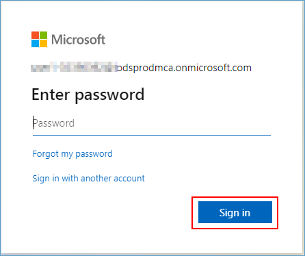

# SQL database in Microsoft Fabric DREAM workshop

## What is DPoC?
DREAM PoC Accelerators (DPoC) are packaged DREAM Demos using ARM templates and automation scripts (with a demo web application, Power BI reports, Fabric resources, ML Notebooks etc.) that can be deployed in a customer’s environment.

## Objective & Intent
Partners can deploy DREAM Demos in their own Azure subscriptions and demonstrate them live to their customers. 
Partnering with Microsoft sellers, partners can deploy the Industry scenario DREAM demos into customer subscriptions. 
Customers can play, get hands-on experience navigating through the demo environment in their own subscription and show it to their own stakeholders.

**Here are some important guidelines before you begin** 

1. **Read the [license agreement](https://github.com/microsoft/Azure-Analytics-and-AI-Engagement/blob/main/CDP-Retail/license.md) and [disclaimer](https://github.com/microsoft/Azure-Analytics-and-AI-Engagement/blob/main/CDP-Retail/disclaimer.md) before proceeding, as your access to and use of the code made available hereunder is subject to the terms and conditions made available therein.**
2. Without limiting the terms of the [license](https://github.com/microsoft/Azure-Analytics-and-AI-Engagement/blob/main/CDP-Retail/license.md) , any Partner distribution of the Software (whether directly or indirectly) must be conducted through Microsoft’s Customer Acceleration Portal for Engagements (“CAPE”). CAPE is accessible to Microsoft employees. For more information aregarding the CAPE process, contact your local Data & AI specialist or CSA/GBB.
3. It is important to note that **Azure hosting costs** are involved when DREAM PoC Accelerator is implemented in customer or partner Azure subscriptions. DPoC hosting costs are not covered by Microsoft for partners or customers.
4. Since this is a DPoC, there are certain resources available to the public. **Please ensure that proper security practices are followed before adding any sensitive data to the environment.** To strengthen the environment's security posture, **leverage Azure Security Centre.** 
5.  In case of questions or comments; please email **[dreamdemos@microsoft.com](mailto:dreamdemos@microsoft.com).**
  

## Contents

<!-- TOC -->

- [Requirements](#requirements)
- [Before Starting](#before-starting)
  - [Task 1: Deploying ARM Template using Cloud Shell](#task-1-deploying-arm-template-using-cloud-shell)
  - [Task 2: Download and install a standard gateway](#task-2-download-and-install-a-standard-gateway)
  - [Task 3: Set up a gateway connection to access on-premises data sources](#task-3-set-up-a-gateway-connection-to-access-on-premises-data-sources)
  - [Task 4: Create an Entra ID App Registration](#task-4-create-an-entra-id-app-registration)
 

<!-- /TOC -->

## Requirements

* Make sure the user deploying the script has atleast a 'Contributor' level of access on the 'Subscription' on which it is being deployed.
* An Azure account with the ability to create Fabric Workspace.
* A Power BI license to host Power BI reports.
* Microsoft Fabric F64 capacity for exploring Copilot scenarios included in this DPoC. 
* Make sure the following resource providers are registered with your Azure Subscription.
  - Microsoft.Compute
  - Microsoft.Network
  - Microsoft.Sql
  - Microsoft.Storage
  - Microsoft.CognitiveServices
* You must only execute one deployment at a time and wait for its completion. Running multiple deployments simultaneously is highly discouraged, as it can lead to deployment failures.
* Should have atleast **Application Administrator** access in **Entra ID** to create an **app registration**.
* Select a region where the desired Azure Services are available. If certain services are not available, deployment may fail. See [Azure Services Global Availability](https://azure.microsoft.com/en-us/global-infrastructure/services/?products=all) for understanding target service availability. (Consider the region availability for Azure SQL, Azure OpenAI Service and Azure Virtual Machines while choosing a location)
* Make sure you use the same valid credentials to log into Azure and Microsoft Fabric.
* Review the [License Agreement](https://github.com/microsoft/Azure-Analytics-and-AI-Engagement/blob/main/CDP-Retail/license.md) before proceeding.


## Task 1: Deploying ARM Template using Cloud Shell

>Note: For this we will deploy resources in an Azure resource group

>Note: In this task we will execute a powershell script on Cloudshell to create those resources. List of the resources are as follows:

| NAME                                    | TYPE              |
|-----------------------------------------|------------------|
| FabconVM{suffix}                                | Virtual machine |
| nic{suffix}                   | Network Interface |
| pip{suffix}              | Public IP address |
| FabconVM_OsDisk_1_{suffix}              | Disk |
| vnet{suffix}                              | Virtual network |
| mssql{suffix}                      | SQL server |
| OpenAI{suffix}                     | Azure OpenAI |
| SalesDb (mssql{suffix}/SalesDb)    | SQL database |
| stfabcon{suffix}                   | Storage account |
|nsg{suffix}                         |Network Security Group|


1. Log into Microsoft Azure portal and click on **Cloud Shell** icon from the menu bar.


2. Select **Powershell**.


3. Click on **No storage account required** button, then select the required subscription from the **Subscription** dropdown and click on **Apply**.


4. In the Cloudshell, enter the below command and press "enter".

```
git clone -b Fabric-SQL-Workshop --depth 1 --single-branch https://github.com/microsoft/Azure-Analytics-and-AI-Engagement.git Fabric-SQL-Workshop
```


> **Note:** If you get File already exist error, please execute the following command to delete existing clone and then reclone:
```
 rm Fabric-SQL-Workshop -r -f 
```
   > **Note**: When executing scripts, it is important to let them run to completion. Some tasks may take longer than others to run. When a script completes execution, you will be returned to a command prompt. 

5. **Execute** the Powershell script with the following command:
```
cd ./Fabric-SQL-Workshop/deployment
```

```
./Setup.ps1
```


10. Browse the **URL** in another tab of your browser and copy the **code**.

    

11. Paste the **code** and click on the **Next** button.

    

12. Select the **Azure account** to sign in.

     

13. Click on the **Continue** button.

    

14. When you see the below **screenshot**, close the tab of your browser and go back to the **Cloudshell tab**.

    

15. Select the desired subscription and then press the Enter key.

    

16. Browse the **URL** in another tab of your browser and copy the **code**.

    

17. Paste the **code** and click on the **Next** button.

    

18. Select the **Azure account** to sign in.

     

19. Click on the **Continue** button.

    

20. When you see the below **screenshot**, close the tab of your browser and go back to the **Cloudshell tab**.

    

21. Select the region as per your preference.

    

>**Note:** It takes approximately 10-15 minutes for the deployment

## Task 2: Download and install a standard gateway

1. Navigate to Azure Portal and open a resource group and connect with your virtual machine using [Remote Desktop](https://learn.microsoft.com/en-us/azure/virtual-machines/windows/connect-rdp).

    

2. Open a new tab in your virtual machine browser and paste the follwing URL, it will download gateway application.

[Download the standard gateway](https://go.microsoft.com/fwlink/?LinkId=2116849&clcid=0x409)

3. In the gateway installer, keep the default installation path, accept the **terms of use**, and then select **Install**.


4. In **email address to use with this gateway** field, enter your Entra ID Username used for the deployment and then select **Sign in**.


5.  Enter your Entra ID Password used for the deployment and click on **Sign in**.



6. Select **Register a new gateway on this computer** and click on **Next**.


7. Enter a name for the gateway as **Datagateway** and in **Recovery Key** field enter key and enter the same value in **Confirm recory key** field and click on **Configure**.


8. Review the information in the final window. Note that the gateway is available for Microsoft Fabric. Select **Close**.


## Task 3: Set up a gateway connection to access on-premises data sources

1. Navigate to Azure portal(https://portal.azure.com/) and search for **Resoucegroup**.


2. Click on **rg-fabcon-suffix**, copy **virtual machine name** and save it on your notpad.


3. Navigate back to Microsoft Fabric tab, click on the **Settings** button (an icon that looks like a gear) at the top right of the page. Then choose **Manage connections and gateways** from the dropdown menu.


4. Click on **+ New** from top left corner.


5. Select **On-premises**,

- From **Gateway cluster name** dropdown, select **datagateway**

>**Note:** You'll have a suffix concatenated with your Gateway cluster name.

- In **Connection name** field, enter ``on-premisesgateway``.

- From the **Connection type** dropdown, select ``SQL Server``.

- In the **Server** field, enter the Virtual Machine name you copied in **step 2**

- In the **Database** field, enter ``FabconDatabase``.


- In the **Authentication method** dropdown, select **Windows**.
- In the **Username** field, enter the virtual machine name you copied in **Step 2** and append ``\azureuser`` to it. It should look like ``FabconVMxyz\azureuser``.
- In the **Password** field, enter ``Fabcon@2025``.
- In the **Privacy level** dropdown, select **None** and click on the **Create** button.


6. Scroll up to verify that the connection has been **created**.


# Task 4: Create an Entra ID App Registration

1. Go to the Azure Portal: https://portal.azure.com

2. In the Azure portal, search for and select **Microsoft Entra ID**.


3. In the left navigation pane, under **Manage**, select **App registrations**.


4. Enter the required details and click **Register**.

  - Name : **sp-fabcon**

  - Supported account types : **Accounts in this organizational directory only**


5. After creating the app registration, under the Essentials section, find **Application (client) ID**, **Directory (tenant) ID** and paste in your notepad.


6. In the left menu, go to **Certificates & secrets**. Under **Client secrets**, click **New client secret**.

7. Provide a **description** and select an **expiration period** and click **Add**.


8. Once created, copy the **secret value** immediately and paste it on your notepad.


9. Expand the **Manage** section in the left navigation pane, select **App registrations**, and then click **+ Add a Permission**.


10. Scroll down on the **Request API Permissions** page and select **Power BI Service** and select Delegated Permission.


11. Grant the **Read.All** permission for all applicable APIs and click **Add permission**.


12. Under **Configured permissions**, click **Grant admin consent for [Tenant Name]** to provide consent for the API permissions.


> **Note** : If you do not have permission to **Grant Admin Consent** for API permissions, contact your Azure AD (Entra ID) Administrator and request **admin consent** for the required permissions.

Now that the deployment is complete, you can begin the workshop by navigating to the exercises.
[Click here to navigate](https://github.com/microsoft/Azure-Analytics-and-AI-Engagement/blob/Fabric-SQL-Workshop/Workshop_Exercises/00%20Overview.md).