# PowerBI Copilot Demonstration

1.	Navigate to the [Power BI](https://app.powerbi.com/).

2.	Click on **Workspace** icon and select the **contosoSales**.

    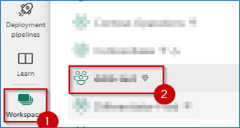

3.	Filter for **Lakehouse**.
    
    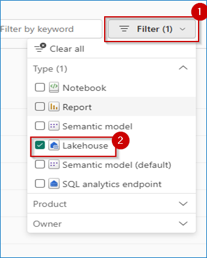

4. Click on **lakehouseBronze...**.

    

5. Click on the **New semantic model** button.

    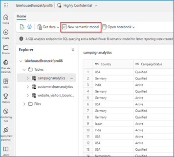

6.	Type in a name for the New semantic Model eg. CopilotModel, select the **Select all** checkbox and then click on the **Confirm** button. 

    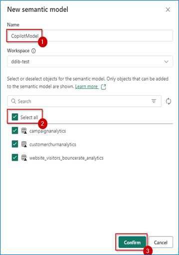
    
7.	Click on **Workspace** and select the **ContosoSales** workspace.

    

8.	Filter for **Semantic model**.

    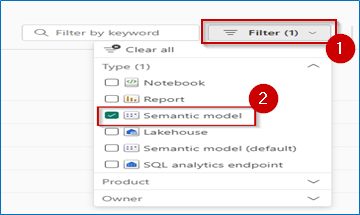

9.	Search **CopilotModel**, click on the three dots and then select **Create report** option.
    
    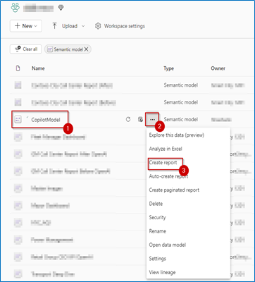

10.	Minimize all the **panes** on the right side.

11.	Click on **Copilot**
    
    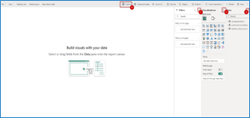
   
>**Note:** When you click on the Copilot button for the first time, you will see the Get-started pop-up. Click on **Get Started** to proceed.

12. In Copilot, select the **Inspire** button (The Glitter icon at the bottom left of the chat window).

13. Select the option **What’s in my dataset?** under the Inspire pane and then click on the **Send** button.

   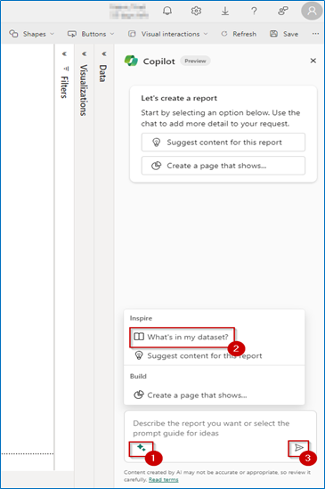

14.	In Copilot, select the **Inspire** button(The Glitter icon at the bottom left of the chat window).

15.	Select the option **Suggest content for this report** under the Inspire pane and then click on the **send** button.

    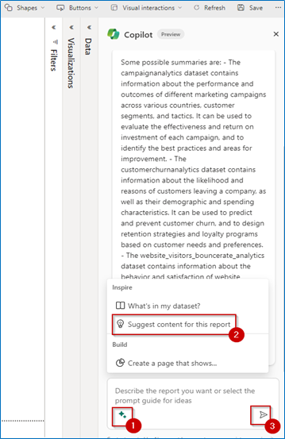

16.	Click on the **Create** button.

    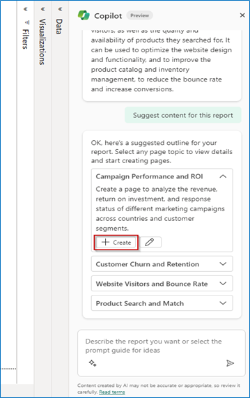

17.	**Observe** the results that are displayed on the left side of the pane.

    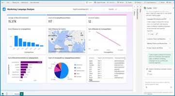

>**Note:** The pages generated might differ from the ones shown in the screenshot.

18.	Expand **Visualizations** section.

19.	Select **top left chart/table visual** on the report to replace it with the **Smart Narrative visual**.

20.	From the Visualizations pane, select the **Smart Narrative** visual button.

21.	Click on the **Copilot (preview)** button.

    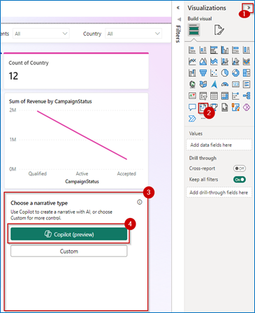

>**Note:** For better visibility, you can expand the Visualization tab and then click on visuals or zoom out of the browser.

22.	Click on **Give an executive summary** and then	click on the **Create** button.

    

23.	Show the **executive summary** generated by the Smart Narrative visual.

    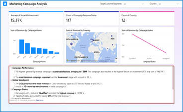

>**Note:** For better visibility, you can expand the summary text box. 
