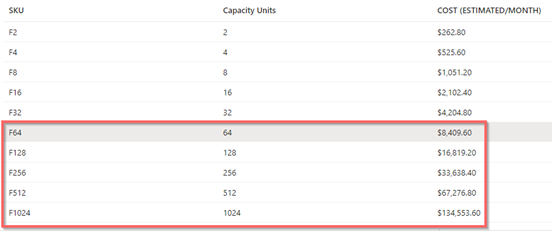
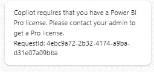
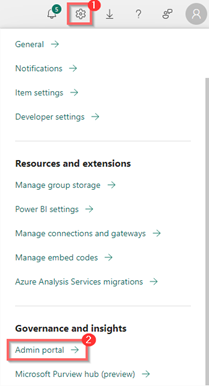
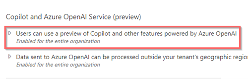

# GUIDE TO GET POWER BI COPILOT ENABLED

##	Pricing Details:

1.	To get the Power BI Copilot, a user should have a tenant with Fabric Capacity of F64 or higher. 

Users can also have Power BI Premium, with P1 or higher which costs around $5,000 USD and the functionality of the Microsoft Fabric will be limited to Power BI, if we opt Power BI Premium there will be some limitations.

2.	User should have Power BI Pro license to use Power BI Copilot. Which is around $10 USD per month.

    

##  Enable the COPILOT feature in the Tenant:

After meeting with the requirements of the pre-requisite, the admin of the Tenant should enable the COPILOT feature in the Admin Portal of [https://app.powerbi.com/](https://app.powerbi.com/)

1.	**Click** on the “Admin Portal” under “Setting Icon”.
    
    

2.	Under the “Tenant settings” **scroll down** to the bottom, in the 'Copilot and Azure OpenAI Service (Preview)' section enable 'Users can use a preview of Copilot and other feature powered by Azure OpenAI' for the entire Organization based on the need.
    
    
