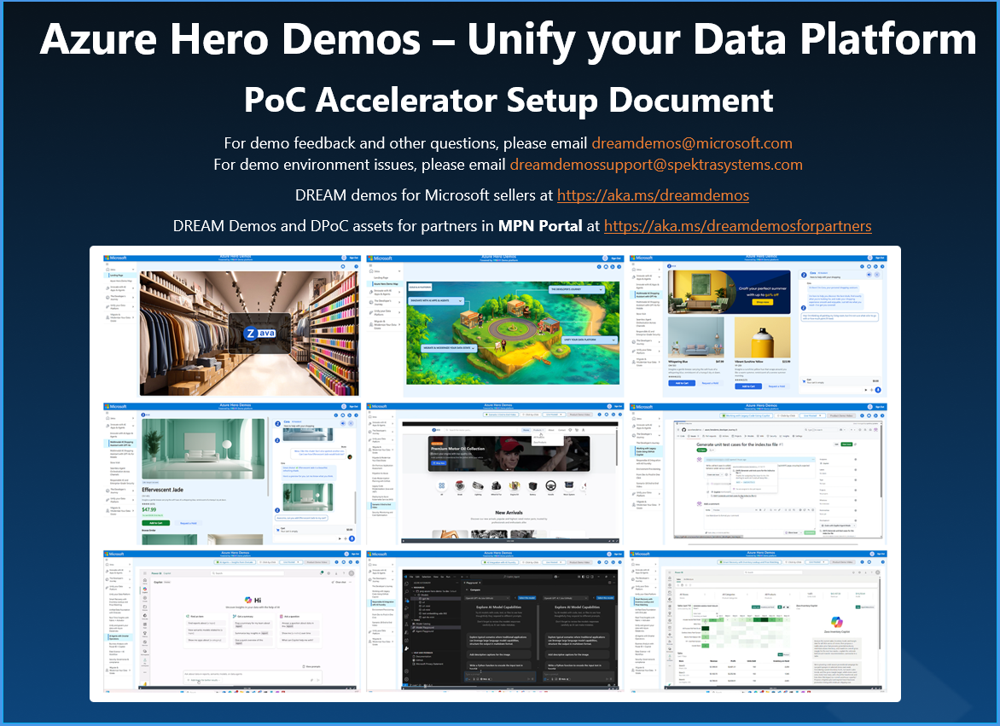

# Fabric DREAM PoC Accelerator Setup Guide

## What is DPoC?
DREAM PoC Accelerators (DPoC) are packaged DREAM Demos using ARM templates and automation scripts (with a demo web application, Power BI reports, Fabric resources, ML Notebooks etc.) that can be deployed in a customer’s environment.

## Objective & Intent
Partners can deploy DREAM Demos in their own Azure subscriptions and demonstrate them live to their customers. 
Partnering with Microsoft sellers, partners can deploy the Industry scenario DREAM demos into customer subscriptions. 
Customers can play, get hands-on experience navigating through the demo environment in their own subscription and show it to their own stakeholders.

**Here are some important guidelines before you begin** 

  1. **Read the [license agreement](https://github.com/microsoft/Azure-Analytics-and-AI-Engagement/blob/main/CDP-Retail/license.md) and [disclaimer](https://github.com/microsoft/Azure-Analytics-and-AI-Engagement/blob/main/CDP-Retail/disclaimer.md) before proceeding, as your access to and use of the code made available hereunder is subject to the terms and conditions made available therein.**
  2. Without limiting the terms of the [license](https://github.com/microsoft/Azure-Analytics-and-AI-Engagement/blob/main/CDP-Retail/license.md) , any Partner distribution of the Software (whether directly or indirectly) must be conducted through Microsoft’s Customer Acceleration Portal for Engagements (“CAPE”). CAPE is accessible to Microsoft employees. For more information aregarding the CAPE process, contact your local Data & AI specialist or CSA/GBB.
  3. It is important to note that **Azure hosting costs** are involved when DREAM PoC Accelerator is implemented in customer or partner Azure subscriptions. DPoC hosting costs are not covered by Microsoft for partners or customers.
  4. Since this is a DPoC, there are certain resources available to the public. **Please ensure that proper security practices are followed before adding any sensitive data to the environment.** To strengthen the environment's security posture, **leverage Azure Security Centre.** 
  5.  In case of questions or comments; please email **[dreamdemos@microsoft.com](mailto:dreamdemos@microsoft.com).**
  
 


## Contents

<!-- TOC -->

- [Requirements](#requirements)
- [Before Starting](#before-starting)
  - [Task 1: Power BI Workspace and Lakehouse creation](#task-1-power-bi-workspace-and-lakehouse-creation)
  - [Task 2: Run the Cloud Shell to provision the demo resources](#task-2-run-the-cloud-shell-to-provision-the-demo-resources)
  - [Task 3: Creating a Shortcut in Lakehouse](#task-3-creating-a-shortcut-in-lakehouse)
  - [Task 4: Setting up the Warehouse](#task-4-setting-up-the-warehouse)
  - [Task 5: Running Notebooks](#task-5-running-notebooks)
  - [Task 6: Creating Internal Shortcut](#task-6-creating-internal-shortcut)
  - [Task 7: KQL DB and QuerySet creation](#task-7-kql-db-and-queryset-creation)

- [Appendix](#appendix)
  - [Setting up the Lakehouse](#setting-up-the-lakehouse)
  - [Creating Pipelines and Dataflows](#creating-pipelines-and-dataflows)
  - [Creating a Resource Group](#creating-a-resource-group)

<!-- /TOC -->

## Requirements

* An Azure Account with the ability to create Fabric Workspace.
* A Power BI with Fabric License to host Power BI reports.
* Make sure your Power BI administrator can provide service principal access on your Power BI tenant.
* Make sure to register the following resource providers with your Azure Subscription:
   - Microsoft.Fabric
   - Microsoft.Databricks
   - Microsoft.EventHub
   - Microsoft.SQLSever
   - Microsoft.StorageAccount
   - Microsoft.AppService
* You must only execute one deployment at a time and wait for its completion.Running multiple deployments simultaneously is highly discouraged, as it can lead to deployment failures.
* Select a region where the desired Azure Services are available. If certain services are not available, deployment may fail. See [Azure Services Global Availability](https://azure.microsoft.com/en-us/global-infrastructure/services/?products=all) for understanding target service availability. (Consider the region availability for Synapse workspace, Iot Central and cognitive services while choosing a location)
* In this Accelerator, we have converted real-time reports into static reports for the users' ease but have covered the entire process to configure real-time dataset. Using those real-time dataset, you can create real-time reports.
* Make sure you use the same valid credentials to log into Azure and Power BI.
* Once the resources have been setup, ensure that your AD user and synapse workspace have “Storage Blob Data Owner” role assigned on storage account name starting with “storage”.
* Review the [License Agreement](https://github.com/microsoft/Azure-Analytics-and-AI-Engagement/blob/main/CDP-Retail/license.md) before proceeding.


### Task 1: Power BI Workspace and Lakehouse creation

1. **Open** Power BI in a new tab by clicking [HERE](https://app.powerbi.com/)

2. **Sign in** to Power BI.

	

	> **Note:** Use your Azure Active Directory credentials to login to Power BI.

3. In Power BI service **click** 'Workspaces'.

4. **Click** '+ New workspace' button.

	

5. **Enter** the name as 'contosoSales' and **click** 'Apply'.

>**Note:** The name of the workspace should be in camel case, i.e. the first word starting with a small letter and then the second word staring with a capital letter with no spaces in between.

>If name 'contosoSales' is already taken, add some suffix to the end of the name for eg. 'contosoSalesTest'.

>Workspace name should not have any spaces.

   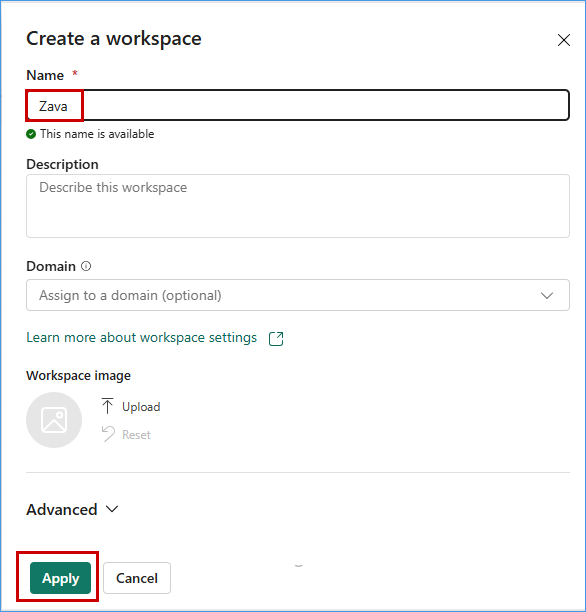

6. **Copy** the Workspace GUID or ID from the address URL.

7. **Save** the GUID in a notepad for future reference.

	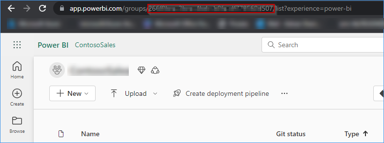

	> **Note:** This workspace ID will be used during powershell script execution.

8. In the workspace **click** the three dots(Ellipsis) and **select** 'Workspace settings'.

	

9. In the left pane of the side bar **click** 'Premium', scroll down and **check** the 'Trial' radio box.

	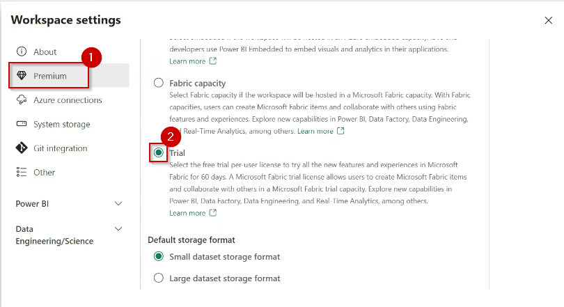

>**Note:** All workspaces used in this demo use 'Trial' License type. 

10. **Scroll down** and **click** on 'Apply'.

	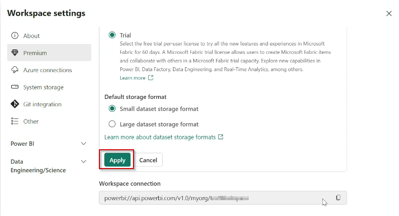

11. **Repeat** step number 3 to 5 to **create** a new workspace with the name 'contosoFinance'.

>**Note:** Make sure to add this workspace has fabric Trial License as well and note the names of the workspaces and lakehouses as these will be used during the script execution(Task 2)


### Task 2: Run the Cloud Shell to provision the demo resources

1. **Open** Azure Portal by clicking [HERE](https://portal.azure.com/)

2. In the Resource group section, **select** the Terminal icon to open Azure Cloud Shell.

	

3. **Click** on the 'PowerShell'.

4. **Click** 'Show advanced settings'.

	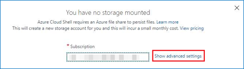

	> **Note:** If you already have a storage mounted for Cloud Shell, you will not get this prompt. In that case, skip step 5 and 6.

5. **Select** your 'Subscription', 'Cloud Shell region' and 'Resource Group'.

>**Note:** If you do not have an existing resource group please follow the steps mentioned [HERE](#creating-a-resource-group) to create one. Complete the task and then continue with the below steps.

>Cloud Shell region need not be specific, you may select any region which works best for your experience.

6. **Enter** the 'Storage account', 'File share' name and then **click** on 'Create storage'.

	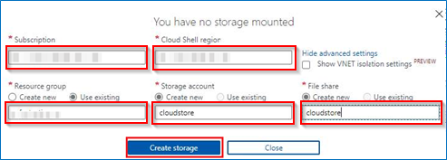

	> **Note:** If you are creating a new storage account, give it a unique name with no special characters or uppercase letters. The whole name should be in small case and not more than 24 characters.

	> It is not mandatory for storage account and file share name to be same.

7. In the Azure Cloud Shell window, ensure that the PowerShell environment is selected.

	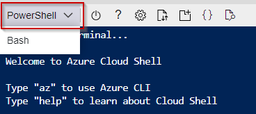

	>**Note:** All the cmdlets used in the script works best in Powershell.	

8. **Enter** the following command to clone the repository files in cloudshell.

Command:
```
git clone -b microsoftfabric --depth 1 --single-branch https://github.com/microsoft/Azure-Analytics-and-AI-Engagement.git fabric
```

   
	
   > **Note:** If you get File already exist error, please execute the following command to delete existing clone and then reclone:
```
 rm fabric -r -f 
```
   > **Note**: When executing scripts, it is important to let them run to completion. Some tasks may take longer than others to run. When a script completes execution, you will be returned to a command prompt. 

9. **Execute** the Powershell script with the following command:
```
cd ./fabric/fabric/
```

```
./fabricSetup.ps1
```
    
   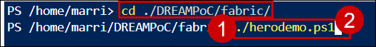
      
10. From the Azure Cloud Shell, **copy** the authentication code. You will need to enter this code in next step.

11. **Click** the link [https://microsoft.com/devicelogin](https://microsoft.com/devicelogin) and a new browser window will launch.

	
     
12. **Paste** the authentication code.

	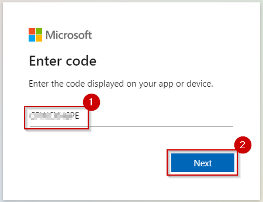

13. **Select** the user account that is used for logging into the Azure Portal in [Task 1](#task-1-create-a-resource-group-in-azure).

	

14. **Click** on 'Continue' button.

	

15. **Close** the browser tab once you see the message box.

	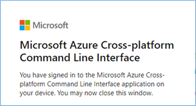  

16. **Navigate back** to your Azure Cloud Shell execution window.

17. **Copy** the code on screen to authenticate Azure PowerShell script for creating reports in Power BI.

18. **Click** the link [https://microsoft.com/devicelogin](https://microsoft.com/devicelogin).

	

19. A new browser window will launch.

20. **Paste** the authentication code you copied from the shell above.

	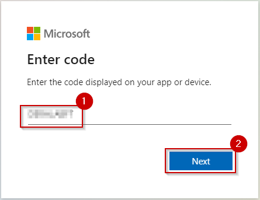

21. **Select** the user account that is used for logging into the Azure Portal in [Task 1](#task-1-create-a-resource-group-in-azure).

	

22. **Click** on 'Continue'.

	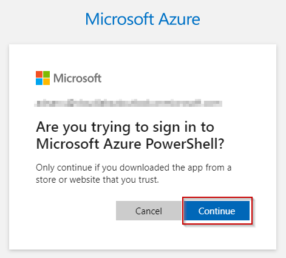

23. **Close** the browser tab once you see the message box.

	

24. **Go back** to Azure Cloud Shell execution window.

25. **Copy** your subscription name from the screen and **paste** it in the prompt.

    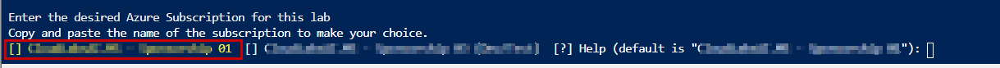
	
	> **Notes:**
	> - The user with single subscription won't be prompted to select subscription.
	> - The subscription highlighted in yellow will be selected by default if you do not enter any disired subscription. Please select the subscription carefully, as it may break the execution further.
	> - While you are waiting for processes to get completed in the Azure Cloud Shell window, you'll be asked to enter the code three times. This is necessary for performing installation of various Azure Services and preloading the data.

26. **Enter** the Region for deployment with necessary resources available, preferably "eastus". (ex. eastus, eastus2, westus, westus2 etc)

	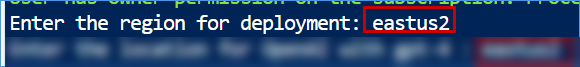

27. **Enter** desired SQL Password.

	

>**Note:** Copy the password in Notepad for further reference.

28. **Enter** the workspace id which you copied in Step 6 of [Task 1](#task-1-power-bi-workspace-and-lakehouse-creation).

	

29. You will get another code to authenticate the Azure PowerShell script for creating reports in Power BI. **Copy** the code.

	> **Note:** You may see errors in script execution if you  do not have necessary permissions for cloudshell to manipulate your Power BI workspace. In that case, follow this document [Power BI Embedding](https://github.com/microsoft/Azure-Analytics-and-AI-Engagement/blob/fintax/fintaxdemo/Power%20BI%20Embedding.md) to get the necessary permissions assigned. You’ll have to manually upload the reports to your Power BI workspace by downloading them from this location [Reports](https://github.com/microsoft/Azure-Analytics-and-AI-Engagement/tree/fintax/fintaxdemo/artifacts/reports). 

30. **Click** the link [https://microsoft.com/devicelogin](https://microsoft.com/devicelogin).

    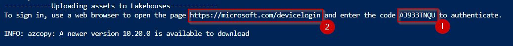
      
31. In the new browser tab, **paste** the code that you copied from the shell in step 34 and **click** on 'Next'.

	

	> Note: Make sure to provide the device code before it expires and let the script run till completion.

32. **Select** the user account that is used for logging into the Azure Portal in [Task 1](#task-1-create-a-resource-group-in-azure). 

	

33. **Click** on 'Continue'.

	

34. **Close** the browser tab once you see the message box.

	

	>**Note:** During script execution you need to note the resource group which gets created, since a resource group with unique suffix is created each time the script is executed.

35. **Navigate back** to your Azure Cloud Shell execution window.

	> **Note:** The deployment will take approximately 20-30 minutes to complete. Keep checking the progress with messages printed in the console to avoid timeout.

36. After the script execution is complete, the user is prompted "--Execution Complete--"
	
37. **Go to** Azure Portal and **search** for 'fabric-dpoc' and **click** on the resource group name which was created by the script.

	

	>**Note:** The resource group name starts with 'fabric-dpoc-' with some random unique suffix in the end.

38. In the search pane of the resource group **type** "app-realtime-kpi-analytics..." and **select** the resource.

	

39. **Click** "Browse" and a new tab will open.

	

40. **Wait** for the tab to load till you get the following screen.

	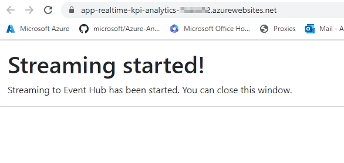


### Task 3: Creating a Shortcut in Lakehouse

1. **Open** [Power BI](app.powerbi.com)

2. In PowerBI, **click** 'Workspaces' and **select** 'contosoSales'

    

3. In 'contosoSales' workspace, **click** on 'lakehouseBronze' lakehouse.

    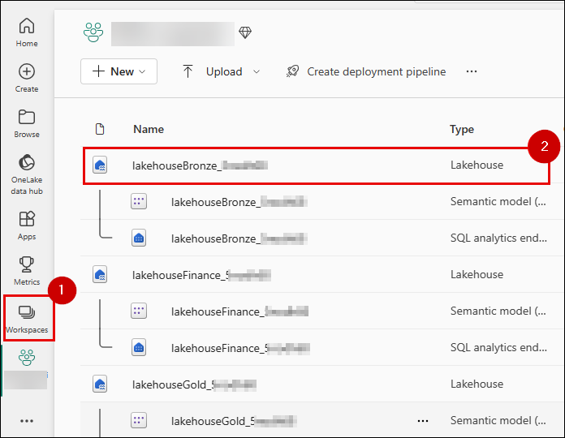

>**Note:** Lakehouses will have a concatenated suffix, resulting in names like 'lakehousesbronze_SUFFIX'

4. In the lakehouse window **click** on the 'collapse' icon in front of Files if it is expanded.

>**Note:** When the collapse icon is expanded, the three dots icon is note visible.

5. **Click** on the three dots in front of Files.
6. **Click** on 'New shortcut'.

	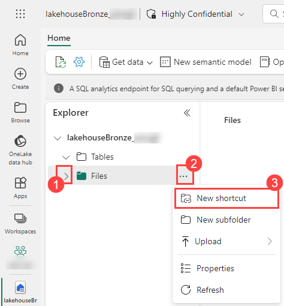

7. In the pop-up window, under External sources **select** 'Azure Data Lake Storage Gen2'

	

8. In a new tab **open** the resource group created in [Task 2](#task-2-run-the-cloud-shell-to-provision-the-demo-resources) while script execution with name 'fabric-dpoc-...'.

9. **Search** for 'storage account', **click** the storage account resource.

	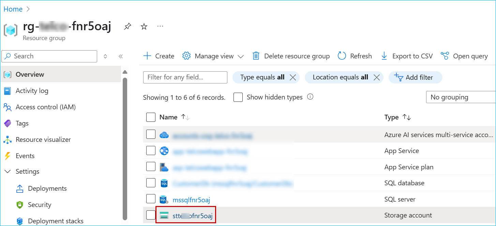

10. In the resource window **goto** the left pane and **scroll down**.
11. In 'Security + networking' section, **click** 'Access keys'.
12. **Click** 'Show' button under key1.

	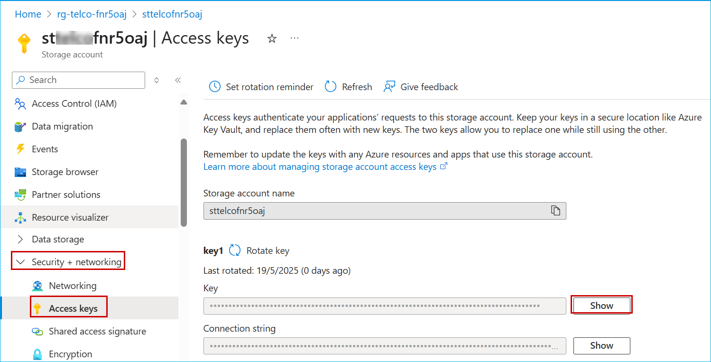

13. **Click** 'Copy to clickboard' button.
14. **Save** it in a notepad for further use.

	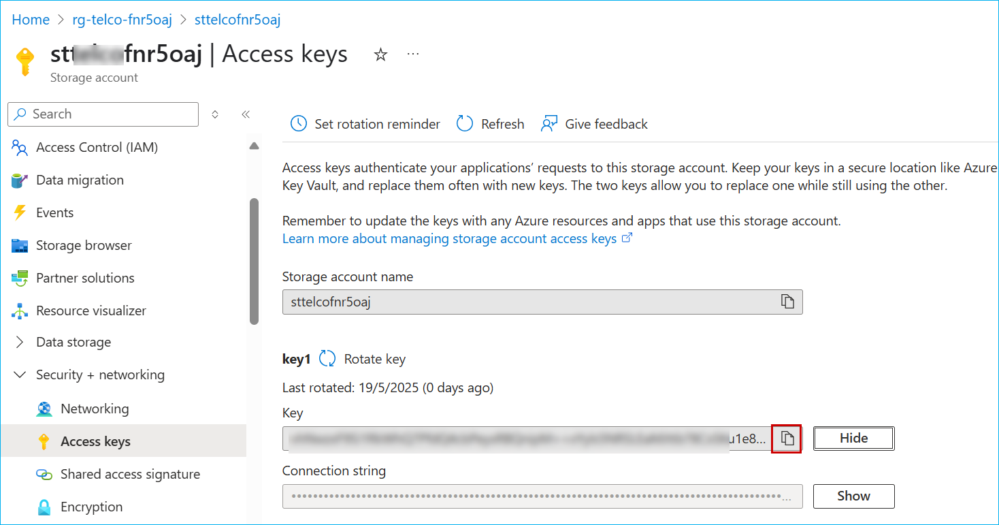

15. **Scroll down** in the left pane.
16. **Select** 'Endpoints' from 'Settings' section.
17. **Scroll down** and **copy** the 'Data Lake Storage' endpoint under 'Data Lake Storage' section.
18. **Save** it in a notepad for further use.

	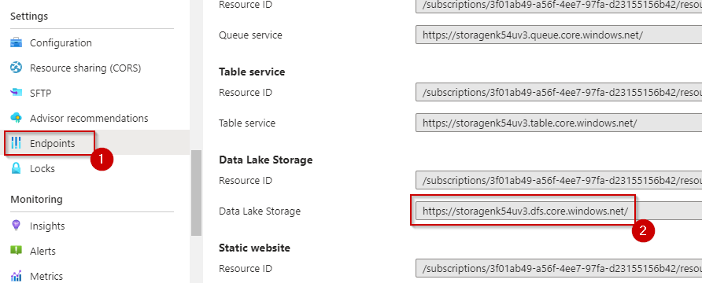

>**Note:** You may see different endpoints as well in the above screen. Make sure to select only the Data Lake Storage endpoint.

19. **Navigate back** to Power BI workspace i.e. the powerbi tab which we working earlier.
20. **Paste** the endpoint copied under the 'URL' field.

21. In the 'Authentiation kind' dropdown, **select** 'Account Key'.

22. **Paste** the account key copied in step number 13.

23. **Click** on 'Next'.

	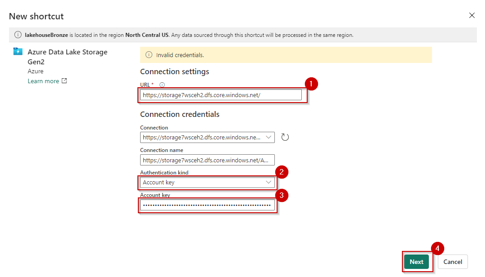

24. Under Shortcut Name **type** 'sales-transaction-litware'.

25. **Verify** the URL is same as the one you copied in step 17.

26. Under Sub Path **type** '/bronzeshortcutdata'.

27. **Click** the **Create** button.

	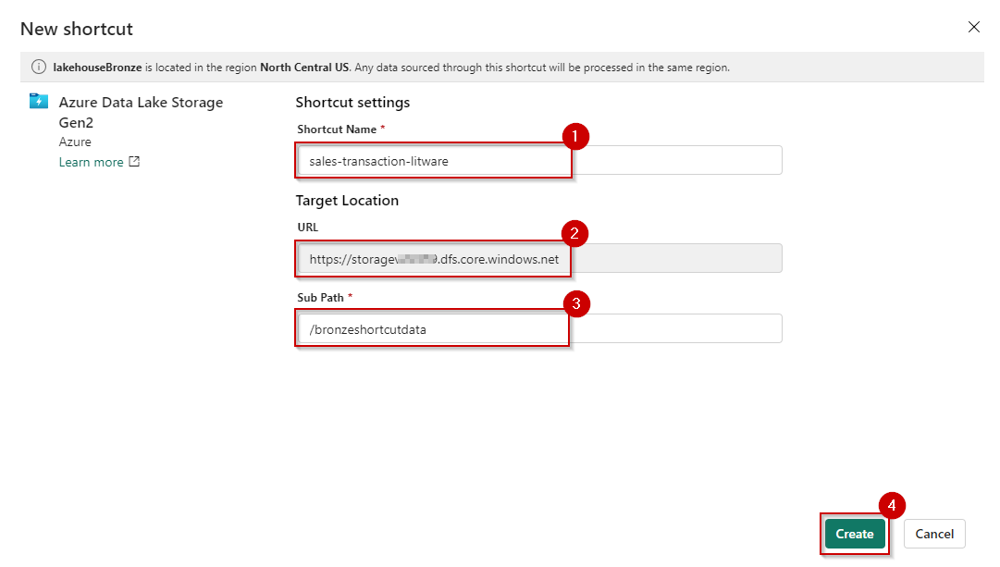


### Task 4: Setting up the Warehouse

1. In PowerBI, **click** 'Workspaces' and **select** 'contosoSales'

    

2. Filter and **Select** 'Data Warehouse'. 

	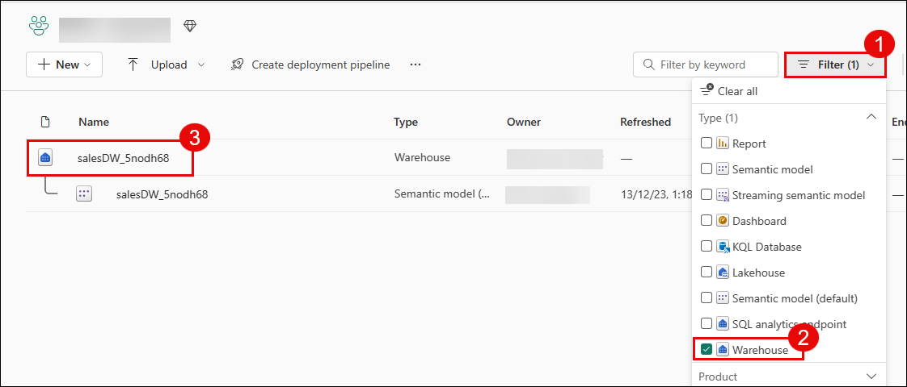

3. **Open** 'salesDW'.

>**Note:** warehouses will have a concatenated suffix, resulting in names like 'salesDW_SUFFIX'

4. **Click** 'Get data'.

5. **Select** 'New data pipeline'.

	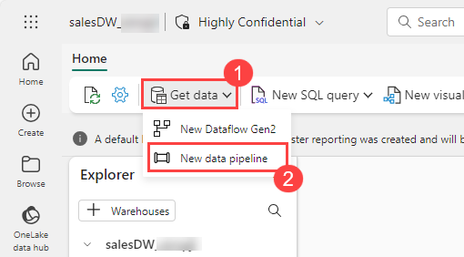

>**Note:** It would take some time for the page to load, please wait for the page to load.

6. In the pop-up **enter** the name as '02 Sales data from Azure SQL DB to Data Warehouse - Low Code Experience'.

7. **Click** Create.

8. **Wait** for a new pop-up.

	

9. In the pop-up **scroll down**.

10. **Select** 'Azure SQL Database'.

11. **Click** 'Next' button.

	

12. In a new tab **open** the resource group created in [Task 2](#task-2-run-the-cloud-shell-to-provision-the-demo-resources).

13. **Search** for 'sql server'.

14. **Click** on the SQL server resource.

	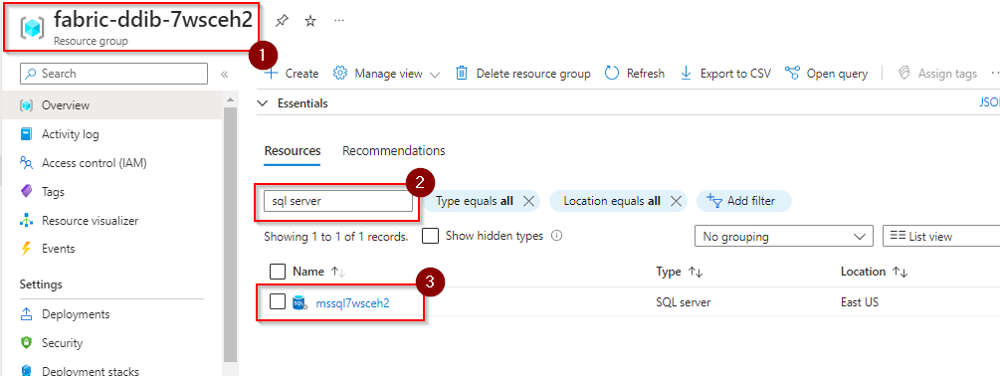

15. In the resource window **copy** the 'Server admin'.

16. **Save** it in a notepad for further use.

17. **Copy** the 'Server name'.

18. **Save** it in a notepad for further use.

19. **Click** 'SQL databases' under the Settings in the left pane.

	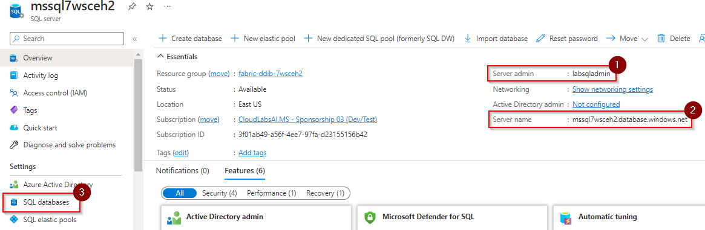

20. **Copy** the name of database and **paste** it in a notepad for further use.

	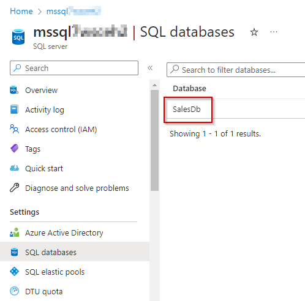

21. **Go back** to the PowerBI tab.

22. **Select** 'Create new connection' radio button, in the 'Server;' and 'Database' field **paste** the value copied in step number 17 and 19.

	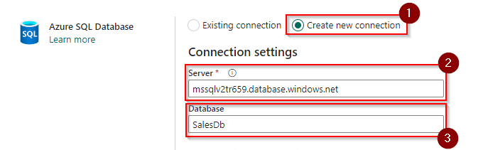

23. **Select** Authentication kind as 'Basic', **enter** Username as 'labsqladmin' and Password you copied in [Task 2](#task-2-run-the-cloud-shell-to-provision-the-demo-resources)
step 28 finally **click** on the 'Next' button.

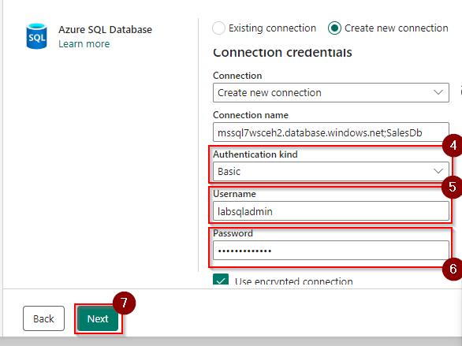

24. Next, in 'Connect to data source' **select** 'Existing tables' then **select** 'Select all' and then **click** 'Next' button.

	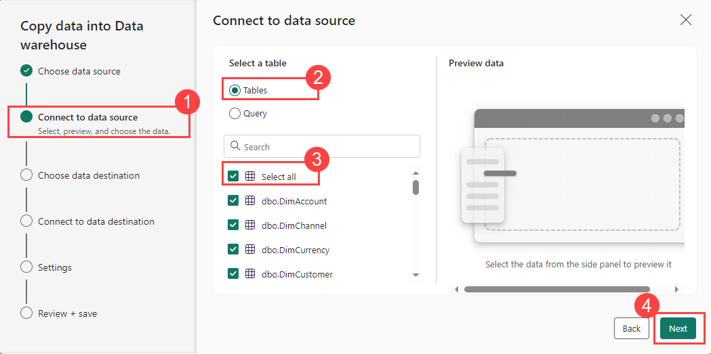

25. In 'Choose data destination' **select** the Data Warehouse and **click** 'Next' button.

	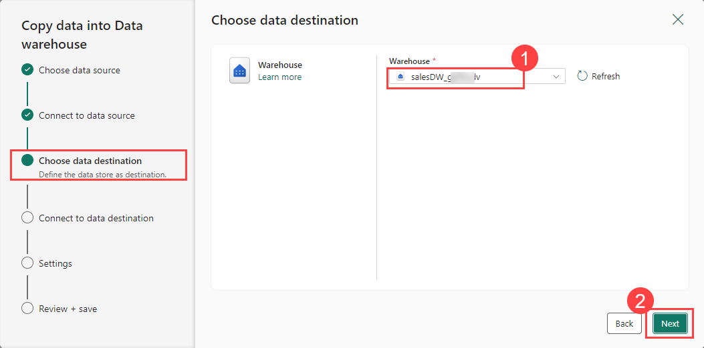

26. In 'Choose data destination' **select** 'Load to new table', **click** on 'Source' checkbox and then **click** 'Next' button.

	

27. In 'Settings' section keep it default and **click** 'Next' button.

	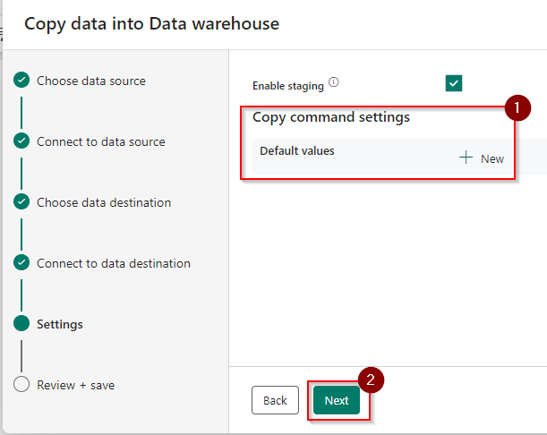

28. In 'Review + save' section **review** the copy summary and **scrolldown** tick mark the option of 'Start data transfer immediately' then **click** 'Save + Run' button.

	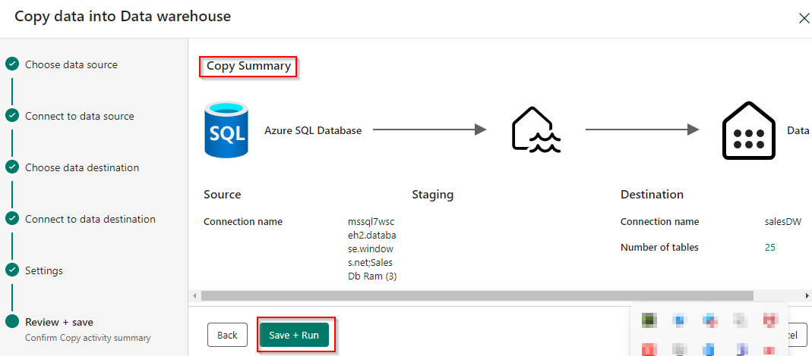	

>**Note:**  As you click on 'Save + Run' click 'OK' on the pop up to get the pipeline automatically triggered.

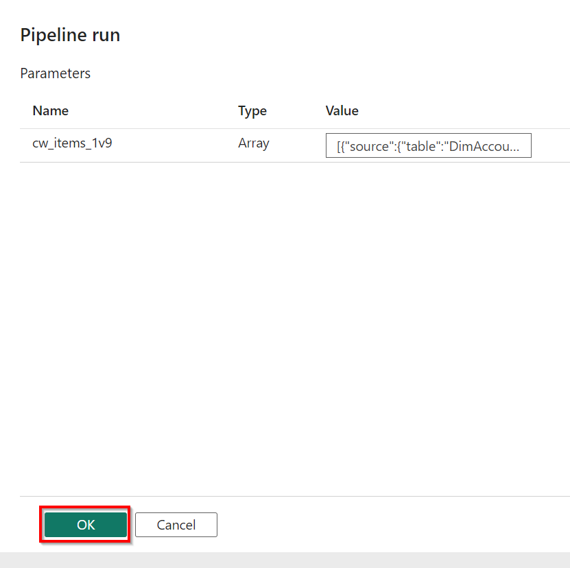

29. **Check** the notification or pipeline output screen for the progress of copy database.

	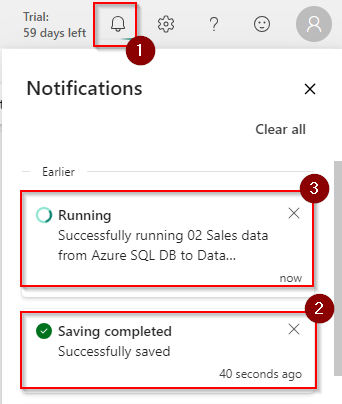

30. In Output section of pipeline **check** the status of running pipeline.

	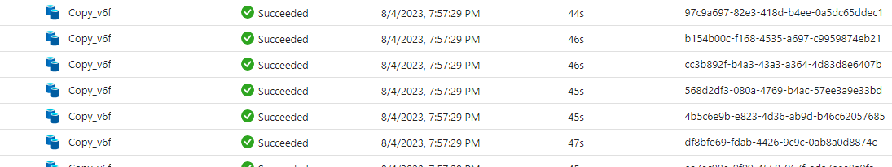

>**Note:** Please wait for the resultant data to load.

31. **Wait** for the status of pipeline to be 'Succeeded' and **go back** the the Data Warehouse from the workspace.

32. **Open** the Data Warehouse and **click** 'New SQL query'.

	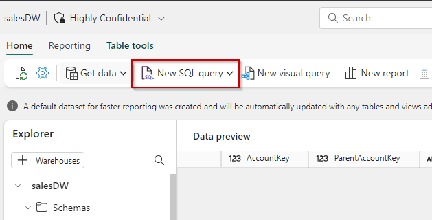

33. **Click** on [Warehouse Scripts](https://github.com/microsoft/Azure-Analytics-and-AI-Engagement/tree/microsoftfabric/fabric/artifacts/warehousescripts) link to open the scripts.

34. **Click** the first script to open it.

	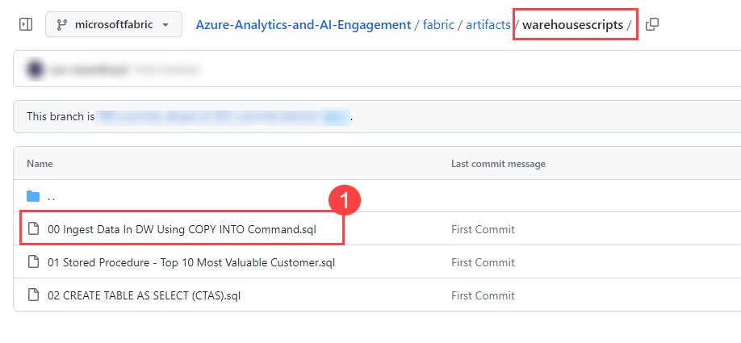

35. In a new tab **open** the resource group created in [Task 2](#task-2-run-the-cloud-shell-to-provision-the-demo-resources).

36. **Search** for the 'Storage account' **copy** the 'Storage account' and **paste** it in a notepad for further use.

	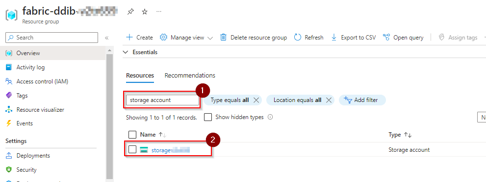

37. **Click** on searched 'Storage account', **scrolldown** left pane and **click** to select 'Shared access signature'.

	

38. **Select** 'Container' in 'Allowed resource type'. **select** 'Read','Write', 'List' in 'Allowed permissions' keep  rest all uncheck. In 'Start and expiry date/time' **select** date & time and then **scrolldown** to **click** 'Generate SAS and connection string' button.

	

	

39. Below the 'Generate SAS and connection string' button, we can see the generated SAS token. **Copy** and paste it into notepad for further use.

	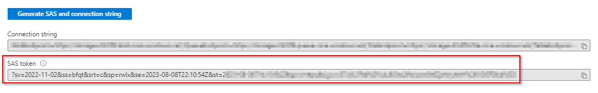

40. **Click** '00 Ingest Data In DW Using COPY INTO Command.sql' file and **copy** the script and **replace** '#STORAGE_ACCOUNT_NAME#' and '#STORAGE_ACCOUNT_SAS_TOKEN#' with the appropriate values copied in earlier steps.

41. **Copy** the script.

	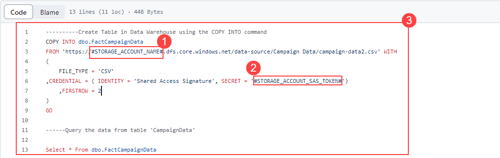

42. **Navigate back** to 'salesDW' warehouse explorer to execute SQL scripts and **click** 'New SQL query'. In dropdown, **click** 'New SQL query' again.

	

43. Once the SQL editor opens, **paste** the script which we have modified in step 41. **Right click** on 'SQL query 1' and **click** 'Rename'.

	

44. **Enter** the name as '00 Ingest Data In DW Using COPY INTO Command.sql' and **click** 'Rename' button.

	

45. **Click** the 'three dots (Ellipsis)' in front of the name of the scripts and **select** 'Move to Shared queries'.

	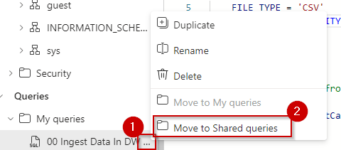

>**Note:** We are going to create 2 more scripts following the above steps for querying the Warehouse data.

46. **Repeat** the steps (33-45) for the other two scripts in the repository. Get the scripts [HERE](https://github.com/microsoft/Azure-Analytics-and-AI-Engagement/tree/microsoftfabric/fabric/artifacts/warehousescripts)

>**Note:** If there are no replacements necessary in the scripts, you can skip the steps in between.

47. **Click** 'New visual query'.

	

48. **Click** and **drag** the table 'DimProduct' to the canvas.

	

49. **Click** and **drag** the table 'FactSales' to the canvas.

	

50. **Click** 'Combine' and **select** 'Merge queries as new'.

	

51. In the 'Left table for merge' **select** 'DimProduct' from the dropdown and **click** on column 'ProductKey' of the table.

	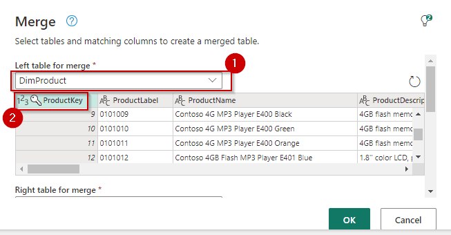

52. **Scroll down** in the 'Right table for merge' **select** 'FactSales' from the dropdown and **click** on column 'ProductKey' of the table.

	

53. **Scroll down** to Join kind section and **click** on 'Inner' radio button and click on 'OK' button.

	

54. You would see the following result.

	

55. **Right click** on 'Visual query 1' and **select** 'Rename'.

	

56. **Enter** the name as "Visual query- Total Sales By Product" and **click** on 'Rename' button.

	

57. **Click** on the 'three dots' infront of the visual query name and **click** one 'Moved to Shared queries'

	

### Task 5: Running Notebooks

1. In the workspace **click** on the "02 Bronze to Silver layer_ Medallion Architecture" notebook.

	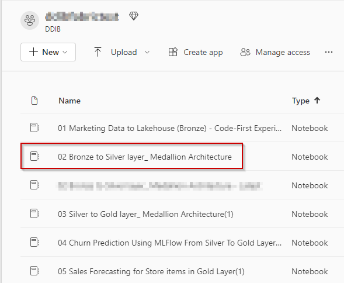

2. In the left pane **click** on 'Missing Lakehouse' button and **select** 'Remove all Lakehouses'.

	

>**Note:** In case you do not see Missing lakehouse, you would see 'lakehouse{Name}', click on the same to get the 'Remove all Lakehosues' option.

3. **Click** on 'Continue' in the pop-up window.

	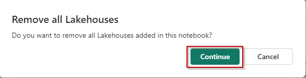

4. In the left pane **click** on the 'Add' button.

	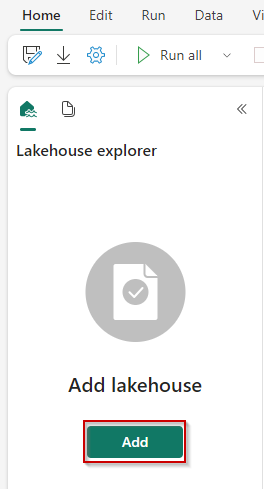

5. In the pop-up **select** 'Existing Lakehouse' radio button and then **click** on 'Add' button.

	

6. **Click** on 'lakehouseSilver' checkbox and **click** on 'Add'.

	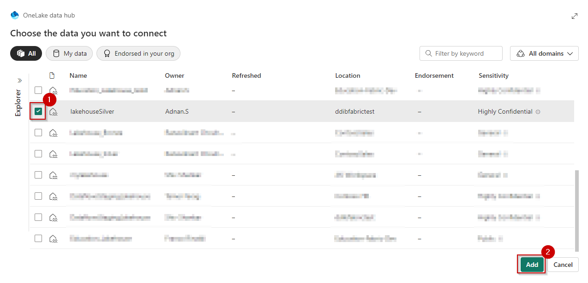

7. Similarly **perform** step number 1 to step number 6 for the other notebooks as well.

>**Note:** To perform the above steps you need to attach the notebooks to respective lakehouses before running the notebooks. Follow the below instruction for the same.

8. Refer the below table to attach notebooks with the respective lakehouses

	|	Notebook	|	Lakehouse	|
	| -----------	| ------------- |
	|	01 Marketing Data to Lakehouse (Bronze) - Code-First Experience.ipynb	|	lakehouseBronze	|
	|	02 Bronze to Silver layer_ Medallion Architecture.ipynb	|	lakehouseSilver	|
	|	03 Silver to Gold layer_ Medallion Architecture.ipynb	|	lakehouseGold	|
	|	04 Churn Prediction Using MLFlow From Silver To Gold Layer	|	lakehouseSilver	|
	|	05 Sales Forecasting for Store items in Gold Layer	|	lakehouseSilver	|
	|||

>**Note:** Please complete Task 6 and then execute notebook '05 Sales Forecasting for Store items in Gold Layer'.

> Please comeback to continue with the below given steps after completing Task 6

9. In PowerBI workspace **click** on 'Workspaces' and **select** 'contosoSales'.

	

10. **Filter** 'Notebook' and then **click** on the notebook '03 Silver to Gold layer_ Medallion Architecture'

	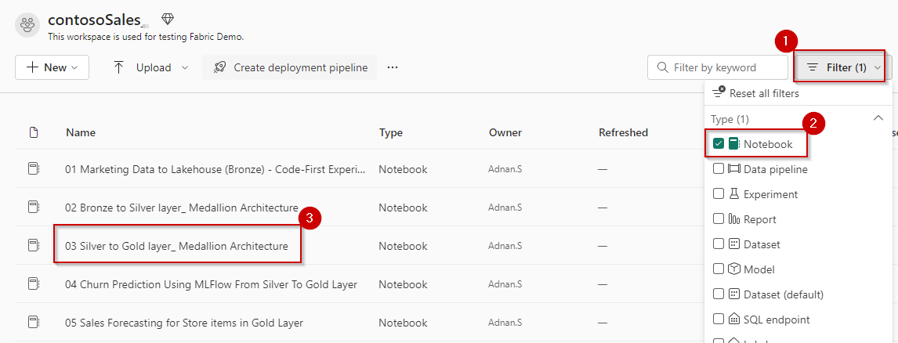

11. **Click** on the 'Run all' button.

	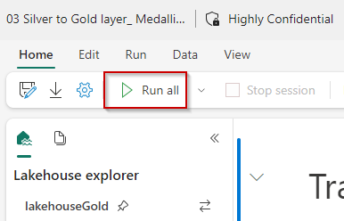

### Task 6: Creating Internal Shortcut

>**Note:** In this task we are creating Internal Shortcut in lakehouse 'Silver To Gold'

1. In Power BI workspace **click** on 'Workspaces' and **select** 'contosoSales'.

	

2. **Filter** 'Lakehouse' and then **select** 'lakehouseGold'.
    
	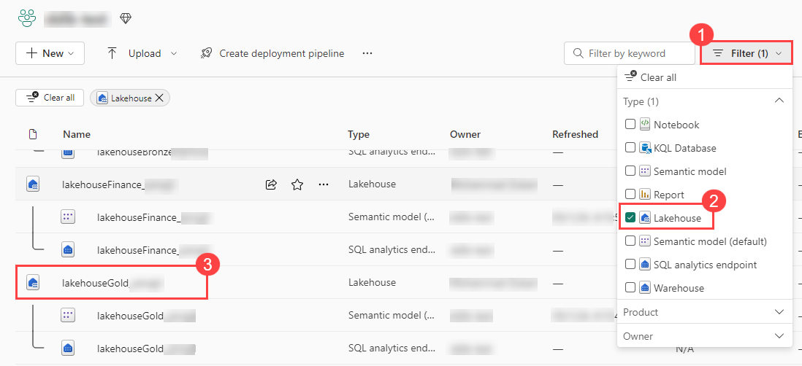
	
3. **Click** on the 'three dots' infont of Tables and then **select** 'New Shortcut'.

	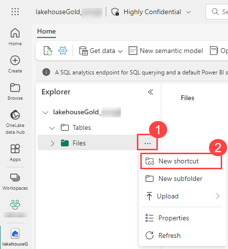

4. In the 'Internal Sources' section **select** 'Microsoft OneLake'.

	

5. **Search** for 'lakehouseSilver' in the search box, **click** on 'lakehouseSilver' and then **click** on 'Next'.

	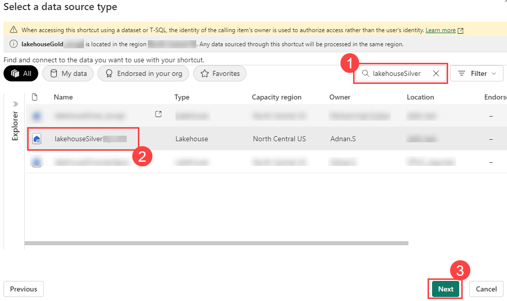

6. **Click** on Tables, **select** 'dimension_date' and then **click** on 'Create'.

	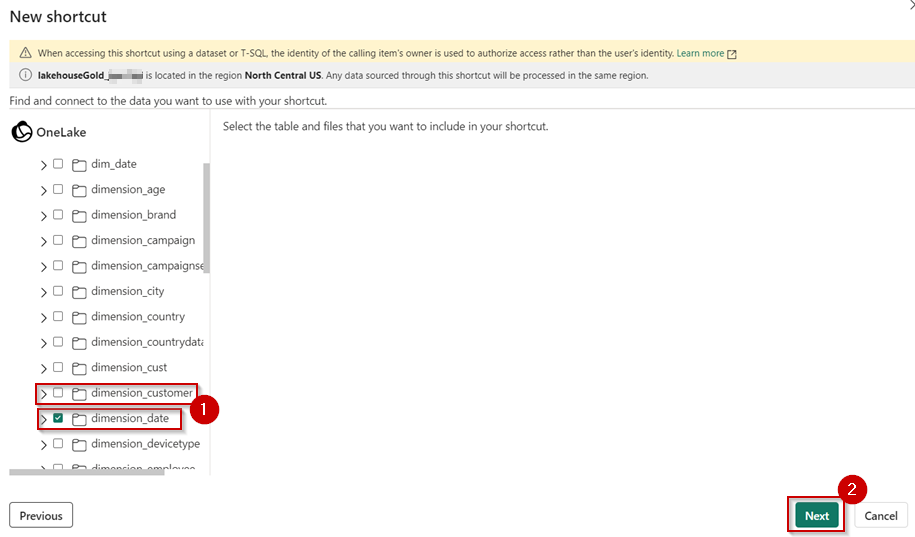

7. **Create** an internal shortcut for the below listed tables at once by **selecting** the checkbox infront of them.

	|	Table Name	|	Create Shortcut From Lakehouse	|
	| -----------	| ------------- |
	|	dimesion_product|	lakehouseSilver	|
	|	dimesion_customer|	lakehouseSilver	|
	|	fact_sales|	lakehouseSilver	|
	|	fact_campaigndata|	lakehouseSilver	|
	|||

>**Note:** Once you are done with Task 6 please go back to Task 5 and follow the steps from the point where you had stopped.


### Task 7: KQL DB and QuerySet creation

1. In Power BI service click 'Workspaces' and **click** current working workspace. 

	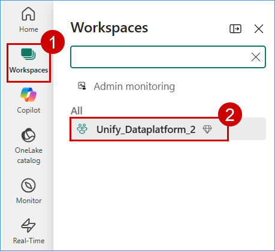

2. **Filter** for the **KQL Database** and Open 'Contoso-KQL-DB.'.

	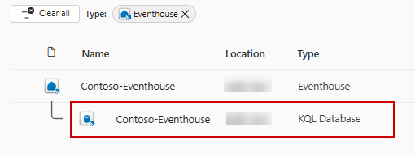

3. **click** on 'Get data' and then **click** 'Event Hubs'.

    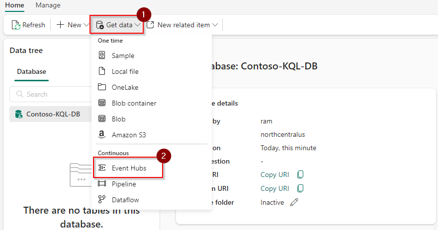

4. In Destination tab **select** 'New table' and provide the name as 'thermostat'and then **click** 'Next:Source' button.

    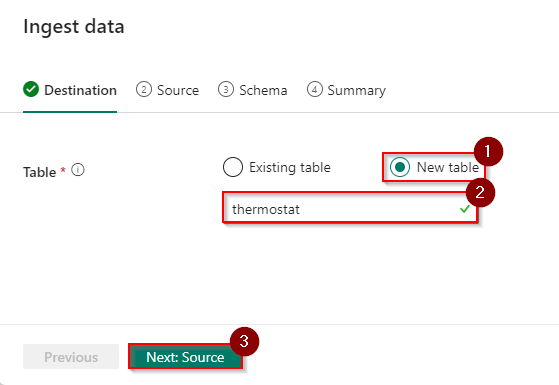

5. In the Source tab **select** the source type as 'Event Hub' and **select** 'create new connection'

	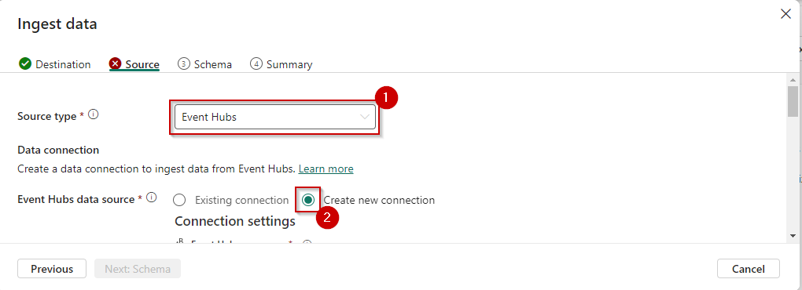

	>**Note:** For the rest of the details we will get the data from the resource group.

6. In a new tab **open** the resource group created in [Task 2](#task-2-run-the-cloud-shell-to-provision-the-demo-resources).

7. **Search** for 'Event Hub namespace' and **copy** the name of Event Hub namespace and **paste** it in a notepad for further use.

	  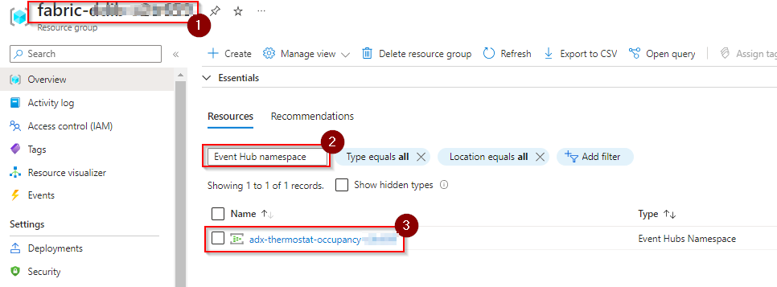

8. **Click** the 'Event Hubs Namespace' under overview **scrolldown** at bottom and **copy** the name of Event Hub and **paste** it in a notepad for further use.

	 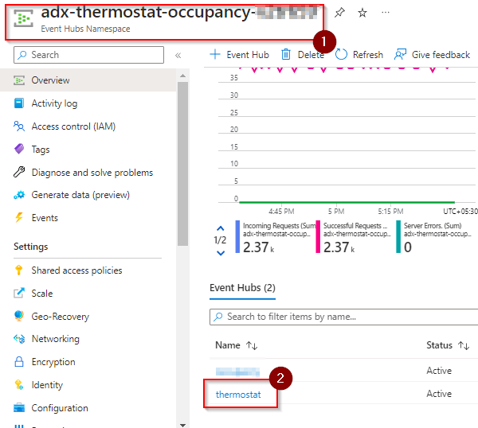	

9. To get the shared access key & shared access key name,**click** Event Hubs Instance 'thermostat'. Then **click** 'Shared access policies' in the left pane. **Click** on shared access key name 'thermostat' to open the shared access key tab in right pane. 
**Copy** the primary key and **paste** it in a notepad for further use. 

   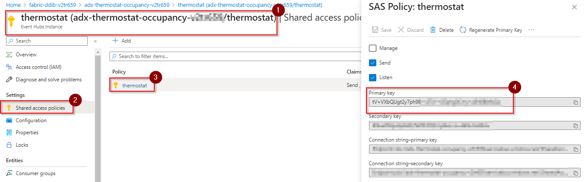

10. **Navigate back** to the PowerBI tab.

11. Make sure you are in the 'Create new connection' section. **Select** 'Authentication kind' as 'Shared Access Key' and then in the connection setting **paste** the value copied in step 9,10,11 and **click** 'Save' button.

    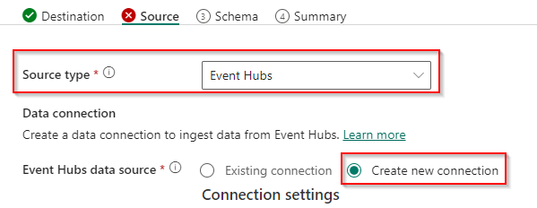
    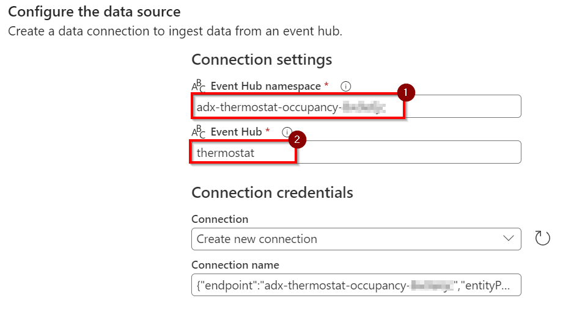
    

12. Upon clicking on 'Save', the below disabled fields 'Data connection name' & 'Consumer group' will be enabled. Keeping its value as default, **click** 'Next: Schema' button.

    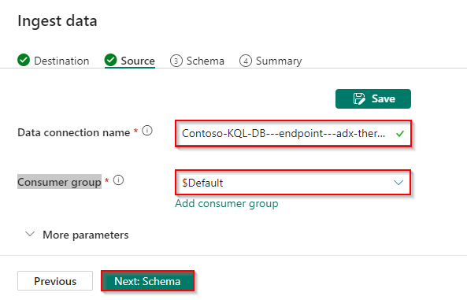

13. On Schema tab, **select** the Data format as JSON and **click** Next:Summary button.

    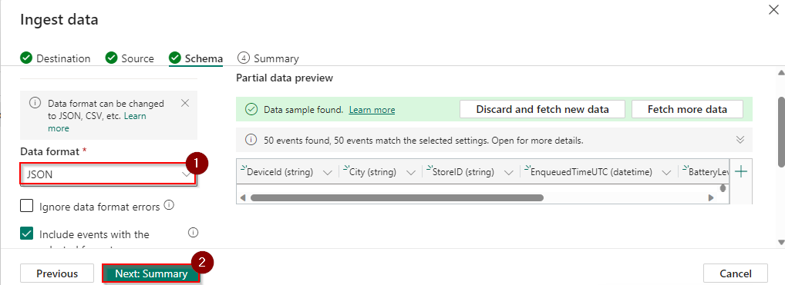

14. Once **click** Summary button, it will show the message as 'Continuous ingestion from Event Hubs established'. **Click** 'Close' button.

    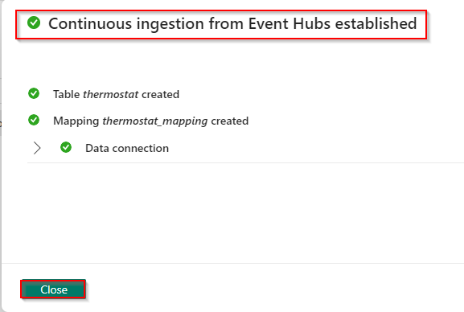

15. To verify the data tree **expand** the thermostat table, check the size and the table details.

    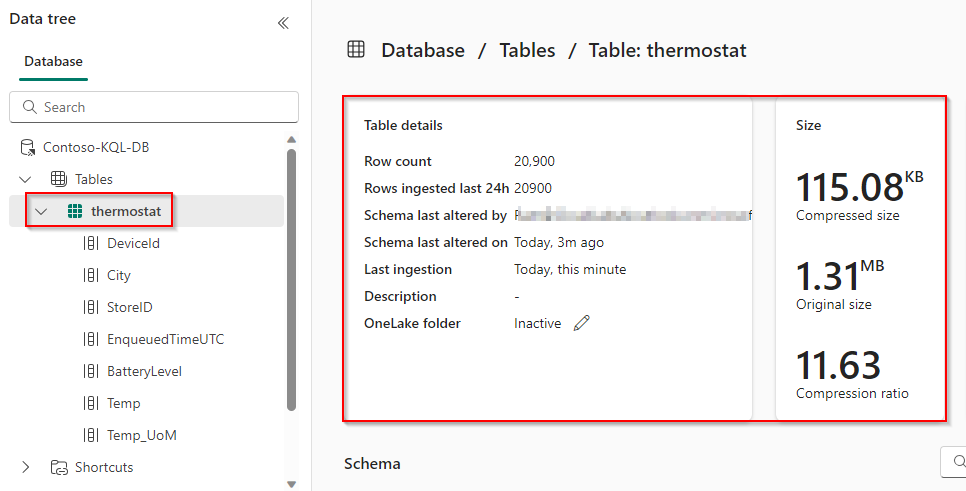

16. **Click** 'Contoso-KQL-DB' and  **wait** for sometime to load the data. **Check** the table size.

	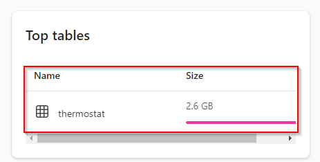

17. Once you see the table size is increased then, **click** 'Check your data' button. 

	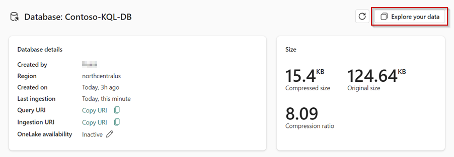

18. It will open the KQL queryset editor. **Click** link [KQL Queryset Scripts](https://github.com/microsoft/Azure-Analytics-and-AI-Engagement/tree/microsoftfabric/fabric/artifacts/kqlscripts). **Copy** and **paste** the script in the editor and **click** 'Run' button.

	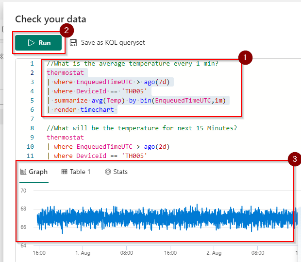

19. To create a Query Set **go to** current Workspace, **click** '+ New' and **click** 'Show all' button.

	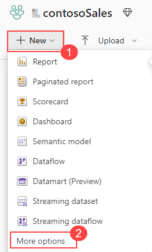

20. In the new window, **scroll down** to 'Real-Time Analytics' section and **click** 'KQL Queryset (Preview)'.

	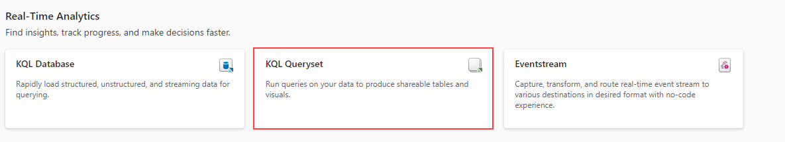

21. **Enter** the name as "01 Query Thermostat Data in Near 'Real-Time' using KQL Script", **click** 'Create' button and **wait** for the Queryset to get created.

	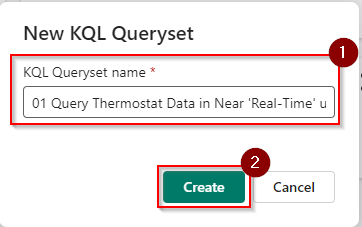

22. **Select** the database 'Contoso-KQL-DB' and **click** 'Select' button.

	

23. Now this will open the Queryset editor. **Copy** the queries from step 20 and **paste** it to queryset editor. **Select** the query and **click** 'Run' button.

	

### Appendix

This section is optional and created to showcase other data ingestion options. Use it as a refrence if you have your own Dataverse and Snowflake connections.

### Setting up the Lakehouse

1. To **Open** Power BI in a new tab, click [HERE](https://app.powerbi.com/)

2. **Sign in**, to Power BI using your Power BI with Fabric License account.

	

	> **Note:** Use the same credentials for Power BI which you will be using for the Azure account.

3. In Power BI service **Click** 'Workspaces' and **select** 'contosoSales'

    

4. **Click** '+ New' and then **select** 'Show all'.

    

5. In the new window **click** 'Lakehouse(Preview)'.

    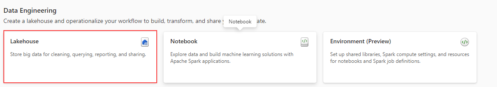

6. **Enter** the name as 'lakehouseBronze' and **click** 'Create' button.

    

7. **Wait** for the lakehouse to create, **click** the three dots(Ellipsis) in front of the 'Files' and **select** 'New shortcut'

    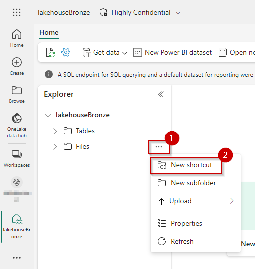

8. In the pop-up window, under External sources **select** 'Azure Data Lake Storage Gen2'

	

>**Note:** To fill in the required fields in the pop-up screen you need to fetch it from the storage account resource. Follow the below steps to get those data.

9. In a new tab,**open** the resource group created in Task 2, which you noted while script execution with name starting with 'fabric-dpoc-'.

10. **Search** for 'storage account', **click** the storage account resource.

	

11. In the Storage account window **scroll down** the left pane, in the 'Security + networking' section, **click** 'Access keys' and **click** 'Show' button under key1.

	

12. **Click** 'Copy to clickboard' button and **paste** it in notepad for further use.

	

13. Again **scroll down** in the left pane, **select** Settings >> 'Endpoints' section. **Copy** the 'Primary endpoint' under 'Data Lake Storage' section, and **paste** it in notepad for further use.

	

14. **Go back** the powerbi workspace, under 'URL' **paste** the endpoint copied in step number 13.

15. In the 'Authentiation kind' dropdown **select** 'Account Key'.

16. **Paste** the account key copied in step number 12.

17. **Click** 'Next'.

	

18. Under Shortcut Name **type** 'BlobToLakehouse'.

19. Verify the URL.

20. Under Sub Path **type** '/bronzelakehousefiles'.

21. **Click** the **Create** button.

	

### Creating Pipelines and Dataflows

1. While you are in the 'contosoSales' workspace **click** '+ New' button and **select** 'Show all'.

	

2. Under Data Factory section, **select** 'Dataflow Gen2 (Preview).

	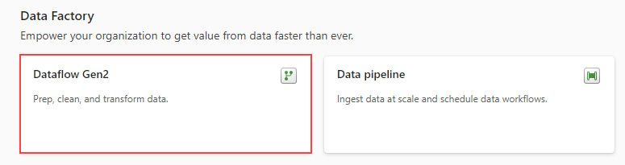

3. In the dataflow window, **click** the default dataflow name 'Dataflow 1' and in the Name field **type** '04 Customer Insights Data from Dataverse' finally **click** somewhere outside the rename box to update the dataflow name.

	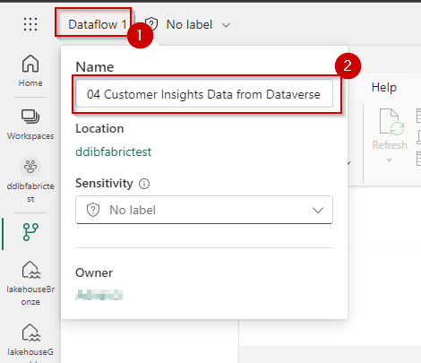

4. **Click** 'Get data' and **click** 'More...'.

	

5. **Click** 'Dataverse'.

	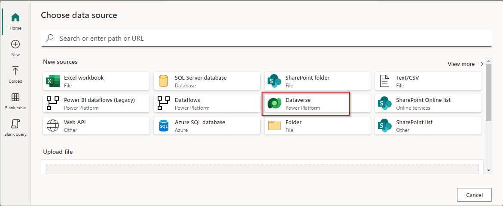

6. **Enter** the Dynamics 365 credentials if available and then **click** 'Next' button.

	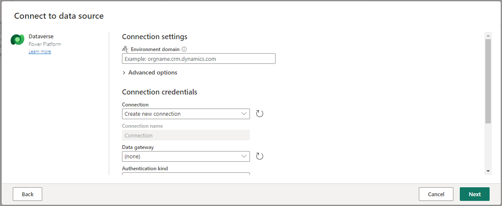

7. **Go back** to the workspace, **click** '+ New' and **click** 'Show all'.

	

8. Under Data Factory section, **select** 'Data pipeline (Preview).

	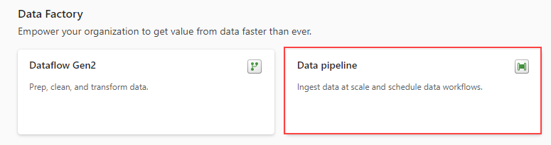

9. **Type** the name as '03 Customer Insights Dataflow trigger from Data' and **click** 'Create'.

	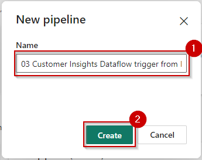

10. Wait for the pipeline to create, **click** 'Add pipeline activity' and **click** 'Dataflow'.

	

11. **Click** the new dataflow activity, in General tab **type** the name as 'Customer Insights Data to Lakehouse'.

	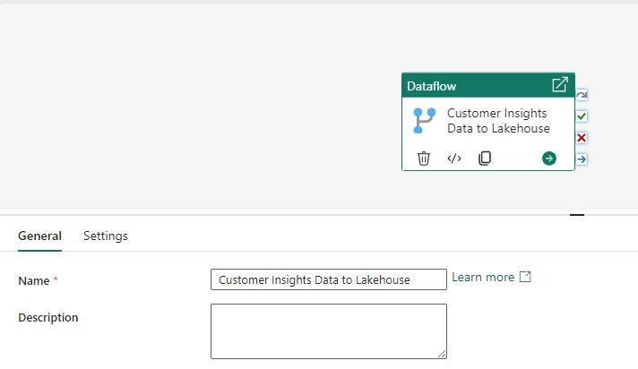

12. In the Settings tab **attach** it to the dataflow created in the earlier steps.

	

13. Similarly **create** another pipeline with the name "01 Campaigns data from Snowflake to Lakehouse - Low Code Experience"

14. Once the pipeline is created **click** on 'Lookup'. 

	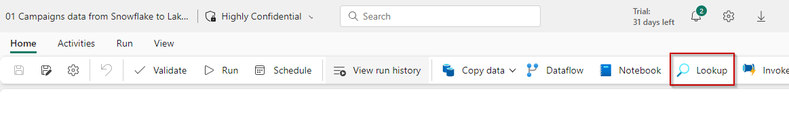

15. In 'General' tab of the Lookup activity **enter** 'Name' as "Check if Snowflake Campaign Data exist" and 'Description' as "GetMetadata activity is used to ensure the source dataset is ready for downstream consumption, before triggering the copy and analytics job."

	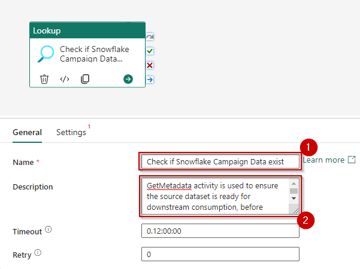

16. In the 'Settings' tab **select** the External radio button, and **click** 'New'.

	

17. In the 'New connection' pop-up window, **scroll down** to **select** 'Snowflake' and **click** 'Continue'.

	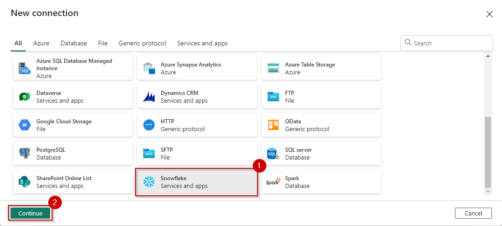

18. **Enter** your Server, Warehouse, Username, and Password for Snowflake if available.

	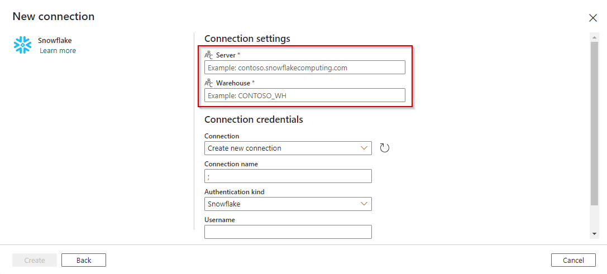	

	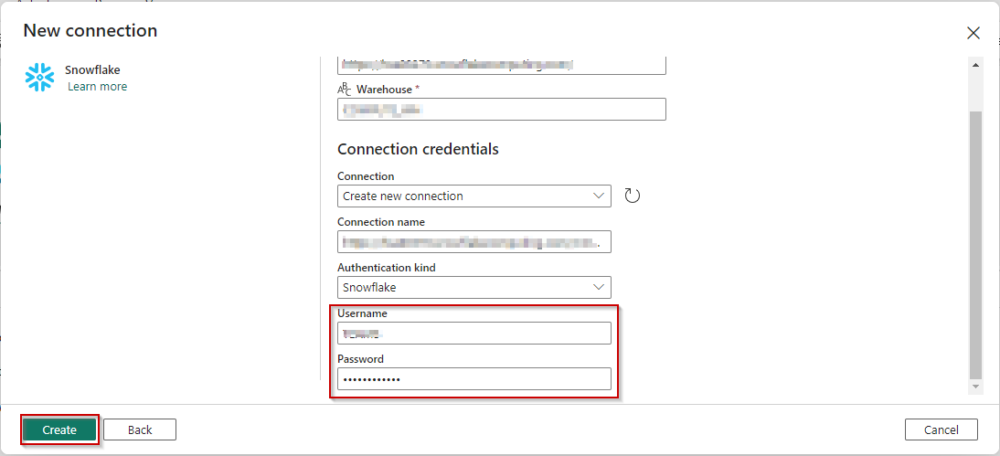	

19. Once your connection setup is done, **enter** the details as shown.

		

20. **Click** 'Copy data activity' and **select** 'Add to canvas'.

	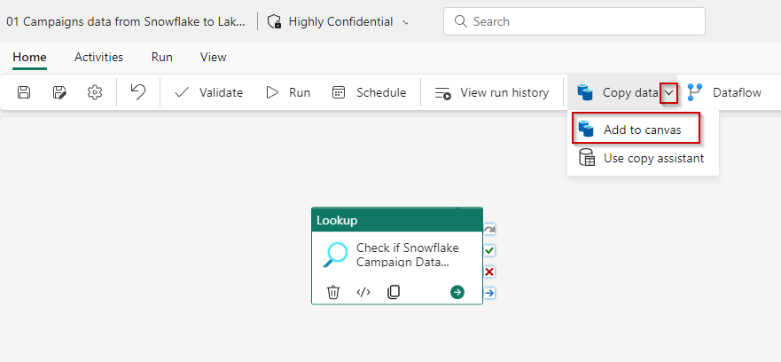	

21. In the 'General' tab **enter** 'Name' as 'SnowflakeDB To Lakehouse'.

		

22. **Enter** the values in the 'Source' tab.

	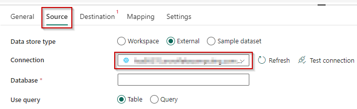	

23. **Enter** the values in the 'Destination' tab.

	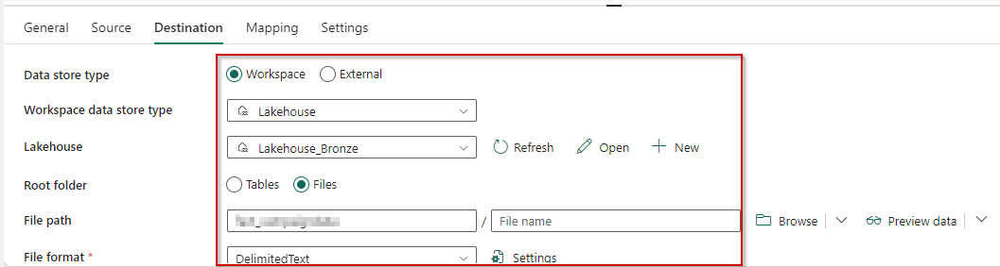	

24. **Click** the 'green tick' on the Lookup and drag it to Copy data as shown in the screenshot.

	

### Creating a Resource Group

1. **Log into** the [Azure Portal](https://portal.azure.com) using your Azure credentials.

2. On the Azure Portal home screen, **select** the '+ Create a resource' tile.

	

3. In the Search the Marketplace text box, **type** "Resource Group" and **press** the Enter key.

	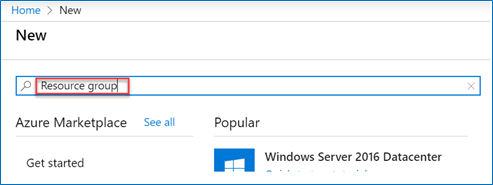

4. **Select** the 'Create' button on the 'Resource Group' overview page.

	
	
5. On the 'Create a resource group' screen, **select** your desired Subscription. For Resource group, **type** 'cloudshell-dpoc'. 

6. **Select** your desired region.

	> **Note:** Some services behave differently in different regions and may break some part of the setup. Choosing one of the following regions is preferable: 		westus2, eastus2, northcentralus, northeurope, southeastasia, australliaeast, centralindia, uksouth, japaneast.

7. **Click** the 'Review + Create' button.

	

8. **Click** the 'Create' button once all entries have been validated.

	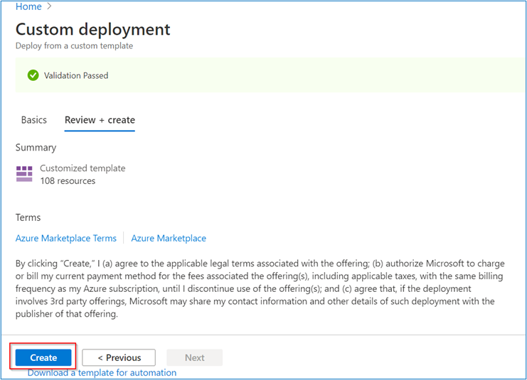


# Copyright

© 2023 Microsoft Corporation. All rights reserved.   

By using this demo/lab, you agree to the following terms: 

The technology/functionality described in this demo/lab is provided by Microsoft Corporation for purposes of obtaining your feedback and to provide you with a learning experience. You may only use the demo/lab to evaluate such technology features and functionality and provide feedback to Microsoft.  You may not use it for any other purpose. You may not modify, copy, distribute, transmit, display, perform, reproduce, publish, license, create derivative works from, transfer, or sell this demo/lab or any portion thereof. 

COPYING OR REPRODUCTION OF THE DEMO/LAB (OR ANY PORTION OF IT) TO ANY OTHER SERVER OR LOCATION FOR FURTHER REPRODUCTION OR REDISTRIBUTION IS EXPRESSLY PROHIBITED. 

THIS DEMO/LAB PROVIDES CERTAIN SOFTWARE TECHNOLOGY/PRODUCT FEATURES AND FUNCTIONALITY, INCLUDING POTENTIAL NEW FEATURES AND CONCEPTS, IN A SIMULATED ENVIRONMENT WITHOUT COMPLEX SET-UP OR INSTALLATION FOR THE PURPOSE DESCRIBED ABOVE. THE TECHNOLOGY/CONCEPTS REPRESENTED IN THIS DEMO/LAB MAY NOT REPRESENT FULL FEATURE FUNCTIONALITY AND MAY NOT WORK THE WAY A FINAL VERSION MAY WORK. WE ALSO MAY NOT RELEASE A FINAL VERSION OF SUCH FEATURES OR CONCEPTS.  YOUR EXPERIENCE WITH USING SUCH FEATURES AND FUNCITONALITY IN A PHYSICAL ENVIRONMENT MAY ALSO BE DIFFERENT.
