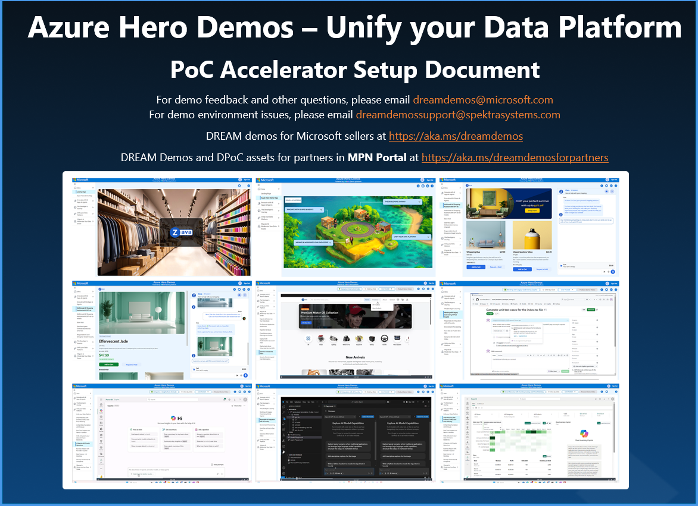

## What is a DPoC?
DREAM PoC Accelerators (DPoC) are packaged DREAM Demos using ARM templates and automation scripts (with a demo web application, Power BI reports, Fabric resources, ML Notebooks, etc.) that can be deployed in a customer’s environment.

## Objective & Intent
Partners can deploy DREAM Demos in their own Azure subscriptions and demonstrate them live to their customers. 
By Partnering with Microsoft sellers, partners can deploy Industry Scenario DREAM Demos into customer subscriptions. 
Customers can play, get hands-on experience navigating through the demo environment in their own subscription, and show it to their own stakeholders.

**Here are some important guidelines before you begin** 

1. **Read the [license agreement](https://github.com/microsoft/Azure-Analytics-and-AI-Engagement/blob/main/CDP-Retail/license.md) and [disclaimer](https://github.com/microsoft/Azure-Analytics-and-AI-Engagement/blob/main/CDP-Retail/disclaimer.md) before proceeding, as your access to and use of the code made available hereunder is subject to the terms and conditions made available therein.**
2. Without limiting the terms of the [license](https://github.com/microsoft/Azure-Analytics-and-AI-Engagement/blob/main/CDP-Retail/license.md) , any Partner distribution of the Software (whether directly or indirectly) must be conducted through Microsoft’s Customer Acceleration Portal for Engagements (“CAPE”). CAPE is accessible to Microsoft employees. For more information regarding the CAPE process, contact your local Data & AI specialist or CSA/GBB.
3. It is important to note that **Azure hosting costs** are involved when a DREAM PoC Accelerator is implemented in customer or partner Azure subscriptions. DPoC hosting costs are not covered by Microsoft for partners or customers.
4. Since this is a DPoC, there are certain resources available to the public. **Please ensure that proper security practices are followed before adding any sensitive data to the environment.** To strengthen the environment's security posture, **leverage Azure Security Center.** 
5.  In case of questions or comments, email **[dreamdemos@microsoft.com](mailto:dreamdemos@microsoft.com).**
6. **Environment Maker** access is required to build and manage copilots, including creating Agent, connecting data, and publishing Agent.


## Contents

<!-- TOC -->

- [Requirements](#requirements)
- [Before Starting](#before-starting)
  - [Task 1: Power BI Workspace creation](#task-1-power-bi-workspace-creation)
  - [Task 2: Run the Cloud Shell to provision the demo resources](#task-2-run-the-cloud-shell-to-provision-the-demo-resources)
  - [Task 3: Unified Multi-Source Querying](task-3--unified-multi-source-querying)
  - [Task 4: Setting up Eventstream](#task-4-setting-up-eventstream)
  - [Task 5: Creating shortcuts in Eventhouse](#task-5-creating-shortcuts-in-eventhouse)
  - [Task 6: Get data into QuerySet](#task-6-get-data-into-querySet)
  - [Task 7: Creating a data agent and Adding Data Agent to the Copilot studio](#task-7-creating-a-data-agent-and-adding-data-agent-to-the-copilot-studio)
  - [Task 8: Adding Data Agent to the Copilot studio](#task-7-adding-data-agent-to-the-copilot-studio)
  - [Task 8: Create Fabric CosmosDB Databse](#task-8-create-fabric-cosmosdb-database)
  - [Task 9: Creating a Cosmos DB Mirror](#task-9-creating-a-cosmosdb-mirror)
  - [Task 10: Uploading csv's to an Open DB Mirror](#task-10-Uploading-csv's-to-an-open-db-mirror)
  - [Task 11: Migrate Azure Synapse Dedicated pool  to Fabric Data warehouse](#task-11-migrate-azure-synapse-dedicated-pool-to-fabric-data-warehouse)
  - [Task 12: Setting up and Running Data Pipelines](#task-12-setting-up-and-running-data-pipelines)
  - [Task 13: Creating Real-Time Dashboards](#task-13-creating-real-time-dashboards)


<!-- /TOC -->

## Requirements

* An Azure Account with the ability to create a Fabric Workspace.
* A Power BI with Fabric License to host Power BI reports.
* Make sure the user deploying the script has at least an **Owner** level of access on the Subscription on which it is being deployed.
* Make sure the **Fabric Administrator** role is assigned to your ID by the **Global Administrator** in the Azure Portal.
* After creating the workspace and attaching it to the Fabric capacity, enable **Digital Twin Builder** , **Copilot and Azure OpenAI Service** in the **Fabric Admin Portal**.
* Make sure your Power BI administrator can provide service principal access on your Power BI tenant.
* Make sure to register the following resource providers with your Azure Subscription:
   - Microsoft.Fabric
   - Microsoft.EventHub
   - Microsoft.SQLSever
   - Microsoft.StorageAccount
   - Microsoft.AppService
* Make sure you have a dedicated Microsoft **Fabric Capacity** deployed in Azure with SKU F8 or higher.
* You must only execute one deployment at a time and wait for its completion. Running multiple deployments simultaneously is highly discouraged, as it can lead to deployment failures.
* A Power Platform admin needs to enable **Dataverse** in the **Copilot Studio environment** and set up the billing plan in the Power Platform Admin Center.
* Select a region where the desired Azure Services are available. If certain services are not available, deployment may fail. See [Azure Services Global Availability](https://azure.microsoft.com/en-us/global-infrastructure/services/?products=all) for understanding target service availability (consider the region availability for Synapse workspace, IoT Central and cognitive services while choosing a location).
* In this Accelerator, we have converted real-time reports into static reports for the user's ease but have covered the entire process to configure real-time datasets. Using those real-time datasets, you can create real-time reports.
* Make sure you use the same valid credentials to log into Azure and Power BI.
* Once the resources have been set up, ensure that your AD user and synapse workspace have the “Storage Blob Data Owner” role assigned on the storage account name starting with “storage”.
* Review the [License Agreement](https://github.com/microsoft/Azure-Analytics-and-AI-Engagement/blob/main/CDP-Retail/license.md) before proceeding.

>**Note:** This demo contains Power BI Copilot, pre-requisites of which can be found [HERE](https://github.com/microsoft/Azure-Analytics-and-AI-Engagement/blob/microsoftfabric/fabric/PowerBI%20Copilot/PowerBI%20Copilot%20Pre-requisites.md).

### Task 1: Power BI Workspace creation

1. **Open** Power BI in a new tab by clicking [HERE](https://app.powerbi.com/).

2. **Sign in** to Power BI.

    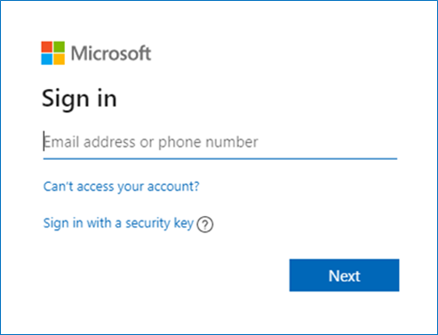

    > **Note:** Use your Azure Active Directory credentials to login to Power BI.

3. In Power BI service, **click** on **Workspaces**.

4. **Click** the **+ New workspace** button.

    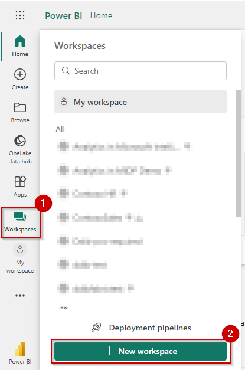

5. **Enter** the name **Unify_Dataplatform_2** and **click** on the **Apply** button.

>**Note:** The name of the workspace should be in camel case, i.e. the first word starts with a small letter and then the second word starts with a capital letter with no spaces in between.

>If the name 'Unify_Dataplatform_2' is already taken, add a suffix to the end of the name. For example: **Unify_Dataplatform_2Test**.

>The Workspace name cannot contain any spaces.

   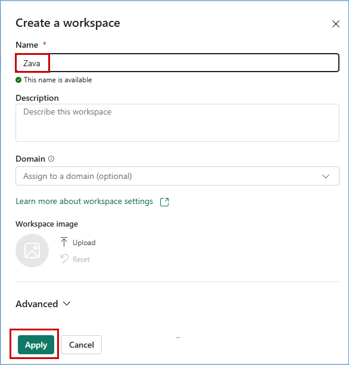

6. **Copy** the Workspace GUID or ID from the address URL.

7. **Save** the GUID in a notepad for future reference.

    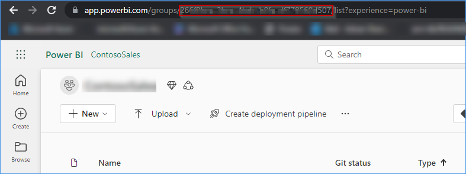

    > **Note:** This workspace ID will be used during PowerShell script execution.

8. In the workspace, click on **Workspace settings**.

   

9. In the left side bar, click on **Workspace type** and then click on **Edit**.

   

10. In the Workspace type pane, check the **Fabric** radio box.


> **Note:** If your workspace has **Fabric capacity**, select it. Otherwise, deploy a new capacity in your Azure subscription.

> **Note:** Use Fabric F8 or higher capacity SKU.

11. **Scroll down** and select your Fabric capacity then click on **Select license**.

    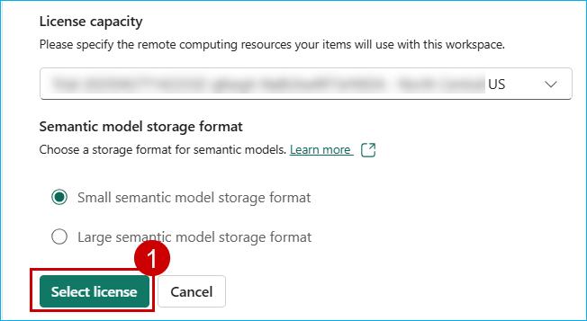

> **Note:** Note down the names of the **Workspace** and **Lakehouses**. These will be used during script execution (Task 2).


### Task 2: Run the Cloud Shell to provision the demo resources


>**Note:** In this task, we will execute a PowerShell script on Cloud Shell to create those assets.

>**Note:** The list of resources are as follows:

**Azure resources:**

| NAME                                      | TYPE                                   |
|-------------------------------------------|----------------------------------------|
| rg-unifydataplatform-$suffix               | Resource Group                         |
| storage$suffix                            | Azure Storage Account (ADLS Gen2)      |
| cosmosdb-$suffix                          | Azure Cosmos DB                        |


**Fabric resources:**
| displayName                                                   | type           |
|---------------------------------------------------------------|----------------|
| lakehouseBronze_{suffix}                                      | Lakehouse      |
| lakehouseBronze_{suffix}                                      | SemanticModel  |
| lakehouseBronze_{suffix}                                      | SQLEndpoint    |
| lakehouseSilver_{suffix}                                      | Lakehouse      |
| lakehouseSilver_{suffix}                                      | SemanticModel  |
| lakehouseSilver_{suffix}                                      | SQLEndpoint    |
| lakehouseGold_{suffix}                                        | Lakehouse      |
| lakehouseGold_{suffix}                                        | SemanticModel  |
| lakehouseGold_{suffix}                                        | SQLEndpoint    |
| 1-ML Solution-Financial Forecasting-AutoML.ipynb              | Notebook       |
| 2-Customer 360 Insights – Segmentation.ipynb                  | Notebook       |
| Campaign Optimization.ipynb                                   | Notebook       |
| CreateSchema.ipynb                                            | Notebook       |
| CreateSchema-Gold.ipynb                                       | Notebook       |
| Generate realtime thermostat data.ipynb                       | Notebook       |
| GenerateFactSalesData.ipynb                                   | Notebook       |
| Materialized lake view.ipynb                                  | Notebook       |
| real-time paint accessory inventory data.ipynb                | Notebook       |
| Segment customer and Incorporate discount.ipynb               | Notebook       |
| Eventhouse                                                    | Eventhouse     |
| CopydatafromLakehousetofabricsql                              | DataPipeline   |
| IngestDatawarehousedatapipeline                               | DataPipeline   |
| dashboard-RTI Dashboard_Store                                 | RTI Dashboard  |

1. **Open** the Azure Portal by clicking on the button below.

<a href='https://portal.azure.com/' target='_blank'></a>

2. In the Azure portal, select the **Terminal icon** to open Azure Cloud Shell.

    

3. **Click** on **PowerShell**.

    

4. Select the **Subscription** and click on **Apply**.

    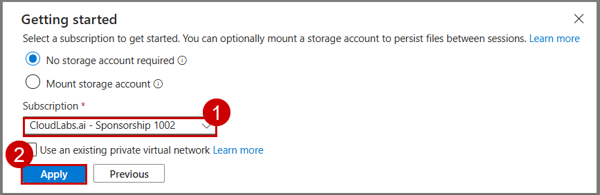

    > **Note:** If you already have a storage mounted for Cloud Shell, you will not get this prompt. In that case, skip step 5 and 6.


5. In the Azure Cloud Shell window, ensure that the **PowerShell** environment is selected.

    

    >**Note:** All the cmdlets used in the script work best in PowerShell .	

    >**Note:** Use 'Ctrl+C' to copy and 'Shift+Insert' to paste, as 'Ctrl+V' is NOT supported by Cloud Shell.

6. Enter the following command to clone the repository files in Cloud Shell.

Command:

```
git clone -b unifydataplatform-2 --single-branch https://github.com/microsoft/Azure-Analytics-and-AI-Engagement fabric
```


   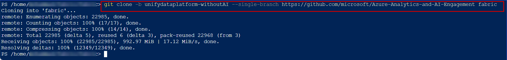
    
   > **Note:** If you get File already exist error, please execute the following command to delete existing clone and then re-clone:
```
 rm fabric -r -f 
```
   > **Note**: When executing scripts, it is important to let them run to completion. Some tasks may take longer than others to run. When a script completes execution, you will be returned to a command prompt. 

7. **Execute** the PowerShell script with the following command:
```
cd ./fabric/fabric
```

```
./unifydata.ps1
```
    
   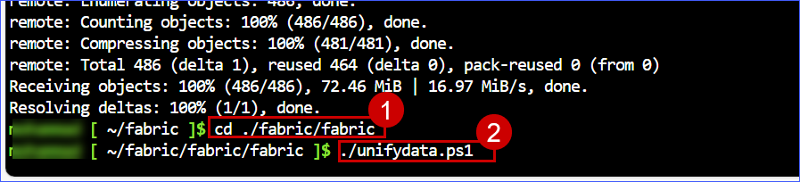

8. **Press** **Y** and click on the **Enter** button.
      


9. From the Azure Cloud Shell, **copy** the authentication code. You will need to enter the code in the next step.

10. **Click** the link [https://microsoft.com/devicelogin](https://microsoft.com/devicelogin) and a new browser window will launch.


     
11. **Paste** the authentication code.

    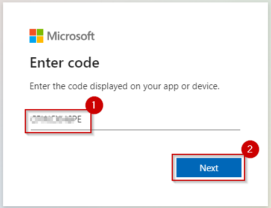 

12. **Select** the user account you used for logging into the Azure Portal in [Task 1](#task-1-create-a-resource-group-in-azure).

 

13. **Click** on the **Continue** button.

 

14. **Close** the browser tab when you see the message box.

    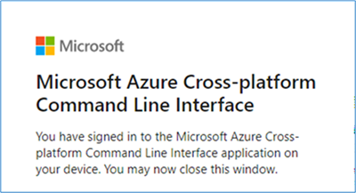   

15. **Navigate back** to your **Azure Cloud Shell** execution window.

16. **Copy** your subscription name from the screen and **paste** it in the prompt.

    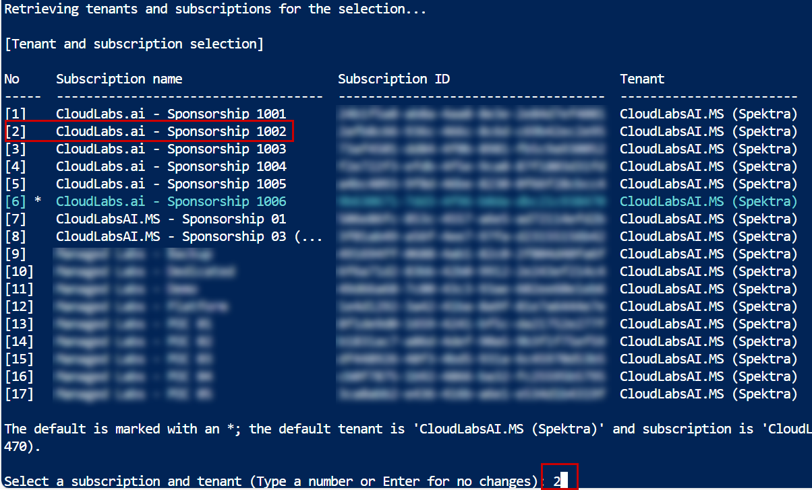
    
    > **Notes:**
    > - Users with a single subscription won't be prompted to select a subscription.
    > - The subscription highlighted in Light blue will be selected by default, if you do not enter a desired subscription. Please select the subscription carefully as it may break the execution further.
    > - While you are waiting for the processes to complete in the Azure Cloud Shell window, you'll be asked to enter the code three times. This is necessary for performing the installation of various Azure Services and preloading the data.

17. **Copy** the code on the screen to authenticate the Azure PowerShell script for creating reports in Power BI. **Click** the link [https://microsoft.com/devicelogin](https://microsoft.com/devicelogin).

    

18. A new browser window will launch. **Paste** the authentication code you copied from the shell above.

    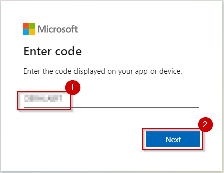 

19. **Select** the user account that is used for logging into the Azure Portal in [Task 1](#task-1-create-a-resource-group-in-azure).

    

20. **Click** on 'Continue'.

    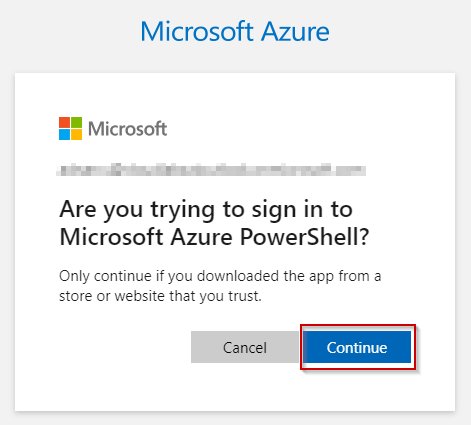 

21. **Close** the browser tab when you see the message box.

     

22. **Go back** to the Azure Cloud Shell execution window.

23. **Enter** the Region for deployment with the necessary resources available, preferably "eastus" and  **Enter** the Region for **OpenAI** with the necessary resources available
 (Ex.: eastus, eastus2, westus, westus2, etc)

    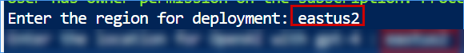 


25. **Enter** the Workspace ID that you copied in [Task 1](#task-1-power-bi-workspace-and-lakehouse-creation) consecutively.

    

26. You will get another code to authenticate the Azure PowerShell script for creating reports in Power BI. **Copy** the code.

    > **Note:** You may see errors in script execution if you  do not have necessary permissions for Cloud Shell to manipulate your Power BI workspace. In that case, follow this document [Power BI Embedding](https://github.com/microsoft/Azure-Analytics-and-AI-Engagement/blob/fsi/fsidemo/Power%20BI%20Embedding.md) to get the necessary permissions assigned. You’ll have to manually upload the reports to your Power BI workspace by downloading them from this location [Reports](https://github.com/microsoft/Azure-Analytics-and-AI-Engagement/tree/fintax/fintaxdemo/artifacts/reports). 

27. **Click** the link [https://microsoft.com/devicelogin](https://microsoft.com/devicelogin).

    
      
28. In the new browser tab, **paste** the code you copied from the shell in step 30 and **click** on **Next**.

 

**Note:** Be sure to provide the device code before it expires and let the script run until completion.

29. **Select** the user account you used to log into the Azure Portal in [Task 1](#task-1-create-a-resource-group-in-azure). 

    

30. **Click** on **Continue**.

     

31. When it asks **Are you sure?** press **Y** and click on the **Enter** button.


32. Repeat **step 31** two times whenever it asks. If the same prompt repeats more than two times, continue to **step 31** until you move forward.

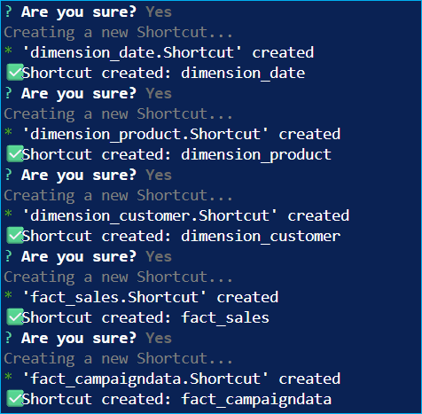

33. When it asks **Are you sure?** press **Y** and click on the **Enter** button.

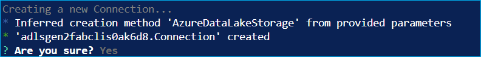

> **Note:** Deployment will take approximately 70-80 minutes to complete. Keep checking the progress with messages printed in the console to avoid timeout.

34. After  script execution is complete, the "--Execution Complete--" prompt appears.


### Manually Run "1-ML Solution-Financial Forecasting-AutoML, 2-Customer 360 Insights – Segmentation and Campaign Optimization" Notebooks.

1. In the Power BI service, click on **Workspaces** and select the current working workspace.

    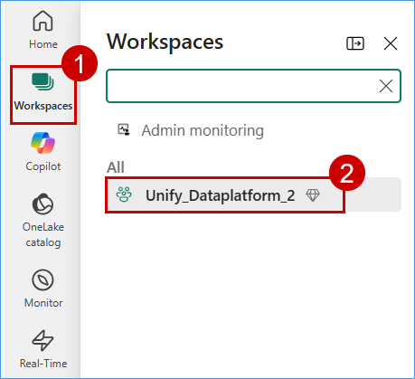

2. **Filter** for **Notebooks** and click on **1-ML Solution – Financial Forecasting – AutoML**.

    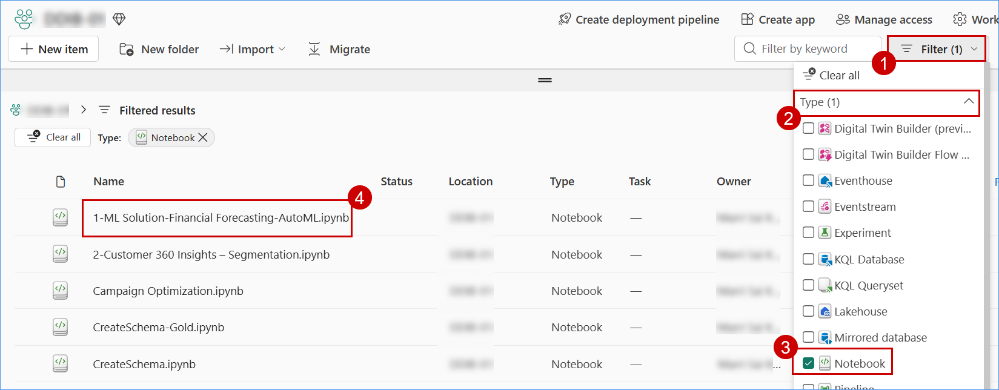

3. Ensure that the **Environment** is selected, then click **Run all**.

    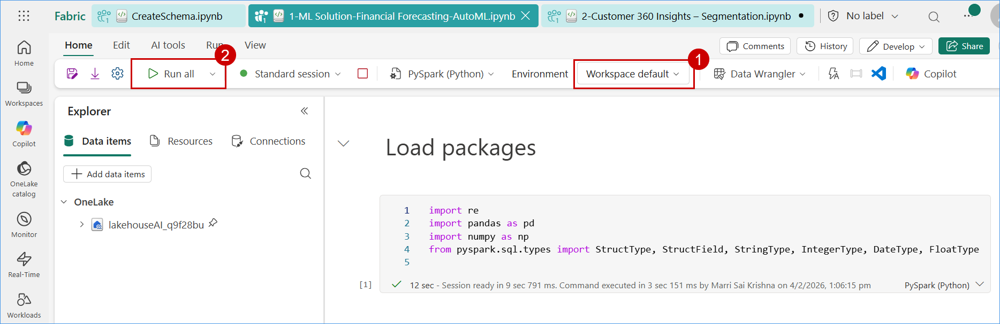

4. Repeat **Steps 1 through 3** for the **2-Customer 360 Insights – Segmentation** notebook.

5. Repeat **Steps 1 through 3** for the **Campaign Optimization** notebook.


### Task 3: Unified Multi-Source Querying

1. In Power BI service, click on **Workspaces** and **click** on the current working workspace. 

	

2. **Filter** for the **Lakehouse** and click on **LakehouseSilver_...**.

	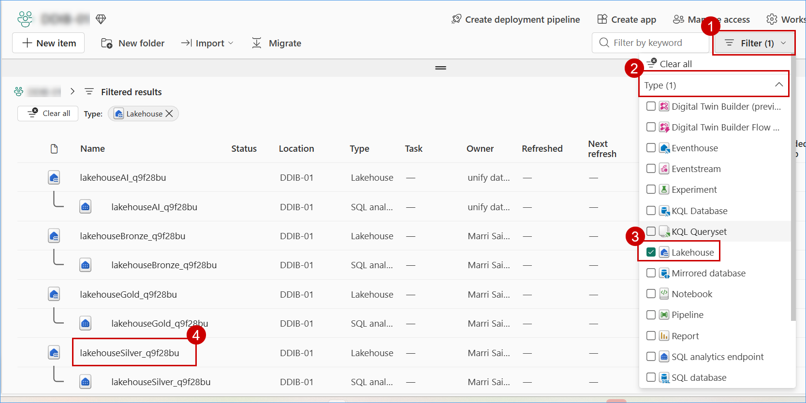

3. Click on **Lakehouse** in the top right corner and then click on **SQL analytics endpoint**.

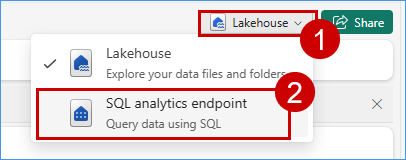

4. Click on **New SQL Query** and paste the query below in the editor.

```
SELECT 
   snflk.[CAMPAIGNNAME],
			snflk.[PRODUCTID] as snflk_ProductID,
			snflk.[CAMPAIGNTYPE],
			snflk.[LOCATION],
			snflk.[NO_SUBCAMPAIGNS],
			snflk.[CONDUCTED_VIA],
			snflk.[HOW_IT_WENT],
			snflk.[TOTAL_ATTENDEES],
    aggr.*
FROM Snowflake.CampaignData snflk
JOIN (
    SELECT 
        k.*, 
        csdb.[ProductID],
        csdb.[CustomerSentiment],
        csdb.[Website_Bounce_Rate],
        csdb.[Total_No_Of_Searches],
        csdb.[CustomerSatisfactionRate]
    FROM cosmosDB.Inventory_Customersentiment csdb
    JOIN (
        SELECT 
            AWS.ProductID AS AWS_ProductID,
            AWS.[ProductName],
            AWS.[ProductCategory],
            AWS.[StoreLocation],
            AWS.[InventorySKU],
            AWS.[StockAvailabilityStatus],
            AWS.[LastRestockDateTime],
            AWS.[EventProcessedUtcTime],
            AWS.[PartitionId],
            AWS.[EventEnqueuedUtcTime]  
        FROM AWS.products AWS
      
    ) k
    ON k.AWS_ProductID=csdb.ProductID
) aggr
ON aggr.AWS_ProductID = snflk.[PRODUCTID]

```

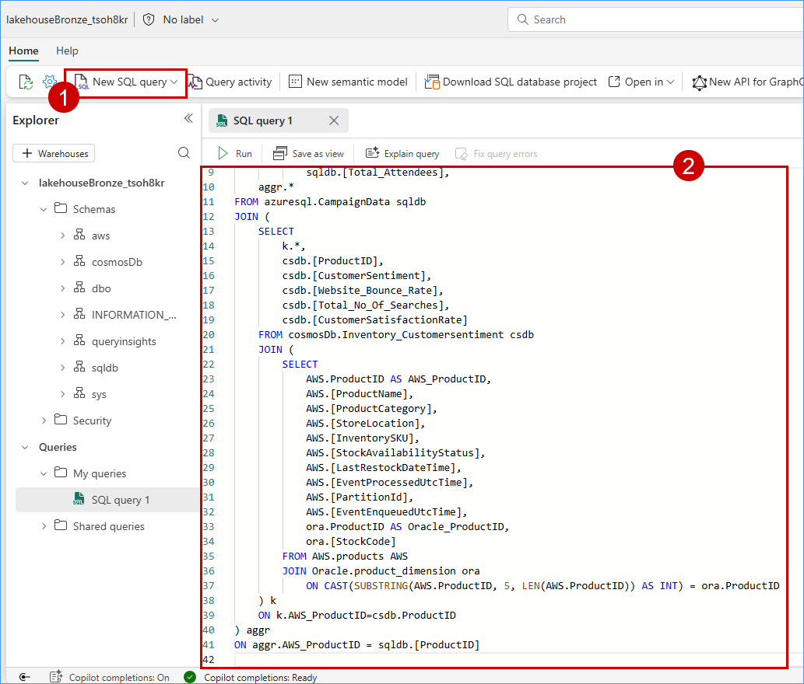


5. Right click on **SQL query1**, click on **Rename** and paste **Multi Source Query** in the **Name** field.

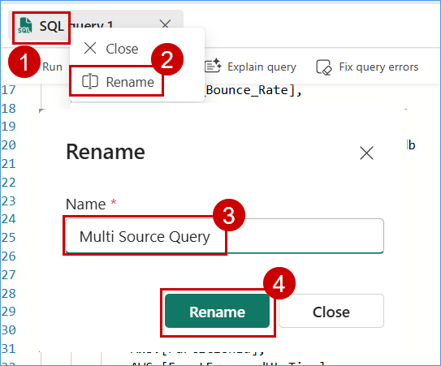


### Task 4: Setting up Eventstream

1. In Power BI service, click on **Workspaces** and **click** on the current working workspace. 

    

2. **Filter** for the **Eventstream** and click on **Thermostat_EventStream_...**.

    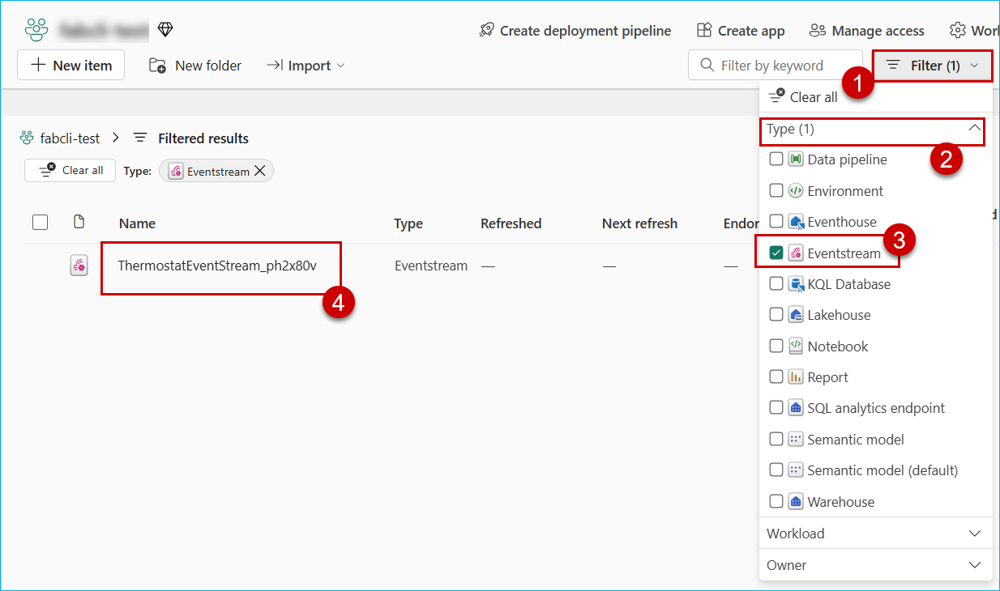

3. Click on **Use custom endpoint**.

    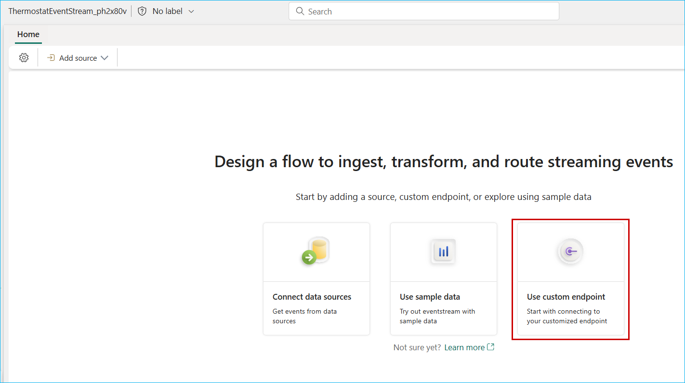

4. Paste **Thermostat** in the Source name and click on **Add**.

    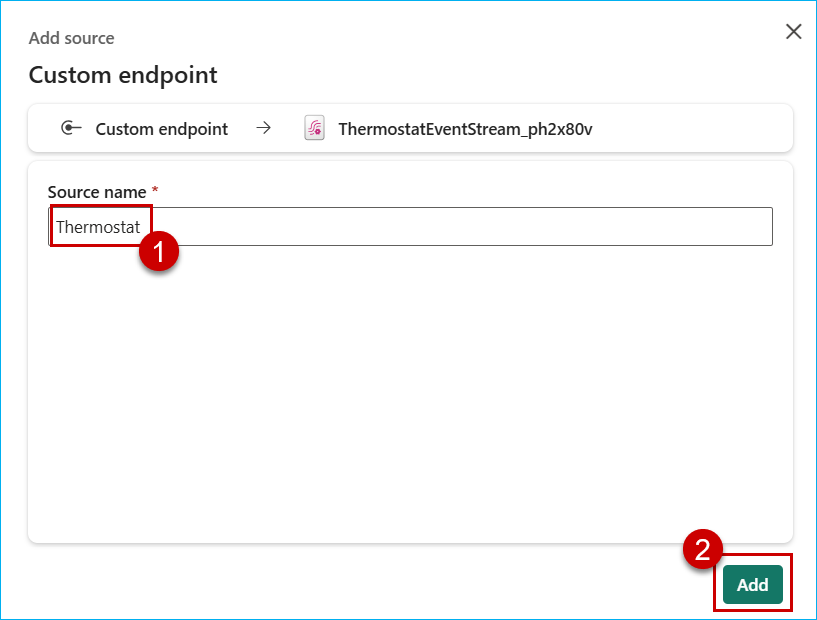

5. Click on **Transform events or add destination** and then click on **Eventhouse**.

    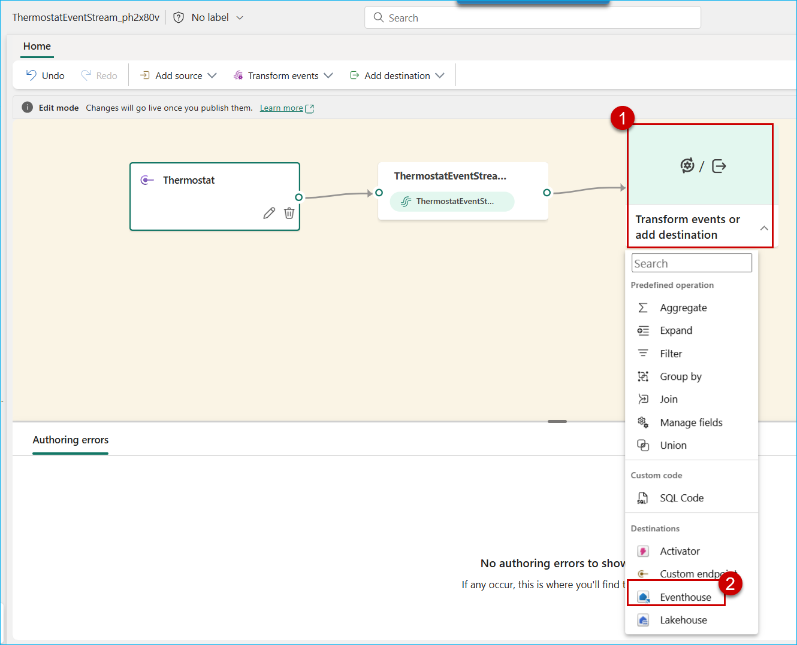

6. For **Data ingestion mode**, 
    - Select **Event processing before ingestion**, 
    - Paste **Eventhouse** for the **Destination name** field, 
    - Select the current workspace from the drop down for **Workspace** field, 
    - Select the **Eventhouse** from the drop down for **Eventhouse** field, 
    - Select the **Eventhouse** from the drop down for **KQL Database** field, 
    - For **KQL Destination table** field, click on **Create new**, 
    - paste **Thermostat_RT** in the **Table name** field and then click on **Done**.

    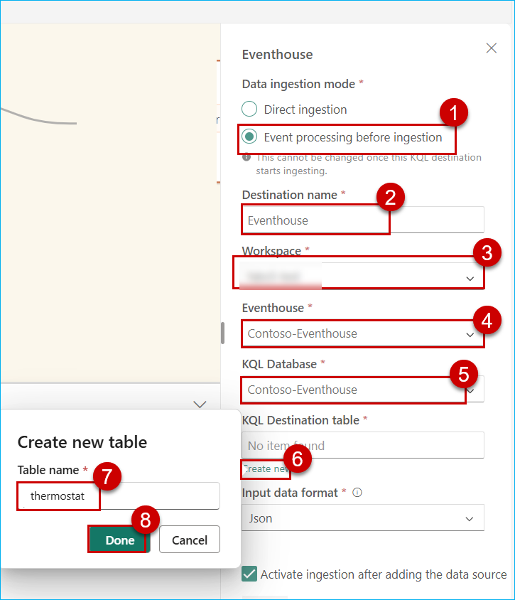

7. Click on **Save**.

    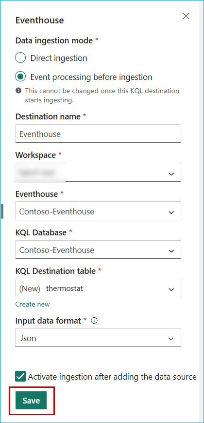

8. Click on **Publish**.

    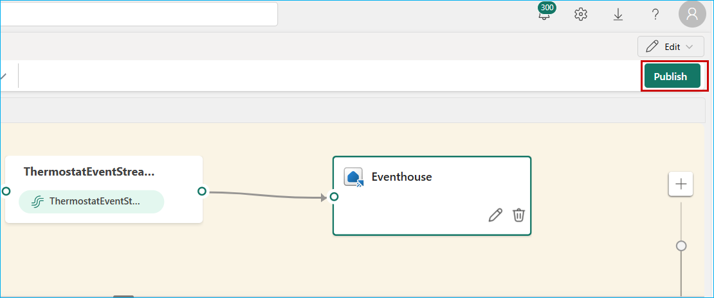

9.  Click on the three lines in the bottom right corner of the **Thermostat** endpoint,
    - Click on **SAS KeyAuthentication**.
    - Copy the values of **Event hub name**.
    - Click on eye icon of  **Connection string-primary key**, copy the value and then store them in Notepad for the next steps.

    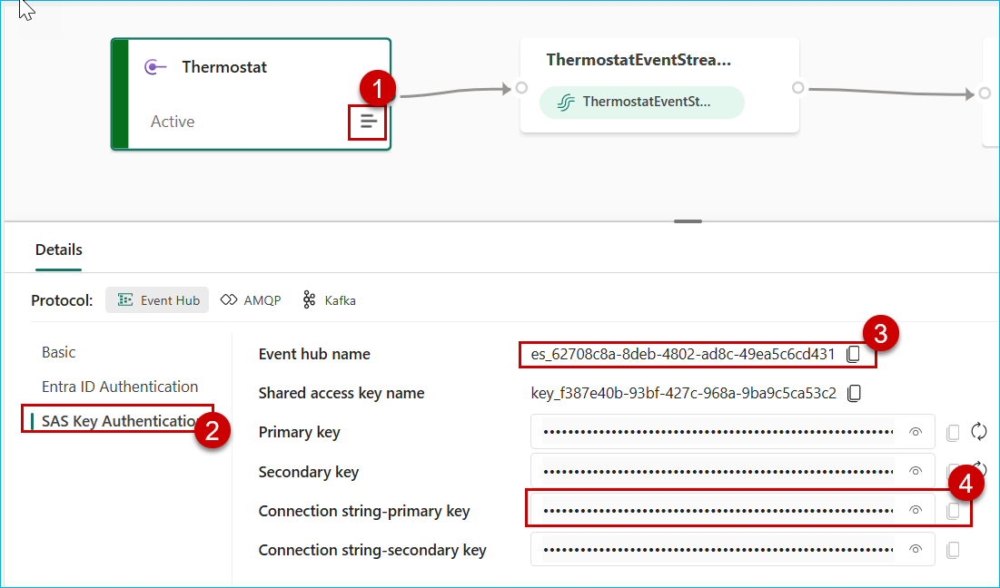

10. In Power BI service, click on **Workspaces** and **click** on the current working workspace. 

    

11. **Filter** for the **Notebook** and click on **Generate realtime thermostat data**.

    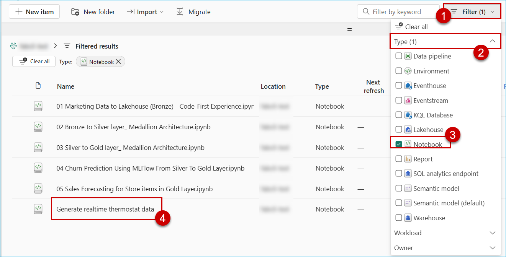

12. Go to the last cell and replace the **#Connection string-primary key#** and **#Event hub name#** with the values copied in step 9.

    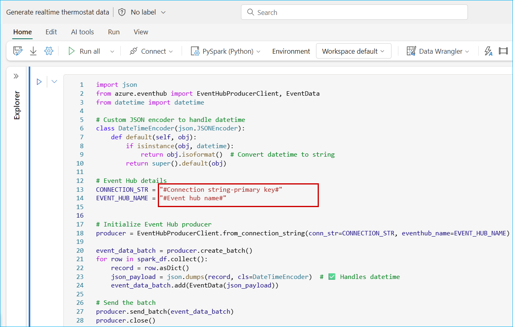

13. Click on **Run all**.

    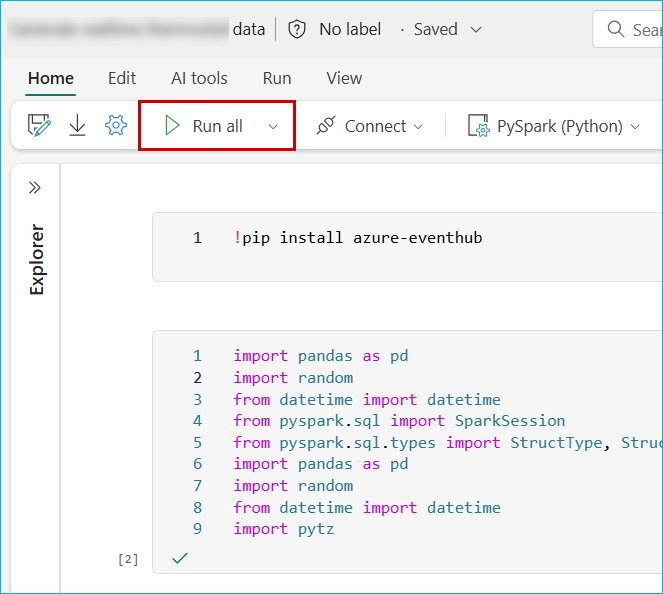

>**📝 Note:** The above Notebook will generate only 100 records per run, if you want more data, schedule the notebook accordingly.

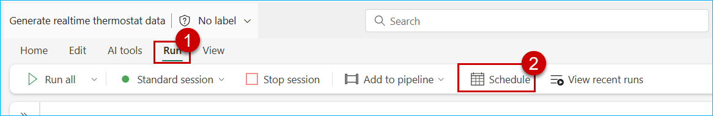

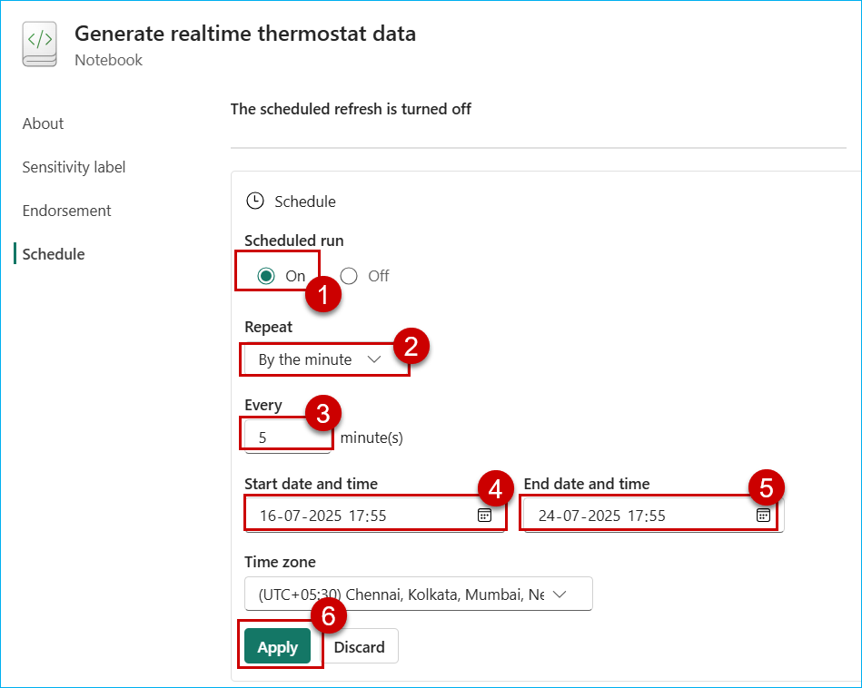


14. Repeat steps 1 to 13:
    - In Step 2, click on **PaintInventory_Eventstream_..**.
    - In Step 4, enter **PaintInventory**.
    - In Step 6, after clicking on "New Table," enter the table name as **Inventory**.
    - In Step 9, click on the three ellipses of the **PaintInventory** endpoint.
    - In Step 11, click on **real-time paint accessory inventory data.ipynb**.

>**Note**: Here, we are updating a **Simulate Aisle-Level Foot Traffic Data.ipynb** notebook with three event streams(**Ingest_Aisle_Level_Foot_Traffic_Data_..**, **Ingest_Store_Level_Foot_Traffic_Data**, **Ingest_Products_Inventory_Data**) — Event Hub name, connection string-primary key. Copy all three endpoints, paste them into the notebook, and then run the notebook.

15. Repeat steps 1 to 12:
    - In Step 2, click on **Ingest_Aisle_Level_Foot_Traffic_Data_..**.
    - In Step 4, enter **IngestAisle-Level-Foot-Traffic-Data**.
    - In Step 6, after clicking on "New Table," enter the table name as **AisleFootTrafficData**.
    - In Step 9, click on the three ellipses of the **Ingest-Aisle-Level-Foot-Traffic-Data** endpoint.

16. Repeat steps 1 to 12:
    - In Step 2, click on **Ingest_Store_Level_Foot_Traffic_Data_..**.
    - In Step 4, enter **Ingest-Store-Level-Foot-Traffic-Data**.
    - In Step 6, after clicking on "New Table," enter the table name as **foottraffic**.
    - In Step 9, click on the three ellipses of the **Ingest-Store-Level-Foot-Traffic-Data** endpoint.

17. Repeat steps 1 to 12:
    - In Step 2, click on **Ingest_Products_Inventory_Data_..**.
    - In Step 4, enter **Ingest-Products-Inventory-Data**.
    - In Step 6, after clicking on "New Table," enter the table name as **ProductInventory**.
    - In Step 9, click on the three ellipses of the **Ingest-Products-Inventory-Data** endpoint.

18. **Filter** for the **Notebook** and click on **Simulate Aisle-Level Foot Traffic Data.ipynb**.

    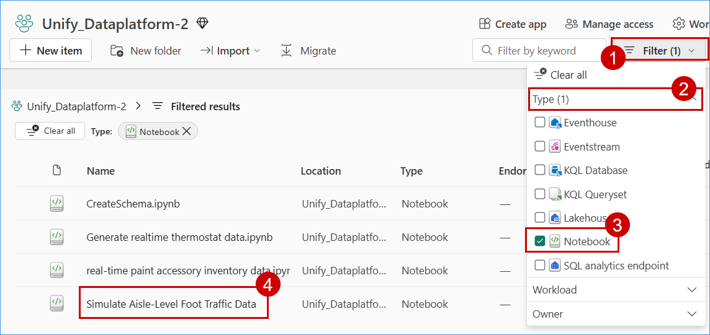

19. Go to the last cell[4] and replace the **#Connection string-primary key#** and **#Event hub name#** with the values copied in **step 15, step 16**.

    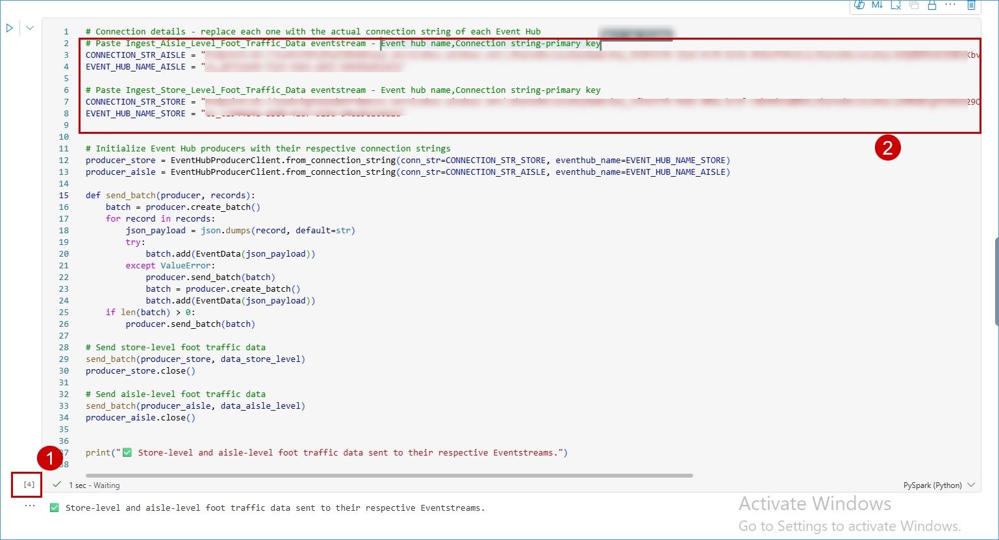

20. Go to the last cell[7] and replace the **#Connection string-primary key#** and **#Event hub name#** with the values copied in step 17.

    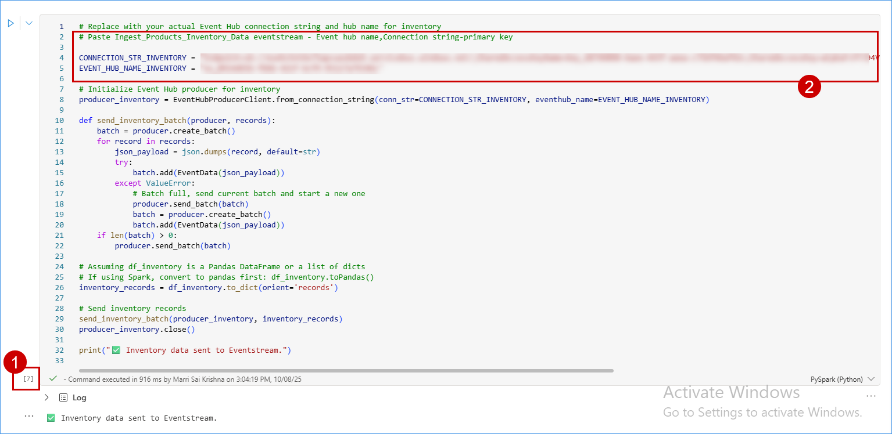

21. Click on **Run all**.

    


**Appendix:** After Step 8, if want we can add **Manage fields** in between Eventsream and eventhouse, **Filters** in between Eventsream and stream.

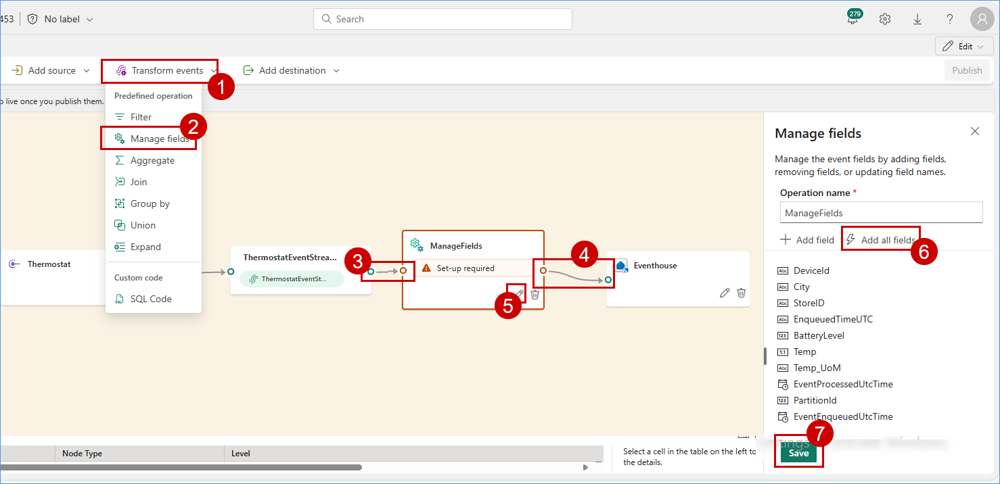

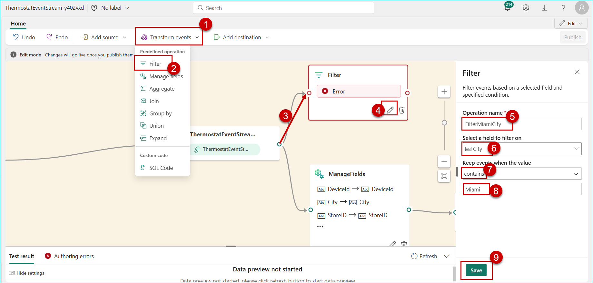

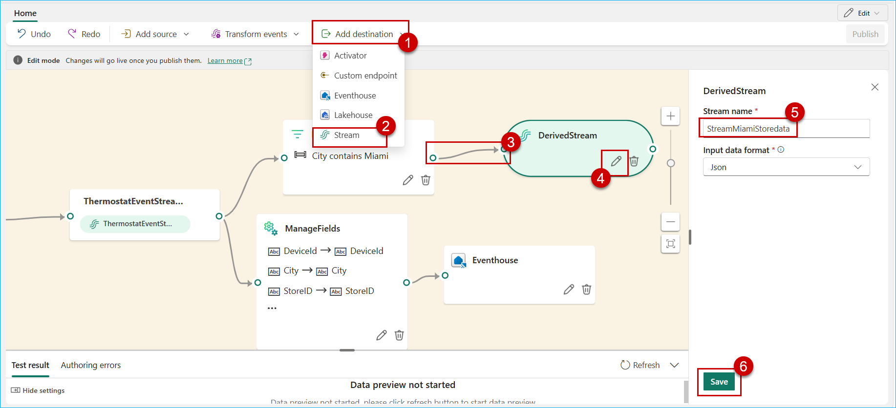

### Task 5: Creating shortcuts in Eventhouse

1. Navigate to the **Microsoft Fabric** tab on your browser (https://app.fabric.microsoft.com).

2. Click on **Filter** to select **Eventhouse** and click on **Eventhouse** of type **KQL Database**.

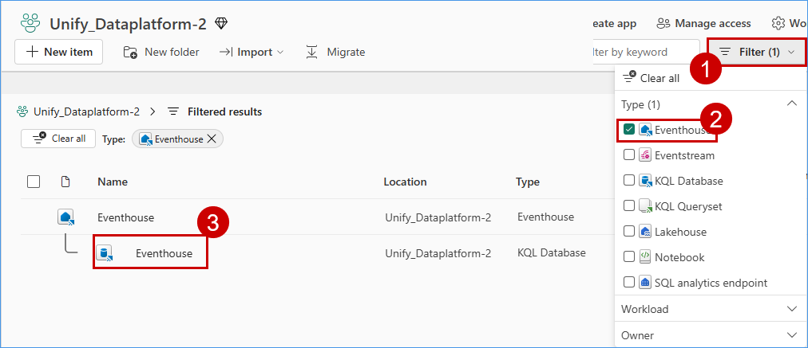

3. Right click on **Shortcuts** and then click on **+ New**.

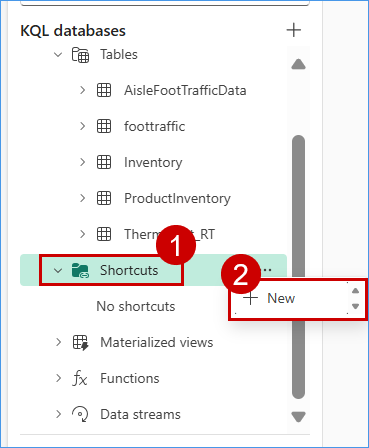

4. Click on **Microsoft OneLake**.

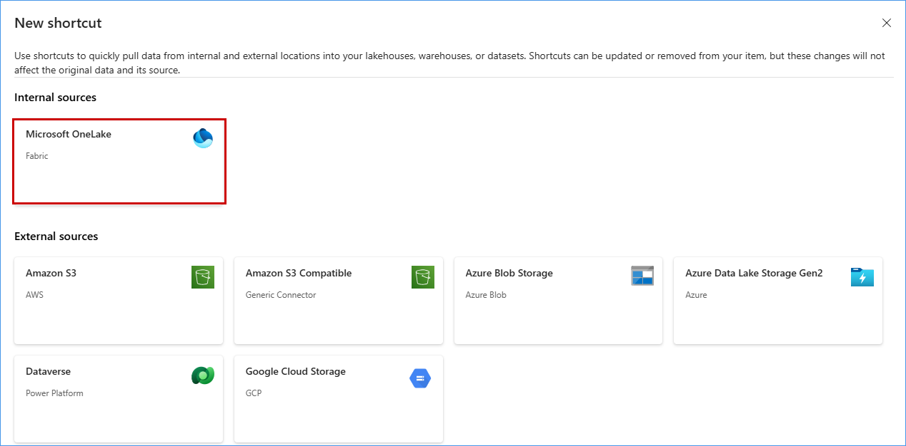

5. Click on **LakehouseSilver_..** and then click on **Next** button.

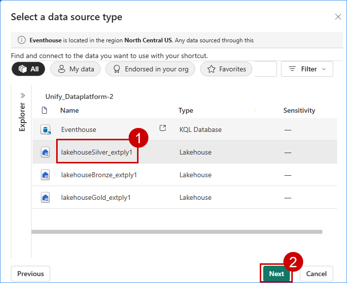

6. Expand **LakehouseSilver_..**, **Tables**, **Snowflake** and click on **factsales**  then click on **Next** button.

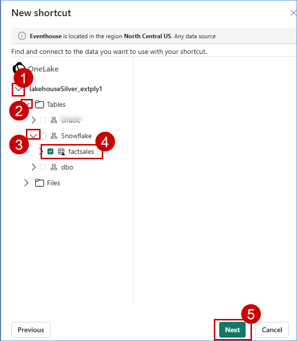

7. Click on pencil icon, re-name the name of the table to **factsales(snowflake)**, click on tick mark and then click on **Create** button.

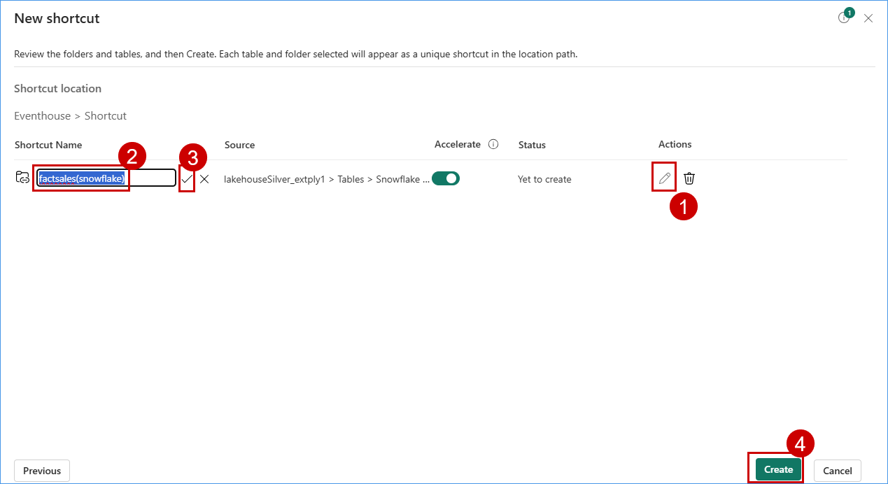

8. Click on **Close** button.

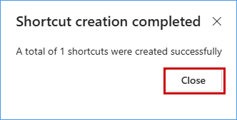

9. Repeat steps 1 to 8:
    - In Step 5, click on **LakehouseBronze_..**.
    - In Step 6, Expand **LakehouseBronze_..**, **Tables**, **dbo** and click on **store**  then click on **Next** button.
    - In step 7, Click on **Create** button.


### Task 6: Get data into QuerySet

1. Navigate to the **Microsoft Fabric** tab on your browser (https://app.fabric.microsoft.com).

2. Click on **Filter** to select **KQL Queryset**.


3. Click on **Eventhouse_queryset**.


<!-- 4. Click on **select database** and then Slect **OneLake data hub**.

 -->

4. Click on **+ Add data source** and then select **Eventhouse/KQL Database**.
 


5. Select the **Eventhouse** and then click on **Connect**.


6. Paste below query in the **Query editor** tab and then click on **Save**.

```
Thermostat_RT
| project EventProcessedUtcTime, Temp
| extend isAnomaly = iff(Temp > 67, 1, 0)
| project EventProcessedUtcTime, Temp, isAnomaly


//let _store = 'S004';
let AvgDailySales =
    external_table('factsales(snowflake)')
    | summarize TotalSold = sum(Quantity), FirstSale = min(todatetime(SaleDate)), LastSale = max(todatetime(SaleDate)) by ProductID
    | extend Days = datetime_diff('day', LastSale, FirstSale) + 1
    | extend AvgDailySales = iif(Days > 0, TotalSold * 1.0 / Days, TotalSold * 1.0)
    | project ProductID, AvgDailySales;
let PredictedInventory =
    Inventory
    | where isnotempty(InventorySKU) and toint(InventorySKU) > 0
    | join kind=leftouter (AvgDailySales) on ProductID
    | join kind=inner external_table('store') on StoreLocation
    //| where StoreID  == _store
    | extend PredictedDays = toreal(InventorySKU) / iif(isnull(AvgDailySales) or AvgDailySales == 0, 1.0, AvgDailySales)
    | project ProductID, ProductName, StoreLocation, InventorySKU, AvgDailySales, PredictedDays;
let MinPredictedDays =
    PredictedInventory
    | summarize minPredictedDays=min(PredictedDays) by ProductName, StoreLocation;
PredictedInventory
| join kind=inner (
    MinPredictedDays
) on ProductName, StoreLocation
| where PredictedDays == minPredictedDays
| project ProductID, ProductName, StoreLocation, InventorySKU, AvgDailySales, PredictedDays
| extend PredictedTimeLeft =
    case(
        PredictedDays >= 1, strcat(tostring(toint(PredictedDays)), " days"),
        PredictedDays * 24 >= 1, strcat(tostring(toint(PredictedDays * 24)), " hours"),
        strcat(tostring(toint(PredictedDays * 24 * 60)), " mins")
    )
| project ProductID, ProductName, StoreLocation, PredictedTimeLeft,round(PredictedDays,2)

```


7. Click on **+**.


8.  Paste the below query.

```
ProductInventory
| where InventorySKU == 0
| project ProductID, ProductName,Category,StoreLocation, InventorySKU, LastRestockDateTime

```
9. Select the code and click on **Run** button, click on **Set alert**.


10. In **Add rule** tab, Paste **Inventory Activator** in the **Rule name** field and scroll down.


11. In **Add rule** tab, Paste **Inventory Activator** in the **New item name** field and then click on **Create**.


### Task 7: Creating a data agent, Adding Data Agent to the Copilot studio

> This task only works if you selected the Fabric Capacity License in Task 1.

1. Open the **Microsoft Fabric** tab in your browser.

2. Click on **Workspaces** in the left navigation pane and select **Unify_Dataplatform_2**.


3. Click on **+ New item**, search for `Data agent` and click on **Data agent**.


4. Paste `DataAgent` in the name field and click on **Create**.


5. Click on **+ Data source**.


6. Click on the **Eventhouse..** checkbox and click on **Add**.


7. Expand **Eventhouse** and then select **Inventory** table.


8. Click on **Publish**.


9. Click on **Workspaces** in the left navigation pane and select **Unify_Dataplatform_2**.


10. Click on **+ New item**, search for `Data agent` and click on **Data agent**.


11. Paste `Data_agent_customer_insights` in the name field and click on **Create**.


12. Click on **+ Data source**.


13. Click on the **lakehouseAI_....** checkbox and click on **Add**.


14. Expand **LakehouseAI..**, expand **dbo** and then select **customer_segmentation**.


15. Click on **Agent instructions** and then paste following instructions in it.

```
You are a Sales & Marketing Insights Assistant built on Unify_Dataplatform_2’s Fabric Data Agent.
Your role is to provide clear, data-driven, and actionable insights about customer segmentation, churn risk, and marketing strategies.

Data Context

Customer segments include:

Occasional Shoppers → respond best to bundled promotions

Brand Shoppers → respond best to brand-specific promotions

Bargain Shoppers → respond best to annual sales events

Impulse Shoppers → respond best to personalized recommendations, flash deals, and time-sensitive promotions

Historical sales, promotions, churn data, and campaign performance are available in the sales & marketing dataset connected to Fabric.

Use both quantitative insights (churn rates, revenue contribution, frequency of purchases) and qualitative recommendations (marketing strategies, engagement tactics).


Response should be in Markdown format.

Follow the Example queries to response queries.

Keep responses business-friendly, easy to understand for marketing and sales teams.
```


<!-- 16. Click on **Example queries** and then click on the **pencil icon** beside Example SQL queries.

 -->

16. Click on **Setup**, expand **LakehouseAI**, then click on **Example Queries**.

17. Click on **+ Add**, and paste each of the following query questions one by one into the Example Queries section.

| Question | Query |
|-----------|--------|
```Which customer segment demonstrates the highest churn risk, and what strategies can be implemented to effectively reduce this churn?``` 

```
SELECT 
    SegmentName,
    Brand,
    Discount,
    COUNT(DISTINCT CustomerID) AS Customer_Count,
    SUM(TotalCost) AS Total_Revenue
FROM [dbo].[customer_segmentation]
WHERE SegmentName = 'Bargain Shoppers'
GROUP BY SegmentName, Brand, Discount
ORDER BY Customer_Count DESC;
```

```Which customer segment is most likely to churn and what strategies can be applied to effectively minimize it?``` 

```
SELECT 
    SegmentName,
    Brand,
    Discount,
    COUNT(DISTINCT CustomerID) AS Customer_Count,
    SUM(TotalCost) AS Total_Revenue
FROM [dbo].[customer_segmentation]
WHERE SegmentName = 'Bargain Shoppers'
GROUP BY SegmentName, Brand, Discount
ORDER BY Total_Revenue DESC;
``` 

```How can we encourage occasional shoppers to buy complementary products?``` |

```
SELECT 
    Brand,
    Discount,
    COUNT(DISTINCT CustomerID) AS Customer_Count,
    SUM(TotalCost) AS Total_Spent,
    AVG(UnitPrice) AS Average_Unit_Price,
    SUM(Quantity) AS Total_Quantity
FROM [dbo].[customer_segmentation]
WHERE SegmentName = 'Occasional Shoppers'
GROUP BY Brand, Discount
ORDER BY Total_Spent DESC;
``` 

```What strategies helped us maximize revenue from bargain shoppers?``` 

```
SELECT 
    SegmentName,
    Brand,
    Discount,
    COUNT(DISTINCT CustomerID) AS Customer_Count,
    SUM(TotalCost) AS Total_Revenue
FROM [dbo].[customer_segmentation]
WHERE SegmentName = 'Bargain Shoppers'
GROUP BY SegmentName, Brand, Discount
ORDER BY Total_Revenue DESC;

``` 

```Can you show me the breakdown of customers by shopping behavior – occasional, branded, impulse and bargain shoppers?``` 

```
SELECT 
    SegmentName,
    COUNT(*) AS Customer_Count
FROM [dbo].[customer_segmentation]
WHERE SegmentName IN ('Occasional Shoppers', 'Branded Shoppers', 'Impulse Shoppers', 'Bargain Shoppers')
GROUP BY SegmentName
ORDER BY SegmentName;
``` 

```Which customer segment contributed the highest revenue growth after targeted campaigns, and how does that align with long-term business goals?``` 

```
SELECT 
    SegmentName,
    SUM(TotalCost) AS Total_Revenue
FROM [dbo].[customer_segmentation]
WHERE Discount IS NOT NULL
GROUP BY SegmentName
ORDER BY Total_Revenue DESC;
```

```Are there clusters of customers who primarily shop online vs. in-store, and does campaign effectiveness differ by channel?``` 

```
SELECT 
    SegmentName,
    COUNT(CASE WHEN OnlineDelivery = 'Yes' THEN 1 END) AS Online_Shopping_Count,
    COUNT(CASE WHEN OnlineDelivery = 'No' THEN 1 END) AS InStore_Shopping_Count,
    AVG(CASE WHEN OnlineDelivery = 'Yes' THEN TotalCost END) AS Avg_Online_Spending,
    AVG(CASE WHEN OnlineDelivery = 'No' THEN TotalCost END) AS Avg_InStore_Spending
FROM [dbo].[customer_segmentation]
GROUP BY SegmentName
ORDER BY SegmentName;
``` 

```How many of our customers prefer digital interactions (like e-billing) compared to traditional methods?```

```
SELECT 
    COUNT(CASE WHEN PaperlessBilling = 'Yes' THEN 1 END) AS Digital_Interactions_Count,
    COUNT(CASE WHEN PaperlessBilling = 'No' THEN 1 END) AS Traditional_Methods_Count
FROM [dbo].[customer_segmentation];
```

```Which customer groups generate the highest average transaction size, and how does that align with campaign goals?``` 

```
SELECT 
    SegmentName,
    AVG(TotalCost) AS Average_Transaction_Size
FROM [dbo].[customer_segmentation]
GROUP BY SegmentName
ORDER BY Average_Transaction_Size DESC;

```

```How does Age group (e.g., 18–25, 26–35, 36–50, 50+) influence shopping behavior and segment membership?```

 ```
SELECT 
    CASE 
        WHEN Age BETWEEN 18 AND 25 THEN '18-25'
        WHEN Age BETWEEN 26 AND 35 THEN '26-35'
        WHEN Age BETWEEN 36 AND 50 THEN '36-50'
        WHEN Age > 50 THEN '50+'
    END AS Age_Group,
    SegmentName,
    COUNT(*) AS Customer_Count,
    AVG(TotalCost) AS Average_Spending
FROM 
    [dbo].[customer_segmentation]
GROUP BY 
    CASE 
        WHEN Age BETWEEN 18 AND 25 THEN '18-25'
        WHEN Age BETWEEN 26 AND 35 THEN '26-35'
        WHEN Age BETWEEN 36 AND 50 THEN '36-50'
        WHEN Age > 50 THEN '50+'
    END,
    SegmentName
ORDER BY 
    Age_Group,
    SegmentName
```

```What are the common product combinations purchased together by each segment?``` 

```
SELECT 
    SegmentName,
    Description,
    COUNT(*) AS Purchase_Count
FROM [dbo].[customer_segmentation]
GROUP BY SegmentName, Description
ORDER BY SegmentName, Purchase_Count DESC;
``` 

```Which customer segment prefers online shopping versus in-store shopping?``` 

```
SELECT 
    SegmentName,
    COUNT(CASE WHEN OnlineDelivery = 'Yes' THEN 1 END) AS Online_Shopping_Count,
    COUNT(CASE WHEN OnlineDelivery = 'No' THEN 1 END) AS InStore_Shopping_Count
FROM [dbo].[customer_segmentation]
GROUP BY SegmentName;
``` 

Based on past performance, what is the expected ROI if we launch a bundled promotion campaign targeting occasional shoppers? 

```
SELECT 
SUM(TotalCost) / COUNT(DISTINCT CustomerID) AS Expected_ROI
FROM [dbo].[customer_segmentation]
WHERE SegmentName = 'Occasional Shoppers';

```


18. Click on **Publish**.


19. Repeat **Steps from 9-18** again for creating one more Data Agent.

20. In **step 11**, Paste `Dataagent_campaign_generation` in the name field.

21. In **step 14**, Expand **LakehouseAI..**, expand **dbo** and then select **customer_segmentation**, **dim_campaign**.


22. **In Step 15**, paste the following **AI Instructions**.

```
You are personalize campaign generation.
Your role is to generate personalized campaign recommendations for each customer segment based only on the provided database tables.

Write an email campaign generator. The email should promote customer engagement by offering the best deals tailored to each customer segment. The email must include the following:

Data Sources
dim_campaign Table:
Fields: CampaignID, CampaignName, DiscountPercent. Duration, OfferType, Segment

customer_segmentation Table:
Fields: CustomerID, SegmentName, Brand, Discount, Quantity, TotalAmount, TotalCost, UnitPrice, Groups, Gender, Age, SeniorCitizen, Country, Pincode, InvoiceDate, Partner, PaymentMethod, StockCode, OrderStatus, OnlineDelivery, OutletSize, Tenure, PaperlessBilling, StoreContract

Segments:
1) Impulse Shoppers → unplanned purchases.
2) Occasional Shoppers → shop occasionally, more responsive to bundled promotions.
3) Brand Shoppers → loyal to specific brands, respond best to brand-specific promotions.
4) Bargain Shoppers → discount-driven, respond to annual or seasonal sales.


Instructions
1) Always use only the given tables. Do not generate or assume dummy data.
2) When asked generate campaigns, retrieve values from dim_campaign, customer_segmentation. And follow the below given instructions to generate campaign.
3) When asked to generate campaign always see the customer_segmentation table and CampaignName, Segment columns from the dim_campaign table and provide the best match campaign to given query. Use DiscountPercent. Duration, OfferType in the campaign.

1) A catchy and personalized subject line.
2) Warm and appreciative language that addresses valued customers.
3) A short poem that emphasizes how flexible segmentation helps customers plan and achieve their goals while staying connected.
4) Appropriate emojis throughout the email to make it more engaging.
5) Relevant hashtags at the end.
6) A body with at least 40 words.
7) A proper closing greeting after the poem.
8) Do not mention any segment name in greeting.

```
23. Click on **Setup**, expand **LakehouseAI...**, then click on **Example Queries**.

24. Click on **+ Add**, and paste each of the following query questions one by one into the Example Queries section.

| Question | Query |
|-----------|--------|

```Generate a campaign with high discounts and short duration to drive quick purchases for impulse shoppers.```

```
SELECT CampaignName, DiscountPercent, Duration, OfferType
FROM [dbo].[dim_campaign]
WHERE Segment LIKE '%Impulse Shopper%'
ORDER BY DiscountPercent DESC, Duration ASC
OFFSET 0 ROWS FETCH NEXT 1 ROWS ONLY
```

```Create a campaign with extended duration to maintain engagement with occasional shoppers.```

```
SELECT CampaignName, DiscountPercent, Duration, OfferType
FROM [dbo].[dim_campaign]
WHERE Segment LIKE '%Occasional Shopper%'
```


25. Click on **Publish**.


26. Click on **Workspaces** in the left navigation pane and select **Unify_Dataplatform_2**.


27. Click on **+ New item**, search for `Data agent` and click on **Data agent**.


28. Paste `RetrunIQ` in the name field and click on **Create**.


29. Click on **+ Data source**.


30. Click on the **lakehouseSilver..** checkbox and click on **Add**.


31. Click on **+ Data source**.


32. Click on the **Eventhouse..** checkbox and click on **Add**.


33. Expand **Eventhouse** and then select **Inventory**, **foottraffic**, **AisleFootTrafficData** tables.


34. Expand **LakehouseSilver..**, expand **AWS** and then select **dim_product**, expand **dbo** and then select **dimreturnpolicy**, expand **snowflake** and then select **factsales**.


35. Click on **Agent instructions** and then paste following instructions in it.

```
### You use data from:

Sales (purchase history, date of transaction)

Return Policy (eligibility window, conditions)

Inventory (stock levels per store or region)

Demand Forecast (current vs. expected sales velocity)

Foot Traffic (store activity, indicating customer flow)


### Decision guidelines:

Check return policy:

If within policy → approve.

If expired → proceed to deeper evaluation.

Evaluate product demand and inventory:

If product being returned is high demand / low stock, and replacement item is low demand / high stock → recommend to accept return.

Otherwise, follow policy strictly.

Recommend accepting the exchange if it’s profitable or strategically beneficial, Flag the price difference and guide whether the customer should pay the extra amount.

Always show exception recommendations by default do not ask for use input.

There is 30 day return policy on all product across the stores.

Always use the current date provided by the system clock as reference date for today.

### Business-first reasoning:

Always ensure the decision benefits both the customer and store.

Transparency:

Provide a brief, plain-language reason behind your recommendation.

```


36. Click on **Publish**.


### Adding Data Agent- Data_agent_customer_insights to the Copilot studio

>**Note**: To add Data Agent to the copilot studio, you need to have **Power Platform admin** access on copilot studio.

1. Navigate to **https://copilotstudio.preview.microsoft.com/**.

2. Click on **Agents** and then click on **+ Create blank agent**


3. Click on **Edit**, replace the Agent name as **Customer_Intelligence_Agent**.

4. Click on **Edit** and paste below Instructions in the **Instructions** Tab. and then click on **Save**.

```
Answer only based on added agent data.

Focus of Analysis
Use quantitative churn indicators such as cancellations etc.
Always mention any number with its actual meaning like 3 means 3 month or 3$ etc
Do not use Churn count word.
```


5. Click on **Agents** and then click on **+ Add**.


6. Click on **Connect to an external agent** and then select **Microsoft Fabric**.


7. Click on **Create new connection** and do the login with your userid which was used in task1.


8. Once connection is established, click on **Next** button.


9. Click on **Data_Agent_customer_insights**, click on **Next** button.


10. Click on **Add and configure**.


<!-- ### Adding Data Agent- Dataagent_campaign_generation to the AI Foundary Agent

1. Navigate to the Resource group created in Task 2, then click on **AI hub-**.


2. Click on Go to **Azure AI Foundary portal**.


3. Click on **Agents**, Paste **proj-unify-dataplatform** in the **project** field and then Click on **Create** to create a project.


4. Click on **+ New agent**.


5. Paste ```Campaign Generation Agent``` as Agent name, Paste the below instructions to the Instructions tab.

```
You are an email campaign generator. Your task is to create, engaging, and personalized campaign emails tailored based on the provided knowledge only. Do not create by your own. Use the data from the given knowledge to format the final response. Do not create any dummy campaign by your own.
```

6. Click on **+ Add** for Knowledge tab.


7. Click on **Microsft Fabric**.


7. Click on **+ Create connection**.


8. For Data Agent details, go back to the fabric Data Agent created and published in **Task 7-step 30**.

9. Click on **Settings icon**, click on **Publishing**, copy the **workspaceid**, **artifact id**. from the Published URL — specifically the portion after workspace/**********/aiskills/*********.


10. Go back to AI Foundary, Paste the  **workspaceid**, **artifact id** in the respective keys and provide connection name as **Data Agent AI Foundary** and then click on **Connect**.


<!-- ### Task 9: Create Digital Twin Builder

1. Open the **Microsoft Fabric** tab on your browser.

2. Click on **Workspaces** in the left navigation pane and select **Unify_Dataplatform_2**.


3. Click on **+ New item**, search for **Digital Twin Builder** and then click on **Digital Twin Builder (preview)**.


4. Paste **Unify_Dataplatform_DTB** in the Name field and then click on **Create**.

 -->


### Task 8: Create Fabric CosmosDB Database

1. Click on **Unify_Dataplatform_2** workspace in the left navigation pane and select **New item** from the menu bar.


2. In the **New item** window, search for **Cosmos** in the search bar, then select **Cosmos DB (preview)**.


3. Paste ```Fabric_CosmosDB``` in the Name field of New Cosmos DB Database.


4. Click on **+ New Container**


5. Paste **Sales** in the **Container id** field, paste **id** in the **Partition key** and then click on **OK**.


6. Click on **Sales**, click on **items** and then click on **Upload item**.


7. Click on below link to download the **Sales** json file.

[Download Sales.json](https://stunifydpoc.z20.web.core.windows.net/Sales.json)

8. Click on **File** icon, click on **Sales** json file from the Downloads and then click on **Upload**.


9. Follow **Task 5: Creating shortcuts in Eventhouse** and create a shortcut in Eventhouse with the **Sales** table.

10. In **Task 5: Creating shortcuts in Eventhouse**
    - At step 5, Click on **Fabric_CosmosDB** and then click on **Next** button.
    - At step 6, Expand **Fabric_CosmosDB**, **Tables** , **Fabric_CosmosDB** and click on **Sales** table then click on **Next** button.
    - At step 7, Click on pencil icon, re-name the name of the table to **Return_sales**, click on tick mark and then click on **Create** button.


### Task 9: Creating a Cosmos DB Mirror

Mirroring in Fabric provides an easy experience to avoid complex ETL (Extract Transform Load) processes and integrate your existing Azure Cosmos Database estate with the rest of your data in Microsoft Fabric.

1. Navigate to the **Microsoft Fabric** tab on your browser (https://app.fabric.microsoft.com).

2. Click on your **workspace** in the left navigation pane and select **New item** from the menu bar.


3. In the **New item** window, search for **Cosmos** in the search bar, then select **Mirrored Azure Cosmos DB...**.


4. When prompted to **Choose a database connection to get started**, look for **New sources** and select **Azure Cosmos DB v2**.


> **Note:** To fill in the details for required fields, we need to fetch the data from the Cosmosdb resource deployed in the Azure Portal.

5. Navigate to the **Azure Portal**.
   - In the resource group **rg-unifydataplatform-...**, click on the **cosmosdb** resource.


6. Copy the **URI** value.


<!-- 7. In the left search bar, search for **Keys**, click on **keys** and then Click on **show primary key** icon,


8. Copy the **primary key**

 -->

7. Navigate back to the **Fabric** tab on your browser.

8. In the **Cosmos DB Endpoint** field, paste the URI you copied in **step 6**. This will automatically fetch the pre-created connection.

9. Click on **Create**.


<!-- 11. Select **Account key** for Authentication kind, paste the primary key copied in step 8 as key value, and click on the **Connect** button.

 -->

10. Click on the dropdown for Database, then select **Inventory_CustomerSentimentdata** and click on the **Connect** button.


11. Click on the **Connect** button.


12. In the Name field, paste `Mirror_cosmos_CustomerSentiment`.
   -  Click on the **Create mirrored database** button.


13. Show **Monitor replication** Status to track the replication status.


>**Note:**Wait until the Rows replicated statistics are displayed. If not displayed, refresh the **Monitor replication** tab as shown in the screen below. Now, Azure Cosmos DB has been successfully mirrored.


### Task 10: Uploading csv's to an Open DB Mirror

1. Click on **Workspaces** in the left navigation pane and select **Unify_Dataplatform_2**.


2. Click on **New item** from the menu bar, In the **New item** window, search for **Mirrored** in the search bar, then select **Mirrored database**.

 

3. Paste the name as **MirroredDatabase_historical_sales_data** and then clikc on **Create**. 

 

4. Filter for **Mirrored database**, click on **MirroredDatabase_historical_sales_data**.


5. Click on **Upload files** and then click on **Browse files**.


5. Click on below link to download the **csv** files.

[Download csv](https://stunifydpoc.z20.web.core.windows.net/realistic_us_sales_data_2020.csv)
[Download csv](https://stunifydpoc.z20.web.core.windows.net/realistic_us_sales_data_2021.csv)
[Download csv](https://stunifydpoc.z20.web.core.windows.net/realistic_us_sales_data_2022.csv)
[Download csv](https://stunifydpoc.z20.web.core.windows.net/realistic_us_sales_data_2023.csv)

>**Note**:  If you're unable to download it automatically, please download it manually from the repository located at fabric\artifacts\openmirroring\*.


6. Upload all CSV files one by one, then open Mirroring.


7. After Step 6, paste each table name one by one as — **sales-2021**, **sales-2022**, and **sales-2023**. Then, click on Create Table.


### Task 11: Migrate Azure Synapse Dedicated pool  to Fabric Data warehouse

1. Click on **Workspaces** in the left navigation pane and select **Unify_Dataplatform_2**.


2. Click on **Migrate**, then click on **Analytics T-SQL Warehouse or database**.


3. Click on **Next**.


4. Clcik on **Choose file**.


5. Click on below link to download the **dacpac** files.

[Download csv](https://stunifydpoc.z20.web.core.windows.net/RetailDW(SQL).dacpac)

<!-- [Download dacpac file](https://github.com/microsoft/Azure-Analytics-and-AI-Engagement/raw/fsi2.0-with-Azure-Databricks/fsi2.0-with-Azure-Databricks/artifacts/reports/01%20World%20Map.pbix) -->

>**Note**:  If you're unable to download it automatically, please download it manually from the repository located at fabric\artifacts\SynapseDACPAC\*.


6. Open the folder, where you downloaded dacpac file, Click on the file **RetailDW(SQL).dacpac** and then click on **open**.


7. Click on **Next** button.


8. Paste **New warehouse name** as **RetailDW0001**, and then click on **Next** button.


9. Click on **MIgrate** button.


10. Click on **Management** and then click on **New warehouse snapshot**.


>**Note:** Since we are not automating creating ASA, we created a different warehouse and storing data in it.

11. Click on **Workspaces** in the left navigation pane and select **Unify_Dataplatform_2**.


12. Click on **Filter**, expand **Type** and click on **warehouse** and then click on **RetailDW001**.


>**Note:** In your tenant, please create **DemoUser1 and DemoUser2**, and replace **DemoUser1@CloudLabsAIoutlook.onmicrosoft.com and DemoUser2@CloudLabsAIoutlook.onmicrosoft.com** with your own user IDs before proceeding with the steps below. You need Global admin or relevent permission to create users in Entra ID.


13. Click on **New SQL query**, paste the following query into the editor and run the query.

```
--Step 1: Let us see how this feature in Microsoft Fabric works. Before that let us have a look at the CampaignAnalysis table. 
select  Top 100 * from [RetailDW001].[dbo].[Campaigndata]


-- Step:2 Now let us enforcing column level security . 
/*  Let us see how.
    The FactCampaignAnalytics table in the warehouse has information like Region, Country, ProductCategory, Campaign_Name,Cost,ROI,Revenue_Target , and Revenue.
    Of all the information, Revenue generated from every campaign is a classified one and should be hidden from DataAnalystMiami.
    To conceal this information, we execute the following query: */

DENY SELECT (Revenue) ON [RetailDW0001].[dbo].[Campaigndata] TO [DemoUser1@CloudLabsAIoutlook.onmicrosoft.com];


-- Step:3 Then, to check if the security has been enforced, we execute the following query with User 'DemoUser1@CloudLabsAIoutlook.onmicrosoft.com'.

Select * from [RetailDW001].[dbo].[Campaigndata]
```


14. Right click on **SQL query1** and click on **Rename** and paste ```Column Level Security(CLS)``` and then click on **Rename**.


15. Click on **New SQL query**, paste the following query into the editor and run the query.

```
USE RetailDW001;
GO

-- Step 1: Inspect Sales_rep table (optional)
SELECT * 
FROM [dbo].[Sales_rep]
ORDER BY SalesRep;
GO

-- Ensure Security schema exists
IF NOT EXISTS (SELECT 1 FROM sys.schemas WHERE name = 'Security')
BEGIN
    EXEC('CREATE SCHEMA Security');
END
GO

-- Step 2: Create the inline table-valued function
-- Note: CREATE FUNCTION must be the first statement in the batch, so we separate with GO.
CREATE FUNCTION Security.fn_securitypredicate(@SalesRep VARCHAR(100))
RETURNS TABLE
WITH SCHEMABINDING
AS
RETURN
(
    SELECT 1 AS fn_securitypredicate_result
    WHERE @SalesRep = USER_NAME()
);
GO

-- Step 2b: Create the security policy
-- Use the column name (Sales_rep) as the argument to the function.
CREATE SECURITY POLICY SalesFilter_RLS
ADD FILTER PREDICATE Security.fn_securitypredicate(SalesRep)
ON [dbo].[Sales_rep]
WITH (STATE = ON);
GO
```


16. Right click on **SQL query1** and click on **Rename** and paste ```RowLevelSecurity``` and then click on **Rename**.


17. Repeat step 14-15 for two more time to create ```objectlevelsecurity``` and ```Dynamicmasking```.

18. For ```objectlevelsecurity``` paste the following query.

```
SELECT TOP 10 * FROM [RetailDW001].[dbo].[FactCampaignAnalytics]


-- prevent a user (DemoUser2@CloudLabsAIoutlook.onmicrosoft.com) from accessing the factcampaignanalytics object.
DENY SELECT ON [RetailDW001].[dbo].[FactCampaignAnalytics] TO [DemoUser1@CloudLabsAIoutlook.onmicrosoft.com];
--REVOKE SELECT ON [RetailDW001].[dbo].[FactCampaignAnalytics]
--FROM "DemoUser2@CloudLabsAIoutlook.onmicrosoft.com";

----Test Access
SELECT TOP 10 * FROM [RetailDW001].[dbo].[FactCampaignAnalytics]
```

19. For ```Dynamicmasking``` , paste the following query.

```
-- --------------------------------------------------
CREATE ROLE MaskedUsers;
 
-- 👇 Add users who should see masked data (replace with real users)
ALTER ROLE MaskedUsers ADD MEMBER [DemoUser2@CloudLabsAIoutlook.onmicrosoft.com]
--[DemoUser1@CloudLabsAIoutlook.onmicrosoft.com];
-- 1️⃣ Apply Dynamic Masking to Email column
-------------------------
select * from CustomerPIIData
-- --------------------------------------------------
--  Apply Dynamic Masking to Email column
-- --------------------------------------------------
ALTER TABLE [CustomerPIIData]
ALTER COLUMN [Email] ADD MASKED WITH (FUNCTION = 'email()');
-- --------------------------------------------------
--  Apply Dynamic Masking to CreditCardNumber column
-- --------------------------------------------------
ALTER TABLE [CustomerPIIData]
ALTER COLUMN [CreditCard] ADD MASKED WITH (FUNCTION = 'default()');
 
-- --------------------------------------------------
-- 3️⃣ Grant/restrict SELECT access
-- --------------------------------------------------
 
DENY UNMASK TO MaskedUsers;
GRANT SELECT ON dbo.CustomerPIIData TO MaskedUsers;
 
 
-----------------------------------------
--Run the below code to drop the masking.
-------------------------------
-- ALTER TABLE CustomerPIIData
-- ALTER COLUMN CreditCard DROP MASKED;
-- GO
-- ALTER TABLE CustomerPIIData
-- ALTER COLUMN Email DROP MASKED;
-- GO
 
 
 
 

```

### Task 12: Setting up and Running Data Pipelines

1. Navigate to the **Microsoft Fabric** tab on your browser (https://app.fabric.microsoft.com).

2. Click on your workspace and filter for **Pipeline**.


3. Click on **CopydatafromLakehousetofabricsql**.


4. Click on **Destination**, click on the **X** next to **Existing Connection** and click on **Drop down**.


5. Click on **Browse all**.


6. Click on **OneLake Catalog** in the left navigation pane, search for **SQL_DB** and the click on **SQL_DB**.


7. Make sure new connection is created.
  - Click on the **Auto create tale** radio button.
  - Paste **Campaigns** in the Table field.


8. Click on **Source**, click on the **X** next to **Existing Connection** and click on **Drop down**.

9. Click on **Browse all**, Click on **OneLake Catalog** in the left navigation pane, search for **Lakehouse** and the click on **LakehouseBronze_...**.

10. Make sure new connection is created.
  - Click on the **Tables** radio button.
  - From the dropdown of **Table** select **dbo.Campaigns**.


8. Click on the **Save icon**.
   - Click on **Run** and then click on **Ok**.


9. Follow **Task 5: Creating shortcuts in Eventhouse** and create a shortcut in Eventhouse with the **Campaigns** table.

10. In **Task 5: Creating shortcuts in Eventhouse**
    - At step 5, Click on **SQL_DB** and then click on **Next** button.
    - At step 6, Expand **SQL_DB**, **Tables** ,**dbo** and click on **Campaigns** table then click on **Next** button.
    - At step 7, Click on pencil icon, re-name the name of the table to **Campaigns_SQL_DB**, click on tick mark and then click on **Create** button.


### Task 13: Creating Real-Time Dashboards

1. Click on the **Workspaces** in the left navigation pane and select **Unify_Dataplatform_2**.

    

2. Click on **New item** from the menu bar, In the **New item** window, search for **Real-Time Dashboard** in the search bar, then select **Real-Time Dashboard**.

    

3.  paste **RTI Dashboard_Store** in the **New dashboard** field and then click on **Create**.


4. Click on below link to download the **RTI Dashboard_Store** json file.

[Download json](https://stunifydpoc.z20.web.core.windows.net/dashboard-RTI-Dashboard_Store.json)


>**Note**:  If you're unable to download it automatically, please download it manually from the repository located at fabric\artifacts\dashboard\dashboard-RTI-Dashboard_Store.json.


5. Click on **Viewing** at the top right and then click on **Editing**.


6.  Click on **Manage** in the top bar and then click on **Replace with file**.


7. **Upload** the file which was downloaded in **step 5**.


8. Click on **Datasource** and click on **three dots** of Eventhouse on right hand side and then click on **Remove** to delete the existing Datssources.


>**Note:** If Prompted, click on **Remove** button.


9. Click on **+** and then click on **KQL Databse**.


10. Click on **Eventhouse** and then click on **Connect** button.


<!-- 11. Click on **Close** button.

 -->

11. Click on **Edit** of the tile.


12. In the **Explorer** tab, click on **N/A** and then click on **Eventhouse**.


13. Click on **Run** and then click on **Apply changes**
 
 

14. Repeat **steps 12-14** for **Each and Every** tile in the Dashboard.


15. Click on **Save** button.


16. Repeat **Steps 2-16** for creating **Product Performance** Dashboard.
    - In step 3, paste **Product Performance**.
    - In step 4, [Download json](https://stunifydpoc.z20.web.core.windows.net/dashboard-Product-Performance.json)

>**Note**:  If you're unable to download it automatically, please download it manually from the repository located at fabric\artifacts\dashboard\dashboard-Product-Performance.json.
