## What is a DPoC?
DREAM PoC Accelerators (DPoC) are packaged DREAM Demos using ARM templates and automation scripts (with a demo web application, Power BI reports, Fabric resources, ML Notebooks, etc.) that can be deployed in a customer’s environment.

## Objective & Intent
Partners can deploy DREAM Demos in their own Azure subscriptions and demonstrate them live to their customers. 
By Partnering with Microsoft sellers, partners can deploy Industry Scenario DREAM Demos into customer subscriptions. 
Customers can play, get hands-on experience navigating through the demo environment in their own subscription, and show it to their own stakeholders.

**Here are some important guidelines before you begin** 

1. **Read the [license agreement](https://github.com/microsoft/Azure-Analytics-and-AI-Engagement/blob/main/CDP-Retail/license.md) and [disclaimer](https://github.com/microsoft/Azure-Analytics-and-AI-Engagement/blob/main/CDP-Retail/disclaimer.md) before proceeding, as your access to and use of the code made available hereunder is subject to the terms and conditions made available therein.**
2. Without limiting the terms of the [license](https://github.com/microsoft/Azure-Analytics-and-AI-Engagement/blob/main/CDP-Retail/license.md) , any Partner distribution of the Software (whether directly or indirectly) must be conducted through Microsoft’s Customer Acceleration Portal for Engagements (“CAPE”). CAPE is accessible to Microsoft employees. For more information regarding the CAPE process, contact your local Data & AI specialist or CSA/GBB.
3. It is important to note that **Azure hosting costs** are involved when a DREAM PoC Accelerator is implemented in customer or partner Azure subscriptions. DPoC hosting costs are not covered by Microsoft for partners or customers.
4. Since this is a DPoC, there are certain resources available to the public. **Please ensure that proper security practices are followed before adding any sensitive data to the environment.** To strengthen the environment's security posture, **leverage Azure Security Center.** 
5.  In case of questions or comments, email **[dreamdemos@microsoft.com](mailto:dreamdemos@microsoft.com).**


## Contents

<!-- TOC -->

- [Requirements](#requirements)
- [Before Starting](#before-starting)
  - [Task 1: Power BI Workspace creation](#task-1-power-bi-workspace-creation)
  - [Task 2: Run the Cloud Shell to provision the demo resources](#task-2-run-the-cloud-shell-to-provision-the-demo-resources)
  - [Task 3: Unified Multi-Source Querying](#task-3-unified-multi-source-querying)  
  - [Task 4: Setting up Eventstream](#task-4-setting-up-eventstream)
  - [Task 5: Get data into QuerySet](#task-5-get-data-into-querySet)
  - [Task 6: Create Genie](#task-6-create-genie)
  - [Task 7: Creating a data agent](#task-7-creating-a-data-agent)
  - [Task 8: Creating a Semantic Model for Power BI](#task-8-creating-a-semantic-model-for-Power-bi)
  - [Task 9: Updating Semantic Models with Cloud connection](#task-9-updating-semantic-Models-with-cloud-connection)
  - [Task 10: Creating a Dashboard and enabling Data Activator](#task-10-creating-a-dashboard-and-enabling-data-activator)
  - [Task 11: Create Digital Twin Builder](#task-11-digital-twin-builder)
  - [Task 12: Creating a Cosmos DB Mirror](#task-12-creating-a-cosmos-db-mirror)
  - [Task 13: Setting up and Running Data Pipelines](#task-13-setting-up-and-running-the-data-pipelines)
  - [Task 14 : Azure Purview set up](#task-14-azure-purview-set-up)

- [Appendix](#appendix)
  - [Setting up the Mirrored Snowflake](#setting-up-the-mirrored-snowflake)


<!-- /TOC -->

## Requirements

* An Azure Account with the ability to create a Fabric Workspace.
* A Power BI with Fabric License to host Power BI reports.
* Make sure the user deploying the script has at least a 'Contributor' level of access on the 'Subscription' on which it is being deployed.
* Make sure your Power BI administrator can provide service principal access on your Power BI tenant.
* Make sure to register the following resource providers with your Azure Subscription:
   - Microsoft.Fabric
   - Microsoft.EventHub
   - Microsoft.SQLSever
   - Microsoft.StorageAccount
   - Microsoft.AppService
* You must only execute one deployment at a time and wait for its completion. Running multiple deployments simultaneously is highly discouraged, as it can lead to deployment failures.
* Select a region where the desired Azure Services are available. If certain services are not available, deployment may fail. See [Azure Services Global Availability](https://azure.microsoft.com/en-us/global-infrastructure/services/?products=all) for understanding target service availability (consider the region availability for Synapse workspace, IoT Central and cognitive services while choosing a location).
* In this Accelerator, we have converted real-time reports into static reports for the user's ease but have covered the entire process to configure real-time datasets. Using those real-time datasets, you can create real-time reports.
* Make sure you use the same valid credentials to log into Azure and Power BI.
* Once the resources have been set up, ensure that your AD user and synapse workspace have the “Storage Blob Data Owner” role assigned on the storage account name starting with “storage”.
* Review the [License Agreement](https://github.com/microsoft/Azure-Analytics-and-AI-Engagement/blob/main/CDP-Retail/license.md) before proceeding.

>**Note:** This demo contains Power BI Copilot, pre-requisites of which can be found [HERE](https://github.com/microsoft/Azure-Analytics-and-AI-Engagement/blob/microsoftfabric/fabric/PowerBI%20Copilot/PowerBI%20Copilot%20Pre-requisites.md).

### Task 1: Power BI Workspace creation

1. **Open** Power BI in a new tab by clicking [HERE](https://app.powerbi.com/).

2. **Sign in** to Power BI.

	

	> **Note:** Use your Azure Active Directory credentials to login to Power BI.

3. In Power BI service, **click** on **Workspaces**.

4. **Click** the **+ New workspace** button.

	

5. **Enter** the name **Zava** and **click** on the **Apply** button.

>**Note:** The name of the workspace should be in camel case, i.e. the first word starts with a small letter and then the second word starts with a capital letter with no spaces in between.

>If the name 'Zava' is already taken, add a suffix to the end of the name. For example: **ZavaTest**.

>The Workspace name cannot contain any spaces.

   

6. **Copy** the Workspace GUID or ID from the address URL.

7. **Save** the GUID in a notepad for future reference.

	

	> **Note:** This workspace ID will be used during PowerShell script execution.

8. In the workspace, click on **Workspace settings**.

   

9. In the left side bar, click on **License info** and then click on **Edit**.

   

10. Click on **Primary** in the Workspace settings pane and check the **Trial** radio box.

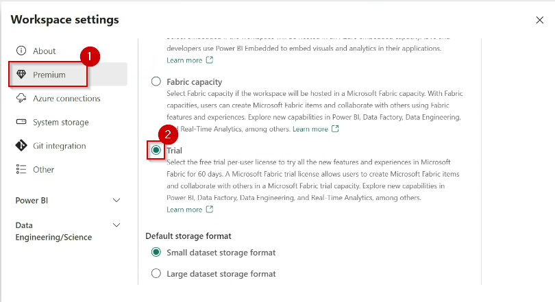

> **Note:** If your workspace has **Fabric capacity**, select it. Otherwise, use the **Trial** License type.
> **Note:** Use of the Fabric Capacity is recommended for a better experience.

11. **Scroll down** and click on **Select license**.

    

> **Note:** Make sure to add this workspace as a Fabric Trial/Fabric capacity License and note down the names of the **Workspace** and **Lakehouses**. These will be used during script execution (Task 2).


### Task 2: Run the Cloud Shell to provision the demo resources

>**Note:** For this Demo, we have assets in an Azure resource group as well as Fabric Workspaces.

>**Note:** In this task, we will execute a PowerShell script on Cloud Shell to create those assets.

>**Note:** The list of resources are as follows:

**Azure resources:**
|NAME	|TYPE|
|-----|-----|
|app-fabric-{suffix}	|App Service	|
|asp-fabric-{suffix}	|App Service plan	|
|asp-realtime-kpi-analytics-{suffix}	|App Service plan	|
|mssql{suffix}	|SQL server	|
|SalesDb (mssql{suffix}/SalesDb)	|SQL database	|
|stfabricadb{suffix} | Microsoft.Storage/storageAccounts |
|adb-fabric-{suffix} | Microsoft.Databricks/workspaces |
|ami-databricks-{suffix} | Microsoft.ManagedIdentity/userAssignedIdentities |
|access-adb-connector-{suffix} | Microsoft.Databricks/connectors |
|kv-adb-{suffix} | Microsoft.KeyVault/vaults |
|cosmosdb-herodemo-{suffix} | Microsoft.Azure Cosmos DB account |
|cosmosdb-mongo-herodemo-{suffix} | Microsoft.Azure Cosmos DB for MongoDB account (RU) |
|storage{suffix}	|Storage account	|
| | |


**Fabric resources:**
| displayName | type |
|-----------|------|
|lakehouseBronze_{suffix}                                                |Lakehouse|
|lakehouseBronze_{suffix}                                                | SemanticModel|
|lakehouseBronze_{suffix}                                            |     SQLEndpoint|
|lakehouseSilver_{suffix}                            |                     Lakehouse|
|lakehouseSilver_{suffix}                                              |   SemanticModel|
|lakehouseSilver_{suffix}                                             |    SQLEndpoint|
|lakehouseGold_{suffix}                               |                    Lakehouse|
|lakehouseGold_{suffix}                                                 |  SemanticModel|
|lakehouseGold_{suffix}                                                |   SQLEndpoint|
|LakehouseAI                                     |                   Lakehouse|
|LakehouseAI                                                        |SemanticModel|
|LakehouseAI                                                      |  SQLEndpoint|
|Website_Bounce_Rate                                               |       SemanticModel|
|Sales_Report                                               |      SemanticModel|
|01 Copilot Notebook for Data Science.ipynb|   Notebook|
|01 Data Wrangler Notebook.ipynb     |            Notebook|
|02 Churn Prediction using MLFlow.ipynb        |           Notebook|
|03 Silver to Gold layer Medallion Architecture.ipynb|        Notebook|
|CreateSchema.ipynb         |       Notebook|
|FootTraffic_RealtimeData.ipynb|   Notebook|
|Generate realtime thermostat data.ipynb     |            Notebook|
|real-time paint accessory inventory data.ipynb        |           Notebook|
|Segment customer and Incorporate discount.ipynb|        Notebook|
|salesDW_{suffix}                                                        | Warehouse|
|salesDW_{suffix}                                        |                 SemanticModel|
|ZAVA-KQL-DB                                        |                  KQLDatabase|
|  |  |

1. **Open** the Azure Portal by clicking on the button below.

<a href='https://portal.azure.com/' target='_blank'></a>

2. In the Azure portal, select the **Terminal icon** to open Azure Cloud Shell.

	

3. **Click** on **PowerShell**.

    

4. Select the **Subscription** and click on **Apply**.

	

	> **Note:** If you already have a storage mounted for Cloud Shell, you will not get this prompt. In that case, skip step 5 and 6.


5. In the Azure Cloud Shell window, ensure that the **PowerShell** environment is selected.

	

	>**Note:** All the cmdlets used in the script work best in PowerShell .	

	>**Note:** Use 'Ctrl+C' to copy and 'Shift+Insert' to paste, as 'Ctrl+V' is NOT supported by Cloud Shell.

6. Enter the following command to clone the repository files in Cloud Shell.

Command:

```
git clone -b azureherodemo --depth 1 --single-branch https://github.com/microsoft/Azure-Analytics-and-AI-Engagement.git fabric
```

<!-- ```
git clone --branch herodemosdpoc --single-branch https://daidemos@dev.azure.com/daidemos/DREAMDemos/_git/DREAMPoC
``` -->

   
	
   > **Note:** If you get File already exist error, please execute the following command to delete existing clone and then re-clone:
```
 rm fabric -r -f 
```
   > **Note**: When executing scripts, it is important to let them run to completion. Some tasks may take longer than others to run. When a script completes execution, you will be returned to a command prompt. 

7. **Execute** the PowerShell script with the following command:
```
cd ./fabric/fabric
```

```
./herodemo.ps1
```
    
   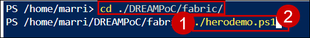

8. **Press** **Y** and click on the **Enter** button.
      


9. From the Azure Cloud Shell, **copy** the authentication code. You will need to enter the code in the next step.

10. **Click** the link [https://microsoft.com/devicelogin](https://microsoft.com/devicelogin) and a new browser window will launch.


     
11. **Paste** the authentication code.

	 

12. **Select** the user account you used for logging into the Azure Portal in [Task 1](#task-1-create-a-resource-group-in-azure).

 

13. **Click** on the **Continue** button.

 

14. **Close** the browser tab when you see the message box.

	   

15. **Navigate back** to your **Azure Cloud Shell** execution window.

16. **Copy** your subscription name from the screen and **paste** it in the prompt.

    
	
	> **Notes:**
	> - Users with a single subscription won't be prompted to select a subscription.
	> - The subscription highlighted in Light blue will be selected by default, if you do not enter a desired subscription. Please select the subscription carefully as it may break the execution further.
	> - While you are waiting for the processes to complete in the Azure Cloud Shell window, you'll be asked to enter the code three times. This is necessary for performing the installation of various Azure Services and preloading the data.

17. **Copy** the code on the screen to authenticate the Azure PowerShell script for creating reports in Power BI. **Click** the link [https://microsoft.com/devicelogin](https://microsoft.com/devicelogin).

	

18. A new browser window will launch. **Paste** the authentication code you copied from the shell above.

	 

19. **Select** the user account that is used for logging into the Azure Portal in [Task 1](#task-1-create-a-resource-group-in-azure).

	

20. **Click** on 'Continue'.

	 

21. **Close** the browser tab when you see the message box.

	 

22. **Go back** to the Azure Cloud Shell execution window.

23. **Enter** the Region for deployment with the necessary resources available, preferably "eastus". 
    (Ex.: eastus, eastus2, westus, westus2, etc).

	 

24. **Enter** your desired SQL Password.

	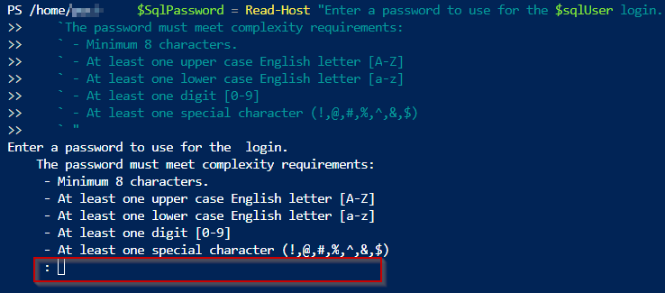

>**Note:** Copy the password in Notepad for further reference.

25. **Enter** the Workspace IDs that you copied in [Task 1](#task-1-power-bi-workspace-and-lakehouse-creation) consecutively.

	

26. You will get another code to authenticate the Azure PowerShell script for creating reports in Power BI. **Copy** the code.

	> **Note:** You may see errors in script execution if you  do not have necessary permissions for Cloud Shell to manipulate your Power BI workspace. In that case, follow this document [Power BI Embedding](https://github.com/microsoft/Azure-Analytics-and-AI-Engagement/blob/fsi/fsidemo/Power%20BI%20Embedding.md) to get the necessary permissions assigned. You’ll have to manually upload the reports to your Power BI workspace by downloading them from this location [Reports](https://github.com/microsoft/Azure-Analytics-and-AI-Engagement/tree/fintax/fintaxdemo/artifacts/reports). 

27. **Click** the link [https://microsoft.com/devicelogin](https://microsoft.com/devicelogin).

    
      
28. In the new browser tab, **paste** the code you copied from the shell in step 30 and **click** on **Next**.

 

**Note:** Be sure to provide the device code before it expires and let the script run until completion.

29. **Select** the user account you used to log into the Azure Portal in [Task 1](#task-1-create-a-resource-group-in-azure). 

	

30. **Click** on **Continue**.

	 

31. **Close** the browser tab when you see the message box.

	

	>**Note:** During script execution you need to note the resource group that gets created, since a resource group with a unique suffix is created each time the script is executed.

32. **Navigate back** to your Azure Cloud Shell execution window.

33. When it asks **Are you sure?** press **Y** and click on the **Enter** button.


34. Repeat **step 33** two times whenever it asks. If the same prompt repeats more than two times, continue to **step 33** until you move forward.


35. When it asks **Are you sure?** press **Y** and click on the **Enter** button.


> **Note:** Deployment will take approximately 40-50 minutes to complete. Keep checking the progress with messages printed in the console to avoid timeout.

36. After  script execution is complete, the "--Execution Complete--" prompt appears.


### Task 3: Unified Multi-Source Querying

1. In Power BI service, click on **Workspaces** and **click** on the current working workspace. 

	

2. **Filter** for the **Lakehouse** and click on **LakehouseBronze_...**.

	

3. Click on **Lakehouse** in the top right corner and then click on **SQL analytics endpoint**.


4. Click on **New SQL Query** and paste the query below in the editor.

```
SELECT 
    sqldb.[CampaignName],
    sqldb.[ProductID] as sqldb_ProductID,
    sqldb.[CampaignType],
    sqldb.[Location],
    sqldb.[No_Subcampaigns],
    sqldb.[Conducted_Via],
    sqldb.[How_It_Went],
    sqldb.[Total_Attendees],
    aggr.*
FROM azuresql.CampaignData sqldb
JOIN (
    SELECT 
        AWS.ProductID AS AWS_ProductID,
        AWS.[ProductName],
        AWS.[ProductCategory],
        AWS.[StoreLocation],
        AWS.[InventorySKU],
        AWS.[StockAvailabilityStatus],
        AWS.[LastRestockDateTime],
        AWS.[EventProcessedUtcTime],
        AWS.[PartitionId],
        AWS.[EventEnqueuedUtcTime],
        csdb.[ProductID],
        csdb.[CustomerSentiment],
        csdb.[Website_Bounce_Rate],
        csdb.[Total_No_Of_Searches],
        csdb.[CustomerSatisfactionRate]
    FROM cosmosDb.Inventory_Customersentiment csdb
    JOIN AWS.products AWS
        ON AWS.ProductID = csdb.ProductID
) aggr
ON aggr.AWS_ProductID = sqldb.[ProductID];


```


5. Right click on **SQL query1**, click on **Rename** and paste **Integrated_sqlquery** in the **Name** field.


### Task 4: Setting up Eventstream

1. In Power BI service, click on **Workspaces** and **click** on the current working workspace. 

	

2. **Filter** for the **Eventstream** and click on **ThermostatEventStream_...**.

	

3. Click on **Use custom endpoint**.

	

4. Paste **Thermostat** in the Source name and click on **Add**.

	

5. Click on **Transform events or add destination** and then click on **Eventhouse**.

	

6. For **Data ingestion mode**, 
    - Select **Event processing before ingestion**, 
    - Paste **Eventhouse** for the **Destination name** field, 
    - Select the current workspace from the drop down for **Workspace** field, 
    - Select the **ZAVA-Eventhouse** from the drop down for **Eventhouse** field, 
    - Select the **ZAVA-Eventhouse** from the drop down for **KQL Database** field, 
    - For **KQL Destination table** field, click on **Create new**, 
    - paste **thermostat** in the **Table name** field and then click on **Done**.

	

7. Click on **Save**.

	

8. Click on **Publish**.

	

9.  Click on the three lines in the bottom right corner of the **Thermostat** endpoint,
    - Click on **SAS KeyAuthentication**.
    - Copy the values of **Event hub name**.
    - Click on eye icon of  **Connection string-primary key**, copy the value and then store them in Notepad for the next steps.

	

10. In Power BI service, click on **Workspaces** and **click** on the current working workspace. 

	

11. **Filter** for the **Notebook** and click on **Generate realtime thermostat data**.

	

12. Go to the last cell and replace the **#Connection string-primary key#** and **#Event hub name#** with the values copied in step 9.

	

13. Click on **Run all**.

	

>**📝 Note:** The above Notebook will generate only 100 records per run, if you want more data, schedule the notebook accordingly.


14. Repeat steps 1 to 13:
    - In Step 2, click on **Eventstream_foottraffic_..**.
    - In Step 4, enter **foottraffic**.
    - In Step 6, after clicking on "New Table," enter the table name as **foottraffic**.
    - In Step 9, click on the three ellipses of the **foottraffic** endpoint.
    - In Step 11, click on **FootTraffic_RealtimeData.ipynb**.

15. Repeat steps 1 to 13:
    - In Step 2, click on **Eventstream_Inventory_..**.
    - In Step 4, enter **Inventory**.
    - In Step 6, after clicking on "New Table," enter the table name as **Inventory**.
    - In Step 9, click on the three ellipses of the **Inventory** endpoint.
    - In Step 11, click on **real-time paint accessory inventory data.ipynb**.

**Appendix:** After Step 8, if want we can add **Manage fields** in between Eventsream and eventhouse, **Filters** in between Eventsream and stream.


### Task 5: Get data into QuerySet

1. Navigate to the **Microsoft Fabric** tab on your browser (https://app.fabric.microsoft.com).

2. Click on **Filter** to select **KQL Queryset**.


3. Click on **thermostat**.


<!-- 4. Click on **select database** and then Slect **OneLake data hub**.

 -->

4. Click on **+ Add data source** and then select **Eventhouse/KQL Database**.
 


5. Select the **ZAVA-Eventhouse** and then click on **Connect**.


### Task 6: Create Genie 

1. Navigate to the Azure Portal, 
    - In the **rg-herodemos-dpoc-...** resource group, search for **Databricks** and click on the Databricks resource with the name **adb-fabric....**

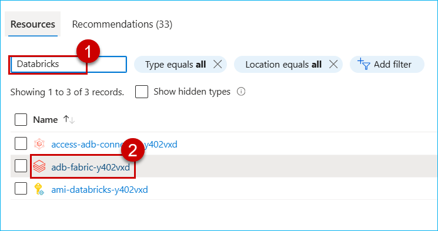

2. Click on the **Launch Workspace** button.

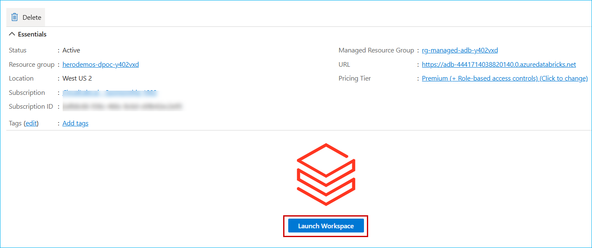

3. Sign in with the user ID used to create the rg.

4. In the left menu bar, click on **Genie**.

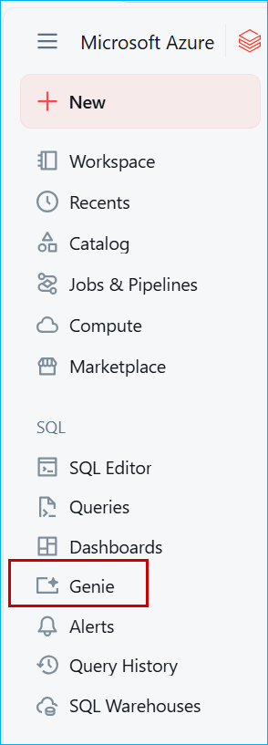

5. Click on **+ New**.


6. Click on **All** and then click on **herodemo_unity_catalog**.

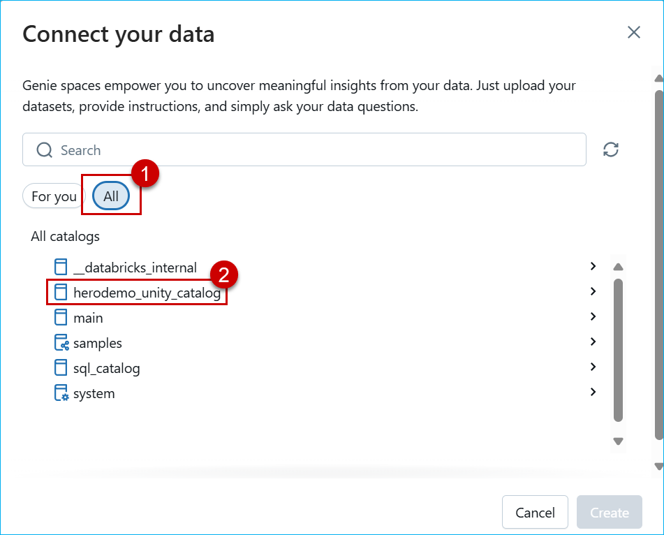

7. Click on **herodemo**.

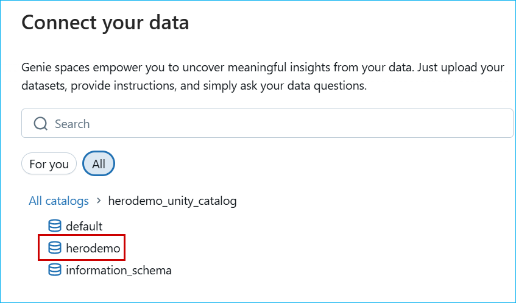

8. Select **bronze_campaign_data** and **gold_top_loss_making_campaign**, then click on **Create**.

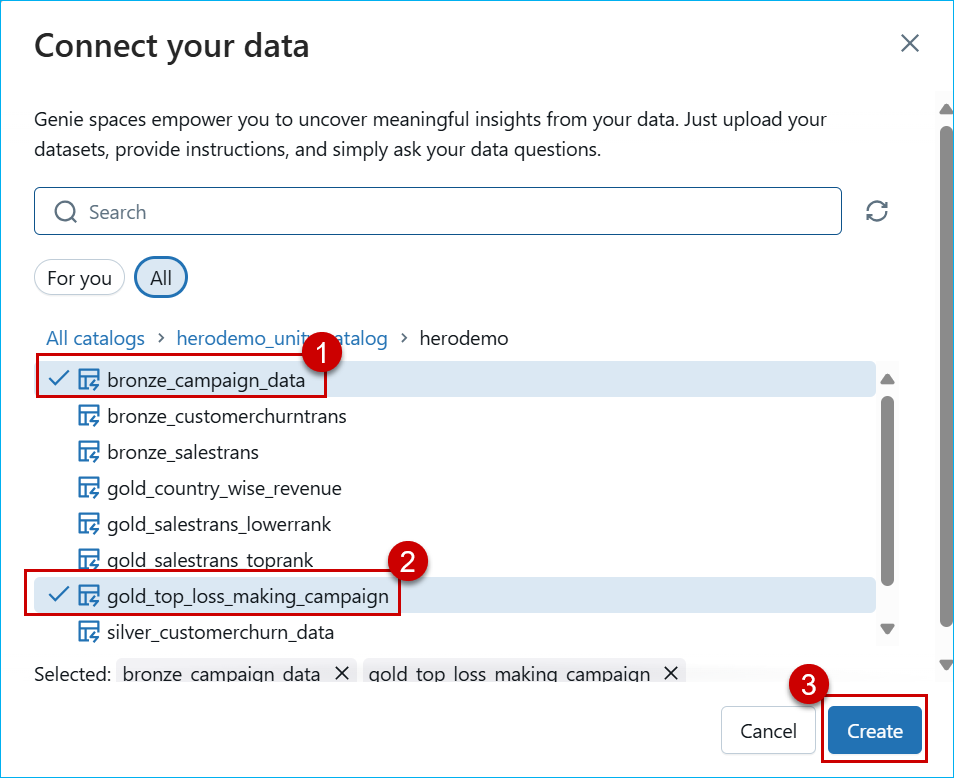

9. Click on **New Space** in the top left to edit the name and replace it with **Hero_Genie**.

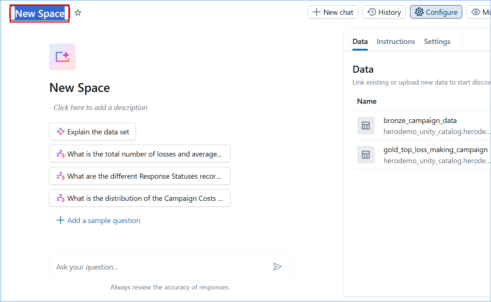


### Task 7: Creating a data agent

> This task only works if you selected the Fabric Capacity License in Task 1.

1. Open the **Microsoft Fabric** tab in your browser.

2. Click on **Workspaces** in the left navigation pane and select **Zava**.


3. Click on **+ New item**, search for `Data agent` and click on **Data agent**.


4. Paste `DataAgent` in the name field and click on **Create**.


5. Click on **+ Data source**.


6. Click on the **lakehouseSilver..** checkbox and click on **Connect**.


7. Expand **LakehouseSilver..**, expand **dbo** and then select all the tables.


8. Click on **AI instructions** and then paste following instructions in it.

```
You have access to multiple connected data sources including:
Customer Sentiment Data from Lakehouse DB, which includes customer satisfaction and sentiment analysis.
Marketing Campaign Data from a Data Warehouse, providing information about active and past campaigns.
Inventory and Store Temperature Data from KQL DB, containing real-time inventory and store environmental data.
Use this data to answer business questions about:
Customer preferences and satisfaction trends
Real-time inventory status across locations
The impact of marketing campaigns
Issues affecting sales performance, especially for locations like Miami and San Francisco
Provide concise, insightful answers without requiring SQL or code.
Combine campaign effectiveness, post-campaign sales uplift, and customer sentiment insights into one unified view. Use the following sources:
DataWarehouse: Get campaign revenue, cost, ROI, product category, and customer segment details from Campaigndata.
Eventhouse: Add store-level foot traffic and inventory data from foottraffic and Inventory to measure physical impact of campaigns.
Lakehouse_Silver: Include average customer satisfaction and churn metrics during campaign periods from customersatisfactiondata.
Combine all relevant metrics into a single table where each row represents a campaign, and include columns such as:
Campaign_Name, Region, ProductCategory, Revenue, ROI, Customer_Segment
AvgCustomerSatisfaction, AvgChurn, PostCampaignSales, FootTrafficChange, InventoryLevelChange
Fill in metrics per campaign across time, territory, and product category.
```


9. Click on **Example queries** and then click on the **pencil icon** beside Example SQL queries.


10. Click on **+ Add example**, add the examples below and then **close** the example tab.

``` What is the monthly average customer satisfaction score?```

``` 
SELECT FORMAT(CAST([Date] AS DATE), 'yyyy-MM') AS Month, AVG([CustomerSatisfaction]) AS AvgSatisfaction FROM dbo.[customersatisfactiondata]
GROUP BY FORMAT(CAST([Date] AS DATE), 'yyyy-MM')
ORDER BY Month;
```
```What is the trend of actual churn over time? ```
```
SELECT Date, ActualChurn
FROM dbo.customersatisfactiondata
ORDER BY Date;
``` 

```Which months showed a decline in satisfaction but rise in churn?```
```
SELECT FORMAT(CAST([Date] AS DATE), 'yyyy-MM') AS Month,
       AVG(CustomerSatisfaction) AS AvgSatisfaction,
       AVG(ActualChurn) AS AvgChurn
FROM dbo.customersatisfactiondata
GROUP BY FORMAT(CAST([Date] AS DATE), 'yyyy-MM')
HAVING AVG(CustomerSatisfaction) < 0.5 
   AND AVG(ActualChurn) > 0.3
ORDER BY Month;

```


11. Click on **Publish**.


### Task 8: Creating a Semantic Model for Power BI

1. Open the **Microsoft Fabric** tab on your browser.

2. Click on **Workspaces** in the left navigation pane and select **Zava**.


3. Click on **Filter** and select **Lakehouse**.

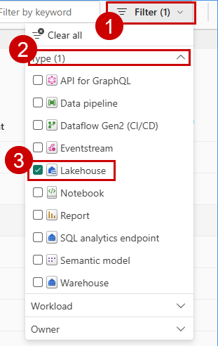

4. Click on **Lakehouse_Silver**.

> **Note:** There are 3 lakehouse options, namely Lakehouse, Semantic model (Default) and SQL endpoint. Make sure you select the **Lakehouse Type** option.

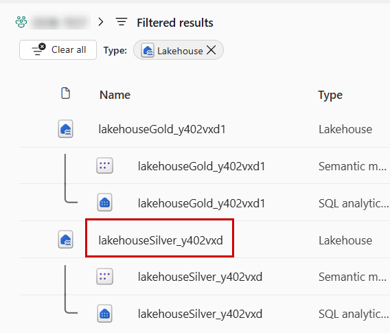

5. Click on the **New semantic model** button.

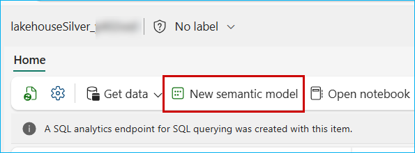

6. In the **Name** field, enter **Website_Bounce_Rate**.

7. Select **Zava** as the workspace, click on the expand icon next to the **dbo** checkbox and then click on the expand icon next to the **Tables** checkbox.

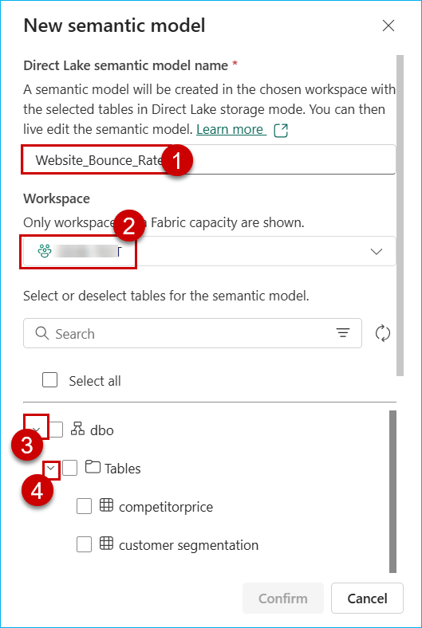

8. Scroll down if you see a scrollbar and select the **product_inventory** and **website_bounce_rate** tables, then click on the **Confirm** button.

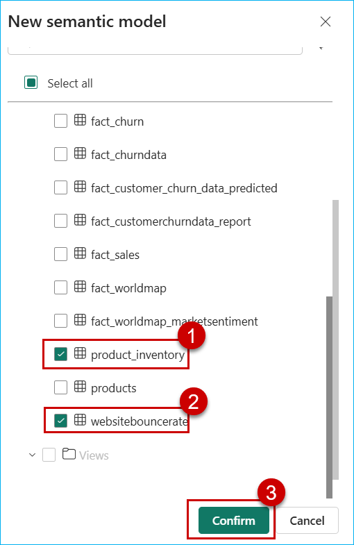

>**Note:** Wait for the semantic model creation.

<!-- 10. To create the second semantic model,
- Follow the same steps from 1 to 5.
- In **step 6**, enter **Sales_Report** in the **Name** field.
- Follow steps 7 and 8.
- In **step 9**, select **dim_products** and **fact_sales**.

11. After creating the **Sales_Report** Semantic Model, click on New Table. In the formula tab, paste ```[Dim_Measures] = Row(""Column"", BLANK())``` and then click on the **Enter** button.

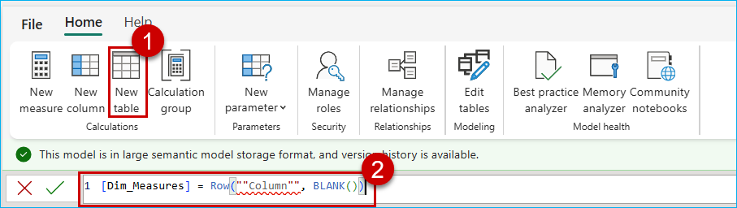

12. **Right click** on the **Dim_Measures** table and select **New Measure**.

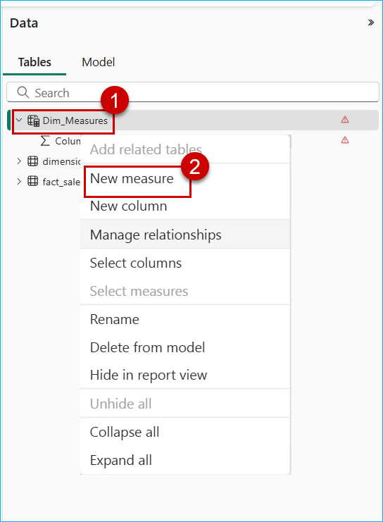

13. In the formula tab, paste ```Number of Rows = COUNTROWS(fact_sales)``` and then click on the **Enter** button.

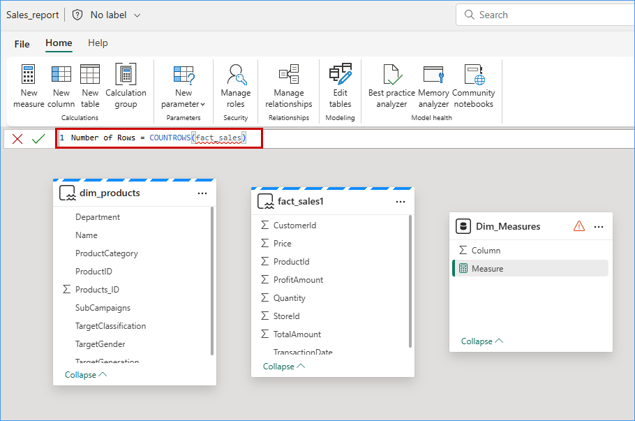

14. Repeat **step 12 and 13** four times to add four new measures.

    - ```Orders = sum(fact_sales[Quantity])/10000```
    - ```Price = sum(fact_sales[Price])/10000```
    - ```Profit = sum(fact_sales[ProfitAmount])/10000```
    - ```Revenue = sum(fact_sales[TotalAmount])/10000```

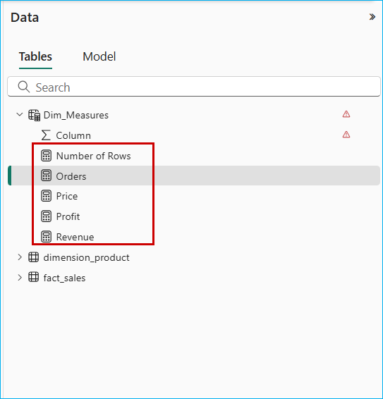 -->


### Task 9: Updating Semantic Models with Cloud connection

1. Open the **Microsoft Fabric** tab in your browser.

2. Click on **Workspaces** in the left navigation pane and select **Zava**.


3. Click on **Filter** and select **Semantic model**.

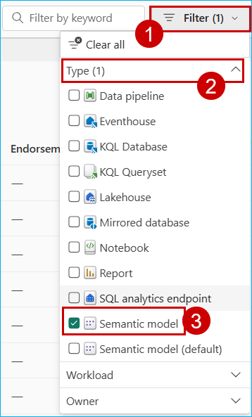

4. Click on the three dots (ellipsis) next to the **Column Level Security in Warehouse** Semantic model and click on **Settings**.

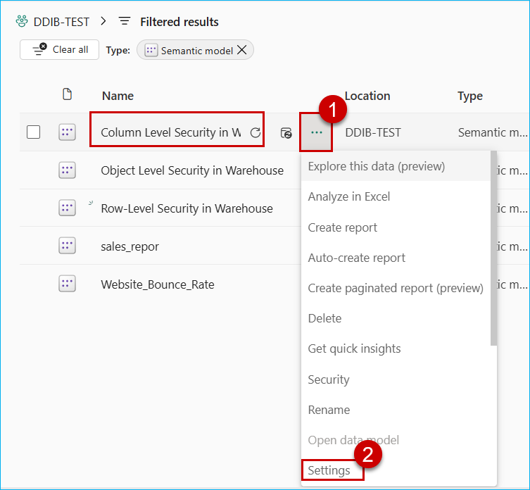

5. Expand **Gateway and cloud connections**. In the Cloud connections, click on the dropdown and then select **Create a connection**.

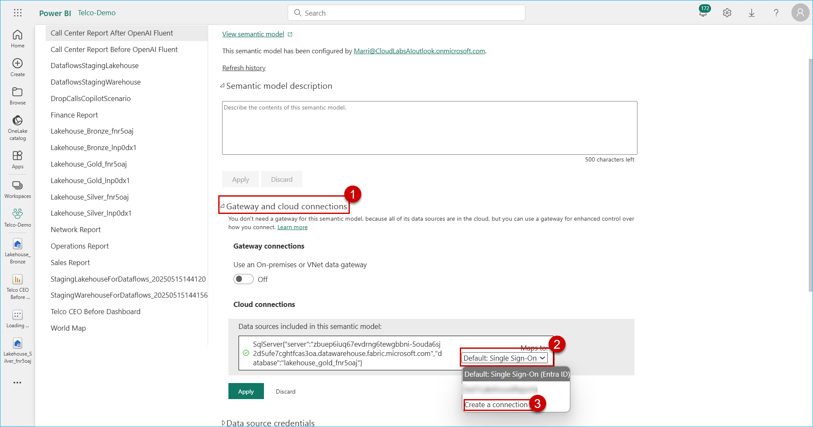

6. Paste `Datawarehousecon` in the **Connection name** field, select **OAuth 2.0** in the **Authentication method** and then click on **Edit credentials**.

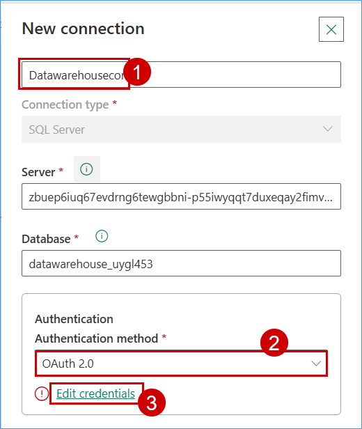

7. Select the **user account** that was used for logging into the **Azure Portal** in [Task 1](#task-1-create-a-resource-group-in-azure).

   

8. Click on the **Create** button.

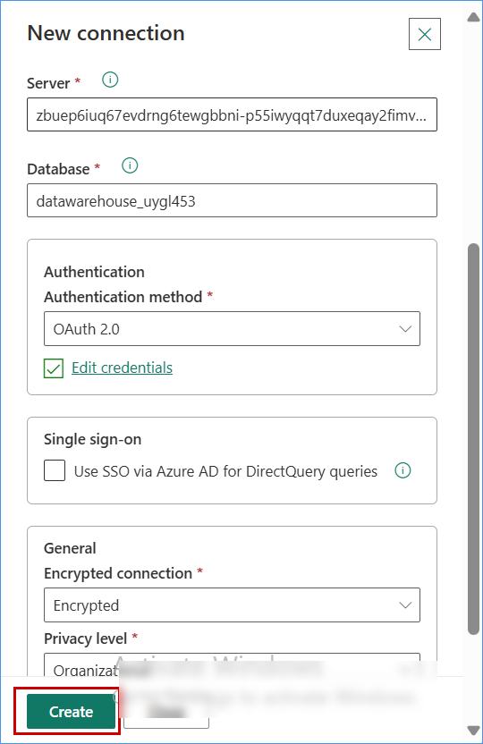

10. Click on the dropdown under **Cloud connections**, select **Datawarehousecon** and then click on the **Apply** button.

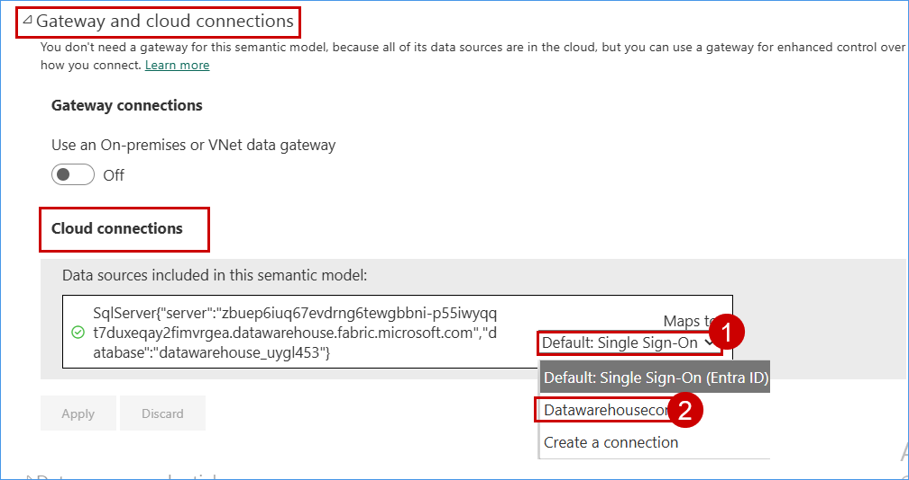

11. Click on **Object Level Security in Warehouse** semantic model from the list.
    - Expand **Gateway and Cloud connections**.
    - In the **Cloud connections**, click on dropdown and select **Datawarehousecon**.
    - Click on the **Apply** button.

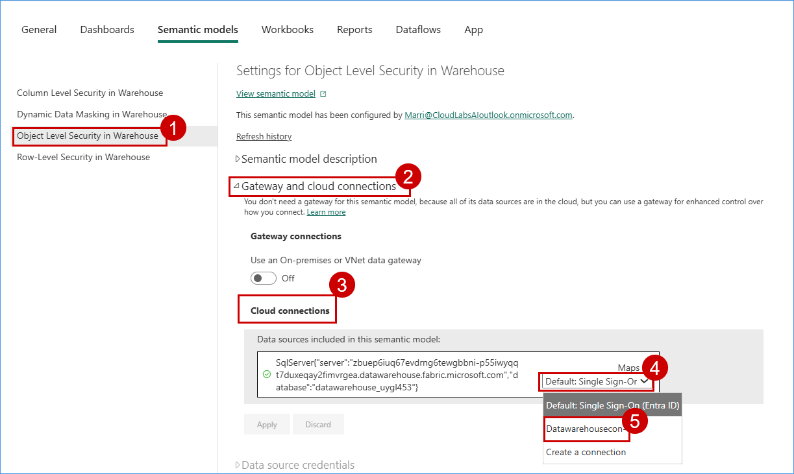

12. Repeat **Step 11** for the **Row-Level Security in Warehouse** and **Dynamic Data Masking in Warehouse** semantic models.

13. Click on  **Sales_Report** semantic model from the list.

14. Expand **Gateway and cloud connections**. In the Cloud connections, click on the dropdown and then select **Create a connection**.

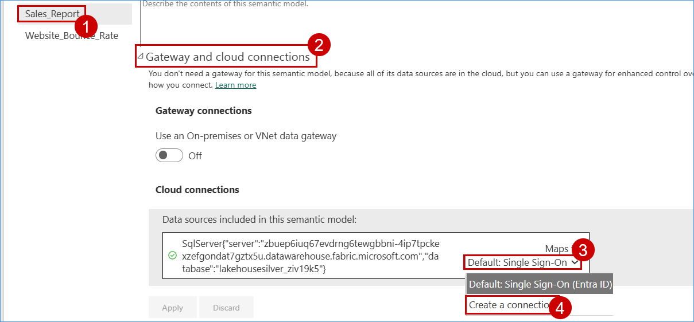

15. Paste `Lakehouseconn` in the **Connection name** field, select **OAuth 2.0** in the **Authentication method** and then click on **Edit credentials**.

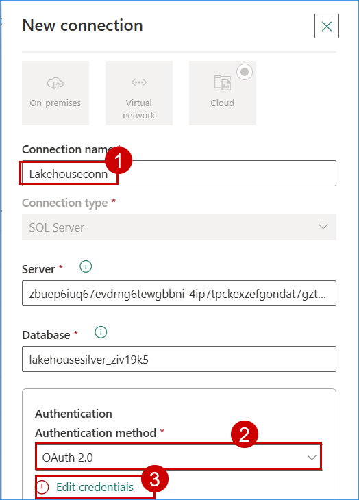

16. Select the **user account** that was used for logging into the **Azure Portal** in [Task 1](#task-1-create-a-resource-group-in-azure).

   

17. Click on the **Create** button.

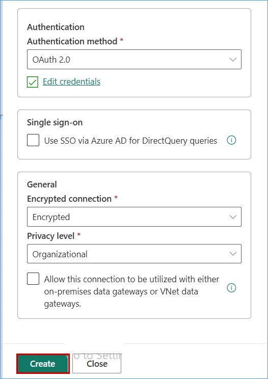

18. Click on the dropdown under **Cloud connections**, select **Lakehouseconn** and then click on the **Apply** button.


### Task 10: Creating a Dashboard and enabling Data Activator

1. Click on the **Workspaces** in the left navigation pane and select **Zava**.

	

2. Filter for **KQL Database** and select **Zava-Eventhouse**.

	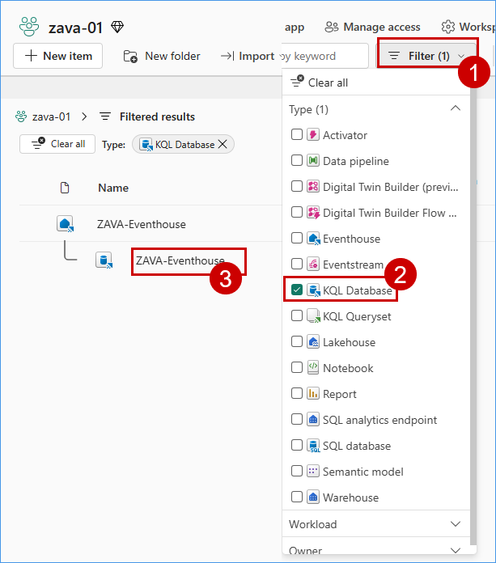

3. Click on **Real-Time Dashboard**, paste **Impactful Zava RTI Dashboard** in the **New dashboard** field and then click on **Create**.


4. Click on **Viewing** in the top right and then click on **Editing**.

**Note: If it is already in Editing mode, continue with next steps**.

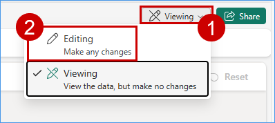

5. Click on **New tile**.

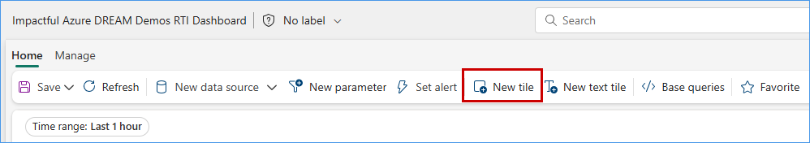

6. Paste the Query below, 

```
thermostat| summarize round(avg(toint(Temp)),0)
```

7. Click on the **Run icon**.
8. Click on **+ Add Visual**.
9. In Visual formating tab, paste **Tempertaure** in the Tile name field.
10. Select **Stat** in visual type field.
11. Click on **Apply chnages**.


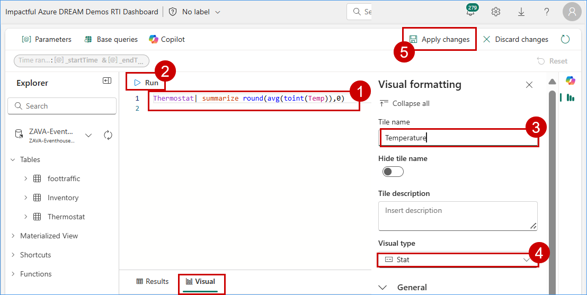

12. Click on **New tile**.
13. Paste the Query below,

```
['foottraffic']| summarize  round(avg(['before_traffic']),0)
```
14. Click on **Run icon**.
15. Click on **+ Add visual**.
16. In Visual formating tab, paste **Foot traffic** in the Tile name field.
17. Select **Stat** in the visual type field.
18. Click on **Apply chnages**.

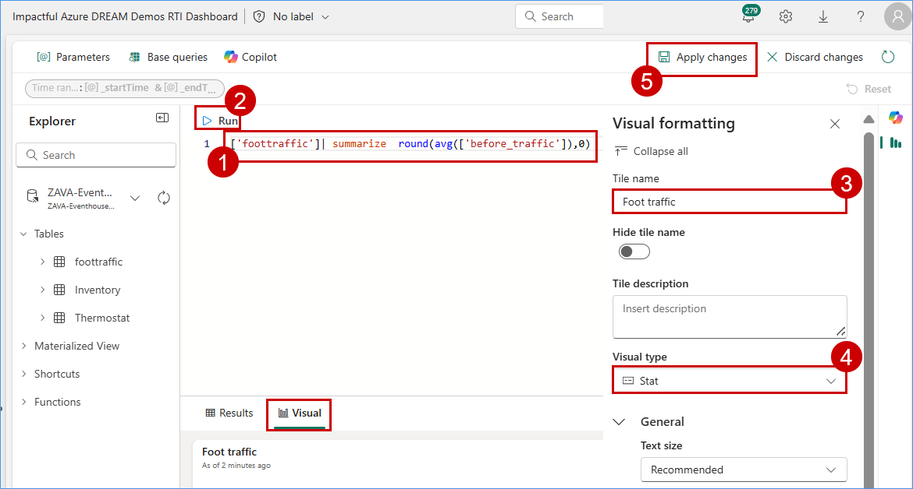

19. Click on **New tile**.
20. Paste the Query below, click on **Run icon**.
```
thermostat | summarize round(avg(BatteryLevel),0)
```
21. Click on **+ Add visual** in Visual formatting  tab.
22. Paste **Battery Level (%)** in the Tile name field.
23. Select **Stat** type in the visual type field.
24. In the **Conditional formatting ** tab click on **Add rule** and then click on the **pencil icon**.

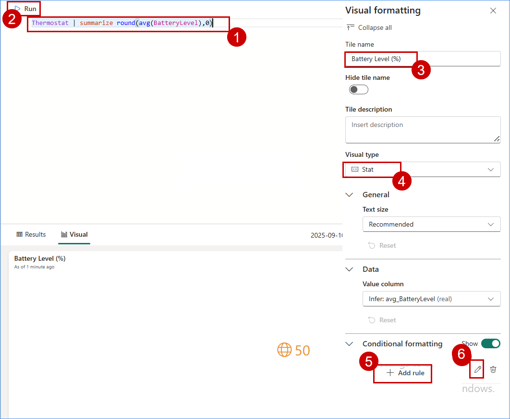

25. In the Conditional formatting tab,
26. For the **Color style** click on drop down and select **Light**.
27. For **Conditions** field, paste **0** in the **Value** field.
28. For **Formatting**, select the **Yellow** color from the drop down.
29. For **Icon** field, select the **globe** icon from the list and then click on the **Save** button.

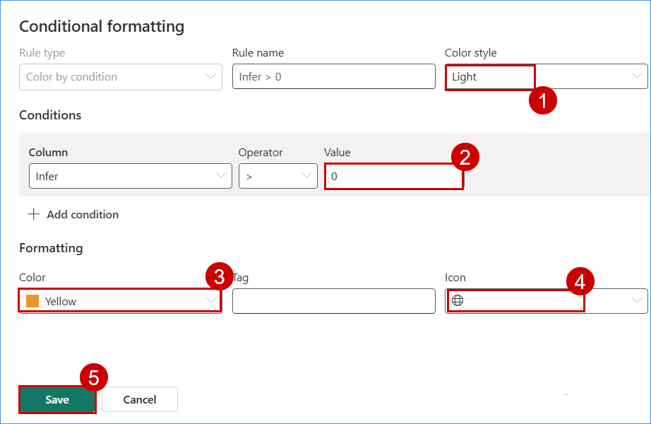

30. Click on **Apply changes**.

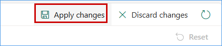

31. Click on **New tile**.
32. Paste the Query below.
```
thermostat
| where  City in ("San Francisco","New York", "Miami","Tokyo")
| summarize ['Battery(%)'] = toint(avg(BatteryLevel)), ['Date Time'] = format_datetime(todatetime(max(EnqueuedTimeUTC)), '[HH:mm]')
    by City, bin(todatetime(EnqueuedTimeUTC),1h)
| project ['Date Time'], City, ['Battery(%)']
|sort by ['Date Time']asc 

```
33. Click on **Run icon**.
34. Click **+ Add visual**.
35. In Visual formating tab, paste **Battery Levels by City and Time** in the Tile name field.   - Select **Line chart** in visual type field.

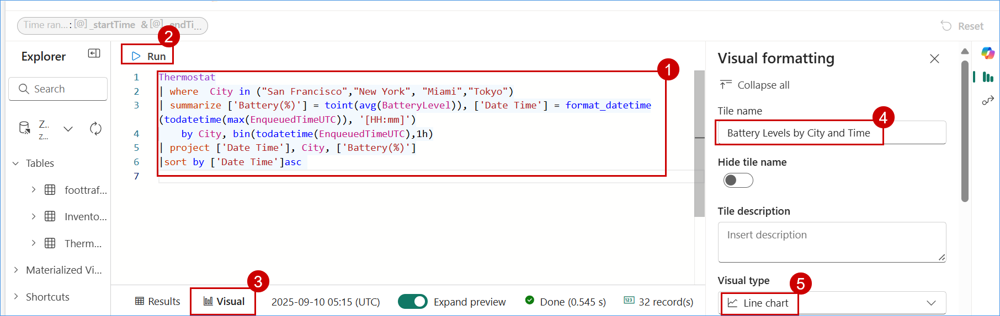

36. Scroll down and expand **Y Axis**.
37. In the Label field paste **Battery Level %**.
38. In the **Maximum value** field paste **52**.
39. In the **Minimum value** field paste **45**.
40. Click on the **Apply changes** button.

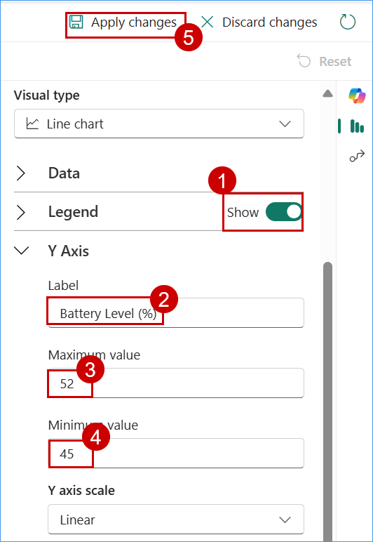

41. Click on **New tile**.
42. Paste the Query below.
```
Inventory
| where StockAvailabilityStatus  <> 'Medium Stock'
| project Category = ProductCategory,Product = ProductName,Store = StoreLocation,Inventory = InventorySKU,Status = StockAvailabilityStatus,['Last Restocked Date']= LastRestockDateTime
```
43. Click on **Run icon**.
44. Click **+ Add visual**.
45. In Visual formating tab, paste **Inventory Details** in the Tile name field.
46. Select **Table** in visual type field.
47. In the **Conditional formating** tab, click on the **Toggle** button beside **Show**.
48. Click on **+ Add rule** and then click on **pencil icon**.

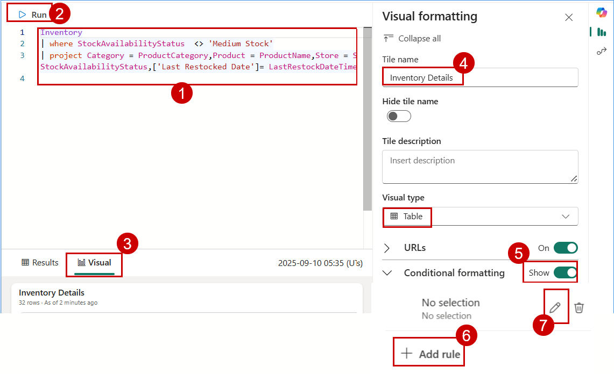

49. For Rule type, select **Color by value** in the dropdown menu. 
50. In the Column field, select **Inventory (long)** from the dropdown menu. 
51. In the Theme field, select **Yellow** from the dropdown menu. 
52. For Apply options, under Formatting, select **Apply to rows**. 
53. Click on the **Save** button. 

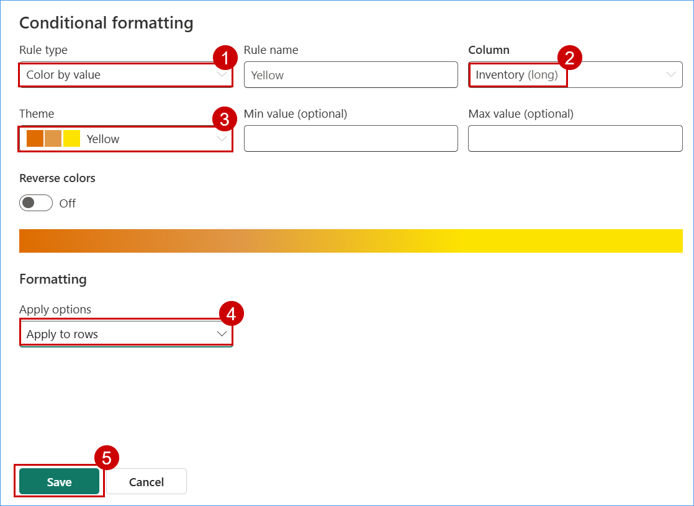

54. Click on **Apply changes**.


55. Click on **Set alert**, click on **Temperature** and then click on the **Select** button.

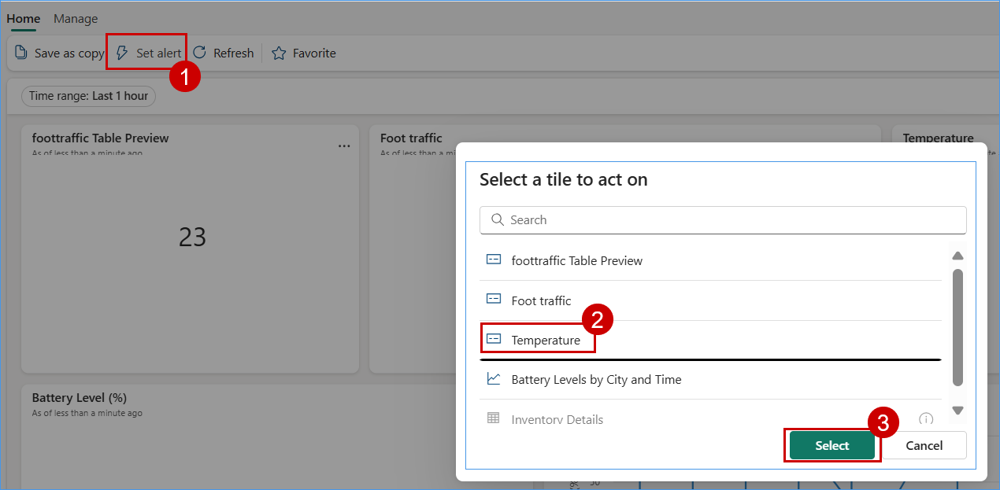

56. Under Field, select **avg_Temp**. 
57. For Condition, select **Is greater than or equal**. 
58. Set the Value to **69**. 

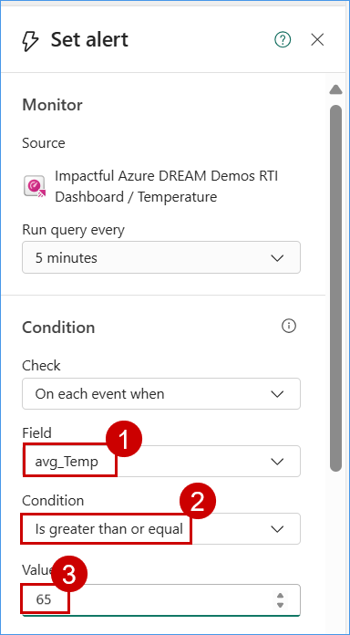

59. Scroll down and click on the **Message me in Teams** radio button.
60. In the Workspace field, select the **Zava** workspace.
61. For the **Item** field, click on the dropdown and select **Create a new item**.
62. Paste **Zava-Activator** in the New item name field.
63. Click on the **Create** button.

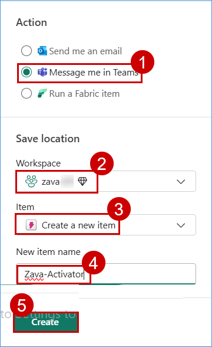

64. Click on **Save**.


<!-- 3. In the KQL Database screen **click** on the three dots in front of the Thermostat table and select **PowerBI**.

	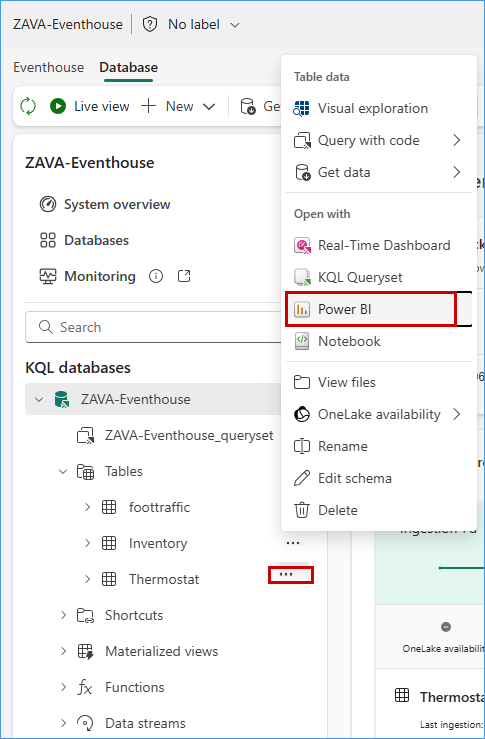

4. **Select** 'Area chart', **expand** 'Kusto Query Result', **select** 'ExnquedTimeUTC' and 'Sum of Temp' in the 'X-axis' and 'Y-axis' respectively and you would notice a chart as shown in the screenshot.

	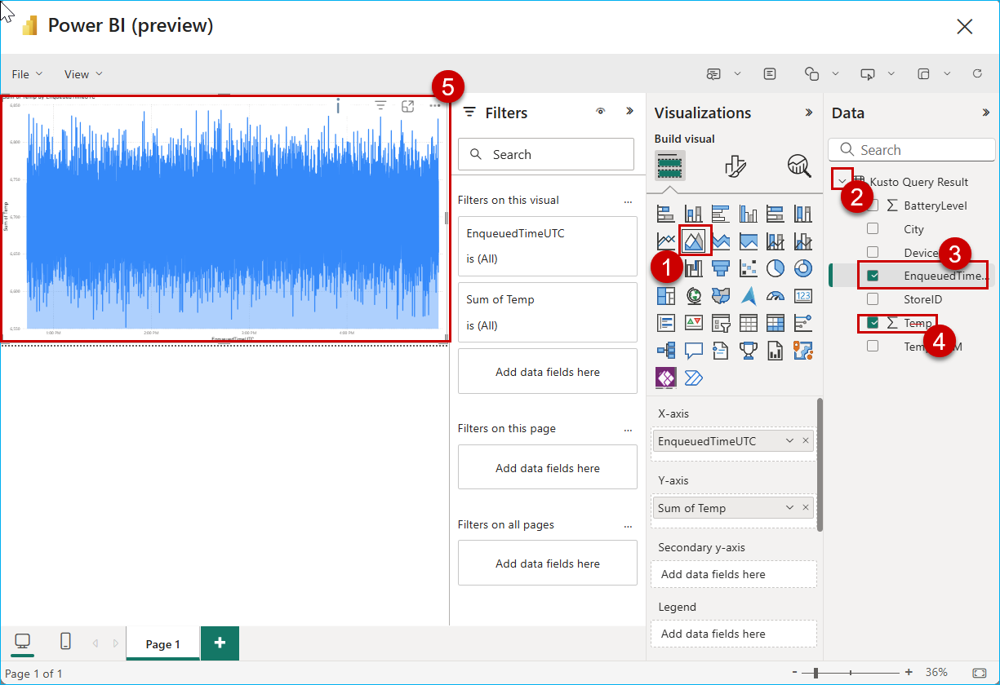

5. **Click** on the 'expand' icon of the Sum of Temp and **select** 'Average'.

	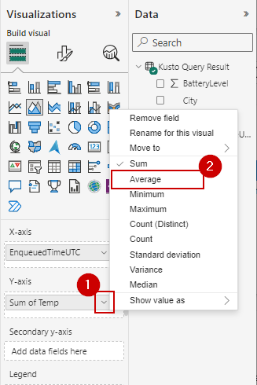

6. **Expand** 'File' and **select** 'Save'.

	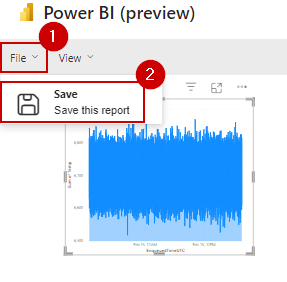

7. **Enter** the Name of the file as 'kqlRealtimeReport', **select** the workspace name as 'Zaca' and then **click** on 'Continue'.

	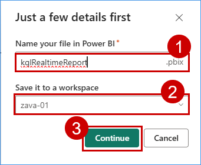

9. **Click** on 'Open file' option.

	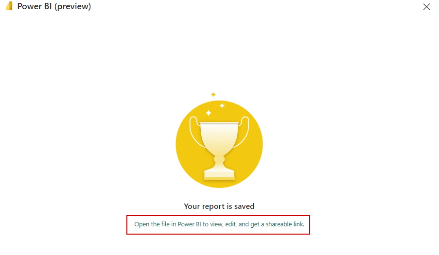

10. **Click** on the **Set alert**.

	

11. Click on **Average of Temp Alert**.

	

12. Select the radio button for **Becomes**.  
    In the **Condition** field drop-down, select **Greater than**.  
    In the **Value** field, paste **68.00**.  
    Select **Teams** in **Send Notification**, and then click on **Apply**.

	

13. Click on **My Power BI Activator Alerts**.  
    Select the appropriate **Workspace**.  
    In the **Item** field, select **Create a new activator item**.  
    Enter the **Item Name** as **Store Analytics**.  
    Click on the **Confirm** button.

	 -->


### Task 11: Create Digital Twin Builder

1. Open the **Microsoft Fabric** tab on your browser.

2. Click on **Workspaces** in the left navigation pane and select **Zava**.


3. Click on **+ New item**, search for **Digital Twin Builder** and then click on **Digital Twin Builder (preview)**.


4. Paste **HeroDemo_DTB** in the Name field and then click on **Create**.


### Task 12: Creating a Cosmos DB Mirror

Mirroring in Fabric provides an easy experience to avoid complex ETL (Extract Transform Load) processes and integrate your existing Azure Cosmos Database estate with the rest of your data in Microsoft Fabric.

1. Navigate to the **Microsoft Fabric** tab on your browser (https://app.fabric.microsoft.com).

2. Click on your **workspace** in the left navigation pane and select **New item** from the menu bar.


3. In the **New item** window, search for **Cosmos** in the search bar, then select **Mirrored Azure Cosmos DB...**.


4. When prompted to **Choose a database connection to get started**, look for **New sources** and select **Azure Cosmos DB v2**.


> **Note:** To fill in the details for required fields, we need to fetch the data from the Cosmosdb resource deployed in the Azure Portal.

5. Navigate to the **Azure Portal**.
   - In the resource group **herodemos-dpoc-...**, click on the **cosmosdb** resource.


6. Copy the **Server name** value.


<!-- 7. In the left search bar, search for **Keys**, click on **keys** and then Click on **show primary key** icon,


8. Copy the **primary key**

 -->

9. Navigate back to the **Fabric** tab on your browser.

10. In the **Cosmos DB Endpoint** field, paste the URI you copied in **step 6**. This will automatically fetch the pre-created connection.

11. Click on **Create**.


<!-- 11. Select **Account key** for Authentication kind, paste the primary key copied in step 8 as key value, and click on the **Connect** button.

 -->

12. Click on the dropdown for Database, then select **CustomerSentimentdata** and click on the **Connect** button.


13. Click on the **Connect** button.


14. In the Name field, paste `Mirror_cosmosdb_CustomerSentimentdata`.
   -  Click on the **Create mirrored database** button.


15. Show **Monitor replication** Status to track the replication status.


>**Note:**Wait until the Rows replicated statistics are displayed. If not displayed, refresh the **Monitor replication** tab as shown in the screen below. Now, Azure Cosmos DB has been successfully mirrored.


### Task 13: Setting up and Running Data Pipelines

1. Navigate to the **Microsoft Fabric** tab on your browser (https://app.fabric.microsoft.com).

2. Click on your workspace and filter for **Data Pipeline**.


3. Click on **Ingest AzureSQLDB data using Pipeline**.


4. Click on **Destination**, click on the **X** next to **Existing Connection** and click on **Drop down**.


5. Click on **Browse all**.


6. Click on **OneLake Catalog** in the left navigation pane, search for **SQL_DB** and the click on **SQL_DB**.


7. Make sure new connection is created.
  - Click on the **Auto create tale** radio button.
  - Paste **@item().destination.schema** in the Schema field.
  - Paste **@item().destination.table** in the Table field.


8. Click on the **Save icon**.
   - Click on **Run** and then click on **Ok**.


<!-- 9. Click on your workspace, and filter for **Data Pipeline**.


10. Click on **Ingest Datawarehouse data using pipeline**.


11. Click on **Get Metadata1** and then click on **Settings**, click on **Select** for Connection field.


12. Search for **Azure Data Lake** and click on **Azure Data lake Storage Gen2**. 


13. In a new tab, open the **resource group** created in [Task 2](#task-2-run-the-cloud-shell-to-provision-the-demo-resources) with name 'rg-herodemos-dpoc..'.

14. Click the **storage account resource**.

   

15. In the resource window, go to the **left pane** and scroll down.

16. In the **Security + networking** section, click on **Access keys**.

17. click on the **Show** button under **key1**.

    

18. click on **Copy** icon next to **Key**.

19. **Save** it in a notepad for further use.

    

20. **Scroll down** in the left pane.

21. Select **Endpoints** from the **Settings** section.

22. **Scroll down** and copy the **'Data Lake Storage'** endpoint under the 'Data Lake Storage' section.(Save it in a **notepad** for further use)

    

> **Note:** You may see different endpoints as well in the above screen. Make sure to select only the Data Lake Storage endpoint.

23. Navigate back to the **Power BI workspace** (the power bi tab which we working in earlier).

24. Paste the endpoint copied under the URL field.In the Authentiation kind dropdown, select the Account Key.Paste the account key copied in step number. Click on **Connect** button.


25. Paste **datawarehouse** in File path container filed. and then click on **+ New** for fieldlist, from the drop down click on **Child items**.


25. Double click on **copy data1**, click on **Source** and then click on **drop down**.


26. Click on **Browse all**


27. Search for **Azure Data Lake** and click on **Azure Data lake Storage Gen2**. 


28. Paste the endpoint copied in step 22 under the URL field. Click on **Connect** button..

29. Paste **datawarehouse** in File path container filed.


30. Click on **Save icon** and then click on **Run**.

 -->


### Task 14: Azure Purview set up

1. From the **Azure Portal**, search for **purview** in the resource group and click on the resource.

   

2. The Azure Purview resource window will open. **Click** on **Open Azure Purview Studio** and the Azure Purview Studio will open in a new window.
  
   

>**Note:** The steps below are visible to the user only when using the new Classic Purview portal, which is available as a single instance per tenant. If a new Purview account already exists in the tenant, any subsequent Purview accounts deployed will not include the new Classic portal.

3. In the Azure Purview Portal, Click on **Solutions** and go to **Data Map** 

   

4. Click on **Data Sources** and then click **Register** to add a new data source.

   

5. Select **Azure SQL Database** and then click **Continue**.

   

6. On the **Register data source** page, provide the **data source name**.

7. Select the required **Azure subscription**. 

8. Choose the **SQL Server** you want to connect to. 

9. Accept the default **Endpoint** and then click **Register**.

   

10. Click on **Data Sources** and then click **Register** to add a new data source.

   

11. Select **Fabric**, and then choose **Continue**.

   

12. On the Register data source page, enter the **Data source name**, **Tenant ID** and click **Register**.

   

>**Note:** You can follow the same steps to add any other data sources you need.

   

## Adding the Governance domains

1. From the left navigation menu, go to **Solutions** and then select **Unity Catalog**.

    

2. Expand **Catalog Management**, select **Governance Domains**, and then click **+ New Governance Domain**.

    

3. Enter the required **Name** and **Description**, select the **Type**, and then click **Next**.

    

    >**Note:** You can choose the name of your domain based on the type of data it will contain.

4.  On the Custom Attributes page, accept the default settings and click **Create** to finish creating the governance domain.

    

5. To assign permissions for a governance domain, select the **domain** you created previously, go to **Roles**, click the **Add** icon in front of Governance Domain Owner, and add people.

    

## Creating the Sensitivity label

1. From the left navigation menu, click on **Solutions** and then select **Information Protection**.

    

2. From the left navigation, select **Sensitivity Labels** and click **+ Create a label**.

    

3. On the Label Details page, enter the required information such as **Name**, **Display Name**, and **Description**, then click **Next**.

    

    >**Note:** You can provide the details based on the type of sensitivity label you are creating.

4. In the **Scope** section, select the required scope where the sensitivity label should be enabled

    

5. In the **Items** section, select the checkbox next to **Control access** and click **Next**.

    

6. In the Access control section, select the radio button next to **Configure access control**, **Assign permissions** to the sensitivity label by choosing the required users, and then click **Next**.

    

7. Review the settings, then click **Create label** to finalize.

    

8. After creating a sensitivity label, you need to create a policy label on top of it. Select the sensitivity label you created and click **Publish Label**.

    

9. On the Create Policy page, select the sensitivity label you created earlier, then click **Next**.

    

10. Navigate to the **Users and Groups** page. Click on **Edit**, then select the user who should be granted access to the sensitivity label. Once the appropriate user is selected, click **Next** to proceed.

    

11. On the Policy Settings page, enable the checkbox labeled **Require users to apply a label to their Fabric and Power BI content.** This setting grants the previously selected user access to manage sensitivity labels for content within Microsoft Fabric and Power BI and click on **Next**.

    

12. Go to the **Apply a default label to Fabric and Power BI content** setting and choose the sensitivity label you created earlier. 

    

13. Enter a name for the policy, then click **Next** to continue.

    

14. On the Review and Finish page, review your selections and then click **Submit**.

    

    

### Appendix

>**Note:** Follow these steps to create a **Mirrored Snowflake** database only if you have an existing **Snowflake** resource.

### Setting up the Mirrored Snowflake

1. Navigate to the **Microsoft Fabric** tab on your browser (https://app.fabric.microsoft.com).

2. Click on **+ New item**, search for `snowflake` and click on **Mirrored Snowflake**.


3. Search for **snowflake** and click on **Snowflake**.


4. Go to the Snowflake resource and copy **Server, Warehouse, Username, password**.
5. Return to the fabric page and paste all the values copied from Snowfalke resource and then click on **Connect**.


6. Paste the name as **Mirrored_Snowflake_DB** and click on **Connect**

7. Check the **Monitor replication**.


