# Fintax DREAM Demo in a Box Setup Guide

## What is it?
DREAM Demos in a Box (DDiB) are packaged Industry Scenario DREAM Demos with ARM templates (with a demo web app, Power BI reports, Synapse resources, AML Notebooks etc.) that can be deployed in a customer’s subscription using the CAPE tool in a few hours.  Partners can also deploy DREAM Demos in their own subscriptions using DDiB.

 ## Objective & Intent
Partners can deploy DREAM Demos in their own Azure subscriptions and show live demos to customers. 
In partnership with Microsoft sellers, partners can deploy the Industry scenario DREAM demos into customer subscriptions. 
Customers can play,  get hands-on experience navigating through the demo environment in their own subscription and show to their own stakeholders
**Before You Begin**

## :exclamation:IMPORTANT NOTES:  

  1. **Please read the [license agreement](https://github.com/microsoft/Azure-Analytics-and-AI-Engagement/blob/main/CDP-Retail/license.md) and [disclaimer](https://github.com/microsoft/Azure-Analytics-and-AI-Engagement/blob/main/CDP-Retail/disclaimer.md) before proceeding, as your access to and use of the code made available hereunder is subject to the terms and conditions made available therein.**
  2. Without limiting the terms of the [license](https://github.com/microsoft/Azure-Analytics-and-AI-Engagement/blob/main/CDP-Retail/license.md) , any Partner distribution of the Software (whether directly or indirectly) may only be made through Microsoft’s Customer Acceleration Portal for Engagements (“CAPE”). CAPE is accessible by Microsoft employees. For more information about the CAPE process, please connect with your local Data & AI specialist or CSA/GBB.
  3. Please note that **Azure hosting costs** are involved when DREAM Demos in a Box are implemented in customer or partner Azure subscriptions. **Microsoft will not cover** DDiB hosting costs for partners or customers.
  4. Since this is a DDiB, there are certain resources open to the public. **Please ensure proper security practices are followed before you add any sensitive data into the environment.** To strengthen the security posture of the environment, **leverage Azure Security Centre.** 
  5.  For any questions or comments please email **[dreamdemos@microsoft.com](mailto:dreamdemos@microsoft.com).**
  
   > **Note**: Set up your demo environment at least two hours before your scheduled demo to make sure everything is working.
   
# Copyright

© 2021 Microsoft Corporation. All rights reserved.   

By using this demo/lab, you agree to the following terms: 

The technology/functionality described in this demo/lab is provided by Microsoft Corporation for purposes of obtaining your feedback and to provide you with a learning experience. You may only use the demo/lab to evaluate such technology features and functionality and provide feedback to Microsoft.  You may not use it for any other purpose. You may not modify, copy, distribute, transmit, display, perform, reproduce, publish, license, create derivative works from, transfer, or sell this demo/lab or any portion thereof. 

COPYING OR REPRODUCTION OF THE DEMO/LAB (OR ANY PORTION OF IT) TO ANY OTHER SERVER OR LOCATION FOR FURTHER REPRODUCTION OR REDISTRIBUTION IS EXPRESSLY PROHIBITED. 

THIS DEMO/LAB PROVIDES CERTAIN SOFTWARE TECHNOLOGY/PRODUCT FEATURES AND FUNCTIONALITY, INCLUDING POTENTIAL NEW FEATURES AND CONCEPTS, IN A SIMULATED ENVIRONMENT WITHOUT COMPLEX SET-UP OR INSTALLATION FOR THE PURPOSE DESCRIBED ABOVE. THE TECHNOLOGY/CONCEPTS REPRESENTED IN THIS DEMO/LAB MAY NOT REPRESENT FULL FEATURE FUNCTIONALITY AND MAY NOT WORK THE WAY A FINAL VERSION MAY WORK. WE ALSO MAY NOT RELEASE A FINAL VERSION OF SUCH FEATURES OR CONCEPTS.  YOUR EXPERIENCE WITH USING SUCH FEATURES AND FUNCITONALITY IN A PHYSICAL ENVIRONMENT MAY ALSO BE DIFFERENT.

## Contents

<!-- TOC -->

- [Requirements](#requirements)
- [Before Starting](#before-starting)
  - [Task 1: Create a resource group in Azure](#task-1-create-a-resource-group-in-azure)
  - [Task 2: Power BI Workspace creation](#task-2-power-bi-workspace-creation)
  - [Task 3: Deploy the ARM Template](#task-3-deploy-the-arm-template)
  - [Task 4: Run the Cloud Shell to provision the demo resources](#task-4-run-the-cloud-shell-to-provision-the-demo-resources)
  - [Task 5: Power BI reports and dashboard creation](#task-5-power-bi-reports-and-dashboard-creation)
  - [Task 6: AML notebook execution](#task-6-aml-notebook-execution)
  - [Task 7: Pause or Resume script](#task-7-pause-or-resume-script)
  - [Task 8: Clean up resources](#task-8-clean-up-resources)

<!-- /TOC -->

## Requirements

* An Azure Account with the ability to create an Azure Synapse Workspace.
* A Power BI Pro or Premium account to host Power BI reports.
* Make sure you are the Power BI administrator for your account and service principal access is enabled on your Power BI tenant.
* Make sure the following resource providers are registered with your Azure Subscription.
   - Microsoft.Sql 
   - Microsoft.Synapse 
   - Microsoft.StreamAnalytics 
   - Microsoft.EventHub 
   - Microsoft.Media.MediaServices
* You can run only one deployment at any point in time and need to wait for its completion. You should not run multiple deployments in parallel as that will cause deployment failures.
* Select a region where the desired Azure Services are available. If certain services are not available, deployment may fail. See [Azure Services Global Availability](https://azure.microsoft.com/en-us/global-infrastructure/services/?products=all) for understanding target service availability. (consider the region availability for Synapse workspace, Iot Central and cognitive services while choosing a location)
* Do not use any special characters or uppercase letters in the environment code. Also, do not re-use your environment code.
* In this Accelerator we have converted Real-time reports into static reports for the ease of users but have covered entire process to configure Realtime dataset. Using those Realtime dataset you can create Realtime reports.
* Please ensure that you select the correct resource group name. We have given a sample name which may need to be changed should any resource group with the same name already exist in your subscription.
* The audience for this document is CSAs and GBBs.
* Please log in to Azure and Power BI using the same credentials.
* Once the resources have been setup, please ensure that your AD user and synapse workspace have “Storage Blob Data Owner” role assigned on storage account name starting with “stfintax”. You need to contact AD admin to get this done.
* Please review the [Liscence Agreement](https://github.com/microsoft/Azure-Analytics-and-AI-Engagement/blob/fintax/fintaxdemo/Power%20BI%20Embedding.md) before proceeding.

## Before starting

### Task 1: Create a resource group in Azure

1. **Log into** the [Azure Portal](https://portal.azure.com) using your Azure credentials.

2. On the Azure Portal home screen, **select** the '+ Create a resource' tile.

	

3. In the Search the Marketplace text box, **type** "Resource Group" and **press** the Enter key.

	

4. **Select** the 'Create' button on the 'Resource Group' overview page.

	
	
5. On the 'Create a resource group' screen, **select** your desired Subscription. For Resource group, **type** 'DDiB-Fintax-Lab'. 

6. **Select** your desired region.

	> **Note:** Some services behave differently in different regions and may break some part of the setup. Choosing one of the following regions is preferable: 		westus2, eastus2, northcentralus, northeurope, southeastasia, australliaeast, centralindia, uksouth, japaneast.

7. **Click** the 'Review + Create' button.

	

8. **Click** the 'Create' button once all entries have been validated.

	

### Task 2: Power BI Workspace creation

1. **Open** Power BI in a new tab using the following link:  [https://app.powerbi.com/](https://app.powerbi.com/)

2. **Sign in**, to Power BI using your Power BI Pro account.

	

	> **Note:** Use the same credentials for Power BI which you will be using for the Azure account.

3. In Power BI service **Click** on 'Workspaces'.

4. Then **click** on the 'Create a workspace' tab.

	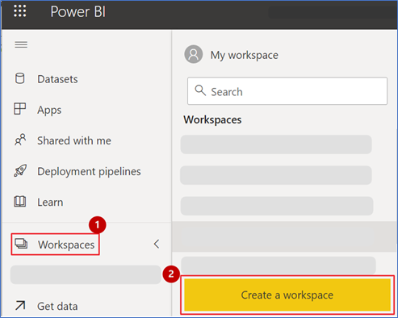

	> **Note:** Please create a Workspace by the name "DDiB-Fintax".

5. **Copy** the Workspace GUID or ID. You can get this by browsing to [https://app.powerbi.com/](https://app.powerbi.com/), selecting the workspace, and then copying the GUID 	from the address URL.

6. **Paste** the GUID in a notepad for future reference.

	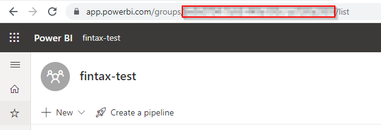

	> **Note:** This workspace ID will be used during ARM template deployment.

7. Go to your Power BI **workspace** and **click** on New button. 

8. Then **click** on **Streaming Dataset** option from the dropdown. 

	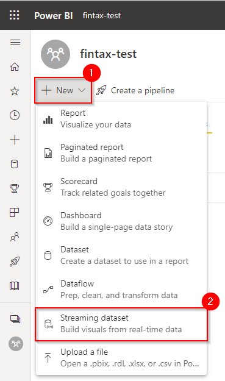

9. **Select API** from the list of options and **click** next. 

10. **Enable** the ‘Historic data analysis’ 

	

	

11. **Enter** ‘Tax Collection Realtime’ as dataset name and **enter** the column names in “values from stream” option from list below  and **click** on create button: 

	| Field Name                        | Type     |
	|-----------------------------------|----------|
	| VATBefore 						| number   |
	| VATMid  							| number   |
	| VATAfter  						| number   |
	| TaxPayerSatisfactionBefore  		| number   |
	| TaxPayerSatisfactionMid  			| number   |
	| TaxPayerSatisfactionAfter  		| number   |
	| TaxpayersBefore  					| number   |
	| TaxpayersMid  					| number   |
	| TaxpayersAfter  					| number   |
	| RecordedOn  						| datetime |
	| VATMax  							| number   |
	| TaxPayerSatisfactionTarget  		| number   |
	| TaxPayerSatisfactionMax  			| number   |
	| VATTargetBefore 				 	| number   |
	| VATTargetMid					  	| number   |
	| VATTargetAfter  					| number   |
	| TaxpayersTargetBefore 		  	| number   |
	| TaxpayersTargetMid  				| number   |
	| TaxpayersTargetAfter				| number   |
	
	

12. **Copy** the push url of dataset ‘Tax Collection Realtime’ and place it in a notepad for later use.

	


### Task 3: Deploy the ARM Template

1. **Open** this link in a new tab of the same browser that you are currently in: 
	
	<a href='https://portal.azure.com/#create/Microsoft.Template/uri/https%3A%2F%2Fraw.githubusercontent.com%2Fmicrosoft%2FAzure-Analytics-and-AI-Engagement%2Ffintax%2Ffintaxdemo%2Fmain-template.json' target='_blank'></a>

2. On the Custom deployment form, **select** your desired Subscription.

3. **Select** the resource group name **DDiB-Fintax-Lab** which you created in [Task 1](#task-1-create-a-resource-group-in-azure).

4. **Provide/Type** an environment code which is unique to your environment. This code is a suffix to your environment and should not have any special characters or uppercase letters and should not be more than 6 characters. 

5. **Provide** a strong SQL Administrator login password and set this aside for later use.

6. **Enter** the Power BI workspace ID created in [Task 2](#task-2-power-bi-workspace-creation).

7. **Enter** the power BI streaming dataset url for **Tax Collection Realtime dataset** you copied in step 12 of task 2.

8. **Click** ‘Review + Create’ button.

	


9. **Click** the **Create** button once the template has been validated.

	

	> **NOTE:** The provisioning of your deployment resources will take approximately 20 minutes.

10. **Stay** on the same page and wait for the deployment to complete.
    
	
    
11. **Select** the **Go to resource group** button once your deployment is complete.

	

### Task 4: Run the Cloud Shell to provision the demo resources

**Open** the Azure Portal.

1. In the Resource group section, **open** the Azure Cloud Shell by selecting its icon from the top toolbar.

	

2. **Click** on 'Show advanced settings'.

	

	> **Note:** If you already have a storage mounted for Cloud Shell, you will not get this prompt. In that case, skip step 2 and 3.

3. **Select** your 'Resource Group' and **enter** the 'Storage account' and 'File share' name.

	

	> **Note:** If you are creating a new storage account, give it a unique name with no special characters or uppercase letters.

4. In the Azure Cloud Shell window, ensure the PowerShell environment is selected and **enter** the following command to clone the repository files.
Command:
```
git clone -b fintax https://github.com/microsoft/Azure-Analytics-and-AI-Engagement.git fintax
```


	
> **Note:** If you get File already exist error, please execute following command: rm fintax -r -f to delete existing clone.

> **Note**: When executing scripts, it is important to let them run to completion. Some tasks may take longer than others to run. When a script completes execution, you will be returned to a command prompt. 

5. **Execute** the fintaxSetup.ps1 script by executing the following command:
Command:
```
cd ./fintax/fintaxdemo
```

6. Then **run** the PowerShell: 
```
./fintaxSetup.ps1
```
    
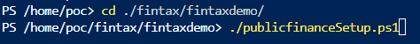
      
7. From the Azure Cloud Shell, **copy** the authentication code

8. Click on the link [https://microsoft.com/devicelogin](https://microsoft.com/devicelogin) and a new browser window will launch.

	
     
9. **Paste** the authentication code.

	

10. **Select** the same user that you used for signing in to the Azure Portal in [Task 1](#task-1-create-a-resource-group-in-azure).

	

11. **Close** the browser tab once you see the message window at right and **go back** to your Azure Cloud Shell execution window.

	
	
12. **Navigate back** to the resource group tab.

13. You will get another code to authenticate an Azure PowerShell script for creating reports in Power BI. **Copy** the code.

14. **Click** the link [https://microsoft.com/devicelogin](https://microsoft.com/devicelogin).

	

15. A new browser window will launch.

16. **Enter** the authentication code you copied from the shell above.

	

17. Again, **select** the same user to authenticate which you used for signing into the Azure Portal in [Task 1](#task-1-create-a-resource-group-in-azure).

	
	
18. **Close** the browser tab once you see the message window at right, and then go back to your Azure Cloud Shell execution window.

	

	> **Notes:**
	> - While you are waiting for processes to get completed in the Azure Cloud Shell window, you'll be asked to enter the code three times. This is necessary for performing installation of various Azure Services and preloading content in the Azure Synapse Analytics SQL Pool tables.
	> - You may be prompted to choose a subscription after the above-mentioned step if you have multiple subscriptions associated with your account. Choose the **subscription** that you used to sign in to the Azure portal. 

19. You will now be prompted to **enter** the resource group name in the Azure Cloud Shell. Type the same resource group name that you created in [Task 1](#task-1-create-a-resource-group-in-azure). – 'DDiB-Fintax-Lab'.

	

20. You will get another code to authenticate an Azure PowerShell script for creating reports in Power BI. **Copy** the code.
	> **Note:**
	> Note: You may see errors in script execution if you  do not have necessary permissions for cloudshell to manipulate your Power BI workspace. In such case follow this document (https://github.com/microsoft/Azure-Analytics-and-AI-Engagement/blob/fintax/fintaxdemo/Power%20BI%20Embedding.md) to get the necessary permissions assigned. You’ll have to manually upload the reports to your Power BI workspace by downloading them from this location [https://github.com/microsoft/Azure-Analytics-and-AI-Engagement/tree/fintax/fintaxdemo/artifacts/reports]. 

21. **Click** the link [https://microsoft.com/devicelogin](https://microsoft.com/devicelogin).

      
      
22. A new browser window will launch. **Paste** the code that you copied from the shell in step 21.

	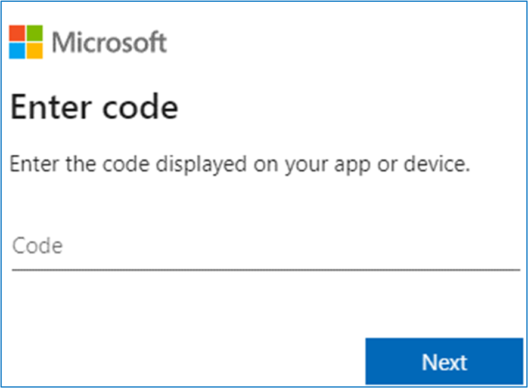

	> Note: Make sure to provide the device code before it expires and let the script run till completion.

23. **Select** the same user to authenticate which you used for signing into the Azure Portal in [Task 1](#task-1-create-a-resource-group-in-azure). 

	

24. **Close** the browser tab once you see the message window at right and go back to your Azure Cloud Shell execution window.

	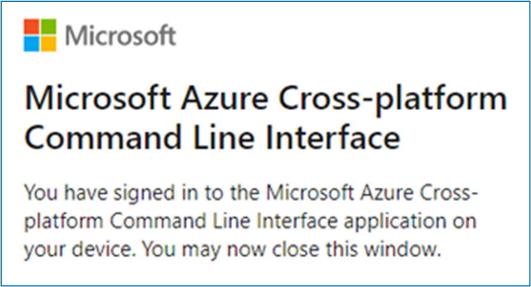

	> **Note:** The deployment will take approximately 40-45 minutes to complete. Keep checking the progress with messages printed in the console to avoid timeout.
      
### Task 5: Power BI reports and dashboard creation

1. **Open** Power BI in a new tab using the following link
        [https://app.powerbi.com/](https://app.powerbi.com/).

2. **Sign into** Power BI. Use the same Azure account you have used throughout this setup process.

	
	
3. Go to workspaces and **click on** create workspace.

	
	
4. Write the new workspace name and **click** on save.

	
	
5. **Select** the Workspace, which is created in [Task 2](#task-2-create-power-bi-workspace).
	
	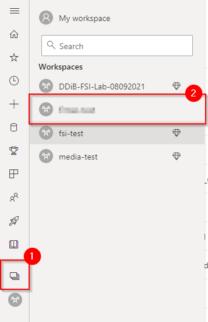
	
Once [Task 4](#task-4-run-the-cloud-shell) has been completed successfully and the template has been deployed, you will be able to see a set of reports in the Reports tab of Power BI, and real-time datasets in the Dataset tab. 

The image on the right shows the Reports tab in Power BI.  We can create a Power BI dashboard by pinning visuals from these reports.

	
	
> **Note:** If you do not see this list in your workspace after script execution, it may indicate that something went wrong during execution. You may use the subscript to patch it or manually upload the reports from this location and changing their parameters appropriately before authentication.

To give permissions for the Power BI reports to access the data sources:

6. **Click** the ellipses or settings icon on top right-side corner.

7. **Click** the settings dropdown.

8. **Click** on settings.

	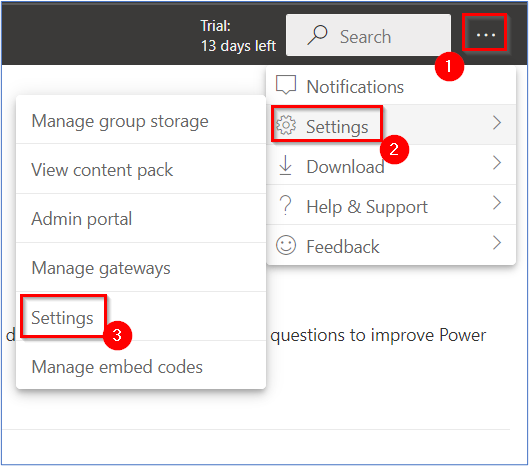

9. **Click** on ‘Datasets’ tab.
	
	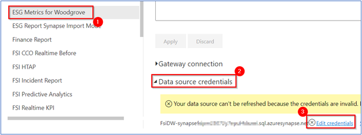
	
10. **Click** on the Taxpayer Client Services Report.

11. **Expand** Data source credentials.

12. **Click** Edit credentials and a dialogue box will pop up.

	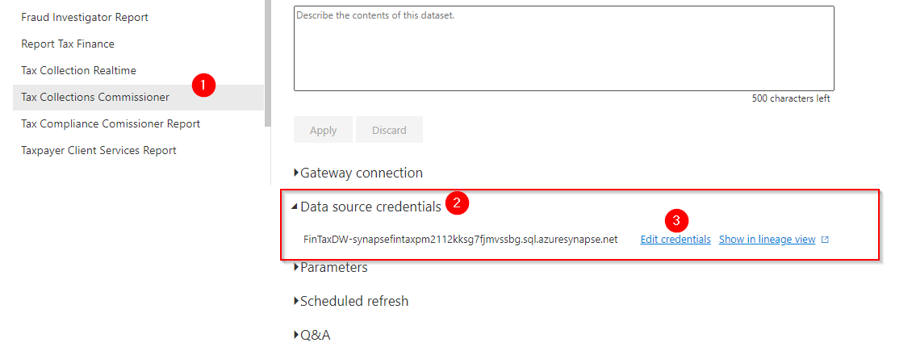

> **Note:** Verify the server name has been updated to your current sql pool name for all the datasets. If not, update the same under parameters section and click apply.

13. **Enter** Username as ‘labsqladmin’.

14. **Enter** the same SQL Administrator login password that was created for [Task 3](#task-3-deploy-the-arm-template) Step #5

15. **Click** on Sign in.

	
	
Follow these steps to create the Power BI dashboard:

16. **Select** the workspace created in [Task 2](#task-2-create-power-bi-workspace).

	
	
17. **Click** on ‘+ New’ button on the top-right navigation bar.

18. **Click** the ‘Dashboard’ option from the drop-down menu.

      

19. **Name** the dashboard ‘Taxpayer Client Services Commissioner Dashboard Before’ and **click** “create”. 

20. This new dashboard will appear in the Content section (of the Power BI workspace). 
	
	

Do the following to pin visuals to the dashboard you just created:

**Pillar 3: Market Perception** 

21. **Select** the workspace in [Task 2](#task-2-create-power-bi-workspace).

	

22. **Click** on the “Content” section/tab.

	

23. In the “Content” section, there will be a list of all the published reports.

24. **Click** on ‘Taxpayer Client Services Report’ Report.

	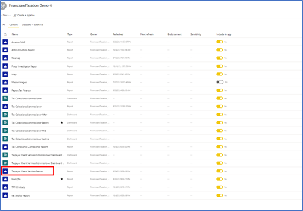
	
25. **Click** on ‘Pilar 4 A’ page.

26. There you can see Before and After KPIs for using on the same Dashboard.

27. **Hover** over the Awareness KPI & **Click** on pin visual button.

	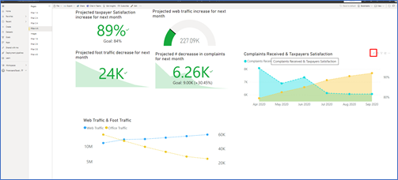

28. **Select** ‘Existing dashboard’ radio button. 

29. From ‘select existing dashboard’ dropdown, **select** ‘Taxpayer Client Services Commissioner Dashboard Before’.

30. **Click** ‘Pin’.

	
	
31. Similarly, **pin** the others tiles to the Dashboard

	
	
32. **Select** workpace created in [Task 2](#task-2-create-power-bi-workspace) in the left pane.

	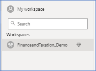
	
33. **Open** ‘Taxpayer Client Services Report’ report.

	
	
34. **Click** on Images page

36. **Click** on Edit.

	
	
36. **Hover** on Deep Dive chicklet and **click** pin button.

	
	
37. Select the ‘Taxpayer Client Services Commissioner Dashboard Before’ from existing dashboard list and **click** on pin.

38. Similarly pin rest of the images from Images of the  Taxpayer Client Services Report’ report.
	
	
	
39. **Go back** to the ‘Taxpayer Client Services Commissioner Dashboard Before’ dashboard.

	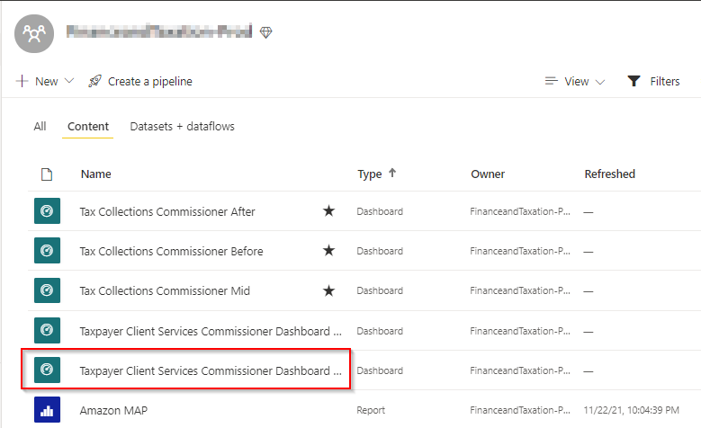
	
To hide title and subtitle for all the images that you have pined above. Please do the following:

40. Hover on the chiclet and **Click** on ellipsis ‘More Options’ of the image you selected.

41. **Click** on ‘Edit details’.

	
	
42. **Uncheck** ‘Display title and subtitle’.

43. **Click** on ‘Apply’.

44. **Repeat** Step 38 to 41 for all image tiles.

	
	
45. After disabling ‘Display title and subtitle’ for all images, **resize** and **rearrange** the top images tiles as shown in the screenshot. 
	
	
	
46. Similarly pin left image tiles from ‘page 1’ of chicklets report to the Taxpayer Client Services Commissioner Dashboard Before dashboard.

47. **Resize** and **rearrange** the left images tiles as shown in the screenshot. Resize the KPI tile to 1x2. Resize the Deep Dive to 1x4. Resize the logo to 1x1 size; resize other vertical tiles to 2x1 size.  

	
	
	
48. You will see some KPIs or charts like this KPI with title and subtitle. 1. Title, 2. Subtitle.
	
	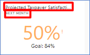
	
49. **Hover** over the cards and charts and go to more options (…)

50. **Click** on Edit Details.
	
	
	
51. You will see something like this picture where you can add subtitle.

	
	
52. The Dashboard “Taxpayer Client Services Commissioner Dashboard Before” should finally look like this.
Table in following row indicates which KPI’s need to be pinned from which report to achieve this final look.

	
	
53. Here is the list of Dashboards you have to create for TRF and the report to migrate to prod environment. You will see the necessary details for the same below.

	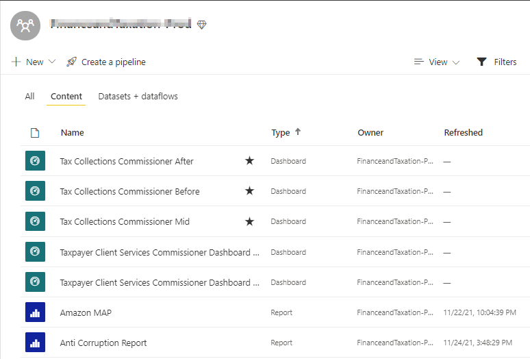
	
54. **Tax Collection Commissioner Before** should look like this. Following are the details of tiles for the same.

	
	
55. **Tax Collection Commissioner Mid** should look like this. Following are the details of tiles for the same.
	
	
	
56. **Tax Collection Commissioner After** should look like this. Following are the details of tiles for the same.

	
	
57. **Taxpayer Client Services Commissioner Before** Dashboard should look like this. 

	
	
58. **Taxpayer Client Services Commissioner After** Dashboard should look like this.
	
	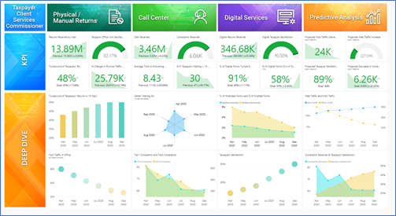

59. **Tax Compliance Commissioner Before** Dashboard should look like this.

	
	
60. **Tax Compliance Commissioner After** Dashboard should look like this.

	
	
61. **Fraud Investigator Before** Dashboard should look like this.
	
	
	
62. **Fraud Investigator After** Dashboard should look like this.

	
	
63. **Tax Auditor Before** should look like this.

	
	
64. **Tax Auditor After** should look like this.

	[Final Look.](media/power-bi-report-43.png)
	
65. **Anti-Corruption Unit Before** should look like this.

	[Final Look.](media/power-bi-report-44.png)
	
66. **Anti-Corruption Unit After** should look like this.

	[Final Look.](media/power-bi-report-45.png)
	
**Steps to create Real time report (Optional)**

This task is optional since we have provided static versions of the reports in the package already.

1. **Open** Power BI in a new tab using the following link:
	[https://app.powerbi.com/](https://app.powerbi.com/).

2. **Sign into** Power BI using your Power BI Pro account.

	

> **Note:** Use the same credentials for Power BI which you will be using for the Azure account.
	
3. After signing in, **click** the workspaces button from the hamburger menu and **select** the “FinanceandTaxation-Prod” workspace.

	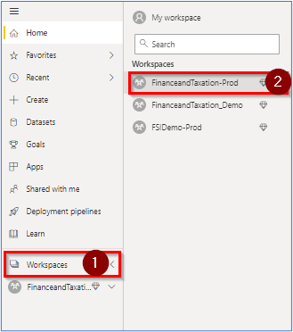

4. **Click** New to expand menu and then **click** Report.

	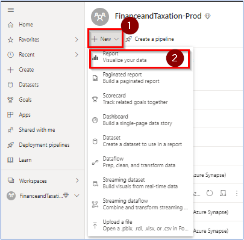

5. **Click** Pick a published dataset.
	
	

6. **Click** on the desired streaming dataset from the given list, here we are selecting “Tax Collection Realtime” and **click** Create Report.

	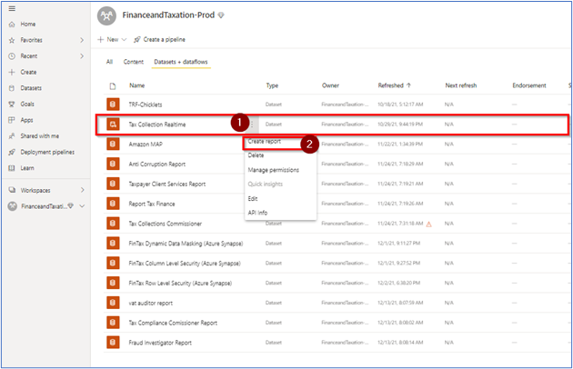

7. **Select** the KPI visual or any other required visual from Visualization pane.

8. **Drag** or **select** the required fields from Fields pane to Visualization pane’s Field tab.

	

9. Similarly, **create** other visuals and **save** the Power BI Report. You can also pin the visuals to the dashboard.

	

**Updating Dashboard and Report Id’s in Web app:**
By default, the web app will be provisioned with Gif placeholders for web app screens with dashboards. Once you have completed the steps listed above in this section, you can update the dashboard id’s generated in to the main web app if you choose. Here are the steps for it.

1. **Navigate** to your Power BI workspace.

2. **Click** on one of the dashboards you created. Eg. Woodgrove Executive dashboard June.

	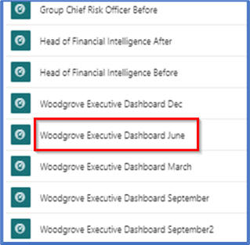

3. **Copy** the dashboard id from the url bar at the top.
	
	

4. **Navigate** to azure portal.

5. **Open** the Azure Cloud Shell by selecting its icon from the top toolbar.

	

6. **Click** on upload/download button.

7. **Click** download.

8. **Enter** the following path:  
	
	```
	fintax/fintaxdemo/app_fintaxdemo/wwwroot/config.js
	```

9. **Click** Download button.

	

10. **Edit** the downloaded file in notepad.

11. **Paste** the dashboard id you copied earlier between the double quotes of key ‘ceo_dashboard_march’.

12. **Save** the changes to the file.

	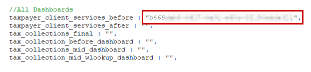

13. **Navigate** to azure portal.

14. **Open** the Azure Cloud Shell by selecting its icon from the top toolbar.

	

15. **Click** upload/download button.

16. **Click** upload.

17. **Select** the config.js file you just updated.

18. **Click** open.

	

19. **Execute** following command in cloudshell:  
	
	```
	cp config.js ./fintax/fintaxdemo/app_fintaxdemo/wwwroot
	```
	
	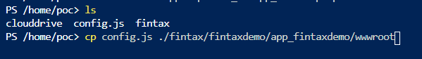

20.	Execute  following command in cloudshell: 
	
	```
	cd fintax/fintaxdemo/subscripts 
	./updateWebAppSubScript.ps1
	```
	
	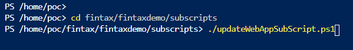

21. From the Azure Cloud Shell, **copy** the authentication code. 

22. **Click** on the link [https://microsoft.com/devicelogin](https://microsoft.com/devicelogin) and a new browser window will launch.

	

23. **Paste** the authentication code.

24. **Select** appropriate username when prompted.

25. Wait for script execution to complete.

	

> **Note:** You may be prompted to select your subscription if you have multiple subscriptions.

### Task 6: AML notebook execution

1. **Open** the azure portal and go to resource group **‘DDib-Fintax’.**

	

2. **Type** in filter “amlws-” and open the resource.

	

3. **Click** “Launch studio”

	

4. **Login** with the same user that you used for signing into the Azure Portal in [Task 1](#task-1-create-a-resource-group-in-azure).

5. **Open** Compute section and enter compute name, **select** “ STANDARD_DS2_V2” as compute quota and **click** on create.

	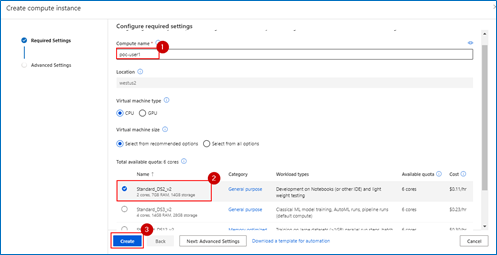

> **Note:**  It will take few minutes to create a compute instance.

6. **Open** Notebooks.

7. **Click** on “ 8. Understanding and Removing Biases from Machine Learning Models using Azure Fairlearn” notebook.

	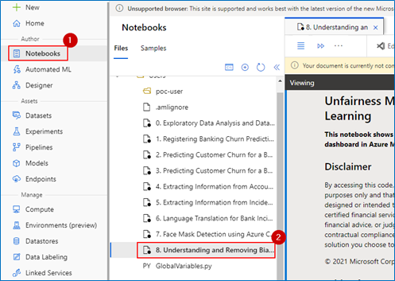

8. **Select** Compute created in step 5 and kernel as shown in image.

9. **Click** run all.
	
	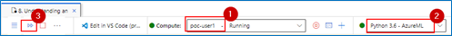

10. **Scroll** through the notebook cells, at cell 16 execution it will ask to do device login. Follow the steps with same user.

	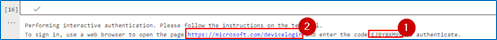


11. **Scroll** down till the end and wait for the green tick.

12. **Open** Experiments and see if experiments are created.

	

### Task 7: Pause or Resume script

> **Note:** Please perform these steps after your demo is done and you do not need the environment anymore. Also ensure you Resume the environment before demo if you paused it once. 
 
1. **Open** the Azure Portal 

2. **Click** on the Azure Cloud Shell icon from the top toolbar. 

	

**Execute** the Pause_Resume_script.ps1 script by executing the following command: 
1. **Run** Command: 
	```
	cd "fintax\fintaxdemo"
	```

2. Then **run** the PowerShell script: 
	```
	./pause_resume_script.ps1 
	```
	
	
	
3. From the Azure Cloud Shell, **copy** the authentication code
	
	
	
4. Click on the link [https://microsoft.com/devicelogin](https://microsoft.com/devicelogin) and a new browser window will launch.
	
5. **Paste** the authentication code.
	
	
	
6. **Select** the same user that you used for signing into the Azure Portal in [Task 1](#task-1-create-a-resource-group-in-azure). 

7. **Close** this window after it displays successful authentication message.

	

8. When prompted, **enter** the resource group name to be paused/resumed in the Azure Cloud Shell. Type the same resource group name that you created. 
	
	

9. **Enter** your choice when prompted. Enter ‘P’ for **pausing** the environment or ‘R’ for **resuming** a paused environment. 

10. Wait for script to finish execution. 

	

### Task 8: Clean up resources

> **Note: Perform these steps after your demo is done and you do not need the resources anymore**

**Open** the Azure Portal.

1. Open the Azure Cloud Shell by **clicking** its icon from the top toolbar.

	

**Execute** the resourceCleanup.ps1 script by executing the following:

2. **Run** Command: 
	```
	cd "fintax\fintaxdemo"
	```

3. Then **run** the PowerShell script: 
	```
	./resource_cleanup.ps1
	```

	

4. You will now be prompted to **enter** the resource group name to be deleted in the Azure Cloud Shell. Type the same resource group name that you created in [Task 1](#task-1-create-a-resource-group-in-azure) - 'DDib-Fintax'.

5. You may be prompted to select a subscription in case your account has multiple subscriptions.

	
	
Your Accelerator environment is now set up.
