# Microsoft IQ FSI Lending Agents (Fabric, Foundry, Work) Deployable PoC Accelerator
 
## What is a DPoC?
Deployable PoC Accelerators (DPoC) are packaged Demos using ARM templates and automation scripts (with a demo web application, Power BI reports, Fabric resources like Eventstream, Data Agents, Real Time Dashboards, PySpark notebooks etc.) that can be deployed in a customer’s environment.
 
## Objective & Intent
Enable partners to easily deploy demos in their own Azure subscriptions and demonstrate them live to their customers. 
By partnering with Microsoft sellers, partners can also deploy Industry Scenario Demos into customer subscriptions. 
Customers can then get hands-on experience with the demo environment in their own subscription,explore its capabilities, and showcase to their stakeholders.

## Responsible AI Demo Disclaimer
This demonstration is intended to illustrate example AI capabilities and may use simulated data, curated prompts, or controlled conditions. The system shown is designed for specific use cases and has known limitations. AI‑generated outputs may be inaccurate, incomplete, biased, or misleading and should be reviewed by a human. This demo does not represent a guarantee of future functionality, performance, or availability, and does not replace human judgment or responsibility

## Preparation and Setup
 
<!-- TOC -->
 
- [Before you begin](#before-you-begin)
- [Prerequisites](#prerequisites)
- [Tenant settings to enable](#tenant-settings-to-enable)
- [Notes](#notes)


<!-- /TOC -->
 
## Before you begin
 
1. **Read the [license agreement](https://github.com/microsoft/Azure-Analytics-and-AI-Engagement/blob/main/CDP-Retail/license.md) and [disclaimer](https://github.com/microsoft/Azure-Analytics-and-AI-Engagement/blob/main/CDP-Retail/disclaimer.md) before proceeding, as your access to and use of the code made available hereunder is subject to the terms and conditions made available therein.**
2. Without limiting the terms of the [license](https://github.com/microsoft/Azure-Analytics-and-AI-Engagement/blob/main/CDP-Retail/license.md), any Partner distribution of the Software (whether directly or indirectly) must be conducted through Microsoft’s Customer Acceleration Portal for Engagements (“CAPE”). CAPE is accessible to Microsoft employees. For more information regarding the CAPE process, contact your local Data & AI specialist or CSA/GBB.
3. It is important to note that **Azure hosting costs** are involved when a Deployable PoC Accelerator is implemented in customer or partner Azure subscriptions. DPoC hosting costs are not covered by Microsoft for partners or customers.
4. Since this is a DPoC, there are certain resources available to the public. **Please ensure that proper security practices are followed before adding any sensitive data to the environment.** To strengthen the environment's security posture, **leverage Azure Security Center.** 
5. In case of questions or comments, email **[mdxazuredemos@microsoft.com](mailto:mdxazuredemos@microsoft.com).**
  
## Prerequisites
 
**Access and roles**
 
* An Azure account with the ability to create a Fabric workspace.
* **Owner** level access on the Azure subscription used for the deployment.
* The **Fabric Administrator** role assigned to your Entra ID account by a **Global Administrator**.
* Use the same valid credentials to sign in to both Azure and Power BI.

**Licenses**
* A Power BI Pro License to host the Power BI reports and Fabric items.
* **Microsoft 365 Business Basic** and the **Microsoft 365 Copilot Business** add-on, assigned per user, to access the agent in **Microsoft 365 Copilot**.
 
**Azure resources**
 
* A dedicated Microsoft **Fabric Capacity** deployed in Azure with SKU **F8 or higher**.
* Register the following resource providers with your Azure subscription:
   - Microsoft.Fabric
   - Microsoft.Storage
   - Microsoft.Web
   - Microsoft.CognitiveServices
   - Microsoft.Search
* Select a region where every required service and SKU is available. The ARM template deploys a Function App and AI resources, and the deployment fails if any required SKU is missing in that region. Check availability for App Service, Azure OpenAI models, AI Search, Microsoft Fabric, and Cognitive Services. See [Azure Services Global Availability](https://azure.microsoft.com/en-us/global-infrastructure/services/?products=all).
 
**Copilot Studio (only if you build or publish agents there)**
 
* **System Administrator** access in **Copilot Studio** to build and manage copilots, including creating agents, connecting data, and publishing them. A separate environment should also be created in Copilot Studio.
* A Power Platform admin must enable **Dataverse** in that Copilot Studio environment and set up the billing plan in the Power Platform Admin Center. On new tenants, confirm billing is configured before creating and publishing agents.
 
## Tenant settings to enable
 
Before running the deployment script, a **Fabric Administrator** must enable the following in the **Fabric Admin Portal** (Settings > Admin portal > Tenant settings):
 
* **Users can use Copilot, AI Agents and other AI experiences powered by Azure OpenAI**, under Copilot and AI. This also covers the Fabric data agent that the script creates.
* **Users can create Ontology (preview) items**, under Microsoft Fabric. This is **disabled by default** and the script fails without it.
* **Data sent to Azure OpenAI can be processed outside your capacity's geographic region, compliance boundary, or national cloud instance**, under Copilot and AI.
* **Data sent to Azure OpenAI can be stored outside your capacity's geographic region, compliance boundary, or national cloud instance**, under Copilot and AI. Enabling this accepts the preview terms.
 
>**Note:** Allow up to 15 minutes for tenant setting changes to take effect.
 
## Notes
 
* You must only execute one deployment at a time and wait for its completion. Running multiple deployments simultaneously is highly discouraged, as it can lead to deployment failures.
* In this Accelerator, we have converted real-time reports into static reports for the user's ease but have covered the entire process to configure real-time datasets. Using those real-time datasets, you can create real-time reports.
* This demo contains Power BI Copilot, pre-requisites of which can be found [HERE](https://github.com/microsoft/Azure-Analytics-and-AI-Engagement/blob/microsoftfabric/fabric/PowerBI%20Copilot/PowerBI%20Copilot%20Pre-requisites.md).
* Review the [License Agreement](https://github.com/microsoft/Azure-Analytics-and-AI-Engagement/blob/main/CDP-Retail/license.md) before proceeding.
 
## Contents

- [Task 1: Fabric Workspace creation](#task-1-fabric-workspace-creation)
- [Task 2: Run the Cloud Shell to provision the demo resources](#task-2-run-the-cloud-shell-to-provision-the-demo-resources)
- [Task 3: Microsoft Foundry Setup](#task-3-microsoft-foundry-setup)
- [After the deployment completes](#after-the-deployment-completes)

 
### Task 1: Fabric Workspace creation
 
1. **Open** Microsoft Fabric in a new tab by clicking [HERE](https://app.fabric.microsoft.com/).
 
2. **Sign in** to Fabric using you credentials.
 
    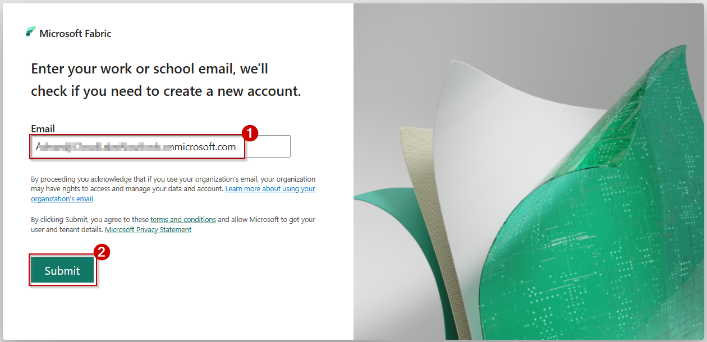
 
    > **Note:** Use your Azure Active Directory credentials to login to Fabric.
 
3. In Fabric, **click** on the **Workspaces**.
 
4. Click the **+ New workspace** button.
 
    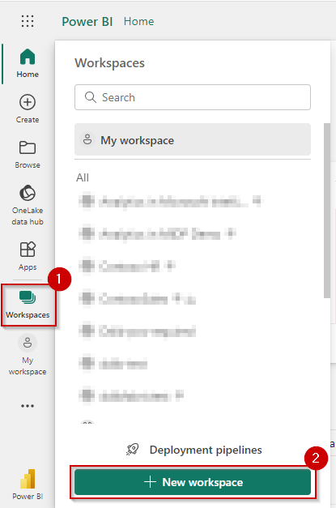
 
5. **Enter** the name **FSI_IQ_DPoC** and **click** on the **Apply** button.
 
>If the name 'FSI_IQ_DPoC' is already taken, add a suffix to the end of the name. For example: **FSI_IQ_DPoCTest**.
 
>The Workspace name cannot contain any spaces.
 
   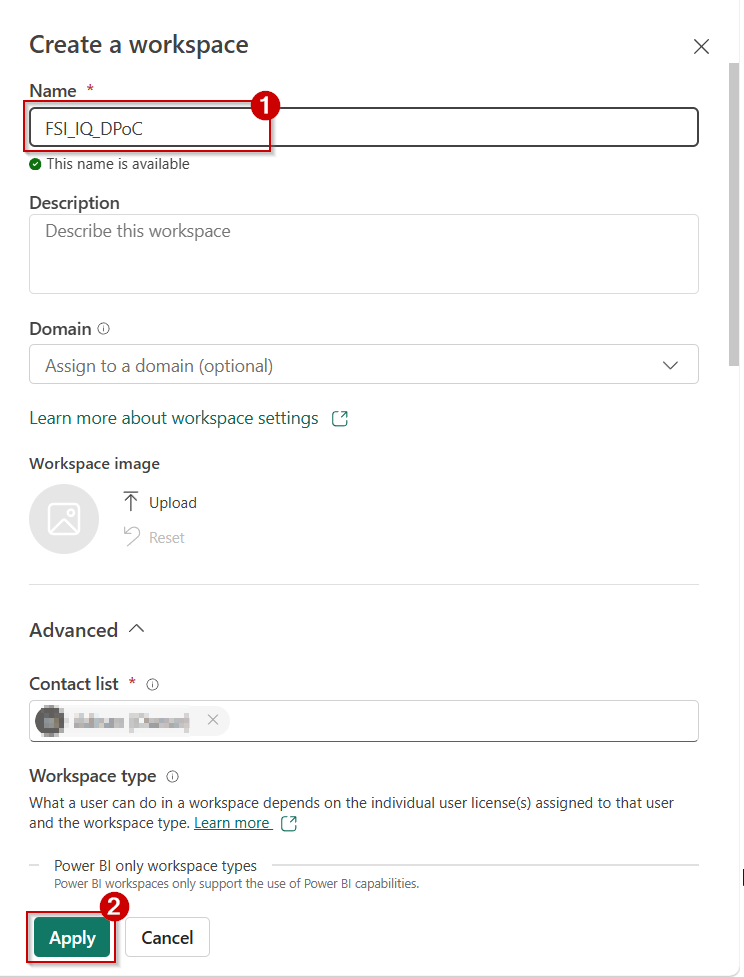
 
6. **Copy** the Workspace GUID or workspace ID from the address URL.
 
7. **Save** the GUID in a notepad for future reference.
 
    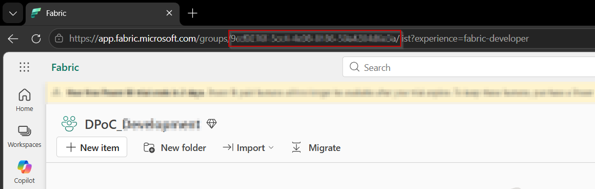
 
    > **Note:** This workspace ID will be used during PowerShell script execution.
 
8. In the workspace, click on **Workspace settings**.
 
   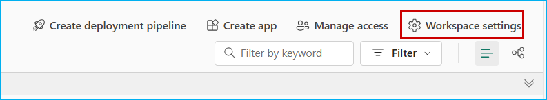
 
9. In the left side bar, click on **Workspace type** and then click on **Edit**.
 
   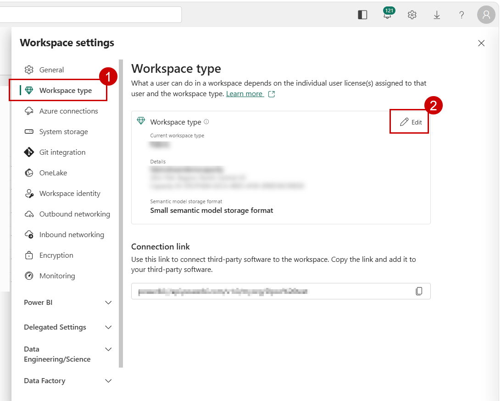
 
10. In the Workspace type pane, check the **Fabric** radio box.
 
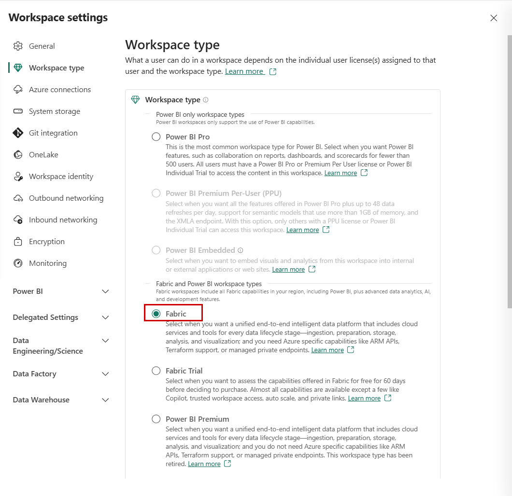
 
> **Note:** If your workspace has **Fabric capacity**, select it. Otherwise, deploy a new capacity in your Azure subscription.
 
> **Note:** Use Fabric F8 or higher capacity SKU.
 
11. **Scroll down** and select your Fabric capacity then click on **Select license**.
 
    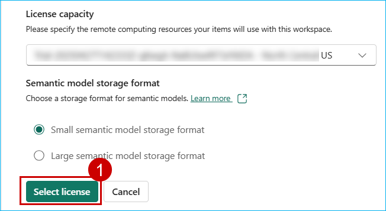
 
 
### Task 2: Run the Cloud Shell to provision the demo resources
 
 
>**Note:** In this task, we will execute a PowerShell script on CloudShell to deploy assets which will approximately take 30-35 minutes.
 
>**Note:** The list of resources is as follows:
 
**Azure resources:**
 
| Name | Type |
| :--- | :--- |
| storage<$suffix> | Microsoft.Storage/storageAccounts |
| asp-func-app-mortage-<$suffix> | Microsoft.Web/serverFarms |
| asp-fsi-<$suffix> | Microsoft.Web/serverFarms |
| func-app-mortage-<$suffix> | Microsoft.Web/sites |
| app-fsi-<$suffix> | Microsoft.Web/sites |
| hub-aifoundry-fsi-<$suffix> | Microsoft.CognitiveServices/accounts |
| srch-fsi-<$suffix> | Microsoft.Search/searchServices |
| hub-aifoundry-fsi-<$suffix> / proj-aifoundry-fsi-<$suffix> | Microsoft.CognitiveServices/accounts/projects |
 
**Fabric resources:**
| DisplayName | Type |
| :--- | :--- |
| FSI_IQ_Agent_<$suffix> | DataAgent |
| eh_fsi_<$suffix> | Eventhouse |
| Ingest_Marketing_Signal_<$suffix> | Eventstream |
| FSI_Ontology_<$suffix>_graph_<auto-generated> | GraphModel |
| FSI_Real_Time_Dashboard_<$suffix> | KQLDashboard |
| eh_fsi_<$suffix> | KQLDatabase |
| fsiLakehouse_<$suffix> | Lakehouse |
| aiLakehouse_<$suffix> | Lakehouse |
| FSI_Ontology_<$suffix>_lh_<auto-generated> | Lakehouse |
| Generate_Realtime_Marketing_Signal_data | Notebook |
| FSI_Ontology_<$suffix> | Ontology |
| FSI_Operations_Agent_<$suffix> | OperationsAgent |
| MortgagePerformanceDashboard | Report |
| FSI_IQ_Model_<$suffix> | SemanticModel |
| MortgagePerformanceDashboard | SemanticModel |
| fsiLakehouse_<$suffix> | SQLEndpoint |
| aiLakehouse_<$suffix> | SQLEndpoint |
| FSI_Ontology_<$suffix>_lh_<auto-generated> | SQLEndpoint |
 
 
---
 
 
1. **Open** the Azure Portal by clicking on the button below:
 
<a href='https://portal.azure.com/' target='_blank'></a>
 
> **Note:** If prompted, use your Azure Active Directory credentials to login to Azure, the same one you used for Fabric.
 
2. In the Azure portal, select the **Terminal icon** to open Azure Cloud Shell.
 
    
 
3. **Click** on **PowerShell**.
 
    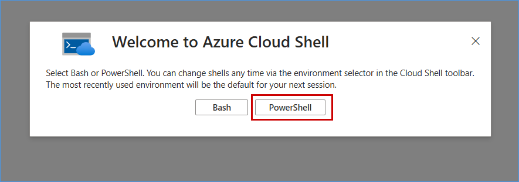
 
4. Select the **Subscription** and click on **Apply**.
 
    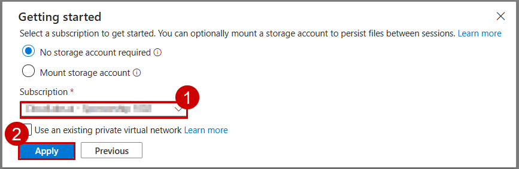
 
    > **Note:** If you already have a storage mounted for Cloud Shell, you will not get this prompt.
 
5. In the Azure Cloud Shell window, ensure that the **PowerShell** environment is selected.
 
    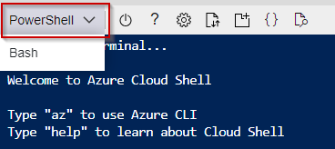
 
6. **Expand** the Cloudshell window.
 
    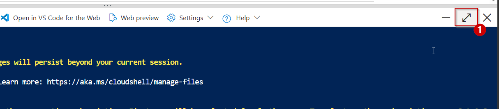
 
    >**Note:** All the cmdlets used in the script work best in PowerShell .	
 
    >**Note:** Use **Ctrl+C** to copy and **Shift+Insert** to paste, as **Ctrl+V** is NOT supported by Cloud Shell.
 
7. Enter the following **command** to clone the repository files in Cloud Shell.
 
Command:
 
```
git clone -b fsi-iq --depth 1 --single-branch https://github.com/microsoft/Azure-Analytics-and-AI-Engagement.git fsi
```
 
 
  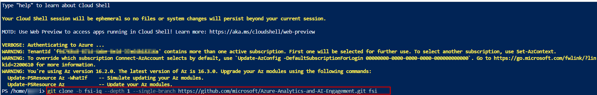
 

> **Note:** If you get **File already exists.** error, please execute the following command to delete existing clone and then re-clone:
```
rm fsi -r -f 
```
> **Note**: When executing scripts, it is important to let them run to completion. Some tasks may take longer than others to run. When a script completes execution, you will be returned to a command prompt.
 
8. **Execute** the PowerShell script with the following command:
```
cd ./fsi/fsi
```
 
```
./fsiSetup.ps1
```
   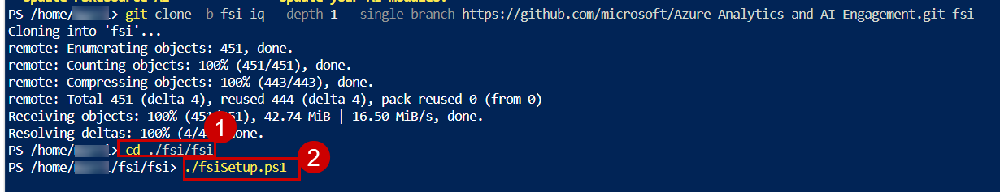
 
9. **Press** **Y** and click on the **Enter** button.
    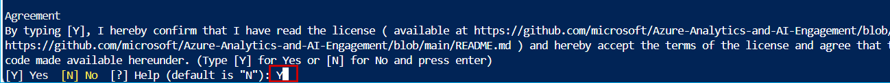
 
10. From the Azure Cloud Shell, **copy** the authentication code. You will need to enter the code in the next step.
 
11. **Click** the link [https://microsoft.com/devicelogin](https://microsoft.com/devicelogin) and a new browser window will launch.
 
    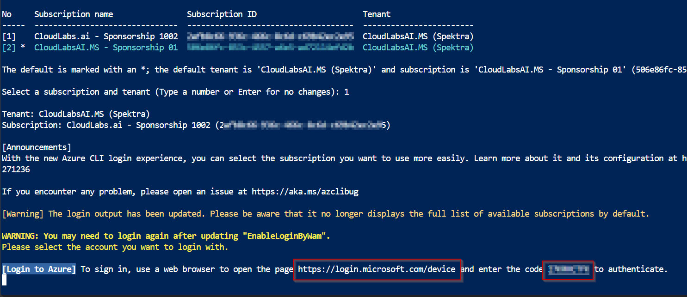
12. **Paste** the authentication code and click on the **Next** button.
 
    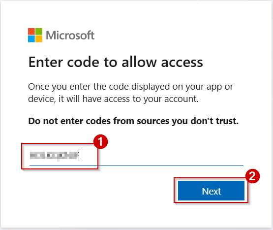
 
13. **Select** the user account you used for logging into the Azure Portal in [Task 1](#task-1-fabric-workspace-creation).
 
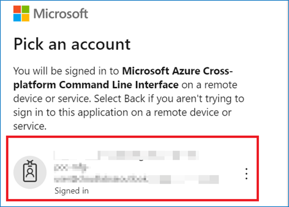
 
14. **Click** on the **Continue** button.
 
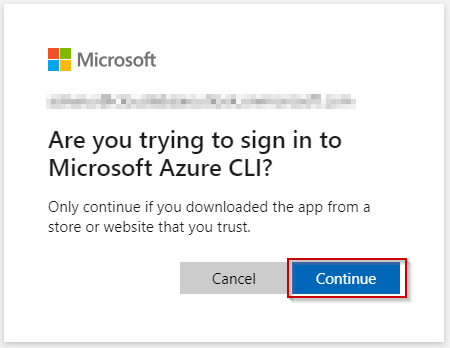
 
15. **Close** the browser tab when you see the message box.
 
    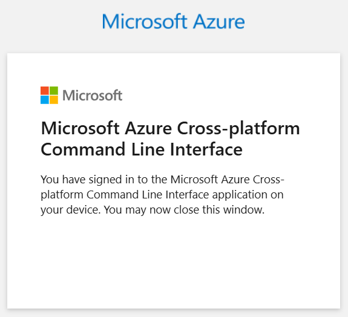   
 
16. **Navigate back** to your **Azure Cloud Shell** execution window.
 
17. **Enter** the number on the left side of your subscription name from the screen and press **Enter** key.
 
    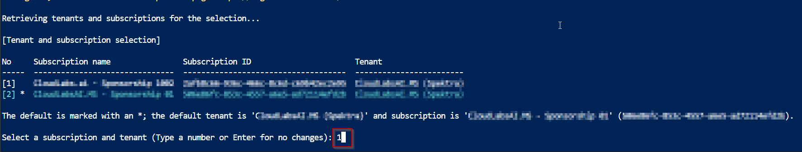

> **Notes:**
> - Users with a single subscription won't be prompted to select a subscription.
> - The subscription highlighted in Light blue will be selected by default, if you do not enter a desired subscription. Please select the subscription carefully as it may break the execution further.
> - While you are waiting for the processes to complete in the Azure Cloud Shell window, you'll be asked to enter the code three times. This is necessary for performing the installation of various Azure Services and preloading the data.
 
18. **Copy** the code on the screen to authenticate the **Azure PowerShell script** for creating reports in Power BI. **Click** the link [https://microsoft.com/devicelogin](https://microsoft.com/devicelogin).
 
    
 
19. A new browser window will launch. **Paste** the **authentication code** you copied from the shell above and press **Enter**.
 
    
 
20. **Select** the user account that is used for logging into the Azure Portal in [Task 1](#task-1-fabric-workspace-creation).
 
    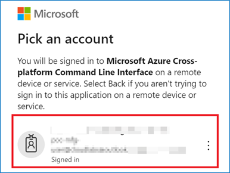
 
21. Click on **Continue**.
 
    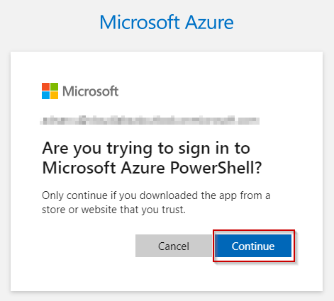
 
22. **Close** the browser tab when you see the message box.
 
    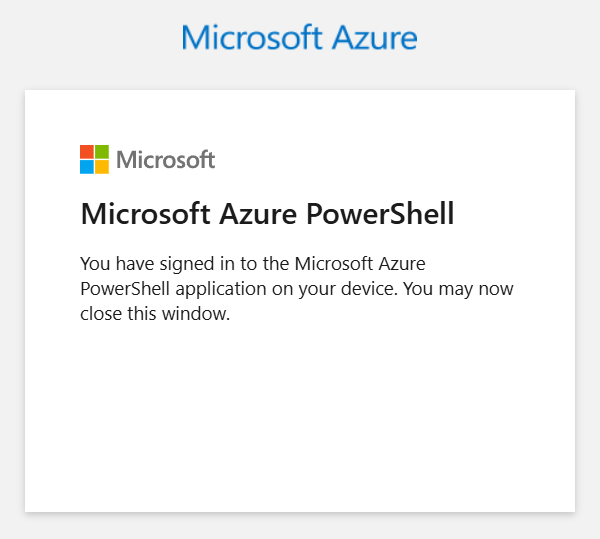
 
23. Go back to the **Azure Cloud Shell** execution window.
 
24. **Click** on the URL [https://microsoft.com/devicelogin](https://microsoft.com/devicelogin).
 
    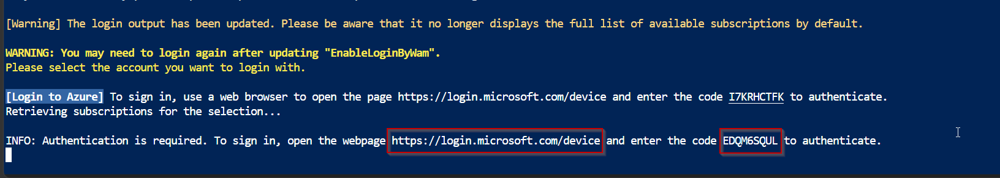
25. In the new browser tab, **paste** the code you copied and **click** on **Next**.
 
  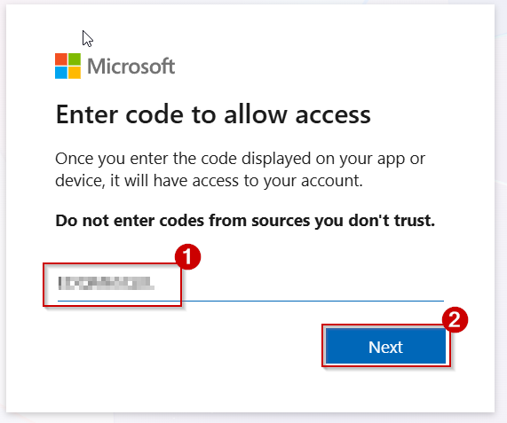
 
**Note:** Be sure to provide the device code before it expires and let the script run until completion.
 
26. Select the **user account** you used to log into the **Azure Portal** in [Task 1](#task-1-fabric-workspace-creation).
 
    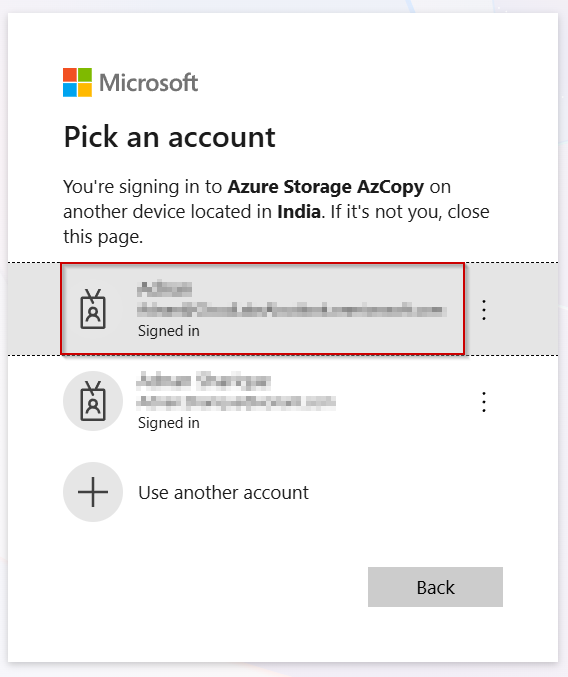
 
27. Click on **Continue**.
 
    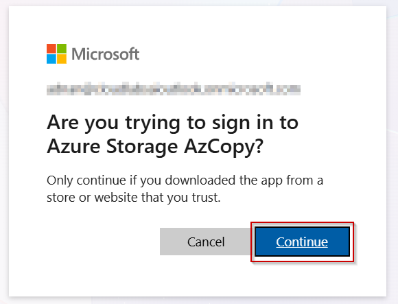
 
28. **Close** the browser tab when you see the message box.
 
    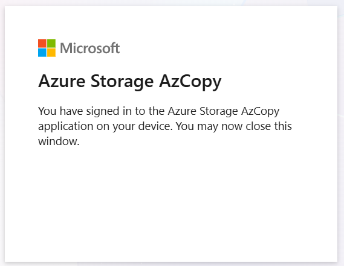

29. **Click** on the URL [https://microsoft.com/devicelogin](https://microsoft.com/devicelogin).
 
    
30. In the new browser tab, **paste** the code you copied and **click** on **Next**.
 
  
 
**Note:** Be sure to provide the device code before it expires and let the script run until completion.
 
31. Select the **user account** you used to log into the **Azure Portal** in [Task 1](#task-1-fabric-workspace-creation).
 
  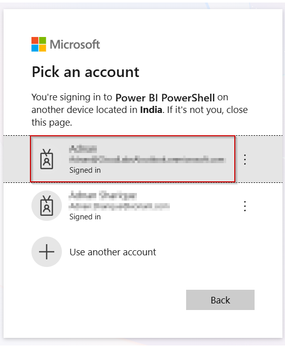
 
32. Click on **Continue**.
 
  
 
33. **Close** the browser tab when you see the success message box and go back to your Azure portal cloudshell screen.
 
34. **Enter** the Region for deployment with the necessary resources available, preferably "eastus".
(Ex.: eastus, eastus2, westus, westus2, etc.) 

**Recommendation:** Prefer East US and ensure the Fabric capacity is deployed in a region that supports Fabric Operations agents.

  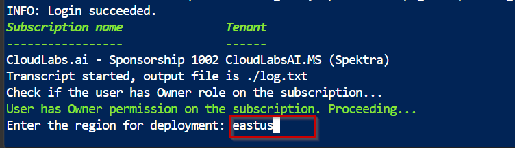
 
35. **Enter** the Workspace ID that you copied in [Task 1](#task-1-fabric-workspace-creation) consecutively.
 
  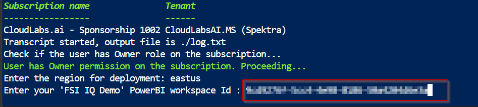
 
> **Note:** During the execution of the script, you might see outputs and warnings displayed in red color in between while text outputs. 
Do not treat every red message as an error. Focus on the outputs and only consider them as errors only if it explicilty indicates an error. 
Two examples are provided below: one showing a warning and another showing normal output.
 
>Example 1
 
  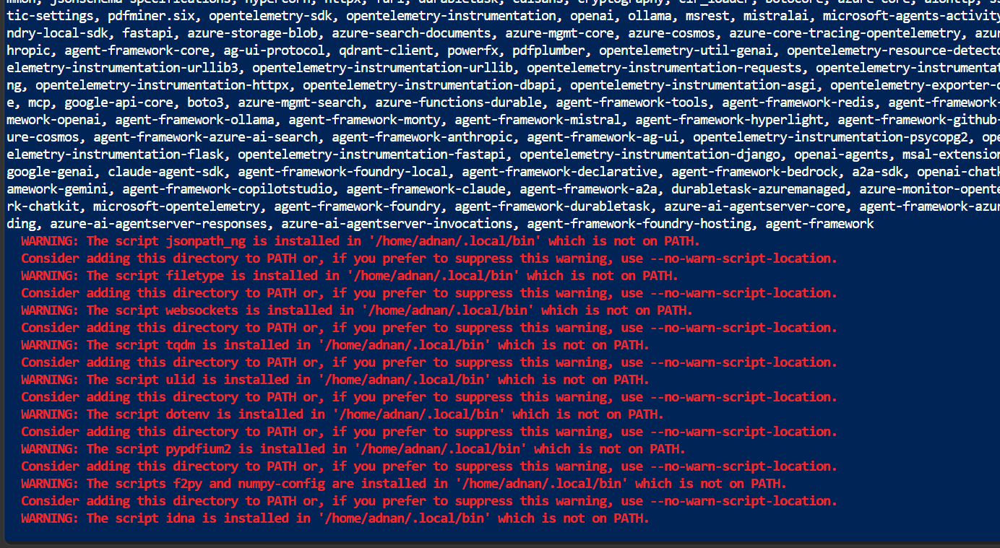
 
>Example 2
 
  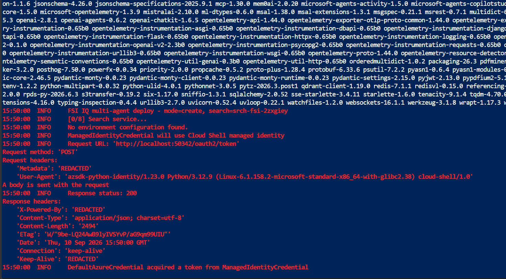
 
> **Note:** You may see errors in script execution, if you  do not have necessary permissions for Cloud Shell to manipulate your Power BI workspace. In that case, follow this document [Power BI Embedding](https://github.com/microsoft/Azure-Analytics-and-AI-Engagement/blob/fsi/fsidemo/Power%20BI%20Embedding.md) to get the necessary permissions assigned. You’ll have to manually upload the reports to your Power BI workspace by downloading them from this location [Reports](https://dev.azure.com/Cloud-AI-Demo-Delivery/Cloud%20and%20AI%20Demo%20Delivery/_git/Dpoc?path=/fsi/artifacts/reports&version=GBfsi_iq_dpoc).
 
36. A screen similar to the screenshot below indicates the end of your script execution.
 
  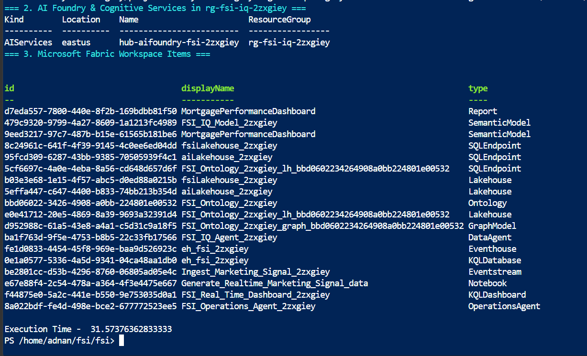
 
 
### Task 3: Microsoft Foundry Setup
 
>**Note:** User should be 'Foundry User' to perform the below steps.
 
>**Note:** In this task, we will create the **FSIIQ-Workflow** supervisor-routed workflow.
 
>**Note:** We will now create the **FSIIQ-Workflow** in the Foundry portal.
 
1. Back in the Resource Group, in the **Filter for any field...** box, **type** **hub**.
 
    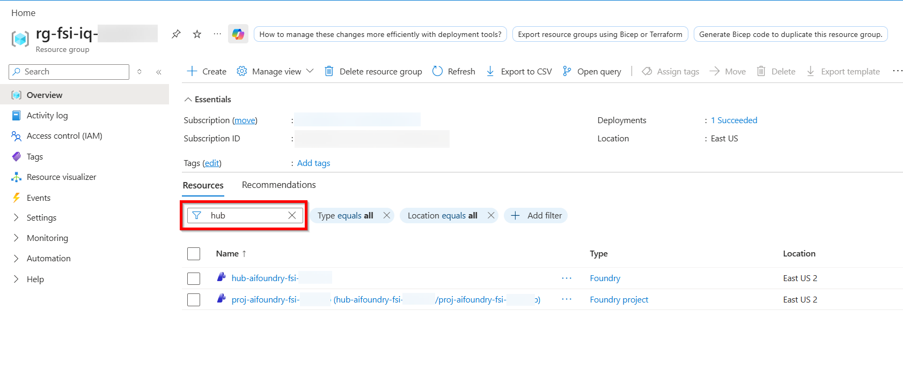
 
2. From the filtered results, **click** on the **hub-aifoundry-fsi-...**.
 
    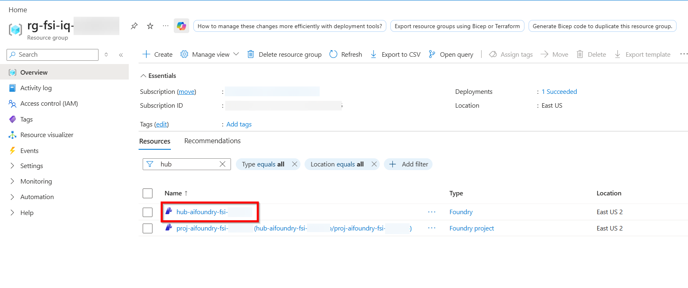
 
3. On the **Overview** page, **click** on the **Go to Foundry portal** button.
 
    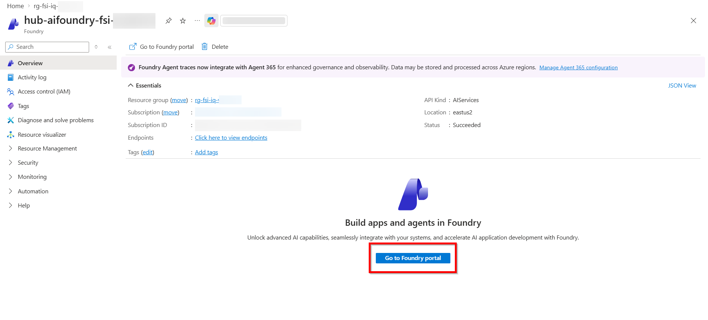
 
4. In the **Microsoft Foundry** portal, **click** on **Build** in the top navigation bar.
 
    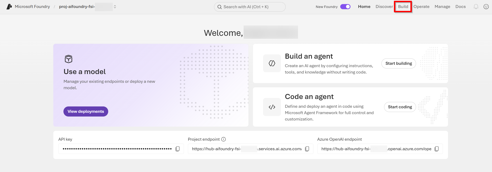
 
5. Under **Agents**, click on the **Workflows** tab.
 
    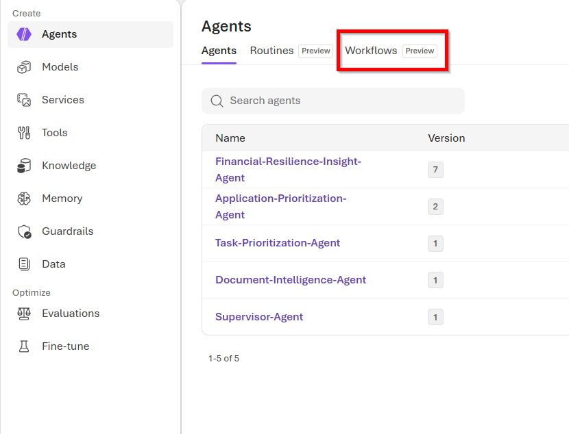
 
6. Click on the **Create** button.
 
    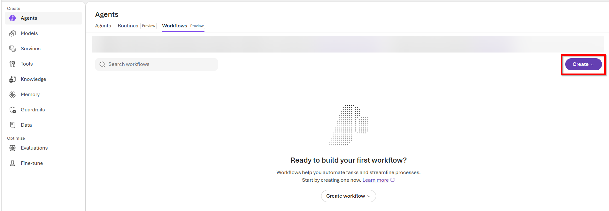
 
7. From the **dropdown**, click on **Blank workflow**.
 
    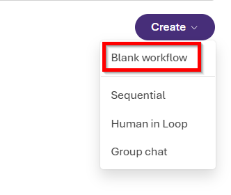
 
8. On the top-right toggle, click on **YAML**.
 
    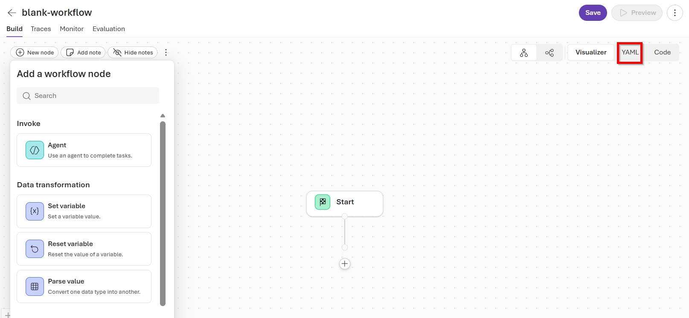
 
9. **Remove** the default content in the editor and **paste** the YAML below:
 
```yaml
kind: workflow
trigger:
  kind: OnConversationStart
  id: trigger_wf
  actions:
    # 1) Supervisor classifies the request and returns exactly ONE agent name.
    #    autoSend:false  -> the routing label is captured silently and is NOT
    #    surfaced to the caller (the old file had autoSend:true, which leaked
    #    "Document-Intelligence-Agent" etc. into the response).
    - kind: InvokeAzureAgent
      id: action-1768237693978
      agent:
        name: Supervisor-Agent
      input:
        messages: =System.LastMessage
      output:
        autoSend: false
        messages: Local.Var5755
 
    # 2) Route to the matching specialist. Every specialist receives the ORIGINAL
    #    user message (=System.LastMessage) and shares the conversation
    #    (=System.ConversationId); its reply is the answer (autoSend:true).
    #    Only the four agents the Supervisor can actually emit are present -
    #    the Underwriting / KYC / Closing / Scheduling branches were dead
    #    (the Supervisor never returns those labels) and have been removed.
    - kind: ConditionGroup
      id: action-1768237712578
      conditions:
        - id: if-action-1768237712578-0
          condition: =Last(Local.Var5755).Text = "Application-Prioritization-Agent"
          actions:
            - kind: InvokeAzureAgent
              id: action-1768237857121
              agent:
                name: Application-Prioritization-Agent
              conversationId: =System.ConversationId
              input:
                messages: =System.LastMessage
              output:
                autoSend: true
 
        - id: if-action-1768237712578-0p9xo7ga
          condition: =Last(Local.Var5755).Text = "Document-Intelligence-Agent"
          actions:
            - kind: InvokeAzureAgent
              id: action-1768237897049
              agent:
                name: Document-Intelligence-Agent
              conversationId: =System.ConversationId
              input:
                messages: =System.LastMessage
              output:
                autoSend: true
 
        - id: if-action-1768237712578-cpzxc0hn
          condition: =Last(Local.Var5755).Text = "Financial-Resilience-Insight-Agent"
          actions:
            - kind: InvokeAzureAgent
              id: node-1773834207862
              agent:
                name: Financial-Resilience-Insight-Agent
              conversationId: =System.ConversationId
              input:
                messages: =System.LastMessage
              output:
                autoSend: true
 
        - id: if-action-1768237712578-9vvx6hjd
          condition: =Last(Local.Var5755).Text = "Task-Prioritization-Agent"
          actions:
            - kind: InvokeAzureAgent
              id: node-1776060137192
              agent:
                name: Task-Prioritization-Agent
              conversationId: =System.ConversationId
              input:
                messages: =System.LastMessage
              output:
                autoSend: true
 
      elseActions:
        - kind: SendActivity
          id: action-1768238054760
          activity: >-
            I couldn't route that request. Try asking about which application to
            prioritize, validating a customer's documents, a customer's financial
            resilience, or your calendar / schedule.
id: ""
name: FSIIQ-Workflow
description: >-
  FSI IQ supervisor-routed workflow. Start -> Supervisor-Agent (classifies and
  returns one agent name) -> one of four specialists: Application-Prioritization,
  Document-Intelligence, Financial-Resilience-Insight, Task-Prioritization.
  Mirrors the code-first orchestrator in main.py (kept as the Agent Framework
  migration artifact; Foundry Workflows retire 2026-12-01).
```
 
 
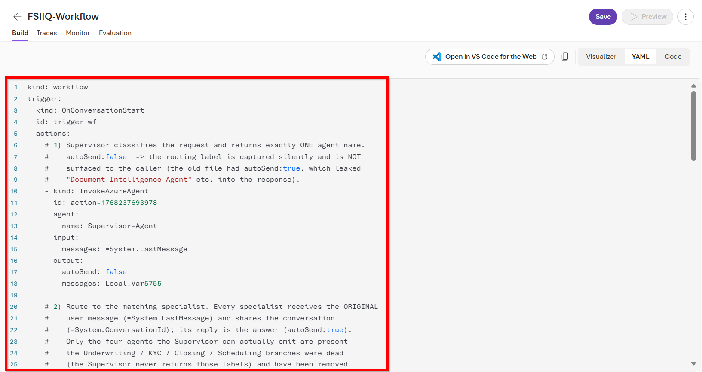
 
10. Click on the **Save** button in the top-right corner.
 
    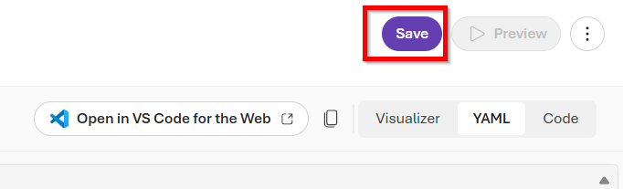
 
11. In the **Give your workflow a name** dialog, ensure the name is **FSIIQ-Workflow** and **click** on **Save**.
 
    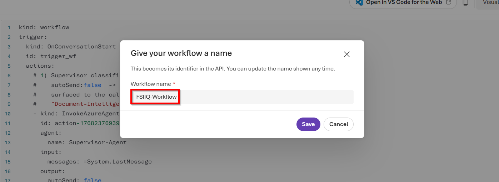
 
>**Note:** The workflow name must be exactly **FSIIQ-Workflow**. The Function App invokes the workflow by this name (the **WORKFLOW_NAME** app setting), and the invocation resolves to the workflow's **active version**. Saving is sufficient — the first save creates **Version 1**, and each later save increments the version. The workflow does **NOT** need to be published for the Function App to call it. If you rename the workflow here, update the **WORKFLOW_NAME** app setting to match.
 
## After the deployment completes
 
Complete this once Task 2 has finished successfully.
 
* Ensure that your Entra ID user has the **Storage Blob Data Owner** role assigned on the storage account whose name starts with **storage**.

* When any user visits the Foundry project for the first time:

  - The user would require to assign himself/herself the **Foundry User** role by clicking on this button.

  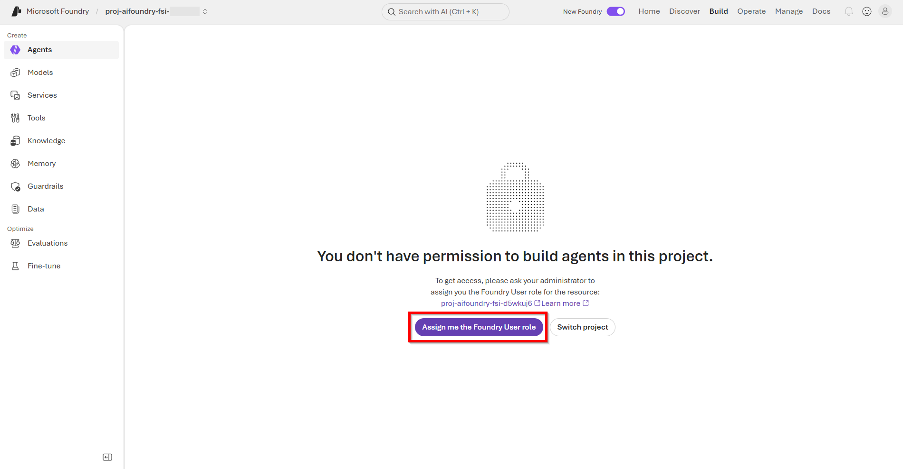

  - Once confirmed, the user needs to wait for at least 5 minutes for the role to propagate and take effect.

  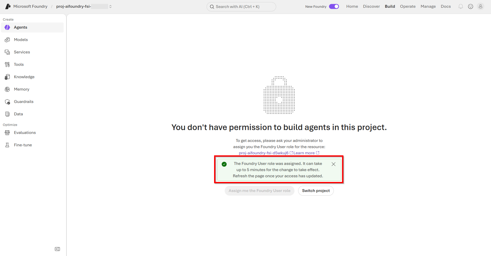

  - After the role has propagated and taken effect, the Foundry fleet of agents will be visible to the user.

  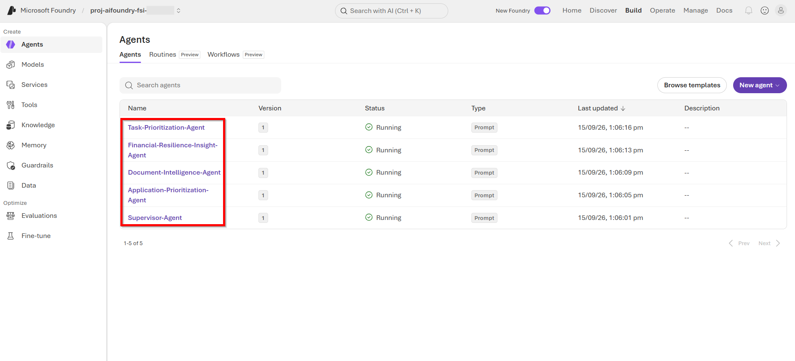


