## What is DPoC?
DREAM PoC Accelerators (DPoC) are packaged DREAM Demos using ARM templates and automation scripts (with a demo web application, Power BI reports, Fabric resources, ML Notebooks, etc.) that can be deployed in a customer’s environment.

## Purpose & Vision
Partners can deploy DREAM Demos in their own Azure subscriptions and demonstrate them live to their customers. 
Partnering with Microsoft sellers, partners can deploy the Industry scenario DREAM demos into customer subscriptions. 
Customers can play, get hands-on experience navigating through the demo environment in their own subscription, and show it to their own stakeholders.

## :exclamation:IMPORTANT NOTES:

1. **Read the [license agreement](https://github.com/microsoft/Azure-Analytics-and-AI-Engagement/blob/main/CDP-Retail/license.md) and [disclaimer](https://github.com/microsoft/Azure-Analytics-and-AI-Engagement/blob/main/CDP-Retail/disclaimer.md) before proceeding, as your access to and use of the code made available hereunder is subject to the terms and conditions made available therein.**
2. Without limiting the terms of the [license](https://github.com/microsoft/Azure-Analytics-and-AI-Engagement/blob/main/CDP-Retail/license.md) , any Partner distribution of the Software (whether directly or indirectly) must be conducted through Microsoft’s Customer Acceleration Portal for Engagements (“CAPE”). CAPE is accessible to Microsoft employees. For more information regarding the CAPE process, contact your local Data & AI specialist or CSA/GBB.
3. It is important to note that **Azure hosting costs** are involved when DREAM PoC Accelerator is implemented in customer or partner Azure subscriptions. DPoC hosting costs are not covered by Microsoft for partners or customers.
4. Since this is a DPoC, there are certain resources available to the public. **Please ensure that proper security practices are followed before adding any sensitive data to the environment.** To strengthen the environment's security posture, **leverage Azure Security Centre.** 
5.  In case of questions or comments; please email **[dreamdemos@microsoft.com](mailto:dreamdemos@microsoft.com).**

# Copyright - 2025

© 2025 Microsoft Corporation. All rights reserved.   

By using this demo/lab, you agree to the following terms: 

The technology/functionality described in this demo/lab is provided by Microsoft Corporation for purposes of obtaining your feedback and to provide you with a learning experience. You may only use the demo/lab to evaluate such technology features and functionality and provide feedback to Microsoft.  You may not use it for any other purpose. You may not modify, copy, distribute, transmit, display, perform, reproduce, publish, license, create derivative works from, transfer, or sell this demo/lab or any portion thereof. 

COPYING OR REPRODUCTION OF THE DEMO/LAB (OR ANY PORTION OF IT) TO ANY OTHER SERVER OR LOCATION FOR FURTHER REPRODUCTION OR REDISTRIBUTION IS EXPRESSLY PROHIBITED. 

THIS DEMO/LAB PROVIDES CERTAIN SOFTWARE TECHNOLOGY/PRODUCT FEATURES AND FUNCTIONALITY, INCLUDING POTENTIAL NEW FEATURES AND CONCEPTS, IN A SIMULATED ENVIRONMENT WITHOUT COMPLEX SET-UP OR INSTALLATION FOR THE PURPOSE DESCRIBED ABOVE. THE TECHNOLOGY/CONCEPTS REPRESENTED IN THIS DEMO/LAB MAY NOT REPRESENT FULL FEATURE FUNCTIONALITY AND MAY NOT WORK THE WAY A FINAL VERSION MAY WORK. WE ALSO MAY NOT RELEASE A FINAL VERSION OF SUCH FEATURES OR CONCEPTS.  YOUR EXPERIENCE WITH USING SUCH FEATURES AND FUNCITONALITY IN A PHYSICAL ENVIRONMENT MAY ALSO BE DIFFERENT.


## Contents

<!-- TOC -->

- [Pre-requisites](#Pre-requisites)
- [Task 1: Power BI Workspace creation](#task-1-power-bi-workspace-creation)
- [Task 2: Run the Cloud Shell to provision the demo resources](#task-2-run-the-cloud-shell-to-provision-the-demo-resources)
- [Task 3: Creating a Shortcut in a Lakehouse](#task-3-creating-a-shortcut-in-a-lakehouse)
- [Task 4: Use the Data Pipelines/Dataflow for a No Code Low Code experience](#task-4-use-the-data-pipelinesdataflow-for-a-no-code-low-code-experience)
- [Task 5: Executing Notebooks](#task-5-executing-notebooks)
- [Task 6: Creating Mirrored Azure Cosmos DB](#task-6-creating-mirrored-azure-cosmos-db)
- [Task 7: Get data into Eventhouse](#task-7-get-data-into-eventhouse)
- [Task 8: Get data into QuerySet](#task-8-get-data-into-queryset)
- [Task 9: Updating Semantic Models with Cloud Connection](#task-9-updating-semantic-models-with-cloud-connection)
- [Task 10: Creating Semantic Model for PowerBI Copilot](#task-10-creating-semantic-model-for-powerbi-copilot)


<!-- /TOC -->

## Pre-requisites

* An Azure Account with the ability to create Fabric Workspace.
* A Power BI with Fabric License to host Power BI reports.
* Make sure the user deploying the script has atleast a 'Contributor' level of access on the 'Subscription' on which it is being deployed.
* Make sure your Power BI administrator can provide service principal access on your Power BI tenant.
* Make sure to register the following resource providers with your Azure Subscription:
   - Microsoft.Fabric
   - Microsoft.SQLSever
   - Microsoft.StorageAccount
   - Microsoft.AppService
   - Microsoft.Databricks
   - Microsoft.Azure Cosmos DB account
* You must only execute one deployment at a time and wait for its completion. Running multiple deployments simultaneously is highly discouraged, as it can lead to deployment failures.
* Select a region where the desired Azure Services are available. If certain services are not available, deployment may fail. See [Azure Services Global Availability](https://azure.microsoft.com/en-us/global-infrastructure/services/?products=all) for understanding target service availability (Consider the region availability for Synapse workspace, Iot Central and cognitive services while choosing a location).
* In this Accelerator, we have used the following features of Azure Databricks:
     - Serverless SQL warehouses
	 - Serverless DLT pipelines
	 - Model serving
	 - Vector search

> **Note:** There are some features that are supported only in a subset of regions.
- To check supported regions [click here](https://learn.microsoft.com/en-us/azure/databricks/resources/supported-regions). 
- Choose the subscription where all the features listed above are available. As of 17-07-2024 eastus, eastus2, westus are having all the required features.
* In this Accelerator, we have converted real-time reports into static reports for the user's ease, but have covered the entire process to configure real-time datasets. Using those real-time datasets, you can create real-time reports.
* Make sure you use the same valid credentials to log into Azure and Power BI.
* Once the resources have been set up, ensure that your AD user workspace have the “Storage Blob Data Owner” role assigned on the storage account name starting with “storage”.
* Review the [License Agreement](https://github.com/microsoft/Azure-Analytics-and-AI-Engagement/blob/main/CDP-Retail/license.md) before proceeding.

>**Note:** This demo contains PowerBI Copilot, pre-requisites of which can be found [HERE](https://github.com/microsoft/Azure-Analytics-and-AI-Engagement/blob/microsoftfabric/fabric/PowerBI%20Copilot/PowerBI%20Copilot%20Pre-requisites.md)


<!-- ## Enable PowerBI Tenant Settings

1. Navigate to https://app.powerbi.com/home?experience=power-bi

2. Click on **Settings** and select **Admin portal**.
   


3. Search for **service principal** and enable **Service principals can use Fabric APIs** then apply the settings for **Entire organization**. Click on the **apply** button.

 -->


### Task 1: Power BI Workspace creation

1. Click [HERE](https://app.powerbi.com/) to open **Power BI**.

2. **Sign** into Power BI.

	

	> **Note:** Use your Azure Active Directory credentials to login to Power BI.

3. In **Power BI** service, click on **Workspaces**.

4. Click the **+ New workspace** button.

	

5. Enter the name **Woodgrove** and click on the **Apply** button.

>**Note:** The name of the workspace should be in camel case, i.e. the first word starting with a small letter and then the second word staring with a capital letter with no spaces in between.

>If name 'Woodgrove' is already taken, add a suffix to the end of the name. For example: **WoodgroveTest**.

>Workspace name cannot contain any spaces.

   

6. Copy the **Workspace GUID/ID** from the address URL.

7. **Save** the **GUID** in a notepad for future reference.

	

	> **Note:** This workspace ID will be used during Powershell script execution.

8. In the workspace, click on **Workspace settings**.

	

9. In the left pane of the side bar, click on **License info**, and click on **Edit**.

	

10. check the **Trial** radio box.


>**Note:** If your workspace have **Fabric capacity**, select it or else use 'Trial' License type. 

11. **Scroll down** and click on **Select license**.

	


>**Note:** Make sure to add this workspace as a Fabric Trial/Fabric capacity License and note down the names of the **Workspace** and **Lakehouses**. These will be used during script execution (Task 2).


### Task 2: Run the Cloud Shell to provision the demo resources

>**Note:** For this Demo, we have assets in an Azure resource group as well as Fabric Workspace.

>**Note:** In this task, we will execute a Powershell script on Cloudshell to create those assets.

>**Note:** List of the resources are as follows:

**Azure resources:**
|NAME	|TYPE|
|-----|-----|
|mssql{suffix}	|SQL server	|
|SalesDb (mssql{suffix}/SalesDb)	|SQL database	|
|stfsi2{suffix}	|Storage account	|
|cosmosdb{suffix}	|Azure Cosmos DB account	|
|app-fsi2webapp-{suffix}|App Service	|
|asp-fsi2webapp-{suffix}	|App Service Plan	|
|accounts-cog-fsi2-{suffix}	|Azure AI services multi-service account	|
| | |


**Fabric resources:**
| displayName | type |
|-----------|------|
|FSI_lakehouse_Bronze_{suffix}                                                |Lakehouse|
|FSI_lakehouse_Bronze_{suffix}                                                | SemanticModel|
|FSI_lakehouse_Bronze_{suffix}                                          |     SQLEndpoint|
|FSI_lakehouse_Silver_{suffix}                            |                     Lakehouse|
|FSI_lakehouse_Silver_{suffix}                                              |   SemanticModel|
|FSI_lakehouse_Silver_{suffix}                                             |    SQLEndpoint|
|Sales_Lakehouse                                   |                   Lakehouse|
|Sales_Lakehouse                                                       |SemanticModel|
|Sales_Lakehouse                                                      |  SQLEndpoint|
|01 World Map               |              Report|
|02 ESG Report                    |            Report|
|03 MSCI report                                      |           Report|
|07 Finance Report                                      |          Report|
|08 FSI Twitter Report                                 |         Report|
|09 FSI HTAP                                                    |        Report|
|14 FSI CCO Dashboard                                               |       Report|
|16 ESGDashboardV2_KPIandGraphs                                                |      Report|
|18 FSI Head of Financial Intelligence                                                |     Report|
|22 Finance Report KPI CFO Dashboard                                                |    Report|
|Call Center Report After OpenAI            |                Report|
|Call Center Report Before OpenAI                  |              Report|
|CEO Dashboard New FSI Dec                                    |             Report|
|CEO Dashboard New FSI Jan                                  |            Report|
|CEO Dashboard New FSI June                               |           Report|
|CEO Dashboard New FSI Sep                                                    |          Report|
|Post Meeting Report                                                   |          Report|
|Wealth Advisor Report_New                                                    |          Report|
|01 World Map               |              Semantic model|
|02 ESG Report                    |            Semantic model|
|03 MSCI report                                      |           Semantic model|
|07 Finance Report                                      |          Semantic model|
|08 FSI Twitter Report                                 |         Semantic model|
|09 FSI HTAP                                                    |        Semantic model|
|14 FSI CCO Dashboard                                               |       Semantic model|
|16 ESGDashboardV2_KPIandGraphs                                                |      Semantic model|
|18 FSI Head of Financial Intelligence                                                |     Semantic model|
|22 Finance Report KPI CFO Dashboard                                                |    Semantic model|
|Call Center Report After OpenAI            |                Semantic model|
|Call Center Report Before OpenAI                  |              Semantic model|
|CEO Dashboard New FSI Dec                                    |             Semantic model|
|CEO Dashboard New FSI Jan                                  |            Semantic model|
|CEO Dashboard New FSI June                               |           Semantic model|
|CEO Dashboard New FSI Sep                                                    |          Semantic model|
|Post Meeting Report                                                    |          Semantic model|
|Wealth Advisor Report_New                                                   |          Semantic model|
|00 Copilot Notebook in Data Science & Data Engineering.ipynb|   Notebook|
|01 Raw Data to Lakehouse (Bronze) Code First Experience.ipynb     |            Notebook|
|02 Bronze to Silver Layer Medallion Architecture.ipynb     |           Notebook|
|03. Churn Prediction for Retail Banking Scenario.ipynb|        Notebook|
|Eventhouse-Real-Time_Data         |       Eventhousehouse|
|Eventhouse-Real-Time_Data                                     |                  KQLDatabase|
|  |  |

1. Click on the following button to open the **Azure Portal**.

<a href="https://portal.azure.com/" target="_blank">  </a>

2. In the Azure portal, select the **Terminal icon** to open **Azure Cloud Shell**.

	

3. click on the **PowerShell**.

	

4. Select **No Storage account required**, **Subscription** and then Click on **Apply** button.

	

5. In the Azure Cloud Shell window, ensure that the **PowerShell** environment is selected.

	

	>**Note:** All the cmdlets used in the script work best in Powershell.	

	>**Note:** Please use 'Ctrl+C' to copy and 'Shift+Insert' to paste, as 'Ctrl+V' is NOT supported by CloudShell.

6. Enter the following command to clone the repository files in cloudShell.

Command:
```
git clone -b fsi2.0-with-Azure-Databricks --depth 1 --single-branch https://github.com/microsoft/Azure-Analytics-and-AI-Engagement.git fsi2.0-with-Azure-Databricks

```

   
	
   > **Note:** If you get **File already exist.** error, please execute the following command to delete existing clone and then reclone:
```
 rm fsi2.0-with-Azure-Databricks -r -f 
```
   > **Note**: When executing scripts, it is important to let them run to completion. Some tasks may take longer than others to run. When a script completes execution, you will be returned to a command prompt. 

7. Execute the **PowerShell** script with the following commands:
```
cd fsi2.0-with-Azure-Databricks/fsi2.0-with-Azure-Databricks
```

```
./fsi2Setup.ps1
```
    
   

8. Enter **Y** and then click on Enter.

	

9. From the Azure Cloud Shell, copy the **authentication code**. You will need to enter this code in next step.

10. Click the link [https://microsoft.com/devicelogin](https://microsoft.com/devicelogin) and a new browser window will launch.

	
     
11. Paste the **authentication code**.

	

12. Select the **user account** that is used for logging into the **Azure Portal** in [Task 1](#task-1-create-a-resource-group-in-azure).

	

13. Click on **Continue** button.

	

14. Close the **browser tab** when you see the following message box.

	   

15. Navigate back to your **Azure Cloud Shell** execution window.

16. Copy your **subscription name** from the screen and **paste** it in the prompt.

    
	
	> **Notes:**
	> - Users with a single subscription won't be prompted to select a subscription.
	> - The subscription highlighted in yellow will be selected by default, if you do not enter a disired subscription. Please select the subscription carefully as it may break the execution further.
	> - While you are waiting for the processes to complete in the Azure Cloud Shell window, you'll be asked to enter the code four times. This is necessary for performing the installation of various Azure Services and preloading the data.


17. Copy the **code** on the screen to authenticate the Azure PowerShell script for creating reports in **Power BI**.

18. Click the link [https://microsoft.com/devicelogin](https://microsoft.com/devicelogin).

	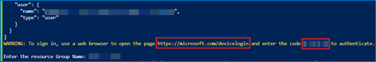

19. A new browser window will launch.

20. Paste the **authentication code** you copied from the shell above.

	

21. Select the **user account** that is used for logging into the Azure Portal in [Task 1](#task-1-create-a-resource-group-in-azure).

	

22. Click on **Continue**.

	

23. Close the **browser tab** once you see the message box.

	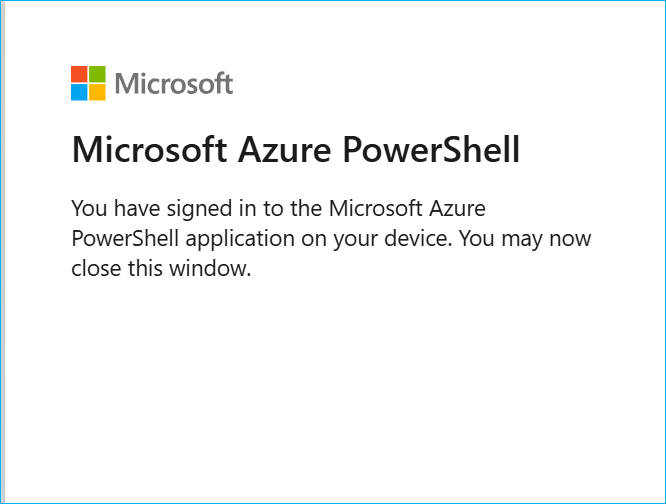

24. Go back to **Azure Cloud Shell** execution window.

25. Copy the **code** on screen to authenticate the Azure PowerShell script for creating reports in **Power BI**.

26. Click the link [https://microsoft.com/devicelogin](https://microsoft.com/devicelogin).

	

27. A new browser window will launch.

28. Paste the **authentication code** you copied from the shell above.

	

29. Select the **user account** that is used for logging into the Azure Portal in [Task 1](#task-1-create-a-resource-group-in-azure).

	

30. Click on **Continue**.

	

31. Close the **browser tab** once you see the message box.

	

32. Go back to **Azure Cloud Shell** execution window.


33. Enter the **Region** for deployment with the necessary resources available, preferably **"eastus"** (Ex.: eastus, eastus2, westus, westus2, etc).

	

34. Enter  the **Workspace ID** which you copied in [Task 1](#task-1-power-bi-workspace-and-lakehouse-creation) consecutively.


35. Enter your desired **SQL Password**.

	

>**Note:** Copy the password in Notepad for further reference.

36. You will get another code to authenticate the Azure PowerShell script for creating reports in Power BI. copy the code.

	> **Note:** You may see errors in script execution if you  do not have necessary permissions for cloudshell to manipulate your Power BI workspace. In that case, follow this document [Power BI Embedding](https://github.com/microsoft/Azure-Analytics-and-AI-Engagement/blob/fintax/fintaxdemo/Power%20BI%20Embedding.md) to get the necessary permissions assigned. You’ll have to manually upload the reports to your Power BI workspace by downloading them from this location [Reports](https://github.com/microsoft/Azure-Analytics-and-AI-Engagement/tree/fintax/fintaxdemo/artifacts/reports). 

37. click the link [https://microsoft.com/devicelogin](https://microsoft.com/devicelogin).

    
      
38. In the new browser tab, paste the **code** you copied from the shell in step 30 and click on **Next** button.

	

	> **Note:** Be sure to provide the device code before it expires and let the script run until completion.

39. Select the **user account** you used to log into the **Azure Portal** in [Task 1](#task-1-create-a-resource-group-in-azure). 

	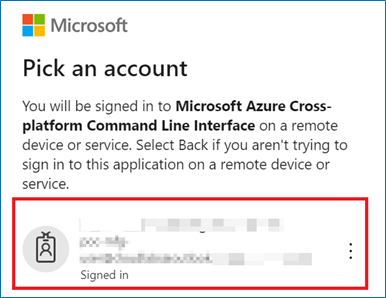

40. click on **Continue**.

	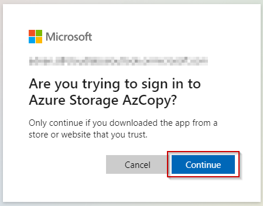

41. Close the **browser tab** when you see the message box.

	

	>**Note:** During script execution, you need to note the resource group which gets created, since a resource group with unique suffix is created each time the script is executed.

<!-- 42. **Navigate back** to your Azure Cloud Shell execution window.

	> **Note:** Deployment will take approximately 20-30 minutes to complete. Keep checking the progress with messages printed in the console to avoid timeout.

43. After the ARM Template is deployed, you'll be prompted to confirm role assignment as Account Admininstor on Azure Databricks, follow the steps below and then confirm.

    

44. Navigate to https://accounts.azuredatabricks.net/ and click on Sign in with Microsoft Entra ID.

    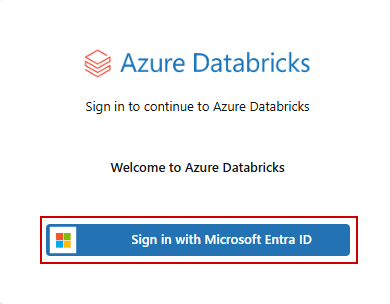

45. In the Account console click on 'Users & groups'

    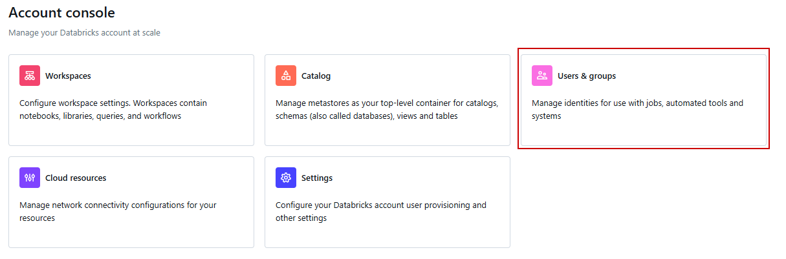

>**Note:** You should have Global admin on Azure tenant to assign youself as Account Admin. If you are not able to access Account console get the permssion assigned by your organization's Global Admin.

46. Search your username in the search bar and select it.

    

47. Click on **Roles** and toggle on the 'Account Admin' button.

    

48. Go back to the script execution and enter 'Yes' to confirm.

     -->

42. After script execution is complete, the **"--Execution Complete--"** prompt appears.
	


### Task 3: Creating a Shortcut in a Lakehouse

1. Open [Power BI](app.powerbi.com).

2. In PowerBI, click on **Workspaces** and **select** the **Woodgrove** workspace. 

    

3. In 'Woodgrove' workspace, click on the **FSI_Lakehouse_Bronze** lakehouse.

    

>**Note:** Lakehouses will have a concatenated random suffix, resulting in names like 'FSI_Lakehouse_Bronze_2131awe4' for example. 

4. In the lakehouse window, click on the **Collapse** icon in front of Files, if it is expanded.

>**Note:** When the **Collapse** icon is expanded, the three dots(Ellipse) icon is note visible.

5. Click on the three dots in front of **Files**.

6. Click on **New shortcut**.

	

7. In the pop-up window, under **External sources**, select the **Azure Data Lake Storage Gen2** option. 

	

8. In a new tab, open the **resource group** created in [Task 2](#task-2-run-the-cloud-shell-to-provision-the-demo-resources) with name 'rg-fsi-2.0...'.

9. Click the **storage account resource**.

	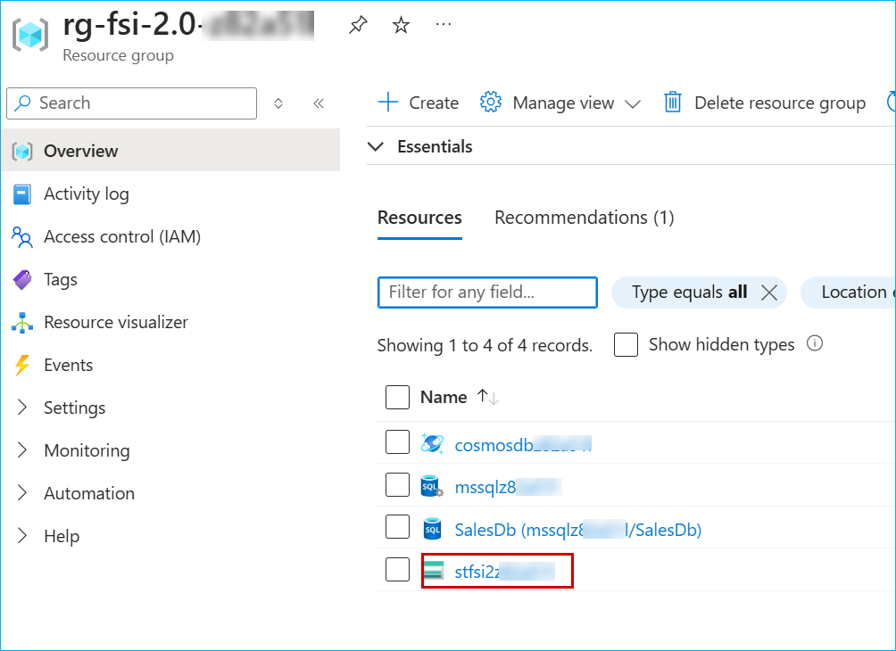

10. In the resource window, go to the **left pane** and scroll down.

11. In the **Security + networking** section, click on **Access keys**.

12. click on the **Show** button under **key1**.

	

13. click **Copy to clickboard** button.

14. **Save** it in a notepad for further use.

	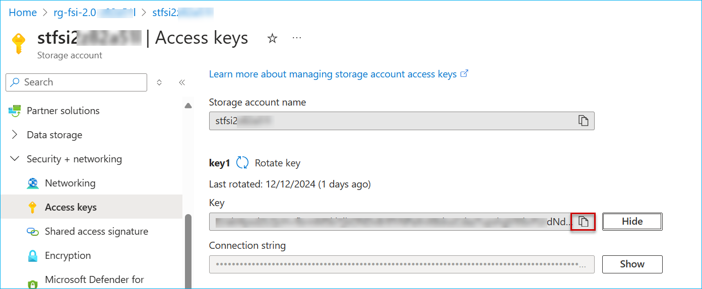

15. **Scroll down** in the left pane.

16. Select **Endpoints** from the **Settings** section.

17. **Scroll down** and copy the **'Data Lake Storage'** endpoint under the 'Data Lake Storage' section.

18. Save it in a **notepad** for further use.

	

>**Note:** You may see different endpoints as well in the above screen. Make sure to select only the Data Lake Storage endpoint.

19. Navigate back to the **Power BI workspace** (the powerbi tab which we working in earlier). 

20. Select **Create New Connection**

	

21. Paste the **endpoint** copied under the **URL** field.

22. In the **Authentiation kind** dropdown, select the **Account Key**.

23. Paste the **account key** copied in **step number 13**.

24. Click on **Next**.

	

25. Select **adls-core-banking-system-data** and click on **Next**.

   

26. click on the **Create** button.

	

### Task 4: Use the Data Pipelines/Dataflow for a ‘No Code, Low Code experience’

In this exercise, you will act as the Data Engineer and transfer Woodgrove's data from from Azure SQL Database into the Lakehouse. 

1. Open a new tab on your browser and navigate to **Microsoft Fabric** at [https://app.fabric.microsoft.com].

2. Click on **Workspaces** and select the **Woodgrove** workspace.


3. Click on **+ New item** and search for **Pipeline** and Click on **Data Pipeline**..


4. In the pop-up, type the pipeline name as **Market_Sentiment_Data_from_ADLS_Gen2** and click on the **Create** button.


7. In the **Data pipeline** window, click on **Activities** and then slect **Lookup**.


8. Paste ``Market_Sentiment_Data_from_ADLS_Gen2`` in Name filed.


8. Click on **Settings** and click on dropdown to select the **Connection** and then click on **more**.


9. Click on **Azure** in the left menu and then select **Subscription** and **Resourcegroup** which we created with template in Task2. and then click on the **stfsi2..** and slect **Azure Blobs**.


10. Click on **Connect**.


11. In the **File path** field, paste ``news-and-sentiment``.


12. Click on **Activities** in top ribbon, select **Copy data** and then click on **Add to canvas**


13. Paste ``Copy Marketing Sentiment Data`` in the **Name** field.


14. Click on **Source** and click on dropdown to select the **connection** and search for **stfsi2..** and then select the **connection** which was created in step 10.


15. In the **File path** field, paste ``news-and-sentiment`` in container field and paste ``NewsAndSentiment.csv`` in File name field and select **DelimitedText** for **File format** field.


16. Click on **Destination**, click on dropdown to select the connection, search for **FSI_lakehouse_Bronze** and then select **FSI_lakehouse_Bronze..**.


17. Select **Files** from **Root folder** field, in the File path field paste ``adls-new-and-sentiment`` for **Directory** field, paste ``marketing-sentiment-data`` for **File name** and select **DelimitedText** for File format field.


18. Create a connection from **Lookup to Copydata**.


 
19. Click on **Home** button located at the top of the ribbon and click on the **Save** icon and then click on **Run**.


<!-- 19. Click on the **OK** button in the Pipeline run window.

  -->

>**Note:** Wait for the pipeline to execute.

18. Click on the **Bell** icon at the top right corner of the screen to verify the **Running status** of the pipeline.


19. Your data has been transfered from Azure Data Lake Gen2 to Lakehouse.

20. Similarly, you can get data into the Lakehouses using pipelines from various other sources like Snowflake, Dataverse, etc.,

---


### Task 5: Excecuting Notebooks

<!-- ### Creating a new Runtime

1. In the workspace click on the "01 Raw Data to Lakehouse (Bronze) Code First Experience" notebook.

	

2. click on the 'Environment' and **select** 'New Environment'.

    

3. Enter name for environment as 'salesEnvironment'
    
	 -->

### Running Notebooks

1. In the workspace **Filter** for **Notebook** and then click on the "00 Copilot Notebook in Data Science & Data Engineering.ipynb" notebook.

	

2. In the left pane, click on the **three dots(ellipse)** and then select **Remove all sources**.

	

<!-- >**Note:** In case you do not see Missing lakehouse, you would see 'lakehouse{Name}', click on the same to get the 'Remove all Lakehosues' option. -->

3. click on **Continue** in the pop-up window.

	

4. In the left pane, click on the **Add data items** button and then click on **Existing data sources**.

	

5. click on **FSI_lakehouse_Silver_..** checkbox and click on **Connect**.

	

6. Similarly, perform **step number 1 to step number 5** for the other notebooks as well.

>**Note:** To perform the above steps, you need to attach the notebooks to respective Lakehouses before running the Notebooks. Follow the instructions for the same.


7. Refer the following table to attach Notebooks with the respective Lakehouses.

	|	Notebook	|	Lakehouse	|
	| -----------	| ------------- |
	|	00 Copilot Notebook in Data Science & Data Engineering.ipynb |	lakehouseSilver	|
	|	01 Raw Data to Lakehouse (Bronze) Code First Experience	|	lakehouseBronze	|
	|	02 Bronze to Silver Layer Medallion Architecture.ipynb	|	lakehouseBronze 	|
	|	03. Churn Prediction for Retail Banking Scenario.ipynb	|	lakehouseSilver|
	|||


8. Click on **Workspaces** and select the **Woodgrove** workspace.


9. In the workspace, click on the **01 Raw Data to Lakehouse (Bronze) Code First Experience** notebook.

	

10. click on the **Run all** button.

	

>**Note:** Clicl on **Run all** for each and every Notebook to complete the above steps for all the Notebooks.


### Task 6: Creating Mirrored Azure Cosmos DB.

Mirroring in Fabric provides an easy experience to avoid complex ETL (Extract Transform Load) and integrate your existing Azure Cosmos Database estate with the rest of your data in Microsoft Fabric.


1. Navigate to the **Microsoft Fabric** tab on your browser (https://app.fabric.microsoft.com).

2. Click on your **workspace** and select **New item** from menu bar.


3. In the **New item** window, search for **Cosmos** in the search bar then select **Mirrored Azure Cosmos DB...**.


4. When prompted to **Choose a database connection to get started**, look for **New sources** and select **Azure Cosmos DB v2**.


>**Note:** To fill in the details for required fields, we need to fetch the data from the Cosmosdb resource deployed in the Azure Portal.

5. Navigate to the **Azure Portal**, in the resource group **rg-fsi2.0-...**, and click on the **cosmosdb** resource.


6. Copy the **URL**.


7. In the left search bar, search for **Keys**, click on **keys** and then click on **show primary key** icon.


8. Copy the **primary key**.


9. Navigate back to the **Fabric** tab on your browser.

10. In the **Cosmos DB Endpoint** field, paste the **URL** which copied in **step6**.

11. Select **Account key** for Authentication kind, paste the **primary key** copied in **step 8** as key value, and click on the **Connect** button.


12. Click on the dropdown for Database, then select **fsi-marketdata** and click on **Connect** button.


13. Click on the **Connect** button.


14. In the **Name** field, paste ```Cosmos-KYC-Data```,click on the **Create mirrored database** button.


<!-- 15. Click on **Monitor replication** button to track the replication status.

 -->

15. Wait until the **Rows replicated** statistics are displayed. If not, **Refresh** the **Monitor replication** tab as shown in the following screen. Now, Azure Cosmos DB has been successfully mirrored.


<!-- 17. Close the **Monitor replication** window. -->

<!--  -->

16. Select **SQL analytics endpoint** from top right **dropdown** box.


17. Click on the mirrored table **KYC** to see data preview.


18. Click on **New SQL query** 


19. Copy the following **SQL query** in query editor,

```
SELECT name,id,language,bio
FROM [Cosmos-KYC-Data].[fsi-marketdata].[KYC]
WHERE language ='Setswana'

```


20. Right-click on **SQL query 1** and click **Rename**.


21. Paste ```KYC query``` and then click on **Rename**.


22. Click the **Three dots (Ellipses)** of **KYC query** and select **Move to Shared queries**.


### Task 7: Get data into Eventhouse

1. Navigate to the **Microsoft Fabric** tab on your browser (https://app.fabric.microsoft.com).

2. Search for **Eventhouse-Real-Time-Data** and click on it.

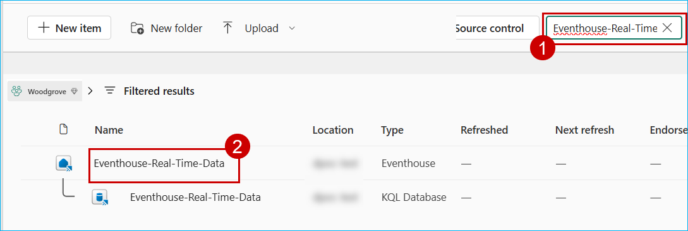

3. Click on **Eventhouse-Real-Time-Data** under **KQL databases**


4. Click on **Get Data**.


5. Click on **Azure Storage**


6. Click on **New Table**.


7. Paste the name of the table as ```foot-traffic```.


8. Go back to the **Azure portal**, re-direct to Resource group created, search for **Storage account**, and click on **storage account**.


9. Click on **Containers**.


10. Click on **kqldbdata**


11. Scroll to the right and click on three dots(ellipses) of  **foot-traffic.json** , and then click on **properties**.


12. Copy the **URL**.


13. Go back to the **Fabric** tab, paste the URL in the **configure the data source** section and click on **ADD** icon.


14. Click on **Next** button.


15. Click on **Finish** button.


16. CLick on **Close** button.


17. Click on **Eventhouse-Real-Time-Data** to add one more table, select **Get data** and then select **Azure Storage**.


18. Click on **New Table** and paste the table anme as **twitter_data**.


8. Go back to the **Azure portal**, re-direct to Resource group created, search for **Storage account** and click on **storage account**.


9. Click on **Containers**.


10. Click on **kqldbdata**


11. Scroll to the right, click on three dots (ellipses) of  **twitter_data.json** , and then click on **properties**


12. Copy the **URL**.


13. Go back to the **Fabric** tab, paste the URL in the **Configure the data source** section and click on **Add** icon.


14. Click on **Next** button.


15. Click on **Finish** button.


16. Click on **Close** button.


### Task 8: Get data into QuerySet

1. Navigate to the **Microsoft Fabric** tab on your browser (https://app.fabric.microsoft.com).

2. Click on **Filter** to select **KQL Queryset**.


3. Click on **Query Foot-traffic Data in Near Real-time using KQL Script**.


<!-- 4. Click on **select database** and then Slect **OneLake data hub**.

 -->

4. Click on **Add data source** and then select **Eventhouse/KQL Database**.
 


5. Select the **Eventhouse-Real-Time-Data** and then click on **Connect**.


6. Copy the following code and replace the existing code in the **Query** tab with this Code:

```
['foot-traffic']
| where todatetime(RecordedOn) >= todatetime(2025-04-22)
| make-series avgFootTraffic = avg(['after-foottraffic']) default=real(null) on todatetime(RecordedOn) step 15m
| extend NoGapsFootTraffic = series_fill_linear(avgFootTraffic)
| project RecordedOn, NoGapsFootTraffic
| extend forecast = series_decompose_forecast(NoGapsFootTraffic, 15)
| render timechart with (title='Forecasting the Next 15 Minutes of Foot Traffic using Time Series Decomposition')

// Find average foot traffic every EventProcessedUtcTime minute and render in timechart from foot-traffic table
// Calculate the Average Foot Traffic Before and After Events in foot-traffic table
['foot-traffic']
| where todatetime(EventProcessedUtcTime) >= todatetime(2025-04-22)
| extend footTrafficDifference = ['after-foottraffic'] - ['before-foottraffic']
| summarize avgFootTrafficDifference=avg(footTrafficDifference) by bin(EventProcessedUtcTime, 1m)
| render timechart


// followers by city
['twitter-data']
| summarize followersCount=sum(todouble(UserFollowersCount)) by City
| order by followersCount desc

//Twitter
['twitter-data']
|take 100

//List Events with Significant Traffic Increases

datatable(RecordedOn: datetime, before_foottraffic: int, after_foottraffic: int)
[
    datetime(2024-03-26T08:14:35.842359Z), 21, 37,
    datetime(2024-03-26T08:15:35.842359Z), 30, 50,
    datetime(2024-03-26T08:16:35.842359Z), 25, 45
]
| extend traffic_diff = after_foottraffic - before_foottraffic
| where traffic_diff > 10
| project RecordedOn, traffic_diff
| render barchart

```
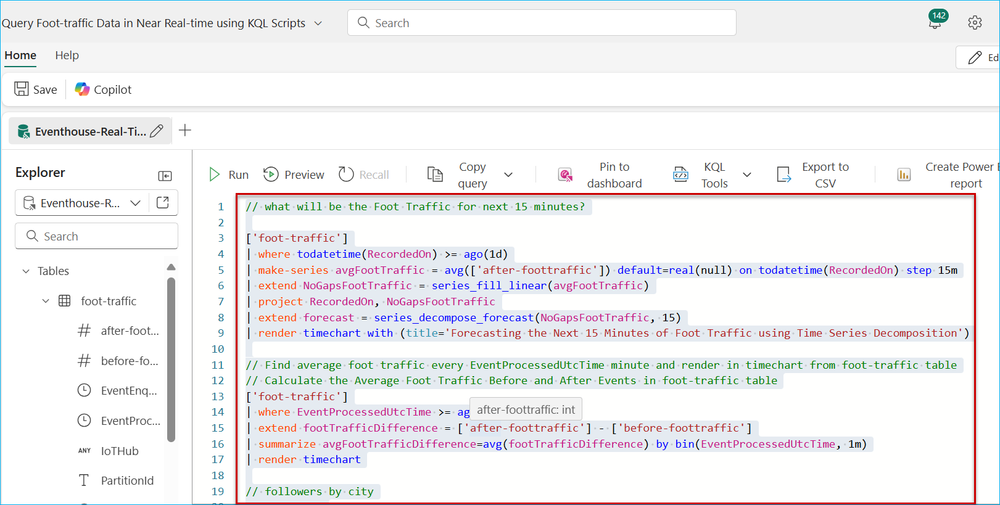

7. Click on the **Edit** icon of the **Query** tab and **Rename ** to **Queries**


### Task 9: Updating Semantic models with Cloud connection

1. Open **Microsoft Fabric** tab on your browser.

2. Click on **Workspaces** and select **Woodgrove**.


3. Click on **Filter** and select **Lakehouse**.


4. Click on three dots(elipses) of **Semantic model** and click on **Settings**.


5. Expand **Gateway and cloud connections**, in the Cloud connections, click on dropdown and then select **Create a connection**.


6. Paste ``LakehouseReports`` in the **Connection name** field, select **OAuth 2.0** in the **Authentication method** and then click on **Edit credentials**.


7. Select the **user account** that is used for logging into the **Azure Portal** in [Task 1](#task-1-create-a-resource-group-in-azure).

	

9. Click on **Create** button.


10. In the **Cloud connections**, click on dropdown, select **LakehouseReports** and then click on **Apply** button. 


11. Click on next semantic model from the list, expand **Gateway and Cloud connections** and in the **Cloud connections**, click on dropdown to select **LakehouseReports** and then click on **Apply** button.


12. Repeat **Step 11** for remaining semantic models **Exclude** **08 FSI Twitter**.

13. For **08 FSI Twitter Report**, click on **08 FSI Twitter Report**, expand **Parameters** and then copy the **ServerName** , **DBName** values.


14. Expand **Gateway and cloud connections**, in the cloud connections, click on dropdown to select **Create a connection**.


15. Paste ``kqltoReports`` in the **Connection name**, paste **ServerName**,**DBName** values copied in **Step 13**, select **OAuth 2.0** in the **Authentication method** and then click on **Edit credentials**.


15. Select the **user account** that is used for logging into the **Azure Portal** in [Task 1](#task-1-create-a-resource-group-in-azure).

	

16. Click on **Create** button.

17. In the **Cloud connections**, click on dropdown and then select **kqltoreports**. 


### Task 10: Creating Semantic Model for PowerBI Copilot

1. Open **Microsoft Fabric** tab on your browser.

2. Click on **Workspaces** and select **Woodgrove**.


3. Click on **Filter** to select **Lakehouse**.


4. Click on the **FSI_Lakehouse_Silver...**.

>**Note:** There are three options for Lakehouse, namely Lakehouse, Semantic model (Default) and SQL endpoint. Ensure to select the **Lakehouse** option.


5. Click on the **New semantic model** button. 


6. In the **Name** field, paste ```WealthAdvisorCopilotData```.

7. Select workspace as **Woodgrove** and click on **Expand** icon next to **dbo** checkbox.


8. Click on **Expand** icon next to **Tables** checkbox.


9. Scroll down and select **asset** , **client** , **date** , **initialclientinvestmentportfolio** , **what_if_analysis_impact_on_investment** tables and then click on the **Confirm** button. 


>Wait for the Semantic model creation.

10. To create the second Semantic model, follow the same **steps from 1 to 5**, in **step 6**, in the **Name** field, enter **retail_banking_loan_delinquency**, follow **step 7 and step 8**, in **step 9**, select **retail_banking_delinquency** table.

11. To create the third Semantic model, follow the same **steps from 1 to 5**, in **step 6**, in the **Name** field, enter **new_insurance_written_report**, follow **step 7 and step 8**, in **step 9** select **new_insurance_written** table.


<!-- ### Task 10: Integrate Azure Databricks with Fabric

### DLT Pipelines, Unity Catalog (Data governance), Mirrored Azure Databricks Catalog

This exercise shows how Microsoft Fabric with Databricks enabled Contoso to solve their integration challenges. The acquired company, Litware Inc., was already using Databricks heavily and they stored their churn and sales data in ADLS Gen2. We’ll see how Unity Catalog benefited Contoso’s data architects so they could quickly get up to speed on all Litware Inc.’s data.

#### Create Delta Live Table pipeline for Data Transformation

Delta Live Tables (DLT) allow you to build and manage reliable data pipelines that deliver high-quality data in Lakehouse. DLT helps data engineering teams simplify ETL development and management with declarative pipeline development, automatic data testing, and deep visibility for monitoring and recovery.


1. Navigate to the **Azure Portal**, in the **rg-fsi-2.0...** resource group, search for **databricks** and click on the databricks resource with the name **adb-fabric...**.


2. Click on the **Launch Workspace** button.


3.	In the left navigation pane click on **Delta Live Table** and click on the **Create pipeline** button.


4. Enter the name of the pipeline as **DLT_Pipeline** and click on the file icon to browse the notebook.


5. Click on **Shared**.

6. Click on **Analytics with ADB**.

7. Click on the **01 DLT Notebook**.

8. Click on the **Select** button.


9. In the Destination tab, select the **Unity Catalog Preview** radio button.

10. In the Catalog box select **cronos_unity_catalog** from dropdown.

11. In the Target schema, select **cdata** from the dropdown.

12. Click on the **Create** button.


13. From the top right hand-side click on **Start**.


14. Wait for the pipeline run to complete, once its completed the result would look similar to the following screen.


---

#### Create a Mirrored Azure Databricks Catalog in Fabric and analyze data using T-SQL

Mirroring the Azure Databricks Catalog structure in Fabric allows seamless access to the underlying catalog data through shortcuts. This means that any changes made to the data are instantly reflected in Fabric, without the need for data movement or replication. Let’s step into Data Engineer, Eva’s shoes to create a Mirrored Azure Databricks Catalog and analyze the data using T-SQL. 

1. Navigate back to the Microsoft Fabric tab on your browser (https://app.fabric.microsoft.com).

2. Click on the **ContosoSales   ** and select **New item** from menu bar.


3. In the **New item** window, scroll down and click on **Microsoft Azure Databricks catalog (preview)**.

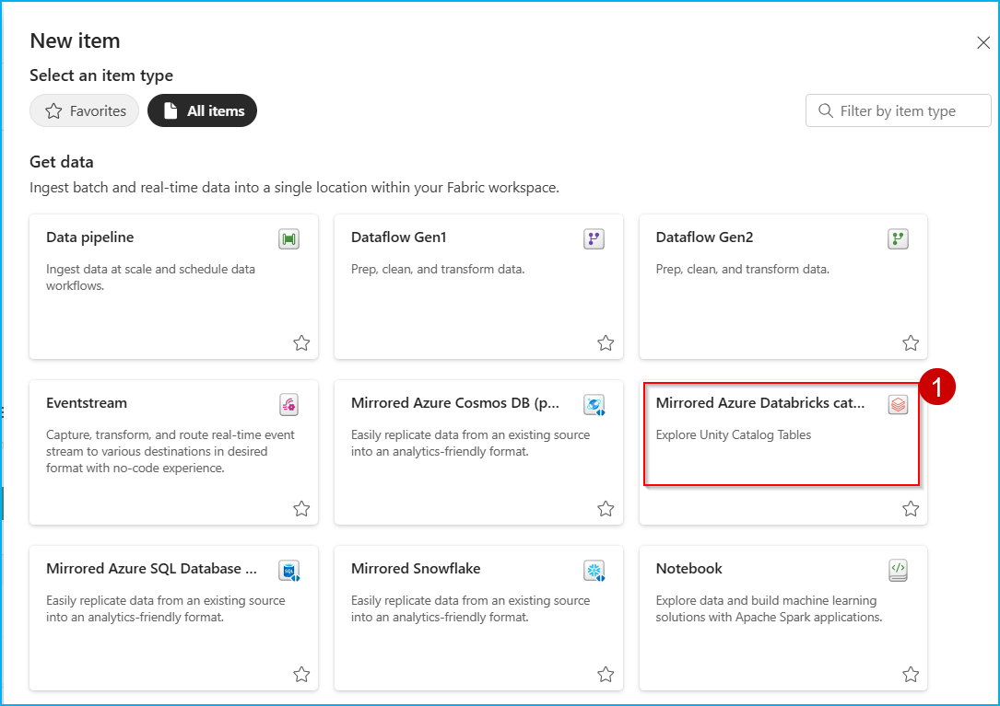

4. When the **New source** window pops up, click on the **Create new connection** radio button.


5. Navigate to the **Azure Portal**, in the **rg-fabric...** resource group search for **Azure Databricks Service** and click on the Azure Databricks Service resource.


6. copy the **URL** of Azure Databricks Service resource.


7. Navigate back to the **Fabric** tab.

8. In the URL field paste the Azure Databricks Service URL.

9. Now, select **Organizational account** from 'Authentication kind' dropdown box..

10. CLick on **Sign in**


11. click on the **Connect** button.


12. Click on **Next** button.

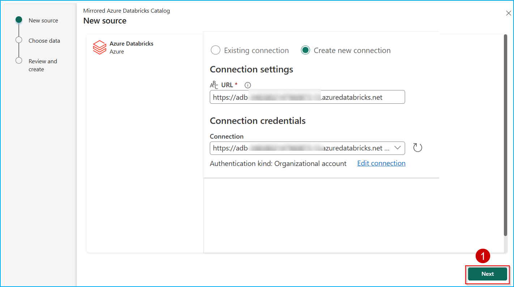

13. In the **Choose data** screen, select the Catalog name as **cronos_unity_catalog** from the dropdown box, and select the **rag** schema if not selected, then select the checkbox **Automatically sync future catalog changes for the selected schema** (to mirror future tables) if not ticked and click on **Next** button.


14. Enter the **Artifact name** for your mirrored Databricks Catalog and click on the **Create** button.


15. Click on the **Monitor catalog** button to track the mirroring status and then close it.


16. Click on the **View SQL endpoint** button. You can also select the tables to preview data.


--- -->
