# Healthcare 2 DREAM Demo in a Box Setup Guide

## What is it?
DREAM Demos in a Box (DDiB) are packaged Industry Scenario DREAM Demos with ARM templates (with a demo web app, Power BI reports, Synapse resources, AML Notebooks etc.) that can be deployed in a customer’s subscription using the CAPE tool in a few hours.  Partners can also deploy DREAM Demos in their own subscriptions using DDiB.

 ## Objective & Intent
Partners can deploy DREAM Demos in their own Azure subscriptions and show live demos to customers. 
In partnership with Microsoft sellers, partners can deploy the Industry scenario DREAM demos into customer subscriptions. 
Customers can play,  get hands-on experience navigating through the demo environment in their own subscription and show to their own stakeholders.

**Before You Begin**

## :exclamation:IMPORTANT NOTES:  

  1. **Please read the [license agreement](https://github.com/microsoft/Azure-Analytics-and-AI-Engagement/blob/main/CDP-Retail/license.md) and [disclaimer](https://github.com/microsoft/Azure-Analytics-and-AI-Engagement/blob/main/CDP-Retail/disclaimer.md) before proceeding, as your access to and use of the code made available hereunder is subject to the terms and conditions made available therein.** Any third party tool used in the demo is not owned by us and you will have to buy the licenses for extended use.
  2. Without limiting the terms of the [license](https://github.com/microsoft/Azure-Analytics-and-AI-Engagement/blob/main/CDP-Retail/license.md) , any Partner distribution of the Software (whether directly or indirectly) may only be made through Microsoft’s Customer Acceleration Portal for Engagements (“CAPE”). CAPE is accessible by Microsoft employees. For more information about the CAPE process, please connect with your local Data & AI specialist or CSA/GBB.
  3. Please note that **Azure hosting costs** are involved when DREAM Demos in a Box are implemented in customer or partner Azure subscriptions. **Microsoft will not cover** DDiB hosting costs for partners or customers.
  4. Since this is a DDiB, there are certain resources open to the public. **Please ensure proper security practices are followed before you add any sensitive data into the environment.** To strengthen the security posture of the environment, **leverage Azure Security Centre.** 
  5.  For any questions or comments please email **[dreamdemos@microsoft.com](mailto:dreamdemos@microsoft.com).**
  
   > **Note**: Set up your demo environment at least two hours before your scheduled demo to make sure everything is working.
   
# Copyright - 2023

© 2021 Microsoft Corporation. All rights reserved.   

By using this demo/lab, you agree to the following terms: 

The technology/functionality described in this demo/lab is provided by Microsoft Corporation for purposes of obtaining your feedback and to provide you with a learning experience. You may only use the demo/lab to evaluate such technology features and functionality and provide feedback to Microsoft.  You may not use it for any other purpose. You may not modify, copy, distribute, transmit, display, perform, reproduce, publish, license, create derivative works from, transfer, or sell this demo/lab or any portion thereof. 

COPYING OR REPRODUCTION OF THE DEMO/LAB (OR ANY PORTION OF IT) TO ANY OTHER SERVER OR LOCATION FOR FURTHER REPRODUCTION OR REDISTRIBUTION IS EXPRESSLY PROHIBITED. 

THIS DEMO/LAB PROVIDES CERTAIN SOFTWARE TECHNOLOGY/PRODUCT FEATURES AND FUNCTIONALITY, INCLUDING POTENTIAL NEW FEATURES AND CONCEPTS, IN A SIMULATED ENVIRONMENT WITHOUT COMPLEX SET-UP OR INSTALLATION FOR THE PURPOSE DESCRIBED ABOVE. THE TECHNOLOGY/CONCEPTS REPRESENTED IN THIS DEMO/LAB MAY NOT REPRESENT FULL FEATURE FUNCTIONALITY AND MAY NOT WORK THE WAY A FINAL VERSION MAY WORK. WE ALSO MAY NOT RELEASE A FINAL VERSION OF SUCH FEATURES OR CONCEPTS.  YOUR EXPERIENCE WITH USING SUCH FEATURES AND FUNCITONALITY IN A PHYSICAL ENVIRONMENT MAY ALSO BE DIFFERENT.

## Contents

<!-- TOC -->

- [Requirements](#requirements)
- [Before Starting](#before-starting)
  - [Task 1: Create a resource group in Azure](#task-1-create-a-resource-group-in-azure)
  - [Task 2: Power BI Workspace creation](#task-2-power-bi-workspace-creation)
  - [Task 3: Deploy the ARM Template](#task-3-deploy-the-arm-template)
  - [Task 4: Run the Cloud Shell to provision the demo resources](#task-4-run-the-cloud-shell-to-provision-the-demo-resources)
  - [Task 5: Data Explorer Setup](#task-5-data-explorer-setup)
  - [Task 6: Azure Databricks Setup](#task-6-azure-databricks-setup)
  - [Task 7: Azure Purview Setup](#task-7-azure-purview-setup)
  - [Task 8: Power BI reports and dashboard creation](#task-8-power-bi-reports-and-dashboard-creation)
  	- [Steps to validate the credentials for reports](#steps-to-validate-the-credentials-for-reports)
  	- [Steps to create realtime reports](#steps-to-create-realtime-reports)
  	- [Follow these steps to create the Power BI dashboard](#follow-these-steps-to-create-the-power-bi-dashboard)
  	- [Updating Dashboard and Report Ids in Web app](#updating-dashboard-and-report-ids-in-web-app)
  - [Task 9: Pause or Resume script](#task-9-pause-or-resume-script)
  - [Task 10: Clean up resources](#task-10-clean-up-resources)

<!-- /TOC -->

## Requirements

* An Azure Account with the ability to create an Azure Synapse Workspace.
* A Power BI Pro or Premium account to host Power BI reports.
* Make sure you are the Power BI administrator for your account and service principal access is enabled on your Power BI tenant.
* Make sure the following resource providers are registered with your Azure Subscription.
   - Microsoft.Sql 
   - Microsoft.Synapse 
   - Microsoft.StreamAnalytics 
   - Microsoft.EventHub 
   - Microsoft.Databricks
   - Microsoft.Kusto
   - Microsoft.Purview
* You can run only one deployment at any point in time and need to wait for its completion. You should not run multiple deployments in parallel as that will cause deployment failures.
* Select a region where the desired Azure Services are available. If certain services are not available, deployment may fail. See [Azure Services Global Availability](https://azure.microsoft.com/en-us/global-infrastructure/services/?products=all) for understanding target service availability. (consider the region availability for Synapse workspace, Iot Central and cognitive services while choosing a location)
* Do not use any special characters or uppercase letters in the environment code. Also, do not re-use your environment code.
* In this Accelerator we have converted Real-time reports into static reports for the ease of users but have covered entire process to configure Realtime dataset. Using those Realtime dataset you can create Realtime reports.
* Please ensure that you select the correct resource group name. We have given a sample name which may need to be changed should any resource group with the same name already exist in your subscription.
* The audience for this document is CSAs and GBBs.
* Please log in to Azure and Power BI using the same credentials.
* Once the resources have been setup, please ensure that your AD user and synapse workspace have “Storage Blob Data Owner” role assigned on storage account name starting with “sthealthcare2...”. You need to contact AD admin to get this done.
* Please review the [License Agreement](https://github.com/microsoft/Azure-Analytics-and-AI-Engagement/blob/main/CDP-Retail/license.md) before proceeding.

## Before starting

### Task 1: Create a resource group in Azure

1. **Log into** the [Azure Portal](https://portal.azure.com) using your Azure credentials.

2. On the Azure Portal home screen, **select** the '+ Create a resource' tile.

	

3. In the Search the Marketplace text box, **type** "Resource Group" and **press** the Enter key.

	

4. **Select** the 'Create' button on the 'Resource Group' overview page.

	
	
5. On the 'Create a resource group' screen, **select** your desired Subscription. For Resource group, **type** 'DDiB-Healthcare2'. 

6. **Select** your desired region.

	> **Note:** Some services behave differently in different regions and may break some part of the setup. Choosing one of the following regions is preferable: 		westus2, eastus2, northcentralus, northeurope, southeastasia, australliaeast, centralindia, uksouth, japaneast.

7. **Click** the 'Review + Create' button.

	

8. **Click** the 'Create' button once all entries have been validated.

	

### Task 2: Power BI Workspace creation

1. **Open** Power BI in a new tab using the following link:  [https://app.powerbi.com/](https://app.powerbi.com/)

2. **Sign in**, to Power BI using your Power BI Pro account.

	

	> **Note:** Use the same credentials for Power BI which you will be using for the Azure account.

3. In Power BI service **Click** on 'Workspaces'.

4. Then **click** on the 'Create a workspace' tab.

	

	> **Note:** Please create a Workspace by the name "DDiB-HC2".

5. **Copy** the Workspace GUID or ID. You can get this by browsing to [https://app.powerbi.com/](https://app.powerbi.com/), selecting the workspace, and then copying the GUID 	from the address URL.

6. **Paste** the GUID in a notepad for future reference.

	

	> **Note:** This workspace ID will be used during the ARM template deployment.	

### Task 3: Deploy the ARM Template

1. **Open** this link in a new tab of the same browser that you are currently in: 
	
	<a href='https://portal.azure.com/#create/Microsoft.Template/uri/https%3A%2F%2Fraw.githubusercontent.com%2Fmicrosoft%2FAzure-Analytics-and-AI-Engagement%2Fhealthcare2%2Fhealthcare2%2FmainTemplate.json' target='_blank'></a>

2. On the Custom deployment form, **select** your desired Subscription.

3. **Select** the resource group name **DDiB-Healthcare2** which you created in [Task 1](#task-1-create-a-resource-group-in-azure).

4. **Provide/Type** an environment code which is unique to your environment. This code is a suffix to your environment and should not have any special characters or uppercase letters and should not be more than 6 characters. 

5. **Provide** a strong SQL Administrator login password and set this aside for later use.

6. **Enter** the Power BI workspace ID copied in step 6 of [Task 2](#task-2-power-bi-workspace-creation).

7. **Click** ‘Review + Create’ button.

	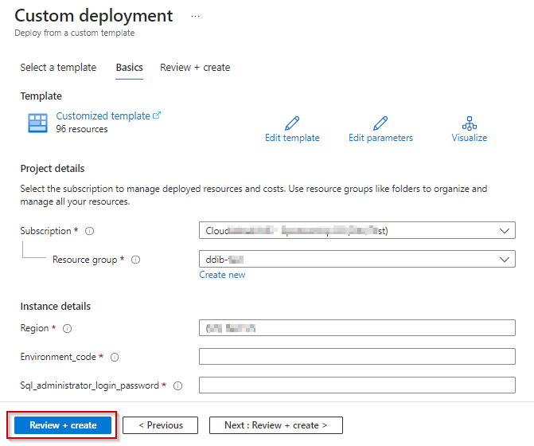

8. **Click** the **Create** button once the template has been validated.

	
	
	> **NOTE:** The provisioning of your deployment resources will take approximately 10 minutes.
	
9. **Stay** on the same page and wait for the deployment to complete.
    
	
    
10. **Select** the **Go to resource group** button once your deployment is complete.

	

### Task 4: Run the Cloud Shell to provision the demo resources

1. **Open** the Azure Portal. In the Resource group section, **open** the Azure Cloud Shell by selecting its icon from the top toolbar.

	

2. **Click** on 'Show advanced settings'.

	

	> **Note:** If you already have a storage mounted for Cloud Shell, you will not get this prompt. In that case, skip step 2 and 3.

3. **Select** your 'Resource Group' and **enter** the 'Storage account' and 'File share' name.

	

	> **Note:** If you are creating a new storage account, give it a unique name with no special characters or uppercase letters.

4. In the Azure Cloud Shell window, ensure the PowerShell environment is selected and **enter** the following command to clone the repository files.

```
git clone -b healthcare2 --depth 1 --single-branch https://github.com/microsoft/Azure-Analytics-and-AI-Engagement.git healthcare2
```

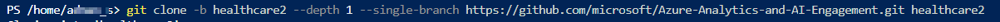
	
> **Note:** If you get File already exist error, please execute the following command: rm healthcare2 -r -f to delete existing clone.

> **Note**: When executing scripts, it is important to let them run to completion. Some tasks may take longer than others to run. When a script completes execution, you will be returned to a command prompt. 

5. **Execute** the healthcare2Setup.ps1 script by executing the following command:

```
cd ./healthcare2/healthcare2
```

6. Then **run** the PowerShell: 
```
./healthcare2Setup.ps1
```
    
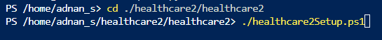

7. You will see the below screen, **enter** 'Y' and **press** the enter key.

	
      
8. From the Azure Cloud Shell, **copy** the authentication code

9. Click on the link [https://microsoft.com/devicelogin](https://microsoft.com/devicelogin) and a new browser window will launch.

	
     
10. **Paste** the authentication code and **click** on Next.

	

11. **Select** the same user that you used for signing in to the Azure Portal in [Task 1](#task-1-create-a-resource-group-in-azure).

	
	
12. In the below screen **click** on continue.

	

13. **Close** the browser tab once you see the message window at right and **go back** to your Azure Cloud Shell execution window.

	
	
14. You will see the below screen and perform step #9 to step #13 again.

	

15. Now you will be prompted to select subscription if you have multiple subscription assigned to the user you used for device login.

    
	
	> **Notes:**
	> - The user with single subscription won't be prompted to select subscription.
	> - The subscription highlighted in yellow will be selected by default if you do not enter any disired subscription. Please select the subscription carefully, as it may break the execution further.
	> - While you are waiting for processes to get completed in the Azure Cloud Shell window, you'll be asked to enter the code three times. This is necessary for performing installation of various Azure Services and preloading content in the Azure Synapse Analytics SQL Pool tables.

16. You will be asked to confirm for the subscription, **enter** 'Y' and **press** the enter key.

	

17. You will now be prompted to **enter** the resource group name in the Azure Cloud Shell. **Type** the same resource group name that you created in [Task 1](#task-1-create-a-resource-group-in-azure). – 'DDiB-Healthcare2'.

	

18. After the complete script has been executed, you get to see the message "--Execution Complete--", now **go to** the Azure Portal and **search** for "app service" and **click** on the simulator app by the name "app-patient-data-simulator-...".

	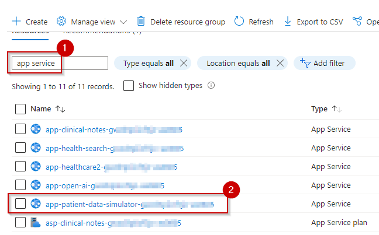
	
19. **Click** on the browse button of the app service.

	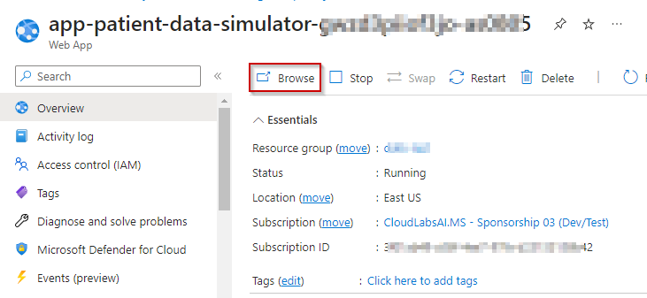

20. A new window will appear as shown in the below screenshot. Wait for the page to load and **close** the tab.

	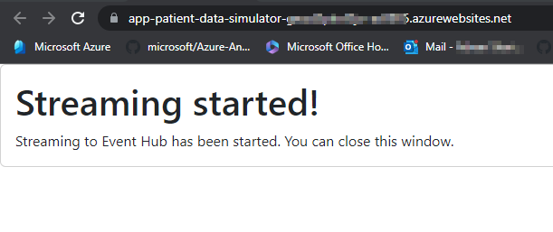

### Task 5: Data Explorer Setup

1. In the Azure Portal **search** for data explorer and **click** on the data explorer resource.

	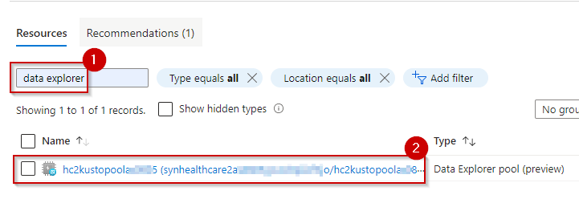
	
2. In the data explorer resource **copy** the URI.

	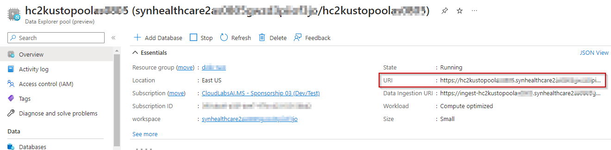
	
3. **Open** a new tab in the browser and **paste** the URI in the search bar, the data explorer studio opens.
	
	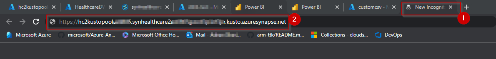
	
4. In the Data Explorer Studio under Data section **click** on Ingest data.

	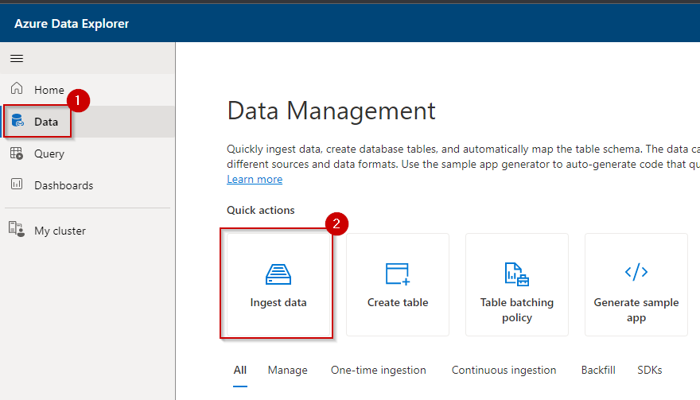
	
5. In the Ingest data, under destination tab, **select** appropriate values in the respective fields, in Cluster **select** the kusto pool name as "hc2kustopool...", in the Database select "HC2KustoDB..." database, in the Table field **enter** the table name i.e. "operationalanalytics" and then **click** on Next.

	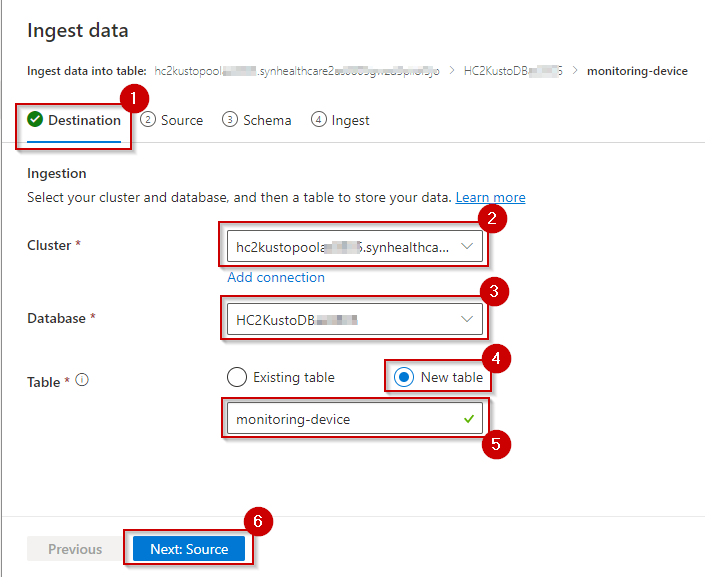
	
6. Under the source tab, **select** Source type as "Event Hub", in subscription **select** your subscription, in Event Hub Namespace **select** you eventhub namespace i.e. "evh-patient-monitoring-hc2-...", in Event Hub **enter** "operational-analytics", in Data connection name **select** "HC2KustoDB...-operational-analytics", in Consumer group **select** $Default and then **click** on Next.

	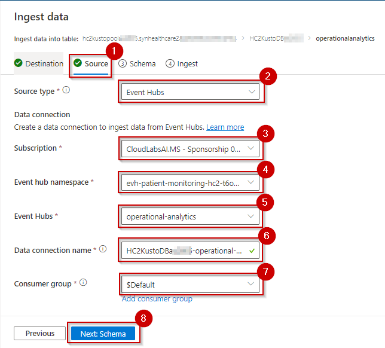
	
7. Wait for some time for data preview to load, **select** JSON in the "Data format" section and then **click** on Next: Start Ingestion.

	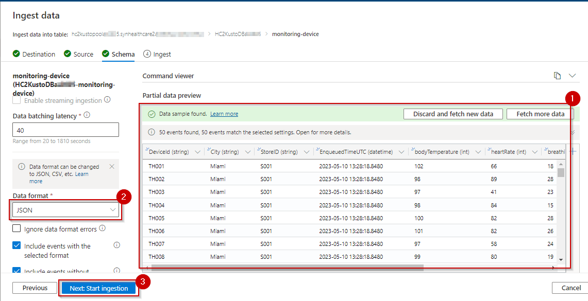
	
8. Once the Continuous ingestion from Event Hub has been established, **click** on Close.

	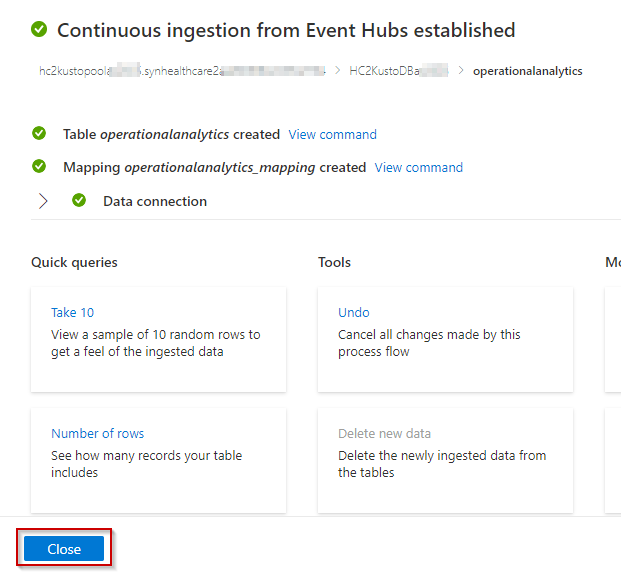
	
9. Repeat the above step from 4 to 8, replacing few values, i.e. in step 5, this time **enter** the table name as "monitoringdevice", in step 6 **enter** Event Hub as "monitoring-device" and Data connection name as "HC2KustoDB...-monitoring-device".

### Task 6: Azure Databricks Setup

In this task, you will create a Delta Live Table pipeline.

*Delta Live Tables (DLT) allow you to build and manage reliable data pipelines that deliver high-quality data on Delta Lake. DLT helps data engineering teams simplify ETL development and management with declarative pipeline development, automatic data testing, and deep visibility for monitoring and recovery.*

1. In the Azure Portal **search** for databricks and **click** on the databricks resource.

	

2. In the databricks resource **click** on workspace.

	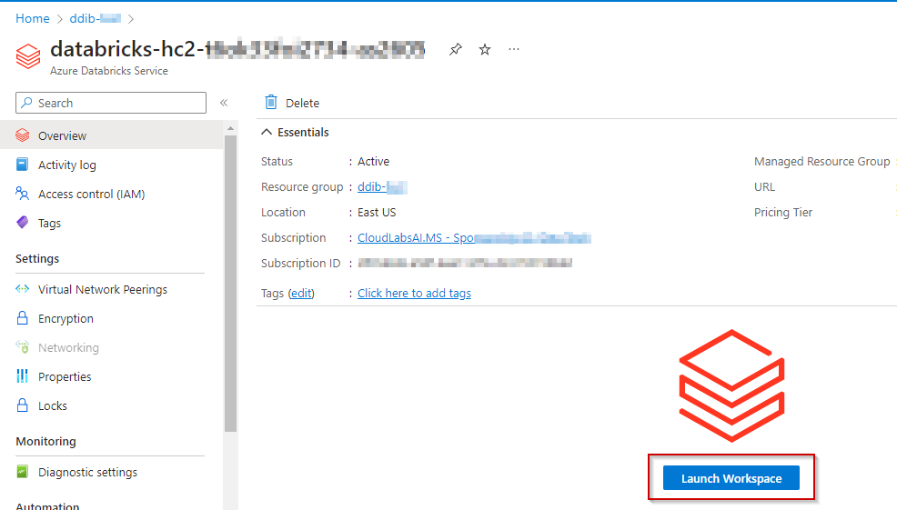

3. On the left navigation pane, **select** Workspace and **click** on Initial setup.ipynb notebook.

	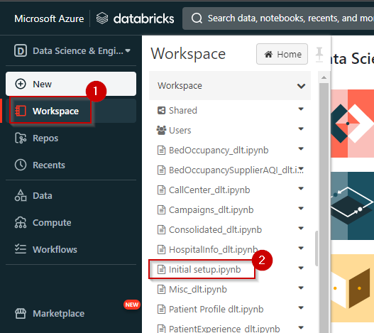

4. **Click** on Run all, a new window will pop-up.

	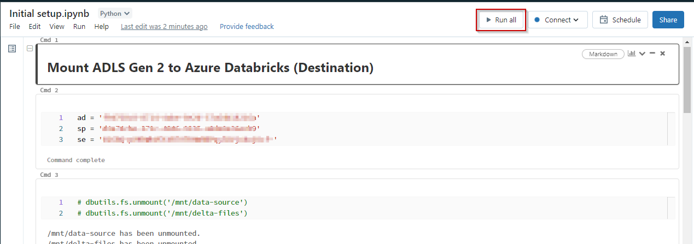

5. **Click** on Attach and run, the notebook will start executing.

	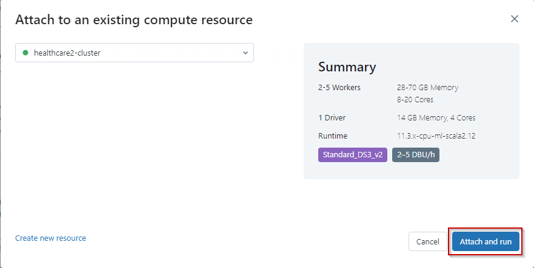

6. On the left navigation pane, **select** the Workflows icon.

	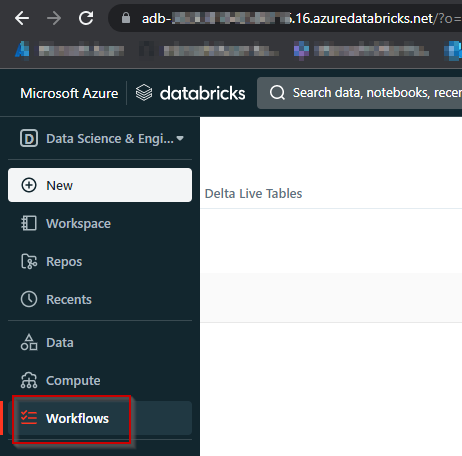

7.	**Select** the Delta Live Tables tab and **click** Create Pipeline.

	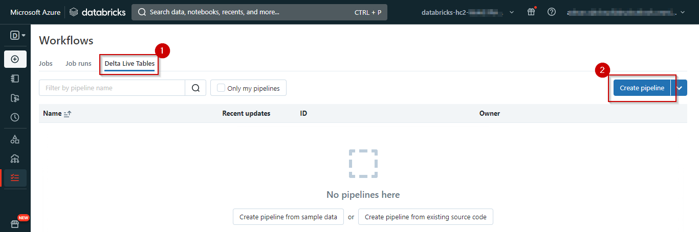

8.	In the Create pipeline window, in the Pipeline name box, **enter** DLT Pipeline.

	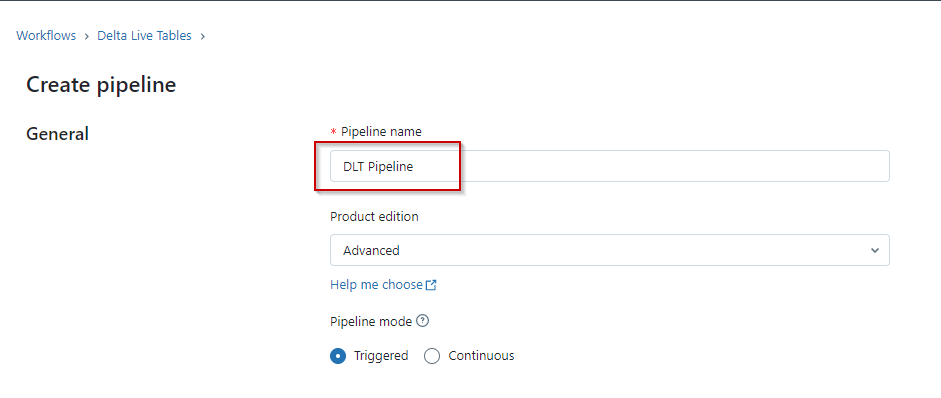

9.	In the Source Code field **select** the notebook icon.

	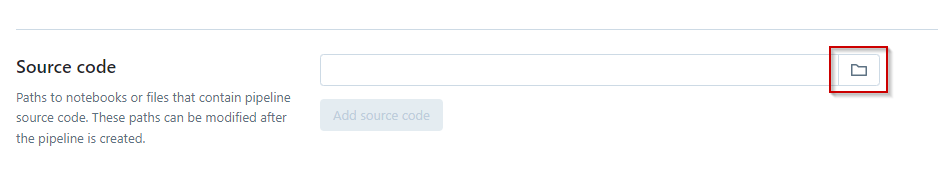

10.	In the Select source code window, **select** the "Patient Profile dlt.ipynb" notebook and **click** on Select.

	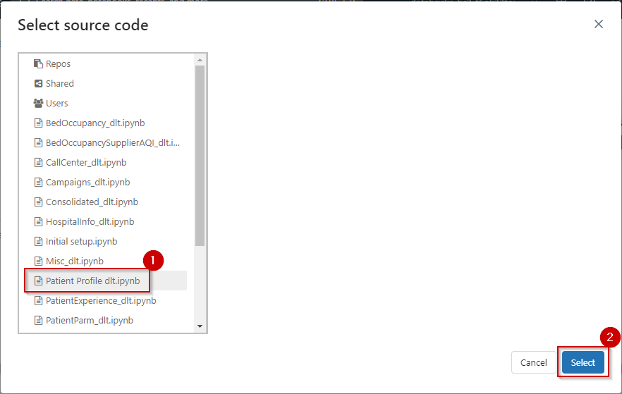

11.	**Click** on Add Source Code button.

	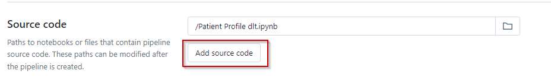

12.	In the Source Code field **select** the notebook icon again.

	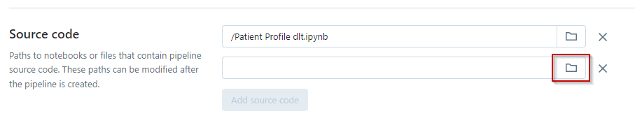

13.	In the Select source code window, **select** the "PatientExperience_dlt.ipynb" notebook and **click** on Select.

	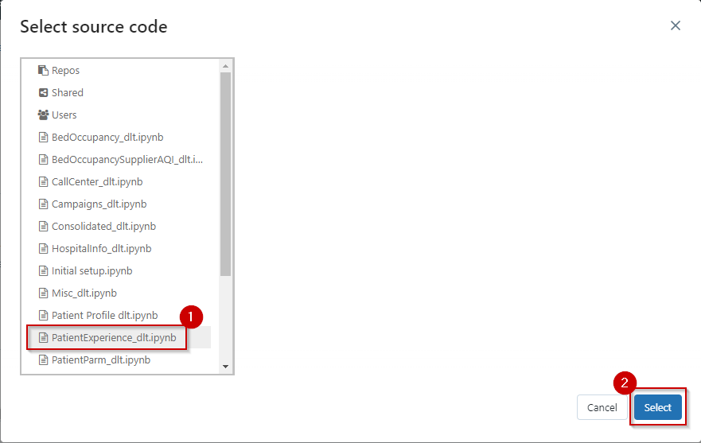
      
14.	Under the Destination section, in the Storage location box, **enter**: /mnt/delta-files and **click** on Create.

	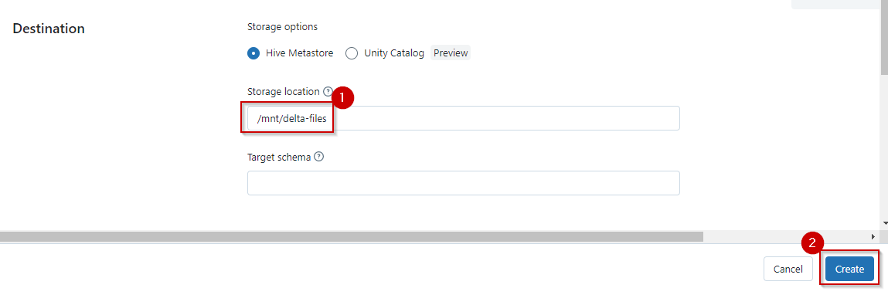

*Once you select **Create**, it will create the Delta Live Table pipeline with all the notebook libraries added to the pipeline.*

15. **Click** on Start.

	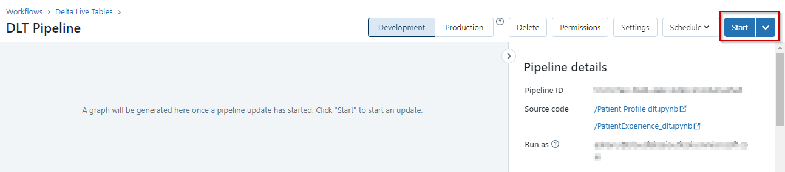

*Databricks will start executing the pipeline which will take approximately 5-10 minutes*

16. This is the view you would have seen. Observe the data lineage of bronze, silver and gold tables.

	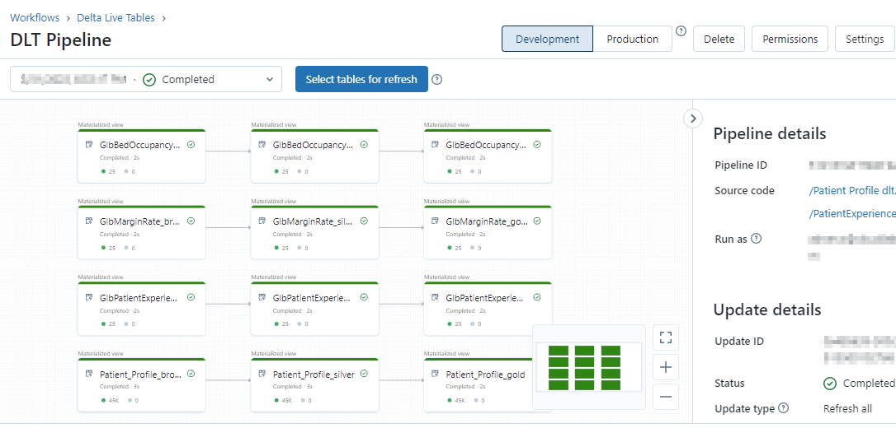

17. **Select** the Delta Live Tables tab and **click** Create Pipeline.

	

18.	In the Create pipeline window, in the Pipeline name box, **enter** OccupancySuppliersAQI_DLT.

	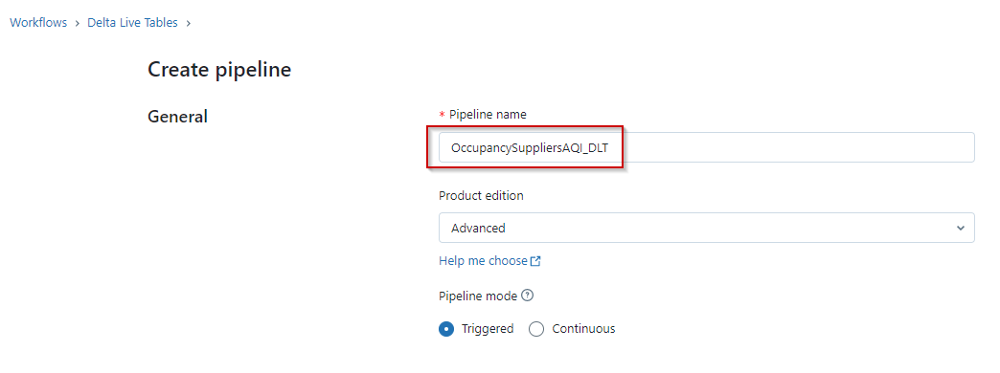

19.	In the Source Code field **select** the notebook icon.

	

20.	In the Select source code window, **select** the "BedOccupancySupplierAQI_dlt.ipynb" notebook and **click** on Select.

	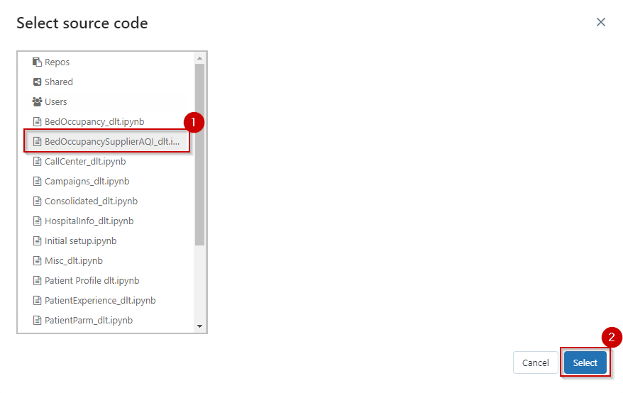
      
21.	Under the Destination section, in the Storage location box, **enter**: /mnt/delta-files , in Target schema **enter** model and **click** on Create.

	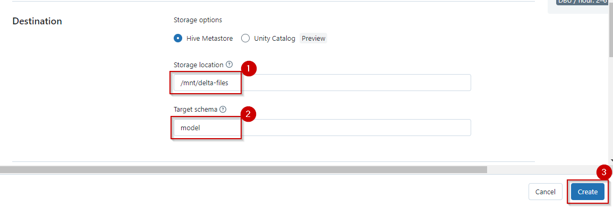

22. **Click** on Start.

	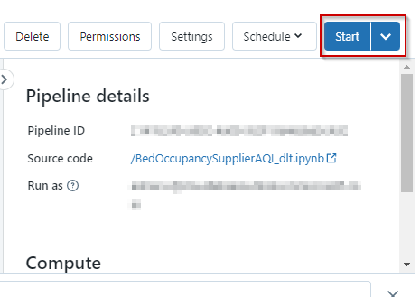

*Databricks will start executing the pipeline which will take approximately 5-10 minutes*

16. This is the view you would have seen. Observe the data lineage of bronze, silver and gold tables.

	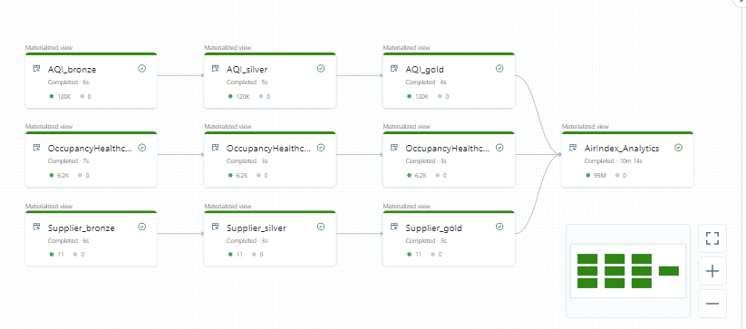


### Task 7: Azure Purview Setup

> **Note:** Firstly you should assign Reader permission to the Azure Purview account starting with name "purviewhc2..." for Cosmos Account, Synapse Workspace and Storage Account starting with name "sthealthcare2...". Once the permission has been granted, proceed with the following steps.

1. From Azure Portal, **search** for "purview" in the resource group and **click** on the resource.

	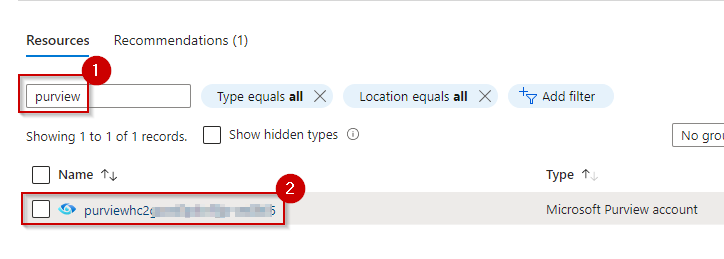
	
2. The Azure Purview resource window will open, **click** on Open Azure Purview Studio and the Azure Purview Studio will open in a new window.

	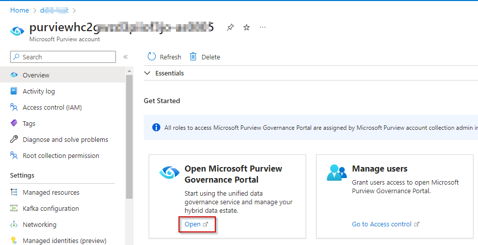
	
3. In the Azure Purview Studio **click** on Data map **goto** source and **select** Map view. Now expand the parent collection by **clicking** on the "+" sign.

	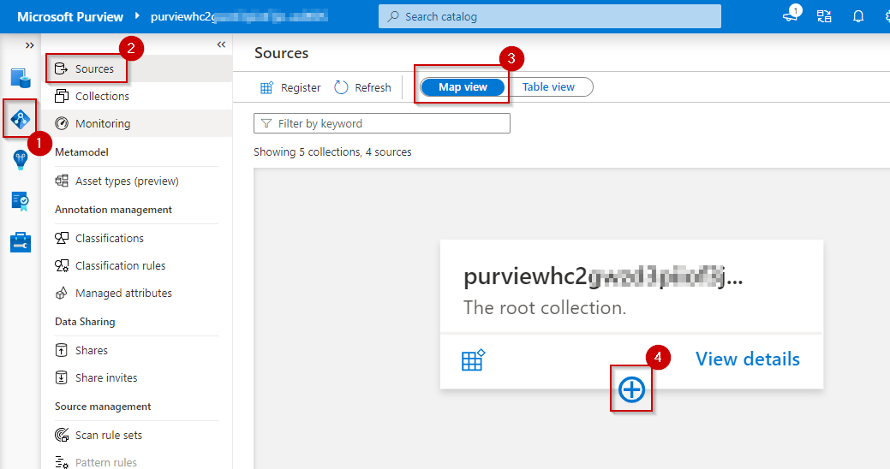

4. All the sub collections will be visible, **click** on the "+" sign under ADLS, AzureSynapseAnalytics, AzureCosmosDB and PowerBI.

	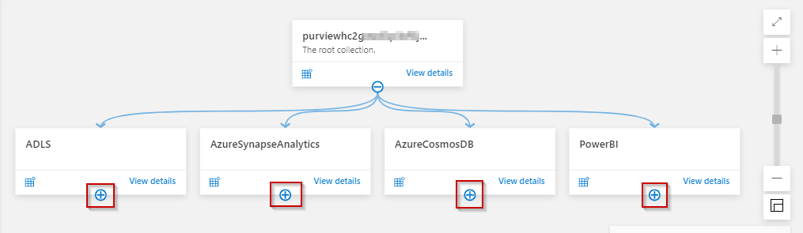

5. Under the datasource AzureDataLakeStorage **click** on View Details.

	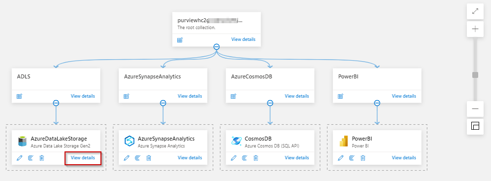

6. **Click** on New Scan, a window appears, here verify the default values in the different fields, **select** your collection name and finally **click** on Continue.

	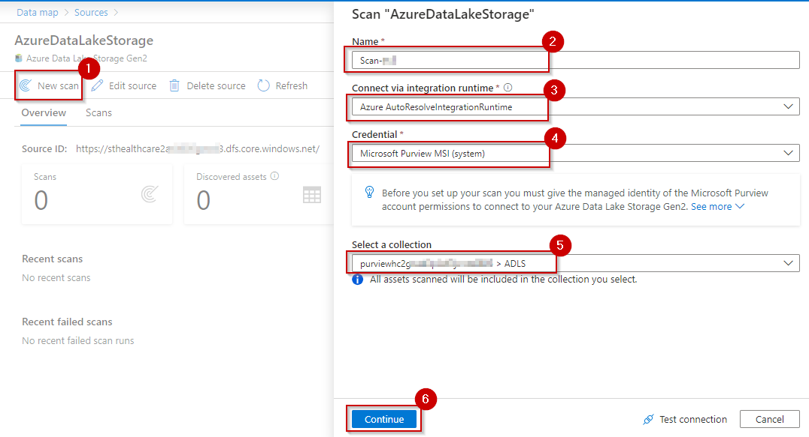
	
7. In the new window verify that the check box is **checked** for all the required containers, and then **click** on continue.

	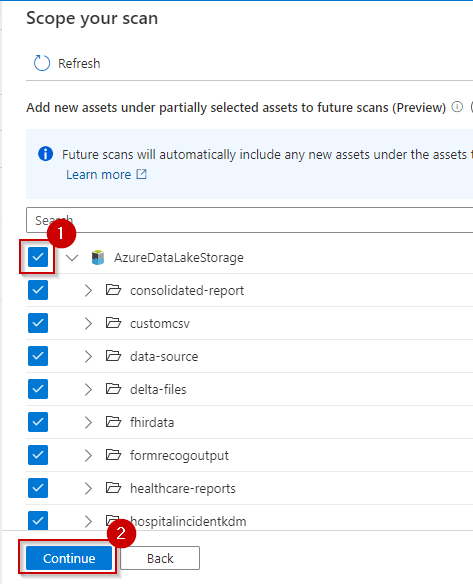
	
8. Again **click** on continue.

	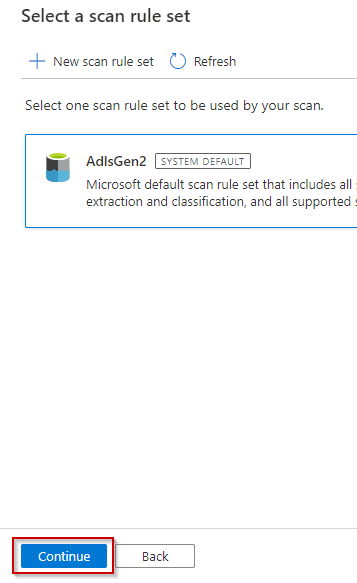
	
9. In the new window **check** the Once radio button and **click** on continue.

	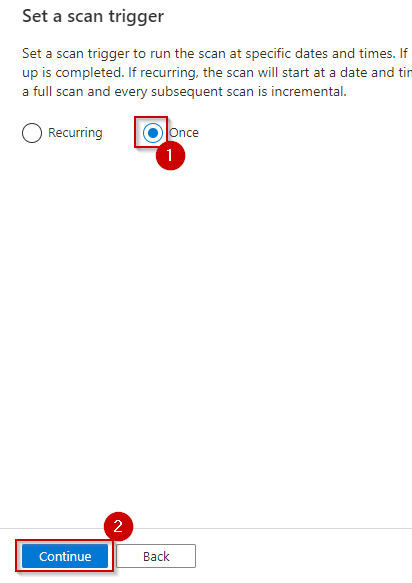
	
10. In the new window **click** on Save and run.

	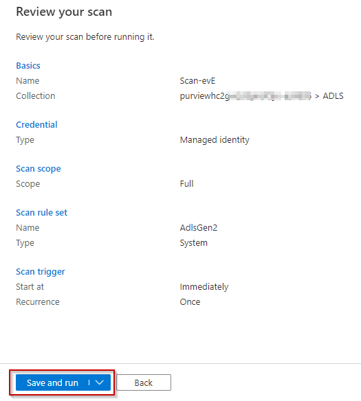
	
11. **Run** the scans for AzureSynapseAnalytics, AzureSqlDatabase and PowerBI as well. 
	
### Task 8: Power BI reports and dashboard creation

### Steps to validate the credentials for reports

1. **Open** Power BI and **Select** the Workspace, which is created in [Task 2](#task-2-power-bi-workspace-creation).
	
	
	
Once [Task 4](#task-4-run-the-cloud-shell-to-provision-the-demo-resources) has been completed successfully and the template has been deployed, you will be able to see a set of reports in the Reports tab of Power BI, and real-time datasets in the Dataset tab. 

The image on the below shows the Reports tab in Power BI.  We can create a Power BI dashboard by pinning visuals from these reports.

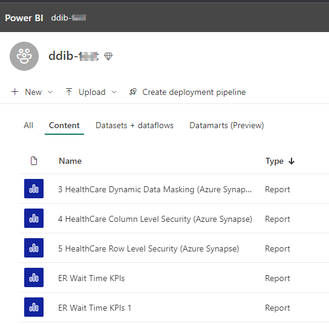
	
> **Note:** If you do not see this list in your workspace after script execution, it may indicate that something went wrong during execution. You may use the subscript to patch it or manually upload the reports from this location and changing their parameters appropriately before authentication.

To give permissions for the Power BI reports to access the data sources:

3. **Click** on settings and a dropdown will appear.

4. **Click** on Power BI Settings.

	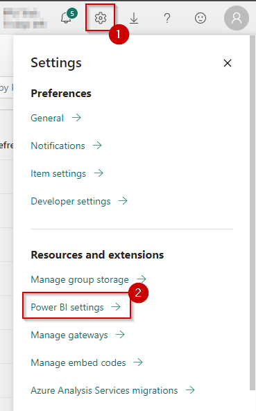

5. **Click** on ‘Datasets’ tab.
	
	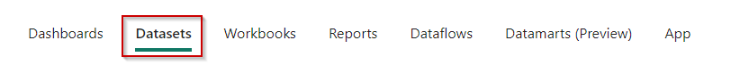
	
6. **Click** on the dataset "Healthcare - Bed Occupancy".

7. **Expand** Data source credentials.

8. **Click** Edit credentials and a dialogue box will pop up.

	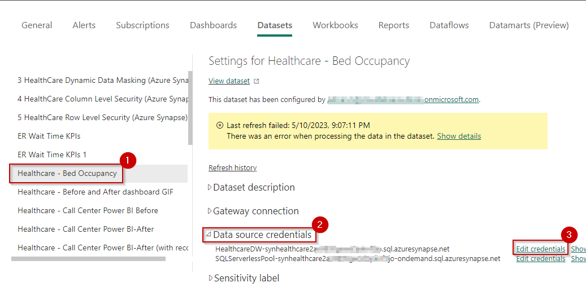

> **Note:** Verify the server name has been updated to your current sql pool name for all the datasets. If not, update the same under parameters section and click apply.

9. **Enter** Username as ‘labsqladmin’.

10. **Enter** the same SQL Administrator login password that was created for [Task 3](#task-3-deploy-the-arm-template) Step #5.

11. **Click** on Sign in.

	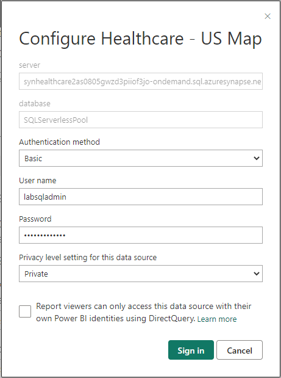
	
12. Again **repeat** the same steps from #8 to step #10 for the Serverless Pool.

	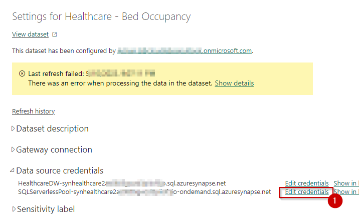
	
13. **Scroll** down and **click** on the dataset "Payor Dashboard reports".

14. **Expand** Data source credentials.

15. **Click** Edit credentials in front of AzureBlob and a dialogue box will pop up.

	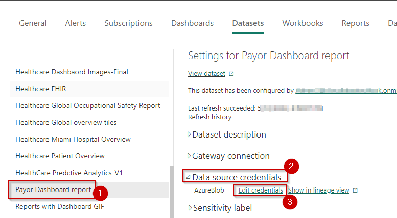

16. **Select** Authentication method as "OAuth2" and Privacy level as "Organisational" and **Click** on Sign in, a new window will pop-up.

	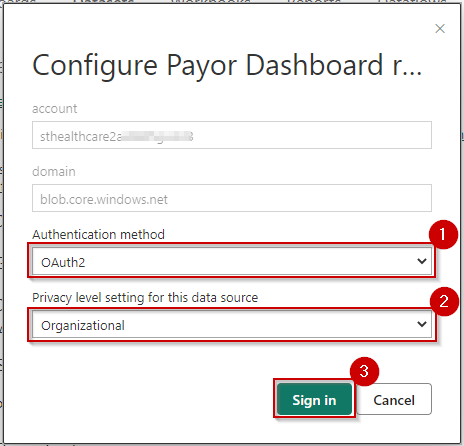

17. In the new window, **select** the appropriate user.

	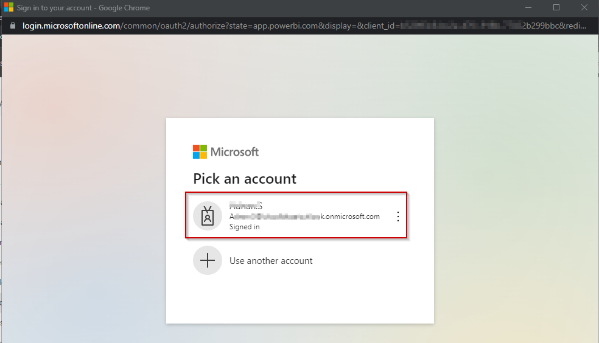
		
18. **Click** on the dataset "Static Realtime Healthcare analytics".

19. **Expand** Data source credentials.

20. **Click** Edit credentials and a dialogue box will pop up.

	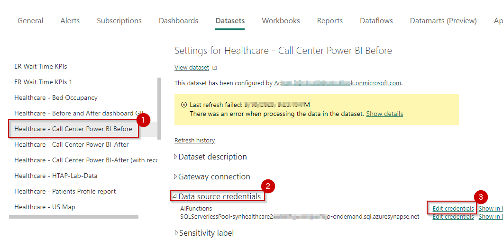

21. **Navigate** back to the resource group and **search** for "sthealthcare2" and **click** on the storage account resource.

	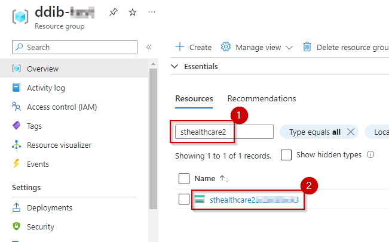

22. **Scroll** down in the left tab, **click** on Access Key and **click** on "Show" in the key field.

	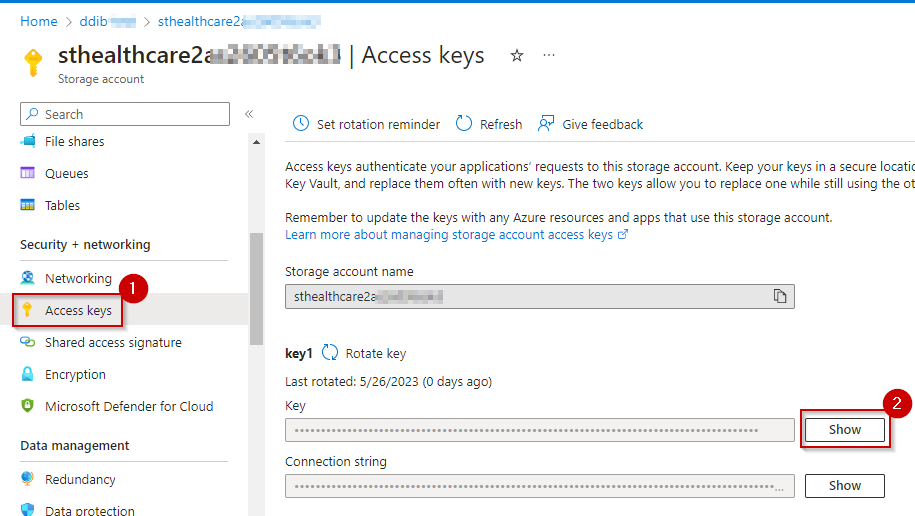

23. **Copy** the key by clicking on the copy buttin and navigate back to the PowerBI Workspace.

	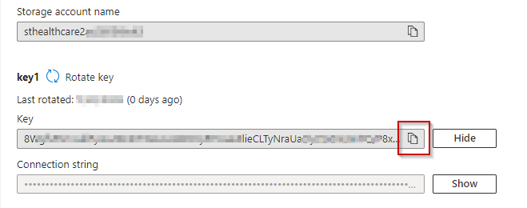

24. **Select** Authentication method as "Key", in the "Account key" field **paste** the copied value and **Click** on Sign in.

	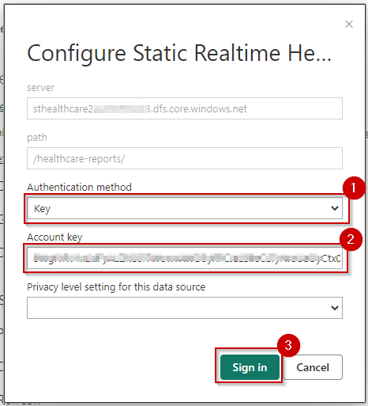
	
### Steps to create realtime reports

1.	There is a Static Realtime Report namely "Static Realtime Healthcare analytics.pbix" at location [Static Realtime Healthcare analytics](https://github.com/microsoft/Azure-Analytics-and-AI-Engagement/tree/healthcare2/healthcare2/artifacts/reports)

2. You can refer this report to create required KPIs and Graphs for creating realtime reports according to your need.

	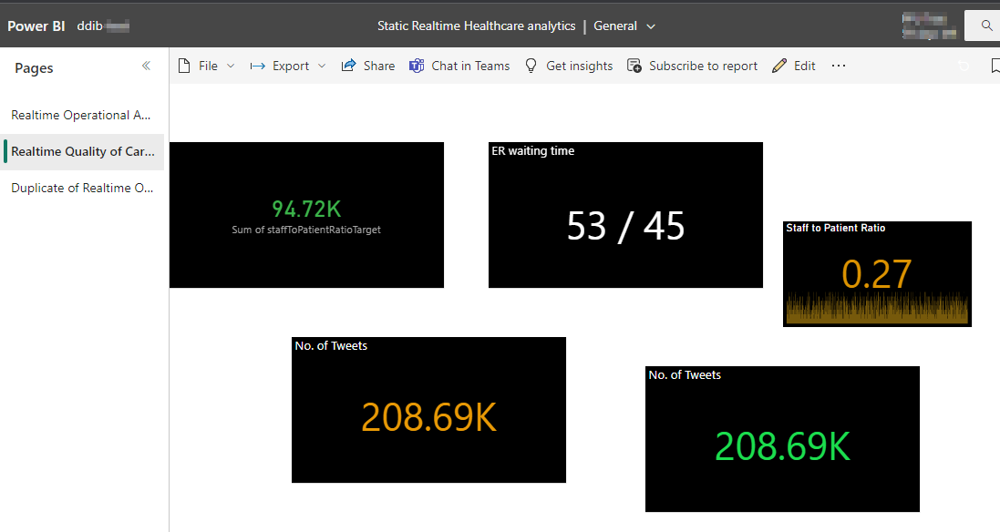
		
### Follow these steps to create the Power BI dashboard

1. **Select** the workspace created in [Task 2](#task-2-power-bi-workspace-creation).

	
	
2. **Click** on ‘+ New’ button on the top-right navigation bar.

3. **Click** the ‘Dashboard’ option from the drop-down menu.

      

4. **Name** the dashboard 'Payor Executive Dashboard Before' and **click** 'create'.

	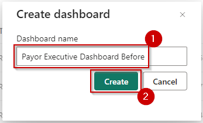

5. This new dashboard will appear in the 'Dashboard' section of the Power BI workspace.

**Follow the below steps to change the dashboard theme:**

6. **Open** the URL in a new browser tab to get JSON code for a custom theme:
[https://raw.githubusercontent.com/microsoft/Azure-Analytics-and-AI-Engagement/healthcare2/healthcare2/CustomTheme.json](https://github.com/microsoft/Azure-Analytics-and-AI-Engagement/blob/healthcare2/healthcare2/CustomTheme.json)

7. **Right click** anywhere in browser and **click** 'Save as...'.

8. **Save** the file to your desired location on your computer, leaving the name unchanged.

	

9. **Go back** to the Power BI dashboard you just created.

10. **Click** on the “Edit” at the top right-side corner.

11. **Click** on “Dashboard theme”.

	

12. **Click** ‘Upload the JSON theme’.

13. **Navigate** to the location where you saved the JSON theme file in the steps above and **select** open.

14. **Click** Save.

	

**Follow these steps to pin the report to the Power BI dashboard:**

15. **Search** the report 'Payor Dashboard report' and then **click** on the report to open it.

	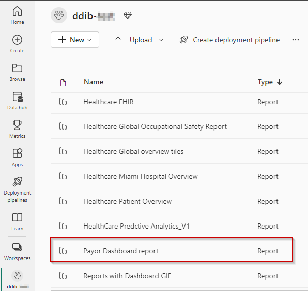

16. Inside the report 'Payor Dashboard report' **goto** "Financial Analytics - Before" tab and **click** on 'Edit' at the top of the right corner.

	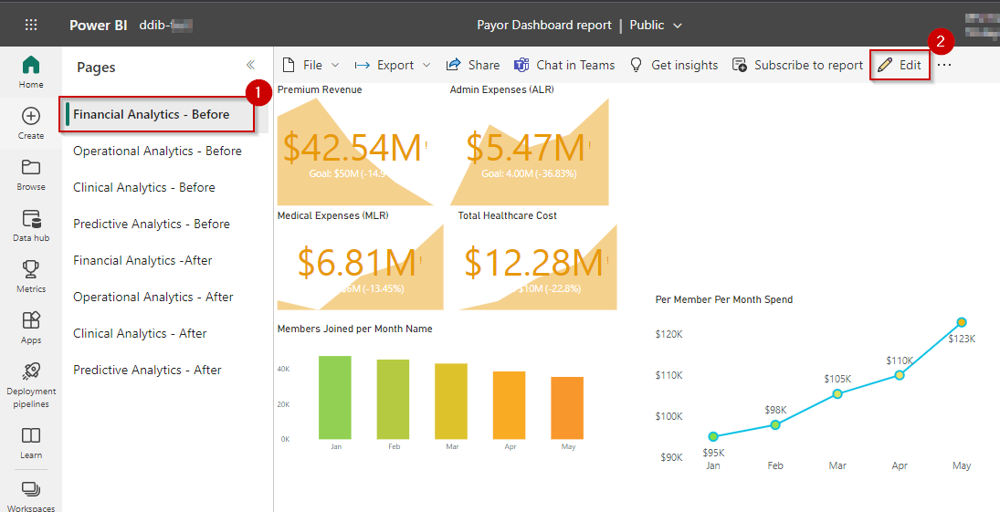

17. **Click** over the tile and **click** on the icon to 'Pin to dashboard'.

	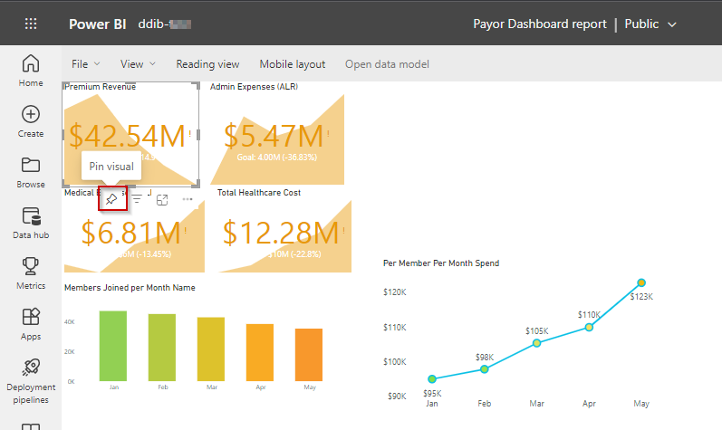	

18. 'Pin to dashboard' window will appear.

19. **Select** the 'Existing Dashboard' radio button.

20. **Select** the existing dashboard 'Payor Executive Dashboard Before' and **click** on the 'Pin' button.

	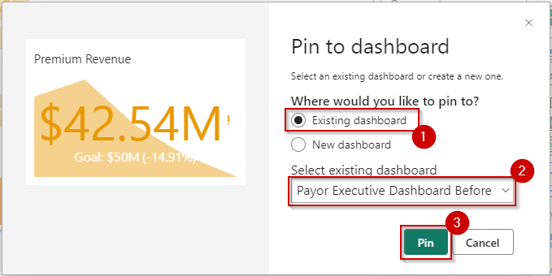

21. Similarly, **pin** the others tiles to the Dashboard

	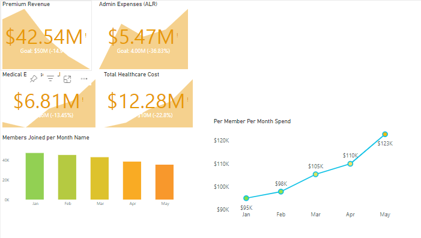
	
22. Similarly, **pin** the other tiles from different tabs of 'Payor Dashboard report' to the Dashboard.

23. **Select** workpace created in [Task 2](#task-2-power-bi-workspace-creation) in the left pane.

	
	
24. **Open** ‘Healthcare Dashbaord Images-Final’ report.

	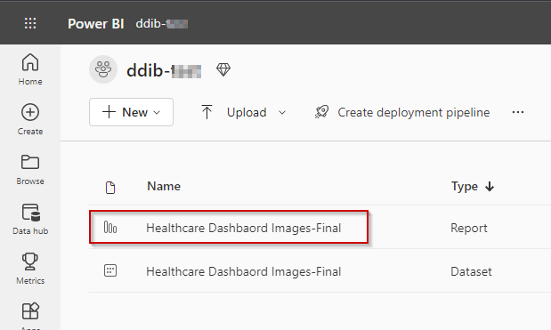
	
25. **Click** on Edit.

	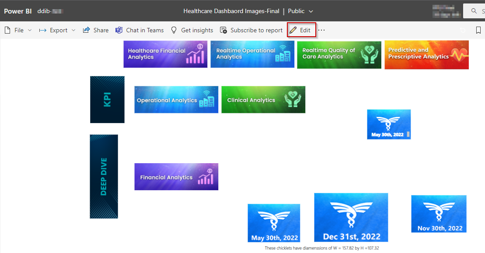

26. **Click** on 'image' page.
	
27. **Hover** on Deep Dive chicklet and **click** pin button.

	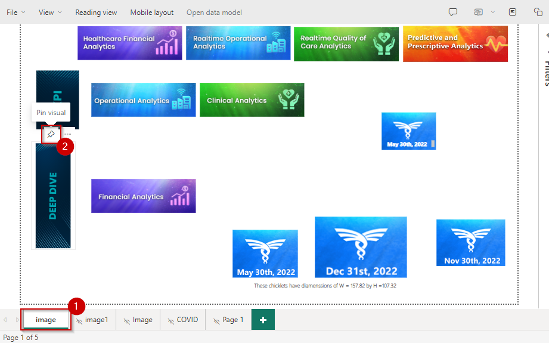
	
28. Select the ‘Payor Executive Dashboard Before’ from existing dashboard list and **click** on pin.
	
	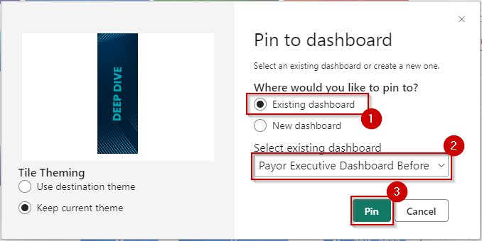

29. Similarly pin rest of the images from different tabs of the ‘Healthcare Dashbaord Images-Final’ report.
	
30. **Go back** to the ‘Payor Executive Dashboard Before’ dashboard.

	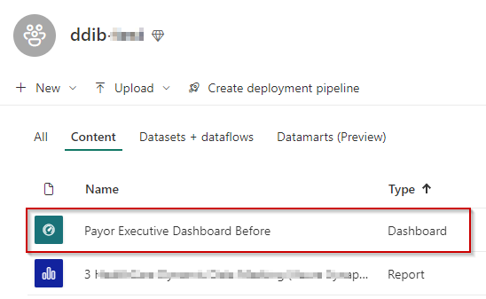
	
To hide title and subtitle for all the **images** that you have pined above. Please do the following:

31. Hover on the chiclet and **Click** on ellipsis ‘More Options’ of the image you selected.

32. **Click** on ‘Edit details’.

	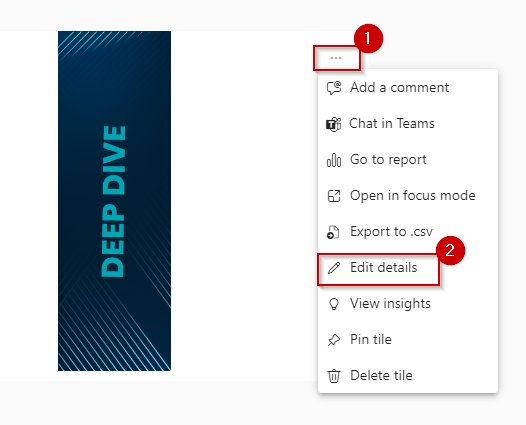
	
33. **Uncheck** ‘Display title and subtitle’.

34. **Click** on ‘Apply’.

35. **Repeat** Step 25 to 34 for all image tiles.

	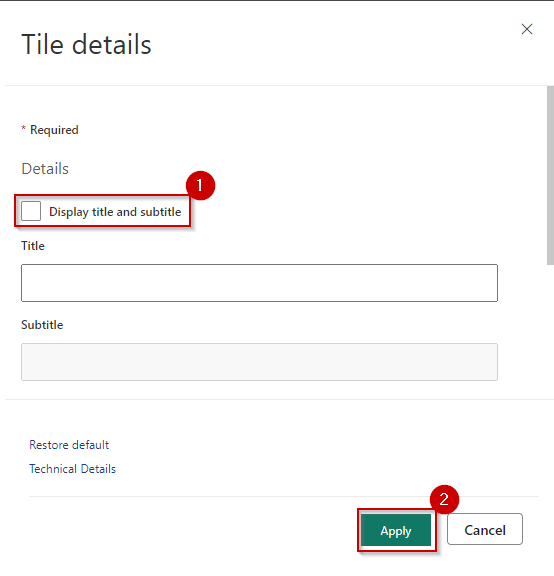
	
36. After disabling ‘Display title and subtitle’ for all images, **resize** and **rearrange** the top images tiles as shown in the screenshot. 
	
	
	
37. Similarly pin left image tiles from ‘Healthcare Dashbaord Images-Final’ of chicklets report to the "Payor Executive Dashboard Before" Dashboard.

38. **Resize** and **rearrange** the left images tiles as shown in the screenshot. Resize the KPI tile to 1x2. Resize the Deep Dive to 1x4. Resize the logo to 1x1 size; resize other vertical tiles to 2x1 size.  

	

39. The Dashboard **Payor Executive Dashboard Before** should finally look like this. Table in following row indicates which KPI’s need to be pinned from which report to achieve this final look.
	
	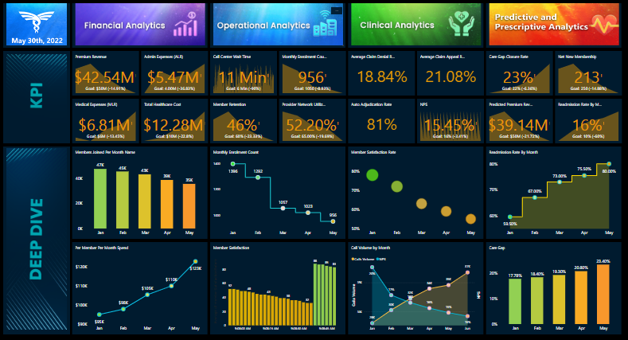

40. **Refer** to this table while pinning rest of the tiles to the dashboard.

	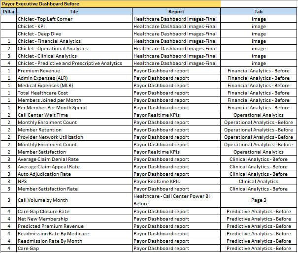

41. Here is the list of Dashboards you have to create for Retail and the report to migrate to prod environment. You will see the necessary details for the same below. You must refer to the [Excel](https://github.com/microsoft/Azure-Analytics-and-AI-Engagement/blob/healthcare2/healthcare2/Dashboard%20Mapping.xlsx) file for pinning the tiles to the dashboard.

	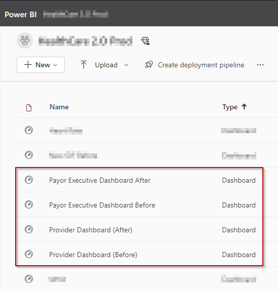

42. **Payor Executive Dashboard After** should look like this. Following are the details of tiles for the same.

	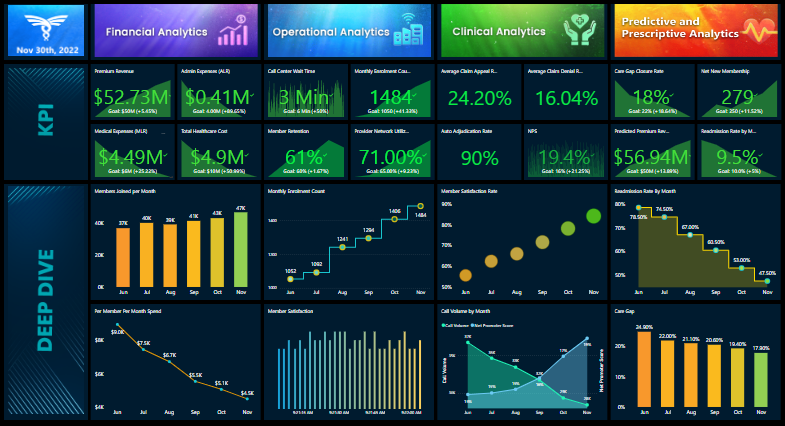
	
43. **Refer** to this table while pinning rest of the tiles to the dashboard.

	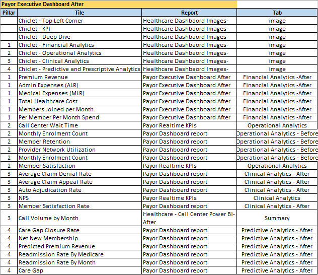
	
44. **Provider Dashboard (Before)** should look like this. Following are the details of tiles for the same.

	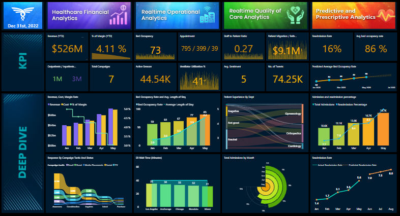
	
45. **Refer** to this table while pinning rest of the tiles to the dashboard.

	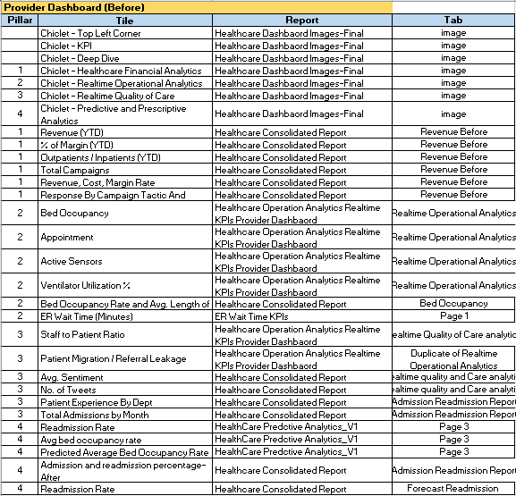
	
46. **Provider Dashboard (After)** should look like this. Following are the details of tiles for the same.

	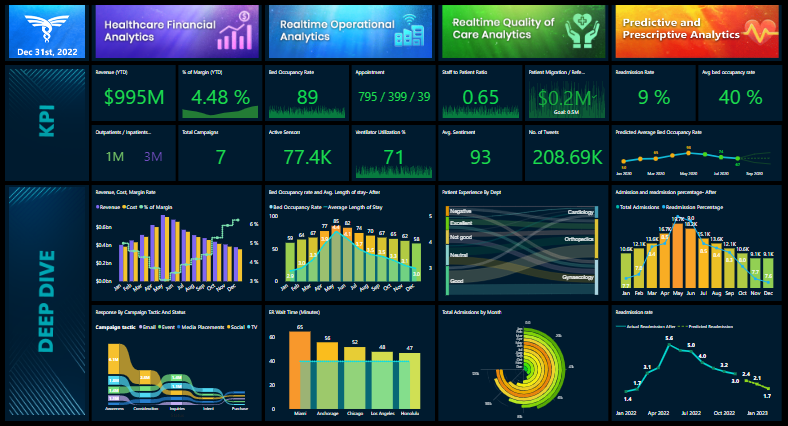
	
47. **Refer** to this table while pinning rest of the tiles to the dashboard.

	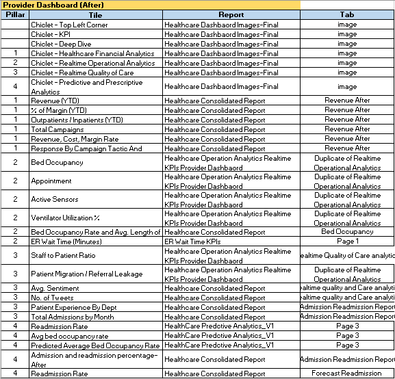


### Updating Dashboard and Report Ids in Web app

By default, the web app will be provisioned with Gif placeholders for web app screens with dashboards. Once you have completed the steps listed above in this section, you can update the dashboard id’s generated into the main web app if you choose. Here are the steps for it.

1. **Navigate** to your Power BI workspace.

2. **Click** on one of the dashboards you created. Eg. Payor Executive Dashboard Before.

	

3. **Copy** the dashboard id from the url bar at the top.
	
	

4. **Navigate** to Azure Portal.

5. **Open** the Azure Cloud Shell by selecting its icon from the top toolbar.

	

6. **Click** on upload/download button.

7. **Click** download.

8. **Enter** the following path:  
	
	```
	healthcare2/healthcare2/healthcare2-demo-app/wwwroot/config-poc.js
	```

9. **Click** Download button.

	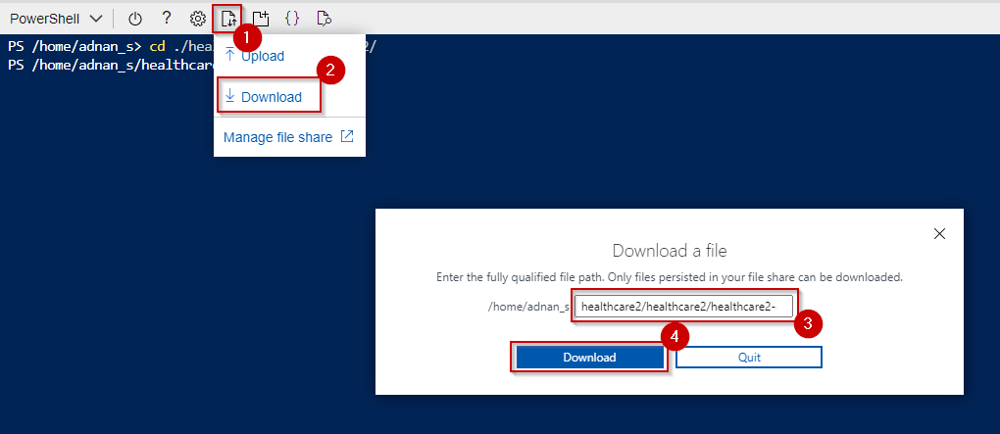
	
10. At the right bottom of the cloudshell screen you get a hyperlink, **click** on it.

	

11. **Edit** the downloaded file in notepad.

12. **Paste** the dashboard id you copied earlier between the double quotes of key ‘PayorExecutiveDashboardID’.

13. Similarly repeat step #12 according to the following mapping:

	| Field Name                        	| Type     |
	|---------------------------------------|----------|
	| HospitalInsightsDashboardID 			| HealthCare 2.0 Dashboard (Before) |
	| PSAfterDashBoard_ID					| HealthCare 2.0 Dashboard (After) |
	| PayorExecutiveDashboardID				| Payor Executive Dashboard Before |
	| PayorExecutiveDashboardAfterID		| Payor Executive Dashboard After |

14. **Save** the changes to the file.

	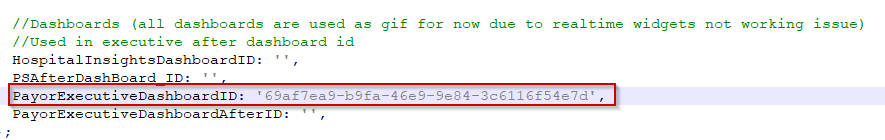

15. **Navigate** to Azure Portal.

16. **Open** the Azure Cloud Shell by selecting its icon from the top toolbar.

	

17. **Click** upload/download button.

18. **Click** upload.

19. **Select** the config-poc.js file you just updated.

20. **Click** open.

	

21. **Execute** the following command in cloudshell:  
	
	```
	cp config-poc.js ./healthcare2/healthcare2/healthcare2-demo-app/wwwroot
	```
	
	

22.	**Execute** the following command in cloudshell: 
	
	```
	cd healthcare2/healthcare2/subscripts 
	./updateWebAppSubScript.ps1
	```
	
	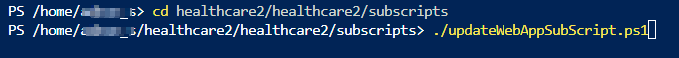

23. From the Azure Cloud Shell, **copy** the authentication code. 

24. **Click** on the link [https://microsoft.com/devicelogin](https://microsoft.com/devicelogin) and a new browser window will launch.

	

25. **Paste** the authentication code.

26. **Select** appropriate username when prompted.

27. Wait for the script execution to complete.

	

> **Note:** You may be prompted to select your subscription if you have multiple subscriptions.
	
> **Note:** The setup for your Dream Demo in a Box is done here and now you can follow the demo script for testing/demoing your environment.
	
### Task 9: Pause or Resume script

> **Note:** Please perform these steps after your demo is done and you do not need the environment anymore. Also ensure you Resume the environment before demo if you paused it once. 
 
1. **Open** the Azure Portal 

2. **Click** on the Azure Cloud Shell icon from the top toolbar. 

	

**Execute** the Pause_Resume_script.ps1 script by executing the following command: 
3. **Run** Command: 
	```
	cd "healthcare2\healthcare2"
	```

4. Then **run** the PowerShell script: 
	```
	./pause_resume_script.ps1 
	```
	
	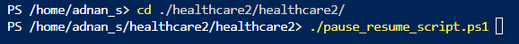
	
5. From the Azure Cloud Shell, **copy** the authentication code
	
	
	
6. Click on the link [https://microsoft.com/devicelogin](https://microsoft.com/devicelogin) and a new browser window will launch.
	
7. **Paste** the authentication code.
	
	
	
8. **Select** the same user that you used for signing into the Azure Portal in [Task 1](#task-1-create-a-resource-group-in-azure). 

9. **Close** this window after it displays successful authentication message.

	

10. When prompted, **enter** the resource group name to be paused/resumed in the Azure Cloud Shell. Type the same resource group name that you created. 
	
	

11. **Enter** your choice when prompted. Enter ‘P’ for **pausing** the environment or ‘R’ for **resuming** a paused environment. 

11. Wait for the script to finish execution. 

	

### Task 10: Clean up resources

> **Note: Perform these steps after your demo is done and you do not need the resources anymore**

**Open** the Azure Portal.

1. Open the Azure Cloud Shell by **clicking** its icon from the top toolbar.

	

**Execute** the resourceCleanup.ps1 script by executing the following:

2. **Run** Command: 
	```
	cd "healthcare2\healthcare2"
	```

3. Then **run** the PowerShell script: 
	```
	./resource_cleanup.ps1
	```

	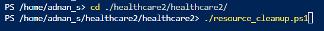

4. You will now be prompted to **enter** the resource group name to be deleted in the Azure Cloud Shell. Type the same resource group name that you created in [Task 1](#task-1-create-a-resource-group-in-azure) - 'DDiB-Healthcare2'.

5. You may be prompted to select a subscription in case your account has multiple subscriptions.

	
	
	> **Notes:**
	> - The user with single subscription won't be prompted to select subscription.
	> - The subscription highlighted in yellow will be selected by default if you do not enter any disired subscription. Please select the subscription carefully, as it may break the execution further.
	> - While you are waiting for processes to get completed in the Azure Cloud Shell window, you'll be asked to enter the code three times. This is necessary for performing installation of various Azure Services and preloading content in the Azure Synapse Analytics SQL Pool tables.

6. You will now be prompted to **enter** the resource group name in the Azure Cloud Shell. Type the same resource group name that you created in [Task 1](#task-1-create-a-resource-group-in-azure). – 'DDiB-Healthcare2'.

	
