# Modern Analytics with Microsoft Fabric and Azure Databricks DREAM PoC Accelerator

## DISCLAIMER
This presentation, demonstration, and demonstration model are for informational purposes only and (1) are not subject to SOC 1 and SOC 2 compliance audits, and (2) are not designed, intended or made available as a medical device(s) or as a substitute for professional medical advice, diagnosis, treatment or judgment. Microsoft makes no warranties, express or implied, in this presentation, demonstration, and demonstration model. Nothing in this presentation, demonstration, or demonstration model modifies any of the terms and conditions of Microsoft’s written and signed agreements. This is not an offer and applicable terms and the information provided are subject to revision and may be changed at any time by Microsoft.

This presentation, demonstration, and demonstration model do not give you or your organization any license to any patents, trademarks, copyrights, or other intellectual property covering the subject matter in this presentation, demonstration, and demonstration model.

The information contained in this presentation, demonstration and demonstration model represents the current view of Microsoft on the issues discussed as of the date of presentation and/or demonstration, for the duration of your access to the demonstration model. Because Microsoft must respond to changing market conditions, it should not be interpreted to be a commitment on the part of Microsoft, and Microsoft cannot guarantee the accuracy of any information presented after the date of presentation and/or demonstration and for the duration of your access to the demonstration model.

No Microsoft technology, nor any of its component technologies, including the demonstration model, is intended or made available as a substitute for the professional advice, opinion, or judgment of (1) a certified financial services professional, or (2) a certified medical professional. Partners or customers are responsible for ensuring the regulatory compliance of any solution they build using Microsoft technologies.

## Copyright

© 2023 Microsoft Corporation. All rights reserved. 

By using this demo/lab, you agree to the following terms:

The technology/functionality described in this demo/lab is provided by Microsoft Corporation for purposes of obtaining your feedback and to provide you with a learning experience. You may only use the demo/lab to evaluate such technology features and functionality and provide feedback to Microsoft. You may not use it for any other purpose. You may not modify, copy, distribute, transmit, display, perform, reproduce, publish, license, create derivative works from, transfer, or sell this demo/lab or any portion thereof.

COPYING OR REPRODUCTION OF THE DEMO/LAB (OR ANY PORTION OF IT) TO ANY OTHER SERVER OR LOCATION FOR FURTHER REPRODUCTION OR REDISTRIBUTION IS EXPRESSLY PROHIBITED.

THIS DEMO/LAB PROVIDES CERTAIN SOFTWARE TECHNOLOGY/PRODUCT FEATURES AND FUNCTIONALITY, INCLUDING POTENTIAL NEW FEATURES AND CONCEPTS, IN A SIMULATED ENVIRONMENT WITHOUT COMPLEX SET-UP OR INSTALLATION FOR THE PURPOSE DESCRIBED ABOVE. THE TECHNOLOGY/CONCEPTS REPRESENTED IN THIS DEMO/LAB MAY NOT REPRESENT FULL FEATURE FUNCTIONALITY AND MAY NOT WORK THE WAY A FINAL VERSION MAY WORK. WE ALSO MAY NOT RELEASE A FINAL VERSION OF SUCH FEATURES OR CONCEPTS. YOUR EXPERIENCE WITH USING SUCH FEATURES AND FUNCITONALITY IN A PHYSICAL ENVIRONMENT MAY ALSO BE DIFFERENT.

## Requirements

* An Azure Account with the ability to create Fabric Workspace.
* A Power BI with Fabric License to host Power BI reports.
* Make sure your Power BI administrator can provide service principal access on your Power BI tenant.
* Make sure to register the following resource providers with your Azure Subscription:
   - Microsoft.Fabric
   - Microsoft.Databricks
   - Microsoft.EventHub
   - Microsoft.SQLSever
   - Microsoft.StorageAccount
   - Microsoft.AppService
* You must only execute one deployment at a time and wait for its completion.Running multiple deployments simultaneously is highly discouraged, as it can lead to deployment failures.
* Select a region where the desired Azure Services are available. If certain services are not available, deployment may fail. See [Azure Services Global Availability](https://azure.microsoft.com/en-us/global-infrastructure/services/?products=all) for understanding target service availability. (Consider the region availability for Synapse workspace, Iot Central and cognitive services while choosing a location)
* In this Accelerator, we have converted real-time reports into static reports for the users' ease but have covered the entire process to configure real-time dataset. Using those real-time dataset, you can create real-time reports.
* Make sure you use the same valid credentials to log into Azure and Power BI.
* Once the resources have been setup, ensure that your AD user and synapse workspace have “Storage Blob Data Owner” role assigned on storage account name starting with “storage”.
* Review the [License Agreement](https://github.com/microsoft/Azure-Analytics-and-AI-Engagement/blob/main/CDP-Retail/license.md) before proceeding.

## Table of contents

- [Exercise 1: Data Engineering experience, Including Data ingestion from a spectrum of analytical data sources into OneLake](#exercise-1-data-engineering-experience-including-data-ingestion-from-a-spectrum-of-analytical-data-sources-into-onelake)

	- [Task 1.1: Create a Microsoft Fabric enabled workspace](#task-11-create-a-microsoft-fabric-enabled-workspace)

	- [Task 1.2: Create/Build a Lakehouse](#task-12-createbuild-a-lakehouse)

	- [Task 1.3: Data ingestion](#task-13-data-ingestion)
		-   [Using Data Pipelines/Data Flow ‘No Code-Low Code experience’](#option-1-using-data-pipelinesdata-flow-no-code-low-code-experience)
		-   [Using the ‘New Shortcut’ option from external data sources](#option-2-using-the-onelake-shortcuts-option-from-external-data-sources)
		-   [Using Spark Notebook ‘Code-first experience’](#option-3-using-spark-notebook-code-first-experience)

- [Exercise 2: Explore an analytics pipeline using open Delta format and Azure Databricks Delta Live Tables. Stitch data (landed earlier) to create a combined data product to build a simple Lakehouse and integrate with OneLake](#exercise-2-explore-an-analytics-pipeline-using-open-delta-format-and-azure-databricks-delta-live-tables-stitch-data-landed-earlier-to-create-a-combined-data-product-to-build-a-simple-lakehouse-and-integrate-with-onelake)

	- [Task 2.1: Set up an Azure Databricks environment](#task-21-set-up-an-azure-databricks-environment)

	- [Task 2.2: Create a Delta Live Table pipeline](#task-22-create-a-delta-live-table-pipeline)

	- [Task 2.3: Explore SQL Analytics with Lakehouse SQL-endpoint](#task-23-explore-sql-analytics-with-lakehouse-sql-endpoint)

- [Exercise 3: Data Science experience including Machine Learning scenarios](#exercise-3-data-science-experience-including-machine-learning-scenarios)

	- [Task 3.1: Build ML models, experiments and a Log ML model in the built-in model registry using MLflow and batch scoring](#task-31-build-ml-models-experiments-log-ml-model-in-the-built-in-model-registry-using-mlflow-and-batch-scoring)

- [Exercise 4: Power BI reports using Direct Lake Mode](#exercise-4-power-bi-reports-with-direct-lake)

	- [Task 4.1: Leverage Power BI to derive actionable insights from data in Lakehouse using Direct Lake mode](#task-41-leverage-power-bi-to-derive-actionable-insights-from-data-in-lakehouse-using-direct-lake-mode)

- [Exercise 5: Data Warehouse experience, explore SQL Analytics with Data Warehouse](#exercise-5-data-warehouse-experience-explore-sql-analytics-with-data-warehouse)

	- [Task 5.1: Create a Data Warehouse](#task-51-create-a-data-warehouse)
	- [Task 5.2: Load data in the warehouse](#task-52-load-data-in-the-warehouse)
	- [Task 5.3: Create virtual Data Warehouses](#task-53-create-virtual-data-warehouses)

- [Exercise 6: Real-time Analytics experience to explore Streaming data using KQL DB](#exercise-6-real-time-analytics-experience-to-explore-streaming-data-using-kql-db)

	- [Task 6.1: Create a KQL Database](#task-61-create-a-kql-database)

	- [Task 6.2: Ingest real-time/historical data into KQL DB](#task-62-ingest-real-timehistorical-data-into-kql-db)

	- [Task 6.3: Analyze/discover patterns, identify anomalies and outliers using Kusto Query Language (KQL)](#task-63-analyzediscover-patterns-identify-anomalies-and-outliers-using-kusto-query-language)

	- [Task 6.4: Create a Real-time Power BI report using KQL DB/KQL Query](#task-64-create-a-real-time-power-bi-report-using-kql-dbkql-query)

## Before you begin

1. **Open** Azure Portal by clicking [HERE](https://portal.azure.com/).

2. In the Resource group section, **select** the Terminal icon to open Azure Cloud Shell.

	

3. **Click** 'Show advanced settings'.

	

> **Note:** If you already have a storage mounted for Cloud Shell, you will not get this prompt. In that case, skip step 4 and 5.

4. **Select** your 'Subscription', 'Cloud Shell region' and 'Resource Group'.

>**Note:** If you do not have an existing resource group please follow the steps mentioned [HERE](#creating-a-resource-group) to create one. Complete the task and then continue with the below steps.

>Cloud Shell region need not be specific, you may select any region which works best for your experience.

5. **Enter** the 'Storage account', 'File share' name and then **click** on 'Create storage'.

	

> **Note:** If you are creating a new storage account, give it a unique name with no special characters or uppercase letters. The whole name should be in small case and not more than 24 characters.

> It is not mandatory for storage account and file share name to be same.

6. In the Azure Cloud Shell window, ensure that the PowerShell environment is selected.

	

>**Note:** All the cmdlets used in the script works best in Powershell.	

7. **Enter** the following command to clone the repository files in cloudshell.

Command:
```
git clone -b ignite-lab --depth 1 --single-branch https://github.com/microsoft/Azure-Analytics-and-AI-Engagement.git ignite
```

   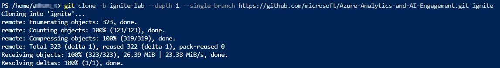
	
> **Note:** If you get File already exist error, please execute the following command to delete existing clone and then reclone:
```
 rm ignite -r -f 
```
   > **Note**: When executing scripts, it is important to let them run to completion. Some tasks may take longer than others to run. When a script completes execution, you will be returned to a command prompt. 

8. **Execute** the Powershell script with the following command:
```
cd ./ignite/ignite/
```

```
./igniteSetup.ps1
```
    
   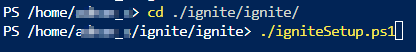

9. **Enter** 'Y' to confirm for the agreement.

	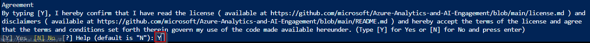
      
10. From the Azure Cloud Shell, **copy** the authentication code. You will need to enter this code in next step.

11. **Click** the link [https://microsoft.com/devicelogin](https://microsoft.com/devicelogin) and a new browser window will launch.

	
     
12. **Paste** the authentication code.

	

13. **Select** the user account that is used for logging into the Azure Portal.

	

14. **Click** on 'Continue' button.

	

15. **Close** the browser tab once you see the message box.

	  

16. **Navigate back** to your Azure Cloud Shell execution window.

17. **Copy** the code on screen to authenticate Azure PowerShell script for creating reports in Power BI.

18. **Click** the link [https://microsoft.com/devicelogin](https://microsoft.com/devicelogin).

	

19. A new browser window will launch.

20. **Paste** the authentication code you copied from the shell above.

	

21. **Select** the user account that is used for logging into the Azure Portal in [Task 1](#task-1-create-a-resource-group-in-azure).

	

22. **Click** on 'Continue'.

	

23. **Close** the browser tab once you see the message box.

	

24. **Go back** to Azure Cloud Shell execution window.

25. **Copy** your subscription name from the screen and **paste** it in the prompt.

    

26. **Enter** 'Y' to confirm for the selected subscription.

	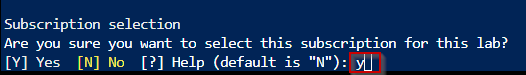
	
> **Notes:**
> - The user with single subscription won't be prompted to select subscription.
> - The subscription highlighted in yellow will be selected by default if you do not enter any desired subscription. Please select the subscription carefully, as it may break the execution further.
> - While you are waiting for processes to get completed in the Azure Cloud Shell window, you'll be asked to enter the code three times. This is necessary for performing installation of various Azure Services and preloading the data.

27. **Enter** the Region for deployment with necessary resources available, preferably "eastus". (ex. eastus, eastus2, westus, westus2 etc)

	

28. **Enter** desired SQL Password.

	

>**Note:** Copy the password in Notepad for further reference.

>**Note:** During script execution you need to note the resource group which gets created, since a resource group with unique suffix is created each time the script is executed.

>**Note:** The deployment will take approximately 15-20 minutes to complete. Keep checking the progress with messages printed in the console to avoid timeout.

29. After the script execution is complete, the user is prompted "--Execution Complete--"
	
30. **Go to** Azure Portal and **search** for 'fabric-dpoc' and **click** on the resource group name which was created by the script.

	

	>**Note:** The resource group name starts with 'fabric-dpoc-' with some random unique suffix in the end.

31. In the search pane of the resource group **type** "app-realtime-kpi-analytics..." and **select** the resource.

	

32. **Click** "Browse" and a new tab will open.

	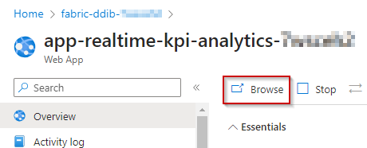

33. **Wait** for the tab to load till you get the following screen.

	


**The estimated time to complete this lab is 45-60 minutes.**


## Overview

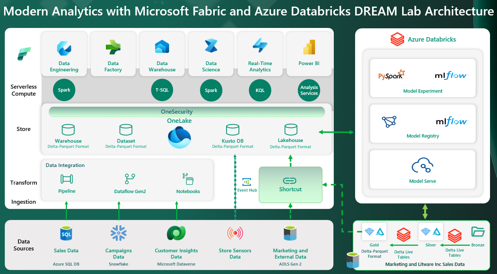

This lab showcases Modern Analytics with Microsoft Fabric and Azure Databricks, featuring a cost-effective, performance-optimized, and cloud-native Analytics solution pattern. This architecture unifies our customers' data estate to accelerate data value creation. The visual illustrates the real-world example for Contoso, a fictitious company. Contoso is a retailer with thousands of brick-and-mortar stores across the world. They also have an online store. Contoso is acquiring Litware Inc. Litware Inc. has curated marketing data and sales data processed by Azure Databricks and stored in the gold layer in ADLS Gen 2. During our exercises, we will see how they leveraged the power of Microsoft Fabric to ingest data from disparate sources, combine data with their existing data from ADLS Gen2, and derive meaningful insights. You will witness how the team used a shortcut to reference the existing Litware Inc data from ADLS Gen2. You will also see how they mounted the OneLake endpoint in Azure Databricks to derive meaningful insights using the compute in Azure Databricks.

The lab scenario starts on January 30th. The company's new CEO, April, recently noticed negative trends in their KPIs, including:

* High customer churn
* Declining sales revenue
* High bounce rate on their website
* High operating expense
* Poor customer experience

April asks Rupesh, the Chief Data Officer how they could create a data driven organization and reverse these adverse KPI trends. Rupesh talks to his technical team, including Eva, the data engineer, Miguel, the data scientist and Wendy, the business analyst to design and implement a solution pattern to realize this dream of a data driven organization. Our story is centered around Rupesh and his team. They recognize that the existence of data silos within Contoso's various departments presents a significant integration challenge.

During this lab you will execute some of these steps as a part of this team to reverse these adverse KPI trends.

Here are the Microsoft Fabric workloads showcased in this solution along with Azure Databricks.

**1. Synapse Data Engineering**

Combines the best of the data lake and warehouse, removing the friction of ingesting, transforming, and sharing organizational data, all in an open format. Users can choose from various ways of bringing data into the Lakehouse including dataflow & pipelines, and they can even use shortcuts to create virtual folders and tables without any data movement between the storage accounts. The goal is to simplify the process of working with organizational data. Rather than spending time on integrating various products, managing infrastructure, and stitching together a spectrum of data sources, Microsoft aims to empower data engineers to focus on their core responsibilities and tasks.


**2. Data Factory**

Data Factory empowers users with a modern data integration experience to ingest, prepare and transform data with intelligent transformations, and leverage a rich set of activities. Data Factory primarily implements dataflows and pipelines.	Dataflows provide a low-code interface for ingesting data from hundreds of data sources, with 300+ data transformations. Data pipelines enable powerful workflow capabilities to build complex ETL and data factory workflows that can perform many different tasks at scale, refresh dataflow, move PB-size data, and define sophisticated control flow pipelines.	With its fast copy (data movement) capabilities in both dataflows and data pipelines, it enables users to move data between stores blazing fast.


**3. Synapse Data Science**

Microsoft Fabric offers Data Science experiences, empowering users to complete a wide range of activities across the entire data science process. All the way from data exploration, preparation and cleansing to experimentation, modeling, model scoring and serving of predictive insights to BI reports. Synapse Data Science in Microsoft Fabric allows data science practitioners to work seamlessly on top of the same secured and governed data that has been prepared by data engineering teams. This eliminates the need to copy data. The open Delta Lake support allows data science users to version datasets to create reproducible machine learning code.


**4. Synapse Data Warehouse**

Microsoft Fabric introduces a lake centric data warehouse built on an enterprise grade distributed processing engine that enables industry leading performance at scale while eliminating the need for configuration and management. The Warehouse is built for any skill level - from the citizen developer through to the professional developer, DBA or data engineer. The rich set of experiences built into Microsoft Fabric workspace enables customers to reduce their time to insights by having an easily consumable, always connected dataset that is integrated with Power BI in Direct Lake mode.


**5. Power BI**

Power BI is standardizing open data formats by adopting Delta Lake and Parquet as its native storage format to avoid vendor lock-in and reduce data duplication and management. Direct Lake mode unlocks incredible performance directly against OneLake, with no data movement. Power BI datasets in Direct Lake mode enjoy query performance on par with import mode, with the real-time nature of DirectQuery. And the data never leaves the lake.


**6. Synapse Real-time Analytics**

Real-time Analytics is fully integrated with the entire suite of Microsoft Fabric products, for both data loading, data transformation, and advanced visualization scenarios. Quick access to data insights is achieved through automatic data streaming, automatic indexing and data partitioning of any data source or format, and by using the on-demand query generation and visualizations. The main items available in Real-time Analytics include: Eventstream for capturing, transforming, and routing real-time events to various destinations with a no-code experience.	A KQL database for data storage and management. Data loaded into a KQL database can be accessed in OneLake and is exposed to other Microsoft Fabric experiences. A KQL queryset to run queries, view, and customize query results on data. The KQL queryset allows you to save queries for future use, export, and share queries with others. It includes the option to generate a Power BI report.

---

## Exercise 1: Data Engineering experience, Including Data ingestion from a spectrum of analytical data sources into OneLake

### Task 1.1: Create a Microsoft Fabric enabled workspace

Here, we will see how each department at Contoso was able to easily create a unique workspace for their data.

1. Open **Power BI** in a new tab by going to https://app.powerbi.com/.

2. In Power BI service, click on **Workspaces**.

3. Click the **+ New workspace** button.

	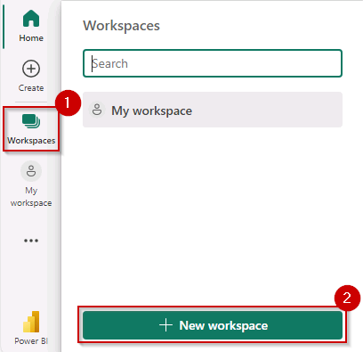

4. Type the name **contosoSales**, confirm that the name is **Available** and click **Apply**.

>If the name contosoSales is already taken, add a suffix to the end of the name (for example **contosoSalesTest**).

>**Note:** Do not include spaces in the workspace name.

   

5. Click on **Workspaces** to verify if the workspace with the given name was created, if not perform the steps above again.

   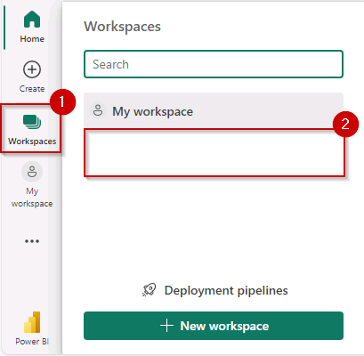

### Task 1.2: Create/Build a Lakehouse

Now, let's see how each department in Contoso could easily create a Lakehouse in their workspace without any provisioning needed by simply providing the name, given the proper access rights of course!

1. In Power BI service, click **+ New** and then select **Show all**.

>**Note:** You may see **More options** instead of Show all. 

   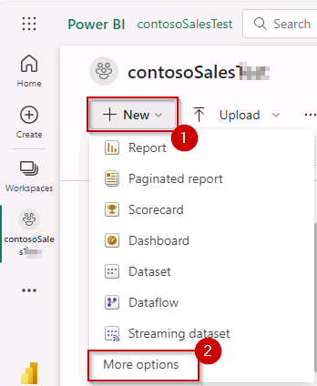

2. In the new window, under the Data Engineering section, click on **Lakehouse (Preview)**.

    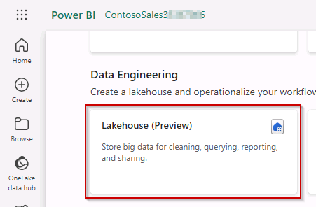

*Wait for the New lakehouse pop-up box to appear*

3. Enter the name **lakehouseBronze**.

4. Click the **Create** button.

    

5. Click on **Workspaces** in the left navigation pane and select **ContosoSales**.

	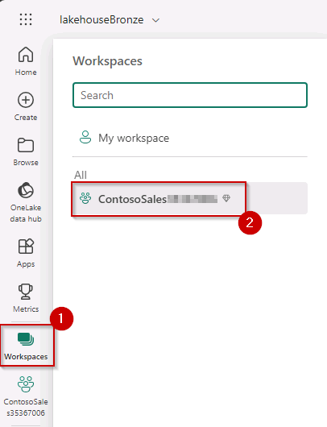

>**Note:** For this lab we need three lakehouses altogether. For creating the other two, follow the step provided below.

6. Repeat **steps 1 through 5** to create two more lakehouses with the names **lakehouseSilver** and **lakehouseGold** respectively.

We are now ready to start data ingestion. As the above names suggest, we will showcase the Medallion architecture. This means we will ingest the raw data in the bronze layer first from disparate sources for Contoso. After that, the data will be curated and enriched to the silver and then gold layers.

### Task 1.3: Data Ingestion

**There are multiple ways to ingest data in Lakehouse.**

### Option 1-Using Data Pipelines/Data Flow ‘No Code-Low Code experience’

1. While you are in the **contosoSales** workspace, click the **+ New** button and select **More options**.

>**Note:** Instead of **More options** you may see **Show all**.

   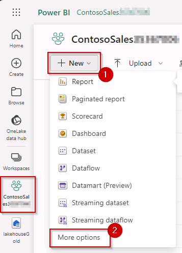

2. Under the Data Factory section, select **Data pipeline (Preview)**.

	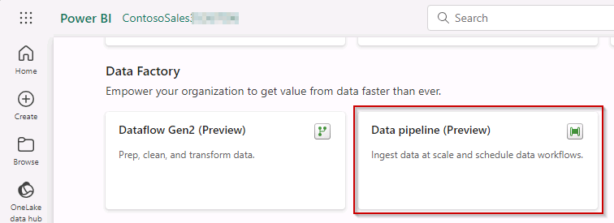

3. In the pop-up, type the pipeline name **Azure SQL DB Pipeline** and click on the **Create** button.

	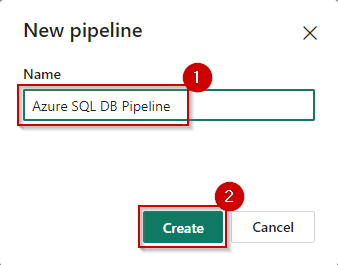

4. Click on **Copy data**.

    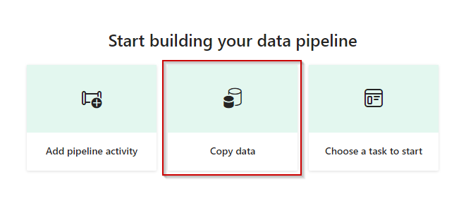

5. In the pop-up, scroll down through the resources, click on **Azure SQL Database** and then click on the **Next** button.

>**Note** You may not see the Azure SQL Database in the same location as shown in the screenshot.

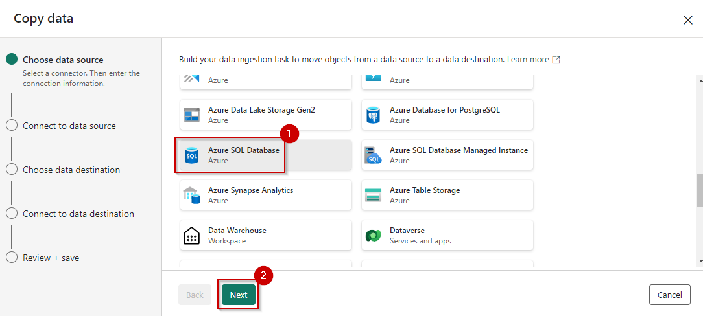

6. Select the **Create new connection** radio button.

>**Note:** To fill in the details for required fileds, we need to fetch the data from the SQL Database resource deployed in the Azure Portal.


7. Navigate to the **Azure Portal**, search for **fabric-dpoc** in the search tab and select the resource group name starting with **fabric-dpoc**.

>**Note:** You can also navigate back to the fabric-dpoc recource group via the breadcrumbs. 

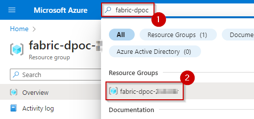

8. Search for **sql server** in the resource group window and click on the **SQL server** resource.

    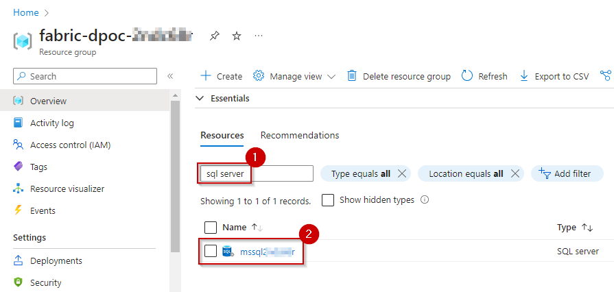

9. Copy the **Server name**.

	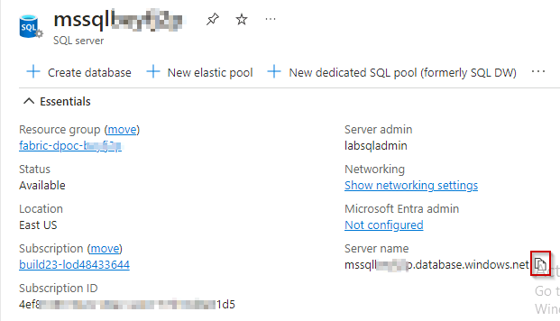

10. Save it in a notepad for further use.

11. Go back to the **Power BI** tab.

12. In the **Server** field paste the value you copied in step number **9** and type **SalesDb** in the **Database** field.

	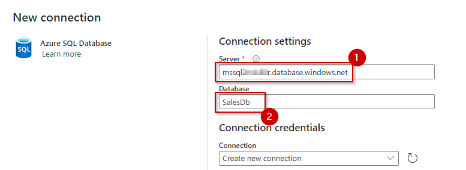

13. Scroll down and select **Basic** for Authentication kind, enter **labsqladmin** as the Username, the password entered during script execution as the Password and finally click on the **Next** button.

   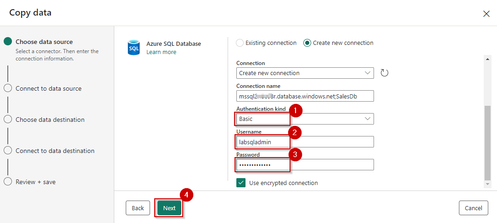

>**Note:** Close any pop-up that you see throughout.
   
   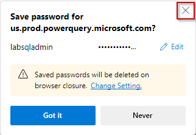

>**Note:** Wait for the connection to be created.

14. Select the **Existing tables** radio button, click on the **checkbox** for the first table below the Select all option, and then click on the **Next** button.

	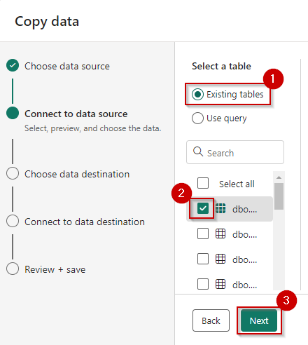

15. Scroll down, click on **Lakehouse** and then click on the **Next** button.

	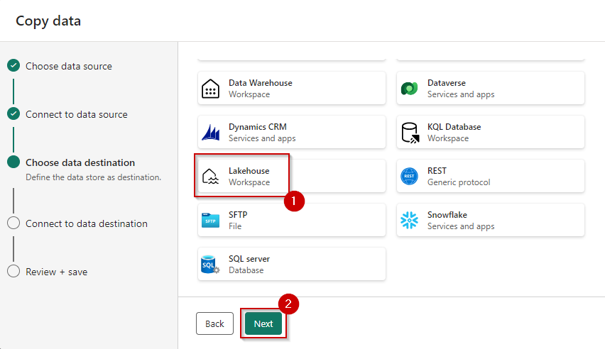

16. Click on the **Existing Lakehouse** radio button, click on the **dropdown**, select **lakehouseBronze** and then click on the **Next** button.

	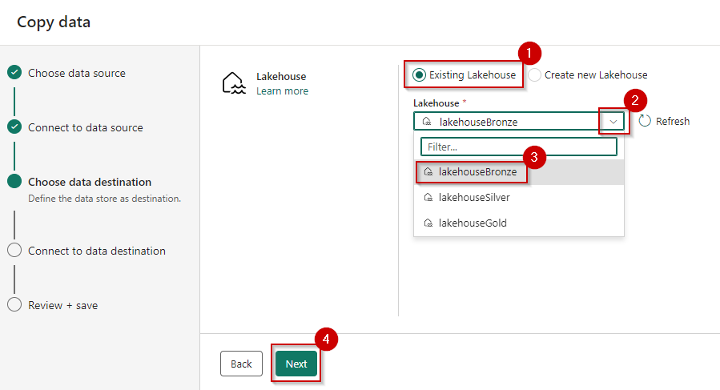

17. Select the **Load to new table** radio button, click on the **checkbox** beside **Source** and then click on **Next**.

	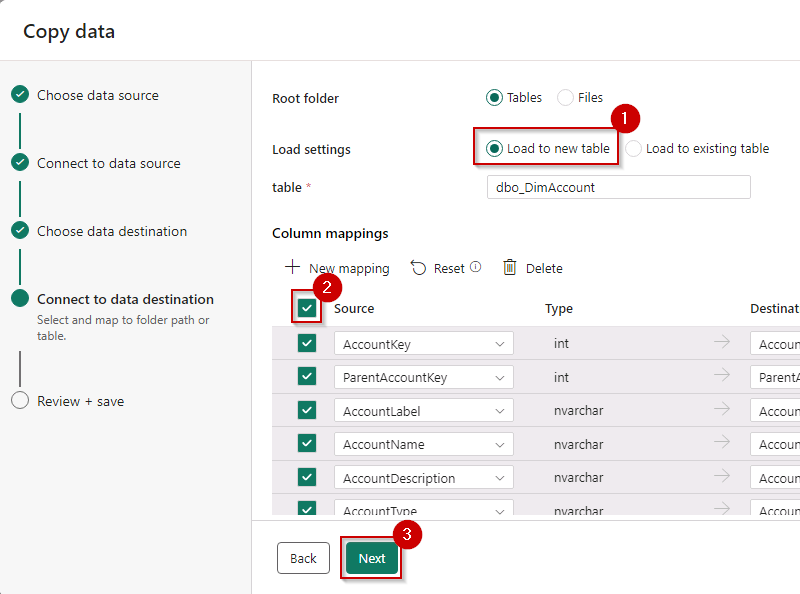

18. Click on **Save + Run**.

	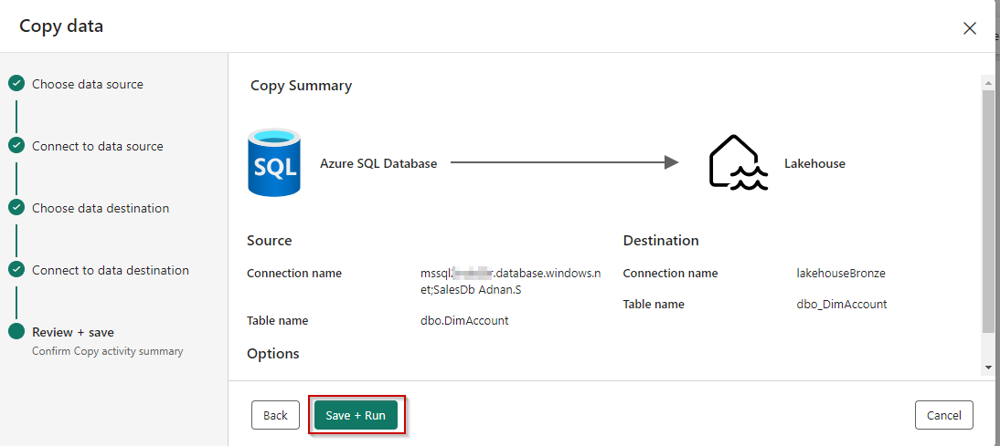

19. Click on the **three dots** on the top right of the screen and select **Notifications**.

	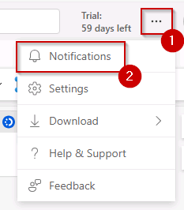

20. Verify the **Running status** of the pipeline.

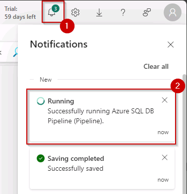

>**Note:** Please wait for the pipeline to execute.

21. Once the status shows **Run Succeeded**, your data has been transfered from Azure SQL Database to Lakehouse.

	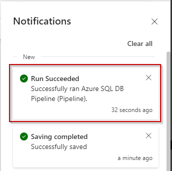

22. Similarly you can get data into the Lakehouses using pipelines from various other sources like Snowflake, Dataverse, etc.


### Option 2-Using the ‘OneLake Shortcuts’ option from external data sources

This is something exciting! You will see how easy it is to create shortcuts without actually moving the data. That is the power of OneLake! In this exercise you will easily ingest the curated marketing data as well as product reviews data from ADLS Gen2. Let's see how!

1. In **Power BI**, click **Workspaces** and select the **contosoSales** workspace.

    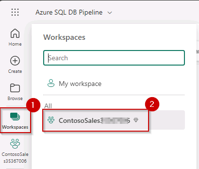

2. In the **contosoSales** workspace, click on the **lakehouseBronze** lakehouse.

>**Note:** There will be 3 options for lakehouseBronze, namely Lakehouse, Dataset (default) and SQL endpoint. Make sure you select the **Lakehouse** option.

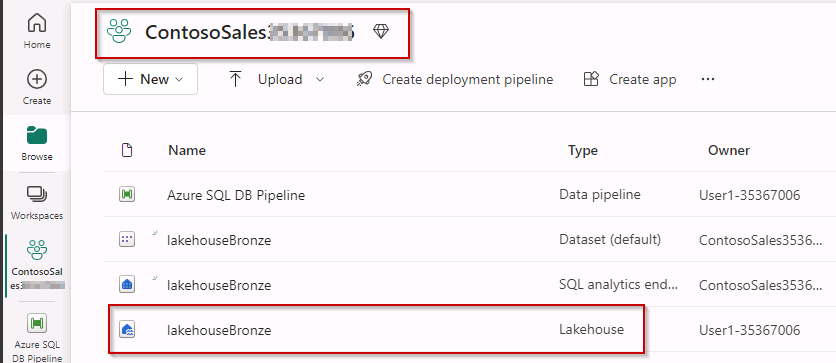

3. Click on the **three dots** on the right side of Files.

4. Click on **New shortcut**.

	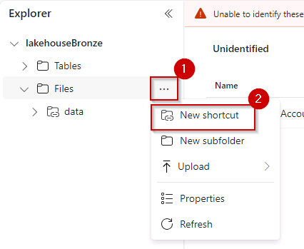

5. In the pop-up window, under **External sources**, select the **Azure Data Lake Storage Gen2** source.

	

>**Note:** Wait for the screen to load.

6. In the screen below, we need to enter the connection details for the ADLS Gen2 shortcut. For this, we need to get the details from the Storage Account resource.

	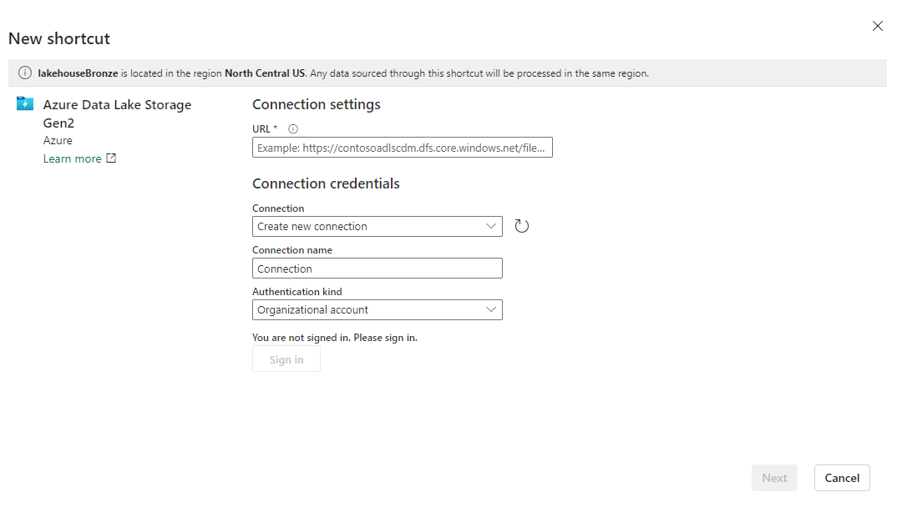

7. Navigate to the **Azure Portal**, search for **fabric-dpoc** in the search tab and select the resource group name that starts with **fabric-dpoc**.

    

8. Search for **storage account** and click on the storage account resource.

	

9. In the resource window, scroll down in the left navigation pane to the **Security + networking** section.

10. Click on **Access keys**.

	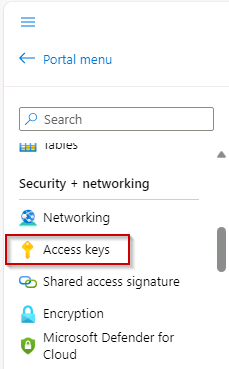

11. Scroll down and click on the **Show** button under **key1**.

	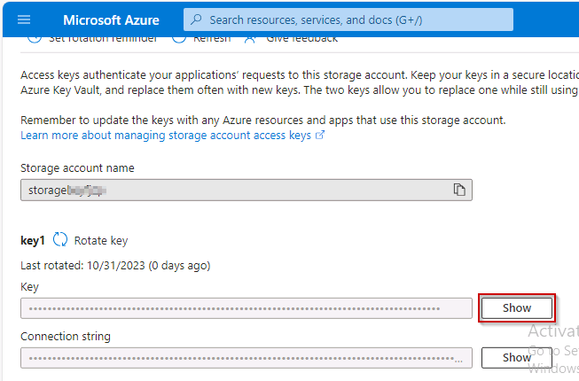

12. Click on the **Copy to clickboard** button.

13. Save this information in a notepad for further use.

	

14. Scroll down in the left pane.

15. Select **Endpoints** from the **Settings** section.

	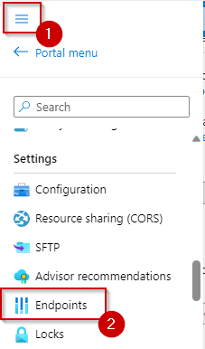

16. Scroll down and copy the **Data Lake Storage** endpoint in the **Data Lake Storage** section.

17. Save the information in a notepad for further use.

>**Note:** You may see different endpoints in addtion to the ones shown in the screen below. Make sure to select **only** the **Data Lake Storage** endpoint.

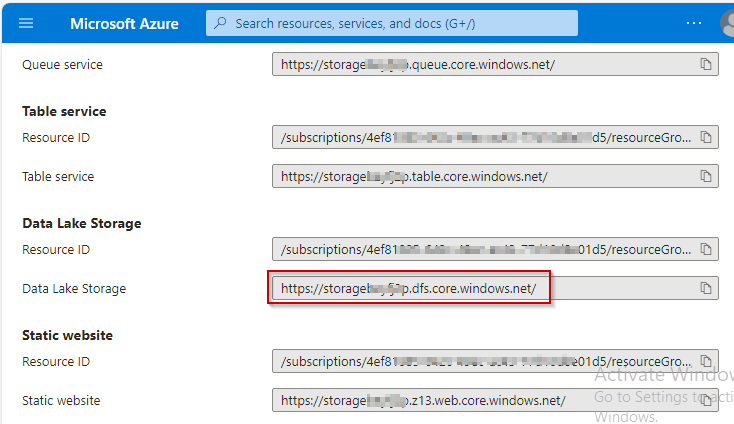

18. Navigate back to the **Power BI** workspace (i.e. the Power BI tab in which we working earlier).

19. Paste the endpoint copied in **step 18** under the **URL** field.

20. In the **Authentiation kind** dropdown, select **Account Key**.

21. Paste the **account key** copied in **step number 13**.

22. Click on **Next**.

	

23. Under **Shortcut Name**, type **data**.

24. Under **Sub Path**, type **/adlsfabricshortcut**.

25. Click on the **Create** button.

	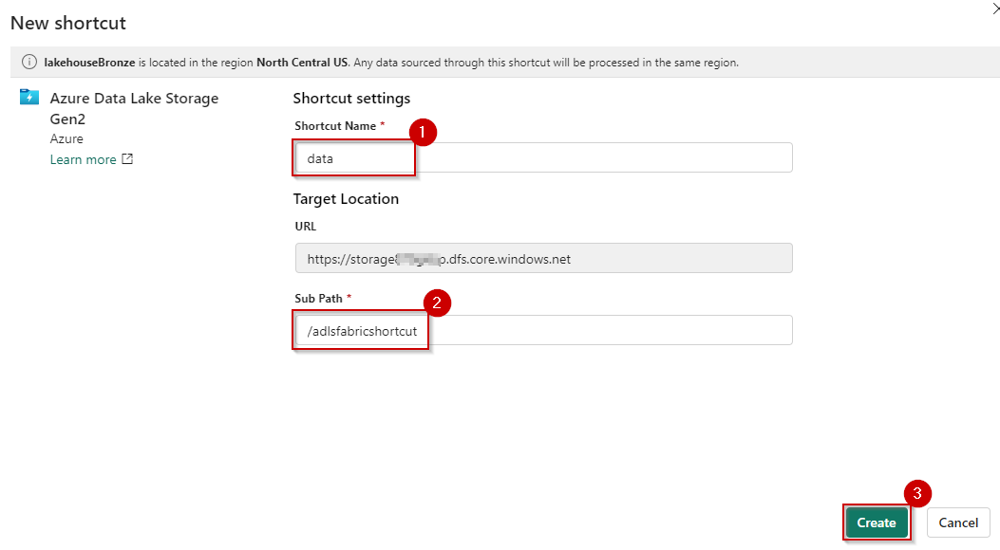

Litware has curated marketing data and sales data processed by Azure Databricks and stored in the gold layer in ADLS Gen 2. You can easily create a shortcut in Microsoft Fabric without moving this data.

*We will now create another shortcut for Litware Inc. data.*

26. Click on the **three dots** to the right of **Files**.

27. Click on **New shortcut**.

	

28. In the pop-up window, under **External sources**, select the **Azure Data Lake Storage Gen2** source.

	

>**Note:** Wait for the screen to load.

29. Paste the endpoint copied in **step 18** under the **URL** field.

>**Note:** The details entered earlier will be auto fetched. If not, follow **steps 31 and 32** below.

30. In the **Authentiation kind** dropdown, select **Account Key**.

31. Paste the **account key** copied in **step number 13**.

32. Click on **Next**.

	

33. Under **Shortcut Name**, type **sales-transaction-litware**.

34. Under **Sub Path**, type **/bronzeshortcutdata**.

35. Click on the **Create** button.

	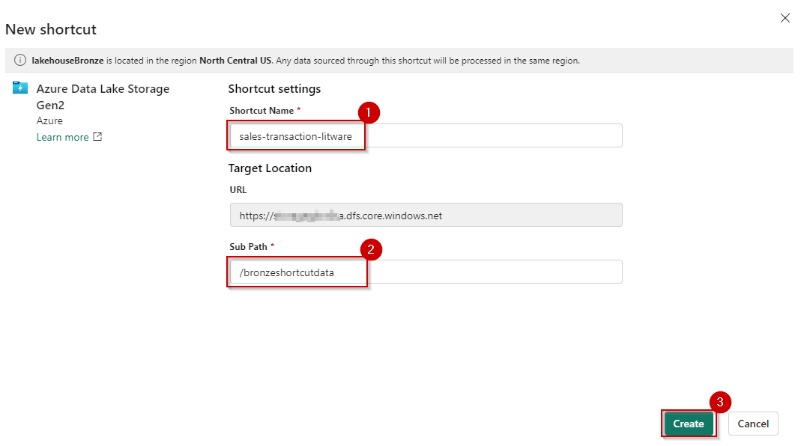


### Option 3-Using Spark Notebook ‘Code-first experience’

As Data Engineer, another option for ingesting the data. This time Eva prefers using the code-first experience. Go back to your existing workspace contosoSales.

*Before executing the steps we download the required fabric notebooks*

1. **Goto** the notebooks location in the Github repository by clicking [HERE](https://github.com/microsoft/Azure-Analytics-and-AI-Engagement/tree/ignite-lab/ignite/artifacts/fabricnotebooks).

2. **Click** on the '01 Marketing Data to Lakehouse (Bronze) - Code-First Experience.ipynb' notebook.

	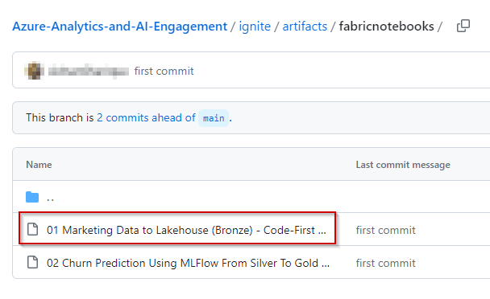

3. **Click** on the 'Download' button.

	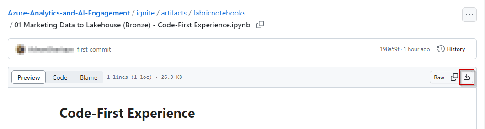

4. **Click** on the 'fabricnotebooks' path.

	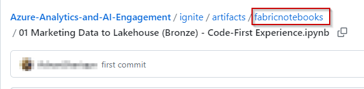

5. **Click** on the '02 Churn Prediction Using MLFlow From Silver To Gold Layer.ipynb' notebook.

	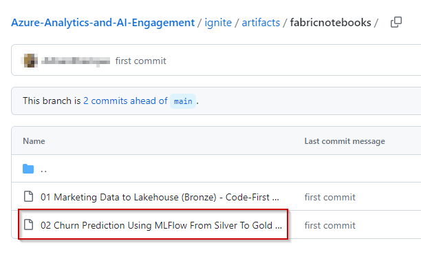

6. **Click** on the 'Download' button.

	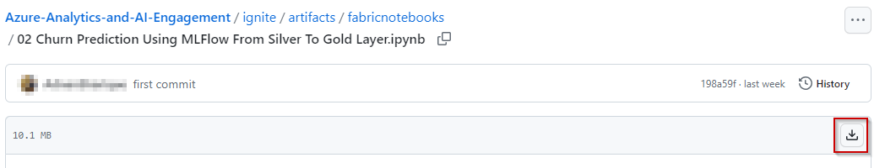

7. Navigate back to the **Power BI workspace**, click on **Power BI** in the bottom left corner and select **Data Science**.

	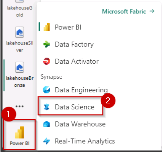

8. Click on **Import notebook**.

	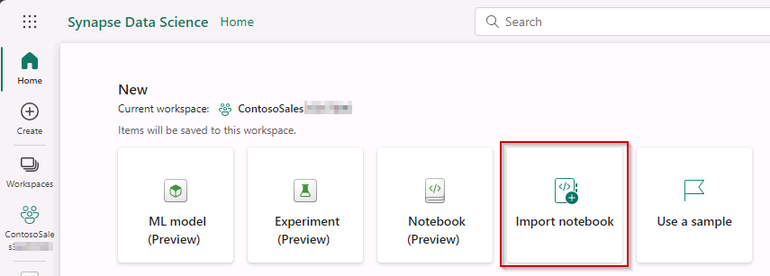
	
9. In the **Import Status**, click on the **Upload** button.

	
	
10. **Browse** to the location from your local system where you downloaded the notebooks, select both the notebooks and click on the **Open** button.

	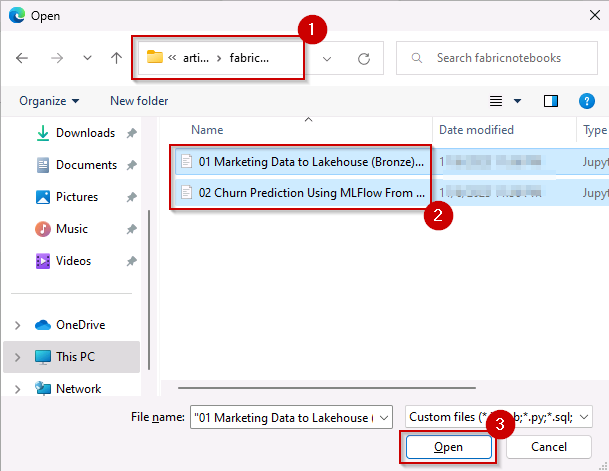

11. Click on the **notification** icon to check the upload status. 

	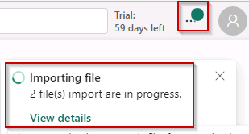

12. Once the upload is complete, the notification will display **Imported succussfully**. Click on **Go to Workspace**.

	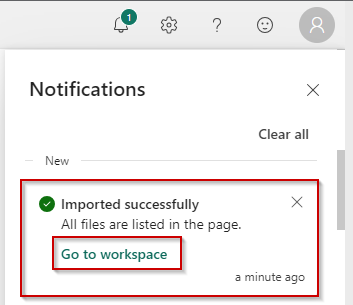

13. In the workspace, click on the **01 Marketing Data to Lakehouse (Bronze) - Code-First Experience** notebook.

	

14. In the left pane, click on the **Missing Lakehouse** button and select **Remove all Lakehouses**.

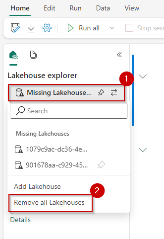

>**Note:** If you do not see Missing lakehouse, you may see **lakehouse{Name}**, click on it to get the **Remove all Lakehouses** option.

15. Click on **Continue** in the pop-up window.

	

16. In the left navigation pane, click on the **Add** button.

	

17. In the pop-up, select the **Existing Lakehouse** radio button and then click on the **Add** button.

	

18. Click on the **lakehouseBronze** checkbox and then click on **Add**.

	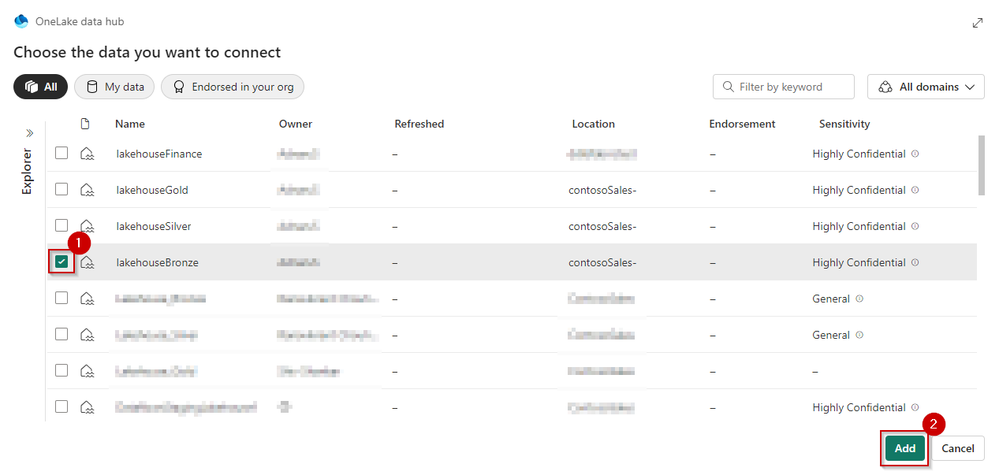

*This notebook is used to get the data to the Bronze Lakehouse.*

19. Go to the cell with name **Shortcut Folder Path**, replace **#WORKSPACE_NAME#** with the Fabric Workspace name you are working on and also verify the lakehouse name which should be the Bronze Lakehouse you created.

>**Note:** Make sure you delete the "#" too in above step

   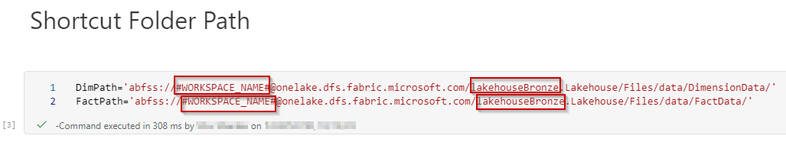

20. Click on **Run all**.

	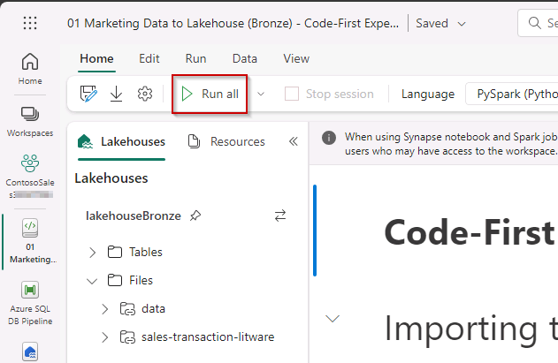

*Wait for the notebook to execute successfully*


## Exercise 2: Explore an analytics pipeline using open Delta format and Azure Databricks Delta Live Tables. Stitch data (landed earlier) to create a combined data product to build a simple Lakehouse and integrate with OneLake

### Task 2.1: Set up an Azure Databricks environment

**Integrate OneLake with Databricks:**

- **1. Use OneLake with existing data lakes using Shortcuts**

- **2. Use and land data directly in OneLake**

**In this exercise**, you will use second option **Use and land data directly in OneLake**.

Contoso already had some of their compute workload on **Azure Databricks**. You don’t need to migrate any of that workload to work with Fabric. You can simply use the OneLake endpoint to mount the storage and work with the same data directly from the Lakehouse for their analytical and ML operations.

**Currently there are two ways to authenticate OneLake.**

- **Credential passthrough**

- **Service Principal approach** (In this lab, you will use Service Principal approach)

1. From the left navigation pane, click on **Workspaces** and select the **contosoSales** workspace.

	

2. Click on the **three dots** and select **Manage access**.

>**Note:** Manage access might be available in the pane also. If so, there is no need to click on the three dots.
	
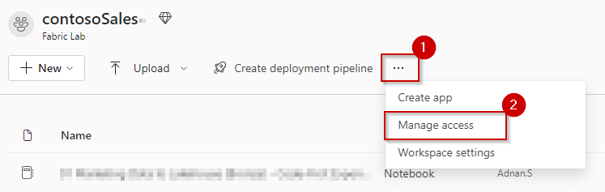

3. In the right pane, click on **+ Add people or groups**.

	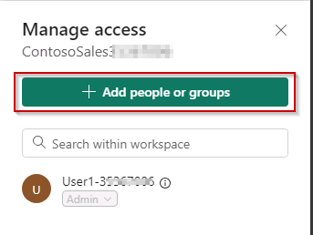

4. Type **fabric** in the **search box** and click on the fabric service principal with the same suffix as the resource group.

	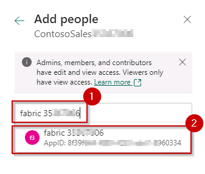

5. Click on the **dropdown button**, select **Admin** and click on **Add**.

	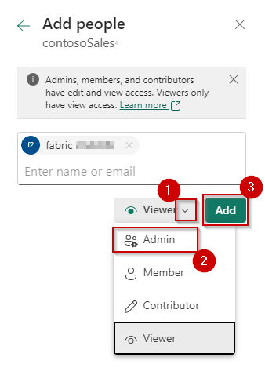

6. Close the window.

	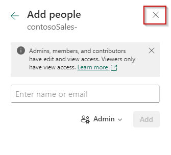

7. Navigate to the **Azure Portal**, search for **fabric-dpoc** in the search tab and select the resource group name starting with **fabric-dpoc**.

    

8. In the resource group, search for **databricks** and click on the databricks resource.

	

9. In the databricks resource, click on the **Launch Workspace** button.

	

>**Note:** Skip or Close any popups that appear.

10. In the left navigation pane, select **Workspace**, click on **Workspace** in the Workspace navigation menu and then click on the **01_Setup-OneLake_Integration_with_Databrick** notebook.

	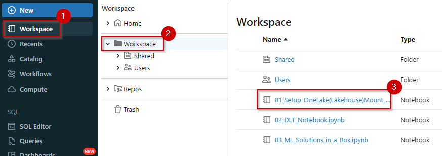

>**Note:** Skip or Close any popups you see.

11. In the cell named **OneLake Path** or **cmd 2**, replace "#WORKSPACE_NAME#" with the current Fabric workspace name you are working on and verify the lakehouse names. Make sure that the name matches with the lakehouses you created in Exercise 1.

	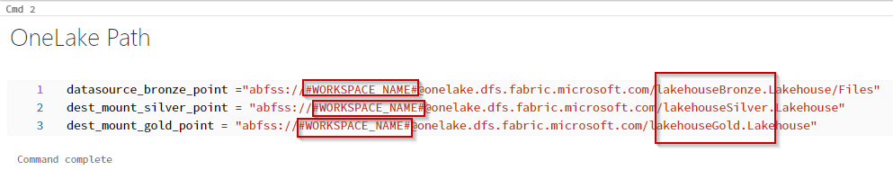

12. Click on the **Run all** button. A new window will pop up.

	

13. Click on the **Attach and run** button to start executing the notebook.

	

*Wait for the Notebook to execute successfully*

14. Once the setup notebook runs successfully, mounting to the storage account is complete.

>**Note:** Please wait couple of minutes to finish execution. You can check last cell of notebook for last execution time to verify.

### Task 2.2: Create a Delta Live Table pipeline

In this task, you can create a Delta Live Table pipeline.

*Delta Live Tables (DLT) allow you to build and manage reliable data pipelines that deliver high-quality data in Lakehouse. DLT helps data engineering teams simplify ETL development and management with declarative pipeline development, automatic data testing, and deep visibility for monitoring and recovery.*

After mounting the OneLake location, it’s time to convert the **raw bronze files** into the **open standard delta parquet format**, supported by OneLake.

This can be done using any Spark compute either in Microsoft Fabric or Azure Databricks. In this lab you will use DLT pipelines to process the raw data from OneLake and store it back in Open Delta tables (**Bronze>Silver>Gold Layer**).

1. Select the **Workflows** icon in the left navigation pane.

	

2. Select the **Delta Live Tables** tab and click on the **Create pipeline** button.

	

3.	In the **Create pipeline window**, enter **Delta Live Table Pipeline** in the Pipeline name box.

	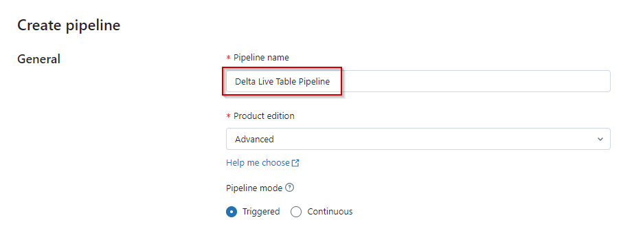

4.	In the **Source Code field**, select the **notebook icon**.

	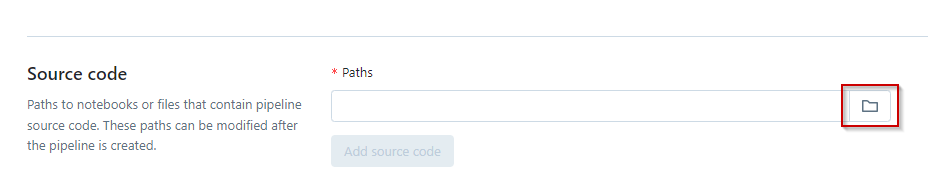

5.	In the **Select source code** window, select the **02_DLT_Notebook.ipynb** notebook and click on **Select**.

	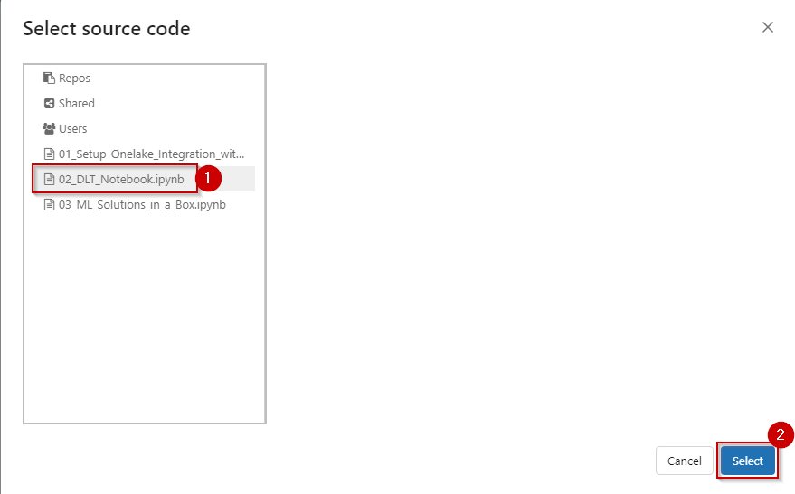

6. Click on the **Create** button.

	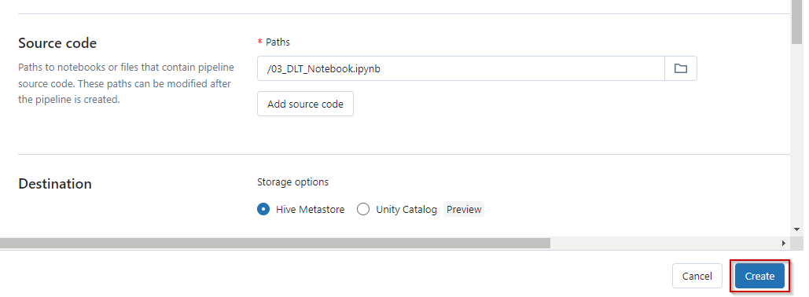

*Once you select **Create**, the Delta Live Table pipeline with all the notebook libraries added to the pipeline will be created.*

7. Click **Start**.

	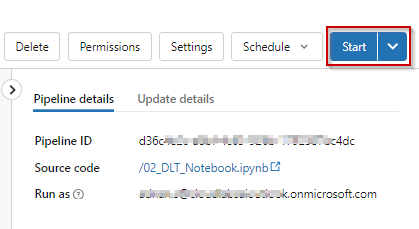

*Databricks will start executing the pipeline which will take approximately 7-8 minutes.*

8. This is the view you would see once the pipeline is executed. Observe the data lineage of bronze, silver and gold tables.

	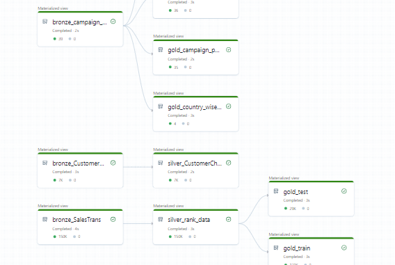


### Task 2.3: Explore SQL Analytics with Lakehouse SQL-endpoint

*Microsoft Fabric Lakehouse comes with a default SQL endpoint which can be used for querying purposes using SQL syntax*

*We can go from Lakehouse to SQL endpoint in the same window by selecting SQL endpoint from the Lakehouse dropdown menu in the top right corner of the window.*

1. While you are in the Fabric workspace, in the left navigation bar, click on **lakehouseSilver** to navigate to **SQL endpoint**.

	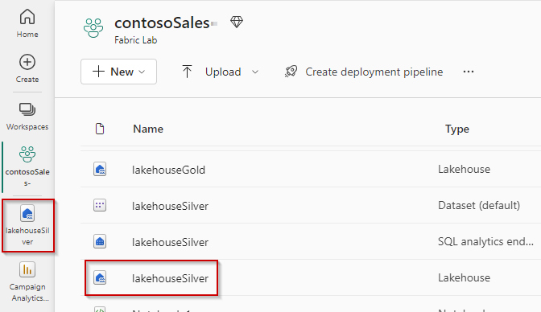

>**Note:** You can also select lakehouseSilver from the contosoSales workspace.

2. Hard refresh the page using **Ctrl + Shift + R**. 

*A hard refresh helps load the delta tables in the lakehouse.*

3. Click the **Lakehouse dropdown button** in the top right corner of the screen and select **SQL analytics endpoint**.

	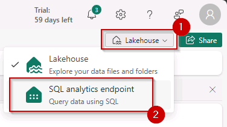

>**Note:** Wait for the SQL endpoint to load.

4. Here is a list of all the tables in open-standard delta format. We can run queries on these tables to get the insights we need for the next step.

	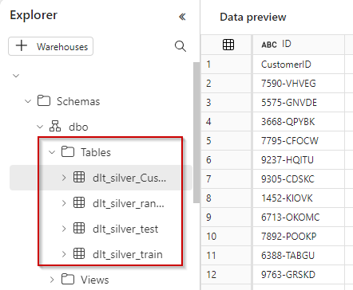

#### SQL Query

5. Click on the **New SQL Query** button.

	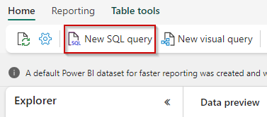

6. **Copy** the SQL query.

```
Select fc.ProductCategory,Sum(fc.Revenue) Revenue from [lakehouseSilver].[dbo].[dimension_product] dp JOIN [lakehouseSilver].[dbo].[fact_campaigndata] fc on dp.Category=fc.[ProductCategory] Group by fc.ProductCategory having sum(fc.[Revenue])< (Select Top 1 Sum(fc.Revenue) Revenue from [lakehouseSilver].[dbo].[dimension_product] dp JOIN [lakehouseSilver].[dbo].[fact_campaigndata] fc on dp.Category=fc.[ProductCategory] Group by fc.ProductCategory ORDER by Revenue DESC) ORDER by Revenue DESC
```
7. Click on **Run** icon to view the query result.

	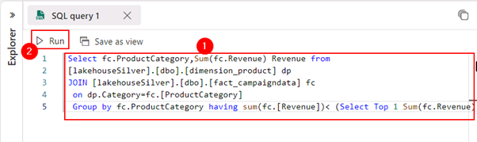

*We can write a query to get the insights from sales data that we ingested using the shortcut names 'sales-transaction-litware'.*

*We can also run queries with complex joins on the same table to get LitWare Inc.’s top 10 bestselling products and see how fast we can get the results. When running the queries, we get the result within seconds, and once it is in cold cache, it will take even less time to get the results. These queries showcase the data engineering experience in Microsoft Fabric.*

*You also have an option to create a visual query.*

## Exercise 3: Data Science experience including Machine Learning scenarios.

So, we saw how Contoso was able to combine their historical gold layer data from ADLS Gen2 with all the data in OneLake via shortcuts. We saw delta live tables being created for further curation of data in Azure Databricks. Next, as Miguel, the Data a Scientist, you can explore the power of ML models in Azure Databricks being leveraged on that data so Contoso can gain meaningful insights about customer churn predictions.

### Task 3.1: Build ML models, experiments, Log ML model in the built-in model registry using MLflow and batch scoring

#### Databricks

The architecture diagram shown here illustrates the end-to-end MLOps pipeline using the Azure Databricks managed MLflow.

After multiple iterations with various hyperparameters, the best performing model is registered in the Databricks MLflow model registry. Then it is set up as the model serving in the Azure Databricks Workspace for low latency requests.
	
   

1. Navigate back to the **Databricks workspace** we started for the previous exercise.

2. In the left navigation pane, select **Workspace** and click **Workspace** again. Click on the **03_ML_Solutions_in_a_Box.ipynb** notebook.

	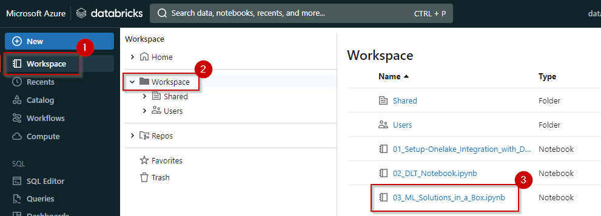

Now that we've processed our customer data, let us use Machine learning model to predict customer churn

Ultimately, we would like to understand our customers' sentiment so we can create targeted campaigns to improve our sales.

3. Navigate to **cmd 10**.

With the data prepared, we can begin exploring the patterns it contains. 

As illustrated in this chart, we can see a high churn rate is seen if the customer tenure is low, and they have a lower spend amount.

   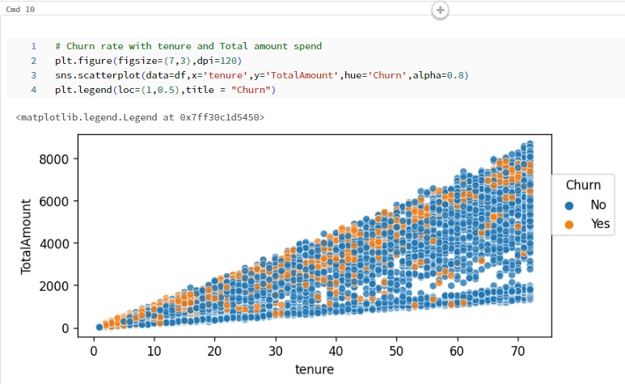

4. Navigate to **cmd 20**.

5. Navigate to **cmd 21**. 

By registering this model in Model Registry, we can easily reference the model from anywhere within Databricks. 
	
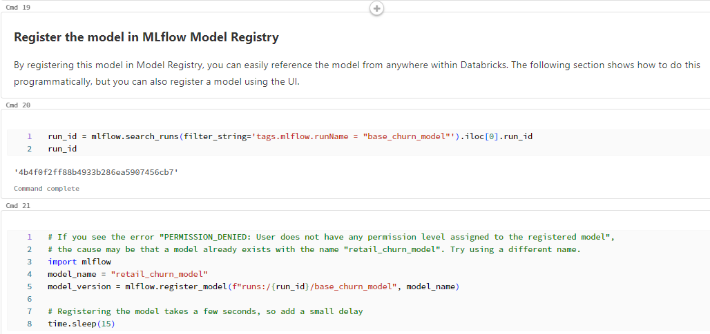


6. Review the **cmd 29** cell.

This comparison of multiple runs using a parallel coordinates plot, shows the impact of different parameter values on a metric.

The best ML model for Customer Churn is selected and registered with Databricks model registry.

   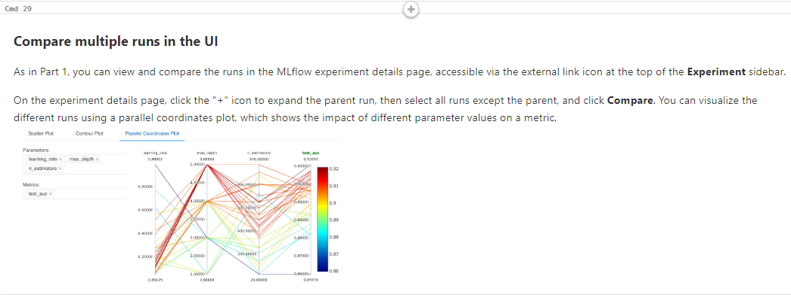

7. Navigate to **cmd 40**.

It is then used to predict the probability of Customer Churn using the deployed model and this model endpoint is ready for production.

   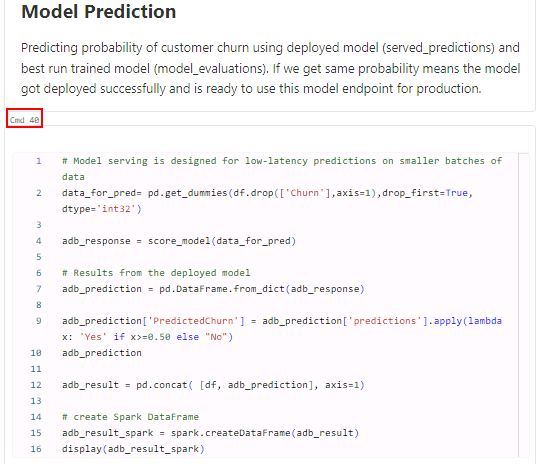

8. Navigate to **cmd 41**. 

Once we have the predicted data, it is stored back in delta tables in the gold layer back in OneLake.

   	


## Exercise 4: Power BI reports with Direct Lake

So, we saw that Contoso was able to have all their organizational data in OneLake in Microsoft Fabric while still continuing to invest in Azure Databricks from their existing architecture. With the new Direct Lake mode in Power BI, they no longer have to choose between data latency or performance; they could get both!

Next, as Wendy, the business analyst let us see how we can leverage the Power BI Direct Lake mode experience in Microsoft Fabric!

### Task 4.1: Leverage Power BI to derive actionable insights from data in Lakehouse using Direct Lake mode.

1. **Open** a new web session (tab), and then **navigate** to [https://powerbi.com](https://powerbi.com)

>**Note:** Dismiss any popups that appear on your screen

2. In Power BI tab, click on **Workspace** ContosoSales and **Filter** on **Semantic model (default)**. Select the **lakehouseGold** Semantic model.

	

3. Click on the **dropdown icon** beside 'Explore this data' and select **Auto-create a report**.

	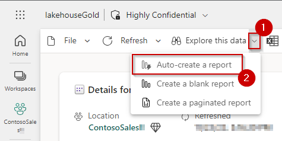

4. You can **edit** the auto-generated report according to your choice. **Drag and drop visual** from visualization pane.

5. **Goto** the reports location in the Github repository by clicking [HERE](https://github.com/microsoft/Azure-Analytics-and-AI-Engagement/tree/ignite-lab/ignite/artifacts/reports).

6. **Click** on the 'Campaign Analytics Report with Lakehouse.pbix' report.

	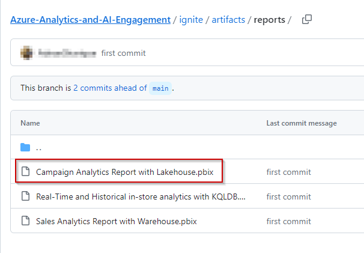

7. **Click** on the 'Download' button.

	

8. Similarly download the other two reports as well.

	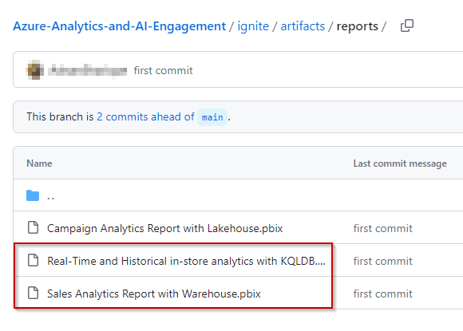

9. **Go back** to Power BI service, click on **Workspaces** and click on **contosoSales**. 

	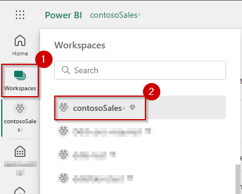

10. Click on **Upload** and select **Browse**.

	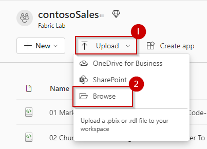

11. **Browse** to the location from your local system where you downloaded the reports, select the **Campaign Analytics Report with Lakehouse.pbix** report and click on the **Open** button.

	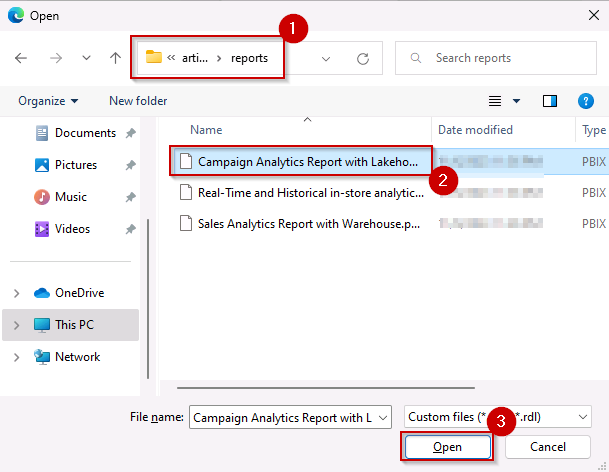

>**Note:** Wait for the report to upload.

12. **Open** the report by clicking on it.

	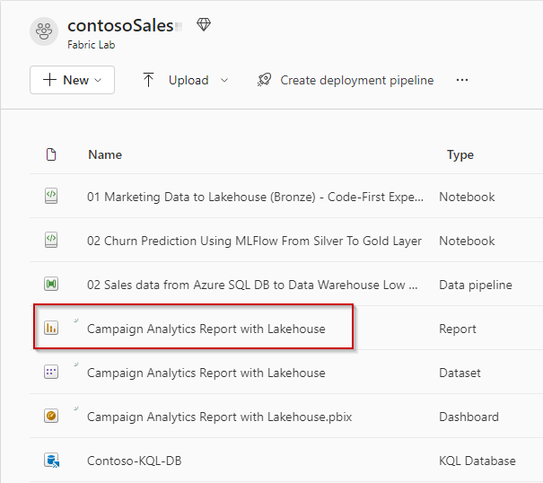

>**Note:** Make sure to click on the **Report** and not the Dataset or Dashboard which is auto created with the same name.

   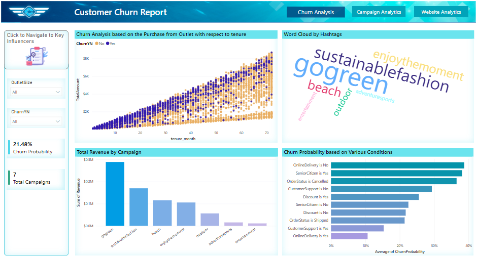

13. Close the pop-up.

	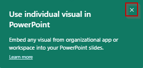

. This report has three sections:
 - Churn Analysis
 - Campaign Analytics
 - Website Analytics

	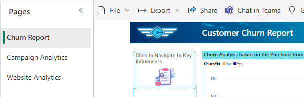

10. Let's navigate to the **Churn Analysis Tab**, where we analyze Customer Churn. This report, along with the Campaign Analytics and Website Analytics reports in Power BI, are coming from the data Lakehouse that we created in earlier exercises.

	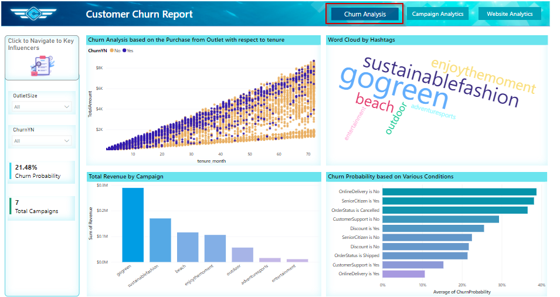

In the **Scatter Chart** on the left, the blue dots represent customers that are more likely to churn, and the peach dots represent customers that are less likely to churn. Notice that when customer tenure is low and their spend amount is low, the customers are more likely to churn.

   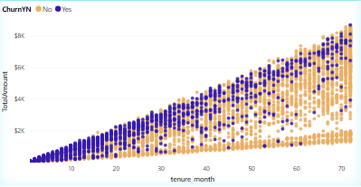

With this insight, Contoso decides to target customers with lesser tenure and lesser spend amounts through their new campaigns.

Now, let's go the Campaign Analytics.

10. Select the **Campaign Analytics** tab from the top right pane to navigate to the Campaign Analytics report.

	

In this Campaign Analytics report, the bar chart shows that the most popular campaigns Contoso launched were gogreen and sustainablefashion.

   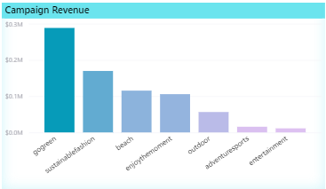

With this insight, Contoso team decides to target customers with lesser tenure and lesser spend amounts through their new campaigns.

Now, let's go Website Analytics. 

11. Select **Website Analytics** from the top right pane to navigate to the Website Analytics Report.

   

Here we see an immediate problem for Contoso. The bounce rate of customers from their web site is high. In fact a large population of the unhappy customers who contribute to the high bounce rate on their website are Millennials. It turns out that when the millenial customers use their mobile devices to search for their favorite products such as beach accessories, their product searches are failing! That is the reason why millenials are unhappy.

   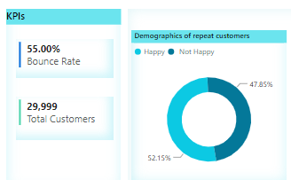

Contoso reduced their bounce rate by implementing a mobile-friendly website with fast product searches, focusing on high demand products for millennials. These changes improved the bounce rate and increased sales.

Congratulations! You, as a part of Contoso's technical team played the roles of a Data Engineer, Data Scientist, Data/ Business Analyst to help Contoso gain actionable insights from its disparate data sources, thereby contributing to future growth, customer satisfaction, and a competitive advantage.

During our exercises, we saw how they leveraged the power of Microsoft Fabric to ingest data from disparate sources, combine data with their existing data from ADLS Gen2, derive meaningful insights. You experienced how the team used a shortcut to reference the existing Litware Inc data from ADLS Gen2. You also experienced how they mounted the OneLake endpoint in Azure Databricks to derive meaningful insights using the compute in Azure Databricks.

Finally, we leveraged Power BI to derive actionable insights from data in the Lakehouse using Direct Lake mode.
As a result of all these data insights, Contoso had a great year and they celebrated on December 31st with fireworks!


## Exercise 5: Data Warehouse experience, explore SQL Analytics with Data Warehouse.

Now let's see how Contoso was able to easily create Data Warehouses for its various departments. As Serena, the Data Analyst, let us create a virtual warehouse for the sales department and run cross database query.

### Task 5.1: Create a Data Warehouse

1. In the bottom-left corner of the Power BI tab, click on **Power BI**.

**Note:** You may see **Data Science** instead. 

2. Select **Data Warehouse**.

	

3. Click on **Warehouse (Preview)**.

	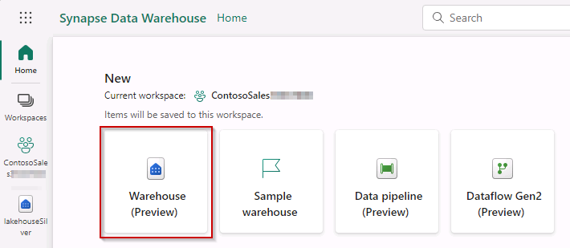

4. In the 'New Warehouse' pop-up, type the name **salesDW**.

5. Click **Create**.

	

*Wait for the Data Warehouse creation*

### Task 5.2: Load data in the warehouse

1. Click on **Get data**.

2. Select **New data pipeline**.

	

>**Note:** It will take some time for the page to load.

3. In the pop-up, type the name **Sales data from Azure SQL DB to Data Warehouse**.

4. Click **Create**.

5. **Wait** for a new pop-up.

	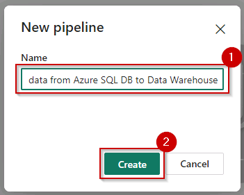

6. Scroll down in the pop-up.

7. Select **Azure SQL Database**.

8. Click on the **Next** button.

	

9. Select the **Existing Connection** radio button.

10. Select the existing connection from the dropdown in the **Connection** field.

11. Click on **Test Connection** and then click on the **Next** button.

	

12. In **Connect to data source**, select **Existing tables**, select **Select all** and then click on the **Next** button.

	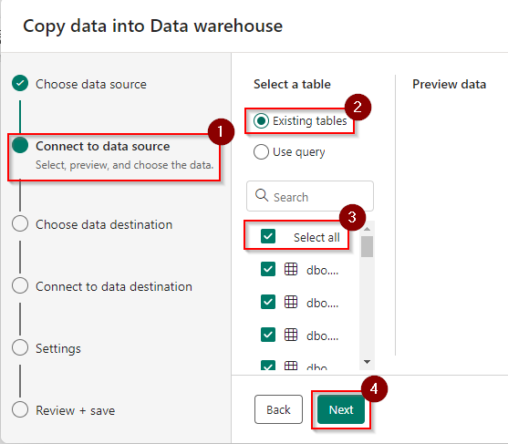

13. In **Choose data destination**, select the **Data Warehouse** and click the **Next** button.

	

14. In **Connect to data destination**, select **Load to new table** and click on the **Source** checkbox. Then click the **Next** button.

	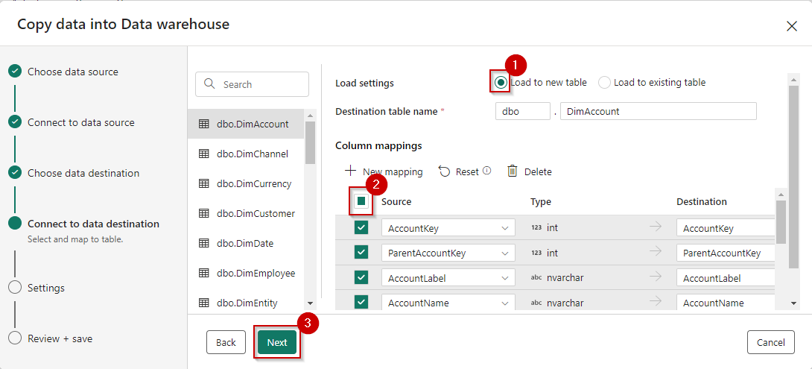

15. In the **Settings** section, click the **Next** button.

	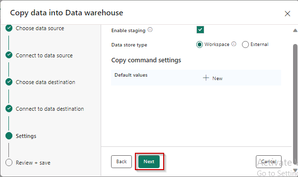

16. In the **Review + save** section, scroll down to the end and then click the **Save + Run** button.

		

>**Note:** When you click on Save + Run the pipeline is automatically triggered.

17. If the screen below appears, click on the **OK** button.

	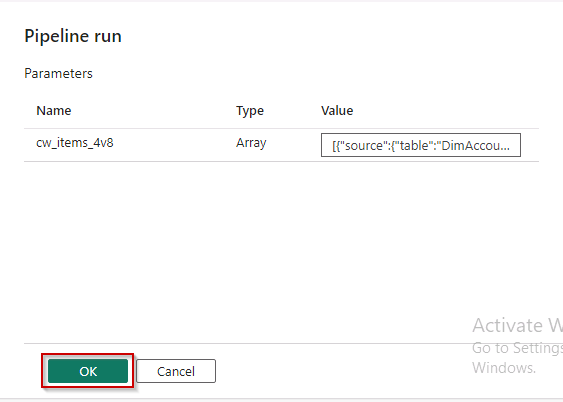	

18. Check the **notification** or **pipeline output** screen for the progress status of copying the database.

	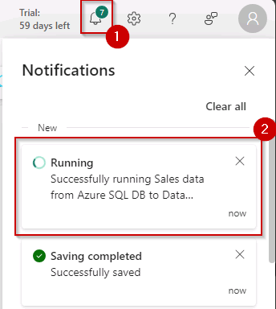

19. In the progress section of the pipeline, check the **status** of the running pipeline.

	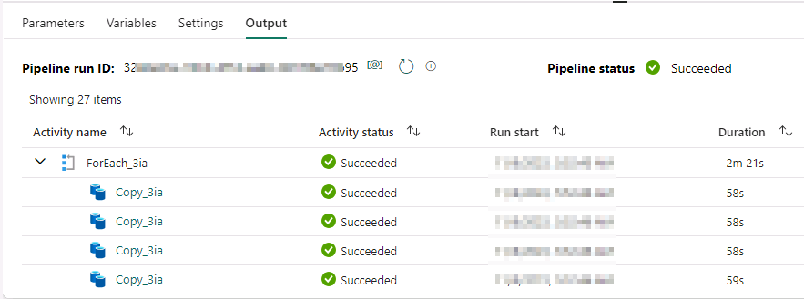

>**Note:** Wait for the resultant data to load.

20. **Wait** for the status of the pipeline to display **Succeeded**.

	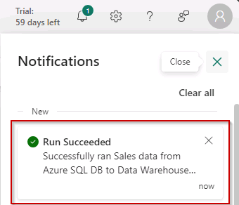

21. Go back to the **Data Warehouse** from the workspace.

	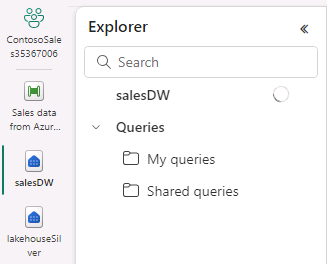


### Task 5.3: Create virtual Data Warehouses

Introducing virtual warehouses, where we not only analyze data from the department, but also query any data from another warehouse or a lakehouse SQL end point - across the organization from any department.

1. Click on the **+ Warehouse** button.

	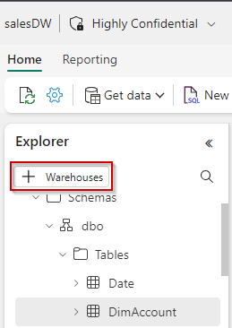

2. In the pop-up window, select the **lakehouseSilver SQL Endpoint checkbox** and click on the **Confirm** button.

	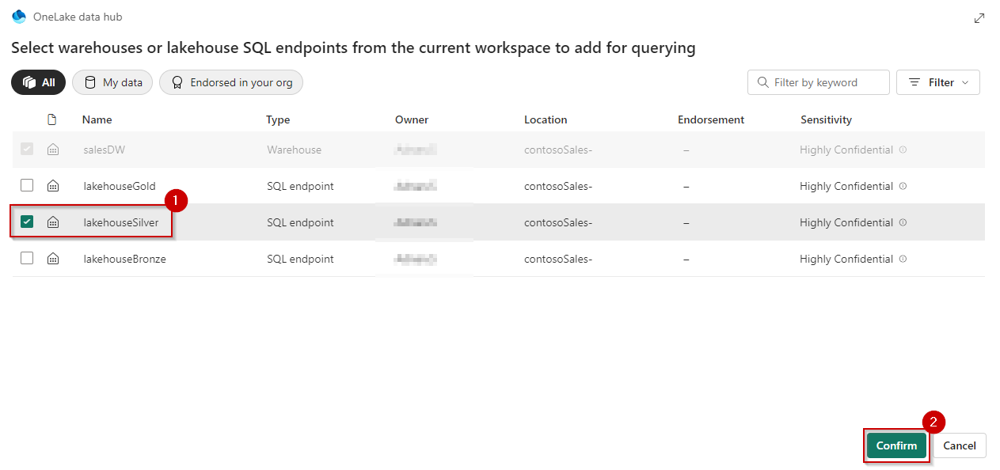

>**Note:** It will take a few seconds for the new warehouse to appear.


## Exercise 6: Real-time Analytics experience to explore Streaming data using KQL DB

In a short span of few months the CDO and his team implemented transformations using Microsoft Fabric and Azure Databricks.

Imagine it is 6 am on the day of the black Friday sale during Thanksgiving week for Contoso. Customers are entering stores in large numbers. Specifically, we will see how near real-time data is used to make decisions for the next moment at Contoso's stores to ensure optimal temperatures are maintained for their customers while they shop!

### Task 6.1: Create a KQL Database

1. In **Power BI** service, click on **Workspaces** and click on **contosoSales**. 

	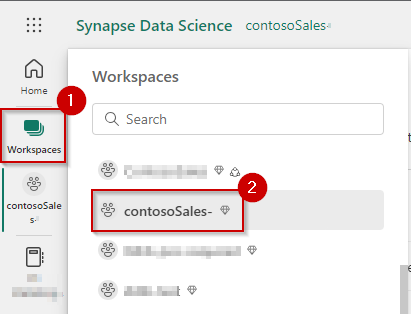

2. Click on **+ New** and then click on **More options**.

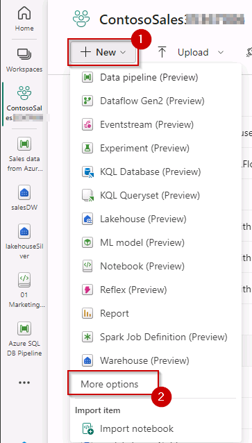

3. In the new window, scroll down to the **Real-Time Analytics** section and click on **KQL Database (Preview)**.

	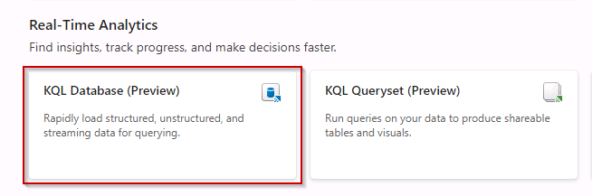

4. Enter the name **Contoso-KQL-DB**, click on the **Create** button and wait for the database to be created.

	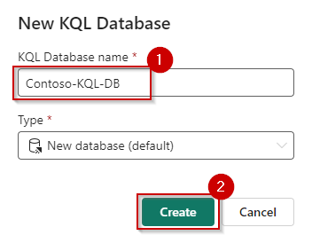

### Task 6.2: Ingest real-time/historical data into KQL DB

1. Once the database is created, click on **Get data**.

	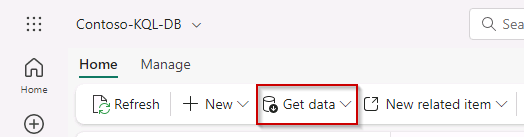

2. Click on **Event Hubs**.

    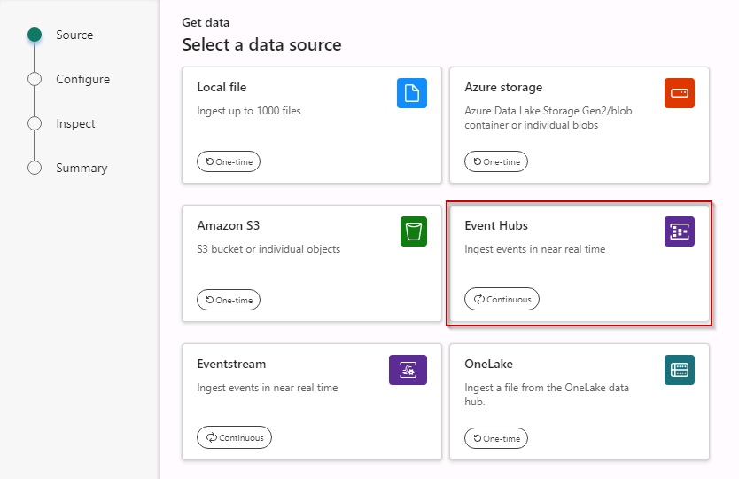

3. Click on **+ New table**.

	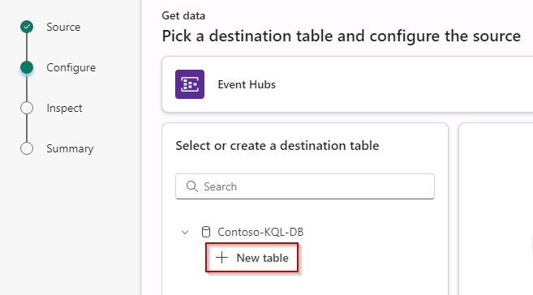

4. Type **thermostat** and click on the **expand screen** icon in the top right corner.

	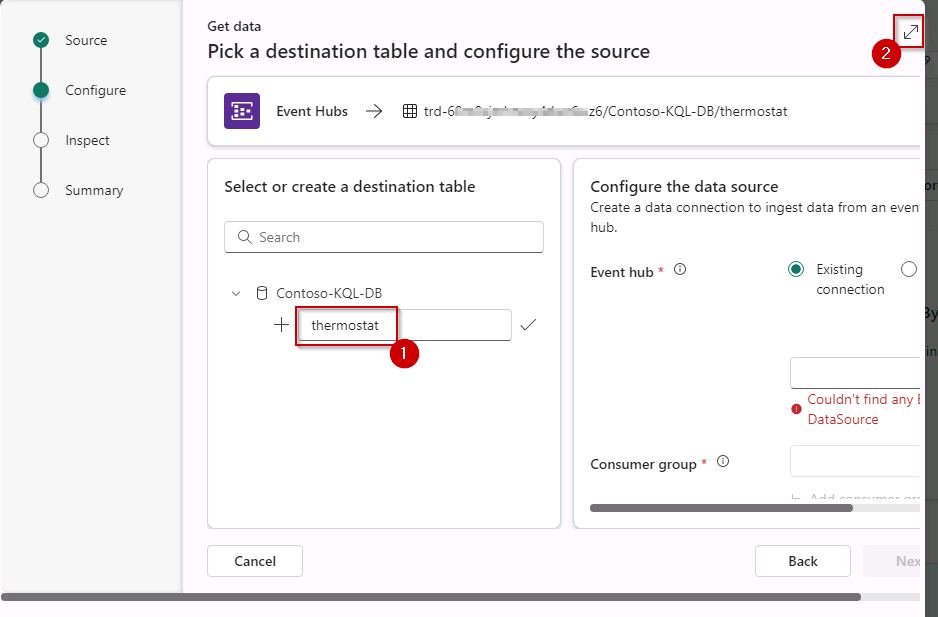

5. Select the **Create new connection** radio button.

	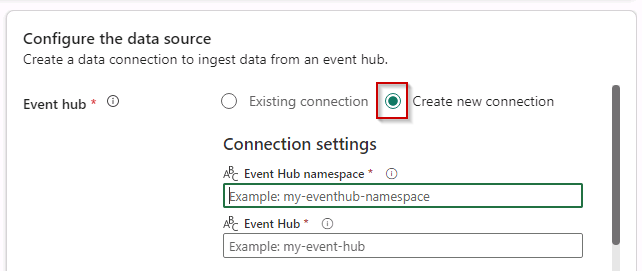

>**Note:** For the rest of the fields we need to move to the Azure Portal and fetch the required values.

6. Navigate to the **Azure Portal**, search for **fabric-dpoc** in the search tab and select the resource group name starting with **fabric-dpoc**.

    

7. Search for **Event Hubs Namespace** in the resource group window and click on the **Event Hubs Namespace resource**.

    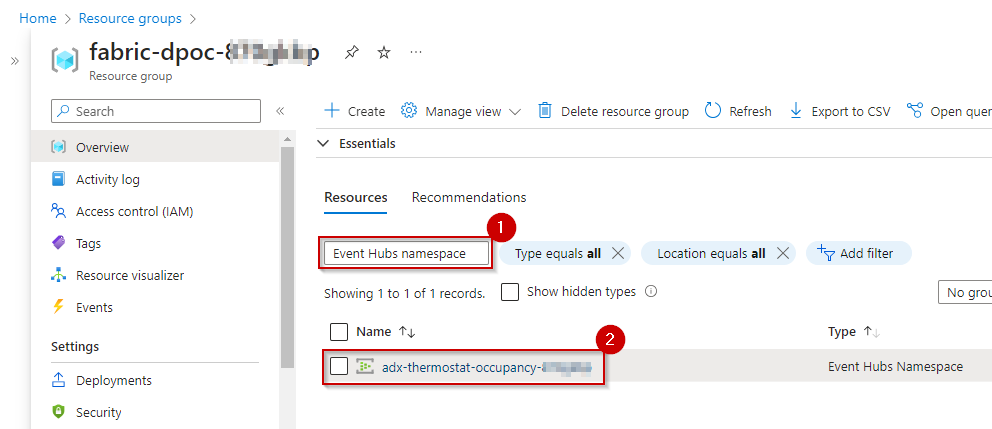

8. Copy the name of the Event Hub namespace and paste it in a notepad for further use.

	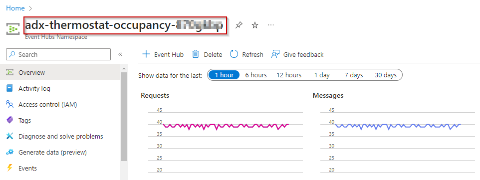

9. Scroll down in the left navigation pane and click on **Event Hubs** under the **Entities** section. 

	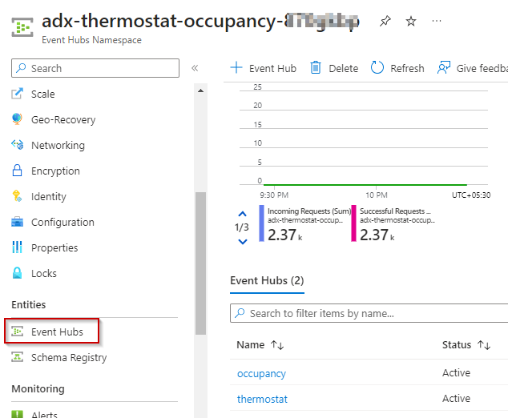

10. Click on the **thermostat** event hub.

	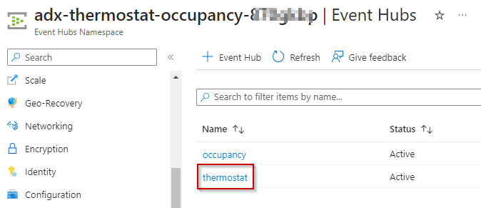

11. Click on **Shared access policies** in the left pane under **Settings**, then click on **thermostat** and finally copy the **primary key** and paste it in a notepad for further use. 

   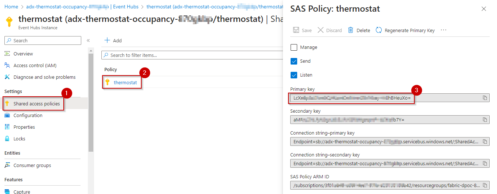

12. Go back to the **Power BI tab**.

13. Make sure you are in the **Create new connection** section, scroll down and paste the value for **Event Hub namespace** from **step 8** and enter **Event Hub** value as **thermostat**.

   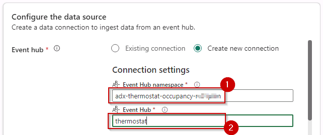

12. Scroll down and select **Shared Access Key** for Authentication kind, enter **thermostat** as the Shared Access Key Name and then paste the value copied in **step 11** in the **Shared Access Key** and click on the **Save** button.

   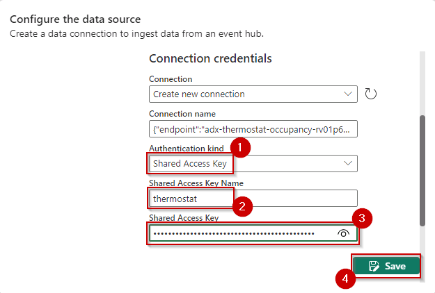

13. Click on the **dropdown** in the Consumer group field and select **$Default**.

	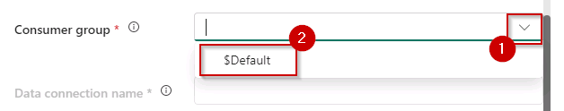

>**Note:** Wait for the connection to be established.

14. Click on the **Next** button.

	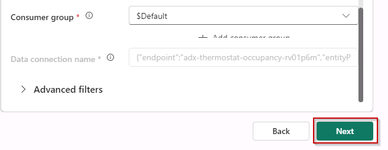

>**Note:** In the Inspect tab, data loading will take some time.

15. In the **Inspect tab**, click on the dropdown button next to **Format: TXT**, select **JSON** and click on the **Finish** button.

    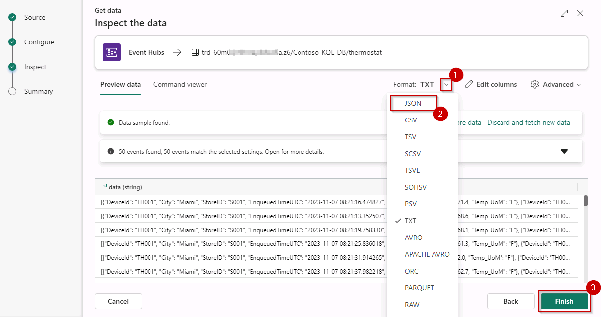

16. **Wait** for the ingestion to complete, you will notice green checks that denote the completion. Finally, click on the **Close** button.

    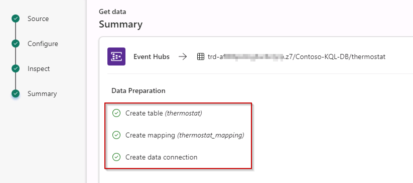

17. Hard refresh the page using **Ctrl + Shift + R** to see the details for the ingested data.

   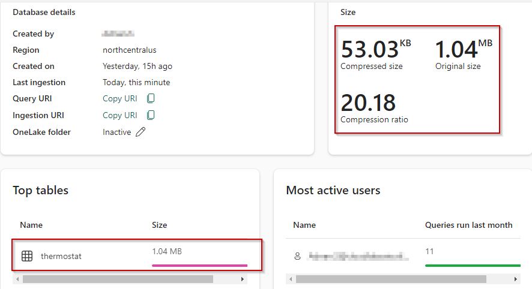
	
Real-time data from the event hub has been ingested successfully into the KQL Database.

### Task 6.3: Analyze/discover patterns, identify anomalies and outliers using Kusto Query Language

In this scenario Kusto Query Language (KQL) is used to explore Contoso’s data, discover patterns, identify anomalies etc. We use KQL to query the thermostat data that’s streaming in near real-time from the devices installed in Contoso’s stores.

1. Click on **Workspaces** and select **contosoSales**.

	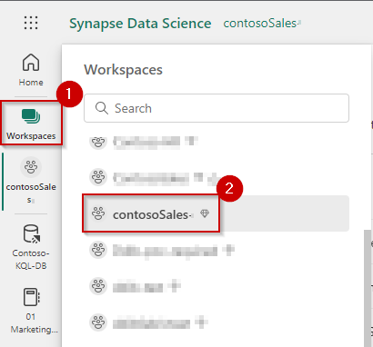

2. Click on **+ New** and select **KQL Queryset (Preview)**.

	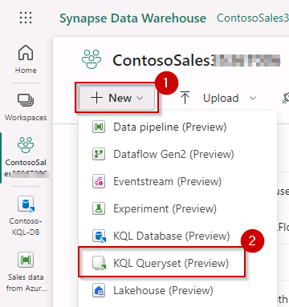

3. Enter **Query Thermostat Data in Near Real-time using KQL Script** as the name and click on the **Create** button.

	

4. **Wait** for the query set creation and a new screen will display. In this screen, click on **Contoso-KQL-DB**, verify the workspace name and then click on the **Select** button.

	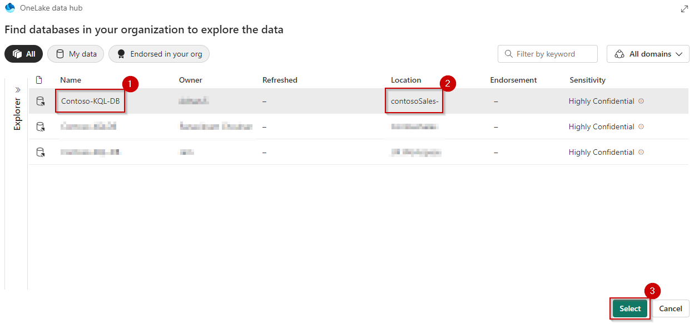

5. Select all using **Ctrl + A** and **delete** the pre-written query.

	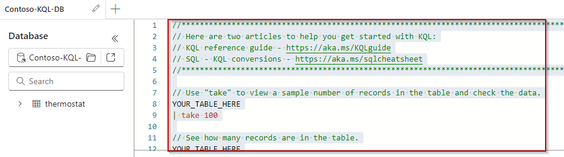

6. **Paste** the query provided below in the query section.

```
//What is the average temperature every 1 min?
thermostat | where EnqueuedTimeUTC >= ago(1d) | where DeviceId == 'TH005' | summarize avg(Temp) by bin(EnqueuedTimeUTC,1m) | render timechart 

//What will be the temperature for next 15 Minutes?
thermostat | where EnqueuedTimeUTC > ago(1d) | make-series AvgTemp=avg(Temp) default=real(null) on EnqueuedTimeUTC from ago(1d) to now()+15m step 1m  | extend NoGapsTemp=series_fill_linear(AvgTemp) | project EnqueuedTimeUTC, NoGapsTemp | extend forecast = series_decompose_forecast(NoGapsTemp, 15) | render timechart with(title='Forecasting the next 15min by Time Series Decmposition')

//Are there any anomalies for this device?
thermostat | where EnqueuedTimeUTC > ago(1h) | where DeviceId == 'TH005'| make-series AvgTemp=avg(Temp) default=real(null) on EnqueuedTimeUTC from ago(1d) to now() step 1m | extend NoGapsTemp=series_fill_linear(AvgTemp) | project EnqueuedTimeUTC, NoGapsTemp | extend anomalies = series_decompose_anomalies(NoGapsTemp,1) | render anomalychart with(anomalycolumns=anomalies)
```

7. **Select** the query. (Line 2)

8. **Click** Run.

The graph/result visualizes the data in a line chart. We see that it looks like the temperature is currently quite pleasant.

9. **Select** the query. (Line 5)

10. **Click** Run.

The graph/result visualizes the average temperature in the next 15 minutes, in anticipation of heavy foot traffic due to the ongoing sale.

11. **Select** the query. (Line 8)

12. **Click** Run.

The third query is executed to keep an eye on the temperature and detect any anomalies. A sudden rise or drop in temperature triggers an alert for the Contoso staff to check the situation and take necessary action to bring the temperature back to an optimal level.

### Task 6.4: Create a Real-time Power BI report using KQL DB/KQL Query

1. Click on **Build Power BI report**.

	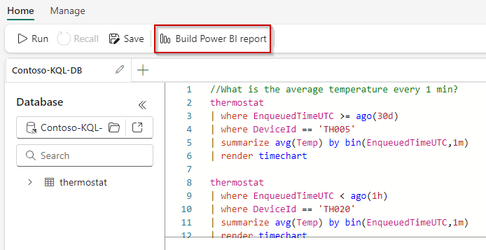

2. Hover over the **Power BI Report layout** and **navigation panel**.

3. See the table on the right side.

4. **Close** the Power BI report page.

	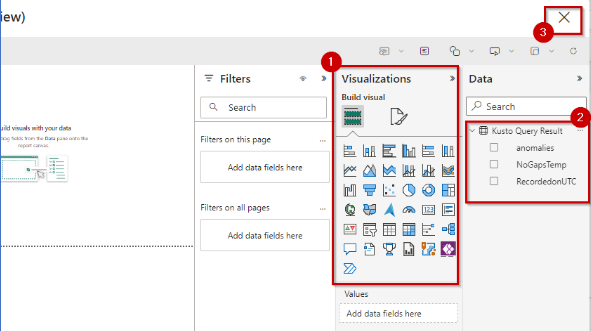

5. In **Power BI service**, click on **Workspaces** and click on **contosoSales**. 

	

6. Click on **Upload** and select **Browse**.

	

7. **Browse** to the location from your local system where you downloaded the reports, select the **Real-Time and Historical in-store analytics with KQLDB.pbix** report and click on the **Open** button.

	

>**Note:** Wait for the report to upload.

8. In the left navigation bar, select the **Contoso Sales** workspace.

	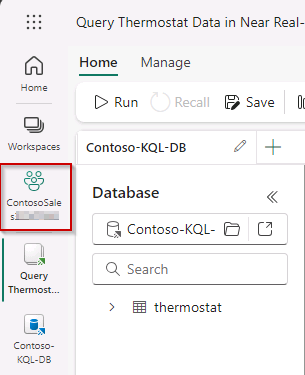

9. Set the **Filter** to **Report** and click on the **Real-Time and Historical in-store analytics with KQLDB** report.

	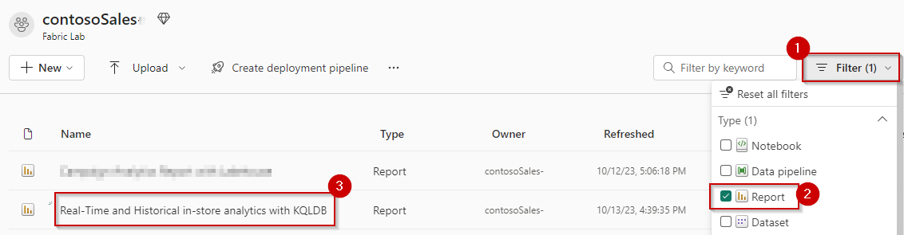

	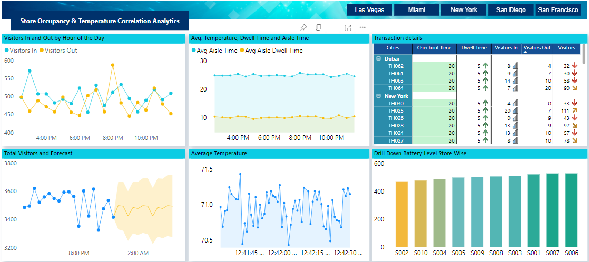

10. Hover over the **Average Temperature** to see the real-time data in Power BI.

	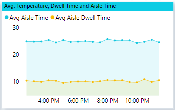


#### Appendix (Optional)

*Create reports based on the datasets created from the lakehouse.*

1. In the workspace, click on **Filter** and select **Lakehouse**.

    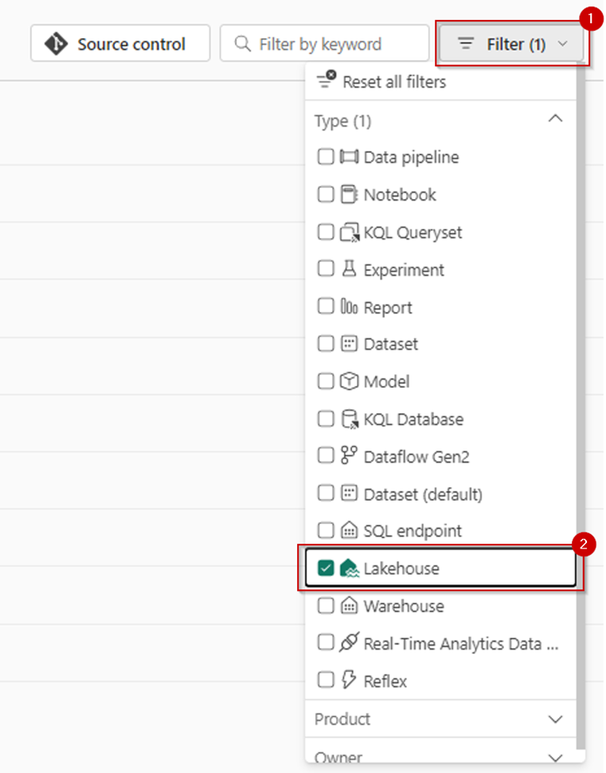

2. Click on **lakehouseSilver**.

    

3. Click on **New semantic model**.

    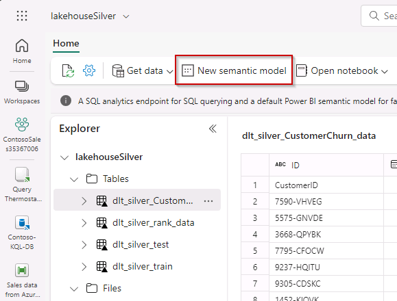

4. Select the required tables per the requirement and click on the **Confirm** button.

   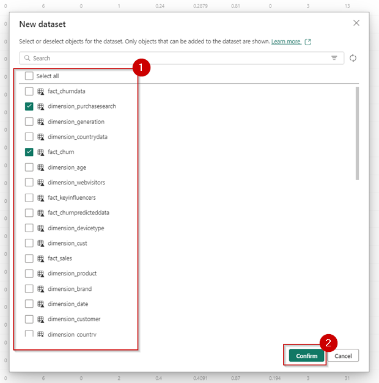

5. Create the data model per the requirement.

    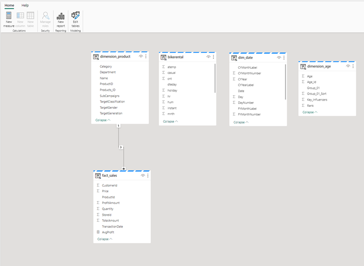

6. Click on **New report** to create the Power BI report.

    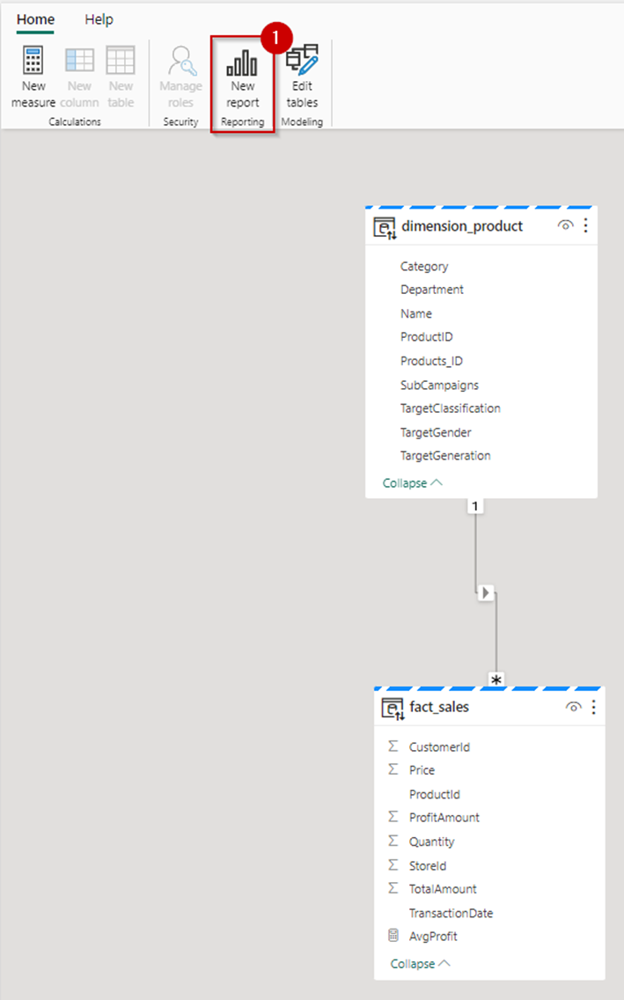

7. You would see the page shown in the screenshot.

    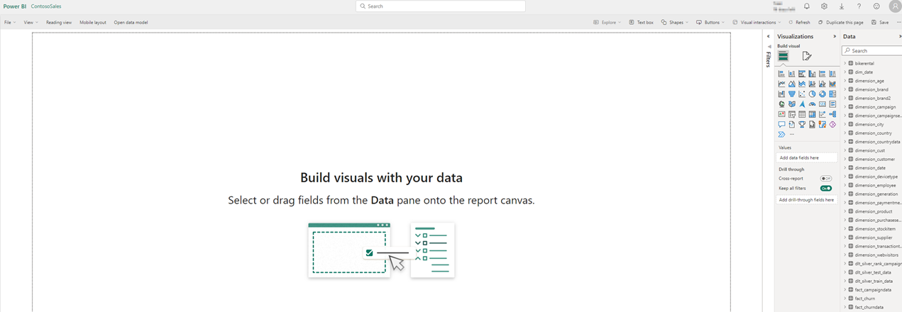

8. Select **Visuals and Columns** to create the report.

    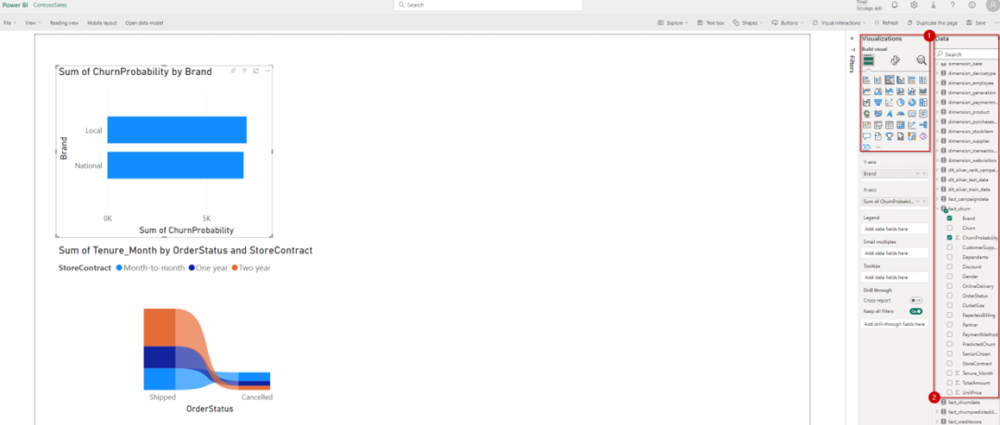

9. Build a report per your requirements. Below, you can see a sample report.

    

Congratulations! You as Data Engineers have helped Contoso gain actionable insights from its disparate data sources, thereby contributing to future growth, customer satisfaction, and a competitive advantage.

In this lab we experienced the creation of a simple integrated, open and governed Data Lakehouse foundation using Modern Analytics with Microsoft Fabric and Azure Databricks.

In this lab we covered the following:

First, we explored the Data Engineering experience and learned how to create a Microsoft Fabric enabled workspace, build a Lakehouse, and ingest data into OneLake.

Second, we explored an analytics pipeline using open Delta format and Azure Databricks Delta Live Tables. We stitched streaming and non-streaming data (landed earlier), to create a combined data product to build a simple Lakehouse and integrate with OneLake.

Third, we explored ML and BI scenarios on the Lakehouse. Here we reviewed MLOps pipeline using the Azure Databricks managed MLflow with Azure ML.

Fourth, we explored SQL Analytics in the Data Warehouse experience where we created a Data Warehouse, loaded data into the warehouse, and then created a virtual Data Warehouse.

Fifth, we explored Streaming data using KQL DB for a Real-time Analytics experience. Here, we created a KQL Database, ingested real-time and historical data into KQL DB, analyzed patterns to uncover anomalies and outliers, and created a Real-time Power BI report using KQL DB and KQL Query.

Finally, we leveraged Power BI to derive actionable insights from data in the Lakehouse using Direct Lake mode.


## Appendix

### Creating a Resource Group

1. **Log into** the [Azure Portal](https://portal.azure.com) using your Azure credentials.

2. On the Azure Portal home screen, **select** the '+ Create a resource' tile.

	

3. In the Search the Marketplace text box, **type** "Resource Group" and **press** the Enter key.

	

4. **Select** the 'Create' button on the 'Resource Group' overview page.

	
	
5. On the 'Create a resource group' screen, **select** your desired Subscription. For Resource group, **type** 'cloudshell-dpoc'. 

6. **Select** your desired region.

	> **Note:** Some services behave differently in different regions and may break some part of the setup. Choosing one of the following regions is preferable: 		westus2, eastus2, northcentralus, northeurope, southeastasia, australliaeast, centralindia, uksouth, japaneast.

7. **Click** the 'Review + Create' button.

	

8. **Click** the 'Create' button once all entries have been validated.

	


