# Elevate your data workflow with Microsoft Fabric, Copilot, and Azure Databricks
 
**The estimated time to complete this lab is 45-60 minutes.**
 
## Table of Contents
 
## [Exercise 1: Data Engineering/Data Factory experience - Data ingestion from a spectrum of analytical data sources into OneLake](#exercise-1-data-engineering-experience---data-ingestion-from-a-spectrum-of-analytical-data-sources-into-onelake-1)
 
- [Task 1.1: Create a Microsoft Fabric enabled workspace](#task-11-create-a-microsoft-fabric-enabled-workspace) 

- [Task 1.2: Use the ‘New Shortcut’ option from external data sources](#task-12-use-the-new-shortcut-option-from-external-data-sources) 

- [Task 1.3: Create Delta tables using Spark Notebook](#task-13-create-delta-tables-using-spark-notebook)

- [Task 1.4: Leverage Dataflow Gen2 and Data pipelines for a "No Code-Low Code" experience to quickly ingest data with Fast Copy and transform it using Copilot](#task-14-leverage-dataflow-gen2-and-data-pipelines-for-a-no-code-low-code-experience-to-quickly-ingest-data-with-fast-copy-and-transform-it-using-copilot) 

- [Task 1.5: Explore Task Flows in Microsoft Fabric](#task-15-explore-task-flows-in-microsoft-fabric)

## [Exercise 2: Azure Databricks integration with Fabric: DLT Pipelines, Unity Catalog (Data governance), Mirrored Azure Databricks Catalog](#exercise-2-azure-databricks-integration-with-fabric-dlt-pipelines-unity-catalog-data-governance-mirrored-azure-databricks-catalog)

- [Task 2.1: Create Delta Live Table pipeline for Data Transformation](#task-21-create-delta-live-table-pipeline-for-data-transformation)
- [Task 2.2: Explore the data in the Azure Databricks environment with Unity Catalog (unified governance solution for data and AI)](#task-22-explore-the-data-in-the-azure-databricks-environment-with-unity-catalog-unified-governance-solution-for-data-and-ai)
- [Task 2.3: Create a Mirrored Azure Databricks Catalog in Fabric and analyze data using T-SQL](#task-23-create-a-mirrored-azure-databricks-catalog-in-fabric-and-analyze-data-using-t-sql)

## [Exercise 3: Power BI Experience in Fabric](#exercise-3-power-bi-experience-in-fabric)

- [Task 3.1: Create a Semantic model and generate insights using Copilot for Power BI](#task-31-create-a-semantic-model-and-generate-insights-using-copilot-for-power-bi)

## [Exercise 4: Real-Time Intelligence experience - Explore Streaming data using Copilot for KQL DB](#exercise-4-real-time-intelligence-experience---explore-streaming-data-using-copilot-for-kql-db)

- [Task 4.1: Ingest real-time/historical data into Eventhouse using Eventstream](#task-41-ingest-real-timehistorical-data-into-eventhouse-using-eventstream)
- [Task 4.2: Analyze/discover patterns, identify anomalies and outliers using Copilot](#task-42-analyzediscover-patterns-identify-anomalies-and-outliers-using-copilot)

## [Exercise 5: Explorer Data Science experience in Microsoft Fabric (Optional)](#exercise-5-explorer-data-science-experience-in-microsoft-fabric-optional)

- [Task 5.1: Build ML models and experiments using Copilot in Fabric](#task-51-build-ml-models-and-experiments-using-copilot-in-fabric)
- [Task 5.2: Leverage AI skills for Q&A](#task-52-leverage-ai-skills-for-qa)

## [Exercise 6: Data Warehouse experience (Optional)](#exercise-6-data-warehouse-experience-optional)

- [Task 6.1: Create Mirrored Azure SQL DB in Fabric](#task-61-create-mirrored-azure-sql-db-in-fabric)
- [Task 6.2: Analyze the Mirrored Azure SQL Database data using T-SQL](#task-62-analyze-the-mirrored-azure-sql-database-data-using-t-sql)

---
## OVERVIEW

---
 

This lab showcases Modern Analytics with Microsoft Fabric and Azure Databricks, featuring a cost-effective, performance-optimized, and cloud-native Analytics solution pattern. This architecture unifies our customers' data estate to accelerate data value creation.

The visual illustrates the real-world example for Contoso, a fictitious company. Contoso is a retailer with thousands of brick-and-mortar stores across the world and an online store. Contoso is acquiring Litware Inc. which has curated marketing data and sales data processed by Azure Databricks and stored in the gold layer in ADLS Gen2. Contoso also has their customer churn data stored in the gold layer in ADLS Gen2.

In the following exercises, you will see how the Contoso team leveraged the power of Microsoft Fabric to ingest data from a spectrum of sources, combine Litware's data with their existing data from ADLS Gen2, and derive meaningful insights. Witness how they used a shortcut to reference Litware’s existing data from ADLS Gen2. Finally, you will see how Contoso’s data architects utilized Unity Catalog to quickly get up to speed on the acquired company’s data. You will also see the power of creating LLM Chatbots with the Databricks Data Intelligence Platform to achieve an unprecedented market sentiment for Contoso.

The lab scenario starts on January 30th. The company's new CEO, April, noticed negative trends in their KPIs, including:

- High customer churn

- Declining sales revenue

- High bounce rate on their website

- High operating expense

- Poor customer experience

- And most importantly, a low market sentiment

To address the high customer churn, April and the Contoso team decided to acquire Litware Inc., which carries products popular with millennials. April asks Rupesh, the Chief Data Officer, how they could create a data driven organization and reverse these adverse KPI trends. Rupesh talks to his technical team, including Eva, the data engineer, Miguel, the data scientist and Wendy, the business analyst. Rupesh tasks them with designing and implementing a solution pattern to realize this dream of a data driven organization. They recognize that the existence of data silos within Contoso's various departments presents a significant integration challenge. This challenge is worsened by the need to combine its subsidiary data and data from Litware Inc.

During this lab you will execute some of these steps as a part of this team to reverse these adverse KPI trends. First, you will ingest data from a spectrum of data sources into OneLake for Contoso. Let's get started.

### Exercise 1: Data Engineering experience - Data ingestion from a spectrum of analytical data sources into OneLake

*Before we start executing the steps, we will trigger the simulator app to start streaming data to eventhub.*

1. Open a Microsoft Edge browser in **InPrivate** mode. 

2. Navigate to the Azure Portal at [https://portal.azure.com/](https://portal.azure.com/)

3. Log into the Azure Portal.

5. If prompted to stay signed in, select **Yes**.


>**Note:** If prompted to take a tour, select **Maybe later**.


6. Search for **resource group** in the search bar at the top of the page and click on the **Resource groups** option.


7. Search for **rg-fabric** in the searchbox and click on the **resource group**. 


8. Search for **app service** and select the app service labeled **app-realtime-simulator...**

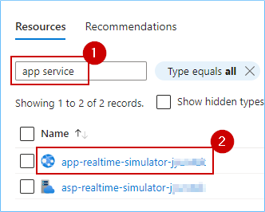

9. Click on the **Browse** button and a new tab will open.


10. **Wait** for the page to load. The following page will appear.

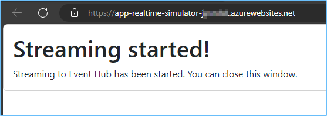

---
### Task 1.1: Create a Microsoft Fabric enabled workspace

In this exercise, you will act as the Data Engineer, Eva, to transfer Contoso's data from Azure SQL Database into the Lakehouse and initiate data preparation for the upcoming merger between Contoso and Litware Inc.

1. **Open** Power BI in a new tab by clicking [HERE](https://app.powerbi.com/)

2. Enter the username and click on **Submit**.


3. Enter the password and click on **Sign in**.


4. If prompted to stay signed in, select **Yes**.

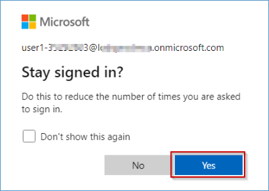

>**Note:** Close any pop-up that appears on the screen.


>**Note:** If you see the following screen, continue with the steps below or directly move to step number 8.

5. Click on the **Continue** button.


6. Click on the **Business phone number box** and paste the 10-digit number  ```1230000849``` in the box. 


7. Again, click on the **Get Started** button.

	

> **Note:** Wait for the Power BI workspace to load and *close* the top bar for a better view.

<!-- *Close* the top bar for a better view. -->

8. From the left navigation pane, click on **Workspaces** and then the **+ New workspace** button.

	

9. Type the name **ContosoSales**, **validate** the available name and click **Apply**.

>**Note:** Only use the workspace name provided above.

>**NOTE:** If the name **ContosoSales** is already taken, refresh the page and check again. A workspace with that name may already be created. If so, add a different suffix until the name is available.


>**Note:** Close any pop-up that appears on the screen.


>**Note:** Wait for the Power BI Workspace to load.

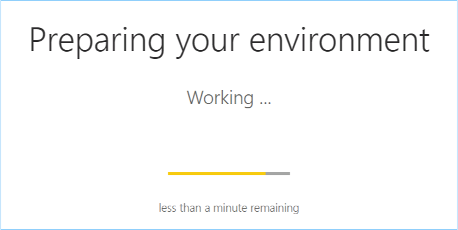


### Create/Build a Lakehouse

Now, let's see how each department can easily create a Lakehouse in the Contoso workspace without any provision. They simply provide a name, given the proper access rights of course!

1. Click on the **experience** button at the **bottom left** corner of the screen (In this screenshot, **Power BI** is selected as an "Experience") and then select **Data Engineering**.


2. In the new window, under Data Engineering, click **Lakehouse**.


**Note:** Screenshots in the exercises may sometimes differ from the actual lab. Please adjust your screen resolution to locate items and select them as needed.

3. Enter the name as **lakehouse**.

4. Click on the **checkbox** and then click on the **Create** button.

   

**Note:** Expand the Lakehouse Explorer if it is collapsed.

   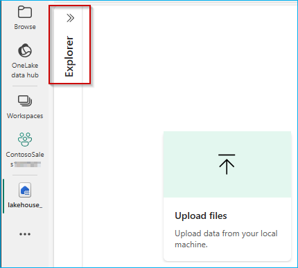

In just a few seconds, the Lakehouse is ready. With the right access, you, as a Data Engineer, can effortlessly create a new Lakehouse. There is no need to set up any storage accounts or worry about network, infrastructure, key vault, Azure subscriptions, etc.

---

### Task 1.2: Use the ‘New Shortcut’ option from external data sources
Now, this is something exciting! This section shows how easy it is to create Shortcuts without moving data. That is the power of OneLake! In this exercise, you will ingest the curated bounce rate data for Litware from ADLS Gen2 using the New Shortcut option. Let’s see how!

1. Click on the **three dots (ellipses)** on the right side of Files.

2. Click on **New shortcut**.

>**Note:** Make sure you create a shortcut under **files** and not under **tables** in the lakehouse explorer pane.


3. In the pop-up window, under **External sources**, select the **Azure Data Lake Storage Gen2** source.


>**Note:** Wait for the screen to load.

4. Select **Create new Connection**.

5. In the screen below, we need to enter the connection details for the ADLS Gen2 shortcut.


6. Navigate to the **Azure Portal**, in the **rg-fabric...** resource group search for **storage account** and click on the storage account resource.


7. Expand the **Security + networking** section and click on **Access keys**.


8. Click on the **Show** button under **key1**.


9. Click on the **Copy to clickboard** button.

10. Save this information in a notepad for further use.


11. In the left pane, expand the **Settings** section and click on **Endpoints**.

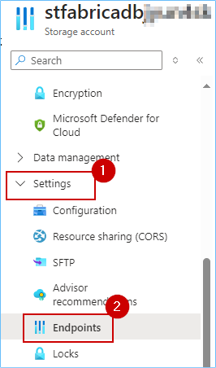

12. Scroll down to copy the **Data Lake Storage** endpoint in the **Data Lake Storage** section.

13. Save the information in a notepad for further use.

>**Note:** You may see different endpoints in addtion to the ones shown in the following screen. Make sure to select **only** the **Data Lake Storage** endpoint.


14. Navigate back to the **Fabric** tab.

15. Paste the endpoint copied in **step 13** under the **URL** field.

16. In the **Authentiation kind** dropdown, select **Account Key**.

17. Paste the **account key** copied in **step number 10**.

18. Click on **Next**.


19. Select the **data** and **litwaredata** checkbox and then click on the **Next** button.


20. Click on the **Create** button.


21. And there you go! Your shortcut is now ready! Click (do not expand) on the newly created shortcut named **litwaredata**.


Prior to Microsoft Fabric, departments in Contoso had to move the data they needed from other departments via time-consuming ETL processes. But look, now they have created shortcuts. No need to move any of this data. That is the power of OneLake!

### Task 1.3: Create Delta tables using Spark Notebook
Now, let’s see how Data Engineer, Eva, got the remaining data into OneLake by creating Delta tables using Spark Notebook. By using a Spark Notebook to create Delta tables, Eva can ensure more reliable, scalable, and efficient data management, which is essential for handling big data workflows.

1. Click on **Workspace** and select **New item**.


2. In the **New Item** tab, select **Notebook**.

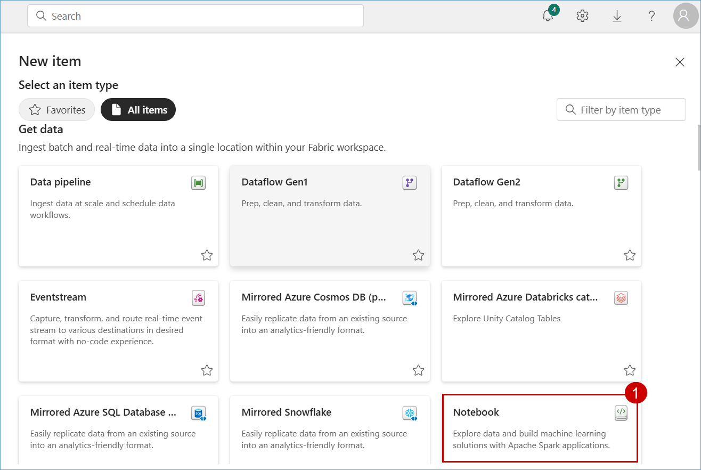

>**Note:**  If the Pop-up appears click on **Skip tour**

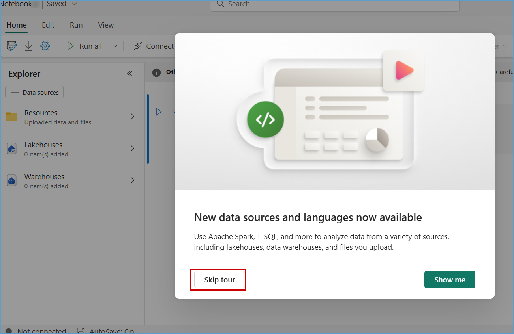

3. Click on the **+ Data Sources** button and then select **Lakehouses**


4. Select **Existing Lakehouse with Schema** and then click on ***Add***.


5. Select the **lakehouse** and then click on **Add**


6. Once the notebook is created, paste the **below code** in the cell and **run** the cell.

```
import os
import pandas as pd
 
# List all CSV files in the 'litwaredata' folder
file_path = '/lakehouse/default/Files/litwaredata/'
csv_files = [file for file in os.listdir(file_path) if file.endswith('.csv')]
 
# Load each CSV file into a table
for file in csv_files:
    table_name = file.split('.')[0]
    df = pd.read_csv(file_path + file)
    spark.createDataFrame(df).write.mode("ignore").format("delta").saveAsTable(table_name)
```

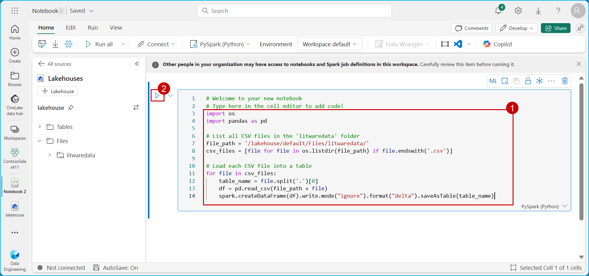

7. Once the execution is successful, **stop the Spark session** and click on **Lakehouse**.


8. Expand **tables**, expand **dbo**, click on the **three dots**, and then click on **Refresh**. 


9. View the successfully **loaded tables**.


10. Click on **website_bounce_rate** delta table and view the website bounce rate data.


11. You now have all the tables in **OneLake** for Contoso to leverage. Next, we proceed with data transformation using Dataflow Gen2 to transform the sales data ingested from Litware. 


### Task 1.4: Leverage Dataflow Gen2 and Data pipelines for a "No Code-Low Code" experience to quickly ingest data with Fast Copy and transform it using Copilot

Using another great feature in Fabric’s Data Factory, called Fast Copy, Contoso’s Data Engineer, Eva, quickly ingests terabytes of data with dataflows, thanks to the scalable Copy Activity in the pipeline. With so much data from Litware, there is bound to be a lot of clean up needed. Let’s step into Eva’s shoes to explore how she used fast copy to ingest data and Copilot to transform it, just in time to derive meaningful customer insights before their big Thanksgiving Sale!

You will experience how easy it is to use Fast Copy to transform 100M rows of Litware's sales data into the Lakehouse.


1. Click on the **experience** button at the **bottom left** corner of the screen (In this screenshot, **Data Engineering** is selected as an "Experience") and then select **Data Factory**.


2. Click on **Dataflow Gen2**.


3. Click on the top part of the **Get data** icon (**not on the dropdown arrow at the bottom of the icon**).

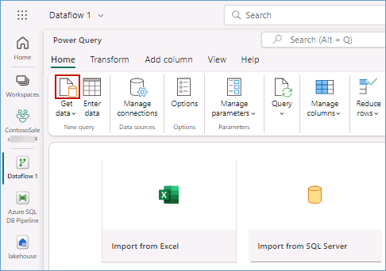

4. In the pop-up window, scroll down to **OneLake data hub** and click on **lakehouse**.


5. If you see a screen similar to the one shown below, click on the **Next** button otherwise move to the next step.


6. Expand **Files** and then expand **data**.


7. Scroll down and select the **sales_data.csv** checkbox, then **click** on the **Create** button.


8. Collapse the **Queries** pane and take a look at the sales dataset (**note that the first row of this dataset is not a header**).


> **Let's use Copilot to perform data cleansing.**

9. Click on the **Copilot** button, paste the **prompt** provided below in the following text box and click on the **send** icon.

```In the table sales_data csv, apply first row as headers.```


>**Note:** If Copilot needs additional context to understand your query, consider rephrasing the prompt to include more details.

10. Scroll to the right-hand side and observe the **GrossRevenue** and **NetRevenue** columns. You'll notice the there are some empty rows with null values.


> **Let's use Copilot to remove empty rows.**

11. Similarly, paste the prompt below in Copilot and click on the **send** icon.

```Remove empty rows from GrossRevenue and NetRevenue columns.```


12. Scroll to the right-hand side and observe the **GrossRevenue** and **NetRevenue** columns (**there are no empty rows with null values**).


>**Note:** Due to time constraints, we will not publish and run the Dataflow from the Pipeline.

>**Note:** Expand the queries pane collapsed earlier.

13. Right click on the **query** and then select **Require fast copy**.

  

14. Click on **Options**, scroll down to select **Scale** and tick **Allow use of fast copy connectors** checkbox then click on **OK**.

**Note:** If **Allow use of fast copy connectors** checkbox is already checked click on **OK**.

 

15. Click on **Add data destination**, select **Lakehouse**.

 

16. Click on **Next** button.

   

17. Expand the workspace **ContosoSales*, and select **lakehouse**.

18. Enter the table name as **sales_data_updated** and then click on the **Next** button.

    

18. Click on the **Save settings** button.

 

19. Click on the **Publish** button.


Congrats on completing this data transformation exercise! Looking at that, it took just 10 minutes to copy 100 million records. 

### Task 1.5: Explore Task Flows in Microsoft Fabric

To streamline collaboration and project management for the entire team, IT admin Chou set up a task flow within the Microsoft Fabric workspace. Fabric task flow is a workspace feature that enables you to build a visualization of the workflow in the workspace. It helps you understand how items are related and work together, making it easier to navigate your workspace, even as it becomes more complex over time. 
In this exercise, you’ll step into the shoes of each of the IT admins to see how easy it is to set up a task flow in Microsoft Fabric.

1. Click on workspace **ContosoSales@lab.LabInstance.Id** and drag the **bar down** to view Taskflow feature tab.
  
  
  
2. Click on the **Select a predesigned task flow** , 

  

3. Select **Medallion**, and then click on the **Select** button.

  

4. The empty Task Flow is created successfully.

  

5. Click on the **attach** icon on the Bronze data tile.

   

6. Select the lakehouse **checkbox** and then click on the **Select** button.

   

7. Click on the **attach** icon on the Initial process tile.

   

8. Select the lakehouse **checkbox** and then click on the **Select** button.

   

**Note:** Similarly, you can attach other fabric items for any taskflow activities.   

As you know, Litware was primarily using Azure Databricks with their data stored in ADLS Gen2 before the acquisition. Post merger, as one unified company – Contoso – they decided to leverage Azure Databricks to build and manage reliable data pipelines via Delta Live Tables (DLT). Now, you will see the amazing power of Unity Catalog that Contoso’s data architects used to quickly learn all about Litware's data without having to go through tons of documents. And all by simply leveraging AI and data intelligence.

---

### Exercise 2: Azure Databricks integration with Fabric: DLT Pipelines, Unity Catalog (Data governance), Mirrored Azure Databricks Catalog

This exercise shows how Microsoft Fabric with Databricks enabled Contoso to solve their integration challenges. The acquired company, Litware Inc., was already using Databricks heavily and they stored their churn and sales data in ADLS Gen2. We’ll see how Unity Catalog benefited Contoso’s data architects so they could quickly get up to speed on all Litware Inc.’s data.

#### Task 2.1: Create Delta Live Table pipeline for Data Transformation

Delta Live Tables (DLT) allow you to build and manage reliable data pipelines that deliver high-quality data in Lakehouse. DLT helps data engineering teams simplify ETL development and management with declarative pipeline development, automatic data testing, and deep visibility for monitoring and recovery.


1. Navigate to the **Azure Portal**, in the **rg-fabric...** resource group, search for **databricks** and click on the databricks resource with the name **adb-fabric...**.


2. Click on the **Launch Workspace** button.

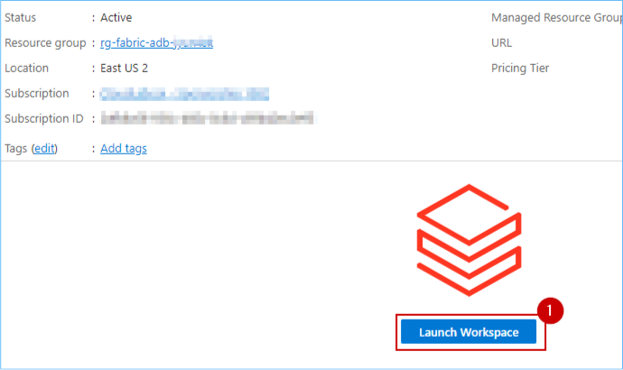

3.	In the left navigation pane click on **Delta Live Table** and click on the **Create pipeline** button.


4. Enter the name of the pipeline as **DLT_Pipeline** and click on the file icon to browse the notebook.


5. Click on **Shared**.

6. Click on **Analytics with ADB**.

7. Click on the **01 DLT Notebook**.

8. Click on the **Select** button.


9. In the Destination tab, select the **Unity Catalog** radio button.

10. In the Catalog box select **litware_unity_catalog** from dropdown.

11. In the Target schema, select **rag** from the dropdown.

12. Click on the **Create** button.


13. From the top right hand-side click on **Start**.


14. Wait for the pipeline run to complete, once its completed the result would look similar to the following screen.


---

#### Task 2.2: Explore the data in the Azure Databricks environment with Unity Catalog (unified governance solution for data and AI)
	
We saw how Contoso was able to utilize DLT pipelines to create a medallion architecture on their data. Now let us take a look at how data governance was managed on this curated data across the organization and how it was made easy with Unity catalog.
 
With the acquisition of Litware Inc., Contoso had a lot of data integration and interoperability challenges. Contoso wanted to make sure that the transition was smooth and data engineers and scientists from Contoso could easily assimilate the data processed by Databricks. Thankfully, they had the help from a wide selection of Gen AI features right within Azure Databricks to understand and derieve insights from this data. Let's see how!

1. Expand **litware_unity_catalog db**.

2.	Expand the **rag** schema and click on **tables**.

3.	Click on **documents_embeddings** table.

>**Note**: If you have used OpenAI for text embeddings during the deployment, then select **documents_embedding_openai** table.


4.	Click on **Accept** in 'AI Suggested Comment' box and Click on **AI Generate**.


	
We can see that AI in Azure Databricks has autogenerated the description for the table and its columns. Users can choose to accept the descriptions or edit them further. This improves the ease of governance on this new data for Contoso. No need to read through tons of documents for the Contoso data engineers to learn about Litware's data. How cool is that? Next, let's see how easy it is to query the data.


5. From the left hand-side pane, select **silver_customerchurn_data** table.


	
6.	Select the dropdown on **Create**.

7.	Click on **Query**.


	
8.	Select the **Assistant** tab.

9.	Click on the **query area** and type the below **text** and then click on **send** icon.
```
Retrive the average total amount of transactions for each store contract. Additionally, calculate the average total amount for customers who have churned and for those who have not churned. Ensure all average values are rounded to the nearest whole number.
``` 

	

	
By simply using a natural language query, and leveraging the AI generated table and field descriptions mentioned earlier, Azure Databricks generates an equivalet SQL query. No need to be skilled in SQL queries and so business friendly right?
	
10. Click on the **Arrow** to replace the current code.


11.	Click on **Run**.

12.	Check the output.


Users also have the capability to fix errors in queries with the AI assistant. Let us intentionally introduce an error by misspelling a table name and see the AI's response.
	
13. In the query, click on **churnstatus** to misspell it.

14. Click on **Run** to see the error.

15. Click on **Diagnose error** to fix the query issue. And see how easily the error is fixed! It is like have a virtual assistant available 24 hours!


16. Click on the **Arrow** to replace the current code.


	
Data discovery is also made simple within Azure Databricks. Users can simply search for table names or the information they are looking for in the global search and all the relevant items are returned, again leveraging the table and field descriptions created by AI and data intelligence mentioned earlier.
	
17. Click on **Search*.

18. Click on **Open search in a full page**.


19. Click to search for **campaigns** and click on show all results. Now, the next big challenge for Contoso was to get visibility of their Market Sentiment KPI. Remember, the Market Sentiment before the acquisition was at an all time low. News articles and analyst reviews were being continuously published. All this unstructured data had to be efficiently assimilated so that the Market Sentiment could be tracked. That brings us to the next task. Let us see!

---

#### Task 2.3: Create a Mirrored Azure Databricks Catalog in Fabric and analyze data using T-SQL

Mirroring the Azure Databricks Catalog structure in Fabric allows seamless access to the underlying catalog data through shortcuts. This means that any changes made to the data are instantly reflected in Fabric, without the need for data movement or replication. Let’s step into Data Engineer, Eva’s shoes to create a Mirrored Azure Databricks Catalog and analyze the data using T-SQL. 

1. Navigate back to the Microsoft Fabric tab on your browser (https://app.fabric.microsoft.com).

2. Click on the **ContosoSales   ** and select **New item** from menu bar.


3. In the **New item** window, scroll down and click on **Microsoft Azure Databricks catalog (preview)**.


4. When the **New source** window pops up, click on the **Create new connection** radio button.


5. Navigate to the **Azure Portal**, in the **rg-fabric...** resource group search for **Azure Databricks Service** and click on the Azure Databricks Service resource.


6. **Copy** the **URL** of Azure Databricks Service resource.


7. Navigate back to the **Fabric** tab.

8. In the URL field paste the Azure Databricks Service URL.

9. Now, select **Organizational account** from 'Authentication kind' dropdown box..

10. CLick on **Sign in**


11. click on the **Connect** button.

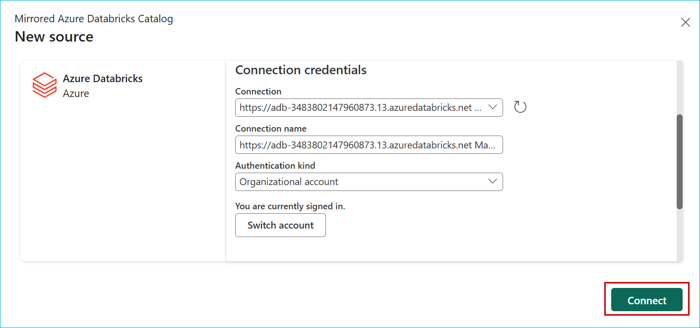

12. Click on **Next** button.


13. In the **Choose data** screen, select the Catalog name as **litware_unity_catalog** from the dropdown box, and select the **rag** schema if not selected, then select the checkbox **Automatically sync future catalog changes for the selected schema** (to mirror future tables) if not ticked and click on **Next** button.


14. Enter the **Artifact name** for your mirrored Databricks Catalog and click on the **Create** button.

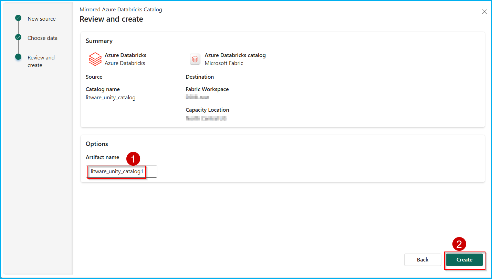

15. Click on the **Monitor catalog** button to track the mirroring status and then close it.


16. Click on the **View SQL endpoint** button. You can also select the tables to preview data.

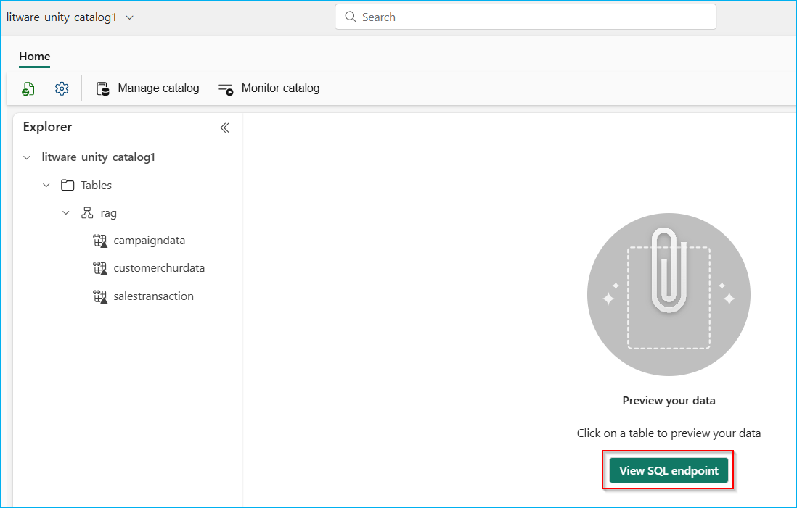

---

### Exercise 3: Power BI Experience in Fabric 
#### Task 3.1: Create a Semantic model and generate insights using Copilot for Power BI

Let us dive deep into the experience of the Business analyst, Wendy. Based on all the gathered data Wendy is expected to create Power BI reports for other data citizens and stakeholders. Let us see the power of Power BI copilot in conjuction with the Direct Lake Mode.

1. Navigate to the Fabric Workspace. 

   

2. In the **contosoSales...** workspace, click on **Filter** and select **Lakehouse**.

   	

3. Click on the **lakehouse...**.

>**Note:** There are 3 options for lakehouseBronze, namely Lakehouse, Dataset (default) and SQL endpoint. Make sure you select the **Lakehouse** option.

   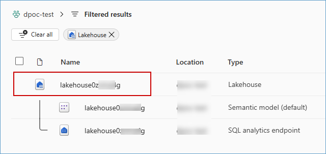

>**Note:** In case you do not see the 'website_bounce_rate' under the Tables section of the lakehouse, follow the below steps.

   -  Click on **data**.

      

   - Click on the **ellipse**(three icons) in front of **website_bounce_rate.csv**, select **Load to Tables** and then select **New Table**.

      

   - In the pop-up verify the **New table name** and then click on the **Load** button.

      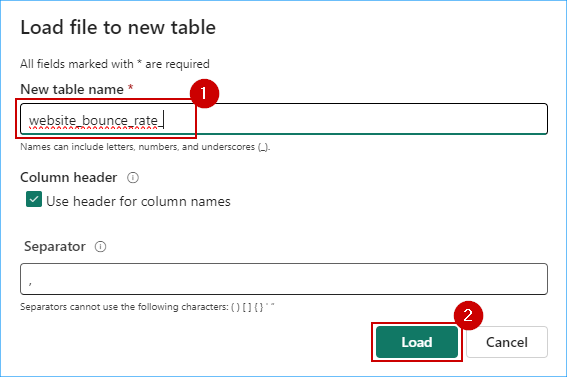


*Once the **website_bounce_rate** delta table is there, we can proceed with the steps ahead*

4. Click on the **New semantic model**. 

5. Enter the name **website_bounce_rate_model**. 

6. Search for 'website_bounce_rate' and select **website_bounce_rate** table. 

7. Click on the **Confirm** button and the new semantic model will be created. 


8. To create a new report using this semantic model, click on the **New Report** at the top bar.
 


9. Click on the **Get started** button. You will now see how easy it is for the data analyst to create compelling Power BI reports and get deep insights with literally no hands-on coding!

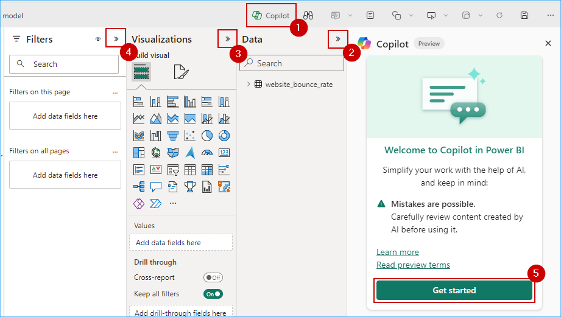
	
10. Click on the **Prompt Guide** button.  

11. Select the option **What's in my data?**
   


The first option, 'What’s in my data?' provides an overview of the contents of the dataset, identifies and describes what’s in it and what the attributes are about. So, there’s no need to wait for someone to explain the dataset. This improves the efficiency and volume of report creation.

12. Click in the Copilot chat box field and enter the prompt below.

```
Create a report Bounce Rate analysis, to show the correlation between customer sentiment, particularly among millennials and Gen Z, unsuccessful product searches across different devices, and the website's bounce rate by customer generations.
```

>**Note:** Wait for the prompt to populate.

13. Click on the **Send** button and wait for the results to load. 


	
>**Note:** If you see the error message saying, 'Something went wrong.', try refreshing the page and restart the task.
- If Copilot needs additional context to understand your query, consider rephrasing the prompt to include more details

>**Note:** The responses from Copilot may not match the ones in the screenshot but will provide a similar response.


Based on this report, we notice that the website bounce rate for Contoso is especially high amongst the Millennial customer segment. Let’s ask Copilot if it has any recommendations for improving this bounce rate based on the results and data in the report.

We’ll ask Copilot for suggestions based on the results and data in the report. 

14. Enter the following prompt in Copilot and press the **Send** button.

```
Based on the data in the page, what can be done to improve the bounce rate of millennials?
```
 	
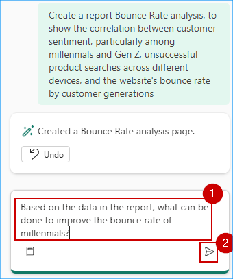
	
15. Look at the suggestions Copilot provided. Copilot creates the desired Power BI report and even goes a step further to give powerful insights. Wendy realizes that for the website bounce rate to improve, Contoso needs to transform their mobile website experience for millennials. This helps them reduce their millennial related customer churn too! Now, what if Contoso’s leadership team needed a quick summary of this entire report? **Smart Narrative** to the rescue! 
	

	
16. Expand the **Visualizations** pane and select the **Narratives** visual. 

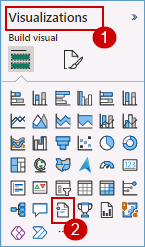

17. Click on **Copilot (preview)** within the visual.


	
18. Select **Give an executive summary**. 

19. Click on **Update** and observe the generated summary. See how easy it was to get an executive summary with absolutely no IT resource dependency!
 


20. Expand the narrative from the corner to get a better readable view of the result.


21. Click on the **close** button in the pop-up window.


	
The summary could also be generated in another language if specified. Additionally, the summary updates if you filter the report on any visual.

---

### Exercise 4: Real-Time Intelligence experience - Explore Streaming data using Copilot for KQL DB

Imagine it is 6 am on the day of Contoso's big Thanksgiving sale. Customers are flocking to their stores in large numbers. We are about to witness the very culmination of Contoso's phenomenal transformation with Microsoft Fabric and Azure Databricks. Specifically, we will see how near real-time data is used to make decisions for the next moment in Contoso's stores to ensure optimal temperatures are maintained for their customers while they shop at the big sale!

#### Task 4.1: Ingest real-time/historical data into Eventhouse using Eventstream

1.	Click on the **experience** button on the **bottom left** corner of the screen and then select **Real-Time Intelligence**.


>**Note:** If you see a pop-up like the one below, click on the **Don't save** button.

 

2. Select **Eventstream**.


3. Enter the name as ```RealtimeDataTo-KQL-DB``` and tick a checkbox 'Enhanced Capabilities(preview)' then click on **Create** button.


4. Click on the **Add external source** button.

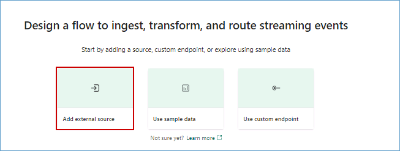

5. Click on the **Azure Event Hub** button.


6. Under the Connection field, click on **New connection**.


7. To fill in the fields below we need to navigate to Azure Portal.

8. Navigate to the **Azure Portal**. In the **rg-fabric...** resource group, search for the **event hubs namespace** and click on the **Event Hubs Namespace** resource.


9. Copy the name of the **Event Hub namespace** and paste it in a notepad for further use.


10. In the left navigation pane expand the **Entities** section, click on **Event Hubs**, and then click on the **thermostat** event hub.


11. In the left pane expand **Settings**, click on **Shared access policies** and then click on **thermostat**.


12. Copy the **Primary key** and paste it in a notepad for further use. 


13. Go back to the **Fabric tab** on your browser.

14. Make sure you are in the **Create new connection** section, paste the value for **Event Hub namespace** from **step 9** and enter the **Event Hub** value as **thermostat**.


15. Scroll down and select **Shared Access Key** for Authentication kind, enter **thermostat** as the Shared Access Key Name and then paste the value copied in **step 12** in the **Shared Access Key**.

16. Select Data format as **JSON** and then click on the **Connect** button.


>**Note:** Wait for the connection to be established.

17.  Select Data format as **JSON** and click on **Next**.


>**Note:** Wait for the connection to be established.

14. Click on the **Add** button.


15. In the Eventstream canvas, click on the **Add destination** dropdown and select **KQL Database**.


16. Select the **Event processing before ingestion** radio button, enter **RealTimeData** as the Destination name.

17. Select **contosoSales...** and **Contoso-KQL-DB** from the respective 'Workspace' and 'KQL Database' dropdowns.

18. Finally click on the **Create new** button.


21. Enter the Input data format as **Json**.

>**Note:** Zoom-out on your screen if the Input data format field is not visible.


22. Drag Arrow from 'RealtimeDataTo-KQL' and connect it to 'RealTimeData'.


23. Click on the **Publish** button.


>**Note:** Wait for the data ingestion from EventHub to KQL DB.

24. Once you see that the streaming has started, click on **Refresh** and wait for the data to preview.


Real-time data from the event hub has been ingested successfully into the KQL Database. Next, as customers walk in aisles and the temperatures fluctuate, let us see how KQL queries proactively identify anomalies and help maintain an optimal shopping experience!

---

#### Task 4.2: Analyze/discover patterns, identify anomalies and outliers using Copilot

Kusto Query Language is a powerful tool. In this scenario KQL is used to explore Contoso’s data, discover patterns, identify anomalies and outliers, create statistical modeling, and more.

We use KQL to query the thermostat data that’s streaming in near real-time from the devices installed in Contoso’s stores.

1. Click on the **Workspaces** and select **contosoSales...** workspace from left navigation pane.

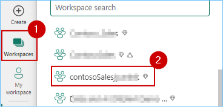

2. Click on the **Real-Time Intelligence** at the bottom left corner of the screen and select **Real-Time Intelligence**.


3. Select **KQL Queryset**.

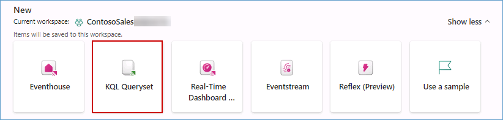

4. In the KQL Queryset name field enter, ```Query Thermostat Data in Near Real-time using KQL Script``` and click on the **Create** button.


5. **Wait** for the query set creation and a new screen will display. In this screen, click on **Contoso-Eventhouse**, verify the workspace name and then click on the **Connect** button.

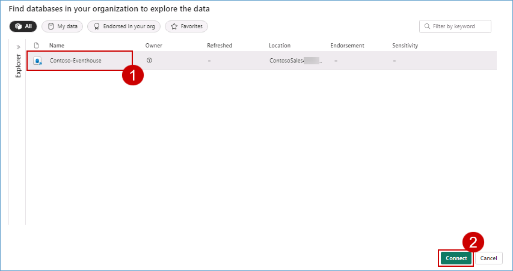

6. Place your cursor inside the **query** field, select all using **Ctrl + A** and **delete** the pre-written query.

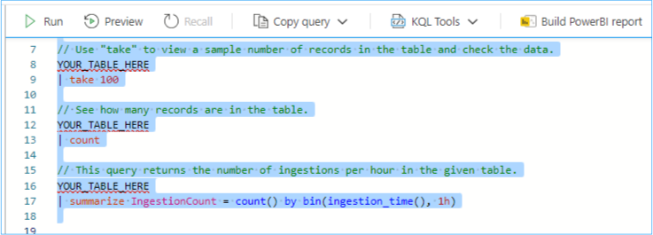

7. Click on the **Copilot** button.


8. **Paste** the query provided below in the Copilot query section.

```Create a query to find average temperature every 1 min```

9. Click on the **send** icon.

>**Note:** The responses from Copilot may not match the ones in the screenshot but will provide a similar response. 

10. Click on the **Insert** button.


11.	Place you cursor in the **script field**, click on the **Run** button and you get the desired result.


So, imagine if one of the aisles had a sudden rise in temperature. Customers start leaving that aisle and the wait times in the checkout lines start to increase. But thanks to the KQL Queries, those anomalies would be tracked, and immediate notifications would be generated to bring the aisle temperature back to optimal levels! Now, after all these amazing data transformations in OneLake in a healthy ecosystem with Azure Databricks, can we actually predict customer churn for the future? Absolutely! In fact, in the next exercise, let’s see the power of Microsoft Fabric and Azure Databricks to do just that!

---


### Exercise 5: Explorer Data Science experience in Microsoft Fabric (Optional) 
So, we saw how Contoso combined historical gold layer data from ADLS Gen2 with all OneLake data via shortcuts. Additionally, we saw how all that data could be easily accessed in Azure Databricks (thanks to the standard delta parquet format). Delta live tables were created in Azure Databricks for further curation of data. Contoso can now leverage the power of machine learning models in ADB on that data to gain meaningful insights and predict customer churn. Let's explore the Data Science Experience in Azure Databricks as Data Scientists!

#### Task 5.1: Build ML models and experiments using Copilot in Fabric

   

To understand the cause behind Contoso’s declining revenue, the team needed to dive deeper into their customers’ spending pattern.

Copilot responds to queries in natural language or generates customized code snippets for tasks like creating charts, filtering data, applying transformations, and building machine learning models.

Let’s see how Copilot for Notebook helps you, as a Data Engineer, quickly create Data Science Notebooks.


1. Switch to the **Data Science** experience using the experience switcher icon in the left corner.

   

2. Click on Import notebook.

   

3. Click on the **Upload** button.

   

4. Browse to the fabricnotebooks folder in your VM  by following the path lab24\artifacts\fabricnotebooks, and then select **Build ML models and experiments using Copilot for Data Science in Fabric** notebook.

5. Click on the **Open** button.

   

6. Wait for the notebook to **upload**.

   

7. Click on the **ContosoSales** workspace from the left navigation pane.

   

8. Click on **Filter**, expand **Type** and select **Notebook**.

   

9. Click on the **Build ML models and experiments using Copilot for Data Science in Fabric** notebook.

   

10. Click on **Lakehouses** in the Explorer pane.

   

11. Click on **Missing Lakehouses** and then click on **Remove all Lakehouse**.

   

12. Click on the **Continue** button.

     

13. Click on the **+ Lakehouse** button.

    

14. Make sure that **Existing Lakehouse** radio button is selected and then click on the **Add** button.

   

15. Select the **lakehouse** checkbox.

   

16. Click on the **Add** button.

   

17. Click on the **Copilot** button and then click on the **Get Started** button.

   

18. Run the **first cell** of the notebook to install the copilot packages.

>**Note:** This may take a while to execute, please wait till this loads completely.

   

19. Copy and paste the **below prompt** in the textbox.

```
Please load "customerchurndata" table from the Lakehouse into a Spark DataFrame. Then convert that into pandas dataframe as df. in the Copilot chatbox.
```

20. Click on the **send** button.

   

21. Click on the **Copy code** icon.

>**Note:** The new cell will be created right above the cell.

   

22. Click on a **+ Code** above the first cell of the notebook.

   

23. Paste the **copied query** and run the new **cell**.

   

**Note:** Copilot may not respond as expected,please copy and paste the following code to obtain the result:

```
# Load the table into a Spark DataFrame
spark_df = spark.table('lakehouse.customerchurndata')
 
# Convert the Spark DataFrame to a pandas DataFrame
df = spark_df.toPandas()
```

24. Paste the following at the **end of your browser URL** and press the **Enter** key. 

```
&debug.enableCopilot=1&debug.enableChatWidget=1&debug.enableQuickAssist=1
```

   

25. Click on a **+ Code** above the cell, place your **cursor** in the cell and then click on the **Copilot** button.

   

26. Enter the below prompt in the Copilot textbox: 

```
Create a pivot table of average with min and max totalamount by storecontract and churn. Then show output of the pivot table.
```

27. Click on the **Send** icon.

   

28.	Click on the **Accept** button.

   

29. Run the cell and observe the output.

   

30.	Introduce an error in a previous cell by **removing a character** in the code.

31.	Run the **code cell** with the error.


32.	Ask Copilot to **fix it**.

   

33. Click on **Accept** button and then Run the cell.

   


34. Add a **new code cell** to the notebook, paste following **query** to the cell and then run the **cell**.

```
%%chat 
Create a seaborn scatterplot with Tenure Total Amount and Churn
```

   


With the data prepared with the help of Copilot, Data Scientists like you can explore the data to understand the patterns it contains.

The rest of the notebook has similar PySpark queries to explore customer churn prediction.


#### Task 5.2: Leverage AI skills for Q&A

AI Skill, a new capability in Fabric, allows Data Analysts like Serena to create their own generative AI experiences. Serena believes that generative AI offers a transformative way to interact with data, significantly boosting data-driven decision-making in organizations worldwide. 

In this exercise, you’ll step into Data Analyst, Serena’s shoes and leverage AI Skill to create conversational question-and-answer (Q&A) systems. 


1. From the left navigation pane select **Data Science** experience.

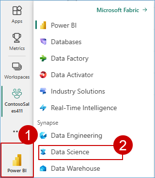

2. Click on **>** Forward Arrow and select **AI Skill**.


3. Enter Name as **Contoso-Assistance** 


4. Click on **lakehouse** and then click on the **Confirm** button.

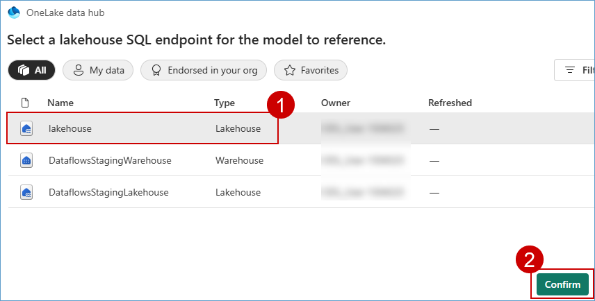

5. Click on **refresh** and Expand **Tables** then select the following tables.

- dimcustomer
- dimdate
- dimproduct
- dimreseller
- factinternetsales
- factresellersales


6. Click on **Get Started**.


7. Type **What is the most sold product?** in the chatbox and click on the **Send** button.


8. AI Skill answered the question fairly well based on the selected tables.

However, the SQL query needs some improvement, it orders the products by order quantity, when total sales revenue associated with the product is the most important consideration, as shown in the above screenshot.

To improve the query generation, let's provide some instructions, as shown in these examples:

```
Whenever I ask about "the most sold" products or items, the metric of interest is total sales revenue and not order quantity.

The primary table to use is FactInternetSales. Only use FactResellerSales if explicitly asked about resales or when asked about total sales.
```

9. Copy the above notes and paste it in **Notes for model** box. Type **What is the most sold product ?** in the chatbox and then click on the **Send** button.  

Asking the question again returns a different answer, **Mountain-200 Black, 46**, as shown in the below screenshot:


In addition to instructions, examples serve as another effective way to guide the AI. If you have questions that your AI skill often receives, or questions that require complex joins.

10. In the example SQL queries click on **edit** icon.


11. Click on **+ Add example** and enter the following question and their respective SQL queries.

|Question| SQL query|
|--------|----------|
|who are the top 5 customers by total sales amount?|SELECT TOP 5 CONCAT(dc.FirstName, ' ', dc.LastName) AS CustomerName, SUM(fis.SalesAmount) AS TotalSpent FROM factinternetsales fis JOIN dimcustomer dc ON fis.CustomerKey = dc.CustomerKey GROUP BY CONCAT(dc.FirstName, ' ', dc.LastName) ORDER BY TotalSpent DESC;|
|what is the total sales amount by year?|SELECT dd.CalendarYear, SUM(fis.SalesAmount) AS TotalSales FROM factinternetsales fis JOIN dimdate dd ON fis.OrderDateKey = dd.DateKey GROUP BY dd.CalendarYear ORDER BY dd.CalendarYear;|


12. Click on **close(X)** button.

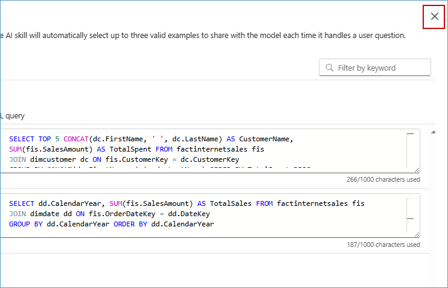

13. Type **who are the top 5 customers by total sales amount?** in the chatbox and click on **Send** button.


14. Click on **Publish**.


15. In the pop-up screen click on **Publish**.


16. Notice that AI skill is published successfully.


### Exercise 6: Data Warehouse experience (Optional)

#### Task 6.1: Create Mirrored Azure SQL DB in Fabric

Mirroring in Fabric provides an easy experience to avoid complex ETL (Extract Transform Load) and integrate your existing Azure SQL Database estate with the rest of your data in Microsoft Fabric.

Litware had a lot of their marketing data in the Azure SQL DB, so Contoso used Database Mirroring to help further reduce their data movement and dependency on different systems. 

1. Navigate to the Microsoft Fabric tab on your browser (https://app.fabric.microsoft.com).

2. Click on your workspace, and select **New item** from menu bar.


3. In the **New item** window, search for **SQL** in the saecrh bar then select **Mirrored Azure SQL Database...**.


4. When prompted to **Choose a database connection to get started**, look for **New sources** and select **Azure SQL database**.


5. Navigate to the **Azure Portal**, in the **rg-fabric...** resource group search for **SQL server** and click on the SQL server resource.


6. **Copy** the **Server name** of SQL server resource.


7. Navigate back to the **Fabric** tab.

8. In the **Server** field, paste **Server name** which you copied from Azure portal, In **Database** field paste ```SalesDb```.


6.  Scroll down and select **Basic** for Authentication kind, enter ```labsqladmin``` as the Username, ```Smoothie@2024``` as the Password and click on the **Next** button.


>**Note:** Close any pop-up that you see throughout the lab.

7. In the **Choose data** screen, you can select the tables to be mirrored into Fabric, then select the checkbox **Automatically mirror future tables** and click on **Connect** button.


8. Enter the name for your mirrored db as **Mirrored_SalesDb1** and click on **Create mirrored database** button.


9. Click on **Monitor replication** button to track the replication status.


10. Wait until the **Rows replicated** statistics are displayed. If not refresh the **Monitor replication** tab as shown in the below screen. Now, Azure SQL DB has been successfully mirrored.


11. Close the **Monitor replication** window.

---

#### Task 6.2: Analyze the Mirrored Azure SQL Database data using T-SQL

Each mirrored Azure SQL database has an autogenerated SQL analytics endpoint that provides a rich analytical experience on top of the tables created by the mirroring process.

This means Contoso’s marketing data from SQL database is accessed seamlessly in Fabric with zero ETL, and it is always kept In Sync automatically in Fabric. Once the mirroring was up and running, Data Engineer, Eva, was able to access the tables in SQL Database and integrate the data in minutes. Let’s step into her shoes and see how it’s done!

1. Continuing from the priously created Mirrored SQL DB window, select **SQL analytics endpoint** from top right dropdown box.


2. Expand the **Schemas** and You can select the mirrored tables to see data preview. and then click on **New SQL query** button from the menu bar.


3. Copy below **SQL query** in query editor to explore mirrored data and perform your analysis. 

```
Select distinct [ProductName] 
from [Mirrored_SalesDb1].[dbo].[dbo_FactSales] as fct
left join [Mirrored_SalesDb1].[dbo].[dbo_DimProduct] as prd
on fct.[ProductKey]=prd.[ProductKey]
where [SalesAmount] > 6000
```

4. Click on **Run**. 


---


## APPENDIX


### Task 7: Create a KQL Database

1. While you are in the Fabric workspace homepage, click on **+ New** and then click on **More options**.

	

3. In the new window, scroll down to the **Real-Time Analytics** section and click on **KQL Database**.

	

4. Enter the name **Contoso-KQL-DB**, click on the **Create** button and wait for the database to be created.

	


---

Congratulations! You as Data Engineers have helped Contoso gain actionable insights from its disparate data sources, thereby contributing to future growth, customer satisfaction, and a competitive advantage.

In this lab we experienced the creation of a simple integrated, open and governed Data Lakehouse foundation using Modern Analytics with Microsoft Fabric and Azure Databricks.

In this lab we covered the following:

First, we explored the Data Engineering experience and learned how to create a Microsoft Fabric enabled workspace, build a Lakehouse, and ingest data into OneLake along with other data engineering operations with dataflow copilot.

Second, we explored an analytics pipeline using open Delta format and Azure Databricks Delta Live Tables to build a simple Lakehouse and integrate with OneLake with shortcuts.

Third, we explored data governance and generative AI features in Azure Databricks with Unity Catalog. We also explored ML and BI scenarios on the Lakehouse. Here we reviewed MLOps pipeline using the Azure Databricks managed MLflow with Azure ML.

Fourth, we saw the Power BI experience in Fabric with copilot and direct lake mode.

Fifth, we explored Streaming data using KQL DB for a Real-time Analytics experience. Here, we created a KQL Database, ingested real-time and historical data into KQL DB, analyzed patterns to uncover anomalies and outliers with the help of copilot.

Finally, we leveraged Power BI to derive actionable insights from data in the Lakehouse using Direct Lake mode.


