# Retail2.0 DREAM Demo in a Box Setup Guide

## What is it?
DREAM Demos in a Box (DDiB) are packaged Industry Scenario DREAM Demos with ARM templates (with a demo web app, Power BI reports, Synapse resources, AML Notebooks etc.) that can be deployed in a customer’s subscription using the CAPE tool in a few hours.  Partners can also deploy DREAM Demos in their own subscriptions using DDiB.

 ## Objective & Intent
Partners can deploy DREAM Demos in their own Azure subscriptions and show live demos to customers. 
In partnership with Microsoft sellers, partners can deploy the Industry scenario DREAM demos into customer subscriptions. 
Customers can play,  get hands-on experience navigating through the demo environment in their own subscription and show to their own stakeholders.

**Before You Begin**

## :exclamation:IMPORTANT NOTES:  

  1. **Please read the [license agreement](https://github.com/microsoft/Azure-Analytics-and-AI-Engagement/blob/main/CDP-Retail/license.md) and [disclaimer](https://github.com/microsoft/Azure-Analytics-and-AI-Engagement/blob/main/CDP-Retail/disclaimer.md) before proceeding, as your access to and use of the code made available hereunder is subject to the terms and conditions made available therein.** Any third party tool used in the demo is not owned by us and you will have to buy the licenses for extended use.
  2. Without limiting the terms of the [license](https://github.com/microsoft/Azure-Analytics-and-AI-Engagement/blob/main/CDP-Retail/license.md) , any Partner distribution of the Software (whether directly or indirectly) may only be made through Microsoft’s Customer Acceleration Portal for Engagements (“CAPE”). CAPE is accessible by Microsoft employees. For more information about the CAPE process, please connect with your local Data & AI specialist or CSA/GBB.
  3. Please note that **Azure hosting costs** are involved when DREAM Demos in a Box are implemented in customer or partner Azure subscriptions. **Microsoft will not cover** DDiB hosting costs for partners or customers.
  4. Since this is a DDiB, there are certain resources open to the public. **Please ensure proper security practices are followed before you add any sensitive data into the environment.** To strengthen the security posture of the environment, **leverage Azure Security Centre.** 
  5.  For any questions or comments please email **[dreamdemos@microsoft.com](mailto:dreamdemos@microsoft.com).**
  
   > **Note**: Set up your demo environment at least two hours before your scheduled demo to make sure everything is working.
   
# Copyright

© 2021 Microsoft Corporation. All rights reserved.   

By using this demo/lab, you agree to the following terms: 

The technology/functionality described in this demo/lab is provided by Microsoft Corporation for purposes of obtaining your feedback and to provide you with a learning experience. You may only use the demo/lab to evaluate such technology features and functionality and provide feedback to Microsoft.  You may not use it for any other purpose. You may not modify, copy, distribute, transmit, display, perform, reproduce, publish, license, create derivative works from, transfer, or sell this demo/lab or any portion thereof. 

COPYING OR REPRODUCTION OF THE DEMO/LAB (OR ANY PORTION OF IT) TO ANY OTHER SERVER OR LOCATION FOR FURTHER REPRODUCTION OR REDISTRIBUTION IS EXPRESSLY PROHIBITED. 

THIS DEMO/LAB PROVIDES CERTAIN SOFTWARE TECHNOLOGY/PRODUCT FEATURES AND FUNCTIONALITY, INCLUDING POTENTIAL NEW FEATURES AND CONCEPTS, IN A SIMULATED ENVIRONMENT WITHOUT COMPLEX SET-UP OR INSTALLATION FOR THE PURPOSE DESCRIBED ABOVE. THE TECHNOLOGY/CONCEPTS REPRESENTED IN THIS DEMO/LAB MAY NOT REPRESENT FULL FEATURE FUNCTIONALITY AND MAY NOT WORK THE WAY A FINAL VERSION MAY WORK. WE ALSO MAY NOT RELEASE A FINAL VERSION OF SUCH FEATURES OR CONCEPTS.  YOUR EXPERIENCE WITH USING SUCH FEATURES AND FUNCITONALITY IN A PHYSICAL ENVIRONMENT MAY ALSO BE DIFFERENT.

## Contents

<!-- TOC -->

- [Requirements](#requirements)
- [Before Starting](#before-starting)
  - [Task 1: Create a resource group in Azure](#task-1-create-a-resource-group-in-azure)
  - [Task 2: Power BI Workspace creation](#task-2-power-bi-workspace-creation)
  - [Task 3: Deploy the ARM Template](#task-3-deploy-the-arm-template)
  - [Task 4: Run the Cloud Shell to provision the demo resources](#task-4-run-the-cloud-shell-to-provision-the-demo-resources)
  - [Task 5: QnA maker and LogicApp Configuration](#task-5-qna-maker-and-logicapp-configuration)
  - [Task 6: Lake Database creation and Pipeline execution](#task-6-lake-database-creation-and-pipeline-execution)
  - [Task 7: Data Explorer Setup](#task-7-data-explorer-setup)
  - [Task 8: Azure Purview Setup](#task-8-azure-purview-setup)
  - [Task 9: Power BI reports and dashboard creation](#task-9-power-bi-reports-and-dashboard-creation)
  	- [Steps to validate the credentials for reports](#steps-to-validate-the-credentials-for-reports)
  	- [Steps to create realtime reports](#steps-to-create-realtime-reports)
  	- [Follow these steps to create the Power BI dashboard](#follow-these-steps-to-create-the-power-bi-dashboard)
  	- [Updating Dashboard and Report Ids in Web app](#updating-dashboard-and-report-ids-in-web-app)
  - [Task 10: Pause or Resume script](#task-10-pause-or-resume-script)
  - [Task 11: Clean up resources](#task-11-clean-up-resources)

<!-- /TOC -->

## Requirements

* An Azure Account with the ability to create an Azure Synapse Workspace.
* A Power BI Pro or Premium account to host Power BI reports.
* Make sure you are the Power BI administrator for your account and service principal access is enabled on your Power BI tenant.
* Make sure the following resource providers are registered with your Azure Subscription.
   - Microsoft.Sql 
   - Microsoft.Synapse 
   - Microsoft.StreamAnalytics 
   - Microsoft.EventHub 
   - Microsoft.Media.MediaServices
* You can run only one deployment at any point in time and need to wait for its completion. You should not run multiple deployments in parallel as that will cause deployment failures.
* Select a region where the desired Azure Services are available. If certain services are not available, deployment may fail. See [Azure Services Global Availability](https://azure.microsoft.com/en-us/global-infrastructure/services/?products=all) for understanding target service availability. (consider the region availability for Synapse workspace, Iot Central and cognitive services while choosing a location)
* Do not use any special characters or uppercase letters in the environment code. Also, do not re-use your environment code.
* In this Accelerator we have converted Real-time reports into static reports for the ease of users but have covered entire process to configure Realtime dataset. Using those Realtime dataset you can create Realtime reports.
* Please ensure that you select the correct resource group name. We have given a sample name which may need to be changed should any resource group with the same name already exist in your subscription.
* The audience for this document is CSAs and GBBs.
* Please log in to Azure and Power BI using the same credentials.
* Once the resources have been setup, please ensure that your AD user and synapse workspace have “Storage Blob Data Owner” role assigned on storage account name starting with “stretail”. You need to contact AD admin to get this done.
* Please review the [License Agreement](https://github.com/microsoft/Azure-Analytics-and-AI-Engagement/blob/main/CDP-Retail/license.md) before proceeding.

## Before starting

### Task 1: Create a resource group in Azure

1. **Log into** the [Azure Portal](https://portal.azure.com) using your Azure credentials.

2. On the Azure Portal home screen, **select** the '+ Create a resource' tile.

	

3. In the Search the Marketplace text box, **type** "Resource Group" and **press** the Enter key.

	

4. **Select** the 'Create' button on the 'Resource Group' overview page.

	
	
5. On the 'Create a resource group' screen, **select** your desired Subscription. For Resource group, **type** 'DDiB-Retail-Lab'. 

6. **Select** your desired region.

	> **Note:** Some services behave differently in different regions and may break some part of the setup. Choosing one of the following regions is preferable: 		westus2, eastus2, northcentralus, northeurope, southeastasia, australliaeast, centralindia, uksouth, japaneast.

7. **Click** the 'Review + Create' button.

	

8. **Click** the 'Create' button once all entries have been validated.

	

### Task 2: Power BI Workspace creation

1. **Open** Power BI in a new tab using the following link:  [https://app.powerbi.com/](https://app.powerbi.com/)

2. **Sign in**, to Power BI using your Power BI Pro account.

	

	> **Note:** Use the same credentials for Power BI which you will be using for the Azure account.

3. In Power BI service **Click** on 'Workspaces'.

4. Then **click** on the 'Create a workspace' tab.

	

	> **Note:** Please create a Workspace by the name "DDiB-Retail".

5. **Copy** the Workspace GUID or ID. You can get this by browsing to [https://app.powerbi.com/](https://app.powerbi.com/), selecting the workspace, and then copying the GUID 	from the address URL.

6. **Paste** the GUID in a notepad for future reference.

	

	> **Note:** This workspace ID will be used during the ARM template deployment.

7. Go to your Power BI **workspace** and **click** on New button.

8. Then **click** on **Streaming Dataset** option from the dropdown. 

	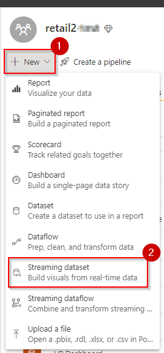

9. **Select API** from the list of options and **click** next. 

10. **Enable** the ‘Historic data analysis’ 

	

	
	
11. **Enter** ‘Occupancy’ as dataset name and **enter** the column names in “values from stream” option from list below  and **click** on create button: 

	| Field Name                        	| Type     |
	|---------------------------------------|----------|
	| BatteryLevel 				| number |
	| visitors_cnt				| number |
	| visitors_in				| number |
	| visitors_out				| number |
	| avg_aisle_time_spent			| number |
	| avg_dwell_time			| number |
	| DeviceID				| text |
	| StoreId				| text |
	| City					| text |
	| EnqueuedTimeUTC			| datetime |
	| RecordedonUTC				| datetime |

	
	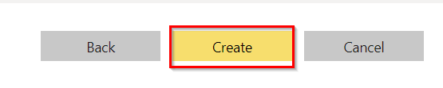

12. **Copy** the push url of dataset ‘Occupancy’ and place it in a notepad for later use.

	
	
13. Similarly add two more datasets namely "Thermostat-Realtime" and "Video-Analytics-Realtime" and copy the push url for them respectively and place it in a notepad.

	| Field Name                        	| Type     |
	|---------------------------------------|----------|
	| EnqueuedTimeUTC 			| datetime |
	| DeviceId				| text |
	| StoreId				| text |
	| BatteryLevel				| number |
	| Temp					| number |
	| City					| text |
	| Temp_UoM				| text |
	
	
	| Field Name                        	| Type     |
	|---------------------------------------|----------|
	| Appliances 				| number |
	| FathersdaySale			| number |
	| BacktoSchool				| number |
	| NewStoreOpening			| number |
	| FashionableYou			| number |
	| Recordedon				| datetime |
	
14. **Navigate** to [https://www.videoindexer.ai/](https://www.videoindexer.ai/).

15. **Click** on AAD Account.

	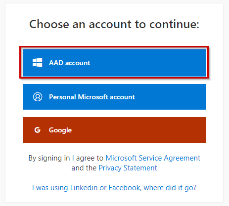

	> **Note:** You may be prompted to enter the azure credentials.

16. **Click** on Account settings.

17. **Copy** the Account ID in a notepad. This will be needed during the template deployment.

	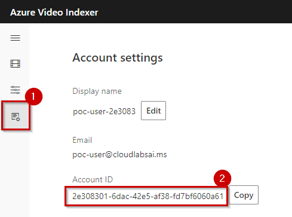

18. **Navigate** to [https://api-portal.videoindexer.ai/](https://api-portal.videoindexer.ai/).

19. **Click** sign in if not already signed in.

20. **Click** on profile.

21. **Copy** the primary key. This will be needed during template deployment.

	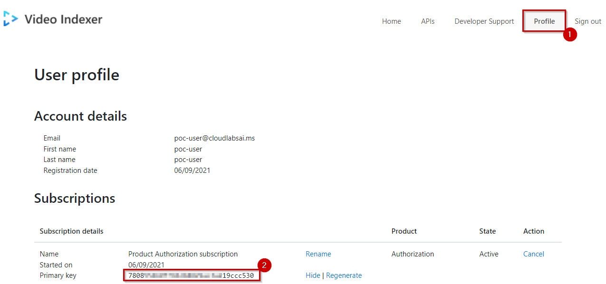
	

### Task 3: Deploy the ARM Template

1. **Open** this link in a new tab of the same browser that you are currently in: 
	
	<a href='https://portal.azure.com/#create/Microsoft.Template/uri/https%3A%2F%2Fraw.githubusercontent.com%2Fmicrosoft%2FAzure-Analytics-and-AI-Engagement%2Fretail2.0%2Fretail%2Fmain-template.json' target='_blank'></a>

2. On the Custom deployment form, **select** your desired Subscription.

3. **Select** the resource group name **DDiB-Retail-Lab** which you created in [Task 1](#task-1-create-a-resource-group-in-azure).

4. **Provide/Type** an environment code which is unique to your environment. This code is a suffix to your environment and should not have any special characters or uppercase letters and should not be more than 6 characters. 

5. **Provide** a strong SQL Administrator login password and set this aside for later use.

6. **Enter** the Power BI workspace ID created in [Task 2](#task-2-power-bi-workspace-creation).

7. **Enter** the power BI streaming dataset url for **Occupancy_data_Realtime_URL** you copied in step 12 of [Task 2](#task-2-power-bi-workspace-creation).

8. **Enter** the power BI streaming dataset url for **Thermostat_telemetry_Realtime_URL** you copied in step 13 of [Task 2](#task-2-power-bi-workspace-creation).

9. **Enter** the power BI streaming dataset url for **Livestreaming_video_analytics_Realtime_URL** you copied in step 13 of [Task 2](#task-2-power-bi-workspace-creation).

10. In the "Video_indexer_account_id" section **enter** the value of step #17 from [Task 2](#task-2-power-bi-workspace-creation).

11. In the "Video_indexer_api_key" section **enter** the value of step #21 from [Task 2](#task-2-power-bi-workspace-creation).

12. **Click** ‘Review + Create’ button.

	

13. **Click** the **Create** button once the template has been validated.

	
	
	> **NOTE:** The provisioning of your deployment resources will take approximately 10 minutes.
	
14. **Stay** on the same page and wait for the deployment to complete.
    
	
    
15. **Select** the **Go to resource group** button once your deployment is complete.

	

### Task 4: Run the Cloud Shell to provision the demo resources

**Open** the Azure Portal.

1. In the Resource group section, **open** the Azure Cloud Shell by selecting its icon from the top toolbar.

	

2. **Click** on 'Show advanced settings'.

	

	> **Note:** If you already have a storage mounted for Cloud Shell, you will not get this prompt. In that case, skip step 2 and 3.

3. **Select** your 'Resource Group' and **enter** the 'Storage account' and 'File share' name.

	

	> **Note:** If you are creating a new storage account, give it a unique name with no special characters or uppercase letters.

4. In the Azure Cloud Shell window, ensure the PowerShell environment is selected and **enter** the following command to clone the repository files.

```
git clone -b retail2.0 --depth 1 --single-branch https://github.com/microsoft/Azure-Analytics-and-AI-Engagement.git retail
```


	
> **Note:** If you get File already exist error, please execute the following command: rm retail -r -f to delete existing clone.

> **Note**: When executing scripts, it is important to let them run to completion. Some tasks may take longer than others to run. When a script completes execution, you will be returned to a command prompt. 

5. **Execute** the retailSetup.ps1 script by executing the following command:

```
cd ./retail/retail
```

6. Then **run** the PowerShell: 
```
./retailSetup.ps1
```
    


7. You will see the below screen, **enter** 'Y' and **press** the enter key.

	
      
8. From the Azure Cloud Shell, **copy** the authentication code

9. Click on the link [https://microsoft.com/devicelogin](https://microsoft.com/devicelogin) and a new browser window will launch.

	
     
10. **Paste** the authentication code and **click** on Next.

	

11. **Select** the same user that you used for signing in to the Azure Portal in [Task 1](#task-1-create-a-resource-group-in-azure).

	
	
12. In the below screen **click** on continue.

	

13. **Close** the browser tab once you see the message window at right and **go back** to your Azure Cloud Shell execution window.

	
	
14. You will see the below screen and perform step #9 to step #13 again.

	

15. Now you will be prompted to select subscription if you have multiple subscription assigned to the user you used for device login.

    
	
	> **Notes:**
	> - The user with single subscription won't be prompted to select subscription.
	> - The subscription highlighted in yellow will be selected by default if you do not enter any disired subscription. Please select the subscription carefully, as it may break the execution further.
	> - While you are waiting for processes to get completed in the Azure Cloud Shell window, you'll be asked to enter the code three times. This is necessary for performing installation of various Azure Services and preloading content in the Azure Synapse Analytics SQL Pool tables.

16. You will be asked to confirm for the subscription, **enter** 'Y' and **press** the enter key.

	

17. You will now be prompted to **enter** the resource group name in the Azure Cloud Shell. Type the same resource group name that you created in [Task 1](#task-1-create-a-resource-group-in-azure). – 'DDiB-Retail-Lab'.

	
	
18. Now you will be prompted if you have an unlimited video indexer account, **press** enter key.

	

19. After the complete script has been executed, you get to see the message "--Execution Complete--", now **go to** the Azure Portal and **search** for app services, **click** on each one of the simulator apps.

	
	
20. **Click** on the browse button for **each one** of the app services once, a new window will appear, **close** the window.

	
	
21. **Goto** the resource group, **search** for the "aml" and **click** on the aml resource.

	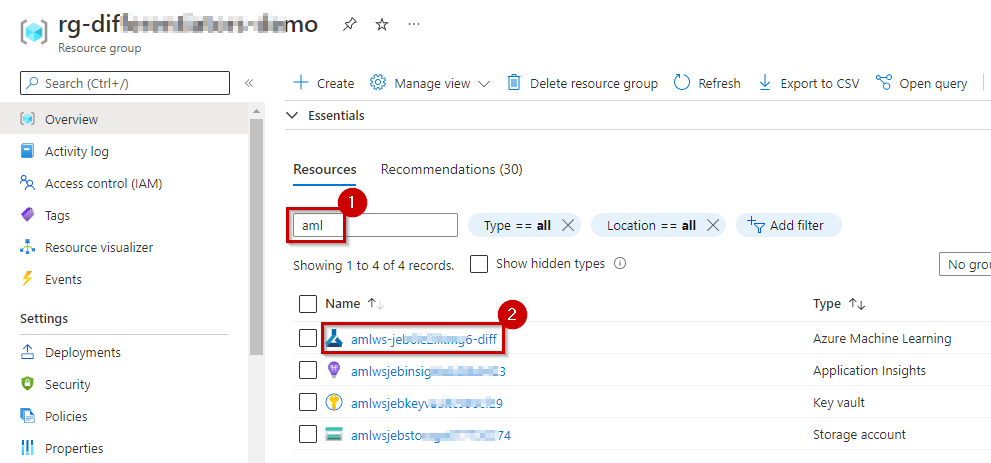

22. **Click** on "Launch Studio".
	
	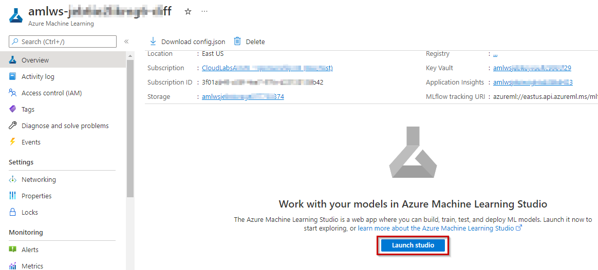
	
23. **Goto** notebooks section, **select** "13 Building a Video Recommendation Model.ipynb" and **click** on the "+" sign as shown in the image to create a compute.

	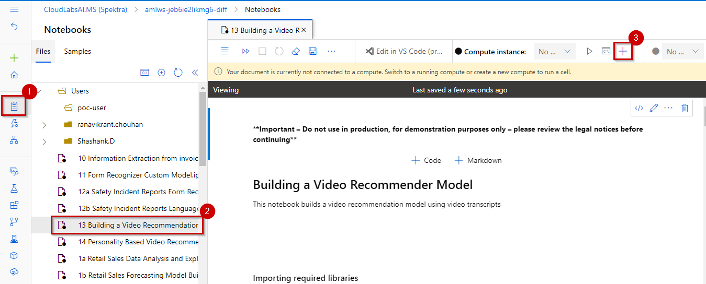
	
24. **Enter** desired compute name, **select** Virtual Machine Type, **select** Virtual machine size, and then **click** on create.

	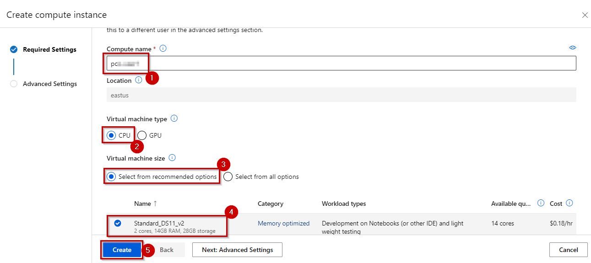
	
25. Verify the compute and kernel show green and are ready, if not wait for them to turn green, then **click** on the ">>" button at top left in the workspace as shown in the image, let the notebook run successfully and then **open** the "14 Personality Based Video Recommender.ipynb" notebook and **run** it as well.

	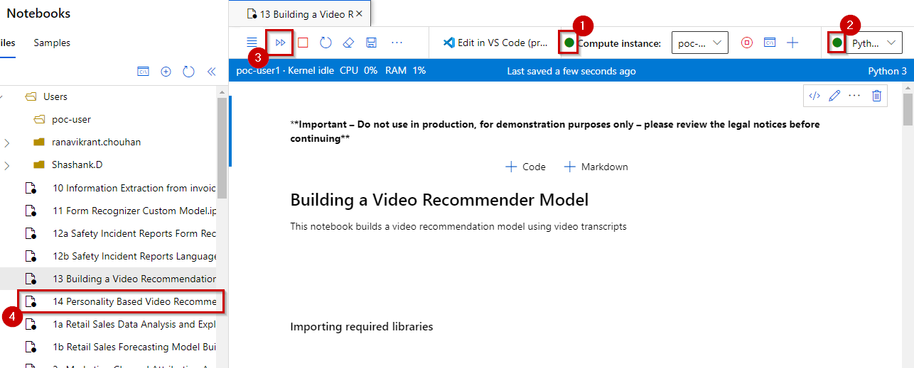
      
### Task 5: (Under Maintenance. Move to Task 6)QnA maker and LogicApp Configuration

	> **Note:**
	> - QnAmaker service is being upgraded to Question Answering. Please Move to the next task.

1. **Open** the Azure Portal.

2. **Click** on the Azure Cloud Shell icon from the top toolbar. 

	

	**Execute** qna_logicapp_subscript.ps1 script by executing the following command: 

3. **Run** Command: 
	```
	cd "retail/retail/subscripts"
	```

4. Then **run** the PowerShell script: 
	```
	./qna_logicapp_subscript.ps1 
	```
	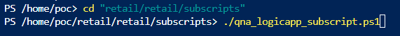
	
5. You will have to complete the 'az login' and 'device login' authentication by following the steps 7 to 18 of [Task 4](#task-4-run-the-cloud-shell-to-provision-the-demo-resources) and may be prompted to select your subscription if you have multiple subscriptions.
	
6. After the subscript is completed, **open** a new tab on your browser and **launch** [qnamaker.ai](https://www.qnamaker.ai/) as below

	
	
7. **Sign In** using the same user credentials which you have used for previous tasks, **go to** "My knowledge bases" section.

	

8. There will be 3 dropdowns namely "Select tenant", "Select subscription" and "Select service". From the dropdown **select** the appropriate values and in the the service dropdown make sure to select the value starting with "qnamaker-"

	
	
9. **Click** on the knowledge base name.

	
	
10. You will be directed to another screen, **switch** to Publish section and **click** on Publish button.

	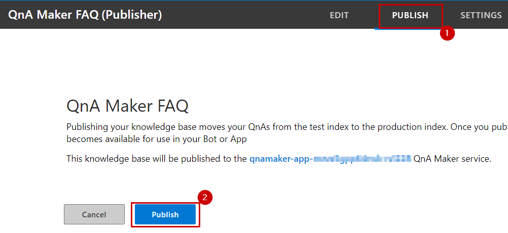
	
11. The output screen will have some values, **copy** the value of post and concatenate it after the value of host in a notepad.

	
	
12. The concatinated value should appear like below.

	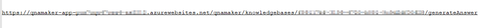
	
13. **Copy** and **Paste** the value of Authorisation as well in a notepad.

	
	
14. **Go** to the the resource group, search for logic app in the search bar and **click** on the logic app which starts with "logicapp-retail-...".

	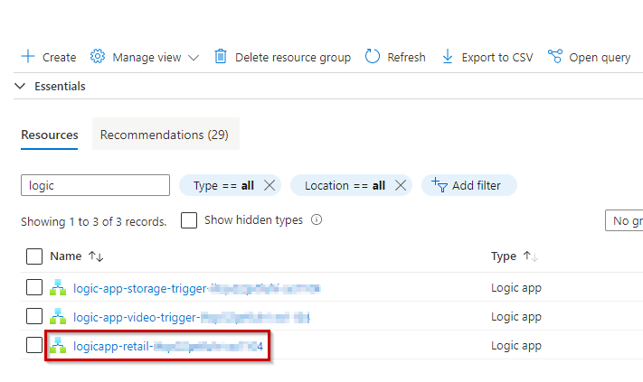
	
15. Under the "Development Tools" section **select** "Logic app designer".

	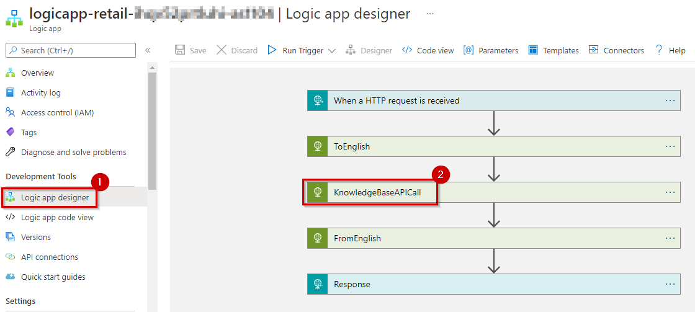
	
16. **Expand** the "KnowledgeBaseAPICall" by clicking on it, **paste** the values for "URI" and "Authentication" from the notepad from step 9 and 10 respectively and finally **click** on "Save".

	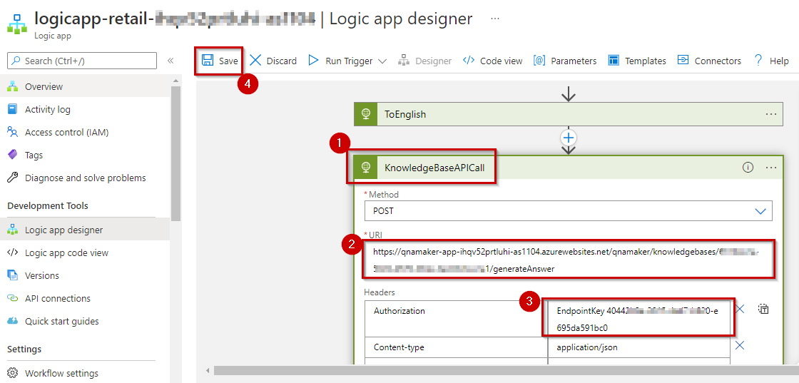

      
### Task 6: Lake Database creation and Pipeline execution

1. **Click** on the synapse resource and **click** on the open synapse studio in the next window.


2. **Click** on the data icon on sidebar, then **click** on the "+" sign and then **click** on the Lake database.


3. **Enter** the name of the Lake database as **"WWImportersContosoRetailLakeDB"** and **click** on Publish all.


4. A new window appears, here **click** on Publish.


5. **Click** on the integrate icon on sidebar, **expand** the Pipelines, next **expand** the folder containing the desired pipelines, **click** on the pipeline.


6. **Click** on Add trigger and then **click** on Trigger now.


7. Perform the above action with the remaining 2  pipelines in the folder, the desired tables will be created under the newly created Lake database.

### Task 7: Data Explorer Setup

1. In the Azure Portal **search** for data explorer and **click** on the data explorer resource.

	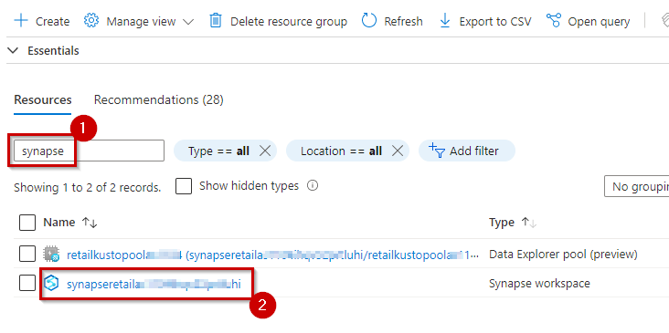
	
2. In the data explorer resource **copy** the URI.

	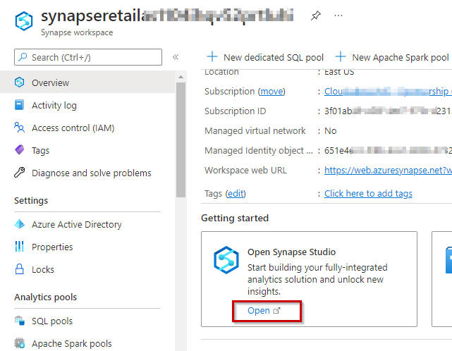
	
3. **Open** a new tab in the browser and **paste** the URI in the search bar, the data explorer studio opens.
	
	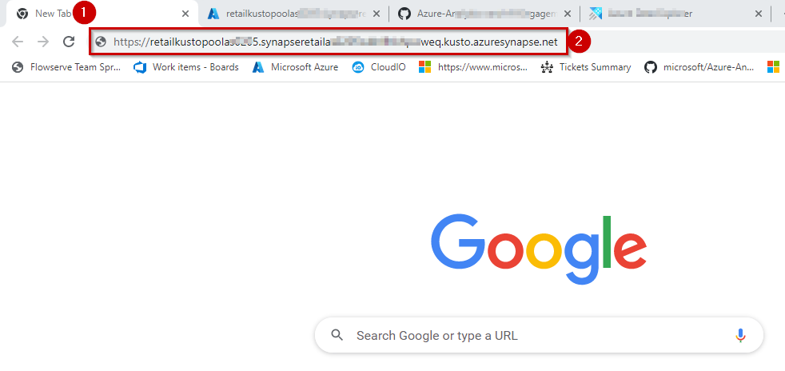
	
4. In the Data Explorer Studio under Data section **click** on Ingest new data.

	
	
5. In the Ingest new data, under destination tab, select appropriate values in the respective fields, in Cluster **select** the kusto pool name, in the Database select "RetailDB" database, in the Table field **enter** the table name i.e. Occupancy and then **click** on Next.

	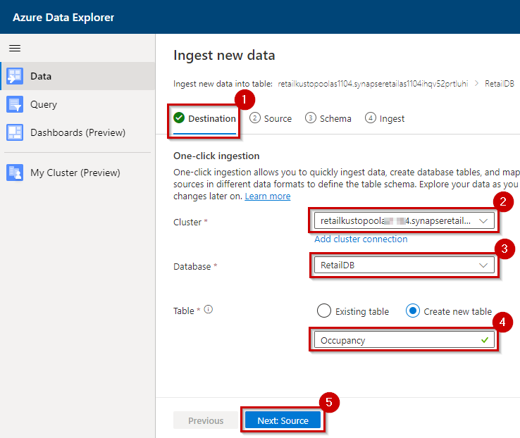
	
6. Under the source tab, **select** Source type as "Event Hub", in subscription **select** your subscription, in Event Hub Namespace **select** you eventhub namespace i.e. "adx-thermostat-occupancy-...", in Event Hub **enter** "occupancy", in Data connection name **select** "RetailDB-occupancy", in Consumer group **select** $Default, in compression **select** None and then **click** on Next.

	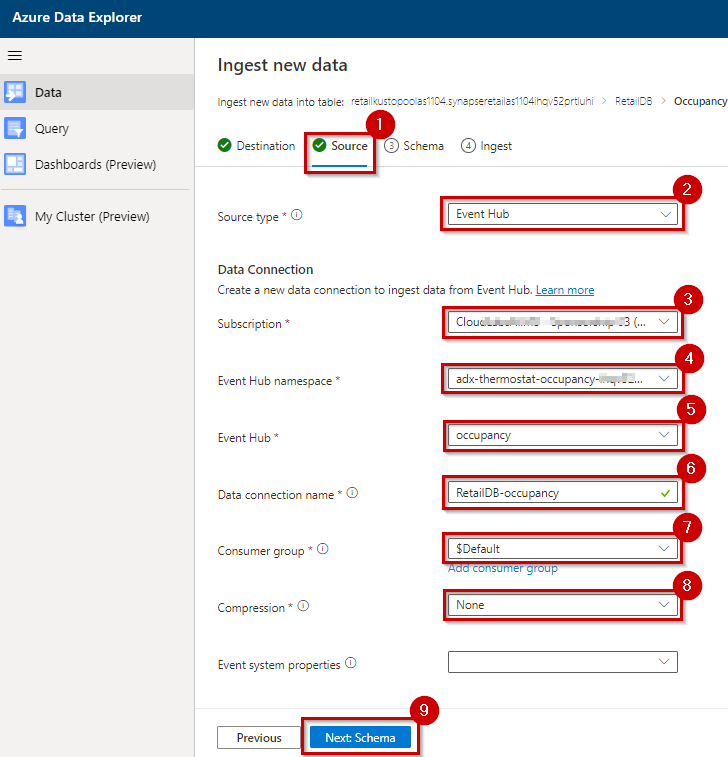
	
7. Wait for some time for data preview to load, **select** MULTIJSON in the "Data format" section and then **click** on Next: Start Ingestion.

	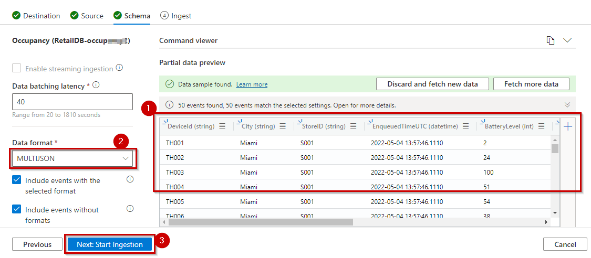
	
8. Once the Continuous ingestion from Event Hub has been established, **click** on Close.

	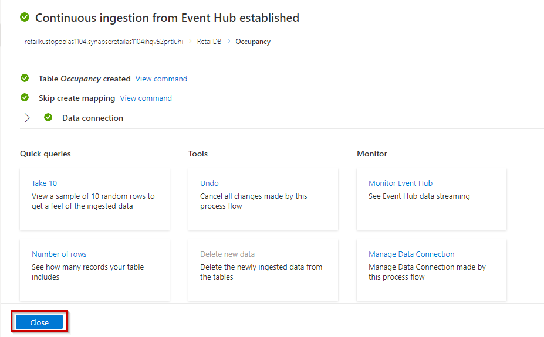
	
9. Repeat the above step from 4 to 8, replacing few values, i.e. in step 5, this time **enter** the table name as "Thermostat", in step 6 **enter** Event Hub as "thermostat" and Data connection name as "RetailDB-thermostat".

10. For non-historical data, open Data Explorer Studio and under data section **click** on Ingest new data.

	
	
11. In the Ingest new data, under destination tab, select appropriate values in the respective fields, in Cluster **select** your kusto pool name, in the Database select "RetailDB" database, in the Table field **enter** the table name i.e. OccupancyHistoricalData and then **click** on Next.

	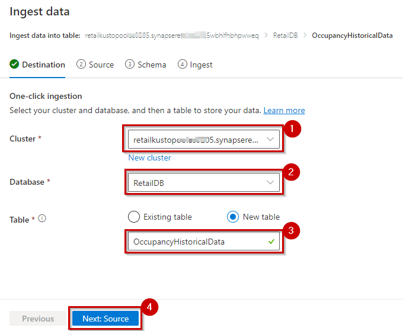
	
12. Under the source tab, **select** Source type as "From blob container", in Ingestion type **select** One-time + Continous, in "Select source" **check** the Select container radio button, in Storage subscription **select** the appropriate subscription, in Storage account **select** the current storage account, for Container **select** "adx-historical", **expand** File Filters, under Folder path enter "occupancy" and then **click** on Next.

	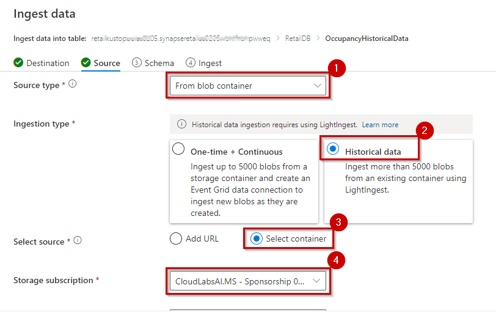
	
	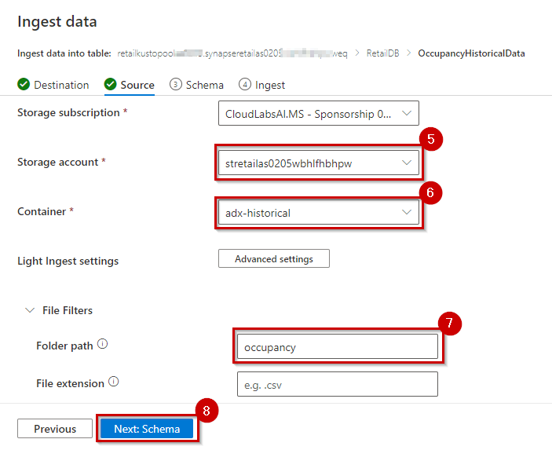

13. Wait for some time for Partial data preview to load, and then **click** on Next: Start Ingestion.

	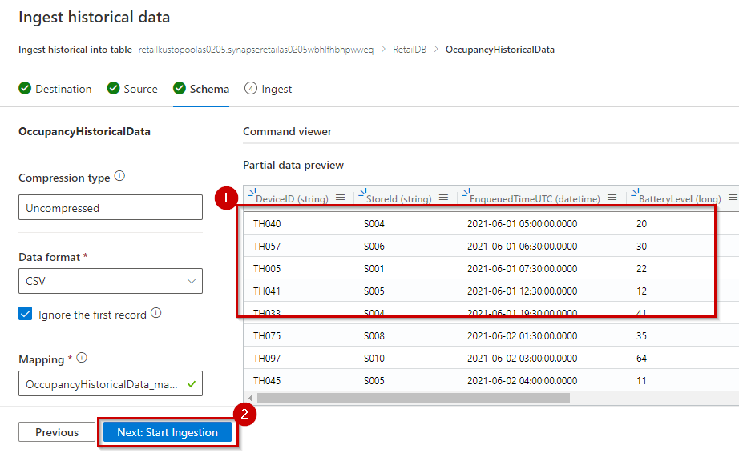

14. After successful Ingestion you will see the screen below.

	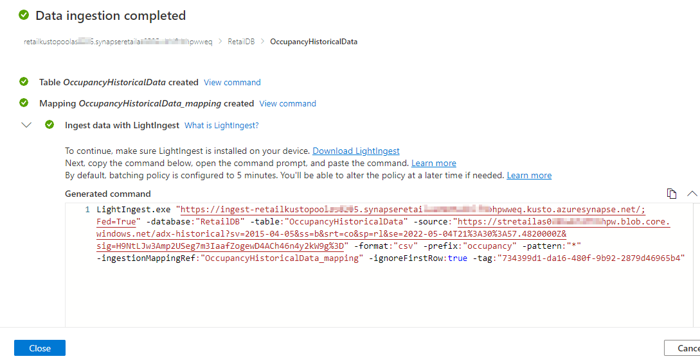

15. Repeat step #11 and this time **enter** Table field ThermostatHistoricalData, and step #12 this time **expand** File Filters, under Folder path enter "thermostat".

16. Repeat step #11 and this time **enter** Table field OccupancyHistoricalDataUpdated, and step #12 this time **expand** File Filters, under Folder path enter "adx-data".
	
### Task 8: Azure Purview Setup

> **Note:** Firstly you should assign Reader permission to the Azure Purview account starting with name "purviewretail..." for Cosmos Account, Synapse Workspace and Storage Account starting with name "stretail...". Once the permission has been granted, proceed with the following steps.

1. From Azure Portal, **search** for azure purview resource in the resource group and **click** on the resource.

	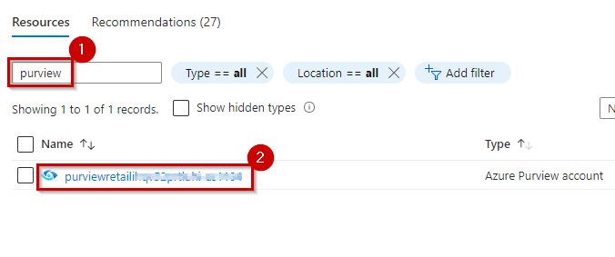
	
2. The Azure Purview resource window will open, **click** on Open Azure Purview Studio and the Azure Purview Studio will open in a new window.

	
	
3. **Click** on Manage Glossary in the Azure Purview Studio, the Glossary Terms window will open.

	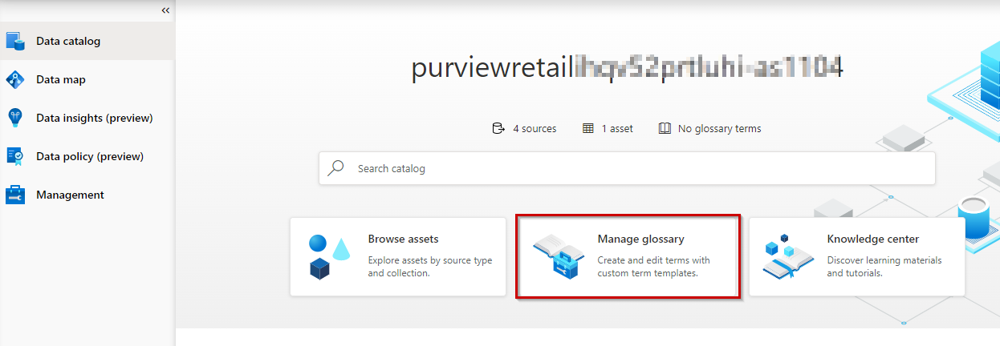
	
4. **Click** on Import Terms in the Glossary Terms window.

	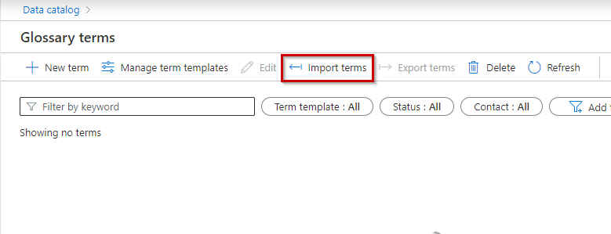

5. A pop-up appears, **click** on Continue.

	
	
6. **Click** on the hyperlink, [Glossary Terms](https://github.com/microsoft/Azure-Analytics-and-AI-Engagement/blob/retail2.0/retail/artifacts/templates/glossary-terms.csv) , copy the raw contents of the file into an excel sheet, save it with the name 'glossary-terms.csv', then go back to the purview studio, **click** browse and **select** appropriate file and **click** open.

	
	
7. **Click** on OK.
	
	
	
8. In the Azure Purview Studio **click** on Data map **goto** source and **select** Map view. Now expand the parent collection by **clicking** on the "+" sign.

	

9. All the sub collections will be visible, **click** on the "+" sign under AzureDataLakeStorage, AzureSynapse, CosmosDB-Retail and PowerBI-Retail.

	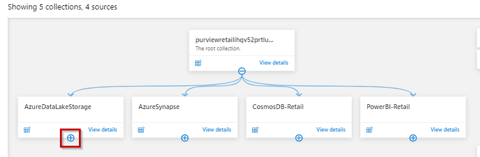

10. Under the datasource AzureDataLakeStorage **click** on View Details.

	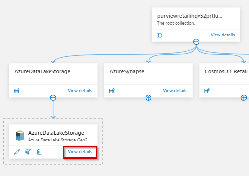

11. **Click** on New Scan, a window appears, here verify the default values in the different fields, **select** your collection name and finally **click** on Continue.

	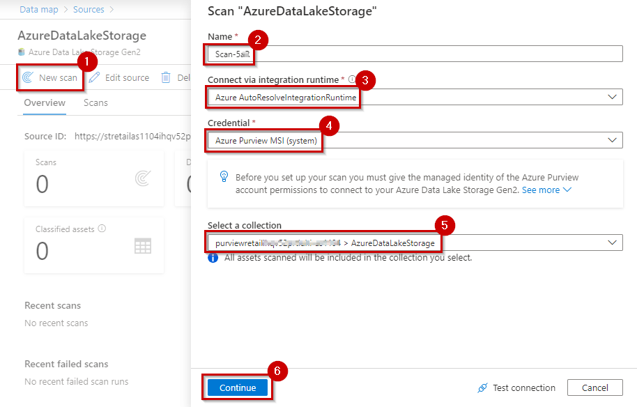
	
12. In the new window verify that the check box is **checked** for all the required containers, and then **click** on continue.

	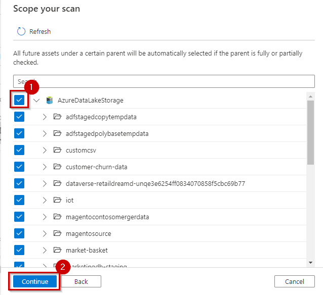
	
13. Again **click** on continue.

	
	
14. In the new window **check** the Once radio button and **click** on continue.

	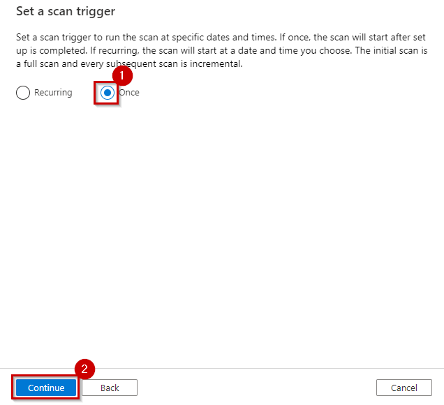
	
15. In the new window **click** on Save and run.

	
	
16. **Repeat** step #10 for AzureSynapseAnalytics.

17. **Open** synaspse studio, **select** manage tab, under External Connections **select** Azure Purview, **click** on Connect to a Purview account, under Purview account name **select** the current Purview account, and then **click** on Apply.

	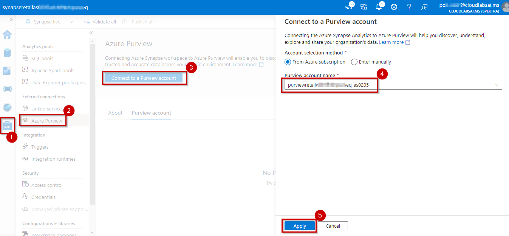
	
18. Now, under Security **select** Access Control, **click** on Add, under Role **select** Synapse Administrator, under Select user **select** current Purview account and then **click** on Apply.

	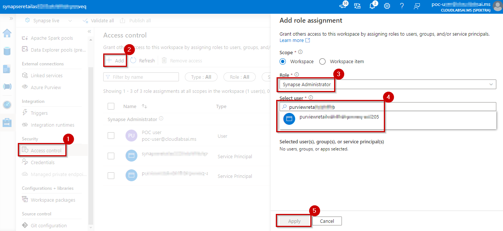
	
19. Go back to Purview studio, **click** on New Scan, a window appears, here under SQL Database **select** the name of SQL database and then **click** on Continue.

	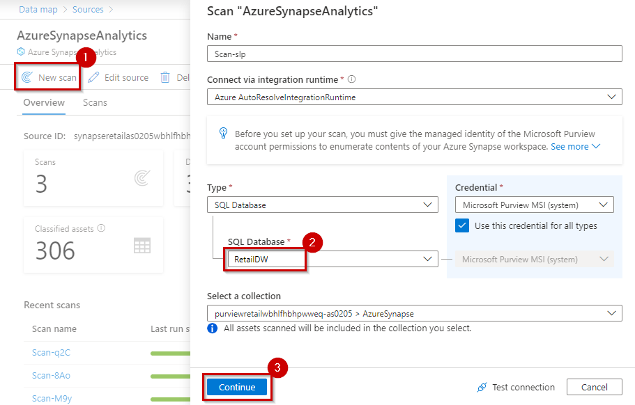

20. In the new window **click** on continue.

	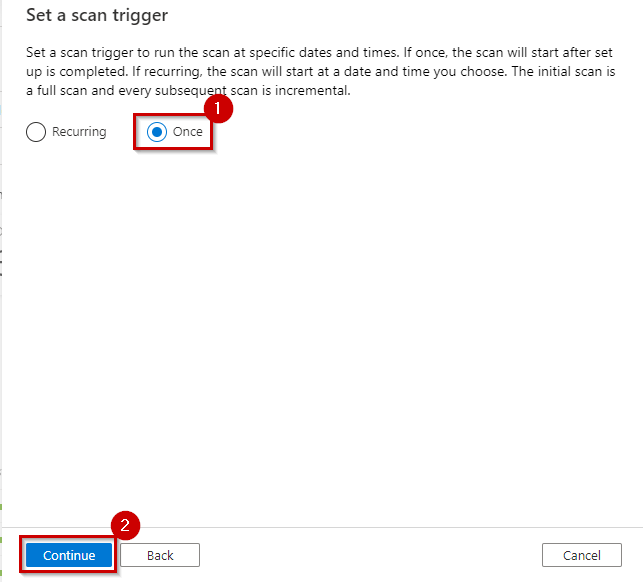
	
21. In the next window, **click** on Save and Run.

	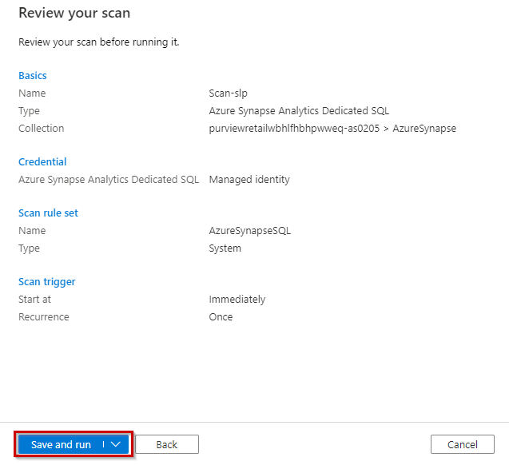

22. **Repeat** step #10 for CosmosDB.

23. **Click** on New Scan, in the pop-up window **expand** the Credential drop-down and **click** on New.

	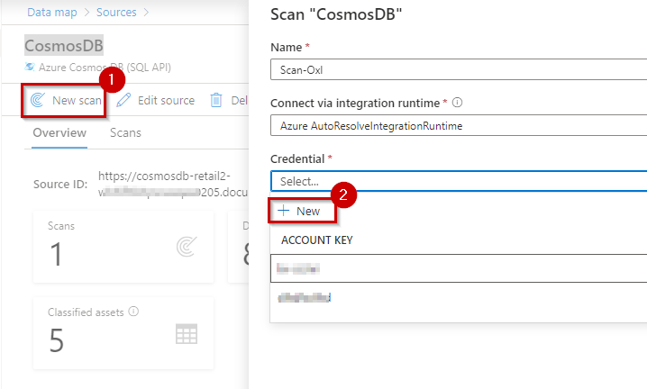
	
24. Under Name **enter** any desired name then **expand** Key Vault connection and **click** on New.

	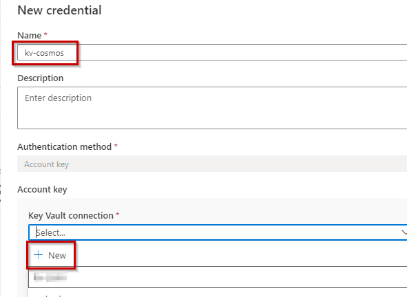
	
25. In the new window **enter** any desired name, then **expand** Key Vault name and **select** the current key vault name and then **click** on create.

	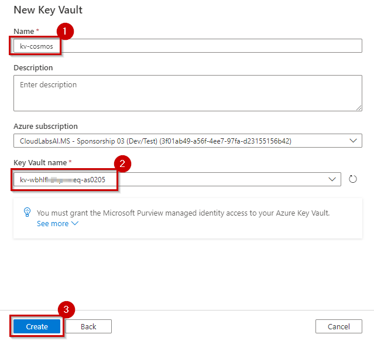
	
26. A pop-up window appears, here **click** on Confirm.

	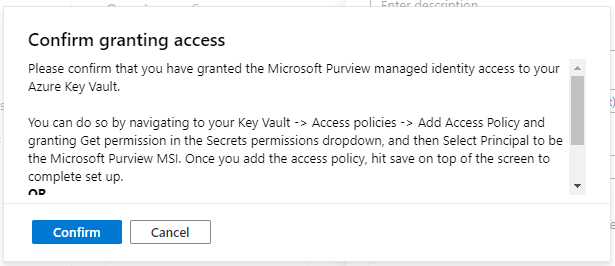
	
27. In the new window **enter** the desired name, **expand** Key Vault connection and **select** the name entered in step #22, **enter** the secret name as Cosmos-cred and then **click** on Create.

	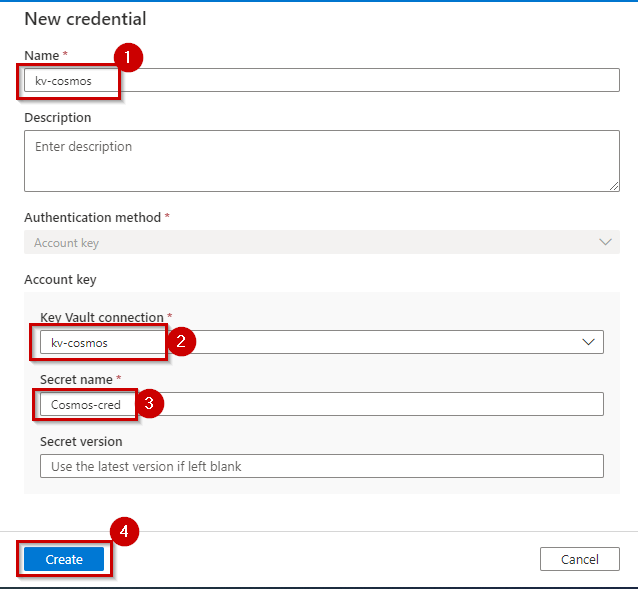
	
28. In the new window under Credential from the drop-down **select** the appropriate credential, under the Select a collection **select** the Purview account name and then **click** on Continue.
	
	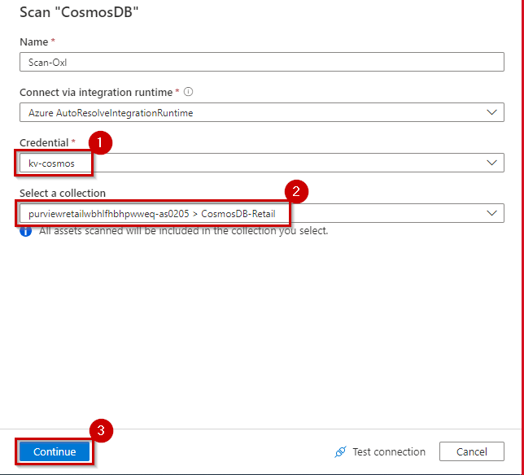
	
29. In the new window **click** on Continue.

	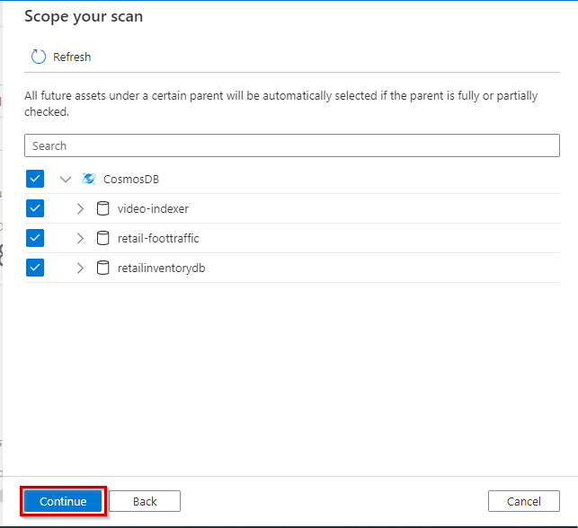

30. In the new window **click** on Continue.

	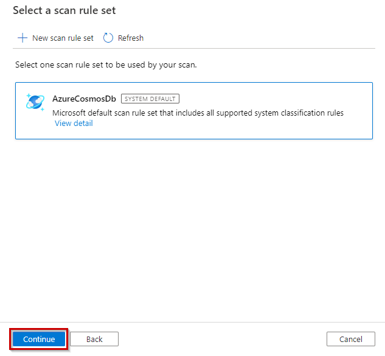
	
31. In the new window, **check** the Once radio button and **click** on Continue.
	
	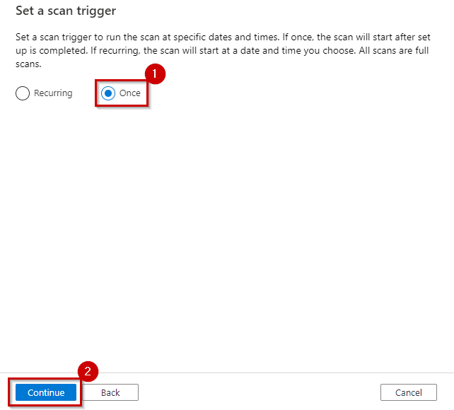
	
32. In the next window **click** on Save and run.

	
	
33. **Repeat** the step #10 for PowerBI.

> **Note:** Add the Purview's MSI name as a contributor in Power BI workspace. You can also create a security group with the said MSI in it and assign admin permissions to it. You would also be required to enable "enhance admin API responses with detailed metadata" option in your Power BI admin settings.
	
### Task 9: Power BI reports and dashboard creation

### Steps to validate the credentials for reports

1. **Open** Power BI and **Select** the Workspace, which is created in [Task 2](#task-2-power-bi-workspace-creation).
	
	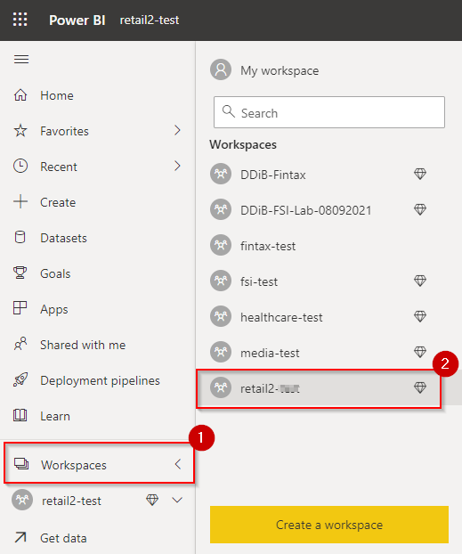
	
Once [Task 4](#task-4-run-the-cloud-shell-to-provision-the-demo-resources) has been completed successfully and the template has been deployed, you will be able to see a set of reports in the Reports tab of Power BI, and real-time datasets in the Dataset tab. 

The image on the below shows the Reports tab in Power BI.  We can create a Power BI dashboard by pinning visuals from these reports.

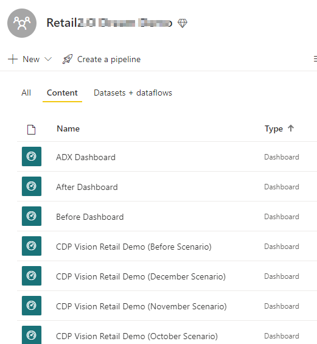
	
> **Note:** If you do not see this list in your workspace after script execution, it may indicate that something went wrong during execution. You may use the subscript to patch it or manually upload the reports from this location and changing their parameters appropriately before authentication.

To give permissions for the Power BI reports to access the data sources:

2. **Click** the ellipses or settings icon on top right-side corner.

3. **Click** the settings dropdown.

4. **Click** on settings.

	

5. **Click** on ‘Datasets’ tab.
	
	
	
6. **Click** on the CCO Report.

7. **Expand** Data source credentials.

8. **Click** Edit credentials and a dialogue box will pop up.

	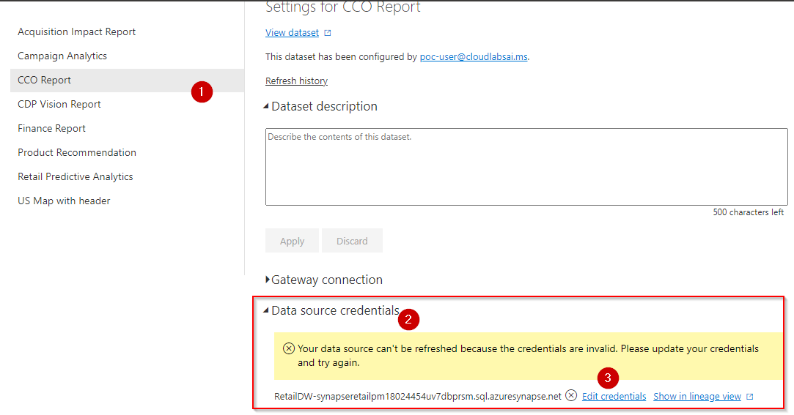

> **Note:** Verify the server name has been updated to your current sql pool name for all the datasets. If not, update the same under parameters section and click apply.

9. **Enter** Username as ‘labsqladmin’.

10. **Enter** the same SQL Administrator login password that was created for [Task 3](#task-3-deploy-the-arm-template) Step #5.

11. **Click** on Sign in.

	
	
12. **Click** on the Acquisition Impact Report.

13. **Expand** Data source credentials.

14. **Click** Edit credentials in front of Synapse and a dialogue box will pop up.

	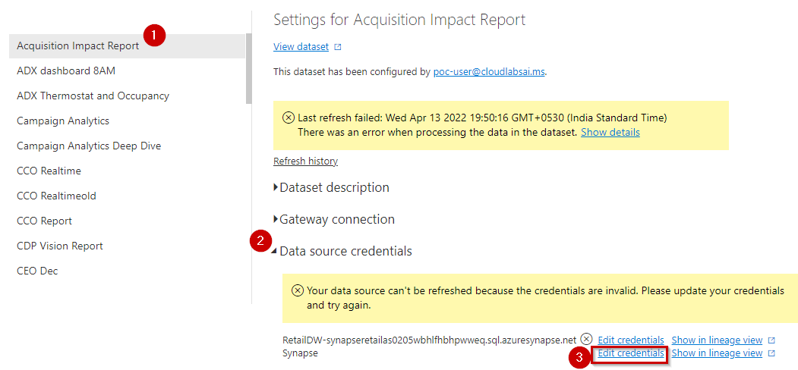

15. Keeping the default values as it is, **click** on Sign in, a new window will pop-up.

	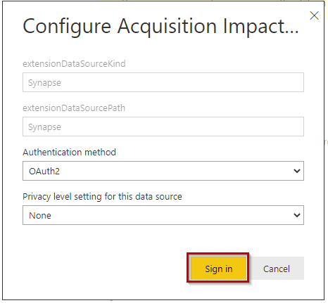

16. In the new window, **select** the appropriate user.

	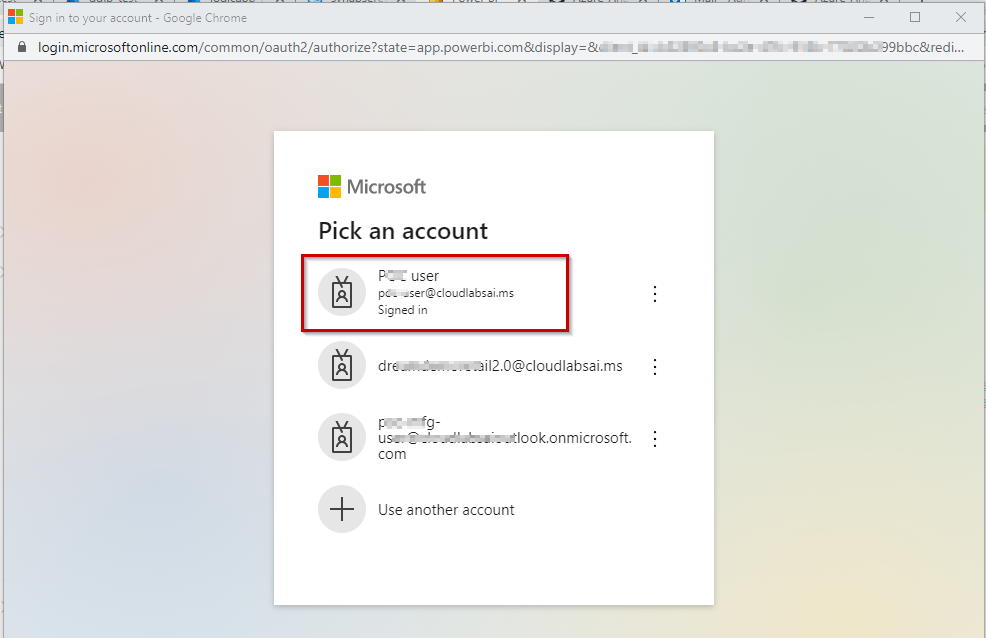
		
17. **Click** on the ADX Thermostat and Occupancy.

18. **Expand** Data source credentials.

19. **Click** Edit credentials in front of AzureDataExplorer and a dialogue box will pop up.

	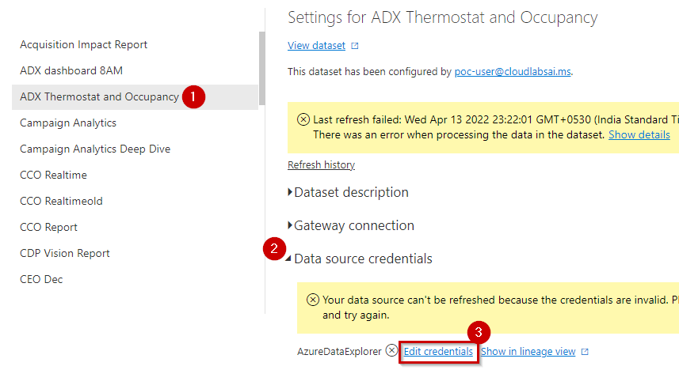

20. Keeping the "Authentication method" as "OAuth2" and **click** on Sign in.

	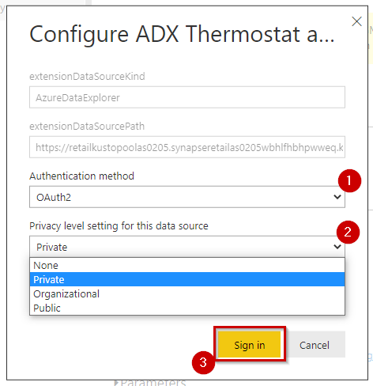

21. In the new window, **select** the appropriate user.

	

22. **Click** on the Retail HTAP.

23. **Expand** Data source credentials.

24. **Click** Edit credentials in front of DocumentDB and a dialogue box will pop up.

	

25. Go to the Azure Portal and under resources search for "cosmos" and **click** on the cosmos resource, the resource window opens.

	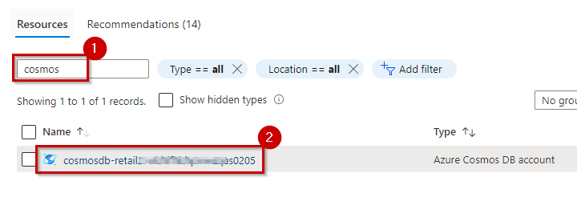

26. Under the Settings section **select** keys and **copy** the primary key of the cosmos resource.

	
	
27. In the powerbi tab in step #28, keeping the "Authentication method" as "Key", **paste** the "Account key" from step #30 and **click** on Sign in.

	
	
28. **Click** on the Global Occupational Safety Report.

29. **Expand** Data source credentials.

30. **Click** Edit credentials in front of AzureTable and a dialogue box will pop up.

	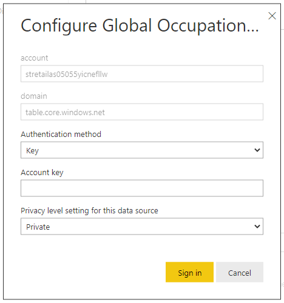
	
31. Go to Azure portal and **search** for 'stretail' and **click** on the storage account.

	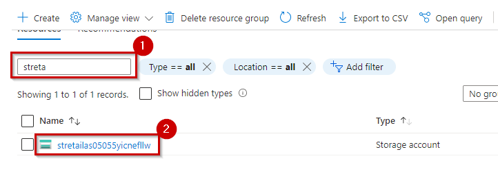
	
32. In the storage account resource, under the Security + networking section **click** on Access keys, **click** on Show keys and then **copy** the key.

	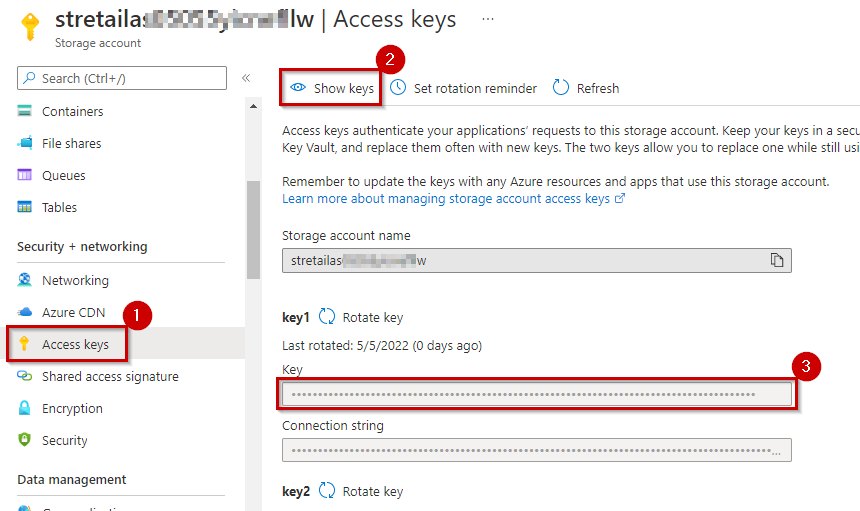
	
33. Paste the key in the pop-up in step #34, under Account key and **click** on Sign in.

	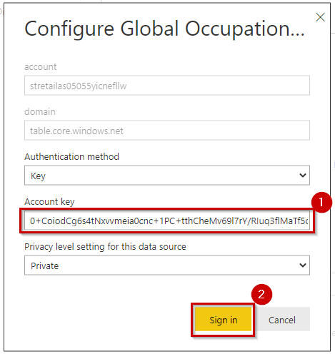
	
### Steps to create realtime reports

1.	**Click** on the three dots in front of the “occupancy” and “thermostat” datasets one at a time and **click** on Create report, a new report will be created.

	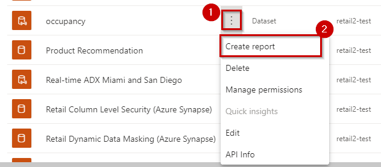

**Occupancy Realtime Visualizations:**

**Average Visitors In**

2. **Select** the stacked column chart visual from “Visualizations”.

	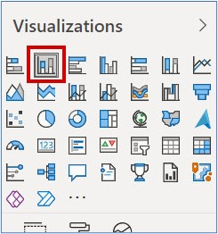

3. **Select** the field from the visual from the field panel.

4. **Drag /Select** the column name into the fields which is below the visualization panel.
	
5. For showing the average values **click** on the dropdown arrow in the value section field and select the Average.

	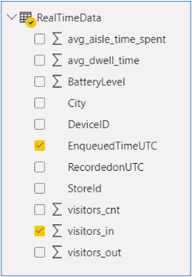
	
	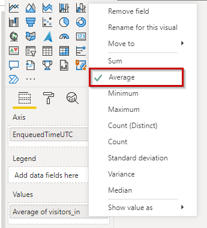

	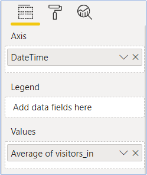
	
	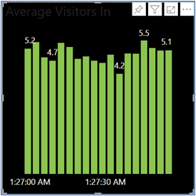

**Average Visitors Out**

6. **Select** the Stacked area line chart for the next visual.

	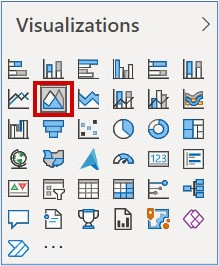

7. **Select** the required field column for the visual.

8. **Drag /Select** the column name into the fields which is below the visualization panel.

	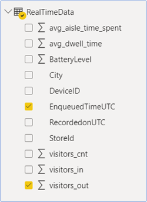
	
	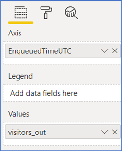
	
	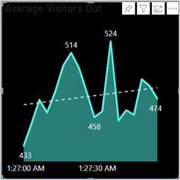
	
**Average Number of Visitors (KPI)**

9. **Select** the Area chart to show the average number of visitors.

	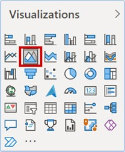

10. **Select** the field from the visual from the field panel.

11. **Drag /Select** the column name into the fields which is below the visualization panel.

12. For showing the average values **click** on the dropdown arrow in the value section field and **select** the Average.

	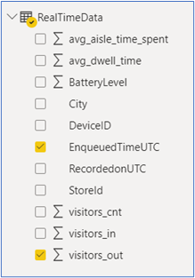
	
	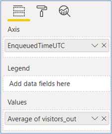
	
	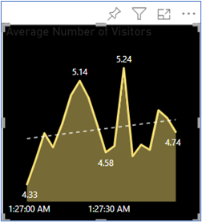

**Average Number of Visitors (Visual)**
	
13. **Select** the Clustered column chart for showing the Average number of visitors visually.

	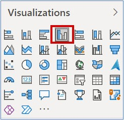

14. **Select** the field from the visual from the field panel.

15. **Drag /Select** the column name into the fields which is below the visualization panel.

16. For showing the average values **click** on the dropdown arrow in the value section field and **select** the Average.

	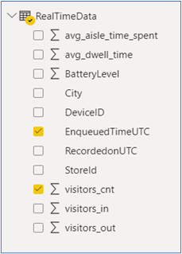
	
	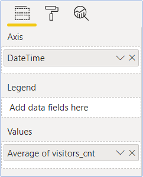
	
	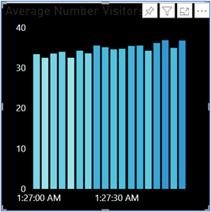
	
**Average Checkout Time (Visual)**

17. **Select** the Area chart to show the Average Checkout Time.

	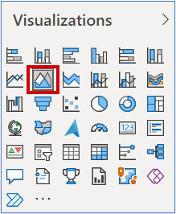

18. **Select** the field from the visual from the field panel.

19. **Drag /Select** the column name into the fields which is below the visualization panel.

20. For showing the average values **click** on the dropdown arrow in the value section field and **select** the Average.

	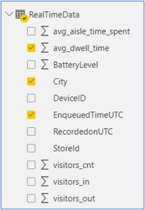
	
	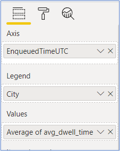
	
	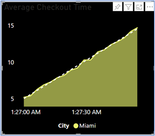

**Average Aisle Dwell Time**
	
21. **Select** the Line chart to show the Average Checkout Time.

	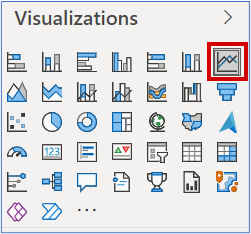
	
22. **Select** the field from the visual from the field panel.

23. **Drag /Select** the column name into the fields which is below the visualization panel.

24. For showing the average values **click** on the dropdown arrow in the value section field and select the Average.

	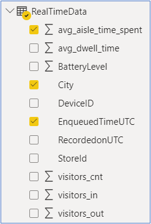
	
	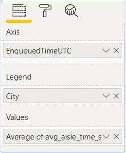
	
	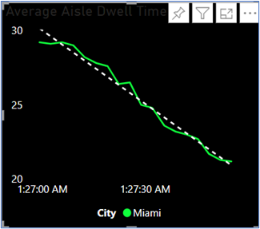
	
**Average Checkout Time**

25. **Select** the KPI Visual to show the Average Checkout Time.

	
	
26.	**Select** the field from the visual from the field panel.

27.	**Drag /Select** the column name into the fields which is below the visualization panel.

28.	For showing the average values **click** on the dropdown arrow in the value section field and **select** the Average.

	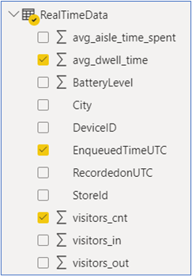
	
	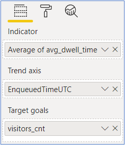
	
	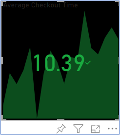
	
**Average Aisle Dwell Time (KPI)**

29. **Select** the KPI Visual to show the Average Aisle Dwell Time.

	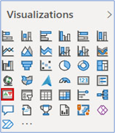
	
30. **Select** the field from the visual from the field panel.

31. **Drag /Select** the column name into the fields which is below the visualization panel.

32. For showing the average values **click** on the dropdown arrow in the value section field and **select** the Average.

	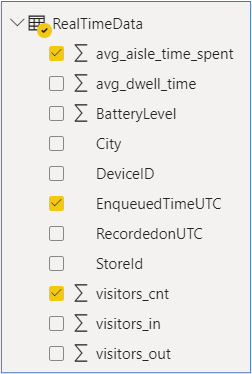
	
	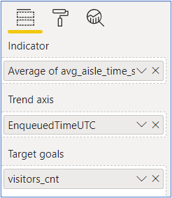
	
	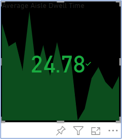
	
33. After putting visuals **click** on the Save Button.

34. Give the name and **save** it in the same workspace.

	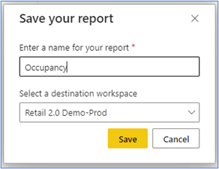
	
**Thermostat Realtime Visualizations:**
	
**Average Temperature (F)**

35. **Select** the Line Chart Visual to show the Average Temperature (F).

	

36. **Select** the field from the visual from the field panel.

37. **Drag /Select** the column name into the fields which is below the visualization panel.

38. For showing the average values **click** on the dropdown arrow in the value section field and **select** the Average.

	
	
	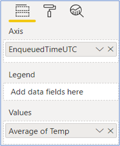
	
	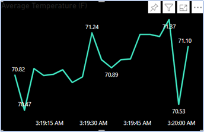
	
**Temperature beyond a comfortable level**
	
39. **Select** the Area chart Visual to show the Temperature beyond a comfortable level.

	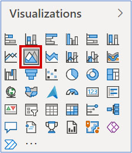
	
40. **Select** the field from the visual from the field panel.

41. **Drag /Select** the column name into the fields which is below the visualization panel.

42. For showing the average values **click** on the dropdown arrow in the value section field and **select** the Average.

	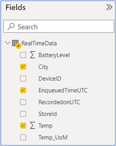
	
	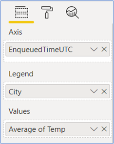
	
	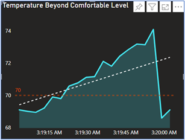

43. After putting visuals, **click** on the Save Button.

44. Give the name and **save** it in the same workspace.

	
		
### Follow these steps to create the Power BI dashboard

1. **Select** the workspace created in [Task 2](#task-2-power-bi-workspace-creation).

	
	
2. **Click** on ‘+ New’ button on the top-right navigation bar.

3. **Click** the ‘Dashboard’ option from the drop-down menu.

      

4. **Name** the dashboard 'ADX Dashboard' and **click** 'create'.

	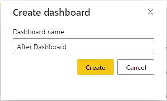

5. This new dashboard will appear in the 'Dashboard' section of the Power BI workspace.

**Follow the below steps to change the dashboard theme:**

6. **Open** the URL in a new browser tab to get JSON code for a custom theme:
[https://raw.githubusercontent.com/microsoft/Azure-Analytics-and-AI-Engagement/retail/retail/CustomTheme.json](https://github.com/microsoft/Azure-Analytics-and-AI-Engagement/blob/retail2.0/retail/CustomTheme.json)

7. **Right click** anywhere in browser and **click** 'Save as...'.

8. **Save** the file to your desired location on your computer, leaving the name unchanged.

	

9. **Go back** to the Power BI dashboard you just created.

10. **Click** on the “Edit” at the top right-side corner.

11. **Click** on “Dashboard theme”.

	

12. **Click** ‘Upload the JSON theme’.

13. **Navigate** to the location where you saved the JSON theme file in the steps above and **select** open.

14. **Click** Save.

	

**Follow these steps to pin the report to the Power BI dashboard:**

15. **Search** the report 'Occupancy' and then **click** on the report to open it.

	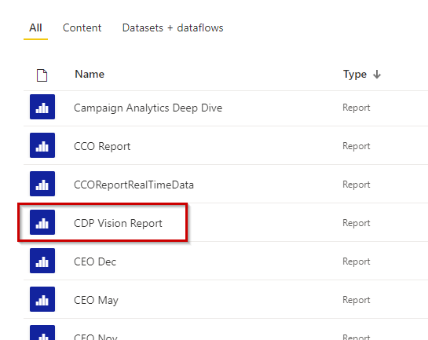

16. Inside the report 'Occupancy' **click** on 'Edit' at the top of the right corner.

	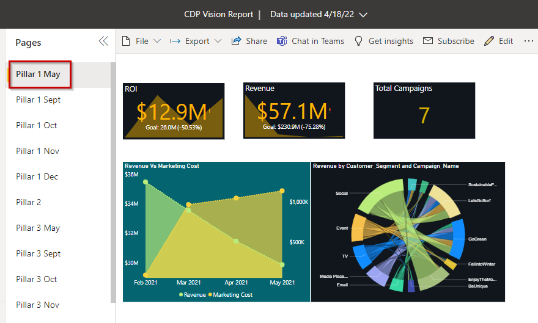

17. **Click** over the tile and **click** on the icon to 'Pin to dashboard'.

		

18. 'Pin to dashboard' window will appear.

19. **Select** the 'Existing Dashboard' radio button.

20. **Select** the existing dashboard 'ADX Dashboard' and **click** on the 'Pin' button.

	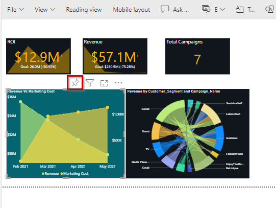

21. Similarly, **pin** the others tiles to the Dashboard

	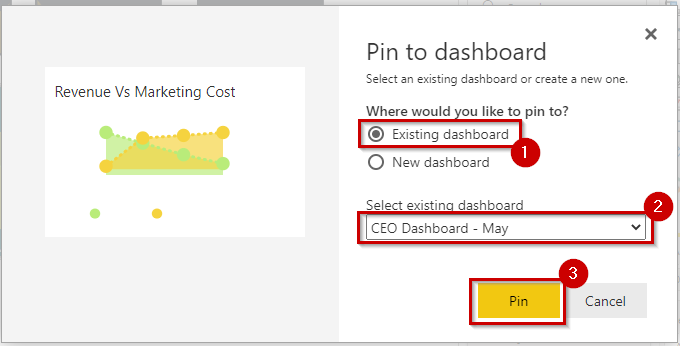
	
22. Similarly, **pin** the tiles for the 'Thermostat' to the Dashboard

23. **Select** workpace created in [Task 2](#task-2-power-bi-workspace-creation) in the left pane.

	
	
24. **Open** ‘Dashboard-Images’ report.

	
	
25. **Click** on 'REtail 270821' page.

26. **Click** on Edit.

	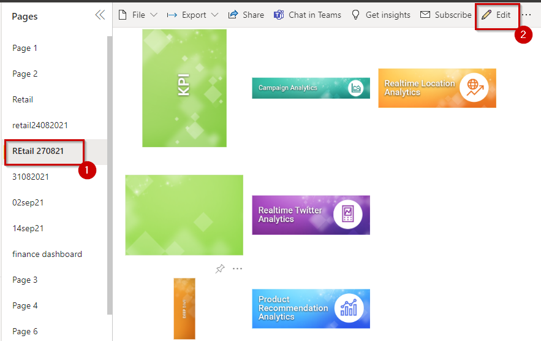
	
27. **Hover** on Deep Dive chicklet and **click** pin button.

	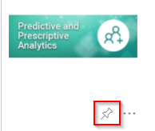
	
28. Select the ‘ADX Dashboard’ from existing dashboard list and **click** on pin.
	
	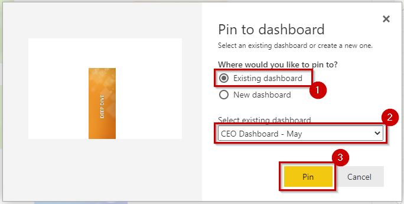

29. Similarly pin rest of the images from different tabs of the ‘Dashboard-Images’ report.
	
30. **Go back** to the ‘ADX Dashboard’ dashboard.

	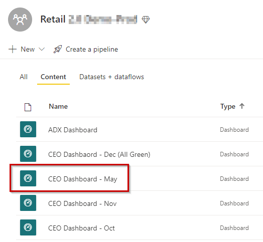
	
To hide title and subtitle for all the **images** that you have pined above. Please do the following:

31. Hover on the chiclet and **Click** on ellipsis ‘More Options’ of the image you selected.

32. **Click** on ‘Edit details’.

	
	
33. **Uncheck** ‘Display title and subtitle’.

34. **Click** on ‘Apply’.

35. **Repeat** Step 4 to 22 for all image tiles.

	
	
36. After disabling ‘Display title and subtitle’ for all images, **resize** and **rearrange** the top images tiles as shown in the screenshot. 
	
	
	
37. Similarly pin left image tiles from ‘Dashboard-Images’ of chicklets report to the ADX Dashboard.

38. **Resize** and **rearrange** the left images tiles as shown in the screenshot. Resize the KPI tile to 1x2. Resize the Deep Dive to 1x4. Resize the logo to 1x1 size; resize other vertical tiles to 2x1 size.  

	
	
**How to add Video in Dashboard:**

39. In the dashboard, **Select** Edit > Add Tiles 

	
	
	
	
40. From the Add a tile Window, **Select** Web content and Next.

	
	
41. Add information to the Web content tile window.

42. Add Display Title, Subtitle.

43. For the embedded code, **goto** storage account from the portal, go to the 'video' container and **click** on the video 'final_spatial_analysis_video_1.mp4', now **click** on the copy button for copying the video url, and finally replace the url with 'URL' in the given embedded code given below.
	
	```
	<video controls loop width="100%" ><source src=URL type="video/mp4">
	```
	
	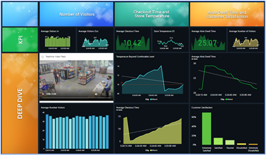
	
44. **Copy** the whole Embed code with replaced 'URL' value. 

45. **Paste** the Embed code and Select Apply. 

46. On the Dashboard resize, move the content as needed.

	

47. The Dashboard **ADX Dashboard** should finally look like this. Table in following row indicates which KPI’s need to be pinned from which report to achieve this final look.
	
	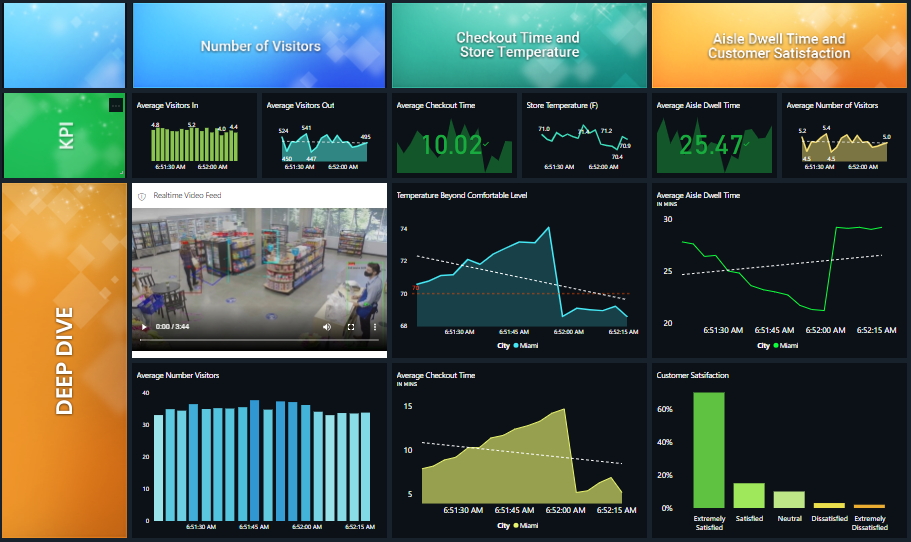

48. **Refer** to this table while pinning rest of the tiles to the dashboard.

	

49. Here is the list of Dashboards you have to create for Retail and the report to migrate to prod environment. You will see the necessary details for the same below. You must refer to the [Excel](https://github.com/microsoft/Azure-Analytics-and-AI-Engagement/blob/retail2.0/retail/KPIS%20Dashboards%20mapping%20Retail%202.0.xlsx) file for pinning the tiles to the dashboard.

	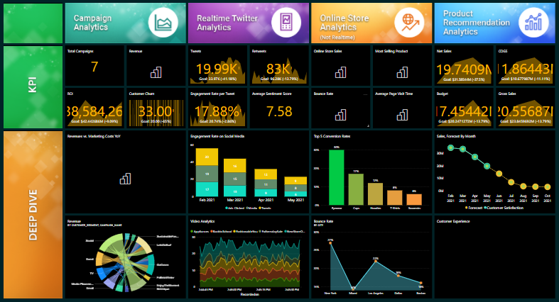

50. **CEO Dashboard - May** should look like this. Following are the details of tiles for the same.

	
	
51. **Refer** to this table while pinning rest of the tiles to the dashboard.

	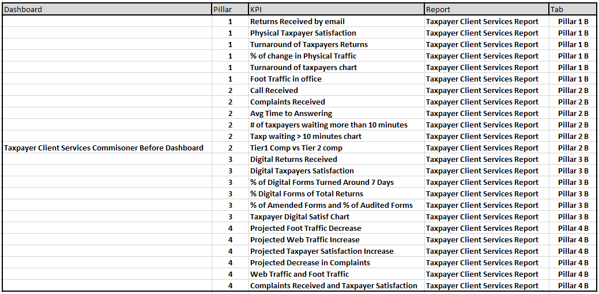

52. **CEO Dashboard - Sep** should look like this. Following are the details of tiles for the same.

	
	
53. **Refer** to this table while pinning rest of the tiles to the dashboard.	

	

54. **CEO Dashboard - Oct** should look like this. Following are the details of tiles for the same.
	
	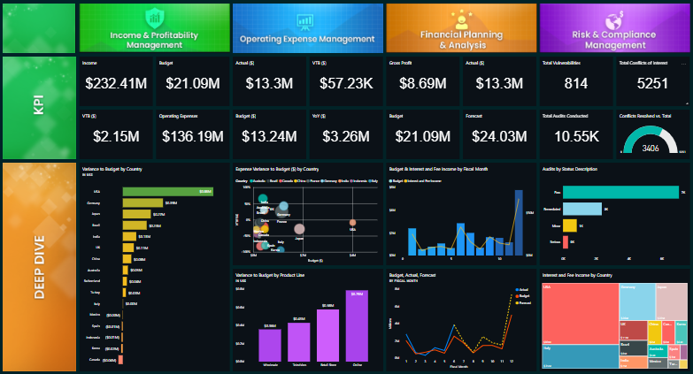
	
55. **Refer** to this table while pinning rest of the tiles to the dashboard.	

	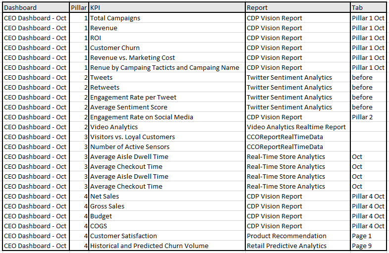

56. **CEO Dashboard - Nov** Dashboard should look like this. 

	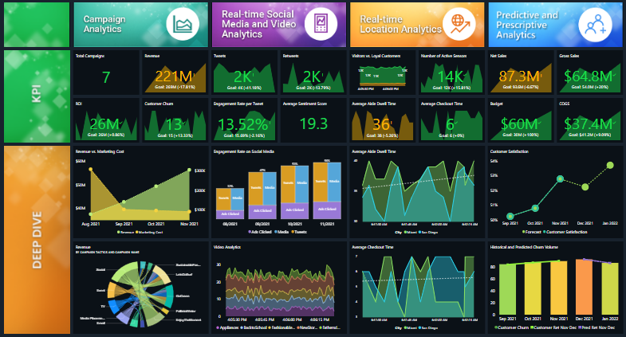
	
57. **Refer** to this table while pinning rest of the tiles to the dashboard.

	
	
58. **CEO Dashboard - Dec** Dashboard should look like this.

	
	
59. **Refer** to this table while pinning rest of the tiles to the dashboard.

	
	
60. **ESG Dashboard** Dashboard should look like this.

	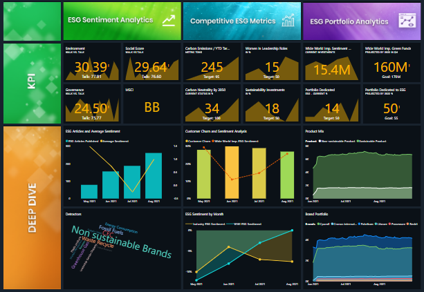
	
61. **Refer** to this table while pinning rest of the tiles to the dashboard.

	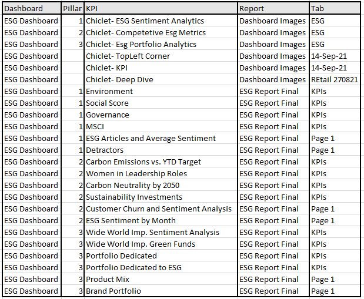
	
62. **Finance Dashboard** Dashboard should look like this.

	

63. **Refer** to this table while pinning rest of the tiles to the dashboard.

	
	
64. **VP Customer Experience Dashboard** Dashboard should look like this.

	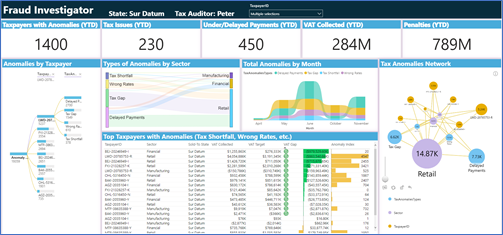

65. **Refer** to this table while pinning rest of the tiles to the dashboard.

	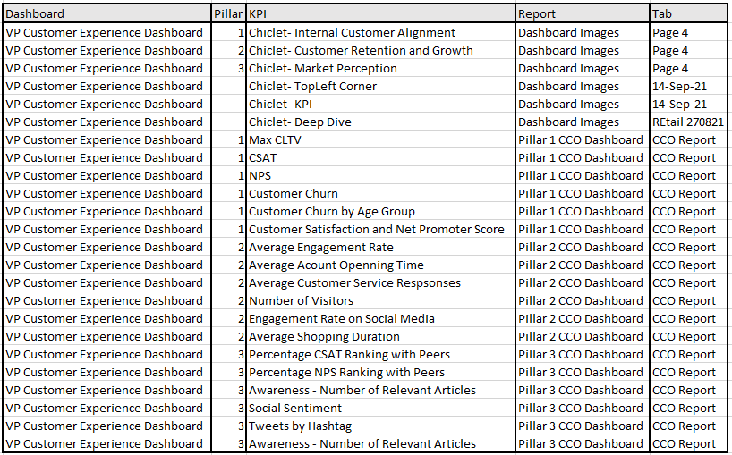

### Updating Dashboard and Report Ids in Web app

By default, the web app will be provisioned with Gif placeholders for web app screens with dashboards. Once you have completed the steps listed above in this section, you can update the dashboard id’s generated into the main web app if you choose. Here are the steps for it.

1. **Navigate** to your Power BI workspace.

2. **Click** on one of the dashboards you created. Eg. ADX Dashboard.

	

3. **Copy** the dashboard id from the url bar at the top.
	
	

4. **Navigate** to azure portal.

5. **Open** the Azure Cloud Shell by selecting its icon from the top toolbar.

	

6. **Click** on upload/download button.

7. **Click** download.

8. **Enter** the following path:  
	
	```
	retail/retail/retaildemo-app/wwwroot/config-poc.js
	```

9. **Click** Download button.

	
	
10. At the right bottom of the cloudshell screen you get a hyperlink, **click** on it.

	

11. **Edit** the downloaded file in notepad.

12. **Paste** the dashboard id you copied earlier between the double quotes of key ‘CEO Dashboard - May’.

13. **Save** the changes to the file.

	

14. **Navigate** to azure portal.

15. **Open** the Azure Cloud Shell by selecting its icon from the top toolbar.

	

16. **Click** upload/download button.

17. **Click** upload.

18. **Select** the config-poc.js file you just updated.

19. **Click** open.

	

20. **Execute** the following command in cloudshell:  
	
	```
	cp config-poc.js ./retail/retail/retaildemo-app/wwwroot
	```
	
	

21.	**Execute** the following command in cloudshell: 
	
	```
	cd retail/retail/subscripts 
	./updateWebAppSubScript.ps1
	```
	
	

22. From the Azure Cloud Shell, **copy** the authentication code. 

23. **Click** on the link [https://microsoft.com/devicelogin](https://microsoft.com/devicelogin) and a new browser window will launch.

	

24. **Paste** the authentication code.

25. **Select** appropriate username when prompted.

26. Wait for the script execution to complete.

	

> **Note:** You may be prompted to select your subscription if you have multiple subscriptions.
	
> **Note:** The setup for your Dream Demo in a Box is done here and now you can follow the demo script for testing/demoing your environment.
	
### Task 10: Pause or Resume script

> **Note:** Please perform these steps after your demo is done and you do not need the environment anymore. Also ensure you Resume the environment before demo if you paused it once. 
 
1. **Open** the Azure Portal 

2. **Click** on the Azure Cloud Shell icon from the top toolbar. 

	

**Execute** the Pause_Resume_script.ps1 script by executing the following command: 
1. **Run** Command: 
	```
	cd "retail\retail"
	```

2. Then **run** the PowerShell script: 
	```
	./pause_resume_script.ps1 
	```
	
	
	
3. From the Azure Cloud Shell, **copy** the authentication code
	
	
	
4. Click on the link [https://microsoft.com/devicelogin](https://microsoft.com/devicelogin) and a new browser window will launch.
	
5. **Paste** the authentication code.
	
	
	
6. **Select** the same user that you used for signing into the Azure Portal in [Task 1](#task-1-create-a-resource-group-in-azure). 

7. **Close** this window after it displays successful authentication message.

	

8. When prompted, **enter** the resource group name to be paused/resumed in the Azure Cloud Shell. Type the same resource group name that you created. 
	
	

9. **Enter** your choice when prompted. Enter ‘P’ for **pausing** the environment or ‘R’ for **resuming** a paused environment. 

10. Wait for the script to finish execution. 

	

### Task 11: Clean up resources

> **Note: Perform these steps after your demo is done and you do not need the resources anymore**

**Open** the Azure Portal.

1. Open the Azure Cloud Shell by **clicking** its icon from the top toolbar.

	

**Execute** the resourceCleanup.ps1 script by executing the following:

2. **Run** Command: 
	```
	cd "retail\retail"
	```

3. Then **run** the PowerShell script: 
	```
	./resource_cleanup.ps1
	```

	

4. You will now be prompted to **enter** the resource group name to be deleted in the Azure Cloud Shell. Type the same resource group name that you created in [Task 1](#task-1-create-a-resource-group-in-azure) - 'DDib-Retail-Lab'.

5. You may be prompted to select a subscription in case your account has multiple subscriptions.

	
	
	> **Notes:**
	> - The user with single subscription won't be prompted to select subscription.
	> - The subscription highlighted in yellow will be selected by default if you do not enter any disired subscription. Please select the subscription carefully, as it may break the execution further.
	> - While you are waiting for processes to get completed in the Azure Cloud Shell window, you'll be asked to enter the code three times. This is necessary for performing installation of various Azure Services and preloading content in the Azure Synapse Analytics SQL Pool tables.

6. You will now be prompted to **enter** the resource group name in the Azure Cloud Shell. Type the same resource group name that you created in [Task 1](#task-1-create-a-resource-group-in-azure). – 'DDiB-Retail-Lab'.

	

